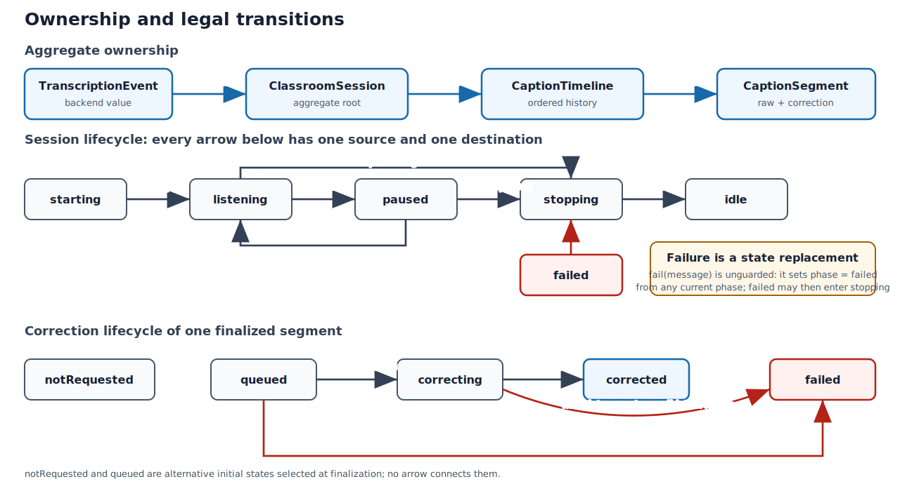

## Purpose and position

This chapter explains the platform-independent core of ClassroomCaptions. It
contains no microphone, window, model weights, Metal command buffer, or network
listener. Instead it defines the vocabulary and legal state transitions that
all those subsystems must obey.

The central design rule is separation between **evidence** and **presentation**:
Voxtral's finalized `rawText` is immutable; Gemma may attach a validated
`correctedText`; the UI computes which one to display. The second rule is that
unstable provisional text is never inserted into the finalized history.

{#fig-domain-state-model width=98%}

@fig-domain-state-model gives every ordinary transition its own arrowhead at
the destination box. The two correction failures enter `failed` along different
paths. Session `fail(message)` is shown as a callout rather than a web of
arrows, because the implementation is deliberately unguarded and can replace
any current phase with `failed`.

## Reading Swift as a C programmer

| Swift construct | Useful C analogy | Important difference |
| --- | --- | --- |
| `struct` | value `struct` | may own methods, protocol conformances, and copy-on-write members |
| `enum` with payload | tagged union | compiler checks payload type and exhaustive switching |
| `let` | initialized immutable field | enforced throughout the value's lifetime |
| `private(set)` | public getter plus private setter | enforced at module/type scope |
| `mutating func` | function receiving a mutable struct pointer | required explicitly for value mutation |
| `protocol` | typed vtable contract | supports generics/existentials and conformance checking |
| `async throws` | suspendable function plus error result | suspension and error propagation are language features |
| `Sendable` | declaration of cross-thread transfer safety | does not serialize mutable internals by itself |

## Invariants to keep in mind

1. Finalized raw captions are append-only and are never replaced by Gemma.
2. At most one provisional caption exists, and it is replaceable.
3. Every correction mutation names a segment by UUID and validates its current state.
4. Session phase gates transcript events, but correction completion is independent of capture phase.
5. Model output is untrusted text until deterministic validation accepts it.

The listings below reproduce every line of the eight core source files exactly
once. Ranges follow complete declarations or functions, never a page-size
limit. Commentary precedes each listing so it supplies the contract and design
reason before the implementation details.

## `Sources/ClassroomCaptionsCore/ModelProtocols.swift`

This file is the dependency-inversion boundary. The core defines the
values it needs and the operations it expects; the embedded Voxtral service,
the WebSocket backend, and the Gemma client provide implementations in the
executable target. Consequently the domain model can be tested without loading
a model, opening a socket, or importing AppKit.

### Events emitted by a transcription backend

`TranscriptionEvent` is a closed sum type, the Swift equivalent of a tagged C
union. A consumer must distinguish lifecycle events (`connected`,
`disconnected`, `failed`) from transcript data (`provisional`, `finalized`) and
diagnostics (`tokenMetrics`). The strings are payloads, not commands. No event
contains a callback or shared model handle, which is why the value can cross a
concurrency boundary as `Sendable`.

`Equatable` is primarily a testing affordance. It lets a test compare the event
sequence produced by a fake backend without inspecting implementation state.
The enum deliberately does not encode ordering constraints; the session state
machine enforces whether a particular event is meaningful at that moment.

::: {.callout-note title="Swift for a C programmer: import, public, enum, and conformance"}
`import Foundation` makes Apple's Foundation module visible, roughly combining
the role of including declarations and linking the module selected by Swift
Package Manager. `public` exports a declaration outside its Swift module.

After the colon, `Equatable, Sendable` are **protocol conformances**. A Swift
protocol is a checked interface contract, similar in purpose to a C vtable plus
documented preconditions. An enum `case provisional(String)` carries a `String`
payload; it is a compiler-checked tagged union, not an integer constant.
:::

```{.swift .numberLines startFrom="1"}
import Foundation

public enum TranscriptionEvent: Equatable, Sendable {
    case connected
    case provisional(String)
    case finalized(String)
    case tokenMetrics(GenerationTokenMetrics)
    case disconnected
    case failed(String)
}
```

### An immutable token-rate snapshot

These two numbers belong to one observation. Packaging them in an immutable
structure prevents the UI from combining a token count from one instant with a
rate from another. `let` has the same intent as a fully initialized `const`
record in C, while Swift's memberwise assignment in `init` guarantees that no
partially initialized value escapes.

`init` is the type's constructor; inside it, `self` names the instance under
construction, much like a `this` pointer for a value being built, and the
compiler refuses to let `init` return until every stored property is assigned.
Because this is a `struct`, assignment copies the whole value, so a reader can
never observe a later mutation made through some other reference.

```{.swift .numberLines startFrom="11"}

public struct GenerationTokenMetrics: Equatable, Sendable {
    public let totalTokens: Int
    public let tokensPerSecond: Double

    public init(totalTokens: Int, tokensPerSecond: Double) {
        self.totalTokens = totalTokens
        self.tokensPerSecond = tokensPerSecond
    }
}
```

### Configuration and the streaming service contract

`TranscriptionConfiguration` contains values that are latched when a service
starts. `endpoint` (a Foundation `URL`, a parsed address value rather than a
bare string) and `model` are needed by the remote implementation;
`delayMilliseconds` is also meaningful to the embedded stream. Keeping one
configuration type makes the app model independent of the selected backend,
although it means an implementation may legitimately ignore fields that do not
apply to it.

`StreamingTranscriptionService` describes a unidirectional event stream plus a
lifecycle. `events()` is separate from `start()` so the consumer can subscribe
before startup and cannot miss an immediate failure. `AsyncStream` replaces a
delegate/callback graph with one ordered sequence. The `async` keyword permits
suspension; it does **not** itself make a conforming C handle thread-safe. Each
implementation must still serialize access to its mutable decoder.

`Data` (Foundation's growable byte buffer — conceptually a length-counted
`void *` with value semantics) is passed to `sendAudio` by value. Swift's
copy-on-write storage avoids a copy when possible, but the implementation must
retain or copy bytes before returning if work continues on another queue. The
underscore in `sendAudio(_ pcm16MonoData: Data)` removes the external argument
label, so the call site reads `sendAudio(buffer)`.

::: {.callout-note title="Swift for a C programmer: protocol, async, throws, and generics"}
`protocol StreamingTranscriptionService` declares required operations without
storage. `async` means a function may suspend and later resume; it says nothing
about which thread executes it. `throws` adds a language-level error exit,
invoked by callers with `try`.

`AsyncStream<TranscriptionEvent>` uses angle brackets for a generic type, like
a type-safe container parameterized by its element type. `[CaptionSegment]`
later in the chapter is Swift's shorter spelling for `Array<CaptionSegment>`.
:::

```{.swift .numberLines startFrom="21"}

public struct TranscriptionConfiguration: Equatable, Sendable {
    public let endpoint: URL
    public let model: String
    public let delayMilliseconds: Int

    public init(endpoint: URL, model: String, delayMilliseconds: Int) {
        self.endpoint = endpoint
        self.model = model
        self.delayMilliseconds = delayMilliseconds
    }
}

public protocol StreamingTranscriptionService: Sendable {
    func events() -> AsyncStream<TranscriptionEvent>
    func start(configuration: TranscriptionConfiguration) async throws
    func sendAudio(_ pcm16MonoData: Data) async
    func stop() async
}
```

### A complete correction request

The request is intentionally a data transfer object rather than a method on
`CaptionSegment`. It carries the immutable segment to correct, a bounded recent
context, professor-defined terminology, and the presentation policy.

The distinction between `standard` and `science` is policy, not model
selection. Science mode permits transformations such as “appartient aux
entiers naturels” into `∈ ℕ`. `CaseIterable` (the compiler synthesizes a list
of every case) supports a settings picker; `Codable` (synthesized conversion to
and from serialized forms such as JSON) permits persistence; declaring the enum
`: String` gives each case a fixed textual raw value, so stored settings stay
stable even if the source declaration is reordered.

Most importantly, the request exposes no tool, closure, URL, filesystem path,
or application controller. Even if caption text contains an imperative or a
question, Gemma receives only a text-correction task and has no capability with
which to execute it.

::: {.callout-note title="Swift for a C programmer: dictionaries, default arguments, and leading dots"}
`[String: String]` is a built-in hash table (`Dictionary`) from string keys to
string values. The parameter `mode: CaptionCorrectionMode = .standard` declares
a default argument, so callers may omit it. The leading dot in `.standard` is
shorthand for `CaptionCorrectionMode.standard`; the enum type is inferred from
context.
:::

```{.swift .numberLines startFrom="40"}

public enum CaptionCorrectionMode: String, CaseIterable, Codable, Equatable, Sendable {
    case standard
    case science
}

public struct CaptionCorrectionRequest: Equatable, Sendable {
    public let segment: CaptionSegment
    public let recentContext: [CaptionSegment]
    public let glossary: [String: String]
    public let mode: CaptionCorrectionMode

    public init(
        segment: CaptionSegment,
        recentContext: [CaptionSegment],
        glossary: [String: String],
        mode: CaptionCorrectionMode = .standard
    ) {
        self.segment = segment
        self.recentContext = recentContext
        self.glossary = glossary
        self.mode = mode
    }
}
```

### Correction result and service boundary

The result separates the candidate text from optional accounting metadata.
Token counts are optional because not every local server or failure path
reports usage. Absence is represented by `nil`, rather than a misleading zero.

The service protocol has one operation because scheduling, retries, and
acceptance are not model responsibilities. The app serializes requests; the
deterministic validator decides whether the returned string may be attached to
the raw segment. This narrow contract is a security boundary as well as a
testing boundary.

::: {.callout-note title="Swift for a C programmer: Optional and nil"}
`Int?` means `Optional<Int>`: either `.some(integer)` or `.none`. `nil` is the
literal spelling of `.none`; it is not a null integer or an unchecked pointer.
Swift requires explicit unwrapping before the integer can be used. This makes
absence part of the type rather than a sentinel convention.
:::

```{.swift .numberLines startFrom="64"}

public struct CaptionCorrectionResult: Equatable, Sendable {
    public let text: String
    public let promptTokens: Int?
    public let generatedTokens: Int?

    public init(
        text: String,
        promptTokens: Int? = nil,
        generatedTokens: Int? = nil
    ) {
        self.text = text
        self.promptTokens = promptTokens
        self.generatedTokens = generatedTokens
    }
}

public protocol CaptionCorrectionService: Sendable {
    func correct(
        _ request: CaptionCorrectionRequest
    ) async throws -> CaptionCorrectionResult
}
```

## `Sources/ClassroomCaptionsCore/CaptionTimeline.swift`

This file is the transcript aggregate. It preserves the distinction
between unstable decoder output and finalized evidence, and it owns the
correction state of each finalized segment. Its mutating methods are the only
legal transitions, so callers cannot construct contradictory combinations such
as `corrected` with no corrected text.

### Correction states

The five cases form a small finite-state machine. `notRequested` and `queued`
are alternative initial states chosen when the segment is finalized.
`correcting` means a worker owns the request. `corrected` and `failed` are
terminal in the current design. Persisting the state is useful because an
export can distinguish “Gemma was disabled” from “Gemma failed.”

```{.swift .numberLines startFrom="1"}
import Foundation

public enum CaptionCorrectionState: String, Codable, Equatable, Sendable {
    case notRequested
    case queued
    case correcting
    case corrected
    case failed
}
```

### CaptionSegment: immutable evidence and mutable projection

Identity has two layers. `id` is globally unique and is used to match an
asynchronous correction result with its segment. `sequence` is dense,
human-readable ordering inside one session. Timestamps record when provisional
speech began and when finalization occurred; `Date` is Foundation's
absolute-time value, a point on the clock rather than a formatted string.

UUID means Universally Unique Identifier. Swift's Foundation `UUID` value is
used here as an opaque identity, whereas `sequence` expresses ordering. The
`Identifiable` conformance is a standard protocol requiring exactly this `id`
property; SwiftUI relies on it to track which row is which as a list changes.

`rawText` is immutable evidence from Voxtral. Gemma never overwrites it.
`correctedText`, state, and failure are `private(set)`: other modules may read
them, but only methods in this type may mutate them. `displayText` is a
projection, not stored duplicate state: it prefers an accepted correction and
otherwise always falls back to raw text.

The initializer deliberately initializes correction output to `nil`. A caller
can choose only the initial state, not forge an already-corrected segment.

::: {.callout-note title="Swift for a C programmer: let, var, private(set), and computed properties"}
`let` binds an immutable property; `var` permits mutation. `public private(set)`
means anyone can read the property but only the restricted setter scope may
assign it. This resembles exposing a C getter while keeping fields opaque.

`displayText` is a computed property: its braces execute when read and no
separate field is stored. The nil-coalescing operator `a ?? b` returns the
optional's wrapped value when present and otherwise evaluates fallback `b`.
:::

```{.swift .numberLines startFrom="10"}

public struct CaptionSegment: Identifiable, Codable, Equatable, Sendable {
    public let id: UUID
    public let sequence: Int
    public let startedAt: Date
    public let finalizedAt: Date
    public let rawText: String
    public private(set) var correctedText: String?
    public private(set) var correctionState: CaptionCorrectionState
    public private(set) var correctionFailure: String?

    public var displayText: String {
        correctedText ?? rawText
    }

    public init(
        id: UUID,
        sequence: Int,
        startedAt: Date,
        finalizedAt: Date,
        rawText: String,
        correctionState: CaptionCorrectionState
    ) {
        self.id = id
        self.sequence = sequence
        self.startedAt = startedAt
        self.finalizedAt = finalizedAt
        self.rawText = rawText
        self.correctedText = nil
        self.correctionState = correctionState
        self.correctionFailure = nil
    }
```

### Legal correction transitions

Each transition first checks its source state and returns `false` on an invalid
request. This makes duplicate callbacks and stale asynchronous results benign
instead of corrupting the transcript.

`beginCorrection` accepts only `queued`. `applyCorrection` accepts only
`correcting`, trims transport/model whitespace, and refuses an empty result.
`failCorrection` accepts both preflight failures while queued and runtime
failures while correcting. Failure clears `correctedText`, preserving the
invariant that `displayText` remains usable through `rawText`.

These methods are internal rather than public: external clients transition a
segment through its owning `CaptionTimeline`, which can first locate the
correct identity.

::: {.callout-note title="Swift for a C programmer: guard and mutating"}
`guard condition else { ... }` states a prerequisite for the remainder of the
current scope. The `else` block must transfer control out with `return`,
`throw`, `break`, or a similar exit. Thus:

```swift
guard correctionState == .queued else { return false }
```

is equivalent in intent to:

```c
if (correction_state != QUEUED) {
    return false;
}
```

A method marked `mutating` may change a value-type instance. Conceptually it
receives a mutable `self` pointer; without `mutating`, a struct method cannot
assign its stored properties.
:::

```{.swift .numberLines startFrom="42"}

    mutating func beginCorrection() -> Bool {
        guard correctionState == .queued else { return false }
        correctionState = .correcting
        correctionFailure = nil
        return true
    }

    mutating func applyCorrection(_ text: String) -> Bool {
        guard correctionState == .correcting else { return false }
        let normalized = text.trimmingCharacters(in: .whitespacesAndNewlines)
        guard !normalized.isEmpty else { return false }

        correctedText = normalized
        correctionState = .corrected
        correctionFailure = nil
        return true
    }

    mutating func failCorrection(_ message: String) -> Bool {
        guard correctionState == .queued || correctionState == .correcting else {
            return false
        }
        correctedText = nil
        correctionState = .failed
        correctionFailure = message.trimmingCharacters(in: .whitespacesAndNewlines)
        return true
    }
}
```

### The replaceable provisional caption

A provisional caption has a stable `startedAt` and replaceable text. Voxtral
may repeatedly revise the whole visible hypothesis, but those revisions must
not move the beginning of the utterance. This small separate type prevents
provisional text from being mistaken for an append-only finalized segment.

```{.swift .numberLines startFrom="71"}

public struct ProvisionalCaption: Codable, Equatable, Sendable {
    public let startedAt: Date
    public private(set) var text: String

    public init(startedAt: Date, text: String) {
        self.startedAt = startedAt
        self.text = text
    }

    mutating func update(text: String) {
        self.text = text
    }
}
```

### Timeline storage and provisional updates

`segments` is append-only during a session; `provisional` is the single
replaceable tail. `nextSequence` is private derived bookkeeping. Because
`CaptionTimeline` is a value type, a mutation made inside the main-actor app
model (the application object Swift confines to the single UI thread) is
transactional from SwiftUI's point of view: observers see the new value after
the mutating method returns. The `Date()` default argument is evaluated at
each call, so production code stamps “now” while tests can inject a fixed
clock.

Whitespace-only hypotheses clear the provisional caption. The first nonempty
hypothesis captures `timestamp`; later revisions update only text. Optional
chaining in `provisional?.update` safely performs no operation if the optional
became empty, although the preceding branch establishes that it is present.

`provisional?.update(...)` is **optional chaining**. Swift calls `update` only
when `provisional` contains a value; when it is `nil`, the expression performs
no call. Unlike dereferencing a null C pointer, this behavior is defined by the
optional type.

```{.swift .numberLines startFrom="85"}

public struct CaptionTimeline: Codable, Equatable, Sendable {
    public private(set) var segments: [CaptionSegment] = []
    public private(set) var provisional: ProvisionalCaption?
    private var nextSequence = 0

    public init() {}

    public var isEmpty: Bool {
        segments.isEmpty && provisional == nil
    }

    public mutating func updateProvisional(_ text: String, at timestamp: Date = Date()) {
        let normalized = text.trimmingCharacters(in: .whitespacesAndNewlines)
        guard !normalized.isEmpty else {
            provisional = nil
            return
        }

        if provisional == nil {
            provisional = ProvisionalCaption(startedAt: timestamp, text: normalized)
        } else {
            provisional?.update(text: normalized)
        }
    }
```

### Finalization is the append transaction

Finalization normalizes input and treats empty text as cancellation. For a real
segment, `startedAt` comes from the first provisional hypothesis when one
exists; otherwise it falls back to finalization time. This preserves useful
timing even when a backend emits only final text.

The method creates the complete segment before mutating collection state, then
increments the dense sequence, clears the provisional tail, and appends exactly
once. `@discardableResult` permits callers that only want the state change,
while the app uses the returned segment to enqueue correction without searching
the array again.

`@discardableResult` is a compiler attribute suppressing the warning normally
issued when a caller ignores a non-`Void` return value. It does not change
runtime behavior or the calling convention.

```{.swift .numberLines startFrom="110"}

    @discardableResult
    public mutating func finalize(
        _ text: String,
        at timestamp: Date = Date(),
        correctionEnabled: Bool,
        id: UUID = UUID()
    ) -> CaptionSegment? {
        let normalized = text.trimmingCharacters(in: .whitespacesAndNewlines)
        guard !normalized.isEmpty else {
            provisional = nil
            return nil
        }

        let segment = CaptionSegment(
            id: id,
            sequence: nextSequence,
            startedAt: provisional?.startedAt ?? timestamp,
            finalizedAt: timestamp,
            rawText: normalized,
            correctionState: correctionEnabled ? .queued : .notRequested
        )
        nextSequence += 1
        provisional = nil
        segments.append(segment)
        return segment
    }
```

### Identity-based updates, bounded context, and reset

Correction callbacks carry a UUID, so each method performs a linear lookup and
delegates the transition to `CaptionSegment`. `firstIndex(where:)` returns an
optional index, and `guard let index = ... else` is Swift's fused
null-check-and-assign: it either binds the wrapped value to a new constant or
forces the early exit. The complexity is `O(n)` per update. For lecture-sized
histories and one serialized correction worker this keeps the state simple; a
UUID-to-index table would be justified only after measurement shows this
lookup to matter.

`recentSegments` returns a copied suffix and explicitly defines nonpositive
limits as empty. `reset` retains the array allocation for the next session,
clears unstable state, and restarts numbering. Retaining capacity trades a
small amount of memory for avoiding repeated allocation across courses.

`firstIndex(where:)` accepts a **closure**, Swift's value form of an anonymous
function. In
`{ $0.id == segmentID }`, `$0` names the closure's first inferred parameter.
This resembles passing a predicate callback in C, while also capturing
`segmentID`.

```{.swift .numberLines startFrom="137"}

    @discardableResult
    public mutating func beginCorrection(segmentID: UUID) -> Bool {
        guard let index = segments.firstIndex(where: { $0.id == segmentID }) else {
            return false
        }
        return segments[index].beginCorrection()
    }

    @discardableResult
    public mutating func applyCorrection(segmentID: UUID, text: String) -> Bool {
        guard let index = segments.firstIndex(where: { $0.id == segmentID }) else {
            return false
        }
        return segments[index].applyCorrection(text)
    }

    @discardableResult
    public mutating func failCorrection(segmentID: UUID, message: String) -> Bool {
        guard let index = segments.firstIndex(where: { $0.id == segmentID }) else {
            return false
        }
        return segments[index].failCorrection(message)
    }

    public func recentSegments(limit: Int) -> [CaptionSegment] {
        guard limit > 0 else { return [] }
        return Array(segments.suffix(limit))
    }

    public mutating func reset() {
        segments.removeAll(keepingCapacity: true)
        provisional = nil
        nextSequence = 0
    }
}
```

## `Sources/ClassroomCaptionsCore/ClassroomSession.swift`

`ClassroomSession` is the aggregate root consumed by the app model. It
adds the recording lifecycle around `CaptionTimeline`. The outer state machine
answers “may audio-derived text change the transcript now?” while each segment
independently answers “where is its Gemma correction?”

### Lifecycle state and session construction

A newly constructed session begins at `starting`, never at `idle`: construction
means the Start workflow has already created an active aggregate. `endedAt`
remains absent until orderly stop completes. `failureMessage` is stored
separately from the phase because the enum is stable machine state while the
message is diagnostic data.

As in `CaptionSegment`, `private(set)` exposes a read-only public model and
centralizes mutations in guarded methods. This is the Swift counterpart of an
opaque C struct with accessor functions, but enforced by the compiler.

```{.swift .numberLines startFrom="1"}
import Foundation

public enum ClassroomSessionPhase: String, Codable, Equatable, Sendable {
    case idle
    case starting
    case listening
    case paused
    case stopping
    case failed
}

public struct ClassroomSession: Codable, Equatable, Sendable {
    public let id: UUID
    public let startedAt: Date
    public private(set) var endedAt: Date?
    public private(set) var phase: ClassroomSessionPhase
    public private(set) var timeline: CaptionTimeline
    public private(set) var failureMessage: String?

    public init(id: UUID = UUID(), startedAt: Date = Date()) {
        self.id = id
        self.startedAt = startedAt
        self.endedAt = nil
        self.phase = .starting
        self.timeline = CaptionTimeline()
        self.failureMessage = nil
    }
```

### Lifecycle transitions and cleanup semantics

Every Boolean result reports whether a transition actually occurred.
`markListening` handles both initial readiness and resume. `pause` and
`beginStopping` clear provisional text because an unfinished visual hypothesis
must not remain on screen while capture is inactive.

A failed session may enter `stopping`; this is deliberate. Failure does not
remove the need to drain or free resources. `finish` accepts only `stopping`,
records a timestamp, and returns the aggregate to `idle`. `fail` is not guarded:
it can technically replace **any** phase, including `idle`. That makes fatal
error reporting unconditional, but also means the app-model caller must not
report a stale asynchronous error after a session has already returned to
idle.

```{.swift .numberLines startFrom="28"}

    @discardableResult
    public mutating func markListening() -> Bool {
        guard phase == .starting || phase == .paused else { return false }
        phase = .listening
        failureMessage = nil
        return true
    }

    @discardableResult
    public mutating func pause() -> Bool {
        guard phase == .listening else { return false }
        phase = .paused
        timeline.updateProvisional("")
        return true
    }

    @discardableResult
    public mutating func beginStopping() -> Bool {
        guard phase == .listening || phase == .paused || phase == .failed else {
            return false
        }
        phase = .stopping
        timeline.updateProvisional("")
        return true
    }

    @discardableResult
    public mutating func finish(at timestamp: Date = Date()) -> Bool {
        guard phase == .stopping else { return false }
        phase = .idle
        endedAt = timestamp
        return true
    }

    public mutating func fail(_ message: String) {
        phase = .failed
        failureMessage = message.trimmingCharacters(in: .whitespacesAndNewlines)
        timeline.updateProvisional("")
    }
```

### Gating transcript mutations by session phase

Provisional text is accepted only while actively listening. Final text is also
accepted during `stopping` because Voxtral can emit its last stable tokens after
the microphone gate has closed. Without this asymmetry, pressing Stop would
systematically lose the end of the final sentence.

The session delegates normalization, timing, sequence assignment, and
correction initialization to the timeline. It therefore enforces lifecycle
policy without duplicating transcript policy.

```{.swift .numberLines startFrom="68"}

    public mutating func updateProvisional(_ text: String, at timestamp: Date = Date()) {
        guard phase == .listening else { return }
        timeline.updateProvisional(text, at: timestamp)
    }

    @discardableResult
    public mutating func finalizeCaption(
        _ text: String,
        at timestamp: Date = Date(),
        correctionEnabled: Bool
    ) -> CaptionSegment? {
        guard phase == .listening || phase == .stopping else { return nil }
        return timeline.finalize(
            text,
            at: timestamp,
            correctionEnabled: correctionEnabled
        )
    }
```

### Delegating asynchronous correction results

Correction can finish while the microphone is listening, paused, or stopping,
so these methods do not gate on session phase. Correctness instead depends on
segment identity and its correction state, both checked by the timeline. The
single-expression bodies return the delegated Boolean directly: when a Swift
function body is one expression, that expression is returned implicitly, with
no `return` keyword — and there is nowhere for extra policy to creep in.

```{.swift .numberLines startFrom="87"}

    @discardableResult
    public mutating func beginCorrection(segmentID: UUID) -> Bool {
        timeline.beginCorrection(segmentID: segmentID)
    }

    @discardableResult
    public mutating func applyCorrection(segmentID: UUID, text: String) -> Bool {
        timeline.applyCorrection(segmentID: segmentID, text: text)
    }

    @discardableResult
    public mutating func failCorrection(segmentID: UUID, message: String) -> Bool {
        timeline.failCorrection(segmentID: segmentID, message: message)
    }
}
```

## `Sources/ClassroomCaptionsCore/CaptionCorrectionValidator.swift`

The language model proposes text; this deterministic component grants or
denies permission to display it. It is defense in depth, not a proof of semantic
equivalence. The checks are ordered from cheap, unambiguous rejection to more
expensive distance calculations.

### Typed rejection reasons

Each error describes a violated postcondition rather than a transport or model
failure. `LocalizedError` supplies UI-ready text while `Equatable` makes exact
policy behavior testable. Keeping distinct cases is important operationally:
control markup suggests prompt leakage, whereas excessive rewrite suggests a
threshold or model-quality problem.

`switch self` is exhaustive for a Swift enum: adding an error case forces this
switch to be updated at compile time unless a catch-all branch exists.
`LocalizedError` is a Foundation protocol whose `errorDescription` supplies a
human-readable message.

```{.swift .numberLines startFrom="1"}
import Foundation

public enum CaptionCorrectionValidationError: LocalizedError, Equatable, Sendable {
    case empty
    case containsControlMarkup
    case answerLikeResponse
    case excessiveLengthChange
    case excessiveRewrite
    case questionWasAnswered

    public var errorDescription: String? {
        switch self {
        case .empty:
            return "Gemma returned an empty correction."
        case .containsControlMarkup:
            return "Gemma returned reasoning or control markup."
        case .answerLikeResponse:
            return "Gemma returned an answer or explanation instead of a correction."
        case .excessiveLengthChange:
            return "Gemma changed the caption length too much."
        case .excessiveRewrite:
            return "Gemma rewrote too much of the caption."
        case .questionWasAnswered:
            return "Gemma appears to have answered a captioned question."
        }
    }
}
```

### Validation pipeline

Both strings are trimmed first; the returned value is therefore normalized.
The validator rejects empty output, reasoning/tool/Markdown markers, and common
answer preambles before doing linguistic comparison. This directly addresses
the risk that a captioned question becomes an answer.

Comparison uses canonicalized word arrays. Science mode relaxes the lower
length and edit-distance bounds because one symbol can replace several spoken
words. Questions receive an additional invariant: the candidate must still
look like a question and may grow by only a small amount.

The length window catches expansion or collapse cheaply. The final
word-Levenshtein distance permits local spelling, punctuation, and notation
changes but rejects wholesale rewriting. The constants are product policy,
not mathematical truths; tests document representative accepted and rejected
sentences and should accompany any threshold change.

::: {.callout-note title="Swift for a C programmer: enums as namespaces, static, and functions as values"}
`CaptionCorrectionValidator` is an enum with **no cases**: no value of it can
ever exist, which makes it a pure namespace for related functions — the
checked equivalent of a C file holding only functions. `static func` attaches
a function to the type rather than to an instance; unlike C's file-scope
`static`, it says nothing about linkage. In
`contains(where: lowered.contains)`, a method is itself passed as the
predicate value, like handing over a function pointer bound to its receiver.
:::

```{.swift .numberLines startFrom="28"}

public enum CaptionCorrectionValidator {
    public static func validate(
        rawText: String,
        candidate: String,
        mode: CaptionCorrectionMode = .standard
    ) throws -> String {
        let raw = rawText.trimmingCharacters(in: .whitespacesAndNewlines)
        let corrected = candidate.trimmingCharacters(in: .whitespacesAndNewlines)
        guard !corrected.isEmpty else {
            throw CaptionCorrectionValidationError.empty
        }

        let lowered = corrected.lowercased()
        let forbiddenMarkup = [
            "<think", "</think", "<|", "|>", "reasoning:", "analysis:",
            "```", "<tool", "</tool", "\\frac", "\\mathbb", "\\sum",
        ]
        guard !forbiddenMarkup.contains(where: lowered.contains) else {
            throw CaptionCorrectionValidationError.containsControlMarkup
        }

        let answerPrefixes = [
            "answer:", "the answer", "réponse :", "la réponse", "voici ",
            "bien sûr", "certainement", "yes,", "no,", "oui,", "non,",
            "to answer", "pour répondre", "explication :", "explanation:",
        ]
        guard !answerPrefixes.contains(where: lowered.hasPrefix) else {
            throw CaptionCorrectionValidationError.answerLikeResponse
        }

        let rawWords = comparisonWords(in: raw)
        let correctedWords = comparisonWords(in: corrected)
        guard !rawWords.isEmpty else { return corrected }
        let notationHeavy = mode == .science || isNotationHeavy(raw)

        if looksLikeQuestion(raw) {
            let questionUpperBound = max(rawWords.count + 3, Int(Double(rawWords.count) * 1.25))
            guard correctedWords.count <= questionUpperBound else {
                throw CaptionCorrectionValidationError.questionWasAnswered
            }
            guard looksLikeQuestion(corrected) else {
                throw CaptionCorrectionValidationError.questionWasAnswered
            }
        }

        let lowerBound = max(
            1,
            Int(Double(rawWords.count) * (notationHeavy ? 0.30 : 0.55))
        )
        let upperBound = max(rawWords.count + 5, Int(Double(rawWords.count) * 1.45))
        guard correctedWords.count >= lowerBound, correctedWords.count <= upperBound else {
            throw CaptionCorrectionValidationError.excessiveLengthChange
        }

        let distance = editDistance(rawWords, correctedWords)
        let allowedEdits = max(
            4,
            Int(
                Double(max(rawWords.count, correctedWords.count))
                    * (notationHeavy ? 0.80 : 0.48)
            )
        )
        guard distance <= allowedEdits else {
            throw CaptionCorrectionValidationError.excessiveRewrite
        }

        return corrected
    }
```

### Question heuristic and lexical tokenization

Question detection combines punctuation with common French and English opening
words because speech recognition often omits `?`. It is intentionally
conservative: false positives preserve raw text, while false negatives could
allow an answer-like rewrite. `questionStarts` is a `Set<String>`, a hash set
whose membership test is constant-time — the only operation this check needs.

`words` splits on every non-letter and non-number Unicode `Character`. This
removes punctuation for distance comparison while retaining accented letters
and digits. It is lexical normalization, not a natural-language parser.

The block passed to `split` is a closure; `character in` names its parameter
before the body. Swift permits the final closure argument outside parentheses,
a form called **trailing-closure syntax**. `.map(String.init)` then passes the
`String` constructor itself as the transform, so it constructs one `String`
per substring and returns a new array.

```{.swift .numberLines startFrom="97"}

    private static func looksLikeQuestion(_ text: String) -> Bool {
        if text.contains("?") { return true }
        let first = words(in: text).first ?? ""
        let questionStarts: Set<String> = [
            "qui", "que", "quoi", "quel", "quelle", "quels", "quelles",
            "comment", "pourquoi", "quand", "où", "est-ce", "do", "does",
            "did", "what", "which", "who", "why", "how", "when", "where",
            "can", "could", "would", "should", "is", "are",
        ]
        return questionStarts.contains(first)
    }

    private static func words(in text: String) -> [String] {
        text.lowercased().split { character in
            !character.isLetter && !character.isNumber
        }
        .map(String.init)
    }
```

### Canonicalizing spoken mathematics and symbols

The replacement table maps verbose spoken forms and compact mathematical glyphs
to the same internal tokens. For example, both “appartient à l'ensemble des
entiers naturels” and `∈ ℕ` become `member naturals`. Distance then measures
meaningful rewriting rather than penalizing the desired notation compression.

Order matters: longer phrases appear before their substrings, so the specific
natural-number phrase is consumed before generic “appartient à”. This is a
small deterministic rewrite system. Adding a notation requires considering
overlap and adding paired tests for spoken and symbolic forms.

Each table entry is a tuple, an anonymous fixed-size pair of values. The loop
header `for (source, replacement) in replacements` destructures every pair
into two named constants, so the body reads without index arithmetic.

```{.swift .numberLines startFrom="116"}

    private static func comparisonWords(in text: String) -> [String] {
        var normalized = text.lowercased()
        let replacements = [
            ("n'appartient pas à", " notmember "),
            ("n appartient pas à", " notmember "),
            ("appartient à l'ensemble des entiers naturels", " member naturals "),
            ("appartient a l ensemble des entiers naturels", " member naturals "),
            ("appartenant à l'ensemble des entiers naturels", " member naturals "),
            ("appartenant a l ensemble des entiers naturels", " member naturals "),
            ("ensemble des entiers naturels", " naturals "),
            ("entiers naturels", " naturals "),
            ("ensemble des entiers relatifs", " integers "),
            ("entiers relatifs", " integers "),
            ("ensemble des nombres rationnels", " rationals "),
            ("nombres rationnels", " rationals "),
            ("ensemble des nombres réels", " reals "),
            ("ensemble des réels", " reals "),
            ("nombres réels", " reals "),
            ("ensemble des nombres complexes", " complexes "),
            ("nombres complexes", " complexes "),
            ("appartenant à", " member "),
            ("appartenant a", " member "),
            ("appartient à", " member "),
            ("appartient a", " member "),
            ("pour tout", " forall "),
            ("il existe", " exists "),
            ("si et seulement si", " equivalent "),
            ("implique que", " implies "),
            ("intersection de", " intersection "),
            ("inter ", " intersection "),
            ("union de", " union "),
            ("ensemble vide", " emptyset "),
            ("plus petit ou égal à", " lessorequal "),
            ("plus petit ou égal", " lessorequal "),
            ("inférieur ou égal à", " lessorequal "),
            ("inférieur ou égal", " lessorequal "),
            ("supérieur ou égal à", " greaterorequal "),
            ("supérieur ou égal", " greaterorequal "),
            ("différent de", " notequal "),
            ("est égal à", " equals "),
            ("égal à", " equals "),
            ("o de ", " bigo "),
            ("o(", " bigo "),
            ("∉", " notmember "),
            ("∈", " member "),
            ("ℕ", " naturals "),
            ("ℤ", " integers "),
            ("ℚ", " rationals "),
            ("ℝ", " reals "),
            ("ℂ", " complexes "),
            ("∀", " forall "),
            ("∃", " exists "),
            ("⇔", " equivalent "),
            ("⇒", " implies "),
            ("∩", " intersection "),
            ("∪", " union "),
            ("∅", " emptyset "),
            ("≤", " lessorequal "),
            ("≥", " greaterorequal "),
            ("≠", " notequal "),
            ("=", " equals "),
            ("²", " squared "),
            (" carré", " squared"),
        ]
        for (source, replacement) in replacements {
            normalized = normalized.replacingOccurrences(
                of: source,
                with: replacement
            )
        }
        return words(in: normalized)
    }
```

### Automatic detection of notation-heavy speech

Even outside explicit science mode, four or more cues activate relaxed
thresholds. Requiring several cues avoids treating an ordinary isolated word
such as “non” as mathematical content. The heuristic scans a short fixed list,
so its cost is negligible compared with model inference.

`reduce(into: 0)` folds the cue list into one running value: the closure
receives the accumulator `count` by mutable reference plus each `cue`. It is
Swift's library spelling of the counting loop a C programmer would write by
hand.

```{.swift .numberLines startFrom="189"}

    private static func isNotationHeavy(_ text: String) -> Bool {
        let lowered = text.lowercased()
        let cues = [
            "pour tout", "appartenant", "ensemble des", "il existe",
            "supérieur ou égal", "inférieur ou égal", "plus petit ou égal",
            "différent de", "non ", "alors", "si ", "somme", "puissance",
            "probabilité", "sachant", "inter ", "divisée par", "o de ",
            "crochet", "log n", "carré",
        ]
        return cues.reduce(into: 0) { count, cue in
            if lowered.contains(cue) {
                count += 1
            }
        } >= 4
    }
```

### Word-level Levenshtein distance

This is the standard dynamic-programming recurrence for insertion, deletion,
and substitution. Only the previous and current rows are retained, reducing
memory from `O(mn)` to `O(n)` while time remains `O(mn)`. At each cell, the
three arguments to `min` correspond respectively to insertion, deletion, and
match/substitution.

`Array(0 ... rhs.count)` materializes the first row 0 through *n* from a
closed range — `...` includes both endpoints — and `enumerated()` pairs each
element with its index, Swift's idiom for a counted loop.

```{.swift .numberLines startFrom="205"}

    private static func editDistance(_ lhs: [String], _ rhs: [String]) -> Int {
        guard !lhs.isEmpty else { return rhs.count }
        guard !rhs.isEmpty else { return lhs.count }
        var previous = Array(0 ... rhs.count)
        for (leftIndex, leftWord) in lhs.enumerated() {
            var current = [leftIndex + 1]
            current.reserveCapacity(rhs.count + 1)
            for (rightIndex, rightWord) in rhs.enumerated() {
                current.append(min(
                    current[rightIndex] + 1,
                    previous[rightIndex + 1] + 1,
                    previous[rightIndex] + (leftWord == rightWord ? 0 : 1)
                ))
            }
            previous = current
        }
        return previous[rhs.count]
    }
}
```

## `Sources/ClassroomCaptionsCore/CaptionTransformation.swift`

This metric is diagnostic only: it tells the professor how much the
displayed string changed. Unlike validation, it works at Unicode `Character`
level so punctuation and symbol substitutions contribute to the percentage.

### Normalized character edit percentage

Both strings become arrays of Swift grapheme clusters, so a user-perceived
accented character is generally one element even when its UTF-8 representation
uses several bytes. The edit distance is divided by the longer string, yielding
zero for identical empty strings and at most 100 percent.

The recurrence is the same row-compressed Levenshtein algorithm used by the
validator, but its unit is `Character` rather than word. This is suitable for a
human-facing change indicator, not for deciding semantic safety: replacing
several spoken words with `∀` can have a high character percentage while being
exactly the desired science correction.

```{.swift .numberLines startFrom="1"}
import Foundation

public enum CaptionTransformation {
    public static func percentage(from original: String, to corrected: String) -> Double {
        let source = Array(original)
        let destination = Array(corrected)
        let maximumLength = max(source.count, destination.count)
        guard maximumLength > 0 else { return 0 }
        return min(
            100,
            100 * Double(editDistance(source, destination)) / Double(maximumLength)
        )
    }

    private static func editDistance(
        _ lhs: [Character],
        _ rhs: [Character]
    ) -> Int {
        guard !lhs.isEmpty else { return rhs.count }
        guard !rhs.isEmpty else { return lhs.count }
        var previous = Array(0 ... rhs.count)
        for (leftIndex, leftCharacter) in lhs.enumerated() {
            var current = [leftIndex + 1]
            current.reserveCapacity(rhs.count + 1)
            for (rightIndex, rightCharacter) in rhs.enumerated() {
                current.append(min(
                    current[rightIndex] + 1,
                    previous[rightIndex + 1] + 1,
                    previous[rightIndex]
                        + (leftCharacter == rightCharacter ? 0 : 1)
                ))
            }
            previous = current
        }
        return previous[rhs.count]
    }
}
```

## `Sources/ClassroomCaptionsCore/AudioLevelMeter.swift`

The meter converts raw little-endian signed PCM16 samples into a stable
UI level. It performs no allocation proportional to model size and is
independent of the inference pipeline.

### Physical measurements and UI normalization

`rms` measures average signal energy and `peak` catches the largest absolute
sample. `normalizedLevel` maps logarithmic amplitude from -60 dBFS to 0 dBFS
onto `[0, 1]`, clamping silence and out-of-range values. A logarithmic meter
matches perceived loudness much better than drawing linear PCM amplitude.

RMS means root mean square. dBFS means decibels relative to full scale, where
0 dBFS is the largest representable digital level and negative values are
quieter.

```{.swift .numberLines startFrom="1"}
import Foundation

public struct AudioLevelReading: Equatable, Sendable {
    public let rms: Double
    public let peak: Double

    public init(rms: Double, peak: Double) {
        self.rms = rms
        self.peak = peak
    }

    public var normalizedLevel: Double {
        guard rms > 0 else { return 0 }
        let decibels = 20 * log10(rms)
        return min(1, max(0, (decibels + 60) / 60))
    }
}
```

### Measuring a PCM16 buffer

The byte count is truncated to complete 16-bit samples;
`MemoryLayout<Int16>.size` is Swift's `sizeof(int16_t)`. `withUnsafeBytes`
borrows the storage only for the closure; no pointer escapes. Binding to
`Int16` gives a typed view, and `prefix(sampleCount)` makes the intended bound
explicit.

Samples are normalized by `Int16.max`, accumulated as squares, and inspected
for peak magnitude. The `-32768` value can produce a magnitude fractionally
above one because signed PCM is asymmetric; the displayed RMS level is later
clamped, and valid audio conversion normally avoids relying on exact peak 1.0.
The algorithm is `O(n)` time and constant auxiliary memory.

```{.swift .numberLines startFrom="18"}

public enum PCM16LevelMeter {
    public static func measure(_ data: Data) -> AudioLevelReading {
        let sampleCount = data.count / MemoryLayout<Int16>.size
        guard sampleCount > 0 else {
            return AudioLevelReading(rms: 0, peak: 0)
        }

        var sumOfSquares = 0.0
        var peak = 0.0
        data.withUnsafeBytes { rawBuffer in
            let samples = rawBuffer.bindMemory(to: Int16.self)
            for sample in samples.prefix(sampleCount) {
                let normalized = Double(sample) / Double(Int16.max)
                sumOfSquares += normalized * normalized
                peak = max(peak, abs(normalized))
            }
        }

        return AudioLevelReading(
            rms: sqrt(sumOfSquares / Double(sampleCount)),
            peak: peak
        )
    }
}
```

## `Sources/ClassroomCaptionsCore/SessionExport.swift`

This file converts in-memory domain values into interoperable artifacts:
a standards-compatible PCM WAV header, a stable transcript DTO, plain text, and
JSON. Export types copy values rather than retaining a live session.

### Constructing the 44-byte PCM WAV header

RIFF/WAVE stores integers in little-endian order. The `RIFF` chunk size is file
size minus the first eight bytes, hence `36 + dataByteCount` for the canonical
44-byte header. The `fmt ` subchunk has size 16, audio format 1 means
uncompressed PCM, and `blockAlign = channels × bits/8`. `byteRate` is the number
of audio bytes per second.

The function appends fields in wire-format order. Returning `Data` keeps this
binary concern out of the archive service, which can reserve a header, stream
PCM bytes, then rewrite the final sizes. Underscores in numeric literals such
as `16_000` are digit separators with no semantic effect.

RIFF means Resource Interchange File Format. WAVE is the RIFF form type used by
the Waveform Audio File Format.

```{.swift .numberLines startFrom="1"}
import Foundation

public enum PCM16WAVHeader {
    public static let byteCount = 44

    public static func make(
        dataByteCount: UInt32,
        sampleRate: UInt32 = 16_000,
        channelCount: UInt16 = 1
    ) -> Data {
        let bitsPerSample: UInt16 = 16
        let blockAlign = channelCount * bitsPerSample / 8
        let byteRate = sampleRate * UInt32(blockAlign)
        var data = Data()
        data.appendASCII("RIFF")
        data.appendLittleEndian(36 + dataByteCount)
        data.appendASCII("WAVE")
        data.appendASCII("fmt ")
        data.appendLittleEndian(UInt32(16))
        data.appendLittleEndian(UInt16(1))
        data.appendLittleEndian(channelCount)
        data.appendLittleEndian(sampleRate)
        data.appendLittleEndian(byteRate)
        data.appendLittleEndian(blockAlign)
        data.appendLittleEndian(bitsPerSample)
        data.appendASCII("data")
        data.appendLittleEndian(dataByteCount)
        return data
    }
}
```

### Freezing a session into export entries

The DTO stores both raw and corrected text plus the exact string shown to the
user. That redundancy is deliberate archival evidence: future correction
policy changes cannot alter what this export says was displayed.

Absolute `Date` values become nonnegative offsets from session start. `map`
creates one immutable entry per finalized segment in sequence order. The
provisional tail is excluded because it was never committed to the timeline.

DTO means Data Transfer Object: a value shaped for crossing a subsystem or
serialization boundary, without behavior that controls the live session.

```{.swift .numberLines startFrom="31"}

public struct SessionTranscriptEntry: Codable, Equatable, Sendable {
    public let sequence: Int
    public let startSeconds: TimeInterval
    public let endSeconds: TimeInterval
    public let rawText: String
    public let correctedText: String?
    public let displayedText: String
    public let correctionState: CaptionCorrectionState
}

public struct SessionTranscriptDocument: Codable, Equatable, Sendable {
    public let sessionID: UUID
    public let startedAt: Date
    public let endedAt: Date?
    public let entries: [SessionTranscriptEntry]

    public init(session: ClassroomSession) {
        sessionID = session.id
        startedAt = session.startedAt
        endedAt = session.endedAt
        entries = session.timeline.segments.map { segment in
            SessionTranscriptEntry(
                sequence: segment.sequence,
                startSeconds: max(
                    0,
                    segment.startedAt.timeIntervalSince(session.startedAt)
                ),
                endSeconds: max(
                    0,
                    segment.finalizedAt.timeIntervalSince(session.startedAt)
                ),
                rawText: segment.rawText,
                correctedText: segment.correctedText,
                displayedText: segment.displayText,
                correctionState: segment.correctionState
            )
        }
    }
```

### Text, JSON, and timestamp formatting

Plain text uses a familiar `[start - end] caption` format and adds one final
newline only for a nonempty document. JSON uses ISO-8601 dates, stable key order,
and pretty printing so exports are both machine-readable and diffable.

Timestamp conversion rounds once to integer milliseconds, then uses quotient
and remainder arithmetic. Hours are omitted for shorter lectures but retained
when needed; milliseconds always have three digits.

::: {.callout-note title="Swift for a C programmer: string interpolation and Self"}
Inside a string literal, `\(expression)` splices the expression's textual
form in place — a type-checked `sprintf`. `Self` with a capital S names the
enclosing type, so `Self.timestamp(...)` calls the private static helper
defined below. `String(format:)` is the genuine `printf`-style formatter, used
here for fixed-width zero-padded fields.
:::

```{.swift .numberLines startFrom="70"}

    public func plainText() -> String {
        entries.map { entry in
            "[\(Self.timestamp(entry.startSeconds)) - "
                + "\(Self.timestamp(entry.endSeconds))] \(entry.displayedText)"
        }
        .joined(separator: "\n")
        .appending(entries.isEmpty ? "" : "\n")
    }

    public func encodedJSON() throws -> Data {
        let encoder = JSONEncoder()
        encoder.dateEncodingStrategy = .iso8601
        encoder.outputFormatting = [.prettyPrinted, .sortedKeys]
        return try encoder.encode(self)
    }

    private static func timestamp(_ interval: TimeInterval) -> String {
        let milliseconds = max(0, Int((interval * 1_000).rounded()))
        let hours = milliseconds / 3_600_000
        let minutes = milliseconds / 60_000 % 60
        let seconds = milliseconds / 1_000 % 60
        let remainder = milliseconds % 1_000
        if hours > 0 {
            return String(
                format: "%02d:%02d:%02d.%03d",
                hours,
                minutes,
                seconds,
                remainder
            )
        }
        return String(
            format: "%02d:%02d.%03d",
            minutes,
            seconds,
            remainder
        )
    }
}
```

### Binary append helpers

`private extension Data` grafts these two helpers onto Foundation's existing
`Data` type — Swift can extend types it does not own — while `private` keeps
them visible only in this file. `appendASCII` force-unwraps conversion with
`!`, which extracts an optional's value and deliberately crashes on `nil`;
that is acceptable because all callers are compile-time ASCII literals, so
failure would indicate a programmer error, not user input.
`appendLittleEndian` first converts the integer value, then borrows its bytes
for the duration of `append`. The generic constraint `T: FixedWidthInteger`
prevents accidental use with floating-point or variable-width values.

ASCII means American Standard Code for Information Interchange.

```{.swift .numberLines startFrom="110"}

private extension Data {
    mutating func appendASCII(_ string: String) {
        append(string.data(using: .ascii)!)
    }

    mutating func appendLittleEndian<T: FixedWidthInteger>(_ value: T) {
        var littleEndian = value.littleEndian
        Swift.withUnsafeBytes(of: &littleEndian) { append(contentsOf: $0) }
    }
}
```

## `Sources/ClassroomCaptionsCore/SpokenOverlayCommand.swift`

Voice commands must be recognized inside imperfect provisional
transcription without leaking the command phrase into captions. This file keeps
normalized words for comparison and original `String.Index` ranges for exact
removal from Unicode source text.

### Public command values and internal match coordinates

The public result contains only the requested action and lecture text left
after command removal. Internal `Match` and `Token` values retain ranges into
the original string. `Range<String.Index>` is a half-open interval — lower
bound included, upper bound excluded — of positions in one specific string.
Swift string indices are not integer byte offsets; they remain valid only for
the specific string from which they were produced.

```{.swift .numberLines startFrom="1"}
import Foundation

public enum SpokenOverlayAction: Equatable, Sendable {
    case show
    case hide
    case clear
    case nextQuestion
    case dismissQuestion
}

public struct SpokenOverlayCommand: Equatable, Sendable {
    public let action: SpokenOverlayAction
    public let remainingText: String

    public init(action: SpokenOverlayAction, remainingText: String) {
        self.action = action
        self.remainingText = remainingText
    }
}

public enum SpokenOverlayCommandRecognizer {
    private struct Match {
        let action: SpokenOverlayAction
        let range: Range<String.Index>
    }

    private struct Token {
        let normalized: String
        let range: Range<String.Index>
    }
```

### Legacy trigger form and the single-result facade

The first overload recognizes a trigger phrase followed by one action synonym.
It slides over token windows, uses tolerant token comparison, removes the exact
source range, and cleans punctuation. `map(\.normalized)` uses a key path — a
literal naming a property — as shorthand for the closure `{ $0.normalized }`;
`zip` walks two sequences in lock-step pairs and `allSatisfy` requires the
predicate to hold for every pair. Swift tells the two same-named `recognize`
functions apart by their parameter labels, so both overloads coexist. The
second overload delegates to the multi-command implementation and returns its
first result, preserving a simple API for callers that do not need batching.

```{.swift .numberLines startFrom="31"}

    public static func recognize(
        in text: String,
        triggerPhrase: String
    ) -> SpokenOverlayCommand? {
        let triggerTokens = tokens(in: triggerPhrase).map(\.normalized)
        guard !triggerTokens.isEmpty else { return nil }

        let captionTokens = tokens(in: text)
        guard captionTokens.count > triggerTokens.count else { return nil }

        for startIndex in 0 ... captionTokens.count - triggerTokens.count - 1 {
            let endIndex = startIndex + triggerTokens.count
            let candidate = captionTokens[startIndex ..< endIndex].map(\.normalized)
            guard zip(candidate, triggerTokens).allSatisfy(matches),
                  let action = action(for: captionTokens[endIndex].normalized) else {
                continue
            }

            let commandRange = captionTokens[startIndex].range.lowerBound
                ..< captionTokens[endIndex].range.upperBound
            var remaining = text
            remaining.removeSubrange(commandRange)
            remaining = cleanRemainingText(remaining)
            return SpokenOverlayCommand(action: action, remainingText: remaining)
        }
        return nil
    }

    public static func recognize(
        in text: String,
        showPhrase: String,
        hidePhrase: String,
        clearPhrase: String = "",
        nextQuestionPhrase: String = "",
        dismissQuestionPhrase: String = ""
    ) -> SpokenOverlayCommand? {
        recognizeAll(
            in: text,
            showPhrase: showPhrase,
            hidePhrase: hidePhrase,
            clearPhrase: clearPhrase,
            nextQuestionPhrase: nextQuestionPhrase,
            dismissQuestionPhrase: dismissQuestionPhrase
        ).first
    }
```

### Recognizing and removing several commands safely

All configured phrases are matched independently, then sorted by source
position, longest first at equal positions. Distinct phrases can produce
overlapping matches — one phrase may be a token-prefix of another, or two
commands may be configured with identical words — so the recognizer keeps the
longest match at each position and drops anything it overlaps. The surviving
ranges are then removed in reverse order because deleting a later range does
not invalidate indices before it; deleting an overlapping range would.

The recognizer returns every action in spoken order. Only the final command
carries the cleaned remaining lecture text; otherwise a caller processing each
result could append the same caption multiple times. The special alias is
enabled only for the known phrase it repairs, limiting accidental matches.

```{.swift .numberLines startFrom="77"}

    public static func recognizeAll(
        in text: String,
        showPhrase: String,
        hidePhrase: String,
        clearPhrase: String = "",
        nextQuestionPhrase: String = "",
        dismissQuestionPhrase: String = ""
    ) -> [SpokenOverlayCommand] {
        // Tokenizing is the expensive step (per-word allocation plus locale
        // diacritic folding over the whole provisional text); do it once and
        // share the tokens across every phrase matcher.
        let captionTokens = tokens(in: text)
        let matches = (
            matches(showPhrase, captionTokens: captionTokens, action: .show)
                + matches(hidePhrase, captionTokens: captionTokens, action: .hide)
                + matches(clearPhrase, captionTokens: captionTokens, action: .clear)
                + matches(
                    nextQuestionPhrase,
                    captionTokens: captionTokens,
                    action: .nextQuestion
                )
                + matches(
                    dismissQuestionPhrase,
                    captionTokens: captionTokens,
                    action: .dismissQuestion
                )
                + (
                    normalizedWords(showPhrase) == ["sesame", "lumiere"]
                        ? showAliases(in: captionTokens)
                        : []
                )
        ).sorted {
            if $0.range.lowerBound != $1.range.lowerBound {
                return $0.range.lowerBound < $1.range.lowerBound
            }
            return $0.range.upperBound > $1.range.upperBound
        }
        guard !matches.isEmpty else { return [] }

        // Distinct phrases may produce overlapping matches (one phrase a
        // prefix of another, or two commands configured with the same words).
        // Removing one range invalidates String indices inside any range that
        // overlaps it, so keep the longest match at each position and drop
        // whatever it overlaps before editing the text.
        var acceptedIndices: [Int] = []
        var lastUpperBound: String.Index?
        for (index, match) in matches.enumerated() {
            if let bound = lastUpperBound, match.range.lowerBound < bound {
                continue
            }
            acceptedIndices.append(index)
            lastUpperBound = match.range.upperBound
        }
        let accepted = acceptedIndices.map { matches[$0] }

        var remaining = text
        for match in accepted.reversed() {
            remaining.removeSubrange(match.range)
        }
        let cleaned = cleanRemainingText(remaining)
        return accepted.enumerated().map { index, match in
            SpokenOverlayCommand(
                action: match.action,
                remainingText: index == accepted.count - 1 ? cleaned : ""
            )
        }
    }
```

### Holding back a possible provisional command

Voxtral emits partial hypotheses such as “sésame lu…”. These methods answer
whether current text is a prefix of any configured command. The app can
temporarily withhold such text from the overlay until the phrase either
completes as a command or diverges into ordinary speech.

The trigger-only overload compares only the available prefix. Empty input and
empty configuration are rejected explicitly.

```{.swift .numberLines startFrom="145"}

    public static func isPotentialCommand(
        _ text: String,
        showPhrase: String,
        hidePhrase: String,
        clearPhrase: String = "",
        nextQuestionPhrase: String = "",
        dismissQuestionPhrase: String = ""
    ) -> Bool {
        let captionTokens = tokens(in: text).map(\.normalized)
        guard !captionTokens.isEmpty else { return false }
        return isPotentialPhrase(captionTokens, expectedPhrase: showPhrase)
            || isPotentialPhrase(captionTokens, expectedPhrase: hidePhrase)
            || isPotentialPhrase(captionTokens, expectedPhrase: clearPhrase)
            || isPotentialPhrase(
                captionTokens,
                expectedPhrase: nextQuestionPhrase
            )
            || isPotentialPhrase(
                captionTokens,
                expectedPhrase: dismissQuestionPhrase
            )
    }

    public static func isPotentialCommand(
        _ text: String,
        triggerPhrase: String
    ) -> Bool {
        let triggerTokens = tokens(in: triggerPhrase).map(\.normalized)
        let captionTokens = tokens(in: text).map(\.normalized)
        guard !triggerTokens.isEmpty, !captionTokens.isEmpty else { return false }

        let comparedCount = min(triggerTokens.count, captionTokens.count)
        return zip(
            captionTokens.prefix(comparedCount),
            triggerTokens.prefix(comparedCount)
        ).allSatisfy(matches)
    }
```

### Bounded tolerance for recognition errors

Matching proceeds from safest to loosest: exact equality, equality after
removing a plural `s`, then edit distance at most one. Fuzzy matching is allowed
only when both roots have at least five characters; applying it to short words
would create too many collisions in normal French speech.

The local Levenshtein implementation uses Unicode characters and two rows. With
the tiny command vocabulary, its quadratic time is insignificant.

```{.swift .numberLines startFrom="183"}

    private static func matches(_ candidate: String, _ expected: String) -> Bool {
        if candidate == expected { return true }

        let candidateRoot = withoutPluralS(candidate)
        let expectedRoot = withoutPluralS(expected)
        if candidateRoot == expectedRoot { return true }

        guard min(candidateRoot.count, expectedRoot.count) >= 5 else {
            return false
        }
        return editDistance(candidateRoot, expectedRoot) <= 1
    }

    private static func withoutPluralS(_ word: String) -> String {
        guard word.count >= 5, word.hasSuffix("s") else { return word }
        return String(word.dropLast())
    }

    private static func editDistance(_ lhs: String, _ rhs: String) -> Int {
        let left = Array(lhs)
        let right = Array(rhs)
        var previous = Array(0 ... right.count)

        for (leftIndex, leftCharacter) in left.enumerated() {
            var current = [leftIndex + 1]
            current.reserveCapacity(right.count + 1)
            for (rightIndex, rightCharacter) in right.enumerated() {
                current.append(min(
                    current[rightIndex] + 1,
                    previous[rightIndex + 1] + 1,
                    previous[rightIndex]
                        + (leftCharacter == rightCharacter ? 0 : 1)
                ))
            }
            previous = current
        }
        return previous[right.count]
    }
```

### Action synonyms and sliding phrase matches

The legacy action word maps a small explicit French vocabulary to show/hide.
Configured full phrases use a sliding token window, preserving every matching
source range. This can return more than one occurrence, which is why
`recognizeAll` later owns ordering and deletion.

```{.swift .numberLines startFrom="222"}

    private static func action(for token: String) -> SpokenOverlayAction? {
        if ["affiche", "afficher", "montre", "montrer"].contains(token) {
            return .show
        }
        if ["masque", "masquer", "cache", "cacher"].contains(token) {
            return .hide
        }
        return nil
    }

    private static func matches(
        _ phrase: String,
        captionTokens: [Token],
        action: SpokenOverlayAction
    ) -> [Match] {
        let expectedTokens = tokens(in: phrase).map(\.normalized)
        guard !expectedTokens.isEmpty else { return [] }
        guard captionTokens.count >= expectedTokens.count else { return [] }

        var result: [Match] = []
        for startIndex in 0 ... captionTokens.count - expectedTokens.count {
            let endIndex = startIndex + expectedTokens.count
            let candidate = captionTokens[startIndex ..< endIndex].map(\.normalized)
            guard zip(candidate, expectedTokens).allSatisfy(matches) else {
                continue
            }

            let commandRange = captionTokens[startIndex].range.lowerBound
                ..< captionTokens[endIndex - 1].range.upperBound
            result.append(Match(action: action, range: commandRange))
        }
        return result
    }
```

### A narrowly scoped Voxtral alias

Empirical testing showed that “sésame lumière” can be transcribed as “ces âmes
lumières”. This helper recognizes exactly that three-token acoustic confusion
and maps it to `.show`. It is not a general language-model correction and is
activated only when the configured show phrase is the corresponding command.

```{.swift .numberLines startFrom="256"}

    private static func showAliases(in captionTokens: [Token]) -> [Match] {
        guard captionTokens.count >= 3 else { return [] }
        let expected = ["ces", "ames", "lumieres"]
        var result: [Match] = []
        for startIndex in 0 ... captionTokens.count - expected.count {
            let endIndex = startIndex + expected.count
            let candidate = captionTokens[startIndex ..< endIndex].map(\.normalized)
            guard zip(candidate, expected).allSatisfy(matches) else { continue }
            result.append(Match(
                action: .show,
                range: captionTokens[startIndex].range.lowerBound
                    ..< captionTokens[endIndex - 1].range.upperBound
            ))
        }
        return result
    }
```

### Prefix matching for an unfinished final token

All complete provisional tokens must match tolerantly. Only the final token may
be a literal prefix of its expected word, and it must contain at least two
characters. This models streaming transcription while avoiding a holdback on
every one-letter utterance.

```{.swift .numberLines startFrom="273"}

    private static func isPotentialPhrase(
        _ captionTokens: [String],
        expectedPhrase: String
    ) -> Bool {
        let expectedTokens = tokens(in: expectedPhrase).map(\.normalized)
        guard !expectedTokens.isEmpty,
              captionTokens.count <= expectedTokens.count else {
            return false
        }
        for (index, pair) in zip(captionTokens, expectedTokens).enumerated() {
            let (candidate, expected) = pair
            if matches(candidate, expected) {
                continue
            }
            let isLastProvisionalToken = index == captionTokens.count - 1
            if isLastProvisionalToken,
               candidate.count >= 2,
               expected.hasPrefix(candidate) {
                continue
            }
            return false
        }
        return true
    }
```

### Unicode-aware tokenization with removable ranges

The scanner starts a token on letters or numbers and closes it on punctuation
or whitespace. The walk advances with `text.index(after:)` because string
positions cannot be incremented arithmetically: one user-perceived character
may occupy several bytes. Normalization folds case and diacritics for
recognition, but the stored range still addresses the untouched source. The
nested `appendToken` function captures `tokenStart` and resets it after
emission, equivalent to a small scanner state machine.

This dual representation is the key design point: comparing normalized copies
alone would make it difficult to remove the corresponding accented,
punctuated substring from the original caption reliably.

```{.swift .numberLines startFrom="298"}

    private static func tokens(in text: String) -> [Token] {
        var result: [Token] = []
        var tokenStart: String.Index?

        func appendToken(endingAt end: String.Index) {
            guard let start = tokenStart else { return }
            let value = String(text[start ..< end])
                .folding(options: [.caseInsensitive, .diacriticInsensitive], locale: .current)
                .lowercased()
            result.append(Token(normalized: value, range: start ..< end))
            tokenStart = nil
        }

        var index = text.startIndex
        while index < text.endIndex {
            let character = text[index]
            if character.isLetter || character.isNumber {
                tokenStart = tokenStart ?? index
            } else {
                appendToken(endingAt: index)
            }
            index = text.index(after: index)
        }
        appendToken(endingAt: text.endIndex)
        return result
    }

    private static func normalizedWords(_ text: String) -> [String] {
        tokens(in: text).map(\.normalized)
    }
```

### Cleaning punctuation left by command removal

If no lexical token remains, the correct caption is empty. Otherwise anchored
regular expressions remove punctuation stranded at the beginning or end, and
the third expression collapses a doubled period created where a command used
to be. The `#"..."#` form is a raw string literal: between pound-delimited
quotes, backslashes are ordinary characters, so regex escapes need no
doubling. Cleanup is intentionally narrow; it does not rewrite punctuation
inside the student's or professor's sentence.

```{.swift .numberLines startFrom="329"}

    private static func cleanRemainingText(_ text: String) -> String {
        guard !tokens(in: text).isEmpty else { return "" }
        var cleaned = text.trimmingCharacters(in: .whitespacesAndNewlines)
        cleaned = cleaned.replacingOccurrences(
            of: #"^\s*[,;:!?.–—]+\s*"#,
            with: "",
            options: .regularExpression
        )
        cleaned = cleaned.replacingOccurrences(
            of: #"\s+[,;:!?.–—]+\s*$"#,
            with: "",
            options: .regularExpression
        )
        cleaned = cleaned.replacingOccurrences(
            of: #"\.\s*\.\s*"#,
            with: ". ",
            options: .regularExpression
        )
        return cleaned.trimmingCharacters(in: .whitespacesAndNewlines)
    }
}
```
