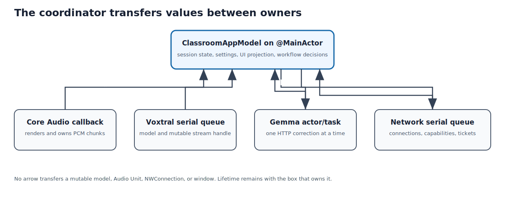

## Purpose and place in the application

`ClassroomAppModel` is the main-actor coordinator. It latches settings, starts services in a safe order, translates callbacks into domain mutations, queues corrections, publishes remote snapshots, and refreshes the overlay.

This is the hub of the executable. Read it after the domain model and before individual services, because it shows why each service API exists.


### Execution story

The coordinator is read as a set of workflows rather than as one 1,300-line
object: initialization wires callbacks; start waits for Voxtral before opening
the microphone; transcription events mutate the current value-type session;
finalized segments enter one serialized correction worker; every visible state
change refreshes overlay and remote snapshots; stop drains model output before
closing the archive.

The critical ownership rule is: UI state belongs to `@MainActor`, C inference
belongs to the Voxtral queue, Core Audio owns its callback deadline, and the
network server owns its own serial queue. The coordinator transfers values
between owners; it does not make those owners share mutable internals.

{#fig-orchestration-ownership width=96%}

::: {.callout-note title="Swift for a C programmer: actors, observation, tasks, and closures"}

`@main` identifies the program entry type. `@MainActor` isolates declarations
to Swift's main executor. This is stronger than a comment saying “call on the
UI thread”: the compiler checks cross-actor access and requires an asynchronous
hop where necessary. `@Observable` asks the Observation framework to track
property reads and writes used by SwiftUI. It is closest to compiler-generated
change-notification plumbing around selected fields. `@State` gives a view
persistent framework-managed storage even though SwiftUI may repeatedly create
new values of the view struct.

`Task { ... }` creates asynchronous work. `await` permits suspension; it does
not mean “run on a worker thread,” and code after an `await` may resume later on
the actor that owns the surrounding function. A closure is Swift's typed,
capturing function value. `[weak self]` captures an optional non-owning
reference so a stored closure cannot keep its owner alive in a reference cycle.

`some View` is an opaque return type: the function returns one fixed concrete
type selected by its implementation, but callers are allowed to rely only on
the `View` conformance. Unlike returning a C interface pointer, no heap
allocation or dynamic dispatch is implied.
:::


## How to read this chapter

Combined source SHA-256: `c32bee63e9f06dbdeab07cb8d4651731787dfa55ef1342977c0c92efa4e93df1`.

For each file, first read its hand-written role, ownership, invariants, and failure model. Source blocks retain original line numbers and syntax highlighting. Boundaries follow declarations where practical; a very large declaration is split only for pagination and is labeled as a continuation. The generator reconstructs every file from emitted blocks and compares every byte with the repository source. No prose claim is generated by counting calls or assignments with regular expressions.

## The coordinator as a set of transactions

`ClassroomAppModel` is large because it expresses end-to-end workflows, not
because every subsystem implementation belongs in it. A useful reading method
is to identify the transaction and its rollback/cleanup path.

### Start transaction

1. Reject duplicate starts and reset transient diagnostics.
2. Snapshot settings that must remain stable for the session.
3. Prepare the optional archive and Gemma warm-up independently.
4. Start the selected Voxtral backend (priming the decoder with silence) and
   wait for its `connected` event.
5. Only after `connected`, create the value-type `ClassroomSession`, request
   permission, and open the selected microphone.
6. Mark the session `listening`.

The session is deliberately *not* created up front: it is constructed at the
moment the microphone opens, after Voxtral reports `connected`. The model does
not open the microphone while Voxtral is still loading, because audio callbacks
have no replay buffer at that point, so doing so would exchange a slightly faster
button response for lost first words.

### Stop transaction

Stop has a stronger ordering requirement:

1. close the atomic capture gate;
2. cancel periodic commit and silence-flush work;
3. stop hardware callbacks;
4. flush/finish Voxtral and drain final text;
5. accept final captions while phase is `stopping`;
6. wait a bounded time for corrections;
7. rewrite/finalize archive files;
8. return the domain session to `idle`;
9. clear runtime-only references and refresh presentation.

Each step removes one producer before destroying its consumer. This is the
same lifetime discipline used for C callback contexts and GPU command queues.

## Observation and actor isolation

`@Observable` instruments property access so SwiftUI can invalidate only views
that read changed properties. It does not create synchronization. The
`@MainActor` annotation is the synchronization rule: observable properties are
read and written on the main executor.

When a callback arrives from a dispatch queue, a URLSession delegate (the
object Foundation's HTTP client calls back with results), or the server
queue, the callback creates a `Task { @MainActor in ... }` or otherwise hops to
the main actor. The copied event/question/snapshot crosses the boundary; the
originating service object remains with its own owner.

## Tasks and cancellation

Stored `Task` references represent ongoing workflows such as event observation,
periodic commits, model start, correction work, and stop. Cancellation is
cooperative: calling `cancel()` sets a flag and causes cancellation-aware
suspension points to throw, but ordinary synchronous code must still test
cancellation or finish quickly.

A stale task is dangerous even when memory-safe. For example, an old startup
task could report failure after a newer session begins. Session identifiers and
current-task checks prevent such temporal races from mutating the wrong
aggregate.

## Derived presentation state

The overlay and browser do not own the transcript. They receive derived
snapshots built from:

- finalized `displayText`;
- current provisional text;
- selected/pending question state;
- overlay visibility and clear-boundary policy;
- optional diagnostics.

Rebuilding a snapshot after mutation is intentionally cheap. It avoids sharing
the mutable `ClassroomSession` with AppKit or Network.framework.


## `Sources/ClassroomCaptions/ClassroomCaptionsApp.swift`

**Role.** This file is reproduced completely below. Read declarations in source order because later helpers rely on ownership and invariants established earlier.

SwiftUI's `App` protocol is the process-level composition root. The
`@State` wrapper gives the scene one persistent `ClassroomAppModel`; `WindowGroup`
creates the dashboard scene (a scene is SwiftUI's unit of window content);
lifecycle hooks forward termination to the model.
For a C programmer, treat this file as the small `main` that constructs the
long-lived owner graph rather than as an ordinary view.

Length: 31 lines. SHA-256: `dcde1d8e9c8894ec65aa1a3e84310678863077d36eea20b2478af5a9a3185338`.

### Declaration map {.unnumbered .unlisted}

This map gives the reading spine of the file. Line numbers refer to the original source and to the numbered listings below.

::: {.declaration-map}
- **Line 4:** `struct ClassroomCaptionsApp: App {`
:::

### Imports and file preamble {.unnumbered .unlisted}

The file begins by importing `SwiftUI`. These imports establish the APIs visible to the declarations below; they execute no application workflow by themselves.

A single `import SwiftUI` serves the whole file: a Swift import loads a
compiled module rather than textually including a header, and on macOS the
SwiftUI module also exposes the AppKit names (such as `NSApplication`) that
the Quit button below relies on.

```{.swift .numberLines startFrom="1"}
import SwiftUI

```

### `struct ClassroomCaptionsApp: App`

The process composition root selected by `@main`. `@State` keeps one observable
model alive while SwiftUI reconstructs view values. The window and menu-bar
scenes share that same owner, so start/stop and overlay commands cannot diverge
between two model instances.

```{.swift .numberLines startFrom="3"}
@main
struct ClassroomCaptionsApp: App {
    @State private var model = ClassroomAppModel()

    var body: some Scene {
        WindowGroup {
            DashboardView(model: model)
                .frame(minWidth: 820, minHeight: 560)
        }
        .defaultSize(width: 980, height: 680)

        MenuBarExtra("Classroom Captions", systemImage: model.isListening ? "captions.bubble.fill" : "captions.bubble") {
            Button(model.isListening ? "Stop Session" : "Start Session") {
                model.toggleSession()
            }

            Button(model.isOverlayVisible ? "Hide Overlay" : "Show Overlay") {
                model.toggleOverlay()
            }

            Divider()

            Button("Quit") {
                model.shutdown()
                NSApplication.shared.terminate(nil)
            }
        }
    }
}
```

## `Sources/ClassroomCaptions/ClassroomAppModel.swift`

**Role.** This large coordinator is intentionally read by workflow: initialization, session lifecycle, transcription events, correction worker, overlay commands, sharing, questions, and diagnostics.

This type is isolated to Swift's main actor and is the application coordinator,
not a general-purpose data model. Read it as workflows: stored settings and
latched session configuration; construction and callback wiring; start,
pause/resume, and drain/stop; transcription-event reduction; serialized Gemma
correction; spoken-command interception; overlay projection; local-network
publication; diagnostics and shutdown.

The central invariant is ownership by execution domain. UI-visible state is
mutated only on the main actor. Core Audio owns its callback deadline. Embedded
Voxtral owns one serial inference queue. The network server owns a different
serial queue. Gemma requests are serialized by an actor/task. Methods in this
file transfer immutable values or owned `Data` between those domains.

Several methods intentionally accept final output while the session is
`stopping`: model drain happens after microphone capture closes. Conversely,
provisional output is ignored outside `listening`. Correction failure never
removes raw evidence. Voice commands are consumed before transcript insertion
so control phrases do not become lecture captions.

Length: 1816 lines. SHA-256: `ad940cc9778fbfeabc03a3d0977e82a4b8cabe29bbd4d578864d165168806270`.

### Declaration map {.unnumbered .unlisted}

This map gives the reading spine of the file. Line numbers refer to the original source and to the numbered listings below.

::: {.declaration-map}
- **Line 7:** `struct DisplayChoice: Identifiable, Equatable {`
- **Line 13:** `enum TranscriptionBackend: String, CaseIterable, Identifiable {`
- **Line 27:** `struct ClassroomQuestion: Identifiable, Equatable {`
- **Line 38:** `final class ClassroomAppModel {`
- **Line 339:** `private struct PendingCorrection {`
- **Line 414:** `init() {`
- **Line 482:** `func refreshDisplays() {`
- **Line 497:** `func toggleSession() {`
- **Line 501:** `func startSession() {`
- **Line 553:** `func pauseOrResume() {`
- **Line 569:** `func stopSession() {`
- **Line 648:** `func submitManualCaption() {`
- **Line 663:** `func previewProvisionalCaption() {`
- **Line 670:** `func clearSession() {`
- **Line 719:** `func revealLastSessionArchive() {`
- **Line 724:** `func refreshMicrophones() {`
- **Line 734:** `private func observeTranscriptionEvents() {`
- **Line 757:** `private func handleVoxtralEvent(_ event: TranscriptionEvent) {`
- **Line 824:** `private func startMicrophoneAfterVoxtralConnection() async {`
- **Line 930:** `private func restartCommitTask() {`
- **Line 942:** `private func noteEmbeddedVoiceActivity(level: Double) {`
- **Line 955:** `private func discardBufferedAudioAtPause() {`
- **Line 968:** `private func recordFirstCaptionLatencyIfNeeded() {`
- **Line 973:** `func correctionSettingChanged() {`
- **Line 985:** `func shutdown() {`
- **Line 994:** `func toggleIPhoneSharing() {`
- **Line 1006:** `func toggleStudentQuestions() {`
- **Line 1018:** `func presentNextStudentQuestion() {`
- **Line 1025:** `func dismissPresentedStudentQuestion() {`
- **Line 1030:** `func clearPendingStudentQuestions() {`
- **Line 1035:** `func diagnosticsSettingChanged() {`
- **Line 1058:** `private func warmCorrectionServer() {`
- **Line 1082:** `private func enqueueCorrection(_ segment: CaptionSegment) {`
- **Line 1101:** `private func startCorrectionWorkerIfNeeded() {`
- **Line 1122:** `private func correctSegment( _ segmentID: UUID, mode: CaptionCorrectionMode ) async {`
- **Line 1188:** `private func failCorrection(segmentID: UUID, message: String) {`
- **Line 1195:** `private func waitForCorrections() async {`
- **Line 1216:** `private func gemmaConfiguration() throws -> ( executablePath: String, modelPath: String, endpoint: URL ) {`
- **Line 1230:** `func toggleOverlay() {`
- **Line 1238:** `private func resetLiveDiagnostics() {`
- **Line 1251:** `private func updateGemmaProcessIdentity(endpoint: URL) {`
- **Line 1267:** `private func consumeOverlayVoiceCommand( in text: String, provisional: Bool = false ) -> String {`
- **Line 1370:** `private func applyOverlayVoiceCommand( _ action: SpokenOverlayAction, provisional: Bool ) {`
- **Line 1431:** `private func scrollModelAnswer(_ direction: AnswerScrollDirection) {`
- **Line 1457:** `private func consumeModelQuestion(in text: String) -> String {`
- **Line 1501:** `private func armModelQuestionTimeout() {`
- **Line 1515:** `private func cancelModelQuestionCapture(restoringCaption: Bool) {`
- **Line 1536:** `private func previewModelQuestion(in text: String) -> String {`
- **Line 1553:** `private func appendToQuestionCapture(_ text: String) {`
- **Line 1562:** `private func joinedCaption(_ lhs: String, _ rhs: String) -> String {`
- **Line 1572:** `private func submitModelQuestion(_ question: String) {`
- **Line 1614:** `private func requestCaptionBoundaryForOverlayClear() {`
- **Line 1627:** `private func resumeOverlayAfterClearIfNeeded(hasNewCaption: Bool) {`
- **Line 1637:** `private func resetOverlayClearState() {`
- **Line 1644:** `func resetOverlayFrame() {`
- **Line 1658:** `private func visibleOverlayLines(limit: Int = 3) -> [String] {`
- **Line 1672:** `func refreshOverlay(forceVisible: Bool = false) {`
- **Line 1714:** `private func handleIPhoneSharingStatus(_ status: LocalCaptionServerStatus) {`
- **Line 1729:** `private func handleStudentQuestionStatus( _ status: StudentQuestionServerStatus ) {`
- **Line 1741:** `private func receiveStudentQuestion( _ submission: SubmittedClassroomQuestion ) {`
- **Line 1761:** `private func receiveSpokenQuestion(_ pcm: Data) async {`
- **Line 1780:** `private func publishRemoteCaptions( lines: [String]? = nil, provisional: String? = nil ) {`
- **Line 1804:** `private extension NSScreen {`
- **Line 1810:** `private extension Duration {`
:::

### Imports and file preamble {.unnumbered .unlisted}

The file begins by importing `AppKit`, `ClassroomCaptionsCore`, `Foundation`, `Observation`, `Synchronization`. These imports establish the APIs visible to the declarations below; they execute no application workflow by themselves.

Five imports map the coordinator's reach: `AppKit` for screens, Finder
reveal, and app-lifecycle notifications; `ClassroomCaptionsCore` for the pure
domain library (session, timeline, spoken-command recognizer); `Foundation`
for `URL`, `Date`, `UserDefaults`, and `NotificationCenter`; `Observation`
for the `@Observable` macro; and `Synchronization` for the `Mutex` that
guards the audio capture gate.

```{.swift .numberLines startFrom="1"}
import AppKit
import ClassroomCaptionsCore
import Foundation
import Observation
import Synchronization

```

### `struct DisplayChoice: Identifiable, Equatable`

A stable UI projection of one `NSScreen` (AppKit's object describing an
attached display): the Core Graphics display ID for persistence, the
localized name for the picker, and the global desktop frame (captured but currently unused by the UI).
A `struct` is a value type — assignment copies it, as in C — and `let` fields
are immutable once set. The names after the colon are protocol conformances
(interfaces): `Identifiable` gives SwiftUI a stable `id` for picker rows, and
`Equatable` synthesizes `==` so changes are detectable. Because it holds no
mutable `NSScreen` reference, a disconnected projector cannot leave a
dangling screen object inside UI state.

```{.swift .numberLines startFrom="7"}
struct DisplayChoice: Identifiable, Equatable {
    let id: CGDirectDisplayID
    let name: String
    let frame: CGRect
}

```

### `enum TranscriptionBackend: String, CaseIterable, Identifiable`

The user-selectable transcription implementation: in-process Metal inference
or an external WebSocket server. Unlike a C enum, a Swift enum is a full type
that can carry methods and properties. `: String` gives each case a readable
raw value that persists cleanly; `CaseIterable` synthesizes the `allCases`
list the settings picker displays; `Identifiable` lets the value itself serve
as its identity (`var id: Self { self }`). `title` is a computed property — a
getter re-run on every access — so presentation text lives beside the cases
while workflow code still branches exhaustively with `switch`.

```{.swift .numberLines startFrom="13"}
enum TranscriptionBackend: String, CaseIterable, Identifiable {
    case embedded
    case webSocket

    var id: Self { self }

    var title: String {
        switch self {
        case .embedded: return "Embedded Metal"
        case .webSocket: return "WebSocket (advanced)"
        }
    }
}

```

### `struct ClassroomQuestion: Identifiable, Equatable`

Main-actor representation of an accepted anonymous question. It preserves server
identity and timestamp for queue ordering but intentionally has no source
address, ticket, or student identity.

```{.swift .numberLines startFrom="27"}
struct ClassroomQuestion: Identifiable, Equatable {
    let id: UUID
    let text: String
    let submittedAt: Date
    // True when the question was spoken (transcribed) rather than typed, so the
    // overlay can mark it with a microphone glyph.
    var spoken = false
}

```

### `final class ClassroomAppModel`

Main-actor observable coordinator for all user-visible state and
cross-service workflows; everything the dashboard and overlay show is a
property here. `@Observable` drives SwiftUI invalidation, `@MainActor` is the
actual synchronization rule, and service internals stay on their own
queues/actors, crossing this boundary only as values or owned `Data`. In the
property list, `private(set)` means any code may read but only this class may
write, and a trailing `?` marks an optional (it holds a value or `nil`, and
must be checked before use), used for not-yet-known facts such as the
first-caption latency. The settings that follow pair `UserDefaults` (macOS's
per-app preference store, read at startup with `??` supplying a default) with
`didSet` — a property observer that runs after every assignment — so each
change is written straight back and survives relaunch without a save button.

```{.swift .numberLines startFrom="36"}
@MainActor
@Observable
final class ClassroomAppModel {
    private(set) var session: ClassroomSession?
    private(set) var statusText = "Ready"
    private(set) var displays: [DisplayChoice] = []
    private(set) var microphones: [MicrophoneDevice] = []
    private(set) var microphoneLevel = 0.0
    private(set) var capturedAudioBytes = 0
    private(set) var microphoneError: String?
    private(set) var voxtralConnected = false
    private(set) var firstCaptionLatency: TimeInterval?
    private(set) var isStartingSession = false
    private(set) var isStoppingSession = false
    private(set) var lastSessionArchiveURL: URL?
    private(set) var archiveError: String?
    private(set) var correctionServerReady = false
    private(set) var correctionQueueDepth = 0
    private(set) var lastCorrectionLatency: TimeInterval?
    private(set) var correctionError: String?
    private(set) var voxtralGeneratedTokens = 0
    private(set) var voxtralTokensPerSecond = 0.0
    private(set) var gemmaPromptTokens: Int?
    private(set) var gemmaGeneratedTokens: Int?
    private(set) var gemmaTotalGeneratedTokens = 0
    private(set) var gemmaTokensPerSecond: Double?
    private(set) var gemmaTransformationPercentage: Double?
    private(set) var appMemoryFootprintBytes: UInt64?
    private(set) var gemmaMemoryFootprintBytes: UInt64?
    private(set) var iphoneSharingStatus = LocalCaptionServerStatus.stopped
    private(set) var iphonePairingURL: URL?
    private(set) var studentQuestionStatus =
        StudentQuestionServerStatus.stopped
    private(set) var studentQuestionURL: URL?
    private(set) var pendingStudentQuestions: [ClassroomQuestion] = []
    private(set) var presentedStudentQuestion: ClassroomQuestion?
    // Assistant-mode answer state. `modelAnswerMarkdown` is the current answer
    // (nil = none); it survives behind a displayed student question and behind a
    // manual hide, reappearing once both clear. `modelQuestionCapture`
    // accumulates a question that spans several finalized segments.
    private(set) var modelAnswerMarkdown: String?
    private(set) var modelAnswerLoading = false
    private(set) var modelAnswerHidden = false
    private var modelQuestionCapture: String?
    private var modelAnswerScrollToken = 0
    private var modelAnswerScrollDirection: AnswerScrollDirection = .down
    @ObservationIgnored
    private var modelAnswerTask: Task<Void, Never>?
    @ObservationIgnored
    private var modelQuestionTimeoutTask: Task<Void, Never>?
    var selectedDisplayID: CGDirectDisplayID?
    var selectedMicrophoneID: String?
    var transcriptionBackend = TranscriptionBackend.embedded
    var voxtralModelDirectory = NSString(
        string: "~/Library/Application Support/ClassroomCaptions/models/Voxtral-Mini-4B-Realtime-2602"
    ).expandingTildeInPath
    var voxtralEndpoint = "ws://127.0.0.1:8000/v1/realtime"
    var voxtralModel = "T0mSIlver/Voxtral-Mini-4B-Realtime-2602-MLX-4bit"
    var commitIntervalMilliseconds = UserDefaults.standard.object(
        forKey: "commitIntervalMilliseconds"
    ) as? Double ?? 320 {
        didSet {
            UserDefaults.standard.set(
                commitIntervalMilliseconds,
                forKey: "commitIntervalMilliseconds"
            )
        }
    }
    var voxtralContextSeconds = UserDefaults.standard.object(
        forKey: "voxtralContextSeconds"
    ) as? Double ?? 160 {
        didSet {
            UserDefaults.standard.set(
                voxtralContextSeconds,
                forKey: "voxtralContextSeconds"
            )
        }
    }
    var manualCaptionText = ""
    var correctionEnabled = true
    var correctionMode = CaptionCorrectionMode(
        rawValue: UserDefaults.standard.string(forKey: "correctionMode") ?? ""
    ) ?? .science {
        didSet {
            UserDefaults.standard.set(
                correctionMode.rawValue,
                forKey: "correctionMode"
            )
        }
    }
    var gemmaContextCaptionCount = UserDefaults.standard.object(
        forKey: "gemmaContextCaptionCount"
    ) as? Int ?? 0 {
        didSet {
            UserDefaults.standard.set(
                gemmaContextCaptionCount,
```

### Continuation of `final class ClassroomAppModel` {.unnumbered .unlisted}

This stretch is the middle of the persisted settings, all using the same
`UserDefaults`-plus-`didSet` pattern: the Gemma server, model, and loopback
endpoint and the quoted-context depth; the correction mode; the caption and
answer text sizes and the overlay background opacity; the live-diagnostics
toggle (which also starts or stops the diagnostics poller on each change); and
the first of the spoken-command phrases.

```{.swift .numberLines startFrom="132"}
                forKey: "gemmaContextCaptionCount"
            )
        }
    }
    var gemmaServerExecutable = NSString(
        string: "~/.local/bin/mlx_lm.server"
    ).expandingTildeInPath
    var gemmaModelPath = "mlx-community/gemma-4-26B-A4B-it-OptiQ-4bit"
    var gemmaEndpoint = "http://127.0.0.1:8081"
    var captionFontSize = UserDefaults.standard.object(
        forKey: "captionFontSize"
    ) as? Double ?? 32 {
        didSet {
            UserDefaults.standard.set(
                captionFontSize,
                forKey: "captionFontSize"
            )
        }
    }
    // Opacity of the overlay's dark backing panel (the text itself stays opaque).
    var overlayBackgroundOpacity = UserDefaults.standard.object(
        forKey: "overlayBackgroundOpacity"
    ) as? Double ?? 0.82 {
        didSet {
            UserDefaults.standard.set(
                overlayBackgroundOpacity,
                forKey: "overlayBackgroundOpacity"
            )
        }
    }
    // Text size inside the model-answer card, independent of caption text size.
    var answerFontSize = UserDefaults.standard.object(
        forKey: "answerFontSize"
    ) as? Double ?? 18 {
        didSet {
            UserDefaults.standard.set(
                answerFontSize,
                forKey: "answerFontSize"
            )
        }
    }
    var showLiveDiagnostics = UserDefaults.standard.bool(
        forKey: "showLiveDiagnostics"
    ) {
        didSet {
            UserDefaults.standard.set(
                showLiveDiagnostics,
                forKey: "showLiveDiagnostics"
            )
            diagnosticsSettingChanged()
        }
    }
    var overlayVoiceCommandsEnabled = UserDefaults.standard.object(
        forKey: "overlayVoiceCommandsEnabled"
    ) as? Bool ?? true {
        didSet {
            UserDefaults.standard.set(
                overlayVoiceCommandsEnabled,
                forKey: "overlayVoiceCommandsEnabled"
            )
        }
    }
    var overlayShowVoiceCommand = UserDefaults.standard.string(
        forKey: "overlayShowVoiceCommand"
    ) ?? "Bonjour soleil bleu" {
        didSet {
            UserDefaults.standard.set(
                overlayShowVoiceCommand,
                forKey: "overlayShowVoiceCommand"
            )
        }
    }
    var overlayHideVoiceCommand = UserDefaults.standard.string(
        forKey: "overlayHideVoiceCommand"
    ) ?? "Bonjour soleil rouge" {
        didSet {
            UserDefaults.standard.set(
                overlayHideVoiceCommand,
                forKey: "overlayHideVoiceCommand"
            )
        }
    }
    var overlayClearVoiceCommand = UserDefaults.standard.string(
        forKey: "overlayClearVoiceCommand"
    ) ?? "Bonjour soleil blanc" {
        didSet {
            UserDefaults.standard.set(
                overlayClearVoiceCommand,
                forKey: "overlayClearVoiceCommand"
            )
        }
    }
    var studentNextQuestionVoiceCommand = UserDefaults.standard.string(
        forKey: "studentNextQuestionVoiceCommand"
    ) ?? "Bonjour question suivante" {
        didSet {
```

### Continuation of `final class ClassroomAppModel` {.unnumbered .unlisted}

This stretch finishes the spoken-command phrases — the student-question,
model-question, answer-toggle, and scroll phrases, each `UserDefaults`-backed —
plus the opt-in recording flag and the archive folder. It then declares the
long-lived service objects (overlay controller, microphone capture, both Voxtral
backends, session archive, Gemma controller) and the stored `Task` handles kept
so running jobs can be cancelled later. These service and task fields are
`@ObservationIgnored`: excluded from `@Observable` change tracking because they
are machinery, not state any view draws.

```{.swift .numberLines startFrom="228"}
            UserDefaults.standard.set(
                studentNextQuestionVoiceCommand,
                forKey: "studentNextQuestionVoiceCommand"
            )
        }
    }
    var studentDismissQuestionVoiceCommand = UserDefaults.standard.string(
        forKey: "studentDismissQuestionVoiceCommand"
    ) ?? "Bonjour question terminée" {
        didSet {
            UserDefaults.standard.set(
                studentDismissQuestionVoiceCommand,
                forKey: "studentDismissQuestionVoiceCommand"
            )
        }
    }
    // Assistant mode: the professor frames a spoken question between these two
    // phrases; the model's answer replaces the span in a dedicated overlay card.
    var modelQuestionStartVoiceCommand = UserDefaults.standard.string(
        forKey: "modelQuestionStartVoiceCommand"
    ) ?? "Bonjour modèle début" {
        didSet {
            UserDefaults.standard.set(
                modelQuestionStartVoiceCommand,
                forKey: "modelQuestionStartVoiceCommand"
            )
        }
    }
    var modelQuestionEndVoiceCommand = UserDefaults.standard.string(
        forKey: "modelQuestionEndVoiceCommand"
    ) ?? "Bonjour modèle fin" {
        didSet {
            UserDefaults.standard.set(
                modelQuestionEndVoiceCommand,
                forKey: "modelQuestionEndVoiceCommand"
            )
        }
    }
    // Hides / restores the answer card, and pages through a long answer.
    var modelAnswerToggleVoiceCommand = UserDefaults.standard.string(
        forKey: "modelAnswerToggleVoiceCommand"
    ) ?? "Bonjour réponse" {
        didSet {
            UserDefaults.standard.set(
                modelAnswerToggleVoiceCommand,
                forKey: "modelAnswerToggleVoiceCommand"
            )
        }
    }
    var overlayScrollUpVoiceCommand = UserDefaults.standard.string(
        forKey: "overlayScrollUpVoiceCommand"
    ) ?? "Bonjour monter" {
        didSet {
            UserDefaults.standard.set(
                overlayScrollUpVoiceCommand,
                forKey: "overlayScrollUpVoiceCommand"
            )
        }
    }
    var overlayScrollDownVoiceCommand = UserDefaults.standard.string(
        forKey: "overlayScrollDownVoiceCommand"
    ) ?? "Bonjour plonger" {
        didSet {
            UserDefaults.standard.set(
                overlayScrollDownVoiceCommand,
                forKey: "overlayScrollDownVoiceCommand"
            )
        }
    }
    // Recording is opt-in: archiving a class is a consent/privacy decision the
    // professor must take deliberately, so a fresh install never records.
    var recordSessions = UserDefaults.standard.object(
        forKey: "recordSessions"
    ) as? Bool ?? false {
        didSet {
            UserDefaults.standard.set(
                recordSessions,
                forKey: "recordSessions"
            )
        }
    }
    var sessionArchiveDirectory = NSString(
        string: "~/Documents/ClassroomCaptions"
    ).expandingTildeInPath

    @ObservationIgnored
    private let overlayController = CaptionOverlayController()
    @ObservationIgnored
    private let microphoneCapture = MicrophoneCaptureService()
    @ObservationIgnored
    private let voxtral = VoxtralRealtimeService()
    @ObservationIgnored
    private let embeddedVoxtral = VoxtralEmbeddedService()
    @ObservationIgnored
    private let sessionArchive = SessionArchiveService()
    @ObservationIgnored
    private let gemmaServer = GemmaServerController()
    @ObservationIgnored
    private var webSocketEventsTask: Task<Void, Never>?
    @ObservationIgnored
    private var embeddedEventsTask: Task<Void, Never>?
    @ObservationIgnored
    private var commitTask: Task<Void, Never>?
    @ObservationIgnored
    private var silenceFlushTask: Task<Void, Never>?
    @ObservationIgnored
    private var correctionWorkerTask: Task<Void, Never>?
    @ObservationIgnored
    private var correctionWarmupTask: Task<Void, Never>?
    @ObservationIgnored
    private var diagnosticsTask: Task<Void, Never>?
```

### `private struct PendingCorrection`

Minimal FIFO work item: immutable segment identity plus the correction mode
latched when queued; the worker re-reads caption and context by UUID,
avoiding a second mutable copy of the segment. The fields that follow are
per-session bookkeeping: `audioInputEnabled = Mutex(false)` is a
lock-protected boolean — the capture gate the audio callback checks and every
start/pause/stop path flips — and `captionServer: LocalCaptionServer!` is an
implicitly unwrapped optional, its `!` promising assignment in `init` before
first use. The `var name: Type { ... }` declarations are computed properties,
recomputed on each read, so booleans such as `isListening` always reflect the
session's current phase; their `guard let` (unwrap an optional or exit early)
and `if case` (match a single enum case) are idioms this file uses throughout.

```{.swift .numberLines startFrom="339"}
    private struct PendingCorrection {
        let segmentID: UUID
        let mode: CaptionCorrectionMode
    }
    @ObservationIgnored
    private var pendingCorrections: [PendingCorrection] = []
    @ObservationIgnored
    private var sessionListeningStartedAt: Date?
    @ObservationIgnored
    private var activeTranscriptionBackend: TranscriptionBackend?
    @ObservationIgnored
    private var activeRecordingEnabled = false
    @ObservationIgnored
    private var activeMicrophoneName: String?
    @ObservationIgnored
    private var processedOverlayVoiceCommandActions: [SpokenOverlayAction] = []
    @ObservationIgnored
    private var gemmaProcessID: pid_t?
    @ObservationIgnored
    private var captionServer: LocalCaptionServer!
    @ObservationIgnored
    private var remoteCaptionRevision: UInt64 = 0
    @ObservationIgnored
    private var overlayMinimumVisibleSequence: Int?
    @ObservationIgnored
    private var overlayClearFinalizationPending = false
    @ObservationIgnored
    private var overlayShouldResumeAfterClear = false
    @ObservationIgnored
    private let audioInputEnabled = Mutex(false)

    var isListening: Bool {
        session?.phase == .listening
    }

    var hasActiveSession: Bool {
        guard let phase = session?.phase else { return false }
        return phase == .listening || phase == .paused || phase == .stopping
    }

    var isOverlayVisible: Bool {
        overlayController.isVisible
    }

    var isIPhoneSharingActive: Bool {
        switch iphoneSharingStatus {
        case .starting, .ready, .clientConnected:
            return true
        case .stopped, .failed:
            return false
        }
    }

    var isIPhoneConnected: Bool {
        if case .clientConnected = iphoneSharingStatus {
            return true
        }
        return false
    }

    var areStudentQuestionsEnabled: Bool {
        if case .ready = studentQuestionStatus {
            return true
        }
        return false
    }

    var recentSegments: [CaptionSegment] {
        session?.timeline.recentSegments(limit: 8) ?? []
    }

    private var terminationObserver: NSObjectProtocol?
    @ObservationIgnored private var pendingAudioBytes = 0
    @ObservationIgnored private var lastMeterPublish = ContinuousClock.now

```

### `init()`

Runs once at app launch, before any session: construction creates services
once and installs value-carrying callbacks, but starts no microphone or
model resources (the persisted settings were already loaded by the property
initializers above). The termination observer registers with
`NotificationCenter` (a process-wide broadcast registry) using a trailing
closure — a closure argument written after the call's closing parenthesis —
so quitting by any route still stops the spawned Gemma child;
`MainActor.assumeIsolated` asserts the code is already on the main thread,
permitting synchronous access to main-actor state. The caption server's
callbacks originate off the main actor and re-enter it with
`Task { @MainActor in }` before touching observable state; the final `if`
chains migrate voice phrases saved by older builds to the current
'Bonjour soleil' wording.

```{.swift .numberLines startFrom="414"}
    init() {
        // Quitting via Cmd-Q, the Dock, or window close never runs the
        // menu-bar Quit button, and a spawned mlx_lm.server child outlives
        // its parent. Shut services down on every termination path.
        terminationObserver = NotificationCenter.default.addObserver(
            forName: NSApplication.willTerminateNotification,
            object: nil,
            queue: .main
        ) { [weak self] _ in
            MainActor.assumeIsolated {
                self?.shutdown()
            }
        }
        captionServer = LocalCaptionServer(
            statusHandler: { [weak self] status in
                Task { @MainActor [weak self] in
                    self?.handleIPhoneSharingStatus(status)
                }
            },
            questionStatusHandler: { [weak self] status in
                Task { @MainActor [weak self] in
                    self?.handleStudentQuestionStatus(status)
                }
            },
            questionHandler: { [weak self] question in
                Task { @MainActor [weak self] in
                    self?.receiveStudentQuestion(question)
                }
            },
            spokenQuestionHandler: { [weak self] pcm in
                Task { @MainActor [weak self] in
                    await self?.receiveSpokenQuestion(pcm)
                }
            }
        )
        if UserDefaults.standard.object(forKey: "overlayShowVoiceCommand") == nil
            || overlayShowVoiceCommand == "Sésame lumière"
            || overlayShowVoiceCommand == "Rideau bleu" {
            overlayShowVoiceCommand = "Bonjour soleil bleu"
        }
        if UserDefaults.standard.object(forKey: "overlayHideVoiceCommand") == nil
            || overlayHideVoiceCommand == "Sésame rouge"
            || overlayHideVoiceCommand == "Sésame silence"
            || overlayHideVoiceCommand == "Rideau rouge" {
            overlayHideVoiceCommand = "Bonjour soleil rouge"
        }
        if UserDefaults.standard.object(forKey: "overlayClearVoiceCommand") == nil
            || overlayClearVoiceCommand == "Rideau blanc" {
            overlayClearVoiceCommand = "Bonjour soleil blanc"
        }
        // "haut"/"bas" are too short for Voxtral to transcribe reliably (it hears
        // "au", "aux", "O"), and "descendre" gets heard as "décembre"; migrate to
        // long, phonetically distinct verbs.
        if UserDefaults.standard.object(forKey: "overlayScrollUpVoiceCommand") == nil
            || overlayScrollUpVoiceCommand == "Bonjour haut" {
            overlayScrollUpVoiceCommand = "Bonjour monter"
        }
        if UserDefaults.standard.object(forKey: "overlayScrollDownVoiceCommand") == nil
            || overlayScrollDownVoiceCommand == "Bonjour bas"
            || overlayScrollDownVoiceCommand == "Bonjour descendre" {
            overlayScrollDownVoiceCommand = "Bonjour plonger"
        }
        refreshDisplays()
        refreshMicrophones()
        observeTranscriptionEvents()
        diagnosticsSettingChanged()
    }

```

### `func refreshDisplays()`

Runs at construction and again when the dashboard's Refresh Displays button
is pressed: rebuilds the display list from current AppKit screens, repairs a
missing or stale selection, and reprojects the overlay, handling projector
connection and desktop rearrangement without retaining obsolete screen
objects. `map` builds a new array by applying its closure to every
`NSScreen`, yielding value-type `DisplayChoice` rows; in `contains(where:)`,
`$0` is shorthand for the closure's single argument. If the remembered
display ID no longer exists, selection falls back to the first screen so the
overlay always has a real target.

```{.swift .numberLines startFrom="482"}
    func refreshDisplays() {
        displays = NSScreen.screens.map { screen in
            DisplayChoice(
                id: screen.displayID,
                name: screen.localizedName,
                frame: screen.frame
            )
        }

        if selectedDisplayID == nil || !displays.contains(where: { $0.id == selectedDisplayID }) {
            selectedDisplayID = displays.first?.id
        }
        refreshOverlay()
    }

```

### `func toggleSession()`

UI convenience that selects start versus stop from derived lifecycle state.
The full methods still enforce transition guards, so duplicate button/menu
events remain harmless.

```{.swift .numberLines startFrom="497"}
    func toggleSession() {
        hasActiveSession ? stopSession() : startSession()
    }

```

### `func startSession()`

Start is deliberately staged. It validates and latches settings, starts optional
archive/correction preparation, and asks Voxtral to initialize. The domain
`ClassroomSession` is not created here: it is constructed only after the
transcription service emits `connected`, at the moment microphone capture opens
(in `startMicrophoneAfterVoxtralConnection`). This ordering prevents model
startup from consuming the first spoken audio without decoding it.

```{.swift .numberLines startFrom="501"}
    func startSession() {
        guard !hasActiveSession, !isStartingSession, !isStoppingSession else {
            return
        }
        microphoneError = nil
        archiveError = nil
        correctionError = nil
        firstCaptionLatency = nil
        capturedAudioBytes = 0
        resetLiveDiagnostics()
        resetOverlayClearState()
        isStartingSession = true
        activeRecordingEnabled = recordSessions
        activeTranscriptionBackend = transcriptionBackend
        if correctionEnabled {
            warmCorrectionServer()
        }
        statusText = transcriptionBackend == .embedded
            ? "Loading and preparing Voxtral"
            : "Connecting to Voxtral"
        Task {
            do {
                switch transcriptionBackend {
                case .embedded:
                    try await embeddedVoxtral.start(
                        modelDirectory: URL(fileURLWithPath: voxtralModelDirectory),
                        delayMilliseconds: Int(commitIntervalMilliseconds),
                        processingIntervalSeconds: 1.0,
                        maxDecodeContextTokens: Int(
                            voxtralContextSeconds * 12.5
                        )
                    )
                case .webSocket:
                    guard let endpoint = URL(string: voxtralEndpoint) else {
                        throw VoxtralRealtimeError.invalidEndpoint
                    }
                    try await voxtral.start(configuration: TranscriptionConfiguration(
                        endpoint: endpoint,
                        model: voxtralModel,
                        delayMilliseconds: Int(commitIntervalMilliseconds)
                    ))
                }
            } catch {
                microphoneError = error.localizedDescription
                statusText = "Voxtral connection failed"
                isStartingSession = false
                activeRecordingEnabled = false
                activeTranscriptionBackend = nil
            }
        }
    }

```

### `func pauseOrResume()`

Mid-session control, between start and stop: toggles the live session between
listening and paused. `guard var session` is this file's recurring edit
idiom — copy the optional value-type session into a local mutable variable
(exiting if there is none), mutate the copy, then publish it back with
`self.session = session`, so observers see one atomic change. Pausing gates
audio input off via the `audioInputEnabled` mutex and flushes buffered audio
so no half-utterance leaks across the pause; resuming re-enables input. Each
branch proceeds only if the session's own phase transition succeeds, then
refreshes the overlay; in any other phase neither branch acts, and the method merely republishes the unchanged session and refreshes the overlay.

```{.swift .numberLines startFrom="553"}
    func pauseOrResume() {
        guard var session else { return }
        if session.phase == .listening {
            guard session.pause() else { return }
            audioInputEnabled.withLock { $0 = false }
            discardBufferedAudioAtPause()
            statusText = "Paused"
        } else if session.phase == .paused {
            guard session.markListening() else { return }
            audioInputEnabled.withLock { $0 = true }
            statusText = "Listening"
        }
        self.session = session
        refreshOverlay()
    }

```

### `func stopSession()`

Stop first closes the capture gate, cancels the periodic commit and silence-flush
tasks, then stops microphone callbacks, flushes and drains Voxtral, accepts the
final drained caption while the session is `stopping`, waits for correction work
up to its deadline, and finalizes the archive. This reverse-lifetime order is why
the last words survive.

```{.swift .numberLines startFrom="569"}
    func stopSession() {
        guard !isStoppingSession, var currentSession = session else { return }
        guard currentSession.beginStopping() else { return }
        capturedAudioBytes += pendingAudioBytes
        pendingAudioBytes = 0
        session = currentSession
        isStoppingSession = true
        audioInputEnabled.withLock { $0 = false }
        commitTask?.cancel()
        commitTask = nil
        silenceFlushTask?.cancel()
        silenceFlushTask = nil
        microphoneCapture.stop()
        microphoneLevel = 0
        let backend = activeTranscriptionBackend
        let backendName = backend?.rawValue ?? "unknown"
        let microphoneName = activeMicrophoneName
        let delayMilliseconds = Int(commitIntervalMilliseconds)
        let shouldFinalizeArchive = activeRecordingEnabled
        Task {
            var drainedText: String?
            if backend == .embedded {
                drainedText = await embeddedVoxtral.stop()
            } else {
                await voxtral.stop()
            }
            guard var completedSession = self.session else {
                self.isStoppingSession = false
                return
            }
            if let drainedText {
                var remainingText = self.consumeOverlayVoiceCommand(
                    in: drainedText
                )
                remainingText = self.consumeModelQuestion(in: remainingText)
                if let segment = completedSession.finalizeCaption(
                    remainingText,
                    correctionEnabled: self.correctionEnabled
                ) {
                    self.enqueueCorrection(segment)
                }
                self.session = completedSession
            }
            await self.waitForCorrections()
            completedSession = self.session ?? completedSession
            _ = completedSession.finish()
            self.session = completedSession

            if shouldFinalizeArchive {
                do {
                    self.lastSessionArchiveURL = try await self.sessionArchive.finalize(
                        session: completedSession,
                        backend: backendName,
                        microphone: microphoneName,
                        modelDelayMilliseconds: delayMilliseconds
                    )
                } catch {
                    self.archiveError = error.localizedDescription
                }
            }

            self.voxtralConnected = false
            self.isStartingSession = false
            self.isStoppingSession = false
            self.activeTranscriptionBackend = nil
            self.activeRecordingEnabled = false
            self.activeMicrophoneName = nil
            if self.archiveError != nil {
                self.statusText = "Session stopped; export failed"
            } else if shouldFinalizeArchive {
                self.statusText = "Session stopped and exported"
            } else {
                self.statusText = "Session stopped"
            }
            self.refreshOverlay()
        }
        statusText = "Finishing Voxtral and exporting"
    }

```

### `func submitManualCaption()`

Development/accessibility fallback that finalizes typed text through the same
domain and Gemma queue as speech. Empty/invalid input is rejected by the
timeline; accepted text clears the editor and refreshes presentation.

```{.swift .numberLines startFrom="648"}
    func submitManualCaption() {
        guard var session, session.phase == .listening else { return }
        guard let segment = session.finalizeCaption(
            manualCaptionText,
            correctionEnabled: correctionEnabled
        ) else {
            return
        }

        self.session = session
        enqueueCorrection(segment)
        manualCaptionText = ""
        refreshOverlay()
    }

```

### `func previewProvisionalCaption()`

Projects typed text into the replaceable provisional slot without appending
history, allowing overlay behavior to be tested without microphone/model input.

```{.swift .numberLines startFrom="663"}
    func previewProvisionalCaption() {
        guard var session, session.phase == .listening else { return }
        session.updateProvisional(manualCaptionText)
        self.session = session
        refreshOverlay()
    }

```

### `func clearSession()`

Tears down a finished session: stops capture, gates audio off, cancels the
commit, silence-flush, and correction-worker tasks, drops pending corrections,
stops the active Voxtral backend, and resets every live counter, error, and
overlay-clear flag back to the Ready baseline. Guarded so it cannot run while a
session is active or transitioning.

```{.swift .numberLines startFrom="670"}
    func clearSession() {
        guard !hasActiveSession, !isStartingSession, !isStoppingSession else {
            return
        }
        microphoneCapture.stop()
        audioInputEnabled.withLock { $0 = false }
        commitTask?.cancel()
        commitTask = nil
        silenceFlushTask?.cancel()
        silenceFlushTask = nil
        correctionWorkerTask?.cancel()
        correctionWorkerTask = nil
        pendingCorrections.removeAll()
        correctionQueueDepth = 0
        let backend = activeTranscriptionBackend
        Task {
            if backend == .embedded {
                _ = await embeddedVoxtral.stop()
            } else {
                await voxtral.stop()
            }
        }
        session = nil
        sessionArchive.cancel()
        statusText = "Ready"
        manualCaptionText = ""
        microphoneLevel = 0
        capturedAudioBytes = 0
        microphoneError = nil
        voxtralConnected = false
        firstCaptionLatency = nil
        isStartingSession = false
        isStoppingSession = false
        activeRecordingEnabled = false
        activeMicrophoneName = nil
        activeTranscriptionBackend = nil
        resetLiveDiagnostics()
        resetOverlayClearState()
        modelAnswerTask?.cancel()
        modelAnswerTask = nil
        modelQuestionTimeoutTask?.cancel()
        modelQuestionTimeoutTask = nil
        modelAnswerMarkdown = nil
        modelAnswerLoading = false
        modelAnswerHidden = false
        modelQuestionCapture = nil
        refreshOverlay()
    }

```

### `func revealLastSessionArchive()`

Asks Finder to reveal the last completed archive URL. It has no filesystem
mutation and no effect before a successful finalize publishes a URL.

```{.swift .numberLines startFrom="719"}
    func revealLastSessionArchive() {
        guard let lastSessionArchiveURL else { return }
        NSWorkspace.shared.activateFileViewerSelecting([lastSessionArchiveURL])
    }

```

### `func refreshMicrophones()`

Re-enumerates current input devices, preserves a still-valid stable UID, and
otherwise falls back to the system default or first device. This repairs state
after USB/Bluetooth hardware changes.

```{.swift .numberLines startFrom="724"}
    func refreshMicrophones() {
        microphones = AudioDeviceCatalog.inputDevices()
        let availableIDs = Set(microphones.map(\.id))
        if let selectedMicrophoneID, availableIDs.contains(selectedMicrophoneID) {
            return
        }
        selectedMicrophoneID = AudioDeviceCatalog.defaultInputDeviceUID()
            ?? microphones.first?.id
    }

```

### `private func observeTranscriptionEvents()`

Wired once in `init`, before any session exists: cancels any earlier
observers, then creates one long-lived task per backend. Each backend
publishes an `AsyncStream` (a typed asynchronous queue of values), and
`for await` iterates it, suspending until the next event arrives — the
asynchronous analogue of looping over reads from a pipe. Every delivery is
filtered against the backend latched for the active session, so a late event
from the inactive service cannot mutate the current transcript.

```{.swift .numberLines startFrom="734"}
    private func observeTranscriptionEvents() {
        webSocketEventsTask?.cancel()
        embeddedEventsTask?.cancel()

        let webSocketEvents = voxtral.events()
        webSocketEventsTask = Task { [weak self] in
            for await event in webSocketEvents {
                guard !Task.isCancelled else { break }
                guard self?.activeTranscriptionBackend == .webSocket else { continue }
                self?.handleVoxtralEvent(event)
            }
        }

        let embeddedEvents = embeddedVoxtral.events()
        embeddedEventsTask = Task { [weak self] in
            for await event in embeddedEvents {
                guard !Task.isCancelled else { break }
                guard self?.activeTranscriptionBackend == .embedded else { continue }
                self?.handleVoxtralEvent(event)
            }
        }
    }

```

### `private func handleVoxtralEvent(_ event: TranscriptionEvent)`

Runs for every event a backend emits while a session is alive: this is the
reducer — one function that folds each incoming event into current state —
from backend events to domain transitions. The `switch` shows that Swift enum
cases carry payloads: `case .provisional(let text)` matches the case and
binds the text it carries, where C would switch on a tag and then read a
union field. `.connected` ends stage one of start and launches the microphone
handoff; provisional and finalized text pass through spoken-command
interception before timeline mutation; metrics update diagnostics
independently; disconnect and failure are interpreted in light of whether
stop was expected.

```{.swift .numberLines startFrom="757"}
    private func handleVoxtralEvent(_ event: TranscriptionEvent) {
        switch event {
        case .connected:
            voxtralConnected = true
            // isStartingSession stays true until markListening() or failure:
            // clearing it here re-enables Start while the microphone permission
            // prompt is up, allowing a second start to reload the model
            // mid-flight and double-start the archive.
            statusText = "Voxtral connected; requesting microphone access"
            Task { await startMicrophoneAfterVoxtralConnection() }

        case .provisional(let text):
            guard var session else { return }
            var provisionalText = consumeOverlayVoiceCommand(
                in: text,
                provisional: true
            )
            provisionalText = previewModelQuestion(in: provisionalText)
            session.updateProvisional(provisionalText)
            self.session = session
            recordFirstCaptionLatencyIfNeeded()
            resumeOverlayAfterClearIfNeeded(hasNewCaption: !provisionalText.isEmpty)

        case .finalized(let text):
            guard var session else { return }
            let wasClearingOverlay = overlayClearFinalizationPending
            var remainingText = consumeOverlayVoiceCommand(in: text)
            remainingText = consumeModelQuestion(in: remainingText)
            let segment = session.finalizeCaption(
                remainingText,
                correctionEnabled: correctionEnabled
            )
            self.session = session
            if let segment {
                enqueueCorrection(segment)
            }
            recordFirstCaptionLatencyIfNeeded()
            processedOverlayVoiceCommandActions = []
            if wasClearingOverlay || overlayClearFinalizationPending {
                overlayMinimumVisibleSequence =
                    (session.timeline.segments.last?.sequence ?? -1) + 1
                overlayClearFinalizationPending = false
                refreshOverlay()
            } else {
                resumeOverlayAfterClearIfNeeded(hasNewCaption: segment != nil)
            }

        case .tokenMetrics(let metrics):
            voxtralGeneratedTokens = metrics.totalTokens
            voxtralTokensPerSecond = metrics.tokensPerSecond

        case .failed(let message):
            microphoneError = message
            statusText = "Voxtral error"
            isStartingSession = false

        case .disconnected:
            voxtralConnected = false
            isStartingSession = false
            if isListening {
                microphoneCapture.stop()
                microphoneLevel = 0
                statusText = "Voxtral disconnected"
            }
        }
    }

```

### `private func startMicrophoneAfterVoxtralConnection() async`

Stage two of the start transaction, entered when Voxtral reports `connected`:
only now is microphone permission requested, the value-type
`ClassroomSession` created, the archive opened, and hardware capture
started — permission denial or capture failure unwinds everything back to
idle. The audio callback captures the backend and recording flags latched at
start, so it keeps serving the original start attempt's configuration. Each
chunk arrives as owned PCM data on the capture queue, where it is archived
and sent to Voxtral synchronously (per-chunk tasks would not preserve frame
order); meter and byte accounting hop to the main actor and publish at
roughly 15 Hz, and audio is forwarded only while the capture gate stays open.

```{.swift .numberLines startFrom="824"}
    private func startMicrophoneAfterVoxtralConnection() async {
        guard await microphoneCapture.requestPermission() else {
            microphoneError = "Microphone access is required. Enable it in System Settings > Privacy & Security > Microphone."
            statusText = "Microphone access denied"
            if activeTranscriptionBackend == .embedded {
                _ = await embeddedVoxtral.stop()
            } else {
                await voxtral.stop()
            }
            activeRecordingEnabled = false
            activeTranscriptionBackend = nil
            isStartingSession = false
            return
        }

        do {
            let backend = activeTranscriptionBackend
            let recordingEnabled = activeRecordingEnabled
            let archive = sessionArchive
            var newSession = ClassroomSession()
            session = newSession
            activeMicrophoneName = microphones.first {
                $0.id == selectedMicrophoneID
            }?.name

            if activeRecordingEnabled {
                lastSessionArchiveURL = try await sessionArchive.start(
                    session: newSession,
                    rootDirectory: URL(
                        fileURLWithPath: sessionArchiveDirectory,
                        isDirectory: true
                    )
                )
            }

            try microphoneCapture.start(
                deviceUID: selectedMicrophoneID
            ) { [weak self] chunk in
                guard let self,
                      self.audioInputEnabled.withLock({ $0 }) else {
                    return
                }
                if recordingEnabled {
                    archive.appendAudio(chunk)
                }
                let reading = PCM16LevelMeter.measure(chunk)
                if backend == .embedded {
                    self.embeddedVoxtral.sendAudio(chunk)
                } else if backend == .webSocket {
                    // Sent synchronously from the capture queue: per-chunk
                    // Tasks have no FIFO guarantee, so awaiting the send from
                    // them could deliver audio frames out of order.
                    self.voxtral.sendAudio(chunk)
                }
                Task {
                    await MainActor.run {
                        guard self.isListening else { return }
                        // Silence detection needs every chunk's level, but the
                        // observable meter/byte counters only need ~15 Hz:
                        // writing them at the 100 Hz capture rate invalidates
                        // SwiftUI views for changes no one can perceive.
                        self.pendingAudioBytes += chunk.count
                        if backend == .embedded {
                            self.noteEmbeddedVoiceActivity(
                                level: reading.normalizedLevel
                            )
                        }
                        let now = ContinuousClock.now
                        if self.lastMeterPublish.duration(to: now)
                            >= .milliseconds(66) {
                            self.lastMeterPublish = now
                            self.capturedAudioBytes += self.pendingAudioBytes
                            self.pendingAudioBytes = 0
                            self.microphoneLevel = reading.normalizedLevel
                        }
                    }
                }
            }
            _ = newSession.markListening()
            session = newSession
            audioInputEnabled.withLock { $0 = true }
            sessionListeningStartedAt = Date()
            statusText = "Listening with Voxtral"
            isStartingSession = false
            if activeTranscriptionBackend == .webSocket {
                restartCommitTask()
            }
            refreshOverlay()
        } catch {
            sessionArchive.cancel()
            audioInputEnabled.withLock { $0 = false }
            session = nil
            microphoneError = error.localizedDescription
            statusText = "Microphone failed"
            isStartingSession = false
            if activeTranscriptionBackend == .embedded {
                _ = await embeddedVoxtral.stop()
            } else {
                await voxtral.stop()
            }
            activeRecordingEnabled = false
            activeMicrophoneName = nil
            activeTranscriptionBackend = nil
        }
    }

```

### `private func restartCommitTask()`

Runs the remote backend's periodic commit loop with a 100 ms lower bound.
Cancellation is checked before and after sleeping so stop does not send a late
commit into a replacement session.

```{.swift .numberLines startFrom="930"}
    private func restartCommitTask() {
        commitTask?.cancel()
        let interval = max(100, commitIntervalMilliseconds)
        commitTask = Task { [weak self] in
            while !Task.isCancelled {
                try? await Task.sleep(for: .milliseconds(interval))
                guard !Task.isCancelled, let self else { break }
                self.voxtral.commit()
            }
        }
    }

```

### `private func noteEmbeddedVoiceActivity(level: Double)`

Implements silence-based commit for the embedded backend: any audio frame above
the 0.06 level threshold (re)arms a 900ms timer, and if no louder frame arrives
before it fires, flushes Voxtral with `finalizeCaption: true`. Effectively each
trailing 900ms of silence after speech finalizes a caption. The task re-guards
on still-listening and still-embedded before flushing.

```{.swift .numberLines startFrom="942"}
    private func noteEmbeddedVoiceActivity(level: Double) {
        guard level >= 0.06 else { return }
        silenceFlushTask?.cancel()
        silenceFlushTask = Task { [weak self] in
            try? await Task.sleep(for: .milliseconds(900))
            guard !Task.isCancelled, let self, self.isListening,
                  self.activeTranscriptionBackend == .embedded else {
                return
            }
            await self.embeddedVoxtral.flush(finalizeCaption: true)
        }
    }

```

### `private func discardBufferedAudioAtPause()`

Creates a caption boundary before pause: embedded Voxtral is flushed and
finalized asynchronously; the WebSocket buffer is committed. This prevents
pre-pause audio from merging with speech after resume.

```{.swift .numberLines startFrom="955"}
    private func discardBufferedAudioAtPause() {
        silenceFlushTask?.cancel()
        silenceFlushTask = nil
        if activeTranscriptionBackend == .embedded {
            Task { [weak self] in
                guard let self else { return }
                await self.embeddedVoxtral.flush(finalizeCaption: true)
            }
        } else {
            voxtral.commit()
        }
    }

```

### `private func recordFirstCaptionLatencyIfNeeded()`

Records exactly the first visible-caption delay relative to microphone listening
start. Later provisional revisions leave the metric unchanged.

```{.swift .numberLines startFrom="968"}
    private func recordFirstCaptionLatencyIfNeeded() {
        guard firstCaptionLatency == nil, let sessionListeningStartedAt else { return }
        firstCaptionLatency = Date().timeIntervalSince(sessionListeningStartedAt)
    }

```

### `func correctionSettingChanged()`

Enabling correction clears prior error and begins warm-up. Disabling outside an
active session cancels warm-up and stops an owned Gemma process; active-session
work is not torn down midway through its latched workflow.

```{.swift .numberLines startFrom="973"}
    func correctionSettingChanged() {
        if correctionEnabled {
            correctionError = nil
            warmCorrectionServer()
        } else if !hasActiveSession {
            correctionWarmupTask?.cancel()
            correctionWarmupTask = nil
            gemmaServer.stop()
            correctionServerReady = false
        }
    }

```

### `func shutdown()`

App-teardown hook that cancels the warmup, correction-worker, and diagnostics
tasks and stops both the caption (iPhone sharing) server and the Gemma server.
Releases the external processes and network listeners the model owns.

```{.swift .numberLines startFrom="985"}
    func shutdown() {
        correctionWarmupTask?.cancel()
        correctionWorkerTask?.cancel()
        diagnosticsTask?.cancel()
        captionServer.stop()
        gemmaServer.stop()
        embeddedVoxtral.releaseModel()
    }

```

### `func toggleIPhoneSharing()`

Starts or stops the local caption web server. Stopping also disables question
submissions first; starting clears any stale pairing URL, sets status to
`.starting`, launches the server, and immediately publishes the current caption
snapshot so a phone that connects sees content right away.

```{.swift .numberLines startFrom="994"}
    func toggleIPhoneSharing() {
        if isIPhoneSharingActive {
            captionServer.setQuestionSubmissionsEnabled(false)
            captionServer.stop()
        } else {
            iphonePairingURL = nil
            iphoneSharingStatus = .starting
            captionServer.start()
            publishRemoteCaptions()
        }
    }

```

### `func toggleStudentQuestions()`

Enables or disables anonymous student question submissions on the caption
server, but refuses (setting a `.failed` status) unless iPhone sharing is
already active, since questions ride the same server.

```{.swift .numberLines startFrom="1006"}
    func toggleStudentQuestions() {
        guard isIPhoneSharingActive else {
            studentQuestionStatus = .failed(
                "Start iPhone sharing before enabling student questions."
            )
            return
        }
        captionServer.setQuestionSubmissionsEnabled(
            !areStudentQuestionsEnabled
        )
    }

```

### `func presentNextStudentQuestion()`

Pops the oldest pending question into `presentedStudentQuestion` (or nil if the
queue is empty) and refreshes the overlay, forcing it visible only when a
question was actually presented. The popped question leaves the pending queue.

```{.swift .numberLines startFrom="1018"}
    func presentNextStudentQuestion() {
        presentedStudentQuestion = pendingStudentQuestions.isEmpty
            ? nil
            : pendingStudentQuestions.removeFirst()
        refreshOverlay(forceVisible: presentedStudentQuestion != nil)
    }

```

### `func dismissPresentedStudentQuestion()`

Clears only the question currently shown to the professor; pending questions
remain queued for later presentation.

```{.swift .numberLines startFrom="1025"}
    func dismissPresentedStudentQuestion() {
        presentedStudentQuestion = nil
        refreshOverlay()
    }

```

### `func clearPendingStudentQuestions()`

Drops the not-yet-presented queue and refreshes the pending indicator without
altering the question currently open in the overlay.

```{.swift .numberLines startFrom="1030"}
    func clearPendingStudentQuestions() {
        pendingStudentQuestions.removeAll()
        refreshOverlay()
    }

```

### `func diagnosticsSettingChanged()`

Starts or stops the 1Hz diagnostics poller. When on it samples the app footprint
immediately, resolves the Gemma process identity, then loops every second
updating app and (if known) Gemma memory footprints via `ProcessMemory`. When
off it cancels the task.

```{.swift .numberLines startFrom="1035"}
    func diagnosticsSettingChanged() {
        diagnosticsTask?.cancel()
        diagnosticsTask = nil
        guard showLiveDiagnostics else { return }
        appMemoryFootprintBytes = ProcessMemory.physicalFootprintBytes()
        if let endpoint = URL(string: gemmaEndpoint) {
            updateGemmaProcessIdentity(endpoint: endpoint)
        }
        diagnosticsTask = Task { [weak self] in
            while !Task.isCancelled {
                try? await Task.sleep(for: .seconds(1))
                guard !Task.isCancelled, let self else { break }
                self.appMemoryFootprintBytes = ProcessMemory.physicalFootprintBytes()
                if let processID = self.gemmaProcessID {
                    self.gemmaMemoryFootprintBytes =
                        ProcessMemory.physicalFootprintBytes(
                            processID: processID
                        )
                }
            }
        }
    }

```

### `private func warmCorrectionServer()`

Pre-launches the Gemma MLX server in the background so the first correction is
not stalled by cold start. Guards on correction being enabled and no warmup
already running, ensures the server is ready, and on success marks it ready,
resolves its process identity, and clears errors; failures surface in
`correctionError`.

```{.swift .numberLines startFrom="1058"}
    private func warmCorrectionServer() {
        guard correctionEnabled, correctionWarmupTask == nil else { return }
        correctionWarmupTask = Task { [weak self] in
            guard let self else { return }
            do {
                let configuration = try self.gemmaConfiguration()
                try await self.gemmaServer.ensureReady(
                    executablePath: configuration.executablePath,
                    modelPath: configuration.modelPath,
                    endpoint: configuration.endpoint
                )
                guard !Task.isCancelled else { return }
                self.correctionServerReady = true
                self.updateGemmaProcessIdentity(endpoint: configuration.endpoint)
                self.correctionError = nil
            } catch {
                guard !Task.isCancelled else { return }
                self.correctionServerReady = false
                self.correctionError = error.localizedDescription
            }
            self.correctionWarmupTask = nil
        }
    }

```

### `private func enqueueCorrection(_ segment: CaptionSegment)`

Appends a segment to the pending-correction queue keyed by its UUID and current
mode, but only if the segment is `queued`, and rejects with `failCorrection`
when the queue already holds 8 entries (back-pressure so a slow Gemma cannot
grow an unbounded backlog). Updates the published queue depth and kicks the
worker.

```{.swift .numberLines startFrom="1082"}
    private func enqueueCorrection(_ segment: CaptionSegment) {
        guard segment.correctionState == .queued else { return }
        guard pendingCorrections.count < 8 else {
            failCorrection(
                segmentID: segment.id,
                message: "Correction skipped because the Gemma queue is full."
            )
            return
        }
        pendingCorrections.append(PendingCorrection(
            segmentID: segment.id,
            mode: correctionMode
        ))
        correctionQueueDepth = pendingCorrections.count
        startCorrectionWorkerIfNeeded()
    }

    private var correctionWorkerGeneration = 0

```

### `private func startCorrectionWorkerIfNeeded()`

At most one worker drains the FIFO. The explicit queue bounds memory and makes
Gemma latency predictable on a large local model. New segments can be appended
while the worker is active without launching parallel generations.

```{.swift .numberLines startFrom="1101"}
    private func startCorrectionWorkerIfNeeded() {
        guard correctionWorkerTask == nil else { return }
        correctionWorkerGeneration += 1
        let generation = correctionWorkerGeneration
        correctionWorkerTask = Task { [weak self] in
            guard let self else { return }
            while !Task.isCancelled, !self.pendingCorrections.isEmpty {
                let pending = self.pendingCorrections.removeFirst()
                self.correctionQueueDepth = self.pendingCorrections.count + 1
                await self.correctSegment(pending.segmentID, mode: pending.mode)
                self.correctionQueueDepth = self.pendingCorrections.count
            }
            // A worker cancelled mid-await can resume after a newer worker was
            // spawned; only the current generation may release the handle,
            // otherwise the next enqueue starts a duplicate worker.
            if self.correctionWorkerGeneration == generation {
                self.correctionWorkerTask = nil
            }
        }
    }

```

### `private func correctSegment(…)`

Correction snapshots context and configuration, marks the segment as
`correcting`, measures latency and token usage, then applies only validator-
approved output to the matching UUID. Every thrown path delegates to
`failCorrection`, preserving `rawText`.

```{.swift .numberLines startFrom="1122"}
    private func correctSegment(
        _ segmentID: UUID,
        mode: CaptionCorrectionMode
    ) async {
        guard var currentSession = session,
              let segment = currentSession.timeline.segments.first(where: {
                  $0.id == segmentID
              }),
              currentSession.beginCorrection(segmentID: segmentID) else {
            return
        }
        session = currentSession
        refreshOverlay()

        let startedAt = ContinuousClock.now
        do {
            let configuration = try gemmaConfiguration()
            try await gemmaServer.ensureReady(
                executablePath: configuration.executablePath,
                modelPath: configuration.modelPath,
                endpoint: configuration.endpoint
            )
            correctionServerReady = true
            updateGemmaProcessIdentity(endpoint: configuration.endpoint)
            let recentContext = currentSession.timeline.segments
                .filter { $0.sequence < segment.sequence }
                .suffix(max(0, gemmaContextCaptionCount))
            let service = GemmaCorrectionService(endpoint: configuration.endpoint)
            let result = try await service.correct(CaptionCorrectionRequest(
                segment: segment,
                recentContext: Array(recentContext),
                glossary: [:],
                mode: mode
            ))
            let latency = startedAt.duration(to: .now).timeInterval
            guard !Task.isCancelled, var updatedSession = session else { return }
            _ = updatedSession.applyCorrection(
                segmentID: segmentID,
                text: result.text
            )
            session = updatedSession
            lastCorrectionLatency = latency
            gemmaPromptTokens = result.promptTokens
            gemmaGeneratedTokens = result.generatedTokens
            if let generatedTokens = result.generatedTokens {
                gemmaTotalGeneratedTokens += generatedTokens
                gemmaTokensPerSecond = Double(generatedTokens) / max(0.001, latency)
            } else {
                gemmaTokensPerSecond = nil
            }
            gemmaTransformationPercentage = CaptionTransformation.percentage(
                from: segment.rawText,
                to: result.text
            )
            correctionError = nil
        } catch {
            guard !Task.isCancelled else { return }
            if !(error is CaptionCorrectionValidationError) {
                correctionServerReady = false
            }
            correctionError = error.localizedDescription
            failCorrection(segmentID: segmentID, message: error.localizedDescription)
        }
        refreshOverlay()
    }

```

### `private func failCorrection(segmentID: UUID, message: String)`

Marks a segment's correction failed with a message on the value-type session,
writes it back, and refreshes the overlay. The session's own `failCorrection`
preserves the segment's `rawText`, so a failed correction falls back to the
uncorrected caption rather than losing it.

```{.swift .numberLines startFrom="1188"}
    private func failCorrection(segmentID: UUID, message: String) {
        guard var currentSession = session else { return }
        _ = currentSession.failCorrection(segmentID: segmentID, message: message)
        session = currentSession
        refreshOverlay()
    }

```

### `private func waitForCorrections() async`

Blocks the stop sequence until the correction worker drains or a 60-second
deadline passes; on timeout it cancels the worker, fails every still-pending
segment with a timeout message, and zeroes the queue depth. This is what lets
`stopSession` guarantee the archive captures corrected text without hanging
forever on a stuck server.

```{.swift .numberLines startFrom="1195"}
    private func waitForCorrections() async {
        let deadline = ContinuousClock.now + .seconds(60)
        while correctionWorkerTask != nil || !pendingCorrections.isEmpty {
            if ContinuousClock.now >= deadline {
                correctionWorkerTask?.cancel()
                correctionWorkerTask = nil
                let remaining = pendingCorrections
                pendingCorrections.removeAll()
                for correction in remaining {
                    failCorrection(
                        segmentID: correction.segmentID,
                        message: "Correction timed out while stopping the session."
                    )
                }
                correctionQueueDepth = 0
                return
            }
            try? await Task.sleep(for: .milliseconds(100))
        }
    }

```

### `private func gemmaConfiguration(…)`

Validates and returns the Gemma server triple (executable, model path,
endpoint), throwing `invalidEndpoint` unless the endpoint is http on
127.0.0.1/localhost with an explicit port. This is a hard loopback-only guard so
a correction request can never be aimed at a remote host.

```{.swift .numberLines startFrom="1216"}
    private func gemmaConfiguration() throws -> (
        executablePath: String,
        modelPath: String,
        endpoint: URL
    ) {
        guard let endpoint = URL(string: gemmaEndpoint),
              endpoint.scheme == "http",
              endpoint.host == "127.0.0.1" || endpoint.host == "localhost",
              endpoint.port != nil else {
            throw GemmaCorrectionError.invalidEndpoint
        }
        return (gemmaServerExecutable, gemmaModelPath, endpoint)
    }

```

### `func toggleOverlay()`

Manual visibility control. Showing regenerates current content and display
selection rather than merely ordering a possibly stale panel forward.

```{.swift .numberLines startFrom="1230"}
    func toggleOverlay() {
        if overlayController.isVisible {
            overlayController.hide()
        } else {
            refreshOverlay(forceVisible: true)
        }
    }

```

### `private func resetLiveDiagnostics()`

Clears per-session token, latency, transformation, and Gemma counters while
optionally resampling current app memory. It does not unload either model.

```{.swift .numberLines startFrom="1238"}
    private func resetLiveDiagnostics() {
        voxtralGeneratedTokens = 0
        voxtralTokensPerSecond = 0
        gemmaPromptTokens = nil
        gemmaGeneratedTokens = nil
        gemmaTotalGeneratedTokens = 0
        gemmaTokensPerSecond = nil
        gemmaTransformationPercentage = nil
        if showLiveDiagnostics {
            appMemoryFootprintBytes = ProcessMemory.physicalFootprintBytes()
        }
    }

```

### `private func updateGemmaProcessIdentity(endpoint: URL)`

Finds the owned or externally listening Gemma PID and samples its resident
memory. Failure remains `nil`, distinct from a false zero-byte footprint.

```{.swift .numberLines startFrom="1251"}
    private func updateGemmaProcessIdentity(endpoint: URL) {
        Task { [weak self] in
            guard let self else { return }
            let identifier = await self.gemmaServer.processIdentifier(
                endpoint: endpoint
            )
            self.gemmaProcessID = identifier
            if let identifier {
                self.gemmaMemoryFootprintBytes =
                    ProcessMemory.physicalFootprintBytes(
                        processID: identifier
                    )
            }
        }
    }

```

### `private func consumeOverlayVoiceCommand(…)`

Every transcript, provisional or finalized, passes through this filter before
it can reach the timeline — via `handleVoxtralEvent` while live, and once
more for the text drained at stop. It recognizes completed command phrases,
applies them in spoken order, and returns the caption with those phrases
removed; a provisional fragment that could still grow into a command yields
an empty string, so a half-spoken control phrase never flashes on screen as
lecture content. Because hypotheses are revised as recognition refines,
executed actions are tracked element-wise per utterance — '...bleu' becoming
'...rouge' re-executes the corrected command instead of counting as already
handled — and the tracking list resets when text finalizes.

```{.swift .numberLines startFrom="1267"}
    private func consumeOverlayVoiceCommand(
        in text: String,
        provisional: Bool = false
    ) -> String {
        guard overlayVoiceCommandsEnabled else { return text }
        let showPhrase = overlayShowVoiceCommand.trimmingCharacters(
            in: .whitespacesAndNewlines
        )
        let hidePhrase = overlayHideVoiceCommand.trimmingCharacters(
            in: .whitespacesAndNewlines
        )
        let clearPhrase = overlayClearVoiceCommand.trimmingCharacters(
            in: .whitespacesAndNewlines
        )
        let nextQuestionPhrase =
            studentNextQuestionVoiceCommand.trimmingCharacters(
                in: .whitespacesAndNewlines
            )
        let dismissQuestionPhrase =
            studentDismissQuestionVoiceCommand.trimmingCharacters(
                in: .whitespacesAndNewlines
            )
        // Scroll / answer-toggle phrases are optional: an empty one is simply
        // ignored by the recognizer, so they are not part of the guard below.
        let scrollUpPhrase = overlayScrollUpVoiceCommand.trimmingCharacters(
            in: .whitespacesAndNewlines
        )
        let scrollDownPhrase = overlayScrollDownVoiceCommand.trimmingCharacters(
            in: .whitespacesAndNewlines
        )
        let toggleAnswerPhrase = modelAnswerToggleVoiceCommand.trimmingCharacters(
            in: .whitespacesAndNewlines
        )
        let modelStartPhrase = modelQuestionStartVoiceCommand.trimmingCharacters(
            in: .whitespacesAndNewlines
        )
        let modelEndPhrase = modelQuestionEndVoiceCommand.trimmingCharacters(
            in: .whitespacesAndNewlines
        )
        guard !showPhrase.isEmpty, !hidePhrase.isEmpty,
              !clearPhrase.isEmpty, !nextQuestionPhrase.isEmpty,
              !dismissQuestionPhrase.isEmpty else {
            return text
        }

        let commands = SpokenOverlayCommandRecognizer.recognizeAll(
            in: text,
            showPhrase: showPhrase,
            hidePhrase: hidePhrase,
            clearPhrase: clearPhrase,
            nextQuestionPhrase: nextQuestionPhrase,
            dismissQuestionPhrase: dismissQuestionPhrase,
            scrollUpPhrase: scrollUpPhrase,
            scrollDownPhrase: scrollDownPhrase,
            toggleAnswerPhrase: toggleAnswerPhrase
        )
        if !commands.isEmpty {
            // Compare the recognized actions element-wise with what was
            // already executed for this utterance: a pure count would treat a
            // revised hypothesis ("...bleu" -> "...rouge") as already handled
            // and never execute the corrected command.
            let actions = commands.map(\.action)
            for (index, action) in actions.enumerated() {
                if index < processedOverlayVoiceCommandActions.count {
                    if processedOverlayVoiceCommandActions[index] != action {
                        applyOverlayVoiceCommand(action, provisional: provisional)
                        processedOverlayVoiceCommandActions[index] = action
                    }
                } else {
                    applyOverlayVoiceCommand(action, provisional: provisional)
                    processedOverlayVoiceCommandActions.append(action)
                }
            }
            if processedOverlayVoiceCommandActions.count > actions.count {
                processedOverlayVoiceCommandActions.removeLast(
                    processedOverlayVoiceCommandActions.count - actions.count
                )
            }
            if !provisional {
                processedOverlayVoiceCommandActions = []
            }
            return commands.last?.remainingText ?? ""
        }

        if provisional,
           SpokenOverlayCommandRecognizer.isPotentialCommand(
               text,
               showPhrase: showPhrase,
               hidePhrase: hidePhrase,
               clearPhrase: clearPhrase,
               nextQuestionPhrase: nextQuestionPhrase,
               dismissQuestionPhrase: dismissQuestionPhrase,
               scrollUpPhrase: scrollUpPhrase,
               scrollDownPhrase: scrollDownPhrase,
               toggleAnswerPhrase: toggleAnswerPhrase,
               modelQuestionStartPhrase: modelStartPhrase,
               modelQuestionEndPhrase: modelEndPhrase
           ) {
            return ""
        }
        return text
    }

```

### `private func applyOverlayVoiceCommand(…)`

Executes a recognized spoken overlay command. Show/hide directly drive the
overlay; clear records that the overlay should resume after the next caption,
sets a minimum-visible sequence so already-shown lines stay hidden, marks a
finalization pending, hides the overlay, and (on provisional text) forces a
caption boundary. NextQuestion and dismissQuestion delegate to the question
methods.

```{.swift .numberLines startFrom="1370"}
    private func applyOverlayVoiceCommand(
        _ action: SpokenOverlayAction,
        provisional: Bool
    ) {
        switch action {
        case .show:
            refreshOverlay(forceVisible: true)
            statusText = "Overlay shown by voice command"
        case .hide:
            overlayController.hide()
            statusText = "Overlay hidden by voice command"
        case .clear:
            // Clear is also the escape hatch out of a stuck question capture.
            if modelQuestionCapture != nil {
                cancelModelQuestionCapture(restoringCaption: false)
            }
            overlayShouldResumeAfterClear =
                overlayShouldResumeAfterClear || overlayController.isVisible
            overlayMinimumVisibleSequence =
                (session?.timeline.segments.last?.sequence ?? -1) + 1
            overlayClearFinalizationPending = true
            overlayController.hide()
            statusText = "Captions cleared by voice command"
            if provisional {
                requestCaptionBoundaryForOverlayClear()
            }
        case .nextQuestion:
            if pendingStudentQuestions.isEmpty {
                statusText = "No pending student question"
            } else {
                presentNextStudentQuestion()
                statusText = "Next student question opened by voice command"
            }
        case .dismissQuestion:
            if presentedStudentQuestion == nil {
                statusText = "No student question is open"
            } else {
                dismissPresentedStudentQuestion()
                statusText = "Student question dismissed by voice command"
            }
        case .scrollUp:
            scrollModelAnswer(.up)
        case .scrollDown:
            scrollModelAnswer(.down)
        case .toggleAnswer:
            guard modelAnswerMarkdown != nil || modelAnswerLoading else {
                statusText = "No model answer to show or hide"
                break
            }
            modelAnswerHidden.toggle()
            statusText = modelAnswerHidden
                ? "Model answer hidden by voice command"
                : "Model answer shown by voice command"
            refreshOverlay(
                forceVisible: !modelAnswerHidden
                    && presentedStudentQuestion == nil
            )
        }
    }

    /// Pages the displayed answer card; the WebView reacts to the bumped token.
```

### `private func scrollModelAnswer(_ direction: AnswerScrollDirection)`

Handles the spoken scroll commands. It acts only when an answer is actually on
screen (not hidden, no student question in front), then bumps a counter and
records the direction; the overlay's web view watches that counter and performs
the scroll. The counter avoids passing a closure across the SwiftUI boundary.

```{.swift .numberLines startFrom="1431"}
    private func scrollModelAnswer(_ direction: AnswerScrollDirection) {
        guard modelAnswerMarkdown != nil,
              !modelAnswerHidden,
              presentedStudentQuestion == nil else {
            statusText = "No model answer to scroll"
            return
        }
        modelAnswerScrollDirection = direction
        modelAnswerScrollToken &+= 1
        refreshOverlay()
    }

    private var assistantQuestionPhrases: (start: String, end: String)? {
        let start = modelQuestionStartVoiceCommand.trimmingCharacters(
            in: .whitespacesAndNewlines
        )
        let end = modelQuestionEndVoiceCommand.trimmingCharacters(
            in: .whitespacesAndNewlines
        )
        guard !start.isEmpty, !end.isEmpty else { return nil }
        return (start, end)
    }

    /// Finalized-text path: pulls a keyword-framed question out of the caption
    /// stream (accumulating across segments), fires it at the model, and returns
    /// the surrounding text that should still become an ordinary subtitle.
```

### `private func consumeModelQuestion(in text: String) -> String`

The finalized-text half of Assistant mode. It scans one finalized caption for the
start/end keyword phrases and, accumulating across segments, decides: pass text
through unchanged, begin capturing a question, append to one in progress, or — on
the end phrase — send the assembled question to the model. It returns whatever
surrounding text should still become an ordinary subtitle, so the framed question
never leaks into the captions.

```{.swift .numberLines startFrom="1457"}
    private func consumeModelQuestion(in text: String) -> String {
        guard correctionMode == .assistant,
              let phrases = assistantQuestionPhrases else { return text }
        let scan = SpokenOverlayCommandRecognizer.scanModelQuestion(
            in: text,
            startPhrase: phrases.start,
            endPhrase: phrases.end
        )
        switch scan.kind {
        case .none:
            if modelQuestionCapture != nil {
                appendToQuestionCapture(text)
                armModelQuestionTimeout()
                refreshOverlay(forceVisible: true)
                return ""
            }
            return text
        case .opens:
            modelQuestionCapture = scan.question
            armModelQuestionTimeout()
            refreshOverlay(forceVisible: true)
            return scan.before
        case .complete:
            modelQuestionTimeoutTask?.cancel()
            modelQuestionTimeoutTask = nil
            modelQuestionCapture = nil
            submitModelQuestion(scan.question)
            return joinedCaption(scan.before, scan.after)
        case .closes:
            let full = [modelQuestionCapture, scan.question]
                .compactMap { $0?.trimmingCharacters(in: .whitespacesAndNewlines) }
                .filter { !$0.isEmpty }
                .joined(separator: " ")
            modelQuestionTimeoutTask?.cancel()
            modelQuestionTimeoutTask = nil
            modelQuestionCapture = nil
            submitModelQuestion(full)
            return scan.after
        }
    }

    /// While a question is being captured, show the professor a banner with the
    /// exact end phrase, so a mis-heard "end" can never silently swallow the
    /// captions with no way out.
```

### `private func armModelQuestionTimeout()`

The safety net that stops a mis-heard end phrase from swallowing the captions
forever. Each time the capture grows it restarts a 30-second timer; if no end
phrase arrives, the capture is abandoned and the gathered text restored as a
normal subtitle. Cancelling the previous task first means only inactivity counts.

```{.swift .numberLines startFrom="1501"}
    private func armModelQuestionTimeout() {
        modelQuestionTimeoutTask?.cancel()
        modelQuestionTimeoutTask = Task { [weak self] in
            try? await Task.sleep(for: .seconds(30))
            guard !Task.isCancelled, let self,
                  self.modelQuestionCapture != nil else { return }
            self.statusText = "Model question cancelled — no end phrase was heard"
            self.cancelModelQuestionCapture(restoringCaption: true)
        }
    }

    /// Leaves question-capture mode. When `restoringCaption` is true the text
    /// gathered so far becomes an ordinary subtitle instead of being lost (used
    /// by the 30 s safety timeout); the clear command discards it instead.
```

### `private func cancelModelQuestionCapture(restoringCaption: Bool)`

Leaves capture mode. `restoringCaption` decides the gathered text's fate: the
timeout restores it as a subtitle (nothing the professor said is lost) while the
clear command discards it (he asked to wipe it). Either way it stops the timer
and refreshes the overlay so the capture banner disappears.

```{.swift .numberLines startFrom="1515"}
    private func cancelModelQuestionCapture(restoringCaption: Bool) {
        modelQuestionTimeoutTask?.cancel()
        modelQuestionTimeoutTask = nil
        let captured = modelQuestionCapture?
            .trimmingCharacters(in: .whitespacesAndNewlines)
        modelQuestionCapture = nil
        if restoringCaption, let captured, !captured.isEmpty, var session {
            if let segment = session.finalizeCaption(
                captured,
                correctionEnabled: correctionEnabled
            ) {
                self.session = session
                enqueueCorrection(segment)
            }
        }
        refreshOverlay()
    }

    /// Provisional-text path: never acts, only hides the part of the live
    /// hypothesis that belongs to a question being dictated so it does not flash
    /// as a subtitle.
```

### `private func previewModelQuestion(in text: String) -> String`

The provisional-text half. Live hypotheses change constantly, so this never acts;
it only hides the part of the in-progress hypothesis that belongs to a question
being dictated, so the keyword phrases and the question do not flash as subtitles
before they are finalized.

```{.swift .numberLines startFrom="1536"}
    private func previewModelQuestion(in text: String) -> String {
        guard correctionMode == .assistant,
              let phrases = assistantQuestionPhrases else { return text }
        if modelQuestionCapture != nil { return "" }
        let scan = SpokenOverlayCommandRecognizer.scanModelQuestion(
            in: text,
            startPhrase: phrases.start,
            endPhrase: phrases.end
        )
        switch scan.kind {
        case .opens, .complete:
            return scan.before
        case .none, .closes:
            return text
        }
    }

```

### `private func appendToQuestionCapture(_ text: String)`

Appends a newly finalized segment to the question being assembled, trimming and
skipping empties so a multi-segment question joins with single spaces.

```{.swift .numberLines startFrom="1553"}
    private func appendToQuestionCapture(_ text: String) {
        let addition = text.trimmingCharacters(in: .whitespacesAndNewlines)
        guard !addition.isEmpty else { return }
        modelQuestionCapture = [modelQuestionCapture, addition]
            .compactMap { $0 }
            .filter { !$0.isEmpty }
            .joined(separator: " ")
    }

```

### `private func joinedCaption(_ lhs: String, _ rhs: String) -> String`

Joins the text before a start phrase and after an end phrase into the single
subtitle they should form, dropping empties — used when a whole question arrives
inside one finalized segment.

```{.swift .numberLines startFrom="1562"}
    private func joinedCaption(_ lhs: String, _ rhs: String) -> String {
        [lhs, rhs]
            .map { $0.trimmingCharacters(in: .whitespacesAndNewlines) }
            .filter { !$0.isEmpty }
            .joined(separator: " ")
    }

    /// Sends a captured question to the model and surfaces its answer (Markdown)
    /// in the overlay card. The model is given only text and returns only text;
    /// the answer is rendered, never executed, and never leaves the machine.
```

### `private func submitModelQuestion(_ question: String)`

Sends a captured question to Gemma and surfaces the answer. It cancels any
in-flight request, shows the "generating" state, then on a background task warms
the server, calls the answer endpoint, and stores the Markdown (or an error
message) for the overlay. The model is handed only text and returns only text —
its reply is rendered, never executed, and never leaves the machine.

```{.swift .numberLines startFrom="1572"}
    private func submitModelQuestion(_ question: String) {
        let trimmed = question.trimmingCharacters(in: .whitespacesAndNewlines)
        guard !trimmed.isEmpty else { return }
        modelAnswerTask?.cancel()
        modelAnswerLoading = true
        modelAnswerHidden = false
        statusText = "Asking the model…"
        refreshOverlay(forceVisible: presentedStudentQuestion == nil)
        modelAnswerTask = Task { [weak self] in
            guard let self else { return }
            do {
                let configuration = try self.gemmaConfiguration()
                try await self.gemmaServer.ensureReady(
                    executablePath: configuration.executablePath,
                    modelPath: configuration.modelPath,
                    endpoint: configuration.endpoint
                )
                guard !Task.isCancelled else { return }
                self.correctionServerReady = true
                let service = GemmaCorrectionService(endpoint: configuration.endpoint)
                let answer = try await service.answer(question: trimmed)
                guard !Task.isCancelled else { return }
                self.modelAnswerMarkdown = answer
                self.modelAnswerLoading = false
                self.statusText = "Model answer ready"
                self.refreshOverlay(
                    forceVisible: self.presentedStudentQuestion == nil
                )
            } catch {
                guard !Task.isCancelled else { return }
                self.modelAnswerLoading = false
                self.modelAnswerMarkdown =
                    "**The model could not answer.**\n\n"
                    + error.localizedDescription
                self.statusText = "Model answer failed"
                self.refreshOverlay(
                    forceVisible: self.presentedStudentQuestion == nil
                )
            }
        }
    }

```

### `private func requestCaptionBoundaryForOverlayClear()`

When clear is spoken during provisional text, forces the active backend to end
that caption. The pending-clear flag then prevents old provisional content from
immediately reappearing.

```{.swift .numberLines startFrom="1614"}
    private func requestCaptionBoundaryForOverlayClear() {
        silenceFlushTask?.cancel()
        silenceFlushTask = nil
        if activeTranscriptionBackend == .embedded {
            Task { [weak self] in
                guard let self else { return }
                await self.embeddedVoxtral.flush(finalizeCaption: true)
            }
        } else {
            voxtral.commit()
        }
    }

```

### `private func resumeOverlayAfterClearIfNeeded(hasNewCaption: Bool)`

Waits for a genuinely new caption after the forced boundary, then restores
visibility only if the overlay was visible before clear. Until finalization
completes it refreshes in the hidden/filtered state.

```{.swift .numberLines startFrom="1627"}
    private func resumeOverlayAfterClearIfNeeded(hasNewCaption: Bool) {
        guard hasNewCaption, !overlayClearFinalizationPending else {
            refreshOverlay()
            return
        }
        let shouldResume = overlayShouldResumeAfterClear
        overlayShouldResumeAfterClear = false
        refreshOverlay(forceVisible: shouldResume)
    }

```

### `private func resetOverlayClearState()`

Atomically resets sequence filtering, boundary wait, remembered visibility, and
provisional command-count state at new/cleared session boundaries.

```{.swift .numberLines startFrom="1637"}
    private func resetOverlayClearState() {
        overlayMinimumVisibleSequence = nil
        overlayClearFinalizationPending = false
        overlayShouldResumeAfterClear = false
        processedOverlayVoiceCommandActions = []
    }

```

### `func resetOverlayFrame()`

Resolves the selected screen, removes its persisted geometry, applies the
controller's default frame, and makes the result visible for immediate feedback.

```{.swift .numberLines startFrom="1644"}
    func resetOverlayFrame() {
        guard let selectedScreen = NSScreen.screens.first(where: {
            $0.displayID == selectedDisplayID
        }) ?? NSScreen.main else {
            return
        }
        overlayController.resetFrame(on: selectedScreen)
        refreshOverlay(forceVisible: true)
    }

    /// Last `limit` display lines at or past the clear boundary. Sequences
    /// are monotonic with position, so the visible segments form a suffix and
    /// this scan is O(limit), instead of filtering the whole timeline on
    /// every caption event of a long lecture.
```

### `private func visibleOverlayLines(limit: Int = 3) -> [String]`

Presentation helper called on every overlay refresh and remote publish during
live captioning: it returns the last `limit` finalized caption lines,
honoring the spoken 'clear' boundary. It walks the timeline backwards,
stopping at `overlayMinimumVisibleSequence` — captions older than the
boundary stay hidden — or once `limit` lines are collected, then reverses the
result back into reading order. As the doc comment explains, sequence numbers
grow with position, so the visible lines always form a suffix of the timeline
and the scan costs O(limit) per caption event instead of filtering a whole
lecture's history. `limit: Int = 3` is a default argument (callers may omit
it), and `if let overlayMinimumVisibleSequence` is shorthand optional
binding: it unwraps the field into a same-named local constant.

```{.swift .numberLines startFrom="1658"}
    private func visibleOverlayLines(limit: Int = 3) -> [String] {
        guard let segments = session?.timeline.segments else { return [] }
        var lines: [String] = []
        for segment in segments.reversed() {
            if let overlayMinimumVisibleSequence,
               segment.sequence < overlayMinimumVisibleSequence {
                break
            }
            lines.append(segment.displayText)
            if lines.count == limit { break }
        }
        return lines.reversed()
    }

```

### `func refreshOverlay(forceVisible: Bool = false)`

The overlay receives a projection: recent finalized display text, provisional
text, question state, visual settings, and diagnostics. The controller owns
window lifetime; the model supplies values and intent.

```{.swift .numberLines startFrom="1672"}
    func refreshOverlay(forceVisible: Bool = false) {
        let selectedScreen = NSScreen.screens.first { $0.displayID == selectedDisplayID }
            ?? NSScreen.main
        let lines = visibleOverlayLines()
        let provisional = overlayClearFinalizationPending
            ? nil
            : session?.timeline.provisional?.text
        publishRemoteCaptions(lines: lines, provisional: provisional)
        let shouldShow = forceVisible || overlayController.isVisible

        guard shouldShow, let selectedScreen else {
            overlayController.hide()
            return
        }

        // Card priority: a displayed student question wins the slot; otherwise
        // the model answer shows unless the professor hid it. The answer is not
        // discarded while suppressed — it returns once both conditions clear.
        let questionText = presentedStudentQuestion?.text
        let showAnswer = questionText == nil && !modelAnswerHidden
        let captureHint = modelQuestionEndVoiceCommand.trimmingCharacters(
            in: .whitespacesAndNewlines
        )
        overlayController.show(
            on: selectedScreen,
            lines: lines,
            provisional: provisional,
            question: questionText,
            questionSpoken: presentedStudentQuestion?.spoken ?? false,
            pendingQuestionCount: pendingStudentQuestions.count,
            fontSize: captionFontSize,
            answerMarkdown: showAnswer ? modelAnswerMarkdown : nil,
            answerLoading: showAnswer ? modelAnswerLoading : false,
            answerScrollToken: modelAnswerScrollToken,
            answerScrollDirection: modelAnswerScrollDirection,
            capturingQuestion: modelQuestionCapture,
            captureHint: captureHint.isEmpty ? "Bonjour modèle fin" : captureHint,
            backgroundOpacity: overlayBackgroundOpacity,
            answerFontSize: answerFontSize
        )
    }

```

### `private func handleIPhoneSharingStatus(_ status: LocalCaptionServerStatus)`

Reduces server lifecycle values into dashboard URLs. Ready/connected states
publish the current snapshot; nonready states clear stale capability URLs, and
a full stop also resets question status.

```{.swift .numberLines startFrom="1714"}
    private func handleIPhoneSharingStatus(_ status: LocalCaptionServerStatus) {
        iphoneSharingStatus = status
        switch status {
        case .ready(let url), .clientConnected(let url):
            iphonePairingURL = url
            publishRemoteCaptions()
        case .stopped, .starting, .failed:
            iphonePairingURL = nil
            studentQuestionURL = nil
            if case .stopped = status {
                studentQuestionStatus = .stopped
            }
        }
    }

```

### `private func handleStudentQuestionStatus(…)`

Maintains the independently rotatable student URL: only `.ready` exposes it,
while stopped and failed states remove stale capabilities from the dashboard.

```{.swift .numberLines startFrom="1729"}
    private func handleStudentQuestionStatus(
        _ status: StudentQuestionServerStatus
    ) {
        studentQuestionStatus = status
        switch status {
        case .ready(let url):
            studentQuestionURL = url
        case .stopped, .failed:
            studentQuestionURL = nil
        }
    }

```

### `private func receiveStudentQuestion(…)`

Appends an inbound `SubmittedClassroomQuestion` to the pending queue and
refreshes the overlay so the pending badge updates. The 500-entry cap is purely
a memory bound: the server admits at most 100 questions per hour, so the cap is
unreachable unless a multi-hour backlog is left entirely unmoderated. Runs on
the main actor via the server's question callback.

```{.swift .numberLines startFrom="1741"}
    private func receiveStudentQuestion(
        _ submission: SubmittedClassroomQuestion
    ) {
        // The server has already answered "202 Accepted", so dropping here
        // is silent loss. The server admits at most 100 questions per hour;
        // this much larger cap is purely a memory bound and is unreachable
        // unless a multi-hour backlog is left entirely unmoderated.
        guard pendingStudentQuestions.count < 500 else { return }
        pendingStudentQuestions.append(ClassroomQuestion(
            id: submission.id,
            text: submission.text,
            submittedAt: submission.submittedAt
        ))
        refreshOverlay()
    }

    /// A spoken question (audio clip from a student's phone). It is transcribed
    /// locally on a transient Voxtral stream and then enters the same moderation
    /// queue as a typed question. Requires the embedded model to be loaded (an
    /// embedded session); otherwise the transcription returns nothing.
```

### `private func receiveSpokenQuestion(_ pcm: Data) async`

Receives a student's audio clip, transcribes it locally with
`transcribeClip`, trims and length-bounds the text, and enqueues it in the same
moderation queue as a typed question (flagged `spoken` so the overlay shows a
microphone glyph). It needs the embedded model loaded; otherwise transcription
returns nothing and the clip is dropped.

```{.swift .numberLines startFrom="1761"}
    private func receiveSpokenQuestion(_ pcm: Data) async {
        guard pendingStudentQuestions.count < 500 else { return }
        guard let raw = await embeddedVoxtral.transcribeClip(pcm) else { return }
        let trimmed = raw.trimmingCharacters(in: .whitespacesAndNewlines)
        guard !trimmed.isEmpty else { return }
        let text = String(
            trimmed.prefix(CaptionSharingSecurity.maximumQuestionCharacters)
        )
        guard pendingStudentQuestions.count < 500 else { return }
        pendingStudentQuestions.append(ClassroomQuestion(
            id: UUID(),
            text: text,
            submittedAt: Date(),
            spoken: true
        ))
        statusText = "Spoken student question received"
        refreshOverlay()
    }

```

### `private func publishRemoteCaptions(…)`

Builds and pushes a `RemoteCaptionSnapshot` to connected phones, bumping a
monotonic revision (wrapping add) each call so clients can detect staleness.
Without explicit lines it recomputes the same last-3 visible, sequence-filtered
lines and clear-aware provisional text the local overlay uses. No-ops entirely
when iPhone sharing is inactive.

```{.swift .numberLines startFrom="1780"}
    private func publishRemoteCaptions(
        lines: [String]? = nil,
        provisional: String? = nil
    ) {
        guard isIPhoneSharingActive else { return }
        remoteCaptionRevision &+= 1
        let visibleLines = lines ?? visibleOverlayLines()
        let visibleProvisional: String?
        if lines != nil {
            visibleProvisional = provisional
        } else {
            visibleProvisional = overlayClearFinalizationPending
                ? nil
                : session?.timeline.provisional?.text
        }
        captionServer.publish(RemoteCaptionSnapshot(
            finalized: visibleLines,
            provisional: visibleProvisional,
            sessionActive: hasActiveSession,
            revision: remoteCaptionRevision
        ))
    }
}

```

### `private extension NSScreen`

An `extension` adds members to an existing type from outside its definition —
here a computed `displayID` property on AppKit's `NSScreen` — and `private`
keeps it visible to this file only. It bridges AppKit's loosely typed
device-description dictionary to the stable `CGDirectDisplayID` used for
selection and per-display geometry keys: `as?` attempts a cast and yields an
optional, and `?? 0` substitutes a default when the entry is missing or has
the wrong type.

```{.swift .numberLines startFrom="1804"}
private extension NSScreen {
    var displayID: CGDirectDisplayID {
        deviceDescription[NSDeviceDescriptionKey("NSScreenNumber")] as? CGDirectDisplayID ?? 0
    }
}

```

### `private extension Duration`

Converts Swift's seconds/attoseconds representation to Foundation
`TimeInterval` seconds for latency metrics.

```{.swift .numberLines startFrom="1810"}
private extension Duration {
    var timeInterval: TimeInterval {
        let parts = components
        return Double(parts.seconds)
            + Double(parts.attoseconds) / 1_000_000_000_000_000_000
    }
}
```

## `Sources/ClassroomCaptions/ProcessMemory.swift`

**Role.** This file is reproduced completely below. Read declarations in source order because later helpers rely on ownership and invariants established earlier.

Darwin exposes process memory through Mach task APIs and `proc_pidinfo`. The
helper returns an optional byte count because permission, process lifetime, or
API failure can make a measurement unavailable. A missing value is not reported
as zero: zero would falsely mean the process consumes no memory.

Length: 28 lines. SHA-256: `b829d47d0975d9fbcd08af89b32a34694e67768e4e00cb6491cdb906b5c28465`.

### Declaration map {.unnumbered .unlisted}

This map gives the reading spine of the file. Line numbers refer to the original source and to the numbered listings below.

::: {.declaration-map}
- **Line 4:** `enum ProcessMemory {`
- **Line 5:** `static func physicalFootprintBytes() -> UInt64? {`
- **Line 9:** `static func physicalFootprintBytes(processID: pid_t) -> UInt64? {`
- **Line 13:** `private static func residentSizeBytes(processID: pid_t) -> UInt64? {`
:::

### Imports and file preamble {.unnumbered .unlisted}

The file begins by importing `Darwin`, `Foundation`. These imports establish the APIs visible to the declarations below; they execute no application workflow by themselves.

`Darwin` exposes the raw C system interfaces this file wraps —
`proc_pidinfo`, `getpid`, and the `proc_taskinfo` struct — while `Foundation`
supplies the base Swift platform layer. Nothing executes here; imports only
make a module's declarations visible.

```{.swift .numberLines startFrom="1"}
import Darwin
import Foundation

```

### `enum ProcessMemory`

A stateless namespace for reading a process's resident memory via the Darwin
`proc_pidinfo` API; the diagnostics panel uses it to report both the app's
own footprint and the separate Gemma MLX server's. An enum with no cases is
Swift's idiom for a pure namespace: it can never be instantiated, so its
`static` functions are reachable only as `ProcessMemory.name(...)` — the
closest C analogue is a prefix-named group of free functions.

```{.swift .numberLines startFrom="4"}
enum ProcessMemory {
```

### `static func physicalFootprintBytes() -> UInt64?`

Convenience overload sampling the current process ID through the same Darwin
implementation used for Gemma.

```{.swift .numberLines startFrom="5"}
    static func physicalFootprintBytes() -> UInt64? {
        residentSizeBytes(processID: getpid())
    }

```

### `static func physicalFootprintBytes(processID: pid_t) -> UInt64?`

Public PID overload that delegates to resident-size measurement and preserves
failure as `nil`.

```{.swift .numberLines startFrom="9"}
    static func physicalFootprintBytes(processID: pid_t) -> UInt64? {
        residentSizeBytes(processID: processID)
    }

```

### `private static func residentSizeBytes(processID: pid_t) -> UInt64?`

Calls `proc_pidinfo(PROC_PIDTASKINFO)` into a `proc_taskinfo` struct and
returns its `pti_resident_size`, or `nil` if the call does not return the
exact expected struct size — which is how this API signals failure or a
denied/dead pid; the size-equality check is the standard `proc_pidinfo`
success test. `withUnsafeMutablePointer(to:)` is Swift's bridge to C
out-parameters: it hands the closure a real C pointer to `info` that is valid
only inside that closure, rather than letting an address escape as `&info`
would in C. `MemoryLayout<proc_taskinfo>.size` is Swift's `sizeof`.

```{.swift .numberLines startFrom="13"}
    private static func residentSizeBytes(processID: pid_t) -> UInt64? {
        var info = proc_taskinfo()
        let expectedSize = MemoryLayout<proc_taskinfo>.size
        let result = withUnsafeMutablePointer(to: &info) { pointer in
            proc_pidinfo(
                processID,
                PROC_PIDTASKINFO,
                0,
                pointer,
                Int32(expectedSize)
            )
        }
        guard result == expectedSize else { return nil }
        return info.pti_resident_size
    }
}
```
