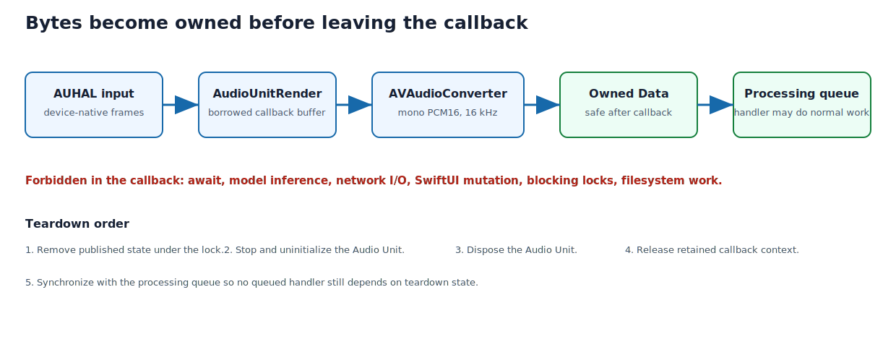

## Purpose and place in the application

This chapter follows samples from the selected Core Audio device through AUHAL, format conversion, the capture gate, Voxtral delivery, level metering, and optional WAV/session persistence.

The real-time callback is the strictest timing boundary in the program. Everything after it must own its bytes and must not make AppKit or model lifetime decisions from the audio thread.


### Sample path and timing

The callback cannot await. Pointers supplied by Core Audio are valid only for
the callback, so bytes crossing the boundary must become owned storage.
Stopping reverses construction order and prevents callbacks from observing
partially destroyed resources.

{#fig-audio-callback-boundary width=96%}

::: {.callout-note title="Swift for a C programmer: escaping closures and C callback ownership"}

`@preconcurrency import` imports an older framework while suppressing
concurrency assumptions its declarations cannot yet express.
`@unchecked Sendable` is a promise made by this project: the compiler cannot
verify safety, so documented lock and queue ownership must enforce it. It is
comparable to an explicit cast around the concurrency type system: legitimate
at a carefully audited boundary, dangerous as a convenience.

`@escaping` means a closure may outlive the function call. `@Sendable` requires
captures suitable for transfer across concurrency domains. A C callback has no
way to retain a Swift object automatically, so `Unmanaged.passRetained` converts
the reference into an opaque pointer while deliberately adding one reference
count. The teardown path must balance it with `takeRetainedValue` or `release`.

`deinit` is Swift's finalizer under Automatic Reference Counting (ARC). ARC
inserts retains and releases at compile time; it is deterministic reference
counting, not tracing garbage collection. Swift object references therefore
have ownership semantics even though no explicit `free` appears in ordinary
code.
:::


## How to read this chapter

Combined source SHA-256: `e43e46f0b15475383aa584bb44fe709c789afc7e0c266471174c27cbc4cfb7e1`.

For each file, first read its hand-written role, ownership, invariants, and failure model. Source blocks retain original line numbers and syntax highlighting. Boundaries follow declarations where practical; a very large declaration is split only for pagination and is labeled as a continuation. The generator reconstructs every file from emitted blocks and compares every byte with the repository source. No prose claim is generated by counting calls or assignments with regular expressions.

## Core Audio's element and scope model

AUHAL is an output Audio Unit used in an input configuration. Bus/element `1`
represents hardware input; element `0` represents output. Enabling input and
disabling output avoids opening an unnecessary playback path.

Audio Unit properties are addressed by:

- a selector identifying the property;
- a scope describing which side of the unit is observed;
- an element/bus number.

The same “stream format” property can therefore mean different formats at
different boundaries. The code reads the device-side input format and installs
that format on the callback-facing output scope before using
`AVAudioConverter` to produce the model's fixed format.

## The real-time render callback

`microphoneInputCallback` runs on Core Audio's **real-time thread** — a
high-priority thread with a hard deadline. The hardware hands over a buffer every
few milliseconds and expects the next one filled before it comes back around;
miss the deadline and the listener hears a click or a dropout. Real-time audio
programming therefore forbids, on this thread, anything that can block for an
unbounded or priority-inverted time: taking a lock another thread might hold,
waiting on I/O, or — ideally — even allocating memory. The rule is "do the
minimum, own your bytes, and get off the thread."

**Bridging a Swift object across a C function pointer.** The Audio Unit callback
is a plain C function pointer; it cannot capture Swift state the way a closure
can. The instance is smuggled through `Unmanaged`. At setup the service calls
`Unmanaged.passRetained(renderContext)` — handing ARC one extra owning reference —
and stores the resulting opaque pointer as the callback's `inputProcRefCon`. Each
invocation recovers it with `takeUnretainedValue()`, which performs **no** atomic
retain or release, so the audio thread never contends on ARC reference counts.
The single retain taken at setup is balanced by a release during teardown, after
callbacks have stopped.

**What the callback actually does.** It renders input with `AudioUnitRender`,
converts that buffer to the model's fixed 16 kHz mono format with
`AVAudioConverter`, and hands the resulting *owned* chunk to a serial
`DispatchQueue` with `queue.async`. Everything expensive — Voxtral inference, the
WAV write, level metering, SwiftUI updates — happens on that queue, off the
deadline. The callback never touches the model, sockets, files, the UI, or an
unbounded queue.

It is not perfectly real-time-safe — it allocates an `AVAudioPCMBuffer` and runs
the converter inline — but those costs are small and bounded. The next section
explains the trade and what a stricter design would cost.

## Why conversion leaves the callback

The current implementation performs render and format conversion in the
callback, then dispatches the resulting owned bytes. The callback still avoids
model inference, networking, files, UI, and unbounded queues. Conversion is a
bounded cost but remains the most timing-sensitive work in the application.

If profiling ever shows callback deadline misses, the next design would use a
preallocated lock-free/ring buffer and perform conversion on a dedicated
real-time-adjacent worker. That increases complexity: buffer overflow policy,
clock drift, and shutdown coordination become explicit.

## Sample representation

The model receives:

- one channel;
- 16,000 samples per second;
- signed 16-bit interleaved PCM;
- native-endian `Int16` inside the process.

The C bridge converts each integer to approximately `[-1, 1]` floating point.
An audio duration can be computed from byte count:

```text
seconds = bytes / (sample_rate * channels * bytes_per_sample)
        = bytes / (16000 * 1 * 2)
```

## Archive durability

WAV places sizes in its header, but those sizes are unknown while recording.
The archive writes a placeholder header, appends PCM incrementally, and seeks
back during finalization to write the actual byte count. A crash can therefore
leave a recoverable PCM payload with an incomplete header; orderly finalization
produces the standards-compatible file.

Transcript text and JSON are written only from finalized domain segments. The
archive does not serialize the unstable provisional hypothesis.


## `Sources/ClassroomCaptions/AudioDeviceCatalog.swift`

**Role.** This file is reproduced completely below. Read declarations in source order because later helpers rely on ownership and invariants established earlier.

Core Audio identifies devices with numeric `AudioObjectID` values but user
preferences need stable string UIDs. This file enumerates devices, filters for
input capability, resolves a saved UID back to the current object ID, and
configures AUHAL. Property queries follow Core Audio's two-step pattern:
request byte size, allocate storage, then request data.

OSStatus is a signed integer status convention inherited from C APIs. Every
property address combines selector, scope, and element; confusing input scope
with output scope is a common source of silent device-selection bugs.

Length: 171 lines. SHA-256: `22b67776af6938d7c3d00ed5c3cd91a4ecae32dbe2b3762f14d02a8f6c95ea7e`.

### Declaration map {.unnumbered .unlisted}

This map gives the reading spine of the file. Line numbers refer to the original source and to the numbered listings below.

::: {.declaration-map}
- **Line 5:** `struct MicrophoneDevice: Identifiable, Hashable, Sendable {`
- **Line 10:** `enum AudioDeviceCatalog {`
- **Line 11:** `static func inputDevices() -> [MicrophoneDevice] {`
- **Line 28:** `static func defaultInputDeviceUID() -> String? {`
- **Line 33:** `static func resolveDeviceID(uid: String?) -> AudioObjectID? {`
- **Line 43:** `static func setInputDevice(_ deviceID: AudioObjectID, on audioUnit: AudioUnit) -> OSStatus {`
- **Line 55:** `private static func defaultInputDeviceID() -> AudioObjectID? {`
- **Line 74:** `private static func allDeviceIDs() -> [AudioObjectID] {`
- **Line 108:** `private static func deviceHasInput(_ deviceID: AudioObjectID) -> Bool {`
- **Line 147:** `private static func stringProperty( _ selector: AudioObjectPropertySelector, deviceID: AudioObjectID ) -> String? {`
:::

### Imports and file preamble {.unnumbered .unlisted}

The file begins by importing `AudioToolbox`, `CoreAudio`, `Foundation`. These imports establish the APIs visible to the declarations below; they execute no application workflow by themselves.

```{.swift .numberLines startFrom="1"}
import AudioToolbox
import CoreAudio
import Foundation

```

### `struct MicrophoneDevice: Identifiable, Hashable, Sendable`

A UI-facing pair of stable Core Audio device UID and human-readable name.
`Identifiable` lets SwiftUI use the UID as row identity; `Hashable` supports
selection collections; `Sendable` permits the value to cross concurrency
boundaries without exposing an `AudioObjectID`.

```{.swift .numberLines startFrom="5"}
struct MicrophoneDevice: Identifiable, Hashable, Sendable {
    let id: String
    let name: String
}

```

### `enum AudioDeviceCatalog`

A caseless enum used as a namespace for stateless Core Audio queries. Swift
cannot instantiate it because no cases exist, giving C-like module functions
while retaining access control and type-qualified names.

```{.swift .numberLines startFrom="10"}
enum AudioDeviceCatalog {
```

### `static func inputDevices() -> [MicrophoneDevice]`

Enumerates all CoreAudio devices, keeps those exposing an input stream, and maps
each to a MicrophoneDevice keyed by its stable device UID (falling back to the
name), sorted case-insensitively. The UID, not the transient AudioObjectID, is
what the app persists.

```{.swift .numberLines startFrom="11"}
    static func inputDevices() -> [MicrophoneDevice] {
        allDeviceIDs()
            .filter(deviceHasInput)
            .compactMap { deviceID in
                guard let uid = stringProperty(
                    kAudioDevicePropertyDeviceUID,
                    deviceID: deviceID
                ) else {
                    return nil
                }
                let name = stringProperty(kAudioObjectPropertyName, deviceID: deviceID)
                    ?? "Microphone"
                return MicrophoneDevice(id: uid, name: name)
            }
            .sorted { $0.name.localizedCaseInsensitiveCompare($1.name) == .orderedAscending }
    }

```

### `static func defaultInputDeviceUID() -> String?`

Resolves the system's current default input object and immediately translates
its volatile numeric ID to the stable string UID persisted by the app. Failure
at either Core Audio query is represented as `nil`.

```{.swift .numberLines startFrom="28"}
    static func defaultInputDeviceUID() -> String? {
        guard let deviceID = defaultInputDeviceID() else { return nil }
        return stringProperty(kAudioDevicePropertyDeviceUID, deviceID: deviceID)
    }

```

### `static func resolveDeviceID(uid: String?) -> AudioObjectID?`

Resolves a persisted UID back to a live AudioObjectID, falling back to the system
default input when the UID is nil or empty, and only matching devices that still
expose an input stream. Bridges saved preferences to the volatile device id the
audio unit needs.

```{.swift .numberLines startFrom="33"}
    static func resolveDeviceID(uid: String?) -> AudioObjectID? {
        guard let uid, !uid.isEmpty else {
            return defaultInputDeviceID()
        }
        return allDeviceIDs().first { deviceID in
            deviceHasInput(deviceID)
                && stringProperty(kAudioDevicePropertyDeviceUID, deviceID: deviceID) == uid
        }
    }

```

### `static func setInputDevice(_ deviceID: AudioObjectID, on audioUnit: AudioUnit) -> OSStatus`

Assigns the chosen hardware object to AUHAL's global current-device property.
Core Audio's C API requires a mutable pointer even though the input ID is a
value, hence the local copy. The raw `OSStatus` is returned so the capture
transaction can attach the failing setup step.

```{.swift .numberLines startFrom="43"}
    static func setInputDevice(_ deviceID: AudioObjectID, on audioUnit: AudioUnit) -> OSStatus {
        var mutableDeviceID = deviceID
        return AudioUnitSetProperty(
            audioUnit,
            kAudioOutputUnitProperty_CurrentDevice,
            kAudioUnitScope_Global,
            0,
            &mutableDeviceID,
            UInt32(MemoryLayout<AudioObjectID>.size)
        )
    }

```

### `private static func defaultInputDeviceID() -> AudioObjectID?`

Queries the system object for `kAudioHardwarePropertyDefaultInputDevice`.
Selector, global scope, and main element identify the property; success still
requires a nonzero device ID because zero is not usable hardware.

```{.swift .numberLines startFrom="55"}
    private static func defaultInputDeviceID() -> AudioObjectID? {
        var address = AudioObjectPropertyAddress(
            mSelector: kAudioHardwarePropertyDefaultInputDevice,
            mScope: kAudioObjectPropertyScopeGlobal,
            mElement: kAudioObjectPropertyElementMain
        )
        var deviceID = AudioObjectID(0)
        var size = UInt32(MemoryLayout<AudioObjectID>.size)
        let status = AudioObjectGetPropertyData(
            AudioObjectID(kAudioObjectSystemObject),
            &address,
            0,
            nil,
            &size,
            &deviceID
        )
        return status == noErr && deviceID != 0 ? deviceID : nil
    }

```

### `private static func allDeviceIDs() -> [AudioObjectID]`

Implements Core Audio's two-call variable-size pattern: ask for byte count,
allocate an exactly sized Swift array, then fill it through an unsafe mutable
buffer pointer. Any status failure returns an empty catalog rather than partially
initialized identifiers.

```{.swift .numberLines startFrom="74"}
    private static func allDeviceIDs() -> [AudioObjectID] {
        var address = AudioObjectPropertyAddress(
            mSelector: kAudioHardwarePropertyDevices,
            mScope: kAudioObjectPropertyScopeGlobal,
            mElement: kAudioObjectPropertyElementMain
        )
        var size: UInt32 = 0
        guard AudioObjectGetPropertyDataSize(
            AudioObjectID(kAudioObjectSystemObject),
            &address,
            0,
            nil,
            &size
        ) == noErr, size > 0 else {
            return []
        }

        var devices = [AudioObjectID](
            repeating: 0,
            count: Int(size) / MemoryLayout<AudioObjectID>.size
        )
        let status = devices.withUnsafeMutableBufferPointer { buffer in
            AudioObjectGetPropertyData(
                AudioObjectID(kAudioObjectSystemObject),
                &address,
                0,
                nil,
                &size,
                buffer.baseAddress!
            )
        }
        return status == noErr ? devices : []
    }

```

### `private static func deviceHasInput(_ deviceID: AudioObjectID) -> Bool`

Reads the input-scope `AudioBufferList` and accepts a device only when at least
one buffer reports channels. The raw allocation is aligned for the C structure
and released with `defer`, including every early return.

```{.swift .numberLines startFrom="108"}
    private static func deviceHasInput(_ deviceID: AudioObjectID) -> Bool {
        var address = AudioObjectPropertyAddress(
            mSelector: kAudioDevicePropertyStreamConfiguration,
            mScope: kAudioDevicePropertyScopeInput,
            mElement: kAudioObjectPropertyElementMain
        )
        var size: UInt32 = 0
        guard AudioObjectGetPropertyDataSize(
            deviceID,
            &address,
            0,
            nil,
            &size
        ) == noErr, size > 0 else {
            return false
        }

        let pointer = UnsafeMutableRawPointer.allocate(
            byteCount: Int(size),
            alignment: MemoryLayout<AudioBufferList>.alignment
        )
        defer { pointer.deallocate() }
        guard AudioObjectGetPropertyData(
            deviceID,
            &address,
            0,
            nil,
            &size,
            pointer
        ) == noErr else {
            return false
        }

        let list = pointer.assumingMemoryBound(to: AudioBufferList.self)
        return UnsafeMutableAudioBufferListPointer(list).contains {
            $0.mNumberChannels > 0
        }
    }

```

### `private static func stringProperty(…)`

Fetches a Core Foundation string property such as UID or name. Core Audio owns
the returned `CFString`, so `takeUnretainedValue` borrows it rather than
consuming a reference count; bridging then produces a Swift `String`.

```{.swift .numberLines startFrom="147"}
    private static func stringProperty(
        _ selector: AudioObjectPropertySelector,
        deviceID: AudioObjectID
    ) -> String? {
        var address = AudioObjectPropertyAddress(
            mSelector: selector,
            mScope: kAudioObjectPropertyScopeGlobal,
            mElement: kAudioObjectPropertyElementMain
        )
        var value: Unmanaged<CFString>?
        var size = UInt32(MemoryLayout<Unmanaged<CFString>?>.size)
        guard AudioObjectGetPropertyData(
            deviceID,
            &address,
            0,
            nil,
            &size,
            &value
        ) == noErr, let value else {
            return nil
        }
        let string = value.takeUnretainedValue() as String
        return string.isEmpty ? nil : string
    }
}
```

## `Sources/ClassroomCaptions/MicrophoneCaptureService.swift`

**Role.** This file is reproduced completely below. Read declarations in source order because later helpers rely on ownership and invariants established earlier.

This file crosses the strictest real-time boundary in the app. The C-compatible
AUHAL callback receives pointers valid only during the callback. It renders into
an `AVAudioPCMBuffer`, converts to mono signed PCM16 at 16 kHz, creates owned
`Data`, and dispatches that value to a non-real-time processing queue.

`Unmanaged.passRetained` explicitly transfers one Swift reference count into
the C callback context. `takeUnretainedValue` borrows it during callbacks;
`release` occurs only after the Audio Unit is stopped and the processing queue
is drained. The lock protects publication/removal of the Audio Unit and context,
not sample processing. Teardown reverses construction order so no callback can
observe a released context.

Length: 358 lines. SHA-256: `f700222a7a96d1b117d7fd2d9e8ee7fc474b51322b1983d09fb85a3d5595fe95`.

### Declaration map {.unnumbered .unlisted}

This map gives the reading spine of the file. Line numbers refer to the original source and to the numbered listings below.

::: {.declaration-map}
- **Line 7:** `enum MicrophonePermission {`
- **Line 14:** `enum MicrophoneCaptureError: LocalizedError {`
- **Line 34:** `private final class AudioRenderContext: @unchecked Sendable {`
- **Line 42:** `init( audioUnit: AudioUnit, inputFormat: AVAudioFormat, outputFormat: AVAudioFormat, converter: AVAudioConverter, handler: @escaping @Sendable (Data) -> Void, queue: DispatchQueue ) {`
- **Line 59:** `private func microphoneInputCallback( _ reference: UnsafeMutableRawPointer, _ flags: UnsafeMutablePointer<AudioUnitRenderActionFlags>, _ timestamp: UnsafePointer<AudioTimeStamp>, _ busNumber: UInt32, _ frameCount: UInt32, _ data: UnsafeMutablePointer<AudioBufferList>? ) -> OSStatus {`
- **Line 100:** `final class MicrophoneCaptureService: @unchecked Sendable {`
- **Line 101:** `private struct State {`
- **Line 115:** `init() {`
- **Line 128:** `deinit {`
- **Line 132:** `func permission() -> MicrophonePermission {`
- **Line 142:** `func requestPermission() async -> Bool {`
- **Line 153:** `func start( deviceUID: String?, handler: @escaping @Sendable (Data) -> Void ) throws {`
- **Line 187:** `func stop() {`
- **Line 205:** `private func configure( _ audioUnit: AudioUnit, deviceID: AudioObjectID, handler: @escaping @Sendable (Data) -> Void ) throws {`
- **Line 309:** `private func requireNoError(_ status: OSStatus, step: String) throws {`
- **Line 315:** `fileprivate static func convert( _ inputBuffer: AVAudioPCMBuffer, converter: AVAudioConverter, outputFormat: AVAudioFormat ) -> Data? {`
:::

### Imports and file preamble {.unnumbered .unlisted}

The file begins by importing `AVFoundation`, `AudioToolbox`, `CoreAudio`, `Foundation`, `Synchronization`. These imports establish the APIs visible to the declarations below; they execute no application workflow by themselves.

```{.swift .numberLines startFrom="1"}
@preconcurrency import AVFoundation
import AudioToolbox
import CoreAudio
import Foundation
import Synchronization

```

### `enum MicrophonePermission`

Normalizes AVFoundation authorization into the four states the dashboard needs.
Keeping permission separate from capture errors prevents “not yet asked” from
being presented as a hardware failure.

```{.swift .numberLines startFrom="7"}
enum MicrophonePermission {
    case authorized
    case denied
    case restricted
    case notDetermined
}

```

### `enum MicrophoneCaptureError: LocalizedError`

The setup transaction's typed failure surface: missing selected device, absent
AUHAL component, a named C configuration step plus `OSStatus`, or an unusable
stream format. `LocalizedError` converts those cases to actionable UI text.

```{.swift .numberLines startFrom="14"}
enum MicrophoneCaptureError: LocalizedError {
    case deviceUnavailable
    case componentUnavailable
    case configuration(String, OSStatus)
    case invalidFormat

    var errorDescription: String? {
        switch self {
        case .deviceUnavailable:
            return "The selected microphone is unavailable."
        case .componentUnavailable:
            return "The macOS audio input component is unavailable."
        case .configuration(let step, let status):
            return "Microphone configuration failed at \(step) (OSStatus \(status))."
        case .invalidFormat:
            return "The microphone returned an invalid audio format."
        }
    }
}

```

### `private final class AudioRenderContext: @unchecked Sendable`

The retained object passed through AUHAL's opaque callback pointer. It groups
the Audio Unit, source/destination formats, converter, destination closure, and
processing queue so the C callback needs one stable lifetime token.
`@unchecked Sendable` relies on callback/teardown ordering, not compiler proof.

```{.swift .numberLines startFrom="34"}
private final class AudioRenderContext: @unchecked Sendable {
    let audioUnit: AudioUnit
    let inputFormat: AVAudioFormat
    let outputFormat: AVAudioFormat
    let converter: AVAudioConverter
    let handler: @Sendable (Data) -> Void
    let queue: DispatchQueue

```

### `init(…)`

Stores already constructed audio objects and the escaping handler in the
callback context. There is no setup logic here: all fallible construction stays
in `configure`, which can unwind before ownership is published.

```{.swift .numberLines startFrom="42"}
    init(
        audioUnit: AudioUnit,
        inputFormat: AVAudioFormat,
        outputFormat: AVAudioFormat,
        converter: AVAudioConverter,
        handler: @escaping @Sendable (Data) -> Void,
        queue: DispatchQueue
    ) {
        self.audioUnit = audioUnit
        self.inputFormat = inputFormat
        self.outputFormat = outputFormat
        self.converter = converter
        self.handler = handler
        self.queue = queue
    }
}

```

### `private func microphoneInputCallback(…)`

This function has a C callback ABI. `reference` is the opaque retained Swift
context. The callback allocates/render-converts one chunk and immediately
dispatches owned bytes. Returning `OSStatus` follows Audio Unit convention;
Swift errors cannot cross this C function boundary.

```{.swift .numberLines startFrom="59"}
private func microphoneInputCallback(
    _ reference: UnsafeMutableRawPointer,
    _ flags: UnsafeMutablePointer<AudioUnitRenderActionFlags>,
    _ timestamp: UnsafePointer<AudioTimeStamp>,
    _ busNumber: UInt32,
    _ frameCount: UInt32,
    _ data: UnsafeMutablePointer<AudioBufferList>?
) -> OSStatus {
    let context = Unmanaged<AudioRenderContext>.fromOpaque(reference)
        .takeUnretainedValue()
    guard let inputBuffer = AVAudioPCMBuffer(
        pcmFormat: context.inputFormat,
        frameCapacity: frameCount
    ) else {
        return noErr
    }
    inputBuffer.frameLength = frameCount

    let status = AudioUnitRender(
        context.audioUnit,
        flags,
        timestamp,
        busNumber,
        frameCount,
        inputBuffer.mutableAudioBufferList
    )
    guard status == noErr,
          let chunk = MicrophoneCaptureService.convert(
              inputBuffer,
              converter: context.converter,
              outputFormat: context.outputFormat
          ) else {
        return status
    }

    context.queue.async {
        context.handler(chunk)
    }
    return noErr
}

```

### `final class MicrophoneCaptureService: @unchecked Sendable`

Owns one AUHAL capture instance and one retained callback context. A lock
protects publication/removal of those two lifetime roots; the processing queue
owns ordinary delivery after the real-time callback has copied audio bytes.

```{.swift .numberLines startFrom="100"}
final class MicrophoneCaptureService: @unchecked Sendable {
```

### `private struct State`

The minimal lock-protected lifetime record. Audio Unit and callback context are
removed together before teardown, so repeated `stop` calls observe an empty
state and cannot release either resource twice.

```{.swift .numberLines startFrom="101"}
    private struct State {
        var audioUnit: AudioUnit?
        var context: Unmanaged<AudioRenderContext>?
    }

    private let lock = NSLock()
    private var state = State()
    private let processingQueue = DispatchQueue(
        label: "ClassroomCaptions.microphone.processing",
        qos: .userInitiated
    )
    private let processingQueueKey = DispatchSpecificKey<Void>()
    private let outputFormat: AVAudioFormat

```

### `init()`

Constructs the model's fixed target format: interleaved signed PCM16, mono,
16 kHz. Failure is a programming/platform invariant violation and therefore a
precondition failure, not a recoverable per-session error. A dispatch-specific
key later prevents synchronously waiting on the processing queue from itself.

```{.swift .numberLines startFrom="115"}
    init() {
        guard let format = AVAudioFormat(
            commonFormat: .pcmFormatInt16,
            sampleRate: 16_000,
            channels: 1,
            interleaved: true
        ) else {
            preconditionFailure("Unable to create the 16 kHz PCM output format.")
        }
        outputFormat = format
        processingQueue.setSpecific(key: processingQueueKey, value: ())
    }

```

### `deinit`

Calls the idempotent stop path as a final ownership backstop. Correct application
shutdown stops explicitly; `deinit` ensures an unexpectedly released service
still removes callbacks before releasing their context.

```{.swift .numberLines startFrom="128"}
    deinit {
        stop()
    }

```

### `func permission() -> MicrophonePermission`

Maps AVFoundation's current authorization status without prompting. The
`@unknown default` branch treats future framework cases conservatively as
restricted, preserving exhaustive behavior across newer SDKs.

```{.swift .numberLines startFrom="132"}
    func permission() -> MicrophonePermission {
        switch AVCaptureDevice.authorizationStatus(for: .audio) {
        case .authorized: return .authorized
        case .denied: return .denied
        case .restricted: return .restricted
        case .notDetermined: return .notDetermined
        @unknown default: return .restricted
        }
    }

```

### `func requestPermission() async -> Bool`

Returns immediately for decided states and suspends only for the system prompt
when authorization is undetermined. `async` models that user interaction without
blocking the main thread.

```{.swift .numberLines startFrom="142"}
    func requestPermission() async -> Bool {
        switch permission() {
        case .authorized:
            return true
        case .notDetermined:
            return await AVCaptureDevice.requestAccess(for: .audio)
        case .denied, .restricted:
            return false
        }
    }

```

### `func start(…)`

Start is transactional. Any failure after Audio Unit creation disposes the
partially constructed instance. A successful return means device selection,
format negotiation, callback installation, initialization, and hardware start
all completed.

```{.swift .numberLines startFrom="153"}
    func start(
        deviceUID: String?,
        handler: @escaping @Sendable (Data) -> Void
    ) throws {
        stop()
        guard let deviceID = AudioDeviceCatalog.resolveDeviceID(uid: deviceUID) else {
            throw MicrophoneCaptureError.deviceUnavailable
        }

        var description = AudioComponentDescription(
            componentType: kAudioUnitType_Output,
            componentSubType: kAudioUnitSubType_HALOutput,
            componentManufacturer: kAudioUnitManufacturer_Apple,
            componentFlags: 0,
            componentFlagsMask: 0
        )
        guard let component = AudioComponentFindNext(nil, &description) else {
            throw MicrophoneCaptureError.componentUnavailable
        }

        var optionalAudioUnit: AudioUnit?
        let creationStatus = AudioComponentInstanceNew(component, &optionalAudioUnit)
        guard creationStatus == noErr, let audioUnit = optionalAudioUnit else {
            throw MicrophoneCaptureError.configuration("create", creationStatus)
        }

        do {
            try configure(audioUnit, deviceID: deviceID, handler: handler)
        } catch {
            AudioComponentInstanceDispose(audioUnit)
            throw error
        }
    }

```

### `func stop()`

State is removed under the lock before external teardown. Repeated stop calls
are therefore harmless. Queue synchronization occurs only when the caller is
not already on that queue, avoiding self-deadlock.

```{.swift .numberLines startFrom="187"}
    func stop() {
        lock.lock()
        let audioUnit = state.audioUnit
        let context = state.context
        state = State()
        lock.unlock()

        if let audioUnit {
            AudioOutputUnitStop(audioUnit)
            AudioUnitUninitialize(audioUnit)
            AudioComponentInstanceDispose(audioUnit)
        }
        context?.release()
        if DispatchQueue.getSpecific(key: processingQueueKey) == nil {
            processingQueue.sync {}
        }
    }

```

### `private func configure(…)`

Completes AUHAL setup as a transaction: enable input bus 1, disable output bus
0, select hardware, read and install the callback-side format, create the
converter/context, install the C callback, initialize, and start. The retained
context is published only after every fallible step succeeds.

```{.swift .numberLines startFrom="205"}
    private func configure(
        _ audioUnit: AudioUnit,
        deviceID: AudioObjectID,
        handler: @escaping @Sendable (Data) -> Void
    ) throws {
        var enableInput: UInt32 = 1
        try requireNoError(
            AudioUnitSetProperty(
                audioUnit,
                kAudioOutputUnitProperty_EnableIO,
                kAudioUnitScope_Input,
                1,
                &enableInput,
                UInt32(MemoryLayout<UInt32>.size)
            ),
            step: "enable input"
        )

        var disableOutput: UInt32 = 0
        try requireNoError(
            AudioUnitSetProperty(
                audioUnit,
                kAudioOutputUnitProperty_EnableIO,
                kAudioUnitScope_Output,
                0,
                &disableOutput,
                UInt32(MemoryLayout<UInt32>.size)
            ),
            step: "disable output"
        )
        try requireNoError(
            AudioDeviceCatalog.setInputDevice(deviceID, on: audioUnit),
            step: "select device"
        )

        var streamDescription = AudioStreamBasicDescription()
        var streamDescriptionSize = UInt32(MemoryLayout<AudioStreamBasicDescription>.size)
        try requireNoError(
            AudioUnitGetProperty(
                audioUnit,
                kAudioUnitProperty_StreamFormat,
                kAudioUnitScope_Input,
                1,
                &streamDescription,
                &streamDescriptionSize
            ),
            step: "read device format"
        )
        guard streamDescription.mSampleRate > 0,
              let inputFormat = AVAudioFormat(streamDescription: &streamDescription),
              let converter = AVAudioConverter(from: inputFormat, to: outputFormat) else {
            throw MicrophoneCaptureError.invalidFormat
        }

        try requireNoError(
            AudioUnitSetProperty(
                audioUnit,
                kAudioUnitProperty_StreamFormat,
                kAudioUnitScope_Output,
                1,
                &streamDescription,
                streamDescriptionSize
            ),
            step: "set callback format"
        )

        let renderContext = AudioRenderContext(
            audioUnit: audioUnit,
            inputFormat: inputFormat,
            outputFormat: outputFormat,
            converter: converter,
            handler: handler,
            queue: processingQueue
        )
        let unmanagedContext = Unmanaged.passRetained(renderContext)
        var callback = AURenderCallbackStruct(
            inputProc: microphoneInputCallback,
            inputProcRefCon: unmanagedContext.toOpaque()
        )
        do {
            try requireNoError(
                AudioUnitSetProperty(
                    audioUnit,
                    kAudioOutputUnitProperty_SetInputCallback,
                    kAudioUnitScope_Global,
                    0,
                    &callback,
                    UInt32(MemoryLayout<AURenderCallbackStruct>.size)
                ),
                step: "install callback"
            )
            try requireNoError(AudioUnitInitialize(audioUnit), step: "initialize")
            try requireNoError(AudioOutputUnitStart(audioUnit), step: "start")
        } catch {
            unmanagedContext.release()
            throw error
        }

        lock.lock()
        state.audioUnit = audioUnit
        state.context = unmanagedContext
        lock.unlock()
    }

```

### `private func requireNoError(_ status: OSStatus, step: String) throws`

Adapts Core Audio's integer `OSStatus` convention to Swift throwing control flow
while preserving the human-readable setup step. This keeps the configure
sequence linear and ensures one catch block performs rollback.

```{.swift .numberLines startFrom="309"}
    private func requireNoError(_ status: OSStatus, step: String) throws {
        guard status == noErr else {
            throw MicrophoneCaptureError.configuration(step, status)
        }
    }

```

### `fileprivate static func convert(…)`

The converter input closure may be called more than once. The mutex-backed flag
supplies the source buffer exactly once and then reports `.noDataNow`.
Frame-capacity calculation allows resampling expansion plus a small margin.
The returned `Data` copies PCM bytes out of the temporary AVAudio buffer.

```{.swift .numberLines startFrom="315"}
    fileprivate static func convert(
        _ inputBuffer: AVAudioPCMBuffer,
        converter: AVAudioConverter,
        outputFormat: AVAudioFormat
    ) -> Data? {
        let ratio = outputFormat.sampleRate / max(1, inputBuffer.format.sampleRate)
        let capacity = AVAudioFrameCount(
            max(1, Int(ceil(Double(inputBuffer.frameLength) * ratio)) + 32)
        )
        guard let outputBuffer = AVAudioPCMBuffer(
            pcmFormat: outputFormat,
            frameCapacity: capacity
        ) else {
            return nil
        }

        let suppliedInput = Mutex(false)
        var error: NSError?
        let status = converter.convert(to: outputBuffer, error: &error) { _, outputStatus in
            let alreadySupplied = suppliedInput.withLock { supplied in
                let previous = supplied
                supplied = true
                return previous
            }
            if alreadySupplied {
                outputStatus.pointee = .noDataNow
                return nil
            }
            outputStatus.pointee = .haveData
            return inputBuffer
        }
        guard error == nil,
              status == .haveData || status == .inputRanDry,
              outputBuffer.frameLength > 0,
              let samples = outputBuffer.int16ChannelData else {
            return nil
        }

        return Data(
            bytes: samples[0],
            count: Int(outputBuffer.frameLength) * MemoryLayout<Int16>.size
        )
    }
}
```

## `Sources/ClassroomCaptions/SessionArchiveService.swift`

**Role.** This file is reproduced completely below. Read declarations in source order because later helpers rely on ownership and invariants established earlier.

The archive service serializes filesystem work on one queue. Start creates a
session directory and reserves a 44-byte WAV header. Audio appends extend the
file without blocking the main actor. Finalization rewrites the header with the
actual data size, closes the handle, then writes transcript text, JSON, and
metadata. Cancellation closes resources and removes partial state.

The generic `perform` bridge converts callback/queue work into Swift
continuations. Its ownership contract matters: exactly one continuation resume
must occur, and mutable file state remains queue-confined despite the class's
`@unchecked Sendable` declaration.

Length: 185 lines. SHA-256: `62a5f327fd05c1b622e2140981d795e31ee64dd42316954e33409dbd437135c9`.

### Declaration map {.unnumbered .unlisted}

This map gives the reading spine of the file. Line numbers refer to the original source and to the numbered listings below.

::: {.declaration-map}
- **Line 4:** `struct SessionArchiveMetadata: Codable {`
- **Line 15:** `enum SessionArchiveError: LocalizedError {`
- **Line 26:** `final class SessionArchiveService: @unchecked Sendable {`
- **Line 27:** `private struct State {`
- **Line 41:** `func start(session: ClassroomSession, rootDirectory: URL) async throws -> URL {`
- **Line 70:** `func appendAudio(_ pcm16MonoData: Data) {`
- **Line 85:** `func finalize( session: ClassroomSession, backend: String, microphone: String?, modelDelayMilliseconds: Int ) async throws -> URL? {`
- **Line 149:** `func cancel() {`
- **Line 156:** `private func closeAudioFile() throws {`
- **Line 163:** `private func perform<T: Sendable>( _ operation: @escaping @Sendable () throws -> T ) async throws -> T {`
- **Line 177:** `private static func directoryName(for session: ClassroomSession) -> String {`
:::

### Imports and file preamble {.unnumbered .unlisted}

The file begins by importing `ClassroomCaptionsCore`, `Foundation`. These imports establish the APIs visible to the declarations below; they execute no application workflow by themselves.

```{.swift .numberLines startFrom="1"}
import ClassroomCaptionsCore
import Foundation

```

### `struct SessionArchiveMetadata: Codable`

The stable JSON summary written beside audio and transcripts. It records domain
identity/times plus latched runtime choices and final byte count, without
embedding model weights, mutable services, or provisional caption state.

```{.swift .numberLines startFrom="4"}
struct SessionArchiveMetadata: Codable {
    let sessionID: UUID
    let startedAt: Date
    let endedAt: Date?
    let backend: String
    let microphone: String?
    let modelDelayMilliseconds: Int
    let audioFormat: String
    let audioBytes: UInt64
}

```

### `enum SessionArchiveError: LocalizedError`

Represents the WAV format's 32-bit data-size limit explicitly. The check occurs
before narrowing `UInt64` accounting to the `UInt32` header field, preventing
silent wraparound in long recordings.

```{.swift .numberLines startFrom="15"}
enum SessionArchiveError: LocalizedError {
    case audioTooLarge

    var errorDescription: String? {
        switch self {
        case .audioTooLarge:
            return "The WAV recording exceeded the 4 GB PCM file limit."
        }
    }
}

```

### `final class SessionArchiveService: @unchecked Sendable`

Queue-confined owner of incremental archive I/O. `@unchecked Sendable` is valid
because callers never access `state`; synchronous and continuation-based methods
route every mutation through the private utility queue.

```{.swift .numberLines startFrom="26"}
final class SessionArchiveService: @unchecked Sendable {
```

### `private struct State`

Tracks the in-progress directory, WAV path/handle, exact PCM byte count, and the
first asynchronous write failure. Capturing a failure in state lets `appendAudio`
remain nonthrowing while `finalize` still reports data loss.

```{.swift .numberLines startFrom="27"}
    private struct State {
        var directory: URL?
        var audioURL: URL?
        var audioHandle: FileHandle?
        var audioBytes: UInt64 = 0
        var writeFailure: String?
    }

    private let queue = DispatchQueue(
        label: "ClassroomCaptions.session.archive",
        qos: .utility
    )
    private var state = State()

```

### `func start(session: ClassroomSession, rootDirectory: URL) async throws -> URL`

Serializes archive setup onto its private utility queue: closes any open audio
file, creates the timestamped session directory, writes a zero-length WAV header
to audio.wav, and opens a seek-to-end write handle, returning the directory.
Resets all per-session state so a prior recording cannot leak in.

```{.swift .numberLines startFrom="41"}
    func start(session: ClassroomSession, rootDirectory: URL) async throws -> URL {
        try await perform {
            try self.closeAudioFile()
            let directory = rootDirectory.appendingPathComponent(
                Self.directoryName(for: session),
                isDirectory: true
            )
            try FileManager.default.createDirectory(
                at: directory,
                withIntermediateDirectories: true
            )

            let audioURL = directory.appendingPathComponent("audio.wav")
            FileManager.default.createFile(
                atPath: audioURL.path,
                contents: PCM16WAVHeader.make(dataByteCount: 0)
            )
            let handle = try FileHandle(forWritingTo: audioURL)
            try handle.seekToEnd()
            self.state = State(
                directory: directory,
                audioURL: audioURL,
                audioHandle: handle,
                audioBytes: 0
            )
            return directory
        }
    }

```

### `func appendAudio(_ pcm16MonoData: Data)`

Asynchronously appends PCM16 mono bytes to the open audio handle and accumulates
the byte count; on a write error it records the failure, closes the handle, and
nils it so later appends are no-ops and finalize can surface the error.

```{.swift .numberLines startFrom="70"}
    func appendAudio(_ pcm16MonoData: Data) {
        guard !pcm16MonoData.isEmpty else { return }
        queue.async {
            guard let handle = self.state.audioHandle else { return }
            do {
                try handle.write(contentsOf: pcm16MonoData)
                self.state.audioBytes += UInt64(pcm16MonoData.count)
            } catch {
                self.state.writeFailure = error.localizedDescription
                try? handle.close()
                self.state.audioHandle = nil
            }
        }
    }

```

### `func finalize(…)`

On the archive queue, propagates any earlier write failure, enforces the 4 GB PCM
limit, rewrites the WAV header with the true data byte count, then writes
transcript.txt, transcript.json, and a pretty-printed session.json before clearing
state. Returns the directory, or nil if no session was started.

```{.swift .numberLines startFrom="85"}
    func finalize(
        session: ClassroomSession,
        backend: String,
        microphone: String?,
        modelDelayMilliseconds: Int
    ) async throws -> URL? {
        try await perform {
            guard let directory = self.state.directory else { return nil }
            if let writeFailure = self.state.writeFailure {
                throw CocoaError(
                    .fileWriteUnknown,
                    userInfo: [NSLocalizedDescriptionKey: writeFailure]
                )
            }
            // The RIFF chunk-size field stores dataByteCount + 36, so the
            // limit must leave room for that addition in UInt32.
            guard self.state.audioBytes <= UInt64(UInt32.max) - 36 else {
                throw SessionArchiveError.audioTooLarge
            }

            if let handle = self.state.audioHandle {
                try handle.seek(toOffset: 0)
                try handle.write(contentsOf: PCM16WAVHeader.make(
                    dataByteCount: UInt32(self.state.audioBytes)
                ))
                try handle.synchronize()
                try handle.close()
                self.state.audioHandle = nil
            }

            let transcript = SessionTranscriptDocument(session: session)
            try transcript.plainText().write(
                to: directory.appendingPathComponent("transcript.txt"),
                atomically: true,
                encoding: .utf8
            )
            try transcript.encodedJSON().write(
                to: directory.appendingPathComponent("transcript.json"),
                options: .atomic
            )

            let metadata = SessionArchiveMetadata(
                sessionID: session.id,
                startedAt: session.startedAt,
                endedAt: session.endedAt,
                backend: backend,
                microphone: microphone,
                modelDelayMilliseconds: modelDelayMilliseconds,
                audioFormat: "PCM signed 16-bit little-endian, 16000 Hz, mono",
                audioBytes: self.state.audioBytes
            )
            let encoder = JSONEncoder()
            encoder.dateEncodingStrategy = .iso8601
            encoder.outputFormatting = [.prettyPrinted, .sortedKeys]
            try encoder.encode(metadata).write(
                to: directory.appendingPathComponent("session.json"),
                options: .atomic
            )

            self.state = State()
            return directory
        }
    }

```

### `func cancel()`

Synchronously closes the current file and clears all archive state. A synchronous
barrier is appropriate here because callers need cancellation complete before
starting another archive or releasing the service.

```{.swift .numberLines startFrom="149"}
    func cancel() {
        queue.sync {
            try? closeAudioFile()
            state = State()
        }
    }

```

### `private func closeAudioFile() throws`

Closes the optional handle and clears it after success. Centralizing this
operation makes start, cancel, and error cleanup share the same ownership rule
instead of closing a stale copied handle independently.

```{.swift .numberLines startFrom="156"}
    private func closeAudioFile() throws {
        if let handle = state.audioHandle {
            try handle.close()
        }
        state.audioHandle = nil
    }

```

### `private func perform<T: Sendable>(…)`

Bridges serial dispatch work into Swift `async throws` with a checked
continuation. Exactly one queue closure resumes the continuation with either the
operation value or error; the generic result must be `Sendable` because it
crosses back from the archive queue.

```{.swift .numberLines startFrom="163"}
    private func perform<T: Sendable>(
        _ operation: @escaping @Sendable () throws -> T
    ) async throws -> T {
        try await withCheckedThrowingContinuation { continuation in
            queue.async {
                do {
                    continuation.resume(returning: try operation())
                } catch {
                    continuation.resume(throwing: error)
                }
            }
        }
    }

```

### `private static func directoryName(for session: ClassroomSession) -> String`

Builds a filesystem-sortable local timestamp plus the first eight UUID
characters. The POSIX locale prevents user locale settings from changing
digits/separators, while the UUID suffix avoids collisions between sessions
started in the same second.

```{.swift .numberLines startFrom="177"}
    private static func directoryName(for session: ClassroomSession) -> String {
        let formatter = DateFormatter()
        formatter.locale = Locale(identifier: "en_US_POSIX")
        formatter.timeZone = .current
        formatter.dateFormat = "yyyy-MM-dd_HH-mm-ss"
        return "\(formatter.string(from: session.startedAt))_"
            + session.id.uuidString.prefix(8)
    }
}
```
