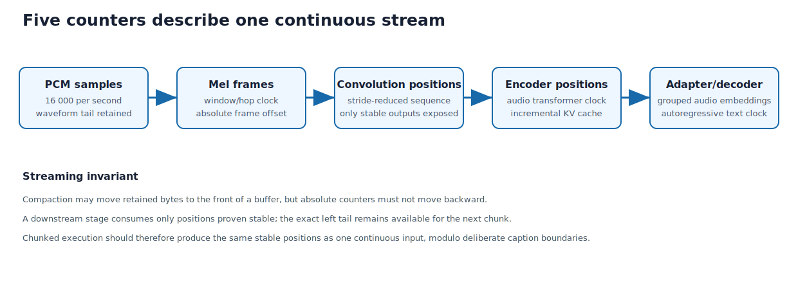

## Purpose and place in the application

`voxtral.c` owns the long-lived model context and incremental stream. It turns newly arrived PCM into mel frames, stable convolution outputs, encoder positions, adapter embeddings, and autoregressive text tokens.

The project-owned C bridge narrows this runtime to opaque handles and status codes. Swift then serializes all handle use on one inference queue.


### Five clocks inside one stream

Keep these units separate while reading: 16 kHz PCM samples, 100 Hz mel frames,
roughly 50 Hz post-convolution positions, grouped encoder positions, and 12.5 Hz
adapter/decoder positions. Tail buffers and absolute counters make chunked
execution equivalent to one continuous input.

The source order follows lifetime: context load, stream state, incremental
front end, encoder/adapter, decoder, public feed/get/flush operations, and
destruction. The Swift service appears beside the C code because queue ownership
is part of the runtime's correctness.

{#fig-voxtral-time-domains width=97%}

PCM means Pulse-Code Modulation. A Mel spectrogram is a short-time spectral
representation (energy per frequency band, frame by frame over time) whose
frequency bins follow a perceptual Mel scale. KV means
key-value attention cache. BF16 means bfloat16, a 16-bit format retaining the
8-bit exponent width of IEEE-754 float. FP16 is IEEE half precision; the two
formats are not interchangeable.

::: {.callout-note title="Swift for a C programmer: serial queues and checked continuations"}
The Swift wrapper uses a private `DispatchQueue` as the sole owner of the
mutable C model and stream handles. `queue.async { ... }` schedules a closure
and returns immediately; `queue.sync { ... }` blocks the caller until that
closure completes. Serial execution provides mutual exclusion only when every
handle access obeys the same rule.

`withCheckedThrowingContinuation` adapts callback-style work to `async throws`.
The closure receives a continuation representing the suspended Swift caller.
Exactly one path must call `resume(returning:)` or `resume(throwing:)`.
“Checked” means debug runtime diagnostics can detect some misuse; it does not
make the underlying C operation cancellable or thread-safe.
:::


## How to read this chapter

Combined source SHA-256: `96e8c1761abbf2d90070bb8a846e540361d69f36d2aa613a4cc03a1c2d4ecc52`.

For each file, first read its hand-written role, ownership, invariants, and failure model. Source blocks retain original line numbers and syntax highlighting. Boundaries follow declarations where practical; a very large declaration is split only for pagination and is labeled as a continuation. The generator reconstructs every file from emitted blocks and compares every byte with the repository source. No prose claim is generated by counting calls or assignments with regular expressions.

## Model components

The local runtime loads several cooperating components:

- log-Mel audio front end;
- strided convolutional stem;
- audio transformer encoder;
- modality adapter projecting/grouping audio features;
- text decoder (autoregressive: it emits one token at a time, each conditioned
  on everything emitted before) with its KV cache;
- tokenizer mapping token IDs to byte pieces;
- time/delay conditioning used by the realtime checkpoint (a saved set of
  trained weights).

Weights are immutable after load. Stream state is separate so one model context
could conceptually support multiple streams, although ClassroomCaptions uses
one serially owned stream.

## From PCM to tokens: the encoding pipeline

One chunk of microphone audio passes through five representations on its way to
text, each at its own rate. Keeping those rates straight is the key to reading
this file:

1. **Waveform — 16,000 Hz.** Signed PCM samples enter `vox_stream_feed`.
2. **Log-Mel frames — 100 Hz.** The front end (Chapter 8) turns each 400-sample
   window into a 128-bin Mel vector, one per 10 ms hop.
3. **Convolution positions — ~50 Hz.** A two-layer causal **convolutional stem**
   consumes Mel frames: `conv0` (kernel 3, stride 1, 128 -> 1280 channels) then
   `conv1` (kernel 3, **stride 2**, 1280 -> 1280), each followed by GELU (a
   smooth nonlinear activation function). The
   stride-2 layer halves the time axis, so 100 Mel frames become ~50 convolution
   positions of width 1280. Because the convolutions are causal (left-padded, so
   each output depends only on present and past input) and
   run on chunks, the runtime keeps a Mel-frame tail and a one-position
   `conv0_residual`, so a chunk boundary yields exactly the outputs a
   whole-lecture pass would, and it discards the positions nearest a boundary that
   the zero padding would otherwise contaminate.
4. **Encoder positions — ~50 Hz.** The 32-layer audio transformer (Chapter 9)
   refines those 1280-d vectors with sliding-window self-attention (each position
   blends in information from a bounded window of earlier positions; Chapter 9
   explains the mechanism and its parallel "heads"), consuming only
   positions that later audio can no longer change.
5. **Adapter / decoder positions — 12.5 Hz.** The modality adapter concatenates
   every `VOX_DOWNSAMPLE = 4` consecutive encoder frames (1280 x 4 = 5120) and
   projects them into the decoder's 3072-d space, dropping the rate to 12.5 Hz.
   The 26-layer text decoder then attends over (selectively reads from) those
   audio embeddings (the projected vectors that now stand for the audio) and its
   own previous tokens to emit caption pieces autoregressively.

Every arrow is a **downsample with memory**: tail buffers and absolute counters
(samples -> Mel -> conv -> encoder -> adapter) make the streamed result identical
to a one-shot pass. A position is published only once no future input can revise
it, and that single rule is why each stage carries its own counter and tail.

## The numbers: shapes, rates, and a worked example

Every index calculation in these four chapters makes sense once the dimensions
are in front of you. The whole engine is governed by a handful of constants
(`voxtral.h`):

| Stage | Rate | Width per position | Governing constants |
| --- | --- | --- | --- |
| PCM samples | 16,000 Hz | 1 (scalar) | `VOX_SAMPLE_RATE 16000` |
| log-Mel frames | 100 Hz | 128 | `N_MEL 128`, `HOP_LENGTH 160`, `N_FFT 400` |
| convolution positions | ~50 Hz | 1280 | conv1 stride 2 |
| encoder positions | ~50 Hz | 1280 | `VOX_ENC_LAYERS 32`, 32 heads x `VOX_ENC_HEAD_DIM 64`, window `VOX_ENC_WINDOW 750` |
| adapter / decoder input | 12.5 Hz | 3072 | `VOX_DOWNSAMPLE 4` (1280 x 4 = 5120 -> 3072) |
| decoder hidden -> logits (per-vocabulary-entry scores for the next token) | 12.5 Hz | 3072 -> vocab | `VOX_DEC_LAYERS 26`, 32 query / 8 KV heads x `VOX_DEC_HEAD_DIM 128`, window `VOX_DEC_WINDOW 8192` |

**A worked example — two seconds of speech.** Follow one short utterance all the
way through:

- **32,000 samples** — two seconds at 16 kHz.
- **~200 Mel frames**, each a 128-vector. Hop 160 gives `32000 / 160 = 200`
  frames; the front end drops the last (`stft[..., :-1]`).
- **~100 convolution positions**, each 1280 wide. The conv stem's stride-2 layer
  halves the time axis (200 -> ~100).
- **~100 encoder positions** of 1280. The 32-layer encoder refines but does not
  resample.
- **~25 adapter embeddings** of 3072. The adapter concatenates groups of
  `VOX_DOWNSAMPLE = 4` encoder frames (4 x 1280 = 5120) and projects to 3072.
- **Up to ~25 caption tokens.** The decoder attends over those ~25 audio
  embeddings (plus its own prior text) and emits caption pieces at 12.5 Hz.

So two seconds of audio is 32,000 numbers at the microphone but only about 25
positions by the time the language model sees it — a reduction of more than a
thousandfold, which is what makes realtime decoding affordable. Keep this funnel
in mind: every "position", "row", and "frame" in the code is one step of it.

## Stable incremental computation

Streaming cannot simply rerun the model on the entire lecture. Each stage keeps
the minimum state needed to extend prior computation:

- waveform tail for incomplete STFT windows;
- Mel-frame tail for causal convolution kernels;
- convolution/encoder position counters;
- encoder KV cache;
- unconsumed adapter features;
- decoder KV cache and current token;
- text pieces waiting for Swift to poll.

A position is exposed downstream only when future input cannot change it.
Stride alignment and causal receptive fields determine this stability.

## Delay conditioning

Realtime Voxtral conditions generation on a configured caption delay. The C
runtime builds a sinusoidal embedding (a vector of sine and cosine values that
encodes the delay number) from the delay value and feeds the
adapter/model tensors expected by the checkpoint. A smaller delay requests
earlier output but gives the model less future acoustic context; latency falls
while recognition stability may degrade.

## Continuous mode and recovery

The decoder has a finite text context. Continuous classroom use cannot allow
that context to grow for hours. At a boundary, the runtime can reset the
decoder's language and adapter counters (`gen_pos`, `total_adapter`,
`adapter_pos_offset`) while retaining the progressing audio timeline: the
fed-sample count, mel context, and encoder KV cache. A deeper recovery path
additionally rebuilds that audio front end after context exhaustion or unexpected
token behavior.

Resetting counters in the wrong domain would duplicate or skip audio. The code
therefore distinguishes full stream reset from decoder-only reset.

## Bridge semantics

The project-owned C bridge converts upstream conventions into:

- opaque handles;
- explicit status values;
- caller-provided error buffers;
- bounded text-buffer negotiation;
- monotonic sample/token/time counters;
- cancellation flag.

Swift never includes upstream private structs. This isolates the application
from layout changes and keeps all inference calls on one serial queue.


## `Sources/CVoxtralEngine/include/ClassroomVoxtral.h`

**Role.** This file is reproduced completely below. Read declarations in source order because later helpers rely on ownership and invariants established earlier.

This is the project-owned stable C ABI between Swift and the imported Voxtral
runtime. Opaque model/stream handles hide upstream layouts. Status codes replace
process termination and textual stderr with values Swift can classify. Stream
options collect the latency/context controls that must be fixed at creation.

Length: 83 lines. SHA-256: `5a4141791cad55bc9e944f61cf757d31b19c1d0ed1100525ce4e05179f9618c1`.

### Declaration map {.unnumbered .unlisted}

This map gives the reading spine of the file. Line numbers refer to the original source and to the numbered listings below.

::: {.declaration-map}
- **Line 1:** `#ifndef CLASSROOM_VOXTRAL_H #define CLASSROOM_VOXTRAL_H #include <stddef.h> #include <stdint.h> #ifdef __cplusplus extern "C" {`
- **Line 2:** `#define CLASSROOM_VOXTRAL_H #include <stddef.h> #include <stdint.h> #ifdef __cplusplus extern "C" {`
- **Line 7:** `#ifdef __cplusplus extern "C" {`
- **Line 9:** `#endif typedef struct ccv_model ccv_model_t;`
- **Line 11:** `typedef struct ccv_model ccv_model_t;`
- **Line 12:** `typedef struct ccv_stream ccv_stream_t;`
- **Line 14:** `typedef enum {`
- **Line 28:** `typedef struct {`
- **Line 35:** `ccv_stream_options_t ccv_stream_options_default(void);`
- **Line 37:** `ccv_model_t *ccv_model_load( const char *model_directory, ccv_status_t *status, char *error_message, size_t error_message_capacity );`
- **Line 44:** `void ccv_model_free(ccv_model_t *model);`
- **Line 46:** `ccv_stream_t *ccv_stream_create( ccv_model_t *model, ccv_stream_options_t options, ccv_status_t *status, char *error_message, size_t error_message_capacity );`
- **Line 54:** `ccv_status_t ccv_stream_feed_pcm16( ccv_stream_t *stream, const int16_t *samples, size_t sample_count );`
- **Line 60:** `ccv_status_t ccv_stream_flush(ccv_stream_t *stream);`
- **Line 61:** `ccv_status_t ccv_stream_finish(ccv_stream_t *stream);`
- **Line 62:** `void ccv_stream_cancel(ccv_stream_t *stream);`
- **Line 64:** `ccv_status_t ccv_stream_read_text( ccv_stream_t *stream, char *output, size_t output_capacity, size_t *required_capacity );`
- **Line 71:** `uint64_t ccv_stream_samples_fed(const ccv_stream_t *stream);`
- **Line 72:** `uint64_t ccv_stream_text_tokens_generated(const ccv_stream_t *stream);`
- **Line 73:** `double ccv_stream_decoder_milliseconds(const ccv_stream_t *stream);`
- **Line 74:** `void ccv_stream_free(ccv_stream_t *stream);`
- **Line 76:** `const char *ccv_status_description(ccv_status_t status);`
- **Line 77:** `const char *ccv_upstream_revision(void);`
- **Line 79:** `#ifdef __cplusplus } #endif #endif`
- **Line 81:** `#endif #endif`
- **Line 83:** `#endif`
:::

### `#ifndef CLASSROOM_VOXTRAL_H`

This is the first half of the conventional C include guard. On the first
inclusion the macro is absent, so preprocessing continues; the next line
defines it. On later inclusions the preprocessor skips everything through the
matching final `#endif`. The guard prevents duplicate type and function
declarations when Swift's generated interoperability build includes this
header through more than one path.

```{.c .numberLines startFrom="1"}
#ifndef CLASSROOM_VOXTRAL_H
```

### `#define CLASSROOM_VOXTRAL_H`

Defining the include-guard macro records that this header has been processed.
The two standard headers provide `size_t` and fixed-width integers. They are
included here because both types appear in the public ABI; relying on an
indirect include would make this header sensitive to unrelated include order.

```{.c .numberLines startFrom="2"}
#define CLASSROOM_VOXTRAL_H

#include <stddef.h>
#include <stdint.h>

```

### `#ifdef __cplusplus`

When a C++ compiler reads the header, `extern "C"` suppresses C++ name mangling
for the declarations that follow, preserving the exact linker symbols exported
by `ClassroomVoxtral.c`. A C or Objective-C compiler skips the linkage wrapper.
The matching conditional near the end closes the brace only in C++ mode.

```{.c .numberLines startFrom="7"}
#ifdef __cplusplus
extern "C" {
```

### `#endif`

A bare `#endif` closes the nearest open preprocessor conditional. This header
has three: the first two end the `#ifdef __cplusplus` regions that emit the
opening and the closing brace of the `extern "C"` linkage wrapper, and the
final one ends the include guard opened by `#ifndef CLASSROOM_VOXTRAL_H` — the
point through which the preprocessor skips on any repeated inclusion.

```{.c .numberLines startFrom="9"}
#endif

```

### `typedef struct ccv_model ccv_model_t;`

Declares an opaque model handle. Callers may store and pass `ccv_model_t *`, but
cannot inspect its fields or allocate the object themselves because the
structure body exists only in `ClassroomVoxtral.c`. This keeps the Swift-facing
ABI stable when the upstream Voxtral context layout changes.

```{.c .numberLines startFrom="11"}
typedef struct ccv_model ccv_model_t;
```

### `typedef struct ccv_stream ccv_stream_t;`

Declares the second opaque handle, containing mutable state for one incremental
audio stream. A stream borrows its model for its entire lifetime, so the required
destruction order is stream first, model second. Opacity prevents Swift from
bypassing the bridge's serialization and status-code contract.

```{.c .numberLines startFrom="12"}
typedef struct ccv_stream ccv_stream_t;

```

### `typedef enum ccv_status_t`

Defines the complete status domain crossing the C/Swift boundary. Zero is
success; positive values are nonfatal polling outcomes (`NO_TEXT` and
`BUFFER_TOO_SMALL`); negative values are failures or terminal conditions.
Keeping these meanings distinct lets Swift retry a read with a larger buffer,
ignore an empty poll, or surface a real inference error without parsing stderr.

```{.c .numberLines startFrom="14"}
typedef enum {
    CCV_STATUS_OK = 0,
    CCV_STATUS_NO_TEXT = 1,
    CCV_STATUS_BUFFER_TOO_SMALL = 2,
    CCV_STATUS_INVALID_ARGUMENT = -1,
    CCV_STATUS_MODEL_FILES_MISSING = -2,
    CCV_STATUS_MODEL_LOAD_FAILED = -3,
    CCV_STATUS_STREAM_CREATE_FAILED = -4,
    CCV_STATUS_STREAM_FINISHED = -5,
    CCV_STATUS_INFERENCE_FAILED = -6,
    CCV_STATUS_CANCELLED = -7,
    CCV_STATUS_BACKEND_UNAVAILABLE = -8
} ccv_status_t;

```

### `typedef struct ccv_stream_options_t`

Groups creation-time stream policy into one value passed by copy. `delay_ms`
controls model delay conditioning, `processing_interval_seconds` controls how
often accumulated audio advances inference, `continuous` enables long-running
caption recovery, and `max_decode_context_tokens` bounds retained decoder
history. These fields are latched when `ccv_stream_create` constructs the
upstream stream.

```{.c .numberLines startFrom="28"}
typedef struct {
    int delay_ms;
    float processing_interval_seconds;
    int continuous;
    int max_decode_context_tokens;
} ccv_stream_options_t;

```

### `ccv_stream_options_t ccv_stream_options_default(void);`

Returns a fully initialized policy value whose defaults are owned by the bridge.
Swift starts from this value and overrides only settings exposed by the UI,
which prevents newly added C fields from being left indeterminate by older
callers.

```{.c .numberLines startFrom="35"}
ccv_stream_options_t ccv_stream_options_default(void);

```

### `ccv_model_t *ccv_model_load(…)`

Loads the immutable model context from a directory and returns an opaque owned
handle. `status` and `error_message` are optional out-parameters for structured
and human-readable diagnostics; `error_message_capacity` prevents the bridge
from writing past the caller's buffer. A null return means no model ownership
was transferred.

```{.c .numberLines startFrom="37"}
ccv_model_t *ccv_model_load(
    const char *model_directory,
    ccv_status_t *status,
    char *error_message,
    size_t error_message_capacity
);

```

### `void ccv_model_free(ccv_model_t *model);`

Releases a model handle returned by `ccv_model_load`. It is null-tolerant, but
the caller must already have destroyed every stream borrowing this model. The
Swift service enforces that lifetime order on its serial inference queue.

```{.c .numberLines startFrom="44"}
void ccv_model_free(ccv_model_t *model);

```

### `ccv_stream_t *ccv_stream_create(…)`

Allocates mutable decoding state that borrows an already loaded model and
applies the supplied options. As with model loading, null indicates failure and
the two out-parameters explain why. The returned stream is single-owner and is
not made thread-safe by the opaque type.

```{.c .numberLines startFrom="46"}
ccv_stream_t *ccv_stream_create(
    ccv_model_t *model,
    ccv_stream_options_t options,
    ccv_status_t *status,
    char *error_message,
    size_t error_message_capacity
);

```

### `ccv_status_t ccv_stream_feed_pcm16(…)`

Copies one buffer of mono signed 16-bit PCM into the incremental stream after
normalizing samples to floating point. `sample_count` counts samples, not bytes;
at the fixed 16 kHz model rate, 16,000 samples represent one second. Success
means the bytes were accepted and any newly stable inference work was run, not
that displayable text must already exist.

```{.c .numberLines startFrom="54"}
ccv_status_t ccv_stream_feed_pcm16(
    ccv_stream_t *stream,
    const int16_t *samples,
    size_t sample_count
);

```

### `ccv_status_t ccv_stream_flush(ccv_stream_t *stream);`

Forces currently buffered, stable work through the live pipeline without ending
the stream. The application uses this at caption boundaries after silence or a
manual commit, then continues feeding later speech into the same context.

```{.c .numberLines startFrom="60"}
ccv_status_t ccv_stream_flush(ccv_stream_t *stream);
```

### `ccv_status_t ccv_stream_finish(ccv_stream_t *stream);`

Marks input complete, adds the front-end's required terminal padding, and drains
the final decoder work. After a successful finish no more audio may be fed; text
must still be read until `CCV_STATUS_NO_TEXT` before the stream is freed.

```{.c .numberLines startFrom="61"}
ccv_status_t ccv_stream_finish(ccv_stream_t *stream);
```

### `void ccv_stream_cancel(ccv_stream_t *stream);`

Requests early termination through the bridge's atomic cancellation flag. It is
the one operation designed to signal a stream independently; it does not make
feed, flush, read, finish, and free mutually thread-safe. Their serialization
remains the Swift service's responsibility.

```{.c .numberLines startFrom="62"}
void ccv_stream_cancel(ccv_stream_t *stream);

```

### `ccv_status_t ccv_stream_read_text(…)`

Copies the next queued UTF-8 text fragment into caller-owned storage and always
reports the byte count it needs, NUL terminator included, through
`required_capacity`. `NO_TEXT` means polling may stop for now.
`BUFFER_TOO_SMALL` lets the caller allocate the reported capacity and retry
without losing the fragment — the bridge keeps holding it until a copy
succeeds.

```{.c .numberLines startFrom="64"}
ccv_status_t ccv_stream_read_text(
    ccv_stream_t *stream,
    char *output,
    size_t output_capacity,
    size_t *required_capacity
);

```

### `uint64_t ccv_stream_samples_fed(const ccv_stream_t *stream);`

Returns the cumulative number of PCM samples accepted by this stream. The app
uses this monotonic counter for diagnostics; it is not a timestamp and does not
subtract samples whose derived features were compacted from internal buffers.

```{.c .numberLines startFrom="71"}
uint64_t ccv_stream_samples_fed(const ccv_stream_t *stream);
```

### `uint64_t ccv_stream_text_tokens_generated(const ccv_stream_t *stream);`

Returns the cumulative decoder-token count for live throughput diagnostics.
Tokens are model vocabulary units, not words or Unicode characters, so this
counter cannot be inferred reliably from the displayed caption length.

```{.c .numberLines startFrom="72"}
uint64_t ccv_stream_text_tokens_generated(const ccv_stream_t *stream);
```

### `double ccv_stream_decoder_milliseconds(const ccv_stream_t *stream);`

Returns accumulated wall time spent in decoder inference for this stream. Swift
combines it with the token count to report decoder tokens per second; model
loading, audio capture, Mel computation, and UI rendering are outside this
specific timer.

```{.c .numberLines startFrom="73"}
double ccv_stream_decoder_milliseconds(const ccv_stream_t *stream);
```

### `void ccv_stream_free(ccv_stream_t *stream);`

Destroys all mutable buffers and upstream state owned by one stream. The handle
must no longer be used afterward. It is freed before the borrowed model, on the
same serial queue that performed inference.

```{.c .numberLines startFrom="74"}
void ccv_stream_free(ccv_stream_t *stream);

```

### `const char *ccv_status_description(ccv_status_t status);`

Maps a status enum to a static human-readable string for logs and fallback error
messages. The returned pointer is borrowed program storage: callers neither free
nor modify it, and program logic should still branch on the enum value.

```{.c .numberLines startFrom="76"}
const char *ccv_status_description(ccv_status_t status);
```

### `const char *ccv_upstream_revision(void);`

Returns the pinned upstream Voxtral revision compiled into the bridge. This
makes benchmark reports and bug investigations reproducible without exposing
the upstream implementation's internal structures through the ABI.

```{.c .numberLines startFrom="77"}
const char *ccv_upstream_revision(void);

```

### `#ifdef __cplusplus`

When a C++ compiler reads the header, `extern "C"` suppresses C++ name mangling
for the declarations that follow, preserving the exact linker symbols exported
by `ClassroomVoxtral.c`. A C or Objective-C compiler skips the linkage wrapper.
The matching conditional near the end closes the brace only in C++ mode.

```{.c .numberLines startFrom="79"}
#ifdef __cplusplus
}
```

### `#endif`

A bare `#endif` closes the nearest open preprocessor conditional. This header
has three: the first two end the `#ifdef __cplusplus` regions that emit the
opening and the closing brace of the `extern "C"` linkage wrapper, and the
final one ends the include guard opened by `#ifndef CLASSROOM_VOXTRAL_H` — the
point through which the preprocessor skips on any repeated inclusion.

```{.c .numberLines startFrom="81"}
#endif

```

### `#endif`

A bare `#endif` closes the nearest open preprocessor conditional. This header
has three: the first two end the `#ifdef __cplusplus` regions that emit the
opening and the closing brace of the `extern "C"` linkage wrapper, and the
final one ends the include guard opened by `#ifndef CLASSROOM_VOXTRAL_H` — the
point through which the preprocessor skips on any repeated inclusion.

```{.c .numberLines startFrom="83"}
#endif
```

## `Sources/CVoxtralEngine/ClassroomVoxtral.c`

**Role.** This file is reproduced completely below. Read declarations in source order because later helpers rely on ownership and invariants established earlier.

The bridge validates model files, translates signed PCM16 to normalized float,
forwards feed/flush/finish calls, buffers text when the caller's destination is
too small, and maps upstream return conventions to stable project status codes.
It also exposes counters without giving Swift direct access to `vox_stream`.

Cancellation uses an atomic flag because it may be requested independently of
the inference queue. Destruction remains serialized by the Swift owner; the
atomic does not make arbitrary concurrent stream entry safe.

Length: 302 lines. SHA-256: `24e6c95d09bee8c0683caeaee28ed083df12c3e78482e7449da20ad16e46d7a3`.

### Declaration map {.unnumbered .unlisted}

This map gives the reading spine of the file. Line numbers refer to the original source and to the numbered listings below.

::: {.declaration-map}
- **Line 15:** `struct ccv_model {`
- **Line 19:** `struct ccv_stream {`
- **Line 30:** `static void ccv_set_status(ccv_status_t *status, ccv_status_t value) {`
- **Line 34:** `static void ccv_set_error(char *output, size_t capacity, const char *message) {`
- **Line 39:** `static int ccv_model_file_exists(const char *directory, const char *name) {`
- **Line 46:** `ccv_stream_options_t ccv_stream_options_default(void) {`
- **Line 55:** `ccv_model_t *ccv_model_load( const char *model_directory, ccv_status_t *status, char *error_message, size_t error_message_capacity ) {`
- **Line 115:** `void ccv_model_free(ccv_model_t *model) {`
- **Line 124:** `ccv_stream_t *ccv_stream_create( ccv_model_t *model, ccv_stream_options_t options, ccv_status_t *status, char *error_message, size_t error_message_capacity ) {`
- **Line 178:** `ccv_status_t ccv_stream_feed_pcm16( ccv_stream_t *stream, const int16_t *samples, size_t sample_count ) {`
- **Line 209:** `ccv_status_t ccv_stream_flush(ccv_stream_t *stream) {`
- **Line 217:** `ccv_status_t ccv_stream_finish(ccv_stream_t *stream) {`
- **Line 228:** `void ccv_stream_cancel(ccv_stream_t *stream) {`
- **Line 232:** `ccv_status_t ccv_stream_read_text( ccv_stream_t *stream, char *output, size_t output_capacity, size_t *required_capacity ) {`
- **Line 260:** `uint64_t ccv_stream_samples_fed(const ccv_stream_t *stream) {`
- **Line 264:** `uint64_t ccv_stream_text_tokens_generated(const ccv_stream_t *stream) {`
- **Line 270:** `double ccv_stream_decoder_milliseconds(const ccv_stream_t *stream) {`
- **Line 276:** `void ccv_stream_free(ccv_stream_t *stream) {`
- **Line 283:** `const char *ccv_status_description(ccv_status_t status) {`
- **Line 300:** `const char *ccv_upstream_revision(void) {`
:::

### Translation-unit preamble {.unnumbered .unlisted}

This translation-unit preamble selects dependencies, compile-time features, and file-local constants used by the definitions that follow.

The bridge includes its own public header, the upstream engine API, and — only
when compiled with Metal — the GPU backend header. `stdatomic.h` supplies the
atomic type for the cancellation flag, `unistd.h` the `access()` call used to
check model files, and `CCV_UPSTREAM_REVISION` pins the upstream commit hash
that `ccv_upstream_revision()` reports.

```{.c .numberLines startFrom="1"}
#include "ClassroomVoxtral.h"
#include "Engine/voxtral.h"
#ifdef USE_METAL
#include "Engine/voxtral_metal.h"
#endif

#include <stdatomic.h>
#include <stdio.h>
#include <stdlib.h>
#include <string.h>
#include <unistd.h>

#define CCV_UPSTREAM_REVISION "134d366c24d20c64b614a3dcc8bda2a6922d077d"

```

### `struct ccv_model`

The concrete body hidden behind `ccv_model_t`: one owned upstream context.
Keeping this wrapper distinct leaves room for project metadata without exposing
`vox_ctx_t` through the stable ABI.

```{.c .numberLines startFrom="15"}
struct ccv_model {
    vox_ctx_t *engine;
};

```

### `struct ccv_stream`

Bridge-owned mutable state: upstream stream, cancellation/finish flags, reusable
PCM conversion storage, and a pending text buffer retained across a too-small
read. Swift sees only the opaque pointer.

```{.c .numberLines startFrom="19"}
struct ccv_stream {
    ccv_model_t *model;
    vox_stream_t *engine;
    float *conversion_buffer;
    size_t conversion_capacity;
    const char *pending_text;
    uint64_t samples_fed;
    atomic_bool cancelled;
    int finished;
};

```

### `static void ccv_set_status(ccv_status_t *status, ccv_status_t value)`

Writes an optional status out-parameter. Null tolerance keeps callers free to
request only the handle/error string they need.

```{.c .numberLines startFrom="30"}
static void ccv_set_status(ccv_status_t *status, ccv_status_t value) {
    if (status) *status = value;
}

```

### `static void ccv_set_error(char *output, size_t capacity, const char *message)`

Copies a diagnostic into caller-owned bounded storage with guaranteed
termination; null or zero-capacity output is a no-op.

```{.c .numberLines startFrom="34"}
static void ccv_set_error(char *output, size_t capacity, const char *message) {
    if (!output || capacity == 0) return;
    snprintf(output, capacity, "%s", message ? message : "");
}

```

### `static int ccv_model_file_exists(const char *directory, const char *name)`

Builds one required model path into a fixed local buffer and checks regular file
availability before invoking the heavier loader.

```{.c .numberLines startFrom="39"}
static int ccv_model_file_exists(const char *directory, const char *name) {
    char path[1024];
    int written = snprintf(path, sizeof(path), "%s/%s", directory, name);
    if (written < 0 || (size_t)written >= sizeof(path)) return 0;
    return access(path, R_OK) == 0;
}

```

### `ccv_stream_options_t ccv_stream_options_default(void)`

Returns the bridge's complete real-time policy baseline, ensuring future fields
are initialized for Swift callers that start from defaults.

```{.c .numberLines startFrom="46"}
ccv_stream_options_t ccv_stream_options_default(void) {
    ccv_stream_options_t options;
    options.delay_ms = 320;
    options.processing_interval_seconds = 1.0f;
    options.continuous = 1;
    options.max_decode_context_tokens = 2000;
    return options;
}

```

### `ccv_model_t *ccv_model_load(…)`

Validates the model directory (must hold consolidated.safetensors, tekken.json,
params.json), initializes Metal when built with it, then loads the engine via
vox_load behind an opaque ccv_model_t handle. Every failure path sets a specific
ccv_status_t and a human-readable error_message and frees partial state, so the
caller never receives a half-built handle.

```{.c .numberLines startFrom="55"}
ccv_model_t *ccv_model_load(
    const char *model_directory,
    ccv_status_t *status,
    char *error_message,
    size_t error_message_capacity
) {
    ccv_set_status(status, CCV_STATUS_INVALID_ARGUMENT);
    ccv_set_error(error_message, error_message_capacity, "");
    if (!model_directory || model_directory[0] == '\0') {
        ccv_set_error(error_message, error_message_capacity, "Model directory is empty.");
        return NULL;
    }

    if (!ccv_model_file_exists(model_directory, "consolidated.safetensors")
        || !ccv_model_file_exists(model_directory, "tekken.json")
        || !ccv_model_file_exists(model_directory, "params.json")) {
        ccv_set_status(status, CCV_STATUS_MODEL_FILES_MISSING);
        ccv_set_error(
            error_message,
            error_message_capacity,
            "Model directory must contain consolidated.safetensors, tekken.json, and params.json."
        );
        return NULL;
    }

    ccv_model_t *model = calloc(1, sizeof(*model));
    if (!model) {
        ccv_set_status(status, CCV_STATUS_MODEL_LOAD_FAILED);
        ccv_set_error(error_message, error_message_capacity, "Unable to allocate model handle.");
        return NULL;
    }

#ifdef USE_METAL
    if (!vox_metal_init()) {
        free(model);
        ccv_set_status(status, CCV_STATUS_BACKEND_UNAVAILABLE);
        ccv_set_error(
            error_message,
            error_message_capacity,
            "Metal initialization failed; CPU fallback is disabled for live captions."
        );
        return NULL;
    }
#endif

    model->engine = vox_load(model_directory);
    if (!model->engine) {
#ifdef USE_METAL
        vox_metal_shutdown();
#endif
        free(model);
        ccv_set_status(status, CCV_STATUS_MODEL_LOAD_FAILED);
        ccv_set_error(error_message, error_message_capacity, "Voxtral model loading failed.");
        return NULL;
    }

    ccv_set_status(status, CCV_STATUS_OK);
    return model;
}

```

### `void ccv_model_free(ccv_model_t *model)`

Null-safe wrapper destruction: frees the upstream model, then the small ABI
handle. Streams borrowing it must already be gone.

```{.c .numberLines startFrom="115"}
void ccv_model_free(ccv_model_t *model) {
    if (!model) return;
    vox_free(model->engine);
#ifdef USE_METAL
    vox_metal_shutdown();
#endif
    free(model);
}

```

### `ccv_stream_t *ccv_stream_create(…)`

Builds an opaque streaming handle over a loaded model: applies the delay to the
shared engine context, initializes a vox_stream, then sets processing interval,
continuous mode, and the decode-context cap from options. It also preallocates
the decoder KV cache at the restart bound plus a margin rather than the full
8192-position window, saving roughly 740 MB at the default context; the cache
still grows on demand. On stream-init failure it sets status, frees the handle,
and returns NULL.

```{.c .numberLines startFrom="124"}
ccv_stream_t *ccv_stream_create(
    ccv_model_t *model,
    ccv_stream_options_t options,
    ccv_status_t *status,
    char *error_message,
    size_t error_message_capacity
) {
    ccv_set_status(status, CCV_STATUS_INVALID_ARGUMENT);
    ccv_set_error(error_message, error_message_capacity, "");
    if (!model || !model->engine) {
        ccv_set_error(error_message, error_message_capacity, "Model handle is invalid.");
        return NULL;
    }

    ccv_stream_t *stream = calloc(1, sizeof(*stream));
    if (!stream) {
        ccv_set_status(status, CCV_STATUS_STREAM_CREATE_FAILED);
        ccv_set_error(error_message, error_message_capacity, "Unable to allocate stream handle.");
        return NULL;
    }

    vox_set_delay(model->engine, options.delay_ms);
    stream->engine = vox_stream_init(model->engine);
    if (!stream->engine) {
        free(stream);
        ccv_set_status(status, CCV_STATUS_STREAM_CREATE_FAILED);
        ccv_set_error(error_message, error_message_capacity, "Voxtral stream initialization failed.");
        return NULL;
    }

    stream->model = model;
    atomic_init(&stream->cancelled, 0);
    vox_set_processing_interval(stream->engine, options.processing_interval_seconds);
    vox_stream_set_continuous(stream->engine, options.continuous != 0);
    vox_stream_set_max_decode_context(
        stream->engine,
        options.max_decode_context_tokens
    );
    /* Preallocate the decoder KV cache to the live restart bound plus a
     * margin instead of the full 8192-position window: continuous mode
     * restarts the decoder at max_decode_context, so the tail of a
     * window-sized cache would stay resident but never be used (~740 MB at
     * the default context). The cache still grows on demand if a longer
     * context is configured later. */
    {
        int cache_positions = options.max_decode_context_tokens;
        if (cache_positions < 250) cache_positions = 250;
        if (cache_positions > 8000) cache_positions = 8000;
        vox_decoder_kv_cache_preallocate(model->engine, cache_positions + 256);
    }
    ccv_set_status(status, CCV_STATUS_OK);
    return stream;
}

```

### `ccv_status_t ccv_stream_feed_pcm16(…)`

Converts an int16 PCM block to f32 in [-1,1) through a reused, lazily-grown
conversion_buffer owned by the stream, then feeds it to the engine.
Short-circuits to CANCELLED or STREAM_FINISHED when those flags are set,
INVALID_ARGUMENT on null/empty input, and INFERENCE_FAILED on alloc or engine
failure.

```{.c .numberLines startFrom="178"}
ccv_status_t ccv_stream_feed_pcm16(
    ccv_stream_t *stream,
    const int16_t *samples,
    size_t sample_count
) {
    if (!stream || !samples || sample_count == 0) return CCV_STATUS_INVALID_ARGUMENT;
    if (atomic_load(&stream->cancelled)) return CCV_STATUS_CANCELLED;
    if (stream->finished) return CCV_STATUS_STREAM_FINISHED;

    if (sample_count > stream->conversion_capacity) {
        float *resized = realloc(stream->conversion_buffer, sample_count * sizeof(float));
        if (!resized) return CCV_STATUS_INFERENCE_FAILED;
        stream->conversion_buffer = resized;
        stream->conversion_capacity = sample_count;
    }

    for (size_t index = 0; index < sample_count; index++) {
        stream->conversion_buffer[index] = samples[index] / 32768.0f;
    }

    if (vox_stream_feed(
        stream->engine,
        stream->conversion_buffer,
        (int)sample_count
    ) != 0) {
        return CCV_STATUS_INFERENCE_FAILED;
    }
    stream->samples_fed += sample_count;
    return CCV_STATUS_OK;
}

```

### `ccv_status_t ccv_stream_flush(ccv_stream_t *stream)`

Validates lifecycle/cancellation, calls the upstream nonterminal flush, and maps
its integer convention to the stable project status enum.

```{.c .numberLines startFrom="209"}
ccv_status_t ccv_stream_flush(ccv_stream_t *stream) {
    if (!stream) return CCV_STATUS_INVALID_ARGUMENT;
    if (atomic_load(&stream->cancelled)) return CCV_STATUS_CANCELLED;
    if (stream->finished) return CCV_STATUS_STREAM_FINISHED;
    return vox_stream_flush(stream->engine) == 0
        ? CCV_STATUS_OK : CCV_STATUS_INFERENCE_FAILED;
}

```

### `ccv_status_t ccv_stream_finish(ccv_stream_t *stream)`

Finishes exactly once, records terminal state only after upstream success, and
maps repeated or cancelled calls to explicit statuses.

```{.c .numberLines startFrom="217"}
ccv_status_t ccv_stream_finish(ccv_stream_t *stream) {
    if (!stream) return CCV_STATUS_INVALID_ARGUMENT;
    if (atomic_load(&stream->cancelled)) return CCV_STATUS_CANCELLED;
    if (stream->finished) return CCV_STATUS_STREAM_FINISHED;
    if (vox_stream_finish(stream->engine) != 0) {
        return CCV_STATUS_INFERENCE_FAILED;
    }
    stream->finished = 1;
    return CCV_STATUS_OK;
}

```

### `void ccv_stream_cancel(ccv_stream_t *stream)`

Sets the stream's atomic cancelled flag so concurrent or subsequent
feed/flush/finish calls short-circuit to CCV_STATUS_CANCELLED. The atomic makes
this safe to call from a different thread than the inference loop; it does not
free anything or interrupt an in-flight engine call.

```{.c .numberLines startFrom="228"}
void ccv_stream_cancel(ccv_stream_t *stream) {
    if (stream) atomic_store(&stream->cancelled, 1);
}

```

### `ccv_status_t ccv_stream_read_text(…)`

Pops one pending token from the engine queue and copies its NUL-terminated UTF-8
into the caller's output buffer. A token already dequeued but not yet delivered is
cached in pending_text so a BUFFER_TOO_SMALL caller can retry with the reported
required_capacity without losing it. Returns NO_TEXT when the queue is empty.

```{.c .numberLines startFrom="232"}
ccv_status_t ccv_stream_read_text(
    ccv_stream_t *stream,
    char *output,
    size_t output_capacity,
    size_t *required_capacity
) {
    if (!stream) return CCV_STATUS_INVALID_ARGUMENT;

    if (!stream->pending_text) {
        const char *token = NULL;
        if (vox_stream_get(stream->engine, &token, 1) != 1 || !token) {
            if (required_capacity) *required_capacity = 0;
            return CCV_STATUS_NO_TEXT;
        }
        stream->pending_text = token;
    }

    size_t required = strlen(stream->pending_text) + 1;
    if (required_capacity) *required_capacity = required;
    if (!output || output_capacity < required) {
        return CCV_STATUS_BUFFER_TOO_SMALL;
    }

    memcpy(output, stream->pending_text, required);
    stream->pending_text = NULL;
    return CCV_STATUS_OK;
}

```

### `uint64_t ccv_stream_samples_fed(const ccv_stream_t *stream)`

Returns the bridge's own monotonic count of accepted samples — incremented in
`ccv_stream_feed_pcm16` only after the engine accepts a buffer, so rejected
audio is never counted. A null handle reads as zero, letting diagnostics code
call it unconditionally.

```{.c .numberLines startFrom="260"}
uint64_t ccv_stream_samples_fed(const ccv_stream_t *stream) {
    return stream ? stream->samples_fed : 0;
}

```

### `uint64_t ccv_stream_text_tokens_generated(const ccv_stream_t *stream)`

Forwards the cumulative text-token counter used by the app's live rate display.

```{.c .numberLines startFrom="264"}
uint64_t ccv_stream_text_tokens_generated(const ccv_stream_t *stream) {
    return stream
        ? (uint64_t)vox_stream_text_token_count(stream->engine)
        : 0;
}

```

### `double ccv_stream_decoder_milliseconds(const ccv_stream_t *stream)`

Forwards accumulated decoder timing as a double for rate calculation.

```{.c .numberLines startFrom="270"}
double ccv_stream_decoder_milliseconds(const ccv_stream_t *stream) {
    return stream
        ? vox_stream_decoder_milliseconds(stream->engine)
        : 0.0;
}

```

### `void ccv_stream_free(ccv_stream_t *stream)`

Releases pending text, conversion scratch, upstream stream, and finally the ABI
wrapper. No borrowed output pointer survives this call.

```{.c .numberLines startFrom="276"}
void ccv_stream_free(ccv_stream_t *stream) {
    if (!stream) return;
    vox_stream_free(stream->engine);
    free(stream->conversion_buffer);
    free(stream);
}

```

### `const char *ccv_status_description(ccv_status_t status)`

Provides static fallback text for every bridge status without allocation.

```{.c .numberLines startFrom="283"}
const char *ccv_status_description(ccv_status_t status) {
    switch (status) {
    case CCV_STATUS_OK: return "ok";
    case CCV_STATUS_NO_TEXT: return "no text available";
    case CCV_STATUS_BUFFER_TOO_SMALL: return "output buffer too small";
    case CCV_STATUS_INVALID_ARGUMENT: return "invalid argument";
    case CCV_STATUS_MODEL_FILES_MISSING: return "model files missing";
    case CCV_STATUS_MODEL_LOAD_FAILED: return "model load failed";
    case CCV_STATUS_STREAM_CREATE_FAILED: return "stream creation failed";
    case CCV_STATUS_STREAM_FINISHED: return "stream already finished";
    case CCV_STATUS_INFERENCE_FAILED: return "inference failed";
    case CCV_STATUS_CANCELLED: return "cancelled";
    case CCV_STATUS_BACKEND_UNAVAILABLE: return "inference backend unavailable";
    }
    return "unknown status";
}

```

### `const char *ccv_upstream_revision(void)`

Returns the compile-time pinned upstream revision string used in diagnostics and
tests.

```{.c .numberLines startFrom="300"}
const char *ccv_upstream_revision(void) {
    return CCV_UPSTREAM_REVISION;
}
```

## `Sources/ClassroomCaptions/VoxtralEmbeddedService.swift`

**Role.** This file is reproduced completely below. Read declarations in source order because later helpers rely on ownership and invariants established earlier.

This service owns one C model handle and one C stream handle and confines all
operations to a serial inference queue. Startup loads the full FP16/BF16 model,
creates configured streaming state, primes the decoder with silence, and only
then emits `connected`. Priming moves one-time allocation and kernel warm-up
(the first, slowest runs of the GPU compute routines) before live speech so the
first words are not lost.

PCM feed, flush, text draining, counters, and destruction never overlap.
`AsyncStream` transfers value events to the app model. Stop drains stable text
before releasing the stream; cancellation remains available for shutdown.

Length: 474 lines. SHA-256: `b853384a158af56873268ec78cb5ca206b70e2feb7131934a4c090b53d3a09ec`.

### Declaration map {.unnumbered .unlisted}

This map gives the reading spine of the file. Line numbers refer to the original source and to the numbered listings below.

::: {.declaration-map}
- **Line 6:** `enum VoxtralEmbeddedError: LocalizedError {`
- **Line 17:** `final class VoxtralEmbeddedService: @unchecked Sendable {`
- **Line 20:** `private struct State: @unchecked Sendable {`
- **Line 35:** `func events() -> AsyncStream<TranscriptionEvent> {`
- **Line 44:** `func start( modelDirectory: URL, delayMilliseconds: Int, processingIntervalSeconds: Float, maxDecodeContextTokens: Int ) async throws {`
- **Line 155:** `func sendAudio(_ pcm16MonoData: Data) {`
- **Line 182:** `func flush(finalizeCaption: Bool) async {`
- **Line 207:** `func stop() async -> String? {`
- **Line 247:** `func releaseModel() {`
- **Line 268:** `func transcribeClip(_ pcm16MonoData: Data) async -> String? {`
- **Line 321:** `private func readAllText(from stream: OpaquePointer) -> String {`
- **Line 345:** `private func drainText(from stream: OpaquePointer) {`
- **Line 403:** `private func primeDecoderWithSilence(_ stream: OpaquePointer) throws {`
- **Line 420:** `private func discardPendingText(from stream: OpaquePointer) {`
- **Line 443:** `private func takeFinalizedProvisional() -> String? {`
- **Line 452:** `private func emit(_ event: TranscriptionEvent) {`
- **Line 456:** `private func makeError( status: ccv_status_t, buffer: [CChar] ) -> VoxtralEmbeddedError {`
- **Line 471:** `private func statusMessage(_ status: ccv_status_t) -> String {`
:::

### Imports and file preamble {.unnumbered .unlisted}

The file begins by importing `ClassroomCaptionsCore`, `CVoxtralEngine`, `Foundation`, `Synchronization`. These imports establish the APIs visible to the declarations below; they execute no application workflow by themselves.

An `import` makes a compiled module's public declarations visible — there is no
textual inclusion as with `#include`. `ClassroomCaptionsCore` supplies the
shared event and metrics value types, `CVoxtralEngine` is the C bridge target
whose `ccv_*` functions Swift calls directly, `Foundation` provides `Data` and
`URL`, and `Synchronization` provides the `Mutex` that guards shared state.

```{.swift .numberLines startFrom="1"}
import ClassroomCaptionsCore
import CVoxtralEngine
import Foundation
import Synchronization

```

### `enum VoxtralEmbeddedError: LocalizedError`

The service's only error type. A Swift `enum` case can carry payload values
(roughly a tagged union in C); the single `engine` case packages the bridge's
status code with its human-readable message. Conforming to `LocalizedError`
lets Swift's error machinery display `errorDescription` directly, so whatever
the C side wrote into its error buffer — missing model files, failed load,
failed stream creation — reaches the UI without the app model handling raw
status codes.

```{.swift .numberLines startFrom="6"}
enum VoxtralEmbeddedError: LocalizedError {
    case engine(status: ccv_status_t, message: String)

    var errorDescription: String? {
        switch self {
        case .engine(_, let message):
            return message
        }
    }
}

```

### `final class VoxtralEmbeddedService: @unchecked Sendable`

Owns the embedded backend's C handles and serial inference queue. A `final
class` is a reference type that cannot be subclassed; `Sendable` marks a type
safe to share across threads, and `@unchecked` means the programmer asserts
that instead of the compiler proving it — opaque C pointers are not
verifiable. The real guarantee is queue confinement: feed, drain, flush,
finish, and destruction never overlap. `startupPrerollSamples` is
16,000 × 3.2 = 51,200 samples — the 3.2 s of silence fed to prime the decoder
at startup.

```{.swift .numberLines startFrom="17"}
final class VoxtralEmbeddedService: @unchecked Sendable {
    private static let startupPrerollSamples = 16_000 * 32 / 10

```

### `private struct State: @unchecked Sendable`

One record for everything mutable: the two C handles (`OpaquePointer` is
Swift's type for a pointer to an undeclared C struct), the event continuation,
the provisional caption accumulated so far, and the running flag. It lives
inside a `Mutex` (the Synchronization module's mutual-exclusion lock;
`withLock` runs a closure while holding it) because event-stream registration
and termination touch state off the inference queue. The `DispatchQueue` below
is the serial queue from the chapter introduction — the only place C functions
are called — and `.userInitiated` raises its priority because caption latency
is user-visible.

```{.swift .numberLines startFrom="20"}
    private struct State: @unchecked Sendable {
        var model: OpaquePointer?
        var modelDirectoryPath: String?
        var stream: OpaquePointer?
        var continuation: AsyncStream<TranscriptionEvent>.Continuation?
        var provisionalText = ""
        var isRunning = false
    }

    private let state = Mutex(State())
    private let inferenceQueue = DispatchQueue(
        label: "ClassroomCaptions.voxtral.inference",
        qos: .userInitiated
    )

```

### `func events() -> AsyncStream<TranscriptionEvent>`

Builds the `AsyncStream` the app model consumes with `for await`: an
AsyncStream is a one-way channel whose producer pushes values through a
continuation handle. The builder closure stores that continuation in state so
`emit(_:)` can yield events in order; `onTermination` fires when the consumer
stops listening and clears the sink, so later events are dropped rather than
sent to nobody. `[weak self]` keeps this long-lived callback from holding the
service in memory.

```{.swift .numberLines startFrom="35"}
    func events() -> AsyncStream<TranscriptionEvent> {
        AsyncStream { continuation in
            state.withLock { $0.continuation = continuation }
            continuation.onTermination = { [weak self] _ in
                self?.state.withLock { $0.continuation = nil }
            }
        }
    }

```

### `func start(…)`

All C construction occurs on the inference queue. The loaded model is reused
when the model directory has not changed, so only the first session pays the
multi-second weight load; failure still unwinds whatever was built before
reporting an event. Startup options translate UI milliseconds/context values
into the bridge ABI, and decoder priming moves first-use GPU allocation
outside live capture.

```{.swift .numberLines startFrom="44"}
    func start(
        modelDirectory: URL,
        delayMilliseconds: Int,
        processingIntervalSeconds: Float,
        maxDecodeContextTokens: Int
    ) async throws {
        _ = await stop()
        try await withCheckedThrowingContinuation {
            (continuation: CheckedContinuation<Void, Error>) in
            inferenceQueue.async { [weak self] in
                guard let self else {
                    continuation.resume(throwing: CancellationError())
                    return
                }

                var status = CCV_STATUS_OK
                var errorBuffer = [CChar](repeating: 0, count: 512)
                // Reuse the already-loaded model when the directory has not
                // changed: reloading means re-mapping and re-converting ~9 GB
                // of weights and dominates session-start latency.
                let cached = self.state.withLock { state -> OpaquePointer? in
                    guard let model = state.model,
                          state.modelDirectoryPath == modelDirectory.path else {
                        return nil
                    }
                    return model
                }
                let model: OpaquePointer
                if let cached {
                    model = cached
                } else {
                    let stale = self.state.withLock {
                        state -> OpaquePointer? in
                        let staleModel = state.model
                        state.model = nil
                        state.modelDirectoryPath = nil
                        return staleModel
                    }
                    if let stale {
                        ccv_model_free(stale)
                    }
                    let loaded = ccv_model_load(
                        modelDirectory.path,
                        &status,
                        &errorBuffer,
                        errorBuffer.count
                    )
                    guard let loaded else {
                        continuation.resume(throwing: self.makeError(
                            status: status,
                            buffer: errorBuffer
                        ))
                        return
                    }
                    model = loaded
                }

                var options = ccv_stream_options_default()
                options.delay_ms = Int32(delayMilliseconds)
                options.processing_interval_seconds = processingIntervalSeconds
                options.continuous = 1
                options.max_decode_context_tokens = Int32(maxDecodeContextTokens)

                let stream = ccv_stream_create(
                    model,
                    options,
                    &status,
                    &errorBuffer,
                    errorBuffer.count
                )
                guard let stream else {
                    // Keep the loaded model cached: stream creation can fail
                    // on its own and the next attempt should not pay a reload.
                    self.state.withLock { state in
                        state.model = model
                        state.modelDirectoryPath = modelDirectory.path
                    }
                    continuation.resume(throwing: self.makeError(
                        status: status,
                        buffer: errorBuffer
                    ))
                    return
                }

                self.state.withLock { state in
                    state.model = model
                    state.modelDirectoryPath = modelDirectory.path
                    state.stream = stream
                    state.provisionalText = ""
                    state.isRunning = true
                }
                do {
                    try self.primeDecoderWithSilence(stream)
                } catch {
                    self.state.withLock { state in
                        state.model = nil
                        state.modelDirectoryPath = nil
                        state.stream = nil
                        state.isRunning = false
                    }
                    ccv_stream_free(stream)
                    ccv_model_free(model)
                    continuation.resume(throwing: error)
                    return
                }
                self.emit(.connected)
                continuation.resume()
            }
        }
    }

```

### `func sendAudio(_ pcm16MonoData: Data)`

The capture path hands over a `Data` (Foundation's owned byte buffer, a managed
counterpart of a malloc block) and returns immediately; the feed itself runs on
the inference queue, so no second feed can enter the mutable C stream
concurrently. `withUnsafeBytes` exposes the bytes as a raw pointer valid only
inside the closure, and `bindMemory(to: Int16.self)` reinterprets them as
PCM16 samples — the C call takes a sample count, not bytes. Success drains
newly decoded tokens; any failure except CANCELLED becomes a `.failed` event,
CANCELLED being the owner's own shutdown rather than an error.

```{.swift .numberLines startFrom="155"}
    func sendAudio(_ pcm16MonoData: Data) {
        guard !pcm16MonoData.isEmpty else { return }
        inferenceQueue.async { [weak self] in
            guard let self,
                  let stream = self.state.withLock({ $0.stream }) else {
                return
            }

            let status = pcm16MonoData.withUnsafeBytes { bytes -> ccv_status_t in
                let samples = bytes.bindMemory(to: Int16.self)
                guard let baseAddress = samples.baseAddress, !samples.isEmpty else {
                    return CCV_STATUS_INVALID_ARGUMENT
                }
                return ccv_stream_feed_pcm16(
                    stream,
                    baseAddress,
                    samples.count
                )
            }
            if status == CCV_STATUS_OK {
                self.drainText(from: stream)
            } else if status != CCV_STATUS_CANCELLED {
                self.emit(.failed(self.statusMessage(status)))
            }
        }
    }

```

### `func flush(finalizeCaption: Bool) async`

Runs bridge flush on the inference queue, drains every available token, emits
updated metrics, and optionally converts the accumulated provisional caption
into a finalized event. It keeps the C stream alive for later audio.

```{.swift .numberLines startFrom="182"}
    func flush(finalizeCaption: Bool) async {
        await withCheckedContinuation { continuation in
            inferenceQueue.async { [weak self] in
                guard let self,
                      let stream = self.state.withLock({ $0.stream }) else {
                    continuation.resume()
                    return
                }

                let status = ccv_stream_flush(stream)
                if status == CCV_STATUS_OK {
                    self.drainText(from: stream)
                    if finalizeCaption {
                        if let text = self.takeFinalizedProvisional() {
                            self.emit(.finalized(text))
                        }
                    }
                } else if status != CCV_STATUS_CANCELLED {
                    self.emit(.failed(self.statusMessage(status)))
                }
                continuation.resume()
            }
        }
    }

```

### `func stop() async -> String?`

Stop marks the service inactive, finishes the C stream, drains remaining text,
returns any finalized provisional caption, and destroys the stream. The model
is intentionally retained so the next session starts near-instantly;
releaseModel() frees it on app shutdown. The returned string exists because
final drain may produce text after the last ordinary event.

```{.swift .numberLines startFrom="207"}
    func stop() async -> String? {
        await withCheckedContinuation { continuation in
            inferenceQueue.async { [weak self] in
                guard let self else {
                    continuation.resume(returning: nil)
                    return
                }

                let resources = self.state.withLock {
                    state -> (OpaquePointer?, Bool) in
                    let stream = state.stream
                    state.stream = nil
                    let wasRunning = state.isRunning
                    state.isRunning = false
                    return (stream, wasRunning)
                }

                if let stream = resources.0 {
                    let status = ccv_stream_finish(stream)
                    if status == CCV_STATUS_OK {
                        self.drainText(from: stream)
                    } else if status != CCV_STATUS_STREAM_FINISHED,
                              status != CCV_STATUS_CANCELLED {
                        self.emit(.failed(self.statusMessage(status)))
                    }
                    ccv_stream_free(stream)
                }
                // The model is intentionally retained across sessions so the
                // next start is near-instant; releaseModel() frees it.
                let finalizedText = self.takeFinalizedProvisional()
                if resources.1 {
                    self.emit(.disconnected)
                }
                continuation.resume(returning: finalizedText)
            }
        }
    }

    /// Frees the retained model (no-op while a session is active). Called on
    /// app shutdown; ordinary stops keep the model so restarts are instant.
```

### `func releaseModel()`

Frees the cached C model on app shutdown; ordinary stops keep it so the next
`start()` skips the multi-second weight reload. The locked closure returns the
model pointer only when no stream is active — a live session keeps its model —
and clears the cache fields so a later `start()` reloads; the actual
`ccv_model_free` runs after the lock is released, keeping the lock hold-time to
a pointer swap. Scheduling on the inference queue orders the free after any
inference work already queued.

```{.swift .numberLines startFrom="247"}
    func releaseModel() {
        inferenceQueue.async { [weak self] in
            guard let self else { return }
            let model = self.state.withLock { state -> OpaquePointer? in
                guard state.stream == nil else { return nil }
                let model = state.model
                state.model = nil
                state.modelDirectoryPath = nil
                return model
            }
            if let model {
                ccv_model_free(model)
            }
        }
    }

    /// Transcribes one complete spoken-question clip (16 kHz mono Int16 PCM) on
    /// a transient stream created from the already-loaded model. It runs on the
    /// same inference queue as the live stream, so the two never execute
    /// concurrently (they only share the read-only weights). Returns nil if no
    /// model is loaded yet or nothing intelligible was recognized.
```

### `func transcribeClip(_ pcm16MonoData: Data) async -> String?`

Transcribes one complete spoken-question clip on a *transient* stream created
from the already-loaded model. Because it runs on the same inference queue as the
live caption stream, the two never execute concurrently; they only share the
read-only weights, so no second multi-gigabyte model is loaded. A short silence
preroll warms the cold decoder before the first phoneme.

```{.swift .numberLines startFrom="268"}
    func transcribeClip(_ pcm16MonoData: Data) async -> String? {
        await withCheckedContinuation { continuation in
            inferenceQueue.async { [weak self] in
                guard let self else {
                    continuation.resume(returning: nil)
                    return
                }
                guard let model = self.state.withLock({ $0.model }) else {
                    continuation.resume(returning: nil)
                    return
                }

                var status = CCV_STATUS_OK
                var errorBuffer = [CChar](repeating: 0, count: 512)
                let options = ccv_stream_options_default()
                let stream = ccv_stream_create(
                    model, options, &status, &errorBuffer, errorBuffer.count
                )
                guard let stream else {
                    continuation.resume(returning: nil)
                    return
                }
                defer { ccv_stream_free(stream) }

                // A short silence preroll warms the cold decoder and gives the
                // encoder context before the first spoken phoneme.
                let preroll = [Int16](repeating: 0, count: 16_000 * 3 / 10)
                _ = preroll.withUnsafeBufferPointer {
                    ccv_stream_feed_pcm16(stream, $0.baseAddress, $0.count)
                }

                let feedStatus = pcm16MonoData.withUnsafeBytes {
                    bytes -> ccv_status_t in
                    let samples = bytes.bindMemory(to: Int16.self)
                    guard let base = samples.baseAddress, !samples.isEmpty else {
                        return CCV_STATUS_INVALID_ARGUMENT
                    }
                    return ccv_stream_feed_pcm16(stream, base, samples.count)
                }
                guard feedStatus == CCV_STATUS_OK else {
                    continuation.resume(returning: nil)
                    return
                }
                _ = ccv_stream_finish(stream)
                let text = self.readAllText(from: stream)
                    .trimmingCharacters(in: .whitespacesAndNewlines)
                continuation.resume(returning: text.isEmpty ? nil : text)
            }
        }
    }

    /// Reads every token a finished transient stream produced into one string,
    /// without touching the live stream's `provisionalText` or emitting events.
```

### `private func readAllText(from stream: OpaquePointer) -> String`

Reads every token a finished transient stream produced into one string, without
touching the live stream's provisional text or emitting any caption events — the
clip's transcription must not leak into the live captions.

```{.swift .numberLines startFrom="321"}
    private func readAllText(from stream: OpaquePointer) -> String {
        var result = ""
        while true {
            var requiredCapacity = 0
            var buffer = [CChar](repeating: 0, count: 256)
            var status = ccv_stream_read_text(
                stream, &buffer, buffer.count, &requiredCapacity
            )
            if status == CCV_STATUS_BUFFER_TOO_SMALL {
                buffer = [CChar](repeating: 0, count: requiredCapacity)
                status = ccv_stream_read_text(
                    stream, &buffer, buffer.count, &requiredCapacity
                )
            }
            guard status == CCV_STATUS_OK else { return result }
            let terminator = buffer.firstIndex(of: 0) ?? buffer.endIndex
            let token = String(
                decoding: buffer[..<terminator].map(UInt8.init), as: UTF8.self
            )
            if token.isEmpty { continue }
            result.append(token)
        }
    }

```

### `private func drainText(from stream: OpaquePointer)`

Pulls every available token from the engine via ccv_stream_read_text, growing the
buffer once on BUFFER_TOO_SMALL, and appends each non-empty token to the locked
provisionalText. Tokens arrive in bursts (one decode pass yields about a
dozen), so the drain emits one token-rate metrics event and one provisional
caption event per burst rather than per token — each provisional event costs a
full main-actor caption-pipeline pass. Stops cleanly on NO_TEXT and surfaces any other status
as a failure event.

```{.swift .numberLines startFrom="345"}
    private func drainText(from stream: OpaquePointer) {
        // Tokens arrive in bursts (one decode pass yields ~a dozen), and every
        // .provisional event triggers a full main-actor caption pipeline pass.
        // Drain the whole burst first, then emit one metrics + one provisional
        // event for it.
        var appendedToken = false
        defer {
            if appendedToken {
                let provisional = state.withLock { $0.provisionalText }
                let totalTokens = Int(ccv_stream_text_tokens_generated(stream))
                let decoderSeconds =
                    ccv_stream_decoder_milliseconds(stream) / 1_000
                emit(.tokenMetrics(GenerationTokenMetrics(
                    totalTokens: totalTokens,
                    tokensPerSecond: decoderSeconds > 0
                        ? Double(totalTokens) / decoderSeconds
                        : 0
                )))
                emit(.provisional(provisional))
            }
        }
        while true {
            var requiredCapacity = 0
            var buffer = [CChar](repeating: 0, count: 256)
            var status = ccv_stream_read_text(
                stream,
                &buffer,
                buffer.count,
                &requiredCapacity
            )
            if status == CCV_STATUS_BUFFER_TOO_SMALL {
                buffer = [CChar](repeating: 0, count: requiredCapacity)
                status = ccv_stream_read_text(
                    stream,
                    &buffer,
                    buffer.count,
                    &requiredCapacity
                )
            }

            guard status == CCV_STATUS_OK else {
                if status != CCV_STATUS_NO_TEXT {
                    emit(.failed(statusMessage(status)))
                }
                return
            }

            let terminator = buffer.firstIndex(of: 0) ?? buffer.endIndex
            let token = String(
                decoding: buffer[..<terminator].map(UInt8.init),
                as: UTF8.self
            )
            guard !token.isEmpty else { continue }
            state.withLock { $0.provisionalText.append(token) }
            appendedToken = true
        }
    }

```

### `private func primeDecoderWithSilence(_ stream: OpaquePointer) throws`

Warms the decoder before real audio by feeding startupPrerollSamples of int16
silence (about 3.2 s) through the engine, then discarding whatever provisional
tokens that silence produced so they never reach the UI. Throws on a non-OK feed
status, which start() treats as a fatal warm-up failure. Runs on the serial
inference queue.

```{.swift .numberLines startFrom="403"}
    private func primeDecoderWithSilence(_ stream: OpaquePointer) throws {
        let silence = [Int16](
            repeating: 0,
            count: Self.startupPrerollSamples
        )
        let status = silence.withUnsafeBufferPointer {
            ccv_stream_feed_pcm16(stream, $0.baseAddress, $0.count)
        }
        guard status == CCV_STATUS_OK else {
            throw VoxtralEmbeddedError.engine(
                status: status,
                message: "Voxtral decoder warm-up failed: \(statusMessage(status))"
            )
        }
        discardPendingText(from: stream)
    }

```

### `private func discardPendingText(from stream: OpaquePointer)`

Drains and ignores text emitted by decoder priming so warm-up tokens cannot
appear as lecture captions.

```{.swift .numberLines startFrom="420"}
    private func discardPendingText(from stream: OpaquePointer) {
        var buffer = [CChar](repeating: 0, count: 256)
        var requiredCapacity = 0
        while true {
            var status = ccv_stream_read_text(
                stream,
                &buffer,
                buffer.count,
                &requiredCapacity
            )
            if status == CCV_STATUS_BUFFER_TOO_SMALL {
                buffer = [CChar](repeating: 0, count: requiredCapacity)
                status = ccv_stream_read_text(
                    stream,
                    &buffer,
                    buffer.count,
                    &requiredCapacity
                )
            }
            guard status == CCV_STATUS_OK else { return }
        }
    }

```

### `private func takeFinalizedProvisional() -> String?`

Atomically swaps out the accumulated provisionalText for the empty string under
the state lock, trims whitespace, and returns it or nil when empty. Used by
flush(finalizeCaption:) and stop() to convert the running provisional into a
single finalized caption without racing the drain path.

```{.swift .numberLines startFrom="443"}
    private func takeFinalizedProvisional() -> String? {
        let text = state.withLock { state -> String in
            let text = state.provisionalText
            state.provisionalText = ""
            return text
        }.trimmingCharacters(in: .whitespacesAndNewlines)
        return text.isEmpty ? nil : text
    }

```

### `private func emit(_ event: TranscriptionEvent)`

Yields a value event through the current continuation; callers invoke it from
the inference queue so event order matches C-stream order.

```{.swift .numberLines startFrom="452"}
    private func emit(_ event: TranscriptionEvent) {
        state.withLock { $0.continuation }?.yield(event)
    }

```

### `private func makeError(…)`

Combines bridge status and bounded C error buffer into one localized Swift
failure, preferring the specific bridge message when present.

```{.swift .numberLines startFrom="456"}
    private func makeError(
        status: ccv_status_t,
        buffer: [CChar]
    ) -> VoxtralEmbeddedError {
        let terminator = buffer.firstIndex(of: 0) ?? buffer.endIndex
        let detail = String(
            decoding: buffer[..<terminator].map(UInt8.init),
            as: UTF8.self
        )
        return .engine(
            status: status,
            message: detail.isEmpty ? statusMessage(status) : detail
        )
    }

```

### `private func statusMessage(_ status: ccv_status_t) -> String`

Wraps the C lookup for call sites that have a status but no bridge message.
`ccv_status_description` returns borrowed static storage and answers every
enum value (out-of-range ones map to a fixed "unknown status" string), and
`String(cString:)` copies the NUL-terminated UTF-8 into an owned Swift string,
so the result stays valid after any C state is freed.

```{.swift .numberLines startFrom="471"}
    private func statusMessage(_ status: ccv_status_t) -> String {
        String(cString: ccv_status_description(status))
    }
}
```

## `Sources/CVoxtralEngine/Engine/voxtral.h`

**Role.** This file is reproduced completely below. Read declarations in source order because later helpers rely on ownership and invariants established earlier.

Read this file as one ownership unit. The source is divided at declaration boundaries for navigation; commentary does not infer behavior from identifier spelling.

Length: 343 lines. SHA-256: `1f97023be83db76fa8c5b72bf9d3bd6c316194a3a711d66654e32a575117c378`.

### Declaration map {.unnumbered .unlisted}

This map gives the reading spine of the file. Line numbers refer to the original source and to the numbered listings below.

::: {.declaration-map}
- **Line 7:** `#ifndef VOXTRAL_H #define VOXTRAL_H #include <stddef.h> #include <stdint.h> #include <stdio.h> /* ======================================================================== * Model Constants * ======================================================================== */ /* Audio preprocessing */ #define VOX_SAMPLE_RATE 16000 #define VOX_MEL_BINS 128 #define VOX_HOP_LENGTH 160 #define VOX_WINDOW_SIZE 400 #define VOX_FRAME_RATE 12.5f #define VOX_LOG_MEL_MAX 1.5f /* Audio encoder */ #define VOX_ENC_DIM 1280 #define VOX_ENC_LAYERS 32 #define VOX_ENC_HEADS 32 #define VOX_ENC_KV_HEADS 32 #define VOX_ENC_HEAD_DIM 64 #define VOX_ENC_HIDDEN 5120 #define VOX_ENC_WINDOW 750 /* Max new positions per incremental encoder pass: the shared (Metal) KV cache * is preallocated at VOX_ENC_WINDOW + this and cannot grow. */ #define VOX_ENC_INC_MAX_BATCH 256 #define VOX_ENC_NORM_EPS 1e-5f`
- **Line 8:** `#define VOXTRAL_H #include <stddef.h> #include <stdint.h> #include <stdio.h> /* ======================================================================== * Model Constants * ======================================================================== */ /* Audio preprocessing */ #define VOX_SAMPLE_RATE 16000 #define VOX_MEL_BINS 128 #define VOX_HOP_LENGTH 160 #define VOX_WINDOW_SIZE 400 #define VOX_FRAME_RATE 12.5f #define VOX_LOG_MEL_MAX 1.5f /* Audio encoder */ #define VOX_ENC_DIM 1280 #define VOX_ENC_LAYERS 32 #define VOX_ENC_HEADS 32 #define VOX_ENC_KV_HEADS 32 #define VOX_ENC_HEAD_DIM 64 #define VOX_ENC_HIDDEN 5120 #define VOX_ENC_WINDOW 750 /* Max new positions per incremental encoder pass: the shared (Metal) KV cache * is preallocated at VOX_ENC_WINDOW + this and cannot grow. */ #define VOX_ENC_INC_MAX_BATCH 256 #define VOX_ENC_NORM_EPS 1e-5f /* Downsampling */`
- **Line 19:** `#define VOX_SAMPLE_RATE 16000 #define VOX_MEL_BINS 128 #define VOX_HOP_LENGTH 160 #define VOX_WINDOW_SIZE 400 #define VOX_FRAME_RATE 12.5f #define VOX_LOG_MEL_MAX 1.5f /* Audio encoder */ #define VOX_ENC_DIM 1280 #define VOX_ENC_LAYERS 32 #define VOX_ENC_HEADS 32 #define VOX_ENC_KV_HEADS 32 #define VOX_ENC_HEAD_DIM 64 #define VOX_ENC_HIDDEN 5120 #define VOX_ENC_WINDOW 750 /* Max new positions per incremental encoder pass: the shared (Metal) KV cache * is preallocated at VOX_ENC_WINDOW + this and cannot grow. */ #define VOX_ENC_INC_MAX_BATCH 256 #define VOX_ENC_NORM_EPS 1e-5f /* Downsampling */ #define VOX_DOWNSAMPLE 4 /* LLM decoder */ #define VOX_DEC_DIM 3072 #define VOX_DEC_LAYERS 26 #define VOX_DEC_HEADS 32 #define VOX_DEC_KV_HEADS 8 #define VOX_DEC_HEAD_DIM 128 #define VOX_DEC_HIDDEN 9216 #define VOX_DEC_WINDOW 8192 #define VOX_DEC_NORM_EPS 1e-5f`
- **Line 20:** `#define VOX_MEL_BINS 128 #define VOX_HOP_LENGTH 160 #define VOX_WINDOW_SIZE 400 #define VOX_FRAME_RATE 12.5f #define VOX_LOG_MEL_MAX 1.5f /* Audio encoder */ #define VOX_ENC_DIM 1280 #define VOX_ENC_LAYERS 32 #define VOX_ENC_HEADS 32 #define VOX_ENC_KV_HEADS 32 #define VOX_ENC_HEAD_DIM 64 #define VOX_ENC_HIDDEN 5120 #define VOX_ENC_WINDOW 750 /* Max new positions per incremental encoder pass: the shared (Metal) KV cache * is preallocated at VOX_ENC_WINDOW + this and cannot grow. */ #define VOX_ENC_INC_MAX_BATCH 256 #define VOX_ENC_NORM_EPS 1e-5f /* Downsampling */ #define VOX_DOWNSAMPLE 4 /* LLM decoder */ #define VOX_DEC_DIM 3072 #define VOX_DEC_LAYERS 26 #define VOX_DEC_HEADS 32 #define VOX_DEC_KV_HEADS 8 #define VOX_DEC_HEAD_DIM 128 #define VOX_DEC_HIDDEN 9216 #define VOX_DEC_WINDOW 8192 #define VOX_DEC_NORM_EPS 1e-5f #define VOX_VOCAB_SIZE 131072`
- **Line 21:** `#define VOX_HOP_LENGTH 160 #define VOX_WINDOW_SIZE 400 #define VOX_FRAME_RATE 12.5f #define VOX_LOG_MEL_MAX 1.5f /* Audio encoder */ #define VOX_ENC_DIM 1280 #define VOX_ENC_LAYERS 32 #define VOX_ENC_HEADS 32 #define VOX_ENC_KV_HEADS 32 #define VOX_ENC_HEAD_DIM 64 #define VOX_ENC_HIDDEN 5120 #define VOX_ENC_WINDOW 750 /* Max new positions per incremental encoder pass: the shared (Metal) KV cache * is preallocated at VOX_ENC_WINDOW + this and cannot grow. */ #define VOX_ENC_INC_MAX_BATCH 256 #define VOX_ENC_NORM_EPS 1e-5f /* Downsampling */ #define VOX_DOWNSAMPLE 4 /* LLM decoder */ #define VOX_DEC_DIM 3072 #define VOX_DEC_LAYERS 26 #define VOX_DEC_HEADS 32 #define VOX_DEC_KV_HEADS 8 #define VOX_DEC_HEAD_DIM 128 #define VOX_DEC_HIDDEN 9216 #define VOX_DEC_WINDOW 8192 #define VOX_DEC_NORM_EPS 1e-5f #define VOX_VOCAB_SIZE 131072 #define VOX_ADA_NORM_DIM 32`
- **Line 22:** `#define VOX_WINDOW_SIZE 400 #define VOX_FRAME_RATE 12.5f #define VOX_LOG_MEL_MAX 1.5f /* Audio encoder */ #define VOX_ENC_DIM 1280 #define VOX_ENC_LAYERS 32 #define VOX_ENC_HEADS 32 #define VOX_ENC_KV_HEADS 32 #define VOX_ENC_HEAD_DIM 64 #define VOX_ENC_HIDDEN 5120 #define VOX_ENC_WINDOW 750 /* Max new positions per incremental encoder pass: the shared (Metal) KV cache * is preallocated at VOX_ENC_WINDOW + this and cannot grow. */ #define VOX_ENC_INC_MAX_BATCH 256 #define VOX_ENC_NORM_EPS 1e-5f /* Downsampling */ #define VOX_DOWNSAMPLE 4 /* LLM decoder */ #define VOX_DEC_DIM 3072 #define VOX_DEC_LAYERS 26 #define VOX_DEC_HEADS 32 #define VOX_DEC_KV_HEADS 8 #define VOX_DEC_HEAD_DIM 128 #define VOX_DEC_HIDDEN 9216 #define VOX_DEC_WINDOW 8192 #define VOX_DEC_NORM_EPS 1e-5f #define VOX_VOCAB_SIZE 131072 #define VOX_ADA_NORM_DIM 32 #define VOX_ROPE_THETA 1000000.0f`
- **Line 23:** `#define VOX_FRAME_RATE 12.5f #define VOX_LOG_MEL_MAX 1.5f /* Audio encoder */ #define VOX_ENC_DIM 1280 #define VOX_ENC_LAYERS 32 #define VOX_ENC_HEADS 32 #define VOX_ENC_KV_HEADS 32 #define VOX_ENC_HEAD_DIM 64 #define VOX_ENC_HIDDEN 5120 #define VOX_ENC_WINDOW 750 /* Max new positions per incremental encoder pass: the shared (Metal) KV cache * is preallocated at VOX_ENC_WINDOW + this and cannot grow. */ #define VOX_ENC_INC_MAX_BATCH 256 #define VOX_ENC_NORM_EPS 1e-5f /* Downsampling */ #define VOX_DOWNSAMPLE 4 /* LLM decoder */ #define VOX_DEC_DIM 3072 #define VOX_DEC_LAYERS 26 #define VOX_DEC_HEADS 32 #define VOX_DEC_KV_HEADS 8 #define VOX_DEC_HEAD_DIM 128 #define VOX_DEC_HIDDEN 9216 #define VOX_DEC_WINDOW 8192 #define VOX_DEC_NORM_EPS 1e-5f #define VOX_VOCAB_SIZE 131072 #define VOX_ADA_NORM_DIM 32 #define VOX_ROPE_THETA 1000000.0f`
- **Line 24:** `#define VOX_LOG_MEL_MAX 1.5f /* Audio encoder */ #define VOX_ENC_DIM 1280 #define VOX_ENC_LAYERS 32 #define VOX_ENC_HEADS 32 #define VOX_ENC_KV_HEADS 32 #define VOX_ENC_HEAD_DIM 64 #define VOX_ENC_HIDDEN 5120 #define VOX_ENC_WINDOW 750 /* Max new positions per incremental encoder pass: the shared (Metal) KV cache * is preallocated at VOX_ENC_WINDOW + this and cannot grow. */ #define VOX_ENC_INC_MAX_BATCH 256 #define VOX_ENC_NORM_EPS 1e-5f /* Downsampling */ #define VOX_DOWNSAMPLE 4 /* LLM decoder */ #define VOX_DEC_DIM 3072 #define VOX_DEC_LAYERS 26 #define VOX_DEC_HEADS 32 #define VOX_DEC_KV_HEADS 8 #define VOX_DEC_HEAD_DIM 128 #define VOX_DEC_HIDDEN 9216 #define VOX_DEC_WINDOW 8192 #define VOX_DEC_NORM_EPS 1e-5f #define VOX_VOCAB_SIZE 131072 #define VOX_ADA_NORM_DIM 32 #define VOX_ROPE_THETA 1000000.0f /* ========================================================================`
- **Line 27:** `#define VOX_ENC_DIM 1280 #define VOX_ENC_LAYERS 32 #define VOX_ENC_HEADS 32 #define VOX_ENC_KV_HEADS 32 #define VOX_ENC_HEAD_DIM 64 #define VOX_ENC_HIDDEN 5120 #define VOX_ENC_WINDOW 750 /* Max new positions per incremental encoder pass: the shared (Metal) KV cache * is preallocated at VOX_ENC_WINDOW + this and cannot grow. */ #define VOX_ENC_INC_MAX_BATCH 256 #define VOX_ENC_NORM_EPS 1e-5f /* Downsampling */ #define VOX_DOWNSAMPLE 4 /* LLM decoder */ #define VOX_DEC_DIM 3072 #define VOX_DEC_LAYERS 26 #define VOX_DEC_HEADS 32 #define VOX_DEC_KV_HEADS 8 #define VOX_DEC_HEAD_DIM 128 #define VOX_DEC_HIDDEN 9216 #define VOX_DEC_WINDOW 8192 #define VOX_DEC_NORM_EPS 1e-5f #define VOX_VOCAB_SIZE 131072 #define VOX_ADA_NORM_DIM 32 #define VOX_ROPE_THETA 1000000.0f /* ======================================================================== * Audio Encoder Layer * ======================================================================== */`
- **Line 28:** `#define VOX_ENC_LAYERS 32 #define VOX_ENC_HEADS 32 #define VOX_ENC_KV_HEADS 32 #define VOX_ENC_HEAD_DIM 64 #define VOX_ENC_HIDDEN 5120 #define VOX_ENC_WINDOW 750 /* Max new positions per incremental encoder pass: the shared (Metal) KV cache * is preallocated at VOX_ENC_WINDOW + this and cannot grow. */ #define VOX_ENC_INC_MAX_BATCH 256 #define VOX_ENC_NORM_EPS 1e-5f /* Downsampling */ #define VOX_DOWNSAMPLE 4 /* LLM decoder */ #define VOX_DEC_DIM 3072 #define VOX_DEC_LAYERS 26 #define VOX_DEC_HEADS 32 #define VOX_DEC_KV_HEADS 8 #define VOX_DEC_HEAD_DIM 128 #define VOX_DEC_HIDDEN 9216 #define VOX_DEC_WINDOW 8192 #define VOX_DEC_NORM_EPS 1e-5f #define VOX_VOCAB_SIZE 131072 #define VOX_ADA_NORM_DIM 32 #define VOX_ROPE_THETA 1000000.0f /* ======================================================================== * Audio Encoder Layer * ======================================================================== */ typedef struct {`
- **Line 29:** `#define VOX_ENC_HEADS 32 #define VOX_ENC_KV_HEADS 32 #define VOX_ENC_HEAD_DIM 64 #define VOX_ENC_HIDDEN 5120 #define VOX_ENC_WINDOW 750 /* Max new positions per incremental encoder pass: the shared (Metal) KV cache * is preallocated at VOX_ENC_WINDOW + this and cannot grow. */ #define VOX_ENC_INC_MAX_BATCH 256 #define VOX_ENC_NORM_EPS 1e-5f /* Downsampling */ #define VOX_DOWNSAMPLE 4 /* LLM decoder */ #define VOX_DEC_DIM 3072 #define VOX_DEC_LAYERS 26 #define VOX_DEC_HEADS 32 #define VOX_DEC_KV_HEADS 8 #define VOX_DEC_HEAD_DIM 128 #define VOX_DEC_HIDDEN 9216 #define VOX_DEC_WINDOW 8192 #define VOX_DEC_NORM_EPS 1e-5f #define VOX_VOCAB_SIZE 131072 #define VOX_ADA_NORM_DIM 32 #define VOX_ROPE_THETA 1000000.0f /* ======================================================================== * Audio Encoder Layer * ======================================================================== */ typedef struct {`
- **Line 30:** `#define VOX_ENC_KV_HEADS 32 #define VOX_ENC_HEAD_DIM 64 #define VOX_ENC_HIDDEN 5120 #define VOX_ENC_WINDOW 750 /* Max new positions per incremental encoder pass: the shared (Metal) KV cache * is preallocated at VOX_ENC_WINDOW + this and cannot grow. */ #define VOX_ENC_INC_MAX_BATCH 256 #define VOX_ENC_NORM_EPS 1e-5f /* Downsampling */ #define VOX_DOWNSAMPLE 4 /* LLM decoder */ #define VOX_DEC_DIM 3072 #define VOX_DEC_LAYERS 26 #define VOX_DEC_HEADS 32 #define VOX_DEC_KV_HEADS 8 #define VOX_DEC_HEAD_DIM 128 #define VOX_DEC_HIDDEN 9216 #define VOX_DEC_WINDOW 8192 #define VOX_DEC_NORM_EPS 1e-5f #define VOX_VOCAB_SIZE 131072 #define VOX_ADA_NORM_DIM 32 #define VOX_ROPE_THETA 1000000.0f /* ======================================================================== * Audio Encoder Layer * ======================================================================== */ typedef struct {`
- **Line 31:** `#define VOX_ENC_HEAD_DIM 64 #define VOX_ENC_HIDDEN 5120 #define VOX_ENC_WINDOW 750 /* Max new positions per incremental encoder pass: the shared (Metal) KV cache * is preallocated at VOX_ENC_WINDOW + this and cannot grow. */ #define VOX_ENC_INC_MAX_BATCH 256 #define VOX_ENC_NORM_EPS 1e-5f /* Downsampling */ #define VOX_DOWNSAMPLE 4 /* LLM decoder */ #define VOX_DEC_DIM 3072 #define VOX_DEC_LAYERS 26 #define VOX_DEC_HEADS 32 #define VOX_DEC_KV_HEADS 8 #define VOX_DEC_HEAD_DIM 128 #define VOX_DEC_HIDDEN 9216 #define VOX_DEC_WINDOW 8192 #define VOX_DEC_NORM_EPS 1e-5f #define VOX_VOCAB_SIZE 131072 #define VOX_ADA_NORM_DIM 32 #define VOX_ROPE_THETA 1000000.0f /* ======================================================================== * Audio Encoder Layer * ======================================================================== */ typedef struct {`
- **Line 32:** `#define VOX_ENC_HIDDEN 5120 #define VOX_ENC_WINDOW 750 /* Max new positions per incremental encoder pass: the shared (Metal) KV cache * is preallocated at VOX_ENC_WINDOW + this and cannot grow. */ #define VOX_ENC_INC_MAX_BATCH 256 #define VOX_ENC_NORM_EPS 1e-5f /* Downsampling */ #define VOX_DOWNSAMPLE 4 /* LLM decoder */ #define VOX_DEC_DIM 3072 #define VOX_DEC_LAYERS 26 #define VOX_DEC_HEADS 32 #define VOX_DEC_KV_HEADS 8 #define VOX_DEC_HEAD_DIM 128 #define VOX_DEC_HIDDEN 9216 #define VOX_DEC_WINDOW 8192 #define VOX_DEC_NORM_EPS 1e-5f #define VOX_VOCAB_SIZE 131072 #define VOX_ADA_NORM_DIM 32 #define VOX_ROPE_THETA 1000000.0f /* ======================================================================== * Audio Encoder Layer * ======================================================================== */ typedef struct {`
- **Line 33:** `#define VOX_ENC_WINDOW 750 /* Max new positions per incremental encoder pass: the shared (Metal) KV cache * is preallocated at VOX_ENC_WINDOW + this and cannot grow. */ #define VOX_ENC_INC_MAX_BATCH 256 #define VOX_ENC_NORM_EPS 1e-5f /* Downsampling */ #define VOX_DOWNSAMPLE 4 /* LLM decoder */ #define VOX_DEC_DIM 3072 #define VOX_DEC_LAYERS 26 #define VOX_DEC_HEADS 32 #define VOX_DEC_KV_HEADS 8 #define VOX_DEC_HEAD_DIM 128 #define VOX_DEC_HIDDEN 9216 #define VOX_DEC_WINDOW 8192 #define VOX_DEC_NORM_EPS 1e-5f #define VOX_VOCAB_SIZE 131072 #define VOX_ADA_NORM_DIM 32 #define VOX_ROPE_THETA 1000000.0f /* ======================================================================== * Audio Encoder Layer * ======================================================================== */ typedef struct {`
- **Line 36:** `#define VOX_ENC_INC_MAX_BATCH 256 #define VOX_ENC_NORM_EPS 1e-5f /* Downsampling */ #define VOX_DOWNSAMPLE 4 /* LLM decoder */ #define VOX_DEC_DIM 3072 #define VOX_DEC_LAYERS 26 #define VOX_DEC_HEADS 32 #define VOX_DEC_KV_HEADS 8 #define VOX_DEC_HEAD_DIM 128 #define VOX_DEC_HIDDEN 9216 #define VOX_DEC_WINDOW 8192 #define VOX_DEC_NORM_EPS 1e-5f #define VOX_VOCAB_SIZE 131072 #define VOX_ADA_NORM_DIM 32 #define VOX_ROPE_THETA 1000000.0f /* ======================================================================== * Audio Encoder Layer * ======================================================================== */ typedef struct {`
- **Line 37:** `#define VOX_ENC_NORM_EPS 1e-5f /* Downsampling */ #define VOX_DOWNSAMPLE 4 /* LLM decoder */ #define VOX_DEC_DIM 3072 #define VOX_DEC_LAYERS 26 #define VOX_DEC_HEADS 32 #define VOX_DEC_KV_HEADS 8 #define VOX_DEC_HEAD_DIM 128 #define VOX_DEC_HIDDEN 9216 #define VOX_DEC_WINDOW 8192 #define VOX_DEC_NORM_EPS 1e-5f #define VOX_VOCAB_SIZE 131072 #define VOX_ADA_NORM_DIM 32 #define VOX_ROPE_THETA 1000000.0f /* ======================================================================== * Audio Encoder Layer * ======================================================================== */ typedef struct {`
- **Line 40:** `#define VOX_DOWNSAMPLE 4 /* LLM decoder */ #define VOX_DEC_DIM 3072 #define VOX_DEC_LAYERS 26 #define VOX_DEC_HEADS 32 #define VOX_DEC_KV_HEADS 8 #define VOX_DEC_HEAD_DIM 128 #define VOX_DEC_HIDDEN 9216 #define VOX_DEC_WINDOW 8192 #define VOX_DEC_NORM_EPS 1e-5f #define VOX_VOCAB_SIZE 131072 #define VOX_ADA_NORM_DIM 32 #define VOX_ROPE_THETA 1000000.0f /* ======================================================================== * Audio Encoder Layer * ======================================================================== */ typedef struct {`
- **Line 43:** `#define VOX_DEC_DIM 3072 #define VOX_DEC_LAYERS 26 #define VOX_DEC_HEADS 32 #define VOX_DEC_KV_HEADS 8 #define VOX_DEC_HEAD_DIM 128 #define VOX_DEC_HIDDEN 9216 #define VOX_DEC_WINDOW 8192 #define VOX_DEC_NORM_EPS 1e-5f #define VOX_VOCAB_SIZE 131072 #define VOX_ADA_NORM_DIM 32 #define VOX_ROPE_THETA 1000000.0f /* ======================================================================== * Audio Encoder Layer * ======================================================================== */ typedef struct {`
- **Line 44:** `#define VOX_DEC_LAYERS 26 #define VOX_DEC_HEADS 32 #define VOX_DEC_KV_HEADS 8 #define VOX_DEC_HEAD_DIM 128 #define VOX_DEC_HIDDEN 9216 #define VOX_DEC_WINDOW 8192 #define VOX_DEC_NORM_EPS 1e-5f #define VOX_VOCAB_SIZE 131072 #define VOX_ADA_NORM_DIM 32 #define VOX_ROPE_THETA 1000000.0f /* ======================================================================== * Audio Encoder Layer * ======================================================================== */ typedef struct {`
- **Line 45:** `#define VOX_DEC_HEADS 32 #define VOX_DEC_KV_HEADS 8 #define VOX_DEC_HEAD_DIM 128 #define VOX_DEC_HIDDEN 9216 #define VOX_DEC_WINDOW 8192 #define VOX_DEC_NORM_EPS 1e-5f #define VOX_VOCAB_SIZE 131072 #define VOX_ADA_NORM_DIM 32 #define VOX_ROPE_THETA 1000000.0f /* ======================================================================== * Audio Encoder Layer * ======================================================================== */ typedef struct {`
- **Line 46:** `#define VOX_DEC_KV_HEADS 8 #define VOX_DEC_HEAD_DIM 128 #define VOX_DEC_HIDDEN 9216 #define VOX_DEC_WINDOW 8192 #define VOX_DEC_NORM_EPS 1e-5f #define VOX_VOCAB_SIZE 131072 #define VOX_ADA_NORM_DIM 32 #define VOX_ROPE_THETA 1000000.0f /* ======================================================================== * Audio Encoder Layer * ======================================================================== */ typedef struct {`
- **Line 47:** `#define VOX_DEC_HEAD_DIM 128 #define VOX_DEC_HIDDEN 9216 #define VOX_DEC_WINDOW 8192 #define VOX_DEC_NORM_EPS 1e-5f #define VOX_VOCAB_SIZE 131072 #define VOX_ADA_NORM_DIM 32 #define VOX_ROPE_THETA 1000000.0f /* ======================================================================== * Audio Encoder Layer * ======================================================================== */ typedef struct {`
- **Line 48:** `#define VOX_DEC_HIDDEN 9216 #define VOX_DEC_WINDOW 8192 #define VOX_DEC_NORM_EPS 1e-5f #define VOX_VOCAB_SIZE 131072 #define VOX_ADA_NORM_DIM 32 #define VOX_ROPE_THETA 1000000.0f /* ======================================================================== * Audio Encoder Layer * ======================================================================== */ typedef struct {`
- **Line 49:** `#define VOX_DEC_WINDOW 8192 #define VOX_DEC_NORM_EPS 1e-5f #define VOX_VOCAB_SIZE 131072 #define VOX_ADA_NORM_DIM 32 #define VOX_ROPE_THETA 1000000.0f /* ======================================================================== * Audio Encoder Layer * ======================================================================== */ typedef struct {`
- **Line 50:** `#define VOX_DEC_NORM_EPS 1e-5f #define VOX_VOCAB_SIZE 131072 #define VOX_ADA_NORM_DIM 32 #define VOX_ROPE_THETA 1000000.0f /* ======================================================================== * Audio Encoder Layer * ======================================================================== */ typedef struct {`
- **Line 51:** `#define VOX_VOCAB_SIZE 131072 #define VOX_ADA_NORM_DIM 32 #define VOX_ROPE_THETA 1000000.0f /* ======================================================================== * Audio Encoder Layer * ======================================================================== */ typedef struct {`
- **Line 52:** `#define VOX_ADA_NORM_DIM 32 #define VOX_ROPE_THETA 1000000.0f /* ======================================================================== * Audio Encoder Layer * ======================================================================== */ typedef struct {`
- **Line 53:** `#define VOX_ROPE_THETA 1000000.0f /* ======================================================================== * Audio Encoder Layer * ======================================================================== */ typedef struct {`
- **Line 59:** `typedef struct {`
- **Line 86:** `typedef struct {`
- **Line 104:** `typedef struct {`
- **Line 130:** `typedef struct {`
- **Line 146:** `typedef struct {`
- **Line 157:** `typedef struct {`
- **Line 218:** `#define VOX_MAX_ALT 4 /* ======================================================================== * API Functions * ======================================================================== */ /* Load model from directory containing consolidated.safetensors + tekken.json */ vox_ctx_t *vox_load(const char *model_dir);`
- **Line 225:** `vox_ctx_t *vox_load(const char *model_dir);`
- **Line 228:** `void vox_free(vox_ctx_t *ctx);`
- **Line 231:** `void vox_set_delay(vox_ctx_t *ctx, int delay_ms);`
- **Line 247:** `typedef struct vox_stream vox_stream_t;`
- **Line 250:** `vox_stream_t *vox_stream_init(vox_ctx_t *ctx);`
- **Line 255:** `int vox_stream_feed(vox_stream_t *s, const float *samples, int n_samples);`
- **Line 259:** `int vox_stream_finish(vox_stream_t *s);`
- **Line 264:** `int vox_stream_get(vox_stream_t *s, const char **out_tokens, int max);`
- **Line 267:** `int vox_stream_text_token_count(const vox_stream_t *s);`
- **Line 268:** `double vox_stream_decoder_milliseconds(const vox_stream_t *s);`
- **Line 274:** `void vox_stream_set_alt(vox_stream_t *s, int n_alt, float cutoff);`
- **Line 280:** `int vox_stream_get_alt(vox_stream_t *s, const char **out_tokens, int max_tokens, int n_alt);`
- **Line 288:** `void vox_set_processing_interval(vox_stream_t *s, float seconds);`
- **Line 294:** `void vox_stream_set_continuous(vox_stream_t *s, int enable);`
- **Line 295:** `void vox_stream_set_max_decode_context(vox_stream_t *s, int tokens);`
- **Line 299:** `int vox_stream_flush(vox_stream_t *s);`
- **Line 302:** `void vox_stream_free(vox_stream_t *s);`
- **Line 309:** `char *vox_transcribe(vox_ctx_t *ctx, const char *wav_path);`
- **Line 312:** `char *vox_transcribe_audio(vox_ctx_t *ctx, const float *samples, int n_samples);`
- **Line 315:** `char *vox_transcribe_stdin(vox_ctx_t *ctx);`
- **Line 322:** `float *vox_encoder_forward(vox_ctx_t *ctx, const float *mel, int mel_frames, int *out_seq_len);`
- **Line 328:** `float *vox_encoder_forward_incremental(vox_ctx_t *ctx, const float *x_new, int new_len, int *out_len);`
- **Line 332:** `float *vox_adapter_forward(vox_ctx_t *ctx, const float *enc_out, int enc_seq_len, int *out_seq_len);`
- **Line 336:** `int vox_decoder_forward(vox_ctx_t *ctx, const float *input_embeds, float *logits);`
- **Line 339:** `void vox_decoder_prefill(vox_ctx_t *ctx, const float *input_embeds, int seq_len);`
- **Line 340:** `int vox_decoder_kv_cache_preallocate(vox_ctx_t *ctx, int max_seq);`
- **Line 341:** `int vox_encoder_kv_cache_preallocate(vox_ctx_t *ctx, int max_pos);`
- **Line 343:** `#endif /* VOXTRAL_H */`
:::

### Header preamble {.unnumbered .unlisted}

This preamble contains comments and preprocessing setup that apply to the complete public header. It introduces no runtime state.

Banner comment only: it identifies this header as the public API of the pure C
inference engine for Voxtral Realtime 4B (a four-billion-parameter
speech-to-text model); no declarations yet.

```{.c .numberLines startFrom="1"}
/*
 * voxtral.h - Voxtral Realtime 4B Pure C Inference Engine
 *
 * Main API header for the Voxtral speech-to-text model.
 */

```

### `#ifndef VOXTRAL_H`

First half of the conventional include guard, same pattern as the bridge
header: the macro is undefined on first inclusion, so the body is processed
once, and every later inclusion skips ahead to the final `#endif`.

```{.c .numberLines startFrom="7"}
#ifndef VOXTRAL_H
```

### `#define VOXTRAL_H`

Records that the header has been processed, then pulls in the three standard
headers the API depends on: `stddef.h` for `size_t`, `stdint.h` for the
fixed-width integer types (BF16 weights travel as `uint16_t`), and `stdio.h`
for standard I/O declarations. The constants that follow are the model's
datasheet — fixed by the trained checkpoint, not tunable.

```{.c .numberLines startFrom="8"}
#define VOXTRAL_H

#include <stddef.h>
#include <stdint.h>
#include <stdio.h>

/* ========================================================================
 * Model Constants
 * ======================================================================== */

/* Audio preprocessing */
```

### `#define VOX_SAMPLE_RATE 16000`

The audio ABI is fixed at 16 kHz; every upstream capture/file path must convert
to this rate before feeding the model.

```{.c .numberLines startFrom="19"}
#define VOX_SAMPLE_RATE      16000
```

### `#define VOX_MEL_BINS 128`

Each acoustic frame is a vector of 128 Mel-band energies: the spectrum of one
25 ms window summarized into 128 perceptually spaced frequency bands, matching
checkpoint training. This is also the conv stem's input channel count —
`conv0_weight` below is [1280, 128, 3].

```{.c .numberLines startFrom="20"}
#define VOX_MEL_BINS         128
```

### `#define VOX_HOP_LENGTH 160`

Successive analysis windows advance 160 samples, giving a 10 ms/100 Hz Mel
frame clock at 16 kHz.

```{.c .numberLines startFrom="21"}
#define VOX_HOP_LENGTH       160
```

### `#define VOX_WINDOW_SIZE 400`

Each spectral window spans 400 samples, or 25 ms, so adjacent frames overlap.

```{.c .numberLines startFrom="22"}
#define VOX_WINDOW_SIZE      400
```

### `#define VOX_FRAME_RATE 12.5f`

The audio-language adapter/decoder receives 12.5 positions per second after all
front-end downsampling; this is distinct from the 100 Hz Mel clock.

```{.c .numberLines startFrom="23"}
#define VOX_FRAME_RATE       12.5f
```

### `#define VOX_LOG_MEL_MAX 1.5f`

Fixed stand-in for the running maximum of the log-Mel values: the front end
clips anything more than 8 below it (to 1.5 − 8 = −6.5), limiting the dynamic
range to eight orders of magnitude before the final (val + 4) / 4
normalization. The value is checkpoint-specific — preprocessing must reproduce
exactly what the model saw during training.

```{.c .numberLines startFrom="24"}
#define VOX_LOG_MEL_MAX      1.5f

/* Audio encoder */
```

### `#define VOX_ENC_DIM 1280`

Width of the encoder's working vectors: every position is 1280 floats from the
conv stem onward, and each layer reads and writes that same width. All the
[.., 1280] and [1280] shapes in the structs below derive from this one number.

```{.c .numberLines startFrom="27"}
#define VOX_ENC_DIM          1280
```

### `#define VOX_ENC_LAYERS 32`

Number of stacked audio-transformer layers and encoder KV-cache planes.

```{.c .numberLines startFrom="28"}
#define VOX_ENC_LAYERS       32
```

### `#define VOX_ENC_HEADS 32`

Attention runs as 32 parallel heads — independent attention units, each with
its own learned projections over a slice of the vector — whose outputs are
concatenated. 32 heads × 64 dims per head explains the 2048-row Q/K/V
projections in `vox_enc_layer_t`.

```{.c .numberLines startFrom="29"}
#define VOX_ENC_HEADS        32
```

### `#define VOX_ENC_KV_HEADS 32`

Number of key/value heads. The encoder keeps one K/V head per query head
(32 = 32), the classic multi-head layout; the decoder instead uses
grouped-query attention, where several query heads share one K/V head to
shrink the KV cache (see `VOX_DEC_KV_HEADS`).

```{.c .numberLines startFrom="30"}
#define VOX_ENC_KV_HEADS     32
```

### `#define VOX_ENC_HEAD_DIM 64`

Each head attends within a 64-dimensional subspace; heads × head-dim
(32 × 64 = 2048) gives the full projection width, which is why the encoder's
attention weight matrices are [2048, 1280].

```{.c .numberLines startFrom="31"}
#define VOX_ENC_HEAD_DIM     64
```

### `#define VOX_ENC_HIDDEN 5120`

Middle width of the encoder's gated feed-forward block: two projections widen
1280 to 5120 (`w1` acting as a multiplicative gate on `w3`'s output), and `w2`
projects the product back down to 1280.

```{.c .numberLines startFrom="32"}
#define VOX_ENC_HIDDEN       5120
```

### `#define VOX_ENC_WINDOW 750`

The encoder attends over at most the last 750 positions — roughly 15 seconds of
audio at about 50 positions per second. When the rolling encoder KV cache
reaches this window it is compacted and the oldest positions drop out; that
bound is what keeps memory and per-step cost constant over an unbounded
lecture.

```{.c .numberLines startFrom="33"}
#define VOX_ENC_WINDOW       750
/* Max new positions per incremental encoder pass: the shared (Metal) KV cache
 * is preallocated at VOX_ENC_WINDOW + this and cannot grow. */
```

### `#define VOX_ENC_INC_MAX_BATCH 256`

Upper bound on how many new positions one incremental encoder pass may append —
about five seconds of audio at roughly 50 positions per second. The bound
exists because the Metal-shared encoder KV cache is preallocated at
`VOX_ENC_WINDOW + 256` positions and cannot grow, so
`vox_encoder_forward_incremental` splits a larger backlog into batches of at
most this size, producing results identical to one oversized pass.

```{.c .numberLines startFrom="36"}
#define VOX_ENC_INC_MAX_BATCH 256
```

### `#define VOX_ENC_NORM_EPS 1e-5f`

Small constant added inside encoder RMS normalization (which rescales each
1280-vector by its root-mean-square so activation magnitudes stay stable layer
after layer); the epsilon keeps the division well-defined for a near-zero
vector.

```{.c .numberLines startFrom="37"}
#define VOX_ENC_NORM_EPS     1e-5f

/* Downsampling */
```

### `#define VOX_DOWNSAMPLE 4`

Number of encoder positions grouped by the modality adapter into one decoder
audio position.

```{.c .numberLines startFrom="40"}
#define VOX_DOWNSAMPLE       4

/* LLM decoder */
```

### `#define VOX_DEC_DIM 3072`

Width of the decoder's working vectors: token embeddings, adapter outputs, and
every layer's input and output are 3072 floats. The adapter exists precisely to
turn 5120-wide grouped audio features into this width, so audio and text can
share one decoder sequence.

```{.c .numberLines startFrom="43"}
#define VOX_DEC_DIM          3072
```

### `#define VOX_DEC_LAYERS 26`

Number of language-transformer layers and decoder cache planes.

```{.c .numberLines startFrom="44"}
#define VOX_DEC_LAYERS       26
```

### `#define VOX_DEC_HEADS 32`

Number of decoder query heads.

```{.c .numberLines startFrom="45"}
#define VOX_DEC_HEADS        32
```

### `#define VOX_DEC_KV_HEADS 8`

Eight K/V heads serve 32 query heads, implementing grouped-query attention and
reducing cache memory.

```{.c .numberLines startFrom="46"}
#define VOX_DEC_KV_HEADS     8
```

### `#define VOX_DEC_HEAD_DIM 128`

Each decoder head spans 128 dimensions, so 32 query heads make the 4096-row
`wq` and 8 K/V heads make the 1024-row `wk`/`wv` in `vox_dec_layer_t`.

```{.c .numberLines startFrom="47"}
#define VOX_DEC_HEAD_DIM     128
```

### `#define VOX_DEC_HIDDEN 9216`

Middle width of the decoder's SwiGLU feed-forward block — the gated variant in
which one 3072-to-9216 projection passes through a smooth activation and
multiplies the other, before `w2` projects the product back to 3072.

```{.c .numberLines startFrom="48"}
#define VOX_DEC_HIDDEN       9216
```

### `#define VOX_DEC_WINDOW 8192`

Architectural decoder context limit; the live stream may choose a smaller
restart threshold for latency.

```{.c .numberLines startFrom="49"}
#define VOX_DEC_WINDOW       8192
```

### `#define VOX_DEC_NORM_EPS 1e-5f`

The decoder's RMS-normalization epsilon; same numerical-stability role as
`VOX_ENC_NORM_EPS`.

```{.c .numberLines startFrom="50"}
#define VOX_DEC_NORM_EPS     1e-5f
```

### `#define VOX_VOCAB_SIZE 131072`

Number of token IDs the decoder can emit — 131,072 = 2^17 rows, including
control tokens. Each decode step produces a logits vector (one raw score per
vocabulary entry) of exactly this length, computed against the same
[131072, 3072] table that serves as the token-embedding matrix.

```{.c .numberLines startFrom="51"}
#define VOX_VOCAB_SIZE       131072
```

### `#define VOX_ADA_NORM_DIM 32`

Bottleneck width of the per-layer delay-conditioning network: each layer's tiny
MLP takes the 3072-wide time embedding of the configured caption delay,
squeezes it to 32 values, and expands it back into 3072 per-channel scale
factors (`ada_norm_down`/`ada_norm_up` below). This is how the chapter
introduction's delay conditioning physically enters every decoder layer.

```{.c .numberLines startFrom="52"}
#define VOX_ADA_NORM_DIM     32
```

### `#define VOX_ROPE_THETA 1000000.0f`

Base of the rotary position embedding (RoPE), which encodes where a token sits
by rotating pairs of query/key channels through position-dependent angles. Each
channel pair turns at a different rate drawn from a geometric series with this
base; the large 10^6 base gives very slowly turning low-frequency channels, so
positions stay distinguishable across the 8192-token window.

```{.c .numberLines startFrom="53"}
#define VOX_ROPE_THETA       1000000.0f

/* ========================================================================
 * Audio Encoder Layer
 * ======================================================================== */

```

### `typedef struct vox_enc_layer_t`

All weights for one audio-transformer layer. Large matrices may be owned FP32
buffers or borrowed mapped BF16 pointers; comments record exact shapes and the
encoder's unusual bias pattern (Q/V/output biased, K not biased).

```{.c .numberLines startFrom="59"}
typedef struct {
    /* Attention weights (all have biases except wk) */
    float *wq_weight;        /* [2048, 1280] - f32 (NULL if bf16) */
    uint16_t *wq_weight_bf16;/* [2048, 1280] - bf16 mmap direct */
    float *wq_bias;          /* [2048] */
    float *wk_weight;        /* [2048, 1280] - f32 (NULL if bf16) */
    uint16_t *wk_weight_bf16;/* [2048, 1280] - bf16 mmap direct */
    /* wk has NO bias */
    float *wv_weight;        /* [2048, 1280] - f32 (NULL if bf16) */
    uint16_t *wv_weight_bf16;/* [2048, 1280] - bf16 mmap direct */
    float *wv_bias;          /* [2048] */
    float *wo_weight;        /* [1280, 2048] - f32 (NULL if bf16) */
    uint16_t *wo_weight_bf16;/* [1280, 2048] - bf16 mmap direct */
    float *wo_bias;          /* [1280] */
    float *attention_norm;   /* [1280] */

    /* Feed-forward (w1, w3 have no bias, w2 has bias) */
    float *w1_weight;        /* [5120, 1280] gate - f32 (NULL if bf16) */
    uint16_t *w1_weight_bf16;/* [5120, 1280] - bf16 mmap direct */
    float *w2_weight;        /* [1280, 5120] down - f32 (NULL if bf16) */
    uint16_t *w2_weight_bf16;/* [1280, 5120] - bf16 mmap direct */
    float *w2_bias;          /* [1280] */
    float *w3_weight;        /* [5120, 1280] up - f32 (NULL if bf16) */
    uint16_t *w3_weight_bf16;/* [5120, 1280] - bf16 mmap direct */
    float *ffn_norm;         /* [1280] */
} vox_enc_layer_t;

```

### `typedef struct vox_encoder_t`

Owns the two convolutional stem layers, fixed array of transformer layers, and
final normalization for acoustic encoding.

```{.c .numberLines startFrom="86"}
typedef struct {
    /* Conv stem */
    float *conv0_weight;     /* [1280, 128, 3] */
    float *conv0_bias;       /* [1280] */
    float *conv1_weight;     /* [1280, 1280, 3] */
    float *conv1_bias;       /* [1280] */

    /* Transformer layers */
    vox_enc_layer_t layers[VOX_ENC_LAYERS];

    /* Final norm */
    float *norm;             /* [1280] */
} vox_encoder_t;

/* ========================================================================
 * LLM Decoder Layer
 * ======================================================================== */

```

### `typedef struct vox_dec_layer_t`

One language layer's delay-conditioned normalization, grouped-query attention,
and gated feed-forward weights. Decoder projections have no biases.

```{.c .numberLines startFrom="104"}
typedef struct {
    /* Adaptive RMS norm conditioning MLP (small, always f32) */
    float *ada_norm_down;    /* [32, 3072] Linear(3072->32) */
    float *ada_norm_up;      /* [3072, 32] Linear(32->3072) */

    /* Attention (no biases in decoder) */
    float *wq_weight;        /* [4096, 3072] - f32 (NULL if bf16) */
    uint16_t *wq_weight_bf16;/* [4096, 3072] - bf16 mmap direct */
    float *wk_weight;        /* [1024, 3072] - f32 (NULL if bf16) */
    uint16_t *wk_weight_bf16;/* [1024, 3072] - bf16 mmap direct */
    float *wv_weight;        /* [1024, 3072] - f32 (NULL if bf16) */
    uint16_t *wv_weight_bf16;/* [1024, 3072] - bf16 mmap direct */
    float *wo_weight;        /* [3072, 4096] - f32 (NULL if bf16) */
    uint16_t *wo_weight_bf16;/* [3072, 4096] - bf16 mmap direct */
    float *attention_norm;   /* [3072] */

    /* Feed-forward */
    float *w1_weight;        /* [9216, 3072] gate - f32 (NULL if bf16) */
    uint16_t *w1_weight_bf16;/* [9216, 3072] - bf16 mmap direct */
    float *w2_weight;        /* [3072, 9216] down - f32 (NULL if bf16) */
    uint16_t *w2_weight_bf16;/* [3072, 9216] - bf16 mmap direct */
    float *w3_weight;        /* [9216, 3072] up - f32 (NULL if bf16) */
    uint16_t *w3_weight_bf16;/* [9216, 3072] - bf16 mmap direct */
    float *ffn_norm;         /* [3072] */
} vox_dec_layer_t;

```

### `typedef struct vox_decoder_t`

Owns shared token embedding/output-projection weights, all decoder layers, and
the final norm.

```{.c .numberLines startFrom="130"}
typedef struct {
    /* Token embeddings (shared with output projection) */
    float *tok_embeddings;   /* [131072, 3072] - f32 (NULL if bf16) */
    uint16_t *tok_embeddings_bf16; /* [131072, 3072] - bf16 mmap direct */

    /* Transformer layers */
    vox_dec_layer_t layers[VOX_DEC_LAYERS];

    /* Final norm */
    float *norm;             /* [3072] */
} vox_decoder_t;

/* ========================================================================
 * Audio-Language Adapter
 * ======================================================================== */

```

### `typedef struct vox_adapter_t`

Two learned projections mapping grouped encoder features into the decoder's
3,072-dimensional embedding space.

```{.c .numberLines startFrom="146"}
typedef struct {
    float *linear0_weight;   /* [3072, 5120] - f32 (NULL if bf16) */
    uint16_t *linear0_weight_bf16; /* [3072, 5120] - bf16 mmap direct */
    float *linear1_weight;   /* [3072, 3072] - f32 (NULL if bf16) */
    uint16_t *linear1_weight_bf16; /* [3072, 3072] - bf16 mmap direct */
} vox_adapter_t;

/* ========================================================================
 * Main Context
 * ======================================================================== */

```

### `typedef struct vox_ctx_t`

Long-lived model context: immutable weights/mapping, shared GPU resources,
decoder and encoder rolling caches, delay conditioning, and reusable scratch.
Streams borrow this object; it must outlive them.

```{.c .numberLines startFrom="157"}
typedef struct {
    vox_encoder_t encoder;
    vox_adapter_t adapter;
    vox_decoder_t decoder;

    /* Model file (kept open for mmap) */
    void *safetensors;       /* safetensors_file_t* */
    char model_dir[512];

    /* Tokenizer cached across streams (vox_tokenizer_t*). Parsing the 14 MB
     * tekken.json takes long enough to dominate stream re-creation, so the
     * first stream loads it and later streams borrow it. */
    void *tokenizer;

    /* KV cache for decoder (rolling: compacted when full) */
    float *kv_cache_k;       /* [layers, max_seq, kv_heads * head_dim] */
    float *kv_cache_v;       /* [layers, max_seq, kv_heads * head_dim] */
    uint16_t *kv_cache_k_f16;/* Optional fp16 KV cache (Metal path) */
    uint16_t *kv_cache_v_f16;/* Optional fp16 KV cache (Metal path) */
    int kv_cache_fp16;       /* 1 if decoder KV cache uses fp16 storage */
    int kv_cache_len;        /* Current physical cache length */
    int kv_cache_max;        /* Maximum cache size */
    int kv_pos_offset;       /* Logical position offset (positions discarded by compaction) */

    /* Transcription delay in tokens (1 token = 80ms) */
    int delay_tokens;        /* Default: 4 (320ms) */

    /* Precomputed timing conditioning for the decoder (vLLM ada_rms_norm_t_cond) */
    float t_cond[VOX_DEC_DIM];      /* TimeEmbedding(delay_tokens) */
    float *ada_scale;               /* [VOX_DEC_LAYERS * VOX_DEC_DIM] */

    /* BF16 direct mmap mode (weights stay as bf16, convert on-the-fly) */
    int use_bf16;

    /* Encoder KV cache (rolling: compacted at window=750) */
    float *enc_kv_cache_k;    /* [ENC_LAYERS, max_seq, enc_kv_dim] */
    float *enc_kv_cache_v;    /* [ENC_LAYERS, max_seq, enc_kv_dim] */
    int enc_kv_cache_len;     /* physical cache length */
    int enc_kv_cache_max;     /* allocated capacity */
    int enc_kv_cache_is_shared; /* allocated with vox_metal_shared_alloc */
    int enc_kv_pos_offset;    /* logical offset from rolling compaction */

    /* Persistent incremental-encoder scratch (allocated/grown on demand). */
    int enc_inc_cap;          /* max new_len supported by buffers below */
    float *enc_inc_x_norm, *enc_inc_q, *enc_inc_k, *enc_inc_v;
    float *enc_inc_attn_out, *enc_inc_proj_out;
    float *enc_inc_gate, *enc_inc_up, *enc_inc_ffn_out;
    int *enc_inc_positions;
    float *enc_inc_rope_freqs;

    /* Persistent single-token decoder buffers (allocated on first forward) */
    float *dec_x, *dec_x_norm, *dec_q, *dec_k, *dec_v;
    float *dec_attn_out, *dec_proj_out;
    float *dec_gate, *dec_up, *dec_ffn_out;
    float *dec_rope_freqs;
} vox_ctx_t;

/* ========================================================================
 * Alternative Tokens
 * ======================================================================== */

```

### `#define VOX_MAX_ALT 4`

Compile-time ceiling for alternative-token diagnostics per decoded position.

```{.c .numberLines startFrom="218"}
#define VOX_MAX_ALT 4

/* ========================================================================
 * API Functions
 * ======================================================================== */

/* Load model from directory containing consolidated.safetensors + tekken.json */
```

### `vox_ctx_t *vox_load(const char *model_dir);`

Builds the long-lived `vox_ctx_t` from one model directory: maps
`consolidated.safetensors`, loads encoder/adapter/decoder weights, and sets up
caches and acceleration resources. Returns an owned context, or NULL on
failure. The tokenizer is deliberately not loaded here — the first stream
parses it and the context then lends it to later streams.

```{.c .numberLines startFrom="225"}
vox_ctx_t *vox_load(const char *model_dir);

/* Free all resources */
```

### `void vox_free(vox_ctx_t *ctx);`

Releases every context-owned allocation — weights and their file mapping,
caches, and scratch buffers. All borrowing streams must be freed first,
mirroring the stream-before-model order the Swift service enforces.

```{.c .numberLines startFrom="228"}
void vox_free(vox_ctx_t *ctx);

/* Set transcription delay in milliseconds (80-2400, default 320) */
```

### `void vox_set_delay(vox_ctx_t *ctx, int delay_ms);`

Converts the requested delay in milliseconds to the model's 80 ms token grid
(valid range 80–2400, default 320 = 4 delay tokens) and recomputes the
decoder's time conditioning from it. The realtime checkpoint is trained to know
how far captions lag the audio: a smaller delay asks for earlier words with
less future acoustic context, as the chapter introduction describes.

```{.c .numberLines startFrom="231"}
void vox_set_delay(vox_ctx_t *ctx, int delay_ms);

/* ========================================================================
 * Streaming API — works for both real-time and offline transcription
 *
 * Usage:
 *   vox_stream_t *s = vox_stream_init(ctx);
 *   while (have_audio) {
 *       vox_stream_feed(s, chunk, n);       // runs encoder+decoder
 *       while ((n = vox_stream_get(s, tokens, 16)) > 0) { ... }
 *   }
 *   vox_stream_finish(s);                   // process remaining audio
 *   while ((n = vox_stream_get(s, tokens, 16)) > 0) { ... }
 *   vox_stream_free(s);
 * ======================================================================== */

```

### `typedef struct vox_stream vox_stream_t;`

Opaque mutable state for one incremental transcription timeline.

```{.c .numberLines startFrom="247"}
typedef struct vox_stream vox_stream_t;

/* Create a streaming transcription context. */
```

### `vox_stream_t *vox_stream_init(vox_ctx_t *ctx);`

Allocates per-stream front-end, encoder/adapter, decoder, token queue, and
recovery state while borrowing the model context.

```{.c .numberLines startFrom="250"}
vox_stream_t *vox_stream_init(vox_ctx_t *ctx);

/* Feed audio samples (mono float32, 16kHz, [-1,1]).
 * Runs encoder/decoder on available data and queues output tokens.
 * Returns 0 on success, -1 on error. */
```

### `int vox_stream_feed(vox_stream_t *s, const float *samples, int n_samples);`

Accepts mono 16 kHz float samples, advances every newly stable stage, and queues
text pieces without finalizing input.

```{.c .numberLines startFrom="255"}
int vox_stream_feed(vox_stream_t *s, const float *samples, int n_samples);

/* Signal end of audio. Triggers right-padding, final encoder chunks,
 * and remaining token generation. Returns 0 on success, -1 on error. */
```

### `int vox_stream_finish(vox_stream_t *s);`

Adds terminal feature padding, processes all remaining stable positions, and
ends the stream.

```{.c .numberLines startFrom="259"}
int vox_stream_finish(vox_stream_t *s);

/* Retrieve pending decoded token strings. Fills out_tokens with up to max
 * pointers to token text. Pointers are valid until vox_stream_free().
 * Returns number of tokens written (0 = nothing pending). */
```

### `int vox_stream_get(vox_stream_t *s, const char **out_tokens, int max);`

Dequeues best-token text pointers into caller storage. Piece memory remains
stream-owned until free.

```{.c .numberLines startFrom="264"}
int vox_stream_get(vox_stream_t *s, const char **out_tokens, int max);

/* Read-only live decoder statistics. */
```

### `int vox_stream_text_token_count(const vox_stream_t *s);`

Returns cumulative generated decoder tokens for throughput diagnostics.

```{.c .numberLines startFrom="267"}
int vox_stream_text_token_count(const vox_stream_t *s);
```

### `double vox_stream_decoder_milliseconds(const vox_stream_t *s);`

Returns cumulative decoder execution time, excluding model load and front-end
work.

```{.c .numberLines startFrom="268"}
double vox_stream_decoder_milliseconds(const vox_stream_t *s);

/* Configure alternative token tracking.
 * n_alt: max alternatives per position (1-VOX_MAX_ALT, default 1 = no alts).
 * cutoff: max distance from top token (0.0-1.0). A token qualifies if
 *         1 - prob[i]/prob[0] <= cutoff. */
```

### `void vox_stream_set_alt(vox_stream_t *s, int n_alt, float cutoff);`

Configures how many near-best token alternatives to retain and their probability
distance cutoff.

```{.c .numberLines startFrom="274"}
void vox_stream_set_alt(vox_stream_t *s, int n_alt, float cutoff);

/* Retrieve pending tokens with alternatives. out_tokens has max_tokens * n_alt
 * slots. For each token position, n_alt consecutive entries: [0]=best, rest=
 * alternatives or NULL. n_alt is clamped to VOX_MAX_ALT.
 * Returns number of token positions dequeued. */
```

### `int vox_stream_get_alt(…)`

Dequeues positions as fixed groups of best token plus optional alternatives.

```{.c .numberLines startFrom="280"}
int vox_stream_get_alt(vox_stream_t *s, const char **out_tokens,
                       int max_tokens, int n_alt);

/* Set minimum time between encoder runs, in seconds.
 * Lower = more responsive streaming (higher GPU overhead).
 * Higher = more efficient batching (higher latency).
 * Default: 2.0. First chunk always waits for ~3s (decoder prompt needs 312 mel).
 * finish() always processes all remaining data regardless. */
```

### `void vox_set_processing_interval(vox_stream_t *s, float seconds);`

Converts a seconds policy into the minimum new-Mel threshold between encoder
runs, trading responsiveness against GPU batching efficiency.

```{.c .numberLines startFrom="288"}
void vox_set_processing_interval(vox_stream_t *s, float seconds);

/* Enable continuous (live) mode: auto-restart decoder on EOS, KV overflow,
 * or prolonged non-text decode streaks. Restarts are hard resets (no decoder
 * context carry-over). Without this, EOS ends decoding and KV grows unbounded
 * (fine for finite files). */
```

### `void vox_stream_set_continuous(vox_stream_t *s, int enable);`

Enables decoder recovery/restart behavior required for an unbounded lecture.

```{.c .numberLines startFrom="294"}
void vox_stream_set_continuous(vox_stream_t *s, int enable);
```

### `void vox_stream_set_max_decode_context(vox_stream_t *s, int tokens);`

Sets the live restart threshold that bounds decoder attention cost.

```{.c .numberLines startFrom="295"}
void vox_stream_set_max_decode_context(vox_stream_t *s, int tokens);

/* Force the encoder to process whatever audio is buffered, regardless of the
 * processing interval. Useful for flushing on silence detection. */
```

### `int vox_stream_flush(vox_stream_t *s);`

Runs currently buffered stable work regardless of normal batching interval while
keeping the stream open.

```{.c .numberLines startFrom="299"}
int vox_stream_flush(vox_stream_t *s);

/* Free streaming context and all resources. */
```

### `void vox_stream_free(vox_stream_t *s);`

Destroys one stream's mutable buffers and token storage; the borrowed model
remains alive.

```{.c .numberLines startFrom="302"}
void vox_stream_free(vox_stream_t *s);

/* ========================================================================
 * Convenience Functions (built on streaming API)
 * ======================================================================== */

/* Transcribe a WAV file, returns allocated string (caller must free) */
```

### `char *vox_transcribe(vox_ctx_t *ctx, const char *wav_path);`

Offline convenience wrapper loading WAV samples and driving the streaming API;
returns caller-owned text.

```{.c .numberLines startFrom="309"}
char *vox_transcribe(vox_ctx_t *ctx, const char *wav_path);

/* Transcribe from raw audio samples (mono, 16kHz, float32 [-1,1]) */
```

### `char *vox_transcribe_audio(vox_ctx_t *ctx, const float *samples, int n_samples);`

Offline wrapper for an already decoded float waveform.

```{.c .numberLines startFrom="312"}
char *vox_transcribe_audio(vox_ctx_t *ctx, const float *samples, int n_samples);

/* Transcribe from stdin (auto-detect WAV vs raw s16le, streaming for raw) */
```

### `char *vox_transcribe_stdin(vox_ctx_t *ctx);`

CLI wrapper that detects WAV versus raw PCM input and transcribes to EOF.

```{.c .numberLines startFrom="315"}
char *vox_transcribe_stdin(vox_ctx_t *ctx);

/* ========================================================================
 * Internal Functions (used by encoder/decoder implementations)
 * ======================================================================== */

/* Audio encoder forward pass (full, non-incremental) */
```

### `float *vox_encoder_forward(…)`

Full nonincremental acoustic encoder path returning owned embeddings.

```{.c .numberLines startFrom="322"}
float *vox_encoder_forward(vox_ctx_t *ctx, const float *mel,
                           int mel_frames, int *out_seq_len);

/* Incremental encoder forward pass (processes new_len post-conv-stem positions
 * through transformer layers using encoder KV cache). Returns [new_len, 1280].
 * Caller must free the returned buffer. */
```

### `float *vox_encoder_forward_incremental(…)`

Processes only new post-convolution positions using the rolling encoder cache.

```{.c .numberLines startFrom="328"}
float *vox_encoder_forward_incremental(vox_ctx_t *ctx, const float *x_new,
                                        int new_len, int *out_len);

/* Adapter forward pass */
```

### `float *vox_adapter_forward(…)`

Groups/downsamples encoder rows and projects them into decoder embedding space.

```{.c .numberLines startFrom="332"}
float *vox_adapter_forward(vox_ctx_t *ctx, const float *enc_out,
                           int enc_seq_len, int *out_seq_len);

/* Decoder forward pass (single token, uses KV cache) */
```

### `int vox_decoder_forward(vox_ctx_t *ctx, const float *input_embeds, float *logits);`

Runs one cached autoregressive step and returns the greedy next token ID.

```{.c .numberLines startFrom="336"}
int vox_decoder_forward(vox_ctx_t *ctx, const float *input_embeds, float *logits);

/* Decoder forward pass for prefill (multiple tokens) */
```

### `void vox_decoder_prefill(vox_ctx_t *ctx, const float *input_embeds, int seq_len);`

Processes several prompt/audio embeddings in a batch and seeds decoder caches.

```{.c .numberLines startFrom="339"}
void vox_decoder_prefill(vox_ctx_t *ctx, const float *input_embeds, int seq_len);
```

### `int vox_decoder_kv_cache_preallocate(vox_ctx_t *ctx, int max_seq);`

Reserves decoder cache capacity before live generation.

```{.c .numberLines startFrom="340"}
int vox_decoder_kv_cache_preallocate(vox_ctx_t *ctx, int max_seq);
```

### `int vox_encoder_kv_cache_preallocate(vox_ctx_t *ctx, int max_pos);`

Reserves encoder cache capacity before live audio.

```{.c .numberLines startFrom="341"}
int vox_encoder_kv_cache_preallocate(vox_ctx_t *ctx, int max_pos);

```

### `#endif /* VOXTRAL_H */`

Closes the include guard opened on line 7; the trailing comment names the
matching macro — a courtesy in a 343-line header.

```{.c .numberLines startFrom="343"}
#endif /* VOXTRAL_H */
```

## `Sources/CVoxtralEngine/Engine/voxtral.c`

**Role.** Track five counter domains separately: PCM samples, mel frames, convolution positions, encoder positions, and adapter/decoder positions. Most subtle streaming bugs are unit or compaction mistakes between these domains.

This is the streaming orchestration state machine. Read it with five clocks:
16 kHz PCM samples, Mel frames, post-convolution positions, encoder positions,
and adapter/decoder positions. Absolute counters retain temporal meaning while
bounded buffers compact their stored prefixes.

The model context owns immutable weights and GPU resources. Each `vox_stream`
owns mutable audio history, incremental front-end state, encoder/adapter
features, decoder KV state, queued text tokens, and recovery counters.
Continuous mode periodically resets language state without discarding the
audio timeline. Flush forces currently stable work through the pipeline; finish
adds terminal padding and drains the final caption.

Length: 1661 lines. SHA-256: `53359f8a2270c75aa7bc642bd0e59daf1abde03467bbed5ac6e3c0237b83cf41`.

### Declaration map {.unnumbered .unlisted}

This map gives the reading spine of the file. Line numbers refer to the original source and to the numbered listings below.

::: {.declaration-map}
- **Line 31:** `static void vox_compute_time_embedding(float *out, float t_value) {`
- **Line 47:** `static void vox_update_time_conditioning(vox_ctx_t *ctx) {`
- **Line 93:** `static uint16_t *load_bf16_direct(safetensors_file_t *sf, const char *name) {`
- **Line 102:** `static int vox_adapter_load(vox_adapter_t *adapter, safetensors_file_t *sf) {`
- **Line 116:** `vox_ctx_t *vox_load(const char *model_dir) {`
- **Line 260:** `void vox_free(vox_ctx_t *ctx) {`
- **Line 388:** `static void trim_ascii_whitespace(char *s) {`
- **Line 400:** `static void tok_embed_bf16_to_f32(float *dst, const uint16_t *tok_emb_bf16, int token_id, int dim) {`
- **Line 413:** `struct vox_stream {`
- **Line 481:** `typedef enum stream_tok_class {`
- **Line 490:** `static stream_tok_class_t stream_classify_token(vox_stream_t *s, int token_id) {`
- **Line 499:** `static void stream_enqueue_token(vox_stream_t *s, const char *alts[VOX_MAX_ALT]) {`
- **Line 538:** `static float *stream_conv_stem(vox_stream_t *s, const float *mel_new, int n_new_mel, int *out_len) {`
- **Line 719:** `static void stream_adapter_compact(vox_stream_t *s) {`
- **Line 735:** `static void stream_reset_decoder_state(vox_stream_t *s) {`
- **Line 754:** `static int stream_reset_full_state(vox_stream_t *s) {`
- **Line 784:** `static void stream_run_encoder(vox_stream_t *s) {`
- **Line 912:** `static void stream_fill_alts(vox_stream_t *s, int best_token, const char *alts[VOX_MAX_ALT]) {`
- **Line 970:** `static void stream_run_decoder(vox_stream_t *s) {`
- **Line 1191:** `vox_stream_t *vox_stream_init(vox_ctx_t *ctx) {`
- **Line 1242:** `int vox_stream_feed(vox_stream_t *s, const float *samples, int n_samples) {`
- **Line 1253:** `int vox_stream_finish(vox_stream_t *s) {`
- **Line 1273:** `int vox_stream_get(vox_stream_t *s, const char **out_tokens, int max) {`
- **Line 1283:** `int vox_stream_text_token_count(const vox_stream_t *s) {`
- **Line 1287:** `double vox_stream_decoder_milliseconds(const vox_stream_t *s) {`
- **Line 1291:** `void vox_stream_set_alt(vox_stream_t *s, int n_alt, float cutoff) {`
- **Line 1301:** `int vox_stream_get_alt(vox_stream_t *s, const char **out_tokens, int max_tokens, int n_alt) {`
- **Line 1317:** `void vox_stream_free(vox_stream_t *s) {`
- **Line 1352:** `char *vox_transcribe_audio(vox_ctx_t *ctx, const float *samples, int n_samples) {`
- **Line 1385:** `char *vox_transcribe_stdin(vox_ctx_t *ctx) {`
- **Line 1591:** `char *vox_transcribe(vox_ctx_t *ctx, const char *wav_path) {`
- **Line 1607:** `int vox_stream_flush(vox_stream_t *s) {`
- **Line 1636:** `void vox_set_processing_interval(vox_stream_t *s, float seconds) {`
- **Line 1644:** `void vox_stream_set_continuous(vox_stream_t *s, int enable) {`
- **Line 1648:** `void vox_stream_set_max_decode_context(vox_stream_t *s, int tokens) {`
- **Line 1655:** `void vox_set_delay(vox_ctx_t *ctx, int delay_ms) {`
:::

### Translation-unit preamble {.unnumbered .unlisted}

This translation-unit preamble selects dependencies, compile-time features, and file-local constants used by the definitions that follow.

The header comment states this file's job: orchestrate the whole pipeline from
weight loading to text. The includes pull in the engine's own subsystems — the
math kernels, the safetensors weight-file reader, the audio front end, the
tokenizer, and (when built with `USE_METAL`) the GPU backend — plus the libc
headers for I/O, string handling, math, and the `gettimeofday` timers. Two
globals, `vox_verbose` and `vox_monitor`, gate diagnostic printing on stderr
for this file and the tokenizer; the audio module keeps its own independent
`vox_verbose_audio` flag.

```{.c .numberLines startFrom="1"}
/*
 * voxtral.c - Main API for Voxtral Realtime 4B inference
 *
 * Orchestrates the full pipeline:
 *   Load weights -> WAV -> Mel -> Encoder -> Adapter -> Decoder -> Tokenizer -> Text
 */

#include "voxtral.h"
#include "voxtral_kernels.h"
#include "voxtral_safetensors.h"
#include "voxtral_audio.h"
#include "voxtral_tokenizer.h"
#ifdef USE_METAL
#include "voxtral_metal.h"
#endif
#include <stdio.h>
#include <stdlib.h>
#include <string.h>
#include <ctype.h>
#include <math.h>
#include <sys/time.h>

/* Global verbose flag */
int vox_verbose = 0;
int vox_monitor = 0;

/* ========================================================================
 * Decoder timing conditioning (t_cond + per-layer ada_scale)
 * ======================================================================== */

```

### `static void vox_compute_time_embedding(float *out, float t_value)`

Builds the timing embedding (a fixed-length vector of numbers encoding one
scalar) for `t_value`, the configured caption delay measured in decoder tokens.
Rather than handing the model a raw number, the scalar is spread across
`VOX_DEC_DIM` sinusoids: each of the dim/2 frequency bands gets a geometrically
decaying `inv_freq`, and the output is cos(t·inv_freq) in the low half and
sin(t·inv_freq) in the high half — a smooth encoding the network can
interpolate between delays it saw in training. The layout matches the vLLM
(reference GPU server) Mistral implementation exactly, so this C runtime
conditions the decoder the same way the published checkpoint expects. `out`
must already hold `VOX_DEC_DIM` floats.

```{.c .numberLines startFrom="31"}
static void vox_compute_time_embedding(float *out, float t_value) {
    /* Matches vLLM MistralDecoderLayer time embedding:
     * inv_freq = exp(-log(10000) * arange(dim/2) / (dim/2))
     * emb = t * inv_freq
     * out = [cos(emb), sin(emb)] */
    int dim = VOX_DEC_DIM;
    int half = dim / 2;
    float log_theta = logf(10000.0f);
    for (int i = 0; i < half; i++) {
        float inv_freq = expf(-log_theta * (float)i / (float)half);
        float emb = t_value * inv_freq;
        out[i] = cosf(emb);
        out[i + half] = sinf(emb);
    }
}

```

### `static void vox_update_time_conditioning(vox_ctx_t *ctx)`

Recomputes everything that depends on the configured delay. It first rebuilds
`t_cond` (the time-conditioning vector — the sinusoidal encoding of
`delay_tokens` from the previous function), then for each of the 26 decoder
layers precomputes `ada_scale = ada_up(GELU(ada_down(t_cond)))`: a tiny
two-matrix network (3072 -> 32 -> 3072, with GELU, a smooth nonlinear
activation, between them) that turns the delay encoding into a per-layer
scaling vector the decoder later applies to its activations. Doing the work
here — into a buffer lazily allocated to `VOX_DEC_LAYERS x VOX_DEC_DIM` and
reused — keeps it out of the per-token decode loop; it runs at load time and
again whenever `vox_set_delay` changes the delay. The `ada_norm` weight
matrices are small f32 copies converted out of the weight file at load time and
owned (and later freed) by the context.

```{.c .numberLines startFrom="47"}
static void vox_update_time_conditioning(vox_ctx_t *ctx) {
    if (!ctx) return;
    vox_compute_time_embedding(ctx->t_cond, (float)ctx->delay_tokens);

    size_t n = (size_t)VOX_DEC_LAYERS * VOX_DEC_DIM;
    if (!ctx->ada_scale) {
        ctx->ada_scale = (float *)malloc(n * sizeof(float));
    }
    if (!ctx->ada_scale) return;

    /* Precompute per-layer ada_scale = ada_up(GELU(ada_down(t_cond))). */
    float hidden[VOX_ADA_NORM_DIM];
    for (int layer = 0; layer < VOX_DEC_LAYERS; layer++) {
        const vox_dec_layer_t *l = &ctx->decoder.layers[layer];

        /* hidden = ada_down @ t_cond  (32 x 3072) */
        for (int i = 0; i < VOX_ADA_NORM_DIM; i++) {
            float sum = 0.0f;
            const float *row = l->ada_norm_down + (size_t)i * VOX_DEC_DIM;
            for (int j = 0; j < VOX_DEC_DIM; j++) sum += row[j] * ctx->t_cond[j];
            hidden[i] = sum;
        }
        vox_gelu(hidden, VOX_ADA_NORM_DIM);

        float *scale = ctx->ada_scale + (size_t)layer * VOX_DEC_DIM;
        /* scale = ada_up @ hidden  (3072 x 32) */
        for (int i = 0; i < VOX_DEC_DIM; i++) {
            float sum = 0.0f;
            const float *row = l->ada_norm_up + (size_t)i * VOX_ADA_NORM_DIM;
            for (int j = 0; j < VOX_ADA_NORM_DIM; j++) sum += row[j] * hidden[j];
            scale[i] = sum;
        }
    }
}

/* ========================================================================
 * Internal load functions (defined in encoder/decoder .c files)
 * ======================================================================== */

extern int vox_encoder_load(vox_encoder_t *enc, safetensors_file_t *sf);
extern int vox_decoder_load(vox_decoder_t *dec, safetensors_file_t *sf);

/* ========================================================================
 * Adapter Weight Loading
 * ======================================================================== */

```

### `static uint16_t *load_bf16_direct(safetensors_file_t *sf, const char *name)`

Looks up one weight tensor (a named array of model parameters) in the
safetensors file — the model's weight container, which the loader maps into
memory rather than copying onto the heap — and returns a pointer straight into
that mapping, in bf16 (bfloat16, the 16-bit float format the weights are stored
in). No copy is made, so the pointer is owned by the mapping, not the caller;
a missing name logs to stderr and returns NULL so the load can abort.

```{.c .numberLines startFrom="93"}
static uint16_t *load_bf16_direct(safetensors_file_t *sf, const char *name) {
    const safetensor_t *t = safetensors_find(sf, name);
    if (!t) {
        fprintf(stderr, "adapter: weight not found: %s\n", name);
        return NULL;
    }
    return safetensors_get_bf16_direct(sf, t);
}

```

### `static int vox_adapter_load(vox_adapter_t *adapter, safetensors_file_t *sf)`

Loads the modality adapter — the small projection network that turns grouped
encoder audio vectors into the decoder's 3072-wide embedding space, the last
narrowing step of the funnel. It resolves the two projection matrices by their
long checkpoint names and stores borrowed bf16 pointers into the mapped weight
file; nothing is copied, so the pointers stay valid only while the safetensors
mapping is open. Returns -1 if either tensor is missing, which aborts model
loading.

```{.c .numberLines startFrom="102"}
static int vox_adapter_load(vox_adapter_t *adapter, safetensors_file_t *sf) {
    adapter->linear0_weight_bf16 = load_bf16_direct(sf,
        "mm_streams_embeddings.embedding_module.audio_language_projection.0.weight");
    adapter->linear1_weight_bf16 = load_bf16_direct(sf,
        "mm_streams_embeddings.embedding_module.audio_language_projection.2.weight");

    if (!adapter->linear0_weight_bf16 || !adapter->linear1_weight_bf16) return -1;
    return 0;
}

/* ========================================================================
 * Model Loading
 * ======================================================================== */

```

### `vox_ctx_t *vox_load(const char *model_dir)`

Builds the immutable model context: allocate, record defaults (320 ms delay,
weights read in place as bf16), open the memory-mapped
`consolidated.safetensors`, then load encoder, adapter, and decoder in turn —
each failure path hands whatever exists so far to `vox_free` and returns NULL.
It then precomputes the delay conditioning and, when Metal (Apple's GPU API) is
available, pre-warms the GPU weight cache: every bf16 matrix is converted once
into the f16 form the GPU kernels read, and the q/k/v and w1/w3 matrices are
warmed only as merged buffers, because the per-token step reads them merged —
caching them individually too would duplicate about 3.9 GB of weights that are
never read again. Without this warm-up the first decoded token would pay the
whole conversion cost as a visible latency spike. Finally it preallocates the
encoder's KV cache (its stored attention history) and reports GPU memory used.

```{.c .numberLines startFrom="116"}
vox_ctx_t *vox_load(const char *model_dir) {
    vox_ctx_t *ctx = (vox_ctx_t *)calloc(1, sizeof(vox_ctx_t));
    if (!ctx) return NULL;

    strncpy(ctx->model_dir, model_dir, sizeof(ctx->model_dir) - 1);
    ctx->delay_tokens = 4; /* 320ms default */
    ctx->use_bf16 = 1; /* bf16 mmap direct mode */
    ctx->kv_cache_fp16 = 0; /* default: fp32 KV cache */

    /* Open safetensors file */
    char path[1024];
    snprintf(path, sizeof(path), "%s/consolidated.safetensors", model_dir);

    if (vox_verbose >= 2)
        fprintf(stderr, "Loading model from %s\n", path);

    safetensors_file_t *sf = safetensors_open(path);
    if (!sf) {
        fprintf(stderr, "vox_load: cannot open %s\n", path);
        free(ctx);
        return NULL;
    }
    ctx->safetensors = sf;

    if (vox_verbose >= 1)
        fprintf(stderr, "Loading weights...\n");
    if (vox_encoder_load(&ctx->encoder, sf) != 0) {
        fprintf(stderr, "vox_load: failed to load encoder\n");
        vox_free(ctx);
        return NULL;
    }

    if (vox_adapter_load(&ctx->adapter, sf) != 0) {
        fprintf(stderr, "vox_load: failed to load adapter\n");
        vox_free(ctx);
        return NULL;
    }

    if (vox_decoder_load(&ctx->decoder, sf) != 0) {
        fprintf(stderr, "vox_load: failed to load decoder\n");
        vox_free(ctx);
        return NULL;
    }

    /* Precompute time conditioning for the decoder (t_cond + per-layer ada_scale). */
    vox_update_time_conditioning(ctx);

#ifdef USE_METAL
    /* Pre-warm Metal bf16->f16 weight cache to avoid first-token spike */
    if (vox_metal_available()) {
        const char *kv_env = getenv("VOX_DECODER_KV_FP16");
        ctx->kv_cache_fp16 = (!kv_env || atoi(kv_env) != 0) ? 1 : 0;

        if (vox_verbose >= 2)
            fprintf(stderr, "Pre-warming Metal weight cache...\n");

        /* Encoder weights: merged QKV + merged w1+w3; the merge converts
         * directly without caching individual copies. wo and w2 are read
         * individually by the monolithic step and stay cached. */
        for (int i = 0; i < VOX_ENC_LAYERS; i++) {
            vox_enc_layer_t *l = &ctx->encoder.layers[i];
            size_t enc_attn = (size_t)(VOX_ENC_HEADS * VOX_ENC_HEAD_DIM) * VOX_ENC_DIM;
            size_t enc_wo   = (size_t)VOX_ENC_DIM * (VOX_ENC_HEADS * VOX_ENC_HEAD_DIM);
            size_t enc_ffn1 = (size_t)VOX_ENC_HIDDEN * VOX_ENC_DIM;
            size_t enc_ffn2 = (size_t)VOX_ENC_DIM * VOX_ENC_HIDDEN;
            /* Merged QKV and w1+w3 (internally caches individual f16 buffers too) */
            vox_metal_warmup_merged_3(
                l->wq_weight_bf16, enc_attn,
                l->wk_weight_bf16, enc_attn,
                l->wv_weight_bf16, enc_attn);
            vox_metal_warmup_merged_2(
                l->w1_weight_bf16, enc_ffn1,
                l->w3_weight_bf16, enc_ffn1);
            /* wo and w2 used individually */
            vox_metal_warmup_bf16(l->wo_weight_bf16, enc_wo);
            vox_metal_warmup_bf16(l->w2_weight_bf16, enc_ffn2);
        }

        /* Adapter weights */
        vox_metal_warmup_bf16(ctx->adapter.linear0_weight_bf16,
                              (size_t)VOX_DEC_DIM * (VOX_ENC_DIM * VOX_DOWNSAMPLE));
        vox_metal_warmup_bf16(ctx->adapter.linear1_weight_bf16,
                              (size_t)VOX_DEC_DIM * VOX_DEC_DIM);

        /* Decoder weights (26 layers). Only wo and w2 are read individually
         * by the monolithic step; q/k/v and w1/w3 exist solely inside the
         * merged buffers warmed below, so caching them individually would
         * duplicate ~3.9 GB of f16 weights that are never read again. */
        for (int i = 0; i < VOX_DEC_LAYERS; i++) {
            vox_dec_layer_t *l = &ctx->decoder.layers[i];
            size_t dec_wo = (size_t)VOX_DEC_DIM * (VOX_DEC_HEADS * VOX_DEC_HEAD_DIM);
            size_t dec_f2 = (size_t)VOX_DEC_DIM * VOX_DEC_HIDDEN;
            vox_metal_warmup_bf16(l->wo_weight_bf16, dec_wo);
            vox_metal_warmup_bf16(l->w2_weight_bf16, dec_f2);
        }

        /* Token embeddings (also used as logits projection) */
        vox_metal_warmup_bf16(ctx->decoder.tok_embeddings_bf16,
                              (size_t)VOX_VOCAB_SIZE * VOX_DEC_DIM);

        /* Pre-warm merged weight buffers for monolithic decoder step */
        for (int i = 0; i < VOX_DEC_LAYERS; i++) {
            vox_dec_layer_t *l = &ctx->decoder.layers[i];
            /* Merged QKV = wq + wk + wv */
            vox_metal_warmup_merged_3(
                l->wq_weight_bf16, (size_t)(VOX_DEC_HEADS * VOX_DEC_HEAD_DIM) * VOX_DEC_DIM,
                l->wk_weight_bf16, (size_t)(VOX_DEC_KV_HEADS * VOX_DEC_HEAD_DIM) * VOX_DEC_DIM,
                l->wv_weight_bf16, (size_t)(VOX_DEC_KV_HEADS * VOX_DEC_HEAD_DIM) * VOX_DEC_DIM);
            /* Merged w1+w3 */
            vox_metal_warmup_merged_2(
                l->w1_weight_bf16, (size_t)VOX_DEC_HIDDEN * VOX_DEC_DIM,
                l->w3_weight_bf16, (size_t)VOX_DEC_HIDDEN * VOX_DEC_DIM);
        }

        /* Pre-warm decoder MPS ops and f32 weight caches */
        vox_metal_warmup_decoder_ops(ctx);

        /* The decoder KV cache is preallocated by the bridge once the
         * stream's max decode context is known (a fraction of the full
         * 8192-position window); pure C callers fall back to the automatic
         * allocation inside vox_decoder_prefill. */

        if (vox_verbose >= 1)
            fprintf(stderr, "Decoder KV cache: %s\n",
                    ctx->kv_cache_fp16 ? "fp16" : "fp32");

        /* Pre-allocate encoder KV cache (shared GPU memory for monolithic step) */
        vox_encoder_kv_cache_preallocate(ctx, VOX_ENC_WINDOW + VOX_ENC_INC_MAX_BATCH);

        if (vox_verbose >= 1)
            fprintf(stderr, "Metal GPU: %.1f MB\n",
                    vox_metal_memory_used() / (1024.0 * 1024.0));
    }
#endif

    if (vox_verbose >= 1)
        fprintf(stderr, "Model loaded.\n");
    return ctx;
}

/* ========================================================================
 * Model Free
 * ======================================================================== */

```

### `void vox_free(vox_ctx_t *ctx)`

Tears down a context: frees the f32 weight buffers converted out of safetensors
(conv stem, per-layer norms and biases, decoder ada/norm rows), releases KV
caches (Metal-shared free or plain free per build and the shared flag), the
persistent encoder/decoder scratch, ada_scale, the cached tokenizer, and finally
closes the safetensors mapping. Borrowed bf16 pointers are owned by the mapping
and not freed here. Null-safe and idempotent.

```{.c .numberLines startFrom="260"}
void vox_free(vox_ctx_t *ctx) {
    if (!ctx) return;

    /* Free f32 weights that were converted/copied from safetensors. */
    #define FREE0(p) do { free(p); (p) = NULL; } while (0)

    /* Encoder conv stem */
    FREE0(ctx->encoder.conv0_weight);
    FREE0(ctx->encoder.conv0_bias);
    FREE0(ctx->encoder.conv1_weight);
    FREE0(ctx->encoder.conv1_bias);

    for (int i = 0; i < VOX_ENC_LAYERS; i++) {
        vox_enc_layer_t *l = &ctx->encoder.layers[i];
        FREE0(l->wq_bias);
        FREE0(l->wv_bias);
        FREE0(l->wo_bias);
        FREE0(l->attention_norm);
        FREE0(l->w2_bias);
        FREE0(l->ffn_norm);
    }
    FREE0(ctx->encoder.norm);

    /* Decoder */
    for (int i = 0; i < VOX_DEC_LAYERS; i++) {
        vox_dec_layer_t *l = &ctx->decoder.layers[i];
        FREE0(l->ada_norm_down);
        FREE0(l->ada_norm_up);
        FREE0(l->attention_norm);
        FREE0(l->ffn_norm);
    }
    FREE0(ctx->decoder.norm);

    #undef FREE0

#ifdef USE_METAL
    vox_metal_shared_free(ctx->kv_cache_k);
    vox_metal_shared_free(ctx->kv_cache_v);
    vox_metal_shared_free(ctx->kv_cache_k_f16);
    vox_metal_shared_free(ctx->kv_cache_v_f16);
#else
    free(ctx->kv_cache_k);
    free(ctx->kv_cache_v);
    free(ctx->kv_cache_k_f16);
    free(ctx->kv_cache_v_f16);
#endif
#ifdef USE_METAL
    if (ctx->enc_kv_cache_is_shared) {
        vox_metal_shared_free(ctx->enc_kv_cache_k);
        vox_metal_shared_free(ctx->enc_kv_cache_v);
    } else
#endif
    {
        free(ctx->enc_kv_cache_k);
        free(ctx->enc_kv_cache_v);
    }
    free(ctx->ada_scale);
    free(ctx->enc_inc_x_norm);
    free(ctx->enc_inc_q);
    free(ctx->enc_inc_k);
    free(ctx->enc_inc_v);
    free(ctx->enc_inc_attn_out);
    free(ctx->enc_inc_proj_out);
    free(ctx->enc_inc_gate);
    free(ctx->enc_inc_up);
    free(ctx->enc_inc_ffn_out);
    free(ctx->enc_inc_positions);
    free(ctx->enc_inc_rope_freqs);

    /* Persistent decoder buffers */
    free(ctx->dec_x);
    free(ctx->dec_x_norm);
    free(ctx->dec_q);
    free(ctx->dec_k);
    free(ctx->dec_v);
    free(ctx->dec_attn_out);
    free(ctx->dec_proj_out);
    free(ctx->dec_gate);
    free(ctx->dec_up);
    free(ctx->dec_ffn_out);
    free(ctx->dec_rope_freqs);

    if (ctx->safetensors) {
        safetensors_close((safetensors_file_t *)ctx->safetensors);
    }
    if (ctx->tokenizer)
        vox_tokenizer_free((vox_tokenizer_t *)ctx->tokenizer);

    free(ctx);
}

/* ========================================================================
 * Transcription Constants
 * ======================================================================== */

/*
 * Special token IDs (Tekken):
 *   BOS = 1, EOS = 2, [STREAMING_PAD] = 32
 *
 * Decoder input: inputs_embeds[pos] = adapter_out[pos] + tok_embed(input_id)
 * Prompt: [BOS] + [STREAMING_PAD] * (32 + delay_tokens)
 */
#define TOKEN_BOS          1
#define TOKEN_EOS          2
#define TOKEN_STREAMING_PAD 32
#define TOKEN_TEXT_MIN     1000

#define RAW_AUDIO_LENGTH_PER_TOK 1280
#define OFFLINE_STREAMING_BUFFER_TOKENS 10

/* First chunk minimum mel frames (enough for 39 prompt adapter tokens) */
#define STREAM_FIRST_CHUNK_MIN_MEL  312

/* Default processing interval in seconds (mel rate = 100 fps) */
#define STREAM_DEFAULT_INTERVAL  2.0f

/* Max decoder KV cache entries before forced restart on live streams.
 * Bounds attention cost to keep decode steps under control. */
#define STREAM_DEFAULT_MAX_DECODE_KV  2000
/* If the decoder keeps generating non-text/control tokens for too long,
 * force a hard restart so live transcription can recover. */
#define STREAM_MAX_NON_TEXT_STREAK  64
/* If incoming audio advances but decoder emits no tokens for too long,
 * force a full stream reset (mel+encoder+decoder state). */
#define STREAM_MAX_NO_DECODE_SAMPLES  (VOX_SAMPLE_RATE * 20)
/* Escalate to full stream reset after repeated no-text restarts. */
#define STREAM_EMPTY_RESTARTS_FOR_FULL_RESET  2

```

### `static void trim_ascii_whitespace(char *s)`

Strips leading and trailing ASCII whitespace from a C string in place, memmoving
the surviving span to the front and re-terminating with a NUL. Null-safe. Used to
clean the final transcribed text before it is returned to the caller.

```{.c .numberLines startFrom="388"}
static void trim_ascii_whitespace(char *s) {
    if (!s) return;
    size_t len = strlen(s);
    size_t start = 0;
    while (start < len && isspace((unsigned char)s[start])) start++;
    size_t end = len;
    while (end > start && isspace((unsigned char)s[end - 1])) end--;
    if (start > 0) memmove(s, s + start, end - start);
    s[end - start] = '\0';
}

/* Convert a single token embedding from bf16 to f32 */
```

### `static void tok_embed_bf16_to_f32(…)`

Fetches one token's embedding (the learned `dim`-float vector that represents
that vocabulary entry inside the model) from the memory-mapped bf16 table at
row `token_id` and widens it to f32 in caller scratch. The conversion is a pure
bit trick: bf16 is exactly the top 16 bits of an IEEE-754 float, so shifting
each value left by 16 and reinterpreting the bits yields the correct float with
zeros in the low mantissa bits. The decoder calls this every step to add the
previous token's embedding onto the audio (adapter) embedding before the next
forward pass.

```{.c .numberLines startFrom="400"}
static void tok_embed_bf16_to_f32(float *dst, const uint16_t *tok_emb_bf16,
                                  int token_id, int dim) {
    const uint16_t *src = tok_emb_bf16 + (size_t)token_id * dim;
    for (int i = 0; i < dim; i++) {
        uint32_t f32_bits = ((uint32_t)src[i]) << 16;
        memcpy(&dst[i], &f32_bits, sizeof(float));
    }
}

/* ========================================================================
 * Streaming API Implementation
 * ======================================================================== */

```

### `struct vox_stream`

The complete mutable state of one live transcription, grouped by funnel stage:
the incremental mel front end with its absolute sample counter; tail buffers
(`mel_tail`, `conv0_tail`, `conv0_residual`) carrying convolution boundary
context between chunks; leftover encoder positions awaiting four-way grouping;
the growing adapter buffer; decoder progress (`gen_pos`, `prev_token`, watchdog
streaks, restart counters); the circular queue of decoded text pieces that
Swift polls; and timing totals. The recurring pattern is one buffer plus one
absolute counter per stage: buffers compact their already-consumed prefixes to
stay small, while counters such as `total_adapter` and `gen_pos` keep counting
in absolute stream coordinates, so compaction can never change which moment of
audio a stored vector represents. The struct is private to this file; the
project ABI sees only opaque pointers.

```{.c .numberLines startFrom="413"}
struct vox_stream {
    vox_ctx_t *ctx;
    vox_tokenizer_t *tokenizer;

    /* Incremental mel */
    vox_mel_ctx_t *mel_ctx;
    int64_t real_samples_fed;

    /* Encoder chunk tracking */
    int mel_cursor;

    /* Incremental conv stem state */
    float *mel_tail;           /* [128 * 2] last 2 mel frames (column-major: [128, 2]) */
    float *conv0_tail;         /* [1280 * 2] last 2 conv0 outputs consumed by conv1 */
    float *conv0_residual;     /* [1280] 0 or 1 conv0 output pending stride alignment */
    int conv0_residual_count;  /* 0 or 1 */
    int conv_stem_initialized; /* 0 for first chunk */

    /* Residual encoder positions for 4x downsample alignment */
    float *enc_residual;       /* [1280 * 3] leftover positions */
    int enc_residual_count;    /* 0-3 */

    /* Adapter output buffer (growing) */
    float *adapter_buf;
    int total_adapter;      /* total logical tokens produced */
    int adapter_cap;
    int adapter_pos_offset; /* logical offset from compactions */

    /* Decoder state */
    int decoder_started;
    int gen_pos;        /* next adapter position for generation */
    int prev_token;
    int eos_seen;
    int nontext_streak;
    int text_since_restart;
    int empty_restarts;    /* consecutive restarts with no text emitted */
    int waiting_prompt;
    int64_t last_decode_sample; /* real_samples_fed at last decoder token */
    int finished;       /* vox_stream_finish() called */
    int continuous;     /* live stream: auto-restart decoder on EOS / KV overflow */
    int max_decode_context; /* decoder KV entries before a live restart */

    /* Pending token queue (circular buffer, VOX_MAX_ALT strings per position) */
    const char **token_queue;   /* [queue_cap * VOX_MAX_ALT] */
    int queue_head;     /* next position to read */
    int queue_tail;     /* next position to write */
    int queue_cap;      /* capacity in token positions */

    /* Alternative token settings */
    int n_alt;           /* max alternatives to track (default 1 = no alternatives) */
    float alt_cutoff;    /* max distance from top token (0.0-1.0) */

    /* Decoder working buffers */
    float *logits;
    float *step_embed;
    float *tok_tmp;

    /* Processing interval: minimum new mel frames before encoder triggers */
    int min_new_mel;            /* derived from interval in seconds (mel rate = 100 fps) */

    /* Timing */
    double encoder_ms;
    double decoder_ms;
    double prefill_ms;
    int n_generated;
    int n_text_tokens;          /* tokens emitted as visible text */
};

```

### `typedef enum stream_tok_class`

The four-way classification a sampled token receives before the stream decides
what to do with it: TEXT (the token decodes to a non-empty UTF-8 piece),
CONTROL (an ID below 1000, the model's reserved non-text range), INVALID (a
text-range ID whose decode is empty), and EOS (the end-of-sequence token, the
model's signal that the current caption is complete). INVALID exists because in
Tekken (Mistral's tokenizer — the table mapping token IDs to byte sequences)
token 1000 is the raw byte 0x00, which as a C string is empty; counting such
tokens as text would let "decode activity with no visible output" defeat the
stall watchdogs.

```{.c .numberLines startFrom="481"}
typedef enum stream_tok_class {
    STREAM_TOK_TEXT = 0,    /* decodes to a non-empty piece */
    STREAM_TOK_CONTROL = 1, /* token ID below text range */
    STREAM_TOK_INVALID = 2, /* text-range token with empty/invalid decode */
    STREAM_TOK_EOS = 3
} stream_tok_class_t;

/* In Tekken, token 1000 is raw byte 0x00. As a C string this is empty.
 * Treat empty decodes as non-text to avoid "decode activity but no output". */
```

### `static stream_tok_class_t stream_classify_token(vox_stream_t *s, int token_id)`

Applies that classification to one token ID: EOS (the end-of-sequence token)
and the sub-1000 control range are recognized by ID alone; anything else is
decoded through the tokenizer, and a NULL or empty piece counts as INVALID
rather than TEXT. The distinction feeds the recovery logic in
`stream_run_decoder`: only genuinely visible text resets the non-text streak,
so a decoder stuck emitting byte 0x00 or control tokens still triggers a
restart.

```{.c .numberLines startFrom="490"}
static stream_tok_class_t stream_classify_token(vox_stream_t *s, int token_id) {
    if (token_id == TOKEN_EOS) return STREAM_TOK_EOS;
    if (token_id < TOKEN_TEXT_MIN) return STREAM_TOK_CONTROL;
    const char *piece = vox_tokenizer_decode(s->tokenizer, token_id);
    if (!piece || piece[0] == '\0') return STREAM_TOK_INVALID;
    return STREAM_TOK_TEXT;
}

/* Enqueue one token position. alts[0]=best, alts[1..VOX_MAX_ALT-1]=alternatives or NULL. */
```

### `static void stream_enqueue_token(vox_stream_t *s, const char *alts[VOX_MAX_ALT])`

Appends one position's alternatives array (VOX_MAX_ALT borrowed string pointers,
alts[0] best) to the circular token queue, doubling capacity and re-linearizing
head/tail when full. The stored char pointers are borrowed from the tokenizer's
owned vocab strings, not copied, so they stay valid for the tokenizer's lifetime.
On allocation failure it silently drops the token rather than corrupting the queue.

```{.c .numberLines startFrom="499"}
static void stream_enqueue_token(vox_stream_t *s, const char *alts[VOX_MAX_ALT]) {
    /* Grow queue if full */
    int next_tail = (s->queue_tail + 1) % s->queue_cap;
    if (next_tail == s->queue_head) {
        int old_cap = s->queue_cap;
        int new_cap = old_cap * 2;
        const char **new_q = (const char **)calloc((size_t)new_cap * VOX_MAX_ALT, sizeof(const char *));
        if (!new_q) return;
        /* Copy old entries in order */
        int n = 0;
        for (int i = s->queue_head; i != s->queue_tail; i = (i + 1) % old_cap) {
            memcpy(&new_q[n * VOX_MAX_ALT], &s->token_queue[i * VOX_MAX_ALT],
                   VOX_MAX_ALT * sizeof(const char *));
            n++;
        }
        free(s->token_queue);
        s->token_queue = new_q;
        s->queue_head = 0;
        s->queue_tail = n;
        s->queue_cap = new_cap;
        next_tail = (s->queue_tail + 1) % s->queue_cap;
    }
    memcpy(&s->token_queue[s->queue_tail * VOX_MAX_ALT], alts,
           VOX_MAX_ALT * sizeof(const char *));
    s->queue_tail = next_tail;
}

/*
 * Incremental conv stem: process new mel frames through conv0/conv1,
 * using tail buffers for boundary correctness.
 *
 * Conv1 has stride=2, so we must feed it an even number of conv0 outputs
 * to avoid right-side zero-padding that would corrupt the last output and
 * shift stride alignment for all subsequent chunks. Any odd remainder is
 * saved as conv0_residual and prepended to the next chunk.
 *
 * Returns a newly-allocated buffer of [*out_len, 1280] post-conv positions.
 * Caller must free. Returns NULL if out_len == 0.
 */
```

### `static float *stream_conv_stem(…)`

Pushes newly arrived mel frames (each a 10 ms slice of audio described as 128
spectral numbers — step 2 of the funnel) through the two-layer convolutional
stem incrementally, returning a freshly allocated `[out_len, 1280]` buffer of
post-convolution positions (caller frees; NULL when nothing emerges). Both
layers are causal convolutions: each output mixes its input with the two before
it and never a future one, which is what makes chunked streaming possible — but
it also means a chunk's first outputs would see zero padding where the real
previous frames belong. The cure is tail buffers: `mel_tail` keeps the last two
mel frames and `conv0_tail` the last two conv0 outputs, each prepended to the
next chunk so its early outputs are computed from real history, with the
pad-contaminated overlap discarded. `conv1` additionally has stride 2 — it
emits one output per two inputs, halving the rate to ~50 per second — so it
must always be fed an even count; an odd leftover conv0 column is parked in
`conv0_residual` and prepended next time, because otherwise the stride phase
would shift and every later output would be wrong. The streamed result is
exactly what one whole-lecture pass would have produced.

```{.c .numberLines startFrom="538"}
static float *stream_conv_stem(vox_stream_t *s, const float *mel_new,
                                int n_new_mel, int *out_len) {
    vox_encoder_t *enc = &s->ctx->encoder;
    int dim = VOX_ENC_DIM; /* 1280 */
    *out_len = 0;

    if (n_new_mel <= 0) return NULL;

    int is_first = 0;

    /* === Phase 1: Conv0 — produce new conv0 outputs [dim, conv0_new_len] === */
    int conv0_new_len;
    float *conv0_new; /* [dim, conv0_new_len] column-major, caller frees */

    if (!s->conv_stem_initialized) {
        is_first = 1;

        /* Transpose mel [n_new_mel, 128] -> [128, n_new_mel] */
        float *conv_in = (float *)malloc((size_t)VOX_MEL_BINS * n_new_mel * sizeof(float));
        for (int f = 0; f < n_new_mel; f++)
            for (int m = 0; m < VOX_MEL_BINS; m++)
                conv_in[m * n_new_mel + f] = mel_new[f * VOX_MEL_BINS + m];

        conv0_new_len = n_new_mel;
        conv0_new = (float *)malloc((size_t)dim * conv0_new_len * sizeof(float));
        vox_causal_conv1d(conv0_new, conv_in, enc->conv0_weight, enc->conv0_bias,
                          VOX_MEL_BINS, dim, n_new_mel, 3, 1);
        vox_gelu(conv0_new, dim * conv0_new_len);
        free(conv_in);

        /* Save last 2 mel frames (column-major [128, 2]) */
        if (!s->mel_tail) s->mel_tail = (float *)calloc((size_t)VOX_MEL_BINS * 2, sizeof(float));
        int ts = n_new_mel >= 2 ? n_new_mel - 2 : 0;
        int tc = n_new_mel >= 2 ? 2 : n_new_mel;
        memset(s->mel_tail, 0, (size_t)VOX_MEL_BINS * 2 * sizeof(float));
        for (int f = 0; f < tc; f++)
            for (int m = 0; m < VOX_MEL_BINS; m++)
                s->mel_tail[m * 2 + (2 - tc + f)] = mel_new[(ts + f) * VOX_MEL_BINS + m];

        s->conv_stem_initialized = 1;
    } else {
        /* Subsequent chunks: prepend mel_tail for conv0 boundary */
        int padded_mel_len = 2 + n_new_mel;
        float *conv_in = (float *)malloc((size_t)VOX_MEL_BINS * padded_mel_len * sizeof(float));
        for (int m = 0; m < VOX_MEL_BINS; m++) {
            conv_in[m * padded_mel_len + 0] = s->mel_tail[m * 2 + 0];
            conv_in[m * padded_mel_len + 1] = s->mel_tail[m * 2 + 1];
            for (int f = 0; f < n_new_mel; f++)
                conv_in[m * padded_mel_len + 2 + f] = mel_new[f * VOX_MEL_BINS + m];
        }

        float *conv0_full = (float *)malloc((size_t)dim * padded_mel_len * sizeof(float));
        vox_causal_conv1d(conv0_full, conv_in, enc->conv0_weight, enc->conv0_bias,
                          VOX_MEL_BINS, dim, padded_mel_len, 3, 1);
        vox_gelu(conv0_full, dim * padded_mel_len);
        free(conv_in);

        /* Discard first 2 (from overlap, contaminated by zero-pad) */
        conv0_new_len = n_new_mel;
        conv0_new = (float *)malloc((size_t)dim * conv0_new_len * sizeof(float));
        for (int d = 0; d < dim; d++)
            memcpy(conv0_new + (size_t)d * conv0_new_len,
                   conv0_full + (size_t)d * padded_mel_len + 2,
                   (size_t)conv0_new_len * sizeof(float));
        free(conv0_full);

        /* Update mel_tail */
        int ts = n_new_mel >= 2 ? n_new_mel - 2 : 0;
        int tc = n_new_mel >= 2 ? 2 : n_new_mel;
        memset(s->mel_tail, 0, (size_t)VOX_MEL_BINS * 2 * sizeof(float));
        for (int f = 0; f < tc; f++)
            for (int m = 0; m < VOX_MEL_BINS; m++)
                s->mel_tail[m * 2 + (2 - tc + f)] = mel_new[(ts + f) * VOX_MEL_BINS + m];
    }

    /* === Phase 2: Stride alignment — ensure even count for conv1 === */
    int prev_res = s->conv0_residual_count;
    int total_avail = prev_res + conv0_new_len;
    int new_res = total_avail & 1; /* 1 if odd, 0 if even */
    int feed_from_new = conv0_new_len - new_res;
    int feed_total = prev_res + feed_from_new; /* always even */

    if (feed_total <= 0) {
        /* Not enough to feed conv1 — just save residual */
        if (new_res && conv0_new_len > 0) {
            if (!s->conv0_residual)
                s->conv0_residual = (float *)malloc((size_t)dim * sizeof(float));
            for (int d = 0; d < dim; d++)
                s->conv0_residual[d] = conv0_new[(size_t)d * conv0_new_len + conv0_new_len - 1];
        }
        s->conv0_residual_count = new_res;
        free(conv0_new);
        return NULL;
    }

    /* Build feed buffer [dim, feed_total] column-major */
    float *feed = (float *)malloc((size_t)dim * feed_total * sizeof(float));
    int fpos = 0;

    /* Copy old residual first (before overwriting with new) */
    if (prev_res == 1) {
        for (int d = 0; d < dim; d++)
            feed[(size_t)d * feed_total + 0] = s->conv0_residual[d];
        fpos = 1;
    }

    /* Copy feed_from_new values from conv0_new */
    for (int d = 0; d < dim; d++)
        memcpy(feed + (size_t)d * feed_total + fpos,
               conv0_new + (size_t)d * conv0_new_len,
               (size_t)feed_from_new * sizeof(float));

    /* Save new residual (last value of conv0_new) if total was odd */
    if (new_res) {
        if (!s->conv0_residual)
            s->conv0_residual = (float *)malloc((size_t)dim * sizeof(float));
        for (int d = 0; d < dim; d++)
            s->conv0_residual[d] = conv0_new[(size_t)d * conv0_new_len + conv0_new_len - 1];
    }
    s->conv0_residual_count = new_res;
    free(conv0_new);

    /* === Phase 3: Conv1 === */
    float *conv1_in;
    int conv1_in_len;
    int conv1_discard; /* outputs to discard at front */

```

### Continuation of `static float *stream_conv_stem(…)` {.unnumbered .unlisted}

This stretch is the second convolution layer plus the epilogue. The first chunk
feeds `conv1` directly (zero left-padding is genuinely correct at the start of
the audio), while every later chunk prepends the two saved `conv0_tail`
positions and discards the first output those positions contaminate; the tail
is then refreshed from the last two columns of `feed`. After the stride-2
convolution and GELU (a smooth nonlinearity applied after each layer), the
surviving columns are transposed from the channel-major `[1280, len]` scratch
into the row-per-position `[len, 1280]` layout the encoder expects.

```{.c .numberLines startFrom="665"}
    if (is_first) {
        /* First chunk: zero left-pad is correct for start of sequence */
        conv1_in = feed; /* aliased, freed after conv1 */
        conv1_in_len = feed_total;
        conv1_discard = 0;
    } else {
        /* Subsequent: prepend conv0_tail (2 frames) for boundary context */
        conv1_in_len = 2 + feed_total;
        conv1_in = (float *)malloc((size_t)dim * conv1_in_len * sizeof(float));
        for (int d = 0; d < dim; d++) {
            conv1_in[(size_t)d * conv1_in_len + 0] = s->conv0_tail[d * 2 + 0];
            conv1_in[(size_t)d * conv1_in_len + 1] = s->conv0_tail[d * 2 + 1];
            memcpy(conv1_in + (size_t)d * conv1_in_len + 2,
                   feed + (size_t)d * feed_total,
                   (size_t)feed_total * sizeof(float));
        }
        conv1_discard = 1;
    }

    /* Update conv0_tail from last 2 of feed (before freeing feed) */
    if (!s->conv0_tail) s->conv0_tail = (float *)calloc((size_t)dim * 2, sizeof(float));
    for (int d = 0; d < dim; d++) {
        s->conv0_tail[d * 2 + 0] = feed[(size_t)d * feed_total + feed_total - 2];
        s->conv0_tail[d * 2 + 1] = feed[(size_t)d * feed_total + feed_total - 1];
    }
    if (!is_first) free(feed);

    /* conv1_in_len is always even → conv1 output count = conv1_in_len / 2 */
    int conv1_out_len = conv1_in_len / 2;
    float *conv1_out = (float *)malloc((size_t)dim * conv1_out_len * sizeof(float));
    vox_causal_conv1d(conv1_out, conv1_in, enc->conv1_weight, enc->conv1_bias,
                      dim, dim, conv1_in_len, 3, 2);
    vox_gelu(conv1_out, dim * conv1_out_len);
    if (is_first) free(feed); /* was aliased to conv1_in */
    else free(conv1_in);

    int result_len = conv1_out_len - conv1_discard;
    if (result_len <= 0) {
        free(conv1_out);
        return NULL;
    }

    /* Transpose [dim, result_len] -> [result_len, dim] (row-major) */
    float *result = (float *)malloc((size_t)result_len * dim * sizeof(float));
    for (int si = 0; si < result_len; si++)
        for (int d = 0; d < dim; d++)
            result[(size_t)si * dim + d] = conv1_out[(size_t)d * conv1_out_len + conv1_discard + si];
    free(conv1_out);

    *out_len = result_len;
    return result;
}

/* Compact adapter buffer: discard tokens the decoder has already consumed */
```

### `static void stream_adapter_compact(vox_stream_t *s)`

Reclaims adapter-buffer space once the decoder has consumed a prefix. Each
adapter row is one 3072-float audio embedding the decoder reads exactly once
(one 80 ms step of the funnel's final stage); rows behind `gen_pos` are dead,
so the surviving tail is memmoved to the front and `adapter_pos_offset`
advances by the discarded count. The logical counters (`gen_pos`,
`total_adapter`) keep counting absolute stream positions forever; a physical
index is always the logical position minus `adapter_pos_offset`, so compaction
never changes which moment of audio a row represents.

```{.c .numberLines startFrom="719"}
static void stream_adapter_compact(vox_stream_t *s) {
    int consumed = s->gen_pos - s->adapter_pos_offset;
    if (consumed <= 0) return;

    int dim = VOX_DEC_DIM;
    int remaining = (s->total_adapter - s->adapter_pos_offset) - consumed;

    if (remaining > 0)
        memmove(s->adapter_buf,
                s->adapter_buf + (size_t)consumed * dim,
                (size_t)remaining * dim * sizeof(float));

    s->adapter_pos_offset += consumed;
}

/* Reset decoder-side streaming state (hard reset: drop adapter backlog/context). */
```

### `static void stream_reset_decoder_state(vox_stream_t *s)`

Hard-resets only the language half of the stream: zeroing the decoder KV cache
length and offset (the KV cache is the per-layer key/value vectors attention
re-reads for every earlier token, so clearing it forgets all text context),
dropping the adapter backlog and its logical offset, rewinding `gen_pos`, and
re-priming `prev_token` to BOS (the beginning-of-sequence token that starts
every prompt) with the EOS/streak/prompt flags cleared. Used on a plain EOS restart (and as the final step of the full reset): the
next caption starts from a clean prompt while the mel/convolution/encoder front
end keeps its place in the audio timeline. KV-cache overflow and control-token
loops escalate to `stream_reset_full_state` instead, which also rebuilds that
front end.

```{.c .numberLines startFrom="735"}
static void stream_reset_decoder_state(vox_stream_t *s) {
    if (!s) return;

    s->ctx->kv_cache_len = 0;
    s->ctx->kv_pos_offset = 0;

    s->total_adapter = 0;
    s->adapter_pos_offset = 0;
    s->gen_pos = 0;
    s->decoder_started = 0;
    s->prev_token = TOKEN_BOS;
    s->eos_seen = 0;
    s->n_generated = 0;
    s->nontext_streak = 0;
    s->text_since_restart = 0;
    s->waiting_prompt = 0;
}

/* Reset full live-stream state (mel/conv/encoder/decoder). */
```

### `static int stream_reset_full_state(vox_stream_t *s)`

The deeper recovery: it rebuilds the audio front end as well. A fresh mel
context is allocated first — with the standard 32 tokens of leading silence the
model expects before speech — so that failure leaves the old state intact and
returns -1, letting the caller fall back to a decoder-only reset instead of
killing the stream. On success it swaps in the new mel context, zeroes every
conv-stem boundary buffer (`mel_tail`, `conv0_tail`, `conv0_residual`,
`enc_residual`) and the encoder KV cache (the encoder's stored attention
history), then chains into the decoder reset, leaving the stream in the state
of a brand-new one.

```{.c .numberLines startFrom="754"}
static int stream_reset_full_state(vox_stream_t *s) {
    if (!s) return -1;

    vox_mel_ctx_t *new_mel = vox_mel_ctx_init(32 * RAW_AUDIO_LENGTH_PER_TOK);
    if (!new_mel) return -1;

    vox_mel_free(s->mel_ctx);
    s->mel_ctx = new_mel;
    s->mel_cursor = 0;

    s->conv_stem_initialized = 0;
    s->conv0_residual_count = 0;
    s->enc_residual_count = 0;
    if (s->mel_tail)
        memset(s->mel_tail, 0, (size_t)VOX_MEL_BINS * 2 * sizeof(float));
    if (s->conv0_tail)
        memset(s->conv0_tail, 0, (size_t)VOX_ENC_DIM * 2 * sizeof(float));
    if (s->conv0_residual)
        memset(s->conv0_residual, 0, (size_t)VOX_ENC_DIM * sizeof(float));
    if (s->enc_residual)
        memset(s->enc_residual, 0, (size_t)3 * VOX_ENC_DIM * sizeof(float));

    s->ctx->enc_kv_cache_len = 0;
    s->ctx->enc_kv_pos_offset = 0;

    stream_reset_decoder_state(s);
    return 0;
}

/* Run encoder incrementally on available mel, append adapter tokens */
```

### `static void stream_run_encoder(vox_stream_t *s)`

The front half of the pipeline, run after every feed: it decides whether enough
new audio has arrived, then advances mel frames all the way to adapter
embeddings. The gate works in absolute mel coordinates — `mel_cursor` minus the
context's own offset locates the unprocessed frames even after old ones were
discarded — and demands `min_new_mel` new frames (312 for the very first chunk,
sized so the first batch already covers the decoder's prompt) unless the stream
is finishing. Stable frames then pass through three stages: the incremental
conv stem; the encoder transformer, 32 layers refining each 1280-float position
using a KV cache (the stored key/value attention vectors that let new positions
attend to earlier ones without recomputing them); and the adapter, which only
consumes groups of exactly `VOX_DOWNSAMPLE = 4` encoder positions, so up to
three leftovers are parked in `enc_residual` and prepended next round. New
adapter rows land in the doubling `adapter_buf` at physical offsets that
account for past compaction, `total_adapter` advances in absolute coordinates,
and the consumed mel frames are finally discarded from the front-end buffer.

```{.c .numberLines startFrom="784"}
static void stream_run_encoder(vox_stream_t *s) {
    int mel_frames = 0;
    int mel_offset = vox_mel_frame_offset(s->mel_ctx);
    float *mel_data = vox_mel_data(s->mel_ctx, &mel_frames);
    int total_mel = mel_offset + mel_frames;
    int dim = VOX_DEC_DIM;

    if (s->mel_cursor < mel_offset) s->mel_cursor = mel_offset;
    int mel_start = s->mel_cursor - mel_offset;
    int new_mel = total_mel - s->mel_cursor;
    int need_mel = (!s->conv_stem_initialized) ? STREAM_FIRST_CHUNK_MIN_MEL : s->min_new_mel;

    if (new_mel < need_mel && !s->finished) return;
    if (new_mel <= 0) return;

    struct timeval t0, t1;
    gettimeofday(&t0, NULL);

    /* 1. Run incremental conv stem on new mel -> post-conv positions */
    int conv_out_len = 0;
    float *conv_out = stream_conv_stem(s, mel_data + (size_t)mel_start * VOX_MEL_BINS,
                                        new_mel, &conv_out_len);
    s->mel_cursor = total_mel;

    if (!conv_out || conv_out_len <= 0) {
        free(conv_out);
        vox_mel_discard_before(s->mel_ctx, s->mel_cursor);
        return;
    }

    /* 2. Run incremental encoder transformer with KV cache */
    int enc_out_len = 0;
    float *enc_out = vox_encoder_forward_incremental(s->ctx, conv_out, conv_out_len, &enc_out_len);
    free(conv_out);

    if (!enc_out || enc_out_len <= 0) {
        free(enc_out);
        vox_mel_discard_before(s->mel_ctx, s->mel_cursor);
        return;
    }

    /* 3. Combine with residual, align to 4x for downsample */
    int total_enc = s->enc_residual_count + enc_out_len;
    int usable = (total_enc / VOX_DOWNSAMPLE) * VOX_DOWNSAMPLE;
    int leftover = total_enc - usable;

    if (usable > 0) {
        /* Build a combined buffer: residual + new encoder output */
        float *combined = (float *)malloc((size_t)usable * VOX_ENC_DIM * sizeof(float));
        int pos = 0;

        /* Copy residual positions first */
        if (s->enc_residual_count > 0 && s->enc_residual) {
            int from_residual = s->enc_residual_count;
            if (from_residual > usable) from_residual = usable;
            memcpy(combined, s->enc_residual, (size_t)from_residual * VOX_ENC_DIM * sizeof(float));
            pos = from_residual;
        }

        /* Copy from new encoder output */
        int from_enc = usable - pos;
        if (from_enc > 0) {
            memcpy(combined + (size_t)pos * VOX_ENC_DIM,
                   enc_out, (size_t)from_enc * VOX_ENC_DIM * sizeof(float));
        }

        /* Run adapter on usable positions */
        int chunk_tokens = 0;
        float *adapter_chunk = vox_adapter_forward(s->ctx, combined, usable, &chunk_tokens);
        free(combined);

        if (adapter_chunk && chunk_tokens > 0) {
            /* Append to adapter buffer (physical offsets account for compaction) */
            int phys_len = s->total_adapter - s->adapter_pos_offset;
            if (phys_len + chunk_tokens > s->adapter_cap) {
                int new_cap = s->adapter_cap ? s->adapter_cap * 2 : 256;
                while (new_cap < phys_len + chunk_tokens) new_cap *= 2;
                float *tmp = (float *)realloc(s->adapter_buf,
                    (size_t)new_cap * dim * sizeof(float));
                if (!tmp) {
                    free(adapter_chunk);
                    free(enc_out);
                    vox_mel_discard_before(s->mel_ctx, s->mel_cursor);
                    return;
                }
                s->adapter_buf = tmp;
                s->adapter_cap = new_cap;
            }
            memcpy(s->adapter_buf + (size_t)phys_len * dim,
                   adapter_chunk, (size_t)chunk_tokens * dim * sizeof(float));
            s->total_adapter += chunk_tokens;
            free(adapter_chunk);
        } else {
            free(adapter_chunk);
        }
    }

    /* 4. Save leftover encoder positions to residual */
    if (leftover > 0) {
        if (!s->enc_residual)
            s->enc_residual = (float *)malloc(3 * VOX_ENC_DIM * sizeof(float));
        /* The leftover comes from the end of enc_out (after what we used from enc_out) */
        int enc_used = usable - s->enc_residual_count;
        if (enc_used < 0) enc_used = 0;
        memcpy(s->enc_residual, enc_out + (size_t)enc_used * VOX_ENC_DIM,
               (size_t)leftover * VOX_ENC_DIM * sizeof(float));
    }
    s->enc_residual_count = leftover;

    free(enc_out);

    gettimeofday(&t1, NULL);
    s->encoder_ms += (t1.tv_sec - t0.tv_sec) * 1000.0 +
                     (t1.tv_usec - t0.tv_usec) / 1000.0;

    if (vox_monitor) {
        fprintf(stderr, "\xe2\x96\xb6");  /* ▶ = encoder chunk */
        fflush(stderr);
    }
    if (vox_verbose >= 2)
        fprintf(stderr, "  Encoder inc: %d mel -> %d conv -> %d usable (total adapter: %d, residual: %d)\n",
                new_mel, conv_out_len, usable, s->total_adapter, leftover);

    vox_mel_discard_before(s->mel_ctx, s->mel_cursor);
}

/* Build alternatives array from logits. alts[0]=best (already decoded as best_token).
 * Fills alts[1..] with qualifying alternatives. */
```

### `static void stream_fill_alts(…)`

Builds the per-position alternatives array: `alts[0]` is always the decoded
text of the chosen token, and when alternatives are enabled (`n_alt > 1`) the
raw logits (the decoder's score for every vocabulary entry) are converted in
place by softmax (exponentiate and normalize so the scores become probabilities
summing to 1), then the text-range vocabulary is rescanned for the next-best
tokens. Collection stops once the relative distance `1 - p/best_prob` exceeds
`alt_cutoff` — only tokens nearly as probable as the winner qualify — or when
`n_alt` slots are filled. The stored strings are borrowed from the tokenizer,
and destroying the logits is safe because the buffer is refilled on every
decode step.

```{.c .numberLines startFrom="912"}
static void stream_fill_alts(vox_stream_t *s, int best_token,
                              const char *alts[VOX_MAX_ALT]) {
    memset(alts, 0, VOX_MAX_ALT * sizeof(const char *));
    alts[0] = vox_tokenizer_decode(s->tokenizer, best_token);

    if (s->n_alt <= 1) return;

    /* Softmax over logits to get probabilities */
    float *logits = s->logits;
    float max_val = logits[0];
    for (int i = 1; i < VOX_VOCAB_SIZE; i++)
        if (logits[i] > max_val) max_val = logits[i];

    float sum = 0;
    for (int i = 0; i < VOX_VOCAB_SIZE; i++) {
        logits[i] = expf(logits[i] - max_val);
        sum += logits[i];
    }
    float inv_sum = 1.0f / sum;
    for (int i = 0; i < VOX_VOCAB_SIZE; i++)
        logits[i] *= inv_sum;

    float best_prob = logits[best_token];
    if (best_prob <= 0) return;

    /* Find top alternatives by repeated scan (n_alt is small, <=4) */
    int found = 1; /* alts[0] already set */
    int used[VOX_MAX_ALT];
    used[0] = best_token;

    while (found < s->n_alt) {
        int best_idx = -1;
        float best_p = -1;
        for (int i = TOKEN_TEXT_MIN; i < VOX_VOCAB_SIZE; i++) {
            if (i == best_token) continue;
            /* Skip already-picked */
            int skip = 0;
            for (int j = 1; j < found; j++)
                if (used[j] == i) { skip = 1; break; }
            if (skip) continue;

            if (logits[i] > best_p) {
                best_p = logits[i];
                best_idx = i;
            }
        }
        if (best_idx < 0) break;

        float r = 1.0f - best_p / best_prob;
        if (r > s->alt_cutoff) break;

        used[found] = best_idx;
        alts[found] = vox_tokenizer_decode(s->tokenizer, best_idx);
        found++;
    }
}

/* Run decoder: prefill if needed, then generate tokens while adapter available */
```

### `static void stream_run_decoder(vox_stream_t *s)`

The language half, also run after every feed. The decoder cannot start until
the adapter holds `1 + 32 + delay_tokens` rows — enough to pair one audio
embedding with each prompt token of `[BOS] + [STREAMING_PAD]...`, since every
decoder input is the sum of an adapter row and a token embedding. Once ready it
performs the prefill: all prompt positions except the last run through the
decoder in one batch purely to populate the KV cache (the per-layer key/value
vectors that each later step's attention re-reads), then the final position
runs as a normal step to produce the first token. After that it decodes
greedily — each step adds the previous token's embedding to the next unconsumed
adapter row, runs one forward pass, and takes the single highest-scoring
vocabulary entry, never sampling — for as long as adapter rows remain,
classifying every token so that only real text reaches the queue Swift polls
and the non-text streak watchdog stays armed. Keeping that queue separate from
inference means a slow or absent reader never stalls decoding.

```{.c .numberLines startFrom="970"}
static void stream_run_decoder(vox_stream_t *s) {
    struct timeval t0, t1;
    int dim = VOX_DEC_DIM;
    int prompt_len = 1 + 32 + s->ctx->delay_tokens;
    uint16_t *tok_emb_bf16 = s->ctx->decoder.tok_embeddings_bf16;

    /* Prefill when current adapter can cover the prompt. */
    int cur_adapter = s->total_adapter - s->adapter_pos_offset;
    if (!s->decoder_started && cur_adapter < prompt_len) {
        if (vox_monitor && !s->waiting_prompt) {
            /* ⌛ = waiting for enough adapter tokens to prefill prompt */
            fprintf(stderr, "\xe2\x8c\x9b");
            fflush(stderr);
            s->waiting_prompt = 1;
        }
        return;
    }
    if (!s->decoder_started && cur_adapter >= prompt_len) {
        s->waiting_prompt = 0;
        gettimeofday(&t0, NULL);

        float *prompt_embeds = (float *)malloc((size_t)prompt_len * dim * sizeof(float));
        if (!prompt_embeds) return;

        for (int i = 0; i < prompt_len; i++) {
            int tok = (i == 0) ? TOKEN_BOS : TOKEN_STREAMING_PAD;
            tok_embed_bf16_to_f32(s->tok_tmp, tok_emb_bf16, tok, dim);
            const float *a = s->adapter_buf + (size_t)i * dim;
            float *dst = prompt_embeds + (size_t)i * dim;
            for (int j = 0; j < dim; j++) dst[j] = a[j] + s->tok_tmp[j];
        }

        s->ctx->kv_cache_len = 0;
        s->ctx->kv_pos_offset = 0;
        /* Keep KV cache allocated — vox_decoder_prefill will reuse or grow it */

        int prefill_count = prompt_len - 1;
        vox_decoder_prefill(s->ctx, prompt_embeds, prefill_count);

        memcpy(s->step_embed, prompt_embeds + (size_t)prefill_count * dim,
               (size_t)dim * sizeof(float));
        free(prompt_embeds);

        s->prev_token = vox_decoder_forward(s->ctx, s->step_embed, s->logits);
        s->n_generated++;
        s->last_decode_sample = s->real_samples_fed;

        /* Enqueue only if this token decodes to visible text */
        stream_tok_class_t cls = stream_classify_token(s, s->prev_token);
        if (cls == STREAM_TOK_TEXT) {
            const char *alts[VOX_MAX_ALT];
            stream_fill_alts(s, s->prev_token, alts);
            if (alts[0]) {
                stream_enqueue_token(s, alts);
                s->n_text_tokens++;
                s->text_since_restart = 1;
                s->empty_restarts = 0;
            }
            s->nontext_streak = 0;
        } else if (cls != STREAM_TOK_EOS) {
            s->nontext_streak++;
        }
        if (s->prev_token == TOKEN_EOS) s->eos_seen = 1;

        s->gen_pos = s->adapter_pos_offset + prompt_len;
        s->decoder_started = 1;

        gettimeofday(&t1, NULL);
        double pf_ms = (t1.tv_sec - t0.tv_sec) * 1000.0 +
                       (t1.tv_usec - t0.tv_usec) / 1000.0;
        s->decoder_ms += pf_ms;
        s->prefill_ms += pf_ms;

        if (vox_monitor) {
            fprintf(stderr, "\xc2\xb7");  /* · = prefill */
            fflush(stderr);
        }
    }

    /* Generate tokens while adapter tokens are available */
    if (s->decoder_started && !s->eos_seen) {
        gettimeofday(&t0, NULL);
        int gen_before = s->n_generated;
        int text_steps = 0;
        int control_steps = 0;
        int invalid_steps = 0;
        int eos_step = 0;
        while (s->gen_pos < s->total_adapter) {
            tok_embed_bf16_to_f32(s->tok_tmp, tok_emb_bf16, s->prev_token, dim);
            int phys_pos = s->gen_pos - s->adapter_pos_offset;
            const float *a = s->adapter_buf + (size_t)phys_pos * dim;
            for (int j = 0; j < dim; j++)
                s->step_embed[j] = a[j] + s->tok_tmp[j];

            s->prev_token = vox_decoder_forward(s->ctx, s->step_embed, s->logits);
            s->n_generated++;
            s->last_decode_sample = s->real_samples_fed;

            stream_tok_class_t cls = stream_classify_token(s, s->prev_token);
            if (cls == STREAM_TOK_TEXT) {
                const char *alts[VOX_MAX_ALT];
                stream_fill_alts(s, s->prev_token, alts);
                if (alts[0]) {
                    stream_enqueue_token(s, alts);
                    s->n_text_tokens++;
                    s->text_since_restart = 1;
                    s->empty_restarts = 0;
                }
                s->nontext_streak = 0;
                text_steps++;
            } else if (cls == STREAM_TOK_CONTROL) {
                s->nontext_streak++;
                control_steps++;
            } else if (cls == STREAM_TOK_INVALID) {
                s->nontext_streak++;
                invalid_steps++;
            }

```

### Continuation of `static void stream_run_decoder(vox_stream_t *s)` {.unnumbered .unlisted}

This page closes the generation loop and decides whether the stream must
restart. The adapter cursor advances after every step, and an EOS token (the
model's end-of-sequence marker: this caption is finished) breaks out of the
loop; the timing block then accumulates decoder milliseconds and, in monitor
mode, prints one glyph per decode batch encoding what it produced and how slow
it was. The remainder is the watchdog ladder for continuous mode: an EOS, a KV
cache (the stored attention history whose length sets per-step cost) past
`max_decode_context`, a long run of non-text tokens, or twenty seconds of audio
with no decoded token forces a decoder reset — escalated to a full front-end
reset when the trigger was anything other than a plain EOS, or after two
consecutive restarts that produced no text.

```{.c .numberLines startFrom="1088"}
            s->gen_pos++;
            if (s->prev_token == TOKEN_EOS) {
                s->eos_seen = 1;
                eos_step = 1;
                break;
            }
        }
        if (s->n_generated > gen_before) {
            gettimeofday(&t1, NULL);
            double dec_ms = (t1.tv_sec - t0.tv_sec) * 1000.0 +
                            (t1.tv_usec - t0.tv_usec) / 1000.0;
            s->decoder_ms += dec_ms;
            if (vox_monitor) {
                int steps = s->n_generated - gen_before;
                int slow = (dec_ms / steps > 40);
                const char *sym;
                const char *sev = "";
                if (text_steps > 0) {
                    /* ▪ = decode chunk with text, ▸ = slow text decode */
                    sym = slow ? "\xe2\x96\xb8" : "\xe2\x96\xaa";
                } else if (invalid_steps > 0) {
                    /* ✗ = text-range token(s) with empty/invalid decode */
                    sym = slow ? "\xe2\x9c\x98" : "\xe2\x9c\x97";
                } else if (control_steps > 0) {
                    /* ▫ = control chunk (token<1000), ▹ = slow control chunk */
                    sym = slow ? "\xe2\x96\xb9" : "\xe2\x96\xab";
                } else if (eos_step) {
                    /* ◦ = EOS-only step */
                    sym = "\xe2\x97\xa6";
                } else {
                    sym = "\xe2\x96\xaa";
                }
                if (text_steps == 0 && (control_steps > 0 || invalid_steps > 0)) {
                    if (s->nontext_streak >= STREAM_MAX_NON_TEXT_STREAK - 8) {
                        /* ☠ = critical non-text streak (restart imminent) */
                        sev = "\xe2\x98\xa0";
                    } else if (s->nontext_streak >= STREAM_MAX_NON_TEXT_STREAK / 2) {
                        /* ⚠ = elevated non-text streak */
                        sev = "\xe2\x9a\xa0";
                    }
                }
                fprintf(stderr, "%s%s", sym, sev);
                fflush(stderr);
            }
        }
    }

    /* Reclaim adapter buffer space for tokens the decoder has consumed */
    stream_adapter_compact(s);

    /* Restart decoder on live (non-finished) streams when:
     * - EOS: model decided the segment is done
     * - KV cache too large: bounds attention cost to keep real-time pace
     * - non-text/invalid streak: catches decoder loops on control tokens
     * - no decoder progress despite advancing audio: catches malformed state */
    int need_restart = 0;
    int full_reset = 0;
    if (s->continuous) {
        if (s->eos_seen)
            need_restart = 1;
        else if (s->decoder_started &&
                 s->ctx->kv_cache_len > s->max_decode_context)
            need_restart = 2;
        else if (s->decoder_started &&
                 s->nontext_streak >= STREAM_MAX_NON_TEXT_STREAK)
            need_restart = 3;
        else if (!s->finished &&
                 (s->real_samples_fed - s->last_decode_sample) >=
                 STREAM_MAX_NO_DECODE_SAMPLES)
            need_restart = 4;
    }
    if (need_restart) {
        if (s->text_since_restart) s->empty_restarts = 0;
        else s->empty_restarts++;
        if (need_restart >= 2 ||
            s->empty_restarts >= STREAM_EMPTY_RESTARTS_FOR_FULL_RESET)
            full_reset = 1;

        if (vox_monitor) {
            /* ↺ = restart on EOS, ⟳ = restart on KV overflow,
             * ↯ = non-text stall, ⌚ = no-decode watchdog,
             * ✂ = decoder hard reset, ♻ = full stream reset */
            const char *sym = (need_restart == 1) ? "\xe2\x86\xba" :
                              (need_restart == 2) ? "\xe2\x9f\xb3" :
                              (need_restart == 3) ? "\xe2\x86\xaf" :
                                                   "\xe2\x8c\x9a";
            fprintf(stderr, "%s%s", sym,
                    full_reset ? "\xe2\x99\xbb" : "\xe2\x9c\x82");
            fflush(stderr);
        }
        if (full_reset) {
            if (stream_reset_full_state(s) != 0) {
                /* If mel reinit fails, keep live path running with decoder reset. */
                stream_reset_decoder_state(s);
            }
            s->empty_restarts = 0;
        } else {
            stream_reset_decoder_state(s);
        }
        s->last_decode_sample = s->real_samples_fed;
    }
}

```

### `vox_stream_t *vox_stream_init(vox_ctx_t *ctx)`

Allocates a zeroed stream and prepares every per-stream resource. The tokenizer
(the parsed table mapping the model's integer token IDs to UTF-8 text pieces)
is borrowed from the context and parsed only for the first stream: re-parsing
the 14 MB `tekken.json` on every session restart used to cost hundreds of
milliseconds for identical data. The incremental mel context is created with 32
tokens' worth of leading silence — the left padding the model was trained to
expect before speech begins. Then come the circular token queue (256 positions),
the decoder scratch buffers (logits, step embedding, token-embedding temporary),
single-best alternative mode, a cleared encoder KV cache, and the default
2-second processing interval. Any allocation failure tears down the partial
stream and returns NULL.

```{.c .numberLines startFrom="1191"}
vox_stream_t *vox_stream_init(vox_ctx_t *ctx) {
    vox_stream_t *s = (vox_stream_t *)calloc(1, sizeof(vox_stream_t));
    if (!s) return NULL;

    s->ctx = ctx;
    s->max_decode_context = STREAM_DEFAULT_MAX_DECODE_KV;

    /* Tokenizer: borrowed from the context, parsed once. Re-parsing the
     * 14 MB tekken.json on every stream re-creation made session restarts
     * pay a multi-hundred-millisecond cost for identical data. */
    if (!ctx->tokenizer) {
        char tok_path[1024];
        snprintf(tok_path, sizeof(tok_path), "%s/tekken.json", ctx->model_dir);
        ctx->tokenizer = vox_tokenizer_load(tok_path);
    }
    s->tokenizer = (vox_tokenizer_t *)ctx->tokenizer;
    if (!s->tokenizer) { free(s); return NULL; }

    /* Initialize incremental mel with 32 left-pad tokens of silence */
    s->mel_ctx = vox_mel_ctx_init(32 * RAW_AUDIO_LENGTH_PER_TOK);
    if (!s->mel_ctx) {
        free(s);
        return NULL;
    }

    /* Token queue (VOX_MAX_ALT strings per position) */
    s->queue_cap = 256;
    s->token_queue = (const char **)calloc((size_t)s->queue_cap * VOX_MAX_ALT, sizeof(const char *));
    s->n_alt = 1;

    /* Decoder working buffers */
    int dim = VOX_DEC_DIM;
    s->logits = (float *)malloc(VOX_VOCAB_SIZE * sizeof(float));
    s->step_embed = (float *)malloc(dim * sizeof(float));
    s->tok_tmp = (float *)malloc(dim * sizeof(float));

    if (!s->token_queue || !s->logits || !s->step_embed || !s->tok_tmp) {
        vox_stream_free(s);
        return NULL;
    }

    /* Reset encoder KV cache for new transcription */
    ctx->enc_kv_cache_len = 0;
    ctx->enc_kv_pos_offset = 0;

    /* Default processing interval: 2 seconds (200 mel frames) */
    s->min_new_mel = (int)(STREAM_DEFAULT_INTERVAL * 100.0f);

    return s;
}

```

### `int vox_stream_feed(vox_stream_t *s, const float *samples, int n_samples)`

The single streaming entry point for audio: append the float samples to the
incremental mel front end, advance the absolute sample counter, then give both
halves of the pipeline a chance to run. Feeding never implies finalization — a
sample near the end of the buffer may still lack the future samples its
analysis window and convolutions need (its right context), so it simply waits
in the tail buffers until later audio arrives. NULL streams, finished streams,
and non-positive sample counts are rejected with -1.

```{.c .numberLines startFrom="1242"}
int vox_stream_feed(vox_stream_t *s, const float *samples, int n_samples) {
    if (!s || s->finished || n_samples <= 0) return -1;

    vox_mel_feed(s->mel_ctx, samples, n_samples);
    s->real_samples_fed += n_samples;

    stream_run_encoder(s);
    stream_run_decoder(s);
    return 0;
}

```

### `int vox_stream_finish(vox_stream_t *s)`

Finalizes a stream: it first reuses `vox_stream_flush` to push the delay-window
padding through, then marks the stream finished and closes the mel front end —
`vox_mel_finish` reflect-pads on the right (mirrors the final samples so the
last analysis windows are complete) and drops the fully computed final frame purely to match the vLLM frame-count
convention (`stft[..., :-1]`). One last encoder+decoder pass then forces out the trailing tokens that
were still hidden behind the configured delay. Returns -1 if already finished;
afterward feed and flush are rejected, but queued tokens may still be drained.

```{.c .numberLines startFrom="1253"}
int vox_stream_finish(vox_stream_t *s) {
    if (!s || s->finished) return -1;

    /* Flush with right padding (shared with vox_stream_flush) */
    vox_stream_flush(s);

    s->finished = 1;
    vox_mel_finish(s->mel_ctx, 0);

    if (vox_verbose >= 2)
        fprintf(stderr, "Stream finished: %lld real samples (%.1f sec)\n",
                (long long)s->real_samples_fed,
                (double)s->real_samples_fed / VOX_SAMPLE_RATE);

    /* Final pass after mel finalization */
    stream_run_encoder(s);
    stream_run_decoder(s);
    return 0;
}

```

### `int vox_stream_get(vox_stream_t *s, const char **out_tokens, int max)`

Pops up to max best-token strings from the head of the circular queue, returning
only alts[0] of each position and advancing queue_head. Returns the count
dequeued (0 when empty). The returned pointers are borrowed from the tokenizer
vocab and must not be freed by the caller.

```{.c .numberLines startFrom="1273"}
int vox_stream_get(vox_stream_t *s, const char **out_tokens, int max) {
    if (!s || max <= 0) return 0;
    int count = 0;
    while (count < max && s->queue_head != s->queue_tail) {
        out_tokens[count++] = s->token_queue[s->queue_head * VOX_MAX_ALT];
        s->queue_head = (s->queue_head + 1) % s->queue_cap;
    }
    return count;
}

```

### `int vox_stream_text_token_count(const vox_stream_t *s)`

Returns the running count of emitted text tokens (0 for a NULL stream), a
diagnostic the app pairs with decoder time to compute the live token rate.

```{.c .numberLines startFrom="1283"}
int vox_stream_text_token_count(const vox_stream_t *s) {
    return s ? s->n_text_tokens : 0;
}

```

### `double vox_stream_decoder_milliseconds(const vox_stream_t *s)`

Returns the accumulated decoder compute time in milliseconds (0 for a NULL
stream), paired with the text-token count to report tokens-per-decoder-second.

```{.c .numberLines startFrom="1287"}
double vox_stream_decoder_milliseconds(const vox_stream_t *s) {
    return s ? s->decoder_ms : 0.0;
}

```

### `void vox_stream_set_alt(vox_stream_t *s, int n_alt, float cutoff)`

Configures alternative-token emission: n_alt (clamped to 1..VOX_MAX_ALT) is how
many ranked candidates each position keeps, and cutoff (clamped to 0..1) is the
relative-probability distance past which stream_fill_alts stops adding
alternatives. n_alt = 1 is the default single-best mode.

```{.c .numberLines startFrom="1291"}
void vox_stream_set_alt(vox_stream_t *s, int n_alt, float cutoff) {
    if (!s) return;
    if (n_alt < 1) n_alt = 1;
    if (n_alt > VOX_MAX_ALT) n_alt = VOX_MAX_ALT;
    if (cutoff < 0) cutoff = 0;
    if (cutoff > 1) cutoff = 1;
    s->n_alt = n_alt;
    s->alt_cutoff = cutoff;
}

```

### `int vox_stream_get_alt(…)`

Like vox_stream_get but copies n_alt alternative pointers per position into a
row-major out_tokens grid (capped at VOX_MAX_ALT), advancing queue_head per
position consumed. Returns the number of positions dequeued. Each cell is a
borrowed tokenizer string or NULL when no qualifying alternative existed.

```{.c .numberLines startFrom="1301"}
int vox_stream_get_alt(vox_stream_t *s, const char **out_tokens,
                       int max_tokens, int n_alt) {
    if (!s || max_tokens <= 0 || n_alt <= 0) return 0;
    if (n_alt > VOX_MAX_ALT) n_alt = VOX_MAX_ALT;
    int count = 0;
    while (count < max_tokens && s->queue_head != s->queue_tail) {
        const char **src = &s->token_queue[s->queue_head * VOX_MAX_ALT];
        const char **dst = &out_tokens[count * n_alt];
        for (int a = 0; a < n_alt; a++)
            dst[a] = src[a];
        count++;
        s->queue_head = (s->queue_head + 1) % s->queue_cap;
    }
    return count;
}

```

### `void vox_stream_free(vox_stream_t *s)`

Optionally prints timing stats, then releases everything the stream owns: mel
context, adapter buffer, token queue, decoder scratch, and conv-stem boundary
buffers. The tokenizer and the shared vox_ctx_t are borrowed and not freed here;
the context owns the tokenizer, so queued token strings remain valid until
vox_free.

```{.c .numberLines startFrom="1317"}
void vox_stream_free(vox_stream_t *s) {
    if (!s) return;

    /* Print stats after caller has drained all tokens */
    if (vox_verbose >= 1) {
        fprintf(stderr, "Encoder: %d mel -> %d tokens (%.0f ms)\n",
                s->mel_cursor, s->total_adapter, s->encoder_ms);
        if (s->n_text_tokens > 0) {
            double gen_ms = s->decoder_ms - s->prefill_ms;
            fprintf(stderr, "Decoder: %d text tokens (%d steps) in %.0f ms "
                    "(prefill %.0f ms + %.1f ms/step)\n",
                    s->n_text_tokens, s->n_generated, s->decoder_ms,
                    s->prefill_ms,
                    s->n_generated > 1 ? gen_ms / (s->n_generated - 1) : 0);
        }
    }

    vox_mel_free(s->mel_ctx);
    /* s->tokenizer is owned by the context and freed in vox_free(). */
    free(s->adapter_buf);
    free(s->token_queue);
    free(s->logits);
    free(s->step_embed);
    free(s->tok_tmp);
    free(s->mel_tail);
    free(s->conv0_tail);
    free(s->conv0_residual);
    free(s->enc_residual);
    free(s);
}

/* ========================================================================
 * Convenience Functions (built on streaming API)
 * ======================================================================== */

```

### `char *vox_transcribe_audio(vox_ctx_t *ctx, const float *samples, int n_samples)`

Offline convenience wrapper: spins up a stream, feeds the whole sample buffer,
finishes it, then drains the token queue into a single growing heap string that
the caller owns. The input samples are borrowed (not freed here), and trailing
ASCII whitespace is trimmed before return. Built entirely on the streaming API, so
it shares the same delay/padding behavior as live use.

```{.c .numberLines startFrom="1352"}
char *vox_transcribe_audio(vox_ctx_t *ctx, const float *samples, int n_samples) {
    vox_stream_t *s = vox_stream_init(ctx);
    if (!s) return NULL;

    vox_stream_feed(s, samples, n_samples);
    vox_stream_finish(s);

    /* Collect all tokens into a string */
    size_t text_cap = 1024;
    size_t text_len = 0;
    char *text = (char *)malloc(text_cap);
    text[0] = '\0';

    const char *tokens[64];
    int n;
    while ((n = vox_stream_get(s, tokens, 64)) > 0) {
        for (int i = 0; i < n; i++) {
            size_t piece_len = strlen(tokens[i]);
            if (text_len + piece_len + 1 > text_cap) {
                while (text_len + piece_len + 1 > text_cap) text_cap *= 2;
                text = (char *)realloc(text, text_cap);
            }
            memcpy(text + text_len, tokens[i], piece_len);
            text_len += piece_len;
            text[text_len] = '\0';
        }
    }

    vox_stream_free(s);
    trim_ascii_whitespace(text);
    return text;
}

```

### `char *vox_transcribe_stdin(vox_ctx_t *ctx)`

Reads stdin, peeking the first four bytes to choose a path. If they spell RIFF
(the magic bytes of the WAV container format), the whole file is buffered and
transcribed offline: the fmt/data chunks are parsed inline, multi-channel audio
is averaged down to mono, and other sample rates are linearly resampled to the
model's 16 kHz. Anything else is treated as raw s16le audio (headerless signed
16-bit little-endian samples) at 16 kHz mono and fed in 4096-sample blocks with
tokens drained between reads; the two peeked samples are fed before the read
loop so no input is lost. Either way the result is one caller-owned,
whitespace-trimmed string.

```{.c .numberLines startFrom="1385"}
char *vox_transcribe_stdin(vox_ctx_t *ctx) {
    /* Read first 4 bytes to detect format */
    uint8_t header[4];
    size_t hdr_read = fread(header, 1, 4, stdin);
    if (hdr_read < 4) {
        fprintf(stderr, "vox_transcribe_stdin: not enough data on stdin\n");
        return NULL;
    }

    /* WAV detected: buffer all, parse, transcribe as offline */
    if (memcmp(header, "RIFF", 4) == 0) {
        if (vox_verbose >= 2)
            fprintf(stderr, "Detected WAV format on stdin\n");

        size_t capacity = 1024 * 1024;
        size_t size = 4;
        uint8_t *buf = (uint8_t *)malloc(capacity);
        if (!buf) return NULL;
        memcpy(buf, header, 4);
        while (1) {
            if (size == capacity) {
                capacity *= 2;
                uint8_t *tmp = (uint8_t *)realloc(buf, capacity);
                if (!tmp) { free(buf); return NULL; }
                buf = tmp;
            }
            size_t n = fread(buf + size, 1, capacity - size, stdin);
            if (n == 0) break;
            size += n;
        }
        if (vox_verbose >= 2)
            fprintf(stderr, "Read %zu bytes from stdin\n", size);

        if (size < 44 || memcmp(buf + 8, "WAVE", 4) != 0) {
            fprintf(stderr, "Invalid WAV data on stdin\n");
            free(buf);
            return NULL;
        }

        int channels = 0, sample_rate = 0, bits_per_sample = 0, audio_format = 0;
        const uint8_t *pcm_data = NULL;
        int pcm_size = 0;
        const uint8_t *p = buf + 12;
        const uint8_t *end = buf + size;
        while (p + 8 <= end) {
            uint32_t chunk_size = (uint32_t)p[4] | ((uint32_t)p[5]<<8) |
                                  ((uint32_t)p[6]<<16) | ((uint32_t)p[7]<<24);
            if (p + 8 + chunk_size > end) break;
            if (memcmp(p, "fmt ", 4) == 0 && chunk_size >= 16) {
                audio_format = p[8] | (p[9]<<8);
                channels = p[10] | (p[11]<<8);
                sample_rate = (int)((uint32_t)p[12] | ((uint32_t)p[13]<<8) |
                              ((uint32_t)p[14]<<16) | ((uint32_t)p[15]<<24));
                bits_per_sample = p[22] | (p[23]<<8);
            } else if (memcmp(p, "data", 4) == 0) {
                pcm_data = p + 8;
                pcm_size = (int)chunk_size;
                /* Piped writers emit 0xFFFFFFFF (int -1) as the data size,
                 * and >2 GiB sizes go negative through the int cast: in both
                 * cases fall back to the rest of the buffer. */
                if (pcm_size <= 0 || pcm_data + pcm_size > end)
                    pcm_size = (int)(end - pcm_data);
            }
            p += 8 + chunk_size;
            if (chunk_size & 1) p++;
        }

        if (audio_format != 1 || bits_per_sample != 16 || !pcm_data ||
            channels < 1 || sample_rate <= 0) {
            fprintf(stderr, "Unsupported WAV format on stdin\n");
            free(buf);
            return NULL;
        }

        int n_frames = pcm_size / (channels * 2);
        float *samples = (float *)malloc((size_t)n_frames * sizeof(float));
        if (!samples) { free(buf); return NULL; }
        const int16_t *src = (const int16_t *)pcm_data;
        for (int i = 0; i < n_frames; i++) {
            if (channels == 1) {
                samples[i] = src[i] / 32768.0f;
            } else {
                float sum = 0;
                for (int c = 0; c < channels; c++) {
                    int16_t val;
                    memcpy(&val, &src[i * channels + c], sizeof(int16_t));
                    sum += val;
                }
                samples[i] = (sum / channels) / 32768.0f;
            }
        }
        free(buf);

        if (sample_rate != VOX_SAMPLE_RATE) {
            int new_n = (int)((long long)n_frames * VOX_SAMPLE_RATE / sample_rate);
            float *resampled = (float *)malloc((size_t)new_n * sizeof(float));
            if (!resampled) { free(samples); return NULL; }
            for (int i = 0; i < new_n; i++) {
                float src_pos = (float)i * sample_rate / VOX_SAMPLE_RATE;
                int idx = (int)src_pos;
                float frac = src_pos - idx;
                if (idx + 1 < n_frames)
                    resampled[i] = samples[idx] * (1-frac) + samples[idx+1] * frac;
                else
                    resampled[i] = (idx < n_frames) ? samples[idx] : 0.0f;
            }
            free(samples);
            samples = resampled;
            n_frames = new_n;
        }

        if (vox_verbose >= 1)
            fprintf(stderr, "Audio: %d samples (%.1f seconds)\n",
                    n_frames, (float)n_frames / VOX_SAMPLE_RATE);

        /* Use stream API so tokens are emitted incrementally */
        vox_stream_t *s = vox_stream_init(ctx);
        if (!s) { free(samples); return NULL; }
        vox_stream_feed(s, samples, n_frames);
        vox_stream_finish(s);
        free(samples);

        /* Collect and optionally stream tokens */
        size_t text_cap = 1024;
        size_t text_len = 0;
        char *text = (char *)malloc(text_cap);
        text[0] = '\0';

```

### Continuation of `char *vox_transcribe_stdin(vox_ctx_t *ctx)` {.unnumbered .unlisted}

The first half drains the finished WAV-path stream: token pieces are appended
into a doubling heap string, the stream is freed, and the trimmed text is
returned. The rest is the raw-PCM path: the four already-peeked header bytes
are re-fed as two samples so no input is lost, then a loop reads 4096-sample
blocks from stdin, scales each signed 16-bit sample into a float in [-1, 1),
feeds it, and drains newly decoded pieces into the same growing string until
end-of-file triggers `vox_stream_finish`.

```{.c .numberLines startFrom="1513"}
        const char *tokens[64];
        int n;
        while ((n = vox_stream_get(s, tokens, 64)) > 0) {
            for (int i = 0; i < n; i++) {
                size_t piece_len = strlen(tokens[i]);
                if (text_len + piece_len + 1 > text_cap) {
                    while (text_len + piece_len + 1 > text_cap) text_cap *= 2;
                    text = (char *)realloc(text, text_cap);
                }
                memcpy(text + text_len, tokens[i], piece_len);
                text_len += piece_len;
                text[text_len] = '\0';
            }
        }
        vox_stream_free(s);
        trim_ascii_whitespace(text);
        return text;
    }

    /* Raw s16le streaming mode */
    if (vox_verbose >= 2)
        fprintf(stderr, "Streaming raw s16le 16kHz mono from stdin\n");

    vox_stream_t *s = vox_stream_init(ctx);
    if (!s) return NULL;

    /* Feed the 4 peeked header bytes as 2 s16le samples */
    {
        int16_t sv[2];
        memcpy(sv, header, 4);
        float f[2] = { sv[0] / 32768.0f, sv[1] / 32768.0f };
        vox_stream_feed(s, f, 2);
    }

    /* Collect text for non-streaming mode, or emit for streaming */
    size_t text_cap = 1024;
    size_t text_len = 0;
    char *text = (char *)malloc(text_cap);
    text[0] = '\0';

    /* Read loop */
    int16_t raw_buf[4096];
    float fbuf[4096];
    const char *tokens[64];
    int eof_reached = 0;

    while (!eof_reached) {
        size_t nread = fread(raw_buf, sizeof(int16_t), 4096, stdin);
        if (nread == 0) {
            eof_reached = 1;
            vox_stream_finish(s);
        } else {
            for (size_t i = 0; i < nread; i++)
                fbuf[i] = raw_buf[i] / 32768.0f;
            vox_stream_feed(s, fbuf, (int)nread);
        }

        /* Drain pending tokens */
        int n;
        while ((n = vox_stream_get(s, tokens, 64)) > 0) {
            for (int i = 0; i < n; i++) {
                size_t piece_len = strlen(tokens[i]);
                if (text_len + piece_len + 1 > text_cap) {
                    while (text_len + piece_len + 1 > text_cap) text_cap *= 2;
                    text = (char *)realloc(text, text_cap);
                }
                memcpy(text + text_len, tokens[i], piece_len);
                text_len += piece_len;
                text[text_len] = '\0';
            }
        }
    }

    vox_stream_free(s);
    trim_ascii_whitespace(text);
    return text;
}

```

### `char *vox_transcribe(vox_ctx_t *ctx, const char *wav_path)`

File-path convenience entry: loads a WAV via vox_load_wav, delegates to
vox_transcribe_audio, frees the decoded samples, and returns the caller-owned text
(NULL if the file cannot be loaded). The thinnest offline wrapper over the
streaming core.

```{.c .numberLines startFrom="1591"}
char *vox_transcribe(vox_ctx_t *ctx, const char *wav_path) {
    int n_samples = 0;
    float *samples = vox_load_wav(wav_path, &n_samples);
    if (!samples) {
        fprintf(stderr, "vox_transcribe: cannot load %s\n", wav_path);
        return NULL;
    }
    if (vox_verbose >= 1)
        fprintf(stderr, "Audio: %d samples (%.1f seconds)\n",
                n_samples, (float)n_samples / VOX_SAMPLE_RATE);

    char *text = vox_transcribe_audio(ctx, samples, n_samples);
    free(samples);
    return text;
}

```

### `int vox_stream_flush(vox_stream_t *s)`

Flush exists because the model deliberately reports text `delay_tokens` behind
the audio: at a caption boundary the app wants those withheld words now,
without ending the stream. The trick is to synthesize the future the decoder is
waiting for — first an alignment pad up to the next 1280-sample (80 ms) token
boundary, then `(delay_tokens + 1) + 10` tokens' worth of zero samples, fed
through the normal mel path in 4096-sample chunks. With that silence in place,
the encoder threshold `min_new_mel` is temporarily dropped to 1 so everything
buffered is processed immediately, both pipeline halves run, and the threshold
is restored. Unlike finish, the stream stays live; the injected silence simply
becomes part of the audio timeline.

```{.c .numberLines startFrom="1607"}
int vox_stream_flush(vox_stream_t *s) {
    if (!s || s->finished) return -1;

    /* Feed the same right padding that finish() uses, so the decoder can
     * push out tokens that are behind the delay window. */
    int n_delay_tokens = s->ctx->delay_tokens;
    int align_pad = (int)((RAW_AUDIO_LENGTH_PER_TOK -
        (s->real_samples_fed % RAW_AUDIO_LENGTH_PER_TOK)) % RAW_AUDIO_LENGTH_PER_TOK);
    int n_right_pad_tokens = (n_delay_tokens + 1) + OFFLINE_STREAMING_BUFFER_TOKENS;
    int right_pad = align_pad + n_right_pad_tokens * RAW_AUDIO_LENGTH_PER_TOK;

    float zero_buf[4096];
    memset(zero_buf, 0, sizeof(zero_buf));
    int remaining = right_pad;
    while (remaining > 0) {
        int chunk = remaining > 4096 ? 4096 : remaining;
        vox_mel_feed(s->mel_ctx, zero_buf, chunk);
        remaining -= chunk;
    }

    /* Force encoder to process all buffered mel, then run decoder */
    int saved = s->min_new_mel;
    s->min_new_mel = 1;
    stream_run_encoder(s);
    stream_run_decoder(s);
    s->min_new_mel = saved;
    return 0;
}

```

### `void vox_set_processing_interval(vox_stream_t *s, float seconds)`

Sets how many new mel frames must accumulate before the encoder fires, derived
from seconds at the fixed 100 fps mel rate (sample_rate/hop = 16000/160), with a
floor of one frame. Larger intervals batch more audio per encoder call for
throughput; smaller intervals lower latency. Mutates only the stream's min_new_mel.

```{.c .numberLines startFrom="1636"}
void vox_set_processing_interval(vox_stream_t *s, float seconds) {
    if (!s) return;
    if (seconds <= 0) seconds = 0;
    /* mel rate = sample_rate / hop_length = 16000/160 = 100 fps */
    s->min_new_mel = (int)(seconds * 100.0f);
    if (s->min_new_mel < 1) s->min_new_mel = 1;
}

```

### `void vox_stream_set_continuous(vox_stream_t *s, int enable)`

Toggles continuous (live) mode. When on, the decoder is allowed to restart
itself periodically — notably once its KV cache (the stored attention history
every new token must re-read, so its length sets per-step cost) exceeds
`max_decode_context` — keeping decode steps fast across an unbounded lecture.
When off, the stream is a single bounded utterance that stops decoding at its
first EOS.

```{.c .numberLines startFrom="1644"}
void vox_stream_set_continuous(vox_stream_t *s, int enable) {
    if (s) s->continuous = enable;
}

```

### `void vox_stream_set_max_decode_context(vox_stream_t *s, int tokens)`

Sets the ceiling (clamped to 250..8000 entries) on the decoder KV cache — the
stored attention history each new decode step must scan, so this ceiling
directly bounds worst-case per-token latency. On a continuous stream, crossing
it triggers the forced decoder restart in `stream_run_decoder`; without
continuous mode the value is never consulted.

```{.c .numberLines startFrom="1648"}
void vox_stream_set_max_decode_context(vox_stream_t *s, int tokens) {
    if (!s) return;
    if (tokens < 250) tokens = 250;
    if (tokens > 8000) tokens = 8000;
    s->max_decode_context = tokens;
}

```

### `void vox_set_delay(vox_ctx_t *ctx, int delay_ms)`

Sets the streaming look-ahead delay in milliseconds (clamped to 80..2400) and
converts it to whole tokens at 80 ms per token, the decoder's 12.5 Hz step. The
delay is how far behind live audio the model is allowed to report text; a
larger value gives it more future acoustic context and steadier words at the
cost of latency. Because the delay reaches the decoder as a learned
conditioning signal, the function immediately recomputes `t_cond` and every
layer's `ada_scale` via `vox_update_time_conditioning`.

```{.c .numberLines startFrom="1655"}
void vox_set_delay(vox_ctx_t *ctx, int delay_ms) {
    /* Each token represents 80ms (frame_rate=12.5Hz) */
    if (delay_ms < 80) delay_ms = 80;
    if (delay_ms > 2400) delay_ms = 2400;
    ctx->delay_tokens = delay_ms / 80;
    vox_update_time_conditioning(ctx);
}
```
