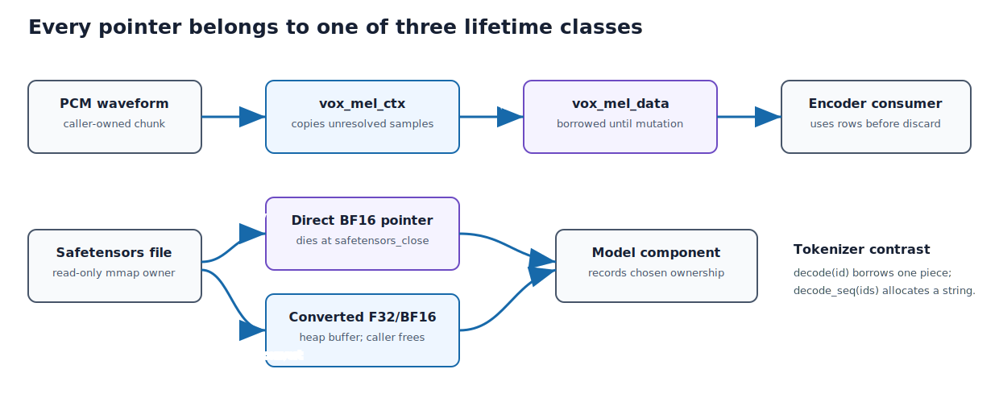

## Purpose and place in the application

These files transform waveform samples into log-Mel features, map Tekken token IDs to UTF-8 pieces, and expose safetensors mappings without copying large BF16 arrays unnecessarily.

They feed and describe the state consumed by the streaming runtime. Errors here usually appear as load failures, dimension mismatches, malformed WAV input, or invalid token text.


### Boundary formats

Audio code establishes the exact numerical representation entering the model.
Safetensors code establishes tensor names, shapes, dtypes, mapped ownership, and
bounds. Tokenizer code establishes the mapping between decoder IDs and bytes.
These are not peripheral parsers: they define the model ABI on disk.

ABI means Application Binary Interface. FFT means Fast Fourier Transform.
STFT means Short-Time Fourier Transform. `mmap` maps file-backed virtual memory
into the process. UTF-8 means Unicode Transformation Format, 8-bit form.

For every returned pointer, determine ownership: borrowed mapped bytes, newly
allocated converted values, or internal context storage. C's type system does
not encode those lifetime distinctions.

{#fig-voxtral-input-ownership width=96%}


## How to read this chapter

Combined source SHA-256: `96b76278917aa045b25aff4ad4f624055a7b91ceeb2361348438b0c27a84ac9d`.

For each file, first read its hand-written role, ownership, invariants, and failure model. Source blocks retain original line numbers and syntax highlighting. Boundaries follow declarations where practical; a very large declaration is split only for pagination and is labeled as a continuation. The generator reconstructs every file from emitted blocks and compares every byte with the repository source. No prose claim is generated by counting calls or assignments with regular expressions.

## From waveform to log-Mel features

For windowed sample vector \(x[n]\), the front end applies a window function
and computes a discrete Fourier transform. Power is accumulated into
frequency-domain magnitudes, then projected through triangular Mel filters:

```text
mel_energy[m, t] = sum_k filter[m, k] * |FFT(windowed_frame[t])[k]|^2
```

The logarithm compresses dynamic range. Model-specific clipping/normalization
must match training exactly; a mathematically reasonable alternative can still
produce unusable recognition because it changes the checkpoint's input
distribution.

Incremental extraction retains samples that do not yet form a complete window.
At finish, right padding supplies the final windows. Frame offset records how
many earlier frames were compacted away.

## Safetensors as a model ABI

A safetensors file has:

1. an eight-byte little-endian header length;
2. a JSON object describing dtype, shape, and byte offsets;
3. a contiguous raw-data region.

Memory mapping avoids copying multi-gigabyte weights. This parser validates the
header length and JSON and checks every tensor's byte range against the mapping,
rejecting offset overflow and ranges that fall past the file. It does not check
for overlapping tensors or negative shape dimensions; an unsupported dtype is
carried as `DTYPE_UNKNOWN` and rejected later, when an accessor is asked to read
it.

BF16 direct access borrows mapped bytes. F32 conversion allocates a new buffer.
Those two accessors intentionally have different ownership and memory cost.

## Token bytes

Tokenizer pieces are byte strings, not guaranteed standalone Unicode strings.
A multi-byte UTF-8 character may span tokens. The queue accumulates pieces in
order; display code should operate on validated assembled text rather than
assuming one token equals one character or word.


## `Sources/CVoxtralEngine/Engine/voxtral_audio.h`

**Role.** This file is reproduced completely below. Read declarations in source order because later helpers rely on ownership and invariants established earlier.

Read this file as one ownership unit. The source is divided at declaration boundaries for navigation; commentary does not infer behavior from identifier spelling.

Length: 71 lines. SHA-256: `189ab9b53209e2f118c26e441058444451c2d36d38e95d268b3b1b57d7fa64f5`.

### Declaration map

This map gives the reading spine of the file. Line numbers refer to the original source and to the numbered listings below.

| Line | Declaration or entry point |
| ---: | --- |
| 5 | `#ifndef VOXTRAL_AUDIO_H` |
| 6 | `#define VOXTRAL_AUDIO_H` |
| 12 | `extern int vox_verbose_audio;` |
| 18 | `float *vox_load_wav(const char *path, int *out_n_samples);` |
| 22 | `float *vox_parse_wav_buffer(const uint8_t *data, size_t size, int *out_n_samples);` |
| 27 | `float *vox_read_pcm_stdin(int *out_n_samples);` |
| 34 | `float *vox_mel_spectrogram(const float *samples, int n_samples, int *out_frames);` |
| 41 | `typedef struct vox_mel_ctx vox_mel_ctx_t;` |
| 46 | `vox_mel_ctx_t *vox_mel_ctx_init(int left_pad_samples);` |
| 50 | `int vox_mel_feed(vox_mel_ctx_t *ctx, const float *samples, int n_samples);` |
| 55 | `int vox_mel_finish(vox_mel_ctx_t *ctx, int right_pad_samples);` |
| 58 | `float *vox_mel_data(vox_mel_ctx_t *ctx, int *out_n_frames);` |
| 62 | `int vox_mel_frame_offset(vox_mel_ctx_t *ctx);` |
| 66 | `void vox_mel_discard_before(vox_mel_ctx_t *ctx, int keep_from_frame);` |
| 69 | `void vox_mel_free(vox_mel_ctx_t *ctx);` |
| 71 | `#endif /* VOXTRAL_AUDIO_H */` |

### Continuation of the surrounding declaration (lines 1-4)

Original source lines 1-4. The boundary follows a declaration or a pagination break inside one large declaration; the listing remains byte-for-byte source.

```{.c .numberLines startFrom="1"}
/*
 * voxtral_audio.h - WAV loading and mel spectrogram computation
 */

```

### `#ifndef VOXTRAL_AUDIO_H`

Original source lines 5-5. The boundary follows a declaration or a pagination break inside one large declaration; the listing remains byte-for-byte source.

```{.c .numberLines startFrom="5"}
#ifndef VOXTRAL_AUDIO_H
```

### `#define VOXTRAL_AUDIO_H`

Original source lines 6-11. The boundary follows a declaration or a pagination break inside one large declaration; the listing remains byte-for-byte source.

```{.c .numberLines startFrom="6"}
#define VOXTRAL_AUDIO_H

#include <stddef.h>
#include <stdint.h>

/* Verbose flag for audio module */
```

### `extern int vox_verbose_audio;`

Original source lines 12-17. The boundary follows a declaration or a pagination break inside one large declaration; the listing remains byte-for-byte source.

```{.c .numberLines startFrom="12"}
extern int vox_verbose_audio;

/* Load a WAV file, returns mono float32 samples in [-1,1] at 16kHz.
 * Handles: 16-bit PCM, mono or stereo (mixed to mono).
 * Resamples to 16kHz if needed.
 * Returns NULL on error. Caller must free returned buffer. */
```

### `float *vox_load_wav(const char *path, int *out_n_samples);`

Original source lines 18-21. The boundary follows a declaration or a pagination break inside one large declaration; the listing remains byte-for-byte source.

Loads a supported WAV and returns newly allocated normalized float samples;
`out_n_samples` receives the length. The caller frees the buffer. File I/O is
separate from the in-memory parser so binary parsing can be tested directly.

```{.c .numberLines startFrom="18"}
float *vox_load_wav(const char *path, int *out_n_samples);

/* Parse a WAV file from a memory buffer. Same behavior as vox_load_wav
 * but operates on data already in memory. Caller must free returned buffer. */
```

### `float *vox_parse_wav_buffer(const uint8_t *data, size_t size, int *out_n_samples);`

Original source lines 22-26. The boundary follows a declaration or a pagination break inside one large declaration; the listing remains byte-for-byte source.

Parses a bounded RIFF/WAVE byte range and returns owned 16 kHz mono float
samples. Unsupported channel, rate, encoding, or bit-depth combinations are
rejected rather than silently resampled.

```{.c .numberLines startFrom="22"}
float *vox_parse_wav_buffer(const uint8_t *data, size_t size, int *out_n_samples);

/* Read audio from stdin, returns mono float32 samples in [-1,1] at 16kHz.
 * Auto-detects format: WAV (RIFF header) or raw s16le 16kHz mono.
 * Returns NULL on error. Caller must free returned buffer. */
```

### `float *vox_read_pcm_stdin(int *out_n_samples);`

Original source lines 27-33. The boundary follows a declaration or a pagination break inside one large declaration; the listing remains byte-for-byte source.

Reads raw little-endian signed PCM16 mono from standard input and returns an
owned float array. This supports command-line tools; the GUI uses Core Audio.

```{.c .numberLines startFrom="27"}
float *vox_read_pcm_stdin(int *out_n_samples);

/* Compute log-mel spectrogram from audio samples.
 * samples: mono float32 at 16kHz
 * n_samples: number of samples
 * out_frames: set to number of mel frames produced
 * Returns: [n_frames, 128] mel spectrogram (caller must free) */
```

### `float *vox_mel_spectrogram(const float *samples, int n_samples, int *out_frames);`

Original source lines 34-40. The boundary follows a declaration or a pagination break inside one large declaration; the listing remains byte-for-byte source.

One-shot front end returning an owned row-major `[frames, 128]` log-Mel matrix.
Streaming callers use `vox_mel_ctx_t`; this function defines equivalent batch
semantics for files and diagnostics.

```{.c .numberLines startFrom="34"}
float *vox_mel_spectrogram(const float *samples, int n_samples, int *out_frames);

/* ========================================================================
 * Incremental Mel Spectrogram (for real-time streaming)
 * ======================================================================== */

/* Opaque context for incremental mel computation */
```

### `typedef struct vox_mel_ctx vox_mel_ctx_t;`

Original source lines 41-45. The boundary follows a declaration or a pagination break inside one large declaration; the listing remains byte-for-byte source.

Opaque incremental feature state. It hides retained waveform tails, Mel rows,
FFT/filter workspaces, absolute offsets, and finish state so callers cannot
violate compaction invariants.

```{.c .numberLines startFrom="41"}
typedef struct vox_mel_ctx vox_mel_ctx_t;

/* Create incremental mel context. left_pad_samples zeros are prepended
 * (e.g. 40960 for 32 left-pad tokens). An additional 200 samples of
 * center=True padding are added automatically. */
```

### `vox_mel_ctx_t *vox_mel_ctx_init(int left_pad_samples);`

Original source lines 46-49. The boundary follows a declaration or a pagination break inside one large declaration; the listing remains byte-for-byte source.

Allocates incremental state and inserts the requested left padding before real
audio. That padding reproduces the model's trained boundary condition and is not
counted as classroom speech.

```{.c .numberLines startFrom="46"}
vox_mel_ctx_t *vox_mel_ctx_init(int left_pad_samples);

/* Feed new audio samples. Computes all mel frames whose 400-sample window
 * fits within available data. Returns number of NEW frames computed. */
```

### `int vox_mel_feed(vox_mel_ctx_t *ctx, const float *samples, int n_samples);`

Original source lines 50-54. The boundary follows a declaration or a pagination break inside one large declaration; the listing remains byte-for-byte source.

Copies waveform samples into context storage and computes every newly complete
analysis window. Success means input was accepted; zero new stable frames is a
normal outcome for a short chunk.

```{.c .numberLines startFrom="50"}
int vox_mel_feed(vox_mel_ctx_t *ctx, const float *samples, int n_samples);

/* Finalize: append right_pad_samples zeros, then 200-sample right reflect
 * padding, compute remaining frames, drop last frame (vLLM convention).
 * Returns number of available mel frames. */
```

### `int vox_mel_finish(vox_mel_ctx_t *ctx, int right_pad_samples);`

Original source lines 55-57. The boundary follows a declaration or a pagination break inside one large declaration; the listing remains byte-for-byte source.

Adds terminal right padding exactly once and computes the final windows. It
establishes end-of-input, so feeding later samples would violate the context
lifecycle.

```{.c .numberLines startFrom="55"}
int vox_mel_finish(vox_mel_ctx_t *ctx, int right_pad_samples);

/* Get pointer to mel buffer and available frame count. */
```

### `float *vox_mel_data(vox_mel_ctx_t *ctx, int *out_n_frames);`

Original source lines 58-61. The boundary follows a declaration or a pagination break inside one large declaration; the listing remains byte-for-byte source.

Returns a borrowed pointer to current contiguous Mel rows and writes their local
count. Feed, discard, or free may invalidate the pointer.

```{.c .numberLines startFrom="58"}
float *vox_mel_data(vox_mel_ctx_t *ctx, int *out_n_frames);

/* Global mel frame index corresponding to mel_data()[0].
 * Needed when the context compacts old frames in long-running streams. */
```

### `int vox_mel_frame_offset(vox_mel_ctx_t *ctx);`

Original source lines 62-65. The boundary follows a declaration or a pagination break inside one large declaration; the listing remains byte-for-byte source.

Returns the absolute frame represented by local row zero after compaction.
Downstream code adds this offset so array movement never resets model position.

```{.c .numberLines startFrom="62"}
int vox_mel_frame_offset(vox_mel_ctx_t *ctx);

/* Discard mel frames with global index < keep_from_frame.
 * Keeps memory bounded in non-stop streams. */
```

### `void vox_mel_discard_before(vox_mel_ctx_t *ctx, int keep_from_frame);`

Original source lines 66-68. The boundary follows a declaration or a pagination break inside one large declaration; the listing remains byte-for-byte source.

Discards rows older than an absolute boundary, moves the retained suffix, and
advances the frame offset. This bounds memory without changing retained rows'
temporal identity.

```{.c .numberLines startFrom="66"}
void vox_mel_discard_before(vox_mel_ctx_t *ctx, int keep_from_frame);

/* Free incremental mel context. */
```

### `void vox_mel_free(vox_mel_ctx_t *ctx);`

Original source lines 69-70. The boundary follows a declaration or a pagination break inside one large declaration; the listing remains byte-for-byte source.

Releases all incremental waveform, feature, FFT, filter, and context storage.
Every borrowed Mel pointer becomes invalid.

```{.c .numberLines startFrom="69"}
void vox_mel_free(vox_mel_ctx_t *ctx);

```

### `#endif /* VOXTRAL_AUDIO_H */`

Original source lines 71-71. The boundary follows a declaration or a pagination break inside one large declaration; the listing remains byte-for-byte source.

```{.c .numberLines startFrom="71"}
#endif /* VOXTRAL_AUDIO_H */
```

## `Sources/CVoxtralEngine/Engine/voxtral_audio.c`

**Role.** This file is reproduced completely below. Read declarations in source order because later helpers rely on ownership and invariants established earlier.

The first half implements bounded WAV parsing and a one-shot log-Mel
spectrogram. The second half is the incremental front end. It retains enough
left waveform context for future windows, emits only complete frames, tracks an
absolute frame offset across compaction, and adds right padding exactly once at
finish.

Keep units explicit: waveform samples at 16 kHz, FFT windows, hop positions,
Mel bins, and emitted frame indices. Most streaming errors in this layer are
off-by-one mistakes between retained sample indices and absolute frame indices.

Length: 672 lines. SHA-256: `aa356f3835fb23b6337ab9b7b186ce621c00b2923f019acdb9a28a745b1ec0c7`.

### Declaration map

This map gives the reading spine of the file. Line numbers refer to the original source and to the numbered listings below.

| Line | Declaration or entry point |
| ---: | --- |
| 44 | `static uint16_t read_u16(const uint8_t *p) { return p[0] \| (p[1] << 8); }` |
| 45 | `static uint32_t read_u32(const uint8_t *p) { return p[0] \| (p[1] << 8) \| (p[2] << 16) \| (p[3] << 24); }` |
| 49 | `float *vox_parse_wav_buffer(const uint8_t *data, size_t file_size, int *out_n_samples) {` |
| 143 | `float *vox_load_wav(const char *path, int *out_n_samples) {` |
| 168 | `float *vox_read_pcm_stdin(int *out_n_samples) {` |
| 223 | `static float hertz_to_mel(float freq) {` |
| 235 | `static float mel_to_hertz(float mels) {` |
| 248 | `static float *build_mel_filters(void) {` |
| 294 | `float *vox_mel_spectrogram(const float *samples, int n_samples, int *out_frames) {` |
| 405 | `struct vox_mel_ctx {` |
| 432 | `static void mel_compact_samples(vox_mel_ctx_t *ctx) {` |
| 454 | `static int mel_compute_available(vox_mel_ctx_t *ctx) {` |
| 515 | `vox_mel_ctx_t *vox_mel_ctx_init(int left_pad_samples) {` |
| 560 | `int vox_mel_feed(vox_mel_ctx_t *ctx, const float *samples, int n_samples) {` |
| 584 | `int vox_mel_finish(vox_mel_ctx_t *ctx, int right_pad_samples) {` |
| 635 | `float *vox_mel_data(vox_mel_ctx_t *ctx, int *out_n_frames) {` |
| 641 | `int vox_mel_frame_offset(vox_mel_ctx_t *ctx) {` |
| 645 | `void vox_mel_discard_before(vox_mel_ctx_t *ctx, int keep_from_frame) {` |
| 664 | `void vox_mel_free(vox_mel_ctx_t *ctx) {` |

### Continuation of the surrounding declaration (lines 1-43)

Original source lines 1-43. The boundary follows a declaration or a pagination break inside one large declaration; the listing remains byte-for-byte source.

```{.c .numberLines startFrom="1"}
/*
 * voxtral_audio.c - WAV loading and mel spectrogram computation
 *
 * Mel spectrogram parameters (from params.json):
 *   Sample rate: 16000 Hz
 *   Mel bins: 128
 *   Hop length: 160 (10ms)
 *   Window size: 400 (25ms)
 *   global_log_mel_max: 1.5
 *
 * This implementation matches vLLM:
 *   vllm/vllm/model_executor/models/voxtral.py::VoxtralEncoderModel.compute_whisper_melspec()
 * which uses:
 *   - torch.hann_window(window_size=400) (periodic)
 *   - torch.stft(n_fft=400, hop_length=160, center=True, pad_mode="reflect")
 *   - magnitudes = stft[..., :-1].abs() ** 2 (drop last frame)
 *   - mel_filter_bank from mistral_common (Slaney-style)
 *   - log10 clamp to [global_log_mel_max-8, global_log_mel_max], then (val+4)/4
 */

#include "voxtral_audio.h"
#include <stdio.h>
#include <stdlib.h>
#include <string.h>
#include <math.h>

#ifndef M_PI
#define M_PI 3.14159265358979323846
#endif

#define SAMPLE_RATE  16000
#define N_MEL        128
#define HOP_LENGTH   160
#define WIN_LENGTH   400
#define N_FFT        400
#define LOG_MEL_MAX  1.5f
#define N_FREQ       (N_FFT / 2 + 1)    /* 201 bins (matches training) */

/* ========================================================================
 * WAV File Loading
 * ======================================================================== */

/* Read little-endian values from buffer */
```

### `static uint16_t read_u16(const uint8_t *p) { return p[0] | (p[1] << 8); }`

Original source lines 44-44. The boundary follows a declaration or a pagination break inside one large declaration; the listing remains byte-for-byte source.

Decodes a little-endian 16-bit WAV field byte by byte, avoiding alignment and
host-endianness assumptions. The parser checks bounds before calling it.

```{.c .numberLines startFrom="44"}
static uint16_t read_u16(const uint8_t *p) { return p[0] | (p[1] << 8); }
```

### `static uint32_t read_u32(const uint8_t *p) { return p[0] | (p[1] << 8) | (p[2] << 16) | (p[3] << 24); }`

Original source lines 45-48. The boundary follows a declaration or a pagination break inside one large declaration; the listing remains byte-for-byte source.

Decodes a little-endian 32-bit RIFF field without casting an unaligned pointer.

```{.c .numberLines startFrom="45"}
static uint32_t read_u32(const uint8_t *p) { return p[0] | (p[1] << 8) | (p[2] << 16) | (p[3] << 24); }

/* Parse WAV data from a buffer. Returns mono float32 samples at 16kHz.
 * The caller keeps ownership of data. Returns NULL on error. */
```

### `float *vox_parse_wav_buffer(const uint8_t *data, size_t file_size, int *out_n_samples)`

Original source lines 49-142. The boundary follows a declaration or a pagination break inside one large declaration; the listing remains byte-for-byte source.

The parser walks RIFF chunks rather than assuming a fixed header layout. Every
chunk length is bounds-checked, odd-byte padding is respected, and only the
supported PCM representation is converted.

```{.c .numberLines startFrom="49"}
float *vox_parse_wav_buffer(const uint8_t *data, size_t file_size, int *out_n_samples) {
    if (file_size < 44 || memcmp(data, "RIFF", 4) != 0 || memcmp(data + 8, "WAVE", 4) != 0) {
        fprintf(stderr, "parse_wav_buffer: not a valid WAV file\n");
        return NULL;
    }

    int channels = 0, sample_rate = 0, bits_per_sample = 0;
    int audio_format = 0;
    const uint8_t *pcm_data = NULL;
    int pcm_size = 0;

    const uint8_t *p = data + 12;
    const uint8_t *end = data + file_size;

    while (p + 8 <= end) {
        uint32_t chunk_size = read_u32(p + 4);
        if (memcmp(p, "fmt ", 4) == 0 && chunk_size >= 16 && p + 8 + chunk_size <= end) {
            audio_format = read_u16(p + 8);
            channels = read_u16(p + 10);
            sample_rate = read_u32(p + 12);
            bits_per_sample = read_u16(p + 22);
        } else if (memcmp(p, "data", 4) == 0) {
            pcm_data = p + 8;
            pcm_size = chunk_size;
            /* Piped ffmpeg writes 0xFFFFFFFF as data size (int -1); use rest of file */
            if (pcm_size <= 0 || pcm_data + pcm_size > end)
                pcm_size = (int)(end - pcm_data);
            break; /* data is always last meaningful chunk */
        }
        if (p + 8 + chunk_size > end) break;
        p += 8 + chunk_size;
        if (chunk_size & 1) p++;
    }

    if (audio_format != 1 || bits_per_sample != 16 || pcm_data == NULL || channels < 1) {
        fprintf(stderr, "parse_wav_buffer: unsupported format (need 16-bit PCM, got fmt=%d bits=%d)\n",
                audio_format, bits_per_sample);
        return NULL;
    }

    int n_frames = pcm_size / (channels * 2);

    float *samples = (float *)malloc(n_frames * sizeof(float));
    if (!samples) return NULL;

    const int16_t *src = (const int16_t *)pcm_data;
    for (int i = 0; i < n_frames; i++) {
        if (channels == 1) {
            samples[i] = src[i] / 32768.0f;
        } else {
            float sum = 0;
            for (int c = 0; c < channels; c++) {
                int16_t val;
                memcpy(&val, &src[i * channels + c], sizeof(int16_t));
                sum += val;
            }
            samples[i] = (sum / channels) / 32768.0f;
        }
    }

    /* Resample to 16kHz if needed */
    if (sample_rate != SAMPLE_RATE) {
        int new_n = (int)((long long)n_frames * SAMPLE_RATE / sample_rate);
        float *resampled = (float *)malloc(new_n * sizeof(float));
        if (!resampled) {
            free(samples);
            return NULL;
        }

        for (int i = 0; i < new_n; i++) {
            float src_pos = (float)i * sample_rate / SAMPLE_RATE;
            int idx = (int)src_pos;
            float frac = src_pos - idx;
            if (idx + 1 < n_frames) {
                resampled[i] = samples[idx] * (1.0f - frac) + samples[idx + 1] * frac;
            } else {
                resampled[i] = (idx < n_frames) ? samples[idx] : 0.0f;
            }
        }

        free(samples);
        samples = resampled;
        n_frames = new_n;

        if (vox_verbose_audio) {
            fprintf(stderr, "  Resampled %d -> %d Hz (%d samples)\n",
                    sample_rate, SAMPLE_RATE, n_frames);
        }
    }

    *out_n_samples = n_frames;
    return samples;
}

```

### `float *vox_load_wav(const char *path, int *out_n_samples)`

Original source lines 143-167. The boundary follows a declaration or a pagination break inside one large declaration; the listing remains byte-for-byte source.

Reads the file into owned memory, delegates all chunk and format validation to
`vox_parse_wav_buffer`, then frees file bytes. Returned samples have independent
ownership.

```{.c .numberLines startFrom="143"}
float *vox_load_wav(const char *path, int *out_n_samples) {
    FILE *f = fopen(path, "rb");
    if (!f) {
        fprintf(stderr, "vox_load_wav: cannot open %s\n", path);
        return NULL;
    }

    fseek(f, 0, SEEK_END);
    long file_size = ftell(f);
    if (file_size <= 0) { fclose(f); return NULL; }
    fseek(f, 0, SEEK_SET);

    uint8_t *data = (uint8_t *)malloc(file_size);
    if (!data || fread(data, 1, file_size, f) != (size_t)file_size) {
        fclose(f);
        free(data);
        return NULL;
    }
    fclose(f);

    float *samples = vox_parse_wav_buffer(data, (size_t)file_size, out_n_samples);
    free(data);
    return samples;
}

```

### `float *vox_read_pcm_stdin(int *out_n_samples)`

Original source lines 168-222. The boundary follows a declaration or a pagination break inside one large declaration; the listing remains byte-for-byte source.

Grows a byte buffer while reading stdin, ignores an incomplete trailing byte,
and converts complete `int16_t` values to float. Its input format is the fixed
raw format documented by the CLI.

```{.c .numberLines startFrom="168"}
float *vox_read_pcm_stdin(int *out_n_samples) {
    /* Read all of stdin into a growing buffer */
    size_t capacity = 1024 * 1024; /* 1 MB initial */
    size_t size = 0;
    uint8_t *buf = (uint8_t *)malloc(capacity);
    if (!buf) return NULL;

    while (1) {
        if (size == capacity) {
            capacity *= 2;
            uint8_t *tmp = (uint8_t *)realloc(buf, capacity);
            if (!tmp) { free(buf); return NULL; }
            buf = tmp;
        }
        size_t n = fread(buf + size, 1, capacity - size, stdin);
        if (n == 0) break;
        size += n;
    }

    if (size < 4) {
        fprintf(stderr, "vox_read_pcm_stdin: no data on stdin\n");
        free(buf);
        return NULL;
    }

    fprintf(stderr, "Read %zu bytes from stdin\n", size);

    /* Auto-detect: WAV (RIFF header) or raw s16le */
    if (memcmp(buf, "RIFF", 4) == 0) {
        fprintf(stderr, "Detected WAV format on stdin\n");
        float *samples = vox_parse_wav_buffer(buf, size, out_n_samples);
        free(buf);
        return samples;
    }

    /* Treat as raw s16le 16kHz mono */
    fprintf(stderr, "Treating stdin as raw s16le 16kHz mono\n");
    int n_frames = (int)(size / 2);
    float *samples = (float *)malloc(n_frames * sizeof(float));
    if (!samples) { free(buf); return NULL; }

    const int16_t *src = (const int16_t *)buf;
    for (int i = 0; i < n_frames; i++) {
        samples[i] = src[i] / 32768.0f;
    }

    free(buf);
    *out_n_samples = n_frames;
    return samples;
}

/* ========================================================================
 * Mel Filter Bank (Slaney-style, from mistral_common)
 * ======================================================================== */

```

### `static float hertz_to_mel(float freq)`

Original source lines 223-234. The boundary follows a declaration or a pagination break inside one large declaration; the listing remains byte-for-byte source.

Maps physical frequency to the Mel coordinate used for filter placement.
Changing this formula changes the checkpoint's expected feature distribution.

```{.c .numberLines startFrom="223"}
static float hertz_to_mel(float freq) {
    const float min_log_hertz = 1000.0f;
    const float min_log_mel = 15.0f;
    const float logstep = 27.0f / logf(6.4f);

    float mels = 3.0f * freq / 200.0f;
    if (freq >= min_log_hertz) {
        mels = min_log_mel + logf(freq / min_log_hertz) * logstep;
    }
    return mels;
}

```

### `static float mel_to_hertz(float mels)`

Original source lines 235-247. The boundary follows a declaration or a pagination break inside one large declaration; the listing remains byte-for-byte source.

Inverts the selected Mel mapping so evenly spaced Mel band edges can be mapped
back to FFT-bin frequencies.

```{.c .numberLines startFrom="235"}
static float mel_to_hertz(float mels) {
    const float min_log_hertz = 1000.0f;
    const float min_log_mel = 15.0f;
    const float logstep = logf(6.4f) / 27.0f;

    float freq = 200.0f * mels / 3.0f;
    if (mels >= min_log_mel) {
        freq = min_log_hertz * expf(logstep * (mels - min_log_mel));
    }
    return freq;
}

/* Build mel filter bank: [N_MEL, N_FREQ] */
```

### `static float *build_mel_filters(void)`

Original source lines 248-293. The boundary follows a declaration or a pagination break inside one large declaration; the listing remains byte-for-byte source.

Constructs the [128, 201] Slaney triangular mel filter bank as a caller-owned
array. FFT bin centers span 0..8000 Hz; band edges are placed uniformly in mel
space and mapped back to hertz, each triangle is the min of rising and falling
slopes clamped at zero, then area-normalized. A tiny epsilon guards zero band
widths against division by zero.

```{.c .numberLines startFrom="248"}
static float *build_mel_filters(void) {
    float *filters = (float *)calloc((size_t)N_MEL * N_FREQ, sizeof(float));
    if (!filters) return NULL;

    /* FFT bin center frequencies (0..8000 inclusive) */
    float fft_freqs[N_FREQ];
    for (int i = 0; i < N_FREQ; i++) {
        fft_freqs[i] = (float)i * ((float)SAMPLE_RATE / 2.0f) / (float)(N_FREQ - 1);
    }

    float mel_min = hertz_to_mel(0.0f);
    float mel_max = hertz_to_mel((float)SAMPLE_RATE / 2.0f);

    float filter_freqs[N_MEL + 2];
    float filter_diff[N_MEL + 1];

    for (int i = 0; i < N_MEL + 2; i++) {
        float mel = mel_min + (mel_max - mel_min) * (float)i / (float)(N_MEL + 1);
        filter_freqs[i] = mel_to_hertz(mel);
    }
    for (int i = 0; i < N_MEL + 1; i++) {
        filter_diff[i] = filter_freqs[i + 1] - filter_freqs[i];
        if (filter_diff[i] == 0.0f) filter_diff[i] = 1e-6f;
    }

    for (int m = 0; m < N_MEL; m++) {
        float enorm = 2.0f / (filter_freqs[m + 2] - filter_freqs[m]);
        for (int f = 0; f < N_FREQ; f++) {
            float down = (fft_freqs[f] - filter_freqs[m]) / filter_diff[m];
            float up = (filter_freqs[m + 2] - fft_freqs[f]) / filter_diff[m + 1];
            float val = fminf(down, up);
            if (val < 0.0f) val = 0.0f;
            filters[(size_t)m * N_FREQ + f] = val * enorm;
        }
    }

    return filters;
}

/* ========================================================================
 * Mel Spectrogram
 * ======================================================================== */

/* Global verbose flag for audio module (declared extern in header, defined here) */
int vox_verbose_audio = 0;

```

### `float *vox_mel_spectrogram(const float *samples, int n_samples, int *out_frames)`

Original source lines 294-404. The boundary follows a declaration or a pagination break inside one large declaration; the listing remains byte-for-byte source.

Computes a full [n_frames, 128] log-mel spectrogram in one shot, matching vLLM:
center reflect-pad by n_fft/2, periodic Hann window, a direct DFT per frame over
precomputed cos/sin tables, power, mel projection, then log10 clamped and
rescaled by (val+4)/4. Drops the final STFT frame to mirror stft[..., :-1].
Caller-owned result; all scratch is freed before return.

```{.c .numberLines startFrom="294"}
float *vox_mel_spectrogram(const float *samples, int n_samples, int *out_frames) {
    int n_fft = N_FFT;
    int n_freqs = N_FREQ;
    int pad_len = n_fft / 2; /* center=True padding (reflect) */

    /* Reflect-pad the signal */
    int padded_len = n_samples + 2 * pad_len;
    float *padded = (float *)malloc(padded_len * sizeof(float));

    /* Left reflect pad: samples[pad_len..1] (reversed, excluding samples[0]) */
    for (int i = 0; i < pad_len; i++) {
        int src = pad_len - i;
        padded[i] = (src < n_samples) ? samples[src] : 0.0f;
    }
    /* Copy original signal */
    memcpy(padded + pad_len, samples, n_samples * sizeof(float));
    /* Right reflect pad: samples[n-2..n-pad_len-1] (reversed) */
    for (int i = 0; i < pad_len; i++) {
        int src = n_samples - 2 - i;
        padded[pad_len + n_samples + i] = (src >= 0) ? samples[src] : 0.0f;
    }

    int n_frames_total = (padded_len - n_fft) / HOP_LENGTH + 1;
    /* vLLM drops the last STFT frame: magnitudes = stft[..., :-1] */
    int n_frames = n_frames_total - 1;
    if (n_frames <= 0) {
        fprintf(stderr, "vox_mel_spectrogram: audio too short (%d samples)\n", n_samples);
        free(padded);
        return NULL;
    }

    /* Build mel filter bank */
    float *mel_filters = build_mel_filters();
    if (!mel_filters) {
        free(padded);
        return NULL;
    }

    /* Periodic Hann window (length 400, periodic=True) */
    float window[WIN_LENGTH];
    for (int i = 0; i < WIN_LENGTH; i++) {
        window[i] = 0.5f * (1.0f - cosf(2.0f * (float)M_PI * (float)i / (float)WIN_LENGTH));
    }

    /* Precompute DFT cos/sin tables: [k * N_FFT + n] = cos/sin(2*pi*k*n/N_FFT) */
    float *dft_cos = (float *)malloc((size_t)N_FREQ * N_FFT * sizeof(float));
    float *dft_sin = (float *)malloc((size_t)N_FREQ * N_FFT * sizeof(float));
    for (int k = 0; k < N_FREQ; k++) {
        for (int n = 0; n < N_FFT; n++) {
            float angle = 2.0f * (float)M_PI * (float)k * (float)n / (float)N_FFT;
            dft_cos[k * N_FFT + n] = cosf(angle);
            dft_sin[k * N_FFT + n] = sinf(angle);
        }
    }

    /* Allocate output: [n_frames, N_MEL] */
    float *mel = (float *)calloc(n_frames * N_MEL, sizeof(float));

    /* Working buffers */
    float windowed[N_FFT];
    float power[N_FREQ];

    /* Process each frame */
    for (int t = 0; t < n_frames; t++) {
        int start = t * HOP_LENGTH;

        /* Windowed frame (N_FFT == WIN_LENGTH, no zero-padding needed) */
        for (int i = 0; i < N_FFT; i++)
            windowed[i] = padded[start + i] * window[i];

        /* Direct DFT -> power spectrum (exact, no interpolation) */
        for (int k = 0; k < n_freqs; k++) {
            float re = 0, im = 0;
            const float *cos_row = dft_cos + k * N_FFT;
            const float *sin_row = dft_sin + k * N_FFT;
            for (int n = 0; n < N_FFT; n++) {
                re += windowed[n] * cos_row[n];
                im += windowed[n] * sin_row[n];
            }
            power[k] = re * re + im * im;
        }

        /* Apply mel filters: mel[t] = mel_filters @ power */
        for (int m = 0; m < N_MEL; m++) {
            float sum = 0.0f;
            const float *filt = mel_filters + (size_t)m * n_freqs;
            for (int k = 0; k < n_freqs; k++) {
                sum += filt[k] * power[k];
            }
            /* Log10 clamp */
            if (sum < 1e-10f) sum = 1e-10f;
            float val = log10f(sum);
            float min_val = LOG_MEL_MAX - 8.0f;
            if (val < min_val) val = min_val;
            mel[t * N_MEL + m] = (val + 4.0f) / 4.0f;
        }
    }

    free(dft_cos);
    free(dft_sin);
    free(padded);
    free(mel_filters);

    *out_frames = n_frames;
    return mel;
}

/* ========================================================================
 * Incremental Mel Spectrogram
 * ======================================================================== */

```

### `struct vox_mel_ctx`

Original source lines 405-431. The boundary follows a declaration or a pagination break inside one large declaration; the listing remains byte-for-byte source.

State for incremental mel: precomputed filter bank, DFT cos/sin tables, and Hann
window built once; a growing padded sample ring tracked by sample_offset; and a
growing mel buffer tracked by mel_frame_offset. The two global offsets let old
samples and emitted frames be compacted while callers keep addressing positions
in absolute coordinates.

```{.c .numberLines startFrom="405"}
struct vox_mel_ctx {
    /* Precomputed tables (built once in init) */
    float *mel_filters;     /* [N_MEL * N_FREQ] */
    float *dft_cos;         /* [N_FREQ * N_FFT] DFT cos table */
    float *dft_sin;         /* [N_FREQ * N_FFT] DFT sin table */
    float window[WIN_LENGTH];

    /* Padded audio sample buffer (growing).
     * Starts with left_pad zeros, then real samples appended via feed(). */
    float *samples;
    int n_samples;          /* current length of samples buffer */
    int samples_cap;
    int64_t sample_offset;  /* global sample index of samples[0] */

    /* Mel frame buffer (growing) */
    float *mel;
    int n_mel_frames;       /* currently available frames in mel[] */
    int mel_cap;            /* allocated frame capacity */
    int mel_frame_offset;   /* global frame index of mel[0] */

    int left_pad;           /* total left padding = 200 + left_pad_samples */
    int finished;           /* set by vox_mel_finish */
};

#define MEL_SAMPLE_COMPACT_MIN 16000 /* compact every ~1s of audio progress */

/* Drop old audio samples that can no longer contribute to future mel frames. */
```

### `static void mel_compact_samples(vox_mel_ctx_t *ctx)`

Original source lines 432-453. The boundary follows a declaration or a pagination break inside one large declaration; the listing remains byte-for-byte source.

Drops waveform samples that can no longer contribute to any future window,
retains the unresolved tail, and advances its absolute sample origin. Compaction
waits for enough progress to amortize the memory move.

```{.c .numberLines startFrom="432"}
static void mel_compact_samples(vox_mel_ctx_t *ctx) {
    if (!ctx || ctx->n_samples <= WIN_LENGTH) return;

    int64_t next_frame_global = (int64_t)ctx->mel_frame_offset + ctx->n_mel_frames;
    int64_t needed_from_global = next_frame_global * HOP_LENGTH;
    int64_t discard64 = needed_from_global - ctx->sample_offset;
    if (discard64 <= 0) return;

    int discard = (discard64 > ctx->n_samples) ? ctx->n_samples : (int)discard64;
    if (discard < MEL_SAMPLE_COMPACT_MIN &&
        ctx->n_samples < (ctx->samples_cap * 3) / 4) return;

    int remain = ctx->n_samples - discard;
    if (remain > 0) {
        memmove(ctx->samples, ctx->samples + discard, (size_t)remain * sizeof(float));
    }
    ctx->n_samples = remain;
    ctx->sample_offset += discard;
}

/* Compute mel frames for all windows that fit in available data.
 * Each frame t needs samples[t*HOP_LENGTH .. t*HOP_LENGTH + WIN_LENGTH - 1]. */
```

### `static int mel_compute_available(vox_mel_ctx_t *ctx)`

Original source lines 454-514. The boundary follows a declaration or a pagination break inside one large declaration; the listing remains byte-for-byte source.

Drains every mel frame whose full window currently fits in the buffered samples,
appending rows to the growing mel array and bumping n_mel_frames. Each frame
applies Hann window, direct DFT over the cos/sin tables, mel projection, and the
log10 clamp/rescale, identical math to the one-shot path. Returns how many new
frames were produced; stops at the first window past available data.

```{.c .numberLines startFrom="454"}
static int mel_compute_available(vox_mel_ctx_t *ctx) {
    int new_frames = 0;
    float windowed[N_FFT];
    float power[N_FREQ];

    while (1) {
        int t = ctx->n_mel_frames;
        int64_t t_global = (int64_t)ctx->mel_frame_offset + t;
        int64_t start_global = t_global * HOP_LENGTH;
        int64_t start64 = start_global - ctx->sample_offset;
        int64_t end64 = start64 + WIN_LENGTH;
        if (start64 < 0 || end64 > ctx->n_samples) break;
        int start = (int)start64;

        /* Ensure mel buffer capacity */
        if (t >= ctx->mel_cap) {
            int new_cap = ctx->mel_cap ? ctx->mel_cap * 2 : 1024;
            float *tmp = (float *)realloc(ctx->mel,
                (size_t)new_cap * N_MEL * sizeof(float));
            if (!tmp) break;
            ctx->mel = tmp;
            ctx->mel_cap = new_cap;
        }

        /* Windowed frame (N_FFT == WIN_LENGTH, no zero-padding needed) */
        for (int i = 0; i < N_FFT; i++)
            windowed[i] = ctx->samples[start + i] * ctx->window[i];

        /* Direct DFT -> power spectrum (exact, no interpolation) */
        for (int k = 0; k < N_FREQ; k++) {
            float re = 0, im = 0;
            const float *cos_row = ctx->dft_cos + k * N_FFT;
            const float *sin_row = ctx->dft_sin + k * N_FFT;
            for (int n = 0; n < N_FFT; n++) {
                re += windowed[n] * cos_row[n];
                im += windowed[n] * sin_row[n];
            }
            power[k] = re * re + im * im;
        }

        /* Apply mel filters + log10 clamp */
        float *mel_row = ctx->mel + (size_t)t * N_MEL;
        for (int m = 0; m < N_MEL; m++) {
            float sum = 0.0f;
            const float *filt = ctx->mel_filters + (size_t)m * N_FREQ;
            for (int k = 0; k < N_FREQ; k++) {
                sum += filt[k] * power[k];
            }
            if (sum < 1e-10f) sum = 1e-10f;
            float val = log10f(sum);
            float min_val = LOG_MEL_MAX - 8.0f;
            if (val < min_val) val = min_val;
            mel_row[m] = (val + 4.0f) / 4.0f;
        }

        ctx->n_mel_frames++;
        new_frames++;
    }
    return new_frames;
}

```

### `vox_mel_ctx_t *vox_mel_ctx_init(int left_pad_samples)`

Original source lines 515-559. The boundary follows a declaration or a pagination break inside one large declaration; the listing remains byte-for-byte source.

Constructs the filterbank, DFT tables, Hann window, dynamic buffers, and optional
left padding. Failure unwinds partial allocations so null never represents a
half-usable context.

```{.c .numberLines startFrom="515"}
vox_mel_ctx_t *vox_mel_ctx_init(int left_pad_samples) {
    vox_mel_ctx_t *ctx = (vox_mel_ctx_t *)calloc(1, sizeof(vox_mel_ctx_t));
    if (!ctx) return NULL;

    /* Build mel filters */
    ctx->mel_filters = build_mel_filters();
    if (!ctx->mel_filters) { free(ctx); return NULL; }

    /* Precompute DFT cos/sin tables */
    ctx->dft_cos = (float *)malloc((size_t)N_FREQ * N_FFT * sizeof(float));
    ctx->dft_sin = (float *)malloc((size_t)N_FREQ * N_FFT * sizeof(float));
    if (!ctx->dft_cos || !ctx->dft_sin) {
        free(ctx->dft_cos); free(ctx->dft_sin);
        free(ctx->mel_filters); free(ctx);
        return NULL;
    }
    for (int k = 0; k < N_FREQ; k++) {
        for (int n = 0; n < N_FFT; n++) {
            float angle = 2.0f * (float)M_PI * (float)k * (float)n / (float)N_FFT;
            ctx->dft_cos[k * N_FFT + n] = cosf(angle);
            ctx->dft_sin[k * N_FFT + n] = sinf(angle);
        }
    }

    /* Periodic Hann window */
    for (int i = 0; i < WIN_LENGTH; i++) {
        ctx->window[i] = 0.5f * (1.0f - cosf(2.0f * (float)M_PI * (float)i / (float)WIN_LENGTH));
    }

    /* Left padding: 200 (center=True reflect over silence = zeros) + left_pad_samples */
    ctx->left_pad = 200 + left_pad_samples;

    /* Allocate initial sample buffer with left padding (all zeros) */
    ctx->samples_cap = ctx->left_pad + 16000; /* room for ~1s of audio */
    ctx->samples = (float *)calloc((size_t)ctx->samples_cap, sizeof(float));
    if (!ctx->samples) {
        free(ctx->mel_filters);
        free(ctx);
        return NULL;
    }
    ctx->n_samples = ctx->left_pad; /* starts with zeros */

    return ctx;
}

```

### `int vox_mel_feed(vox_mel_ctx_t *ctx, const float *samples, int n_samples)`

Original source lines 560-583. The boundary follows a declaration or a pagination break inside one large declaration; the listing remains byte-for-byte source.

Feed appends samples, computes every newly complete analysis window, and keeps
the unresolved waveform tail. Absolute frame offset is separate from the
current compacted array index.

```{.c .numberLines startFrom="560"}
int vox_mel_feed(vox_mel_ctx_t *ctx, const float *samples, int n_samples) {
    if (!ctx || n_samples <= 0) return 0;

    /* Grow sample buffer if needed */
    int needed = ctx->n_samples + n_samples;
    if (needed > ctx->samples_cap) {
        int new_cap = ctx->samples_cap;
        while (new_cap < needed) new_cap *= 2;
        float *tmp = (float *)realloc(ctx->samples, (size_t)new_cap * sizeof(float));
        if (!tmp) return 0;
        ctx->samples = tmp;
        ctx->samples_cap = new_cap;
    }

    /* Append new samples */
    memcpy(ctx->samples + ctx->n_samples, samples, (size_t)n_samples * sizeof(float));
    ctx->n_samples += n_samples;

    /* Compute all new mel frames that fit */
    int n_new = mel_compute_available(ctx);
    mel_compact_samples(ctx);
    return n_new;
}

```

### `int vox_mel_finish(vox_mel_ctx_t *ctx, int right_pad_samples)`

Original source lines 584-634. The boundary follows a declaration or a pagination break inside one large declaration; the listing remains byte-for-byte source.

Finalizes the incremental front end: appends optional trailing zeros, then 200
samples of right reflect padding from the last real sample (mirroring
center=True), computes all remaining frames, and drops the final frame per the
vLLM stft[..., :-1] convention. Idempotent via the finished flag.

```{.c .numberLines startFrom="584"}
int vox_mel_finish(vox_mel_ctx_t *ctx, int right_pad_samples) {
    if (!ctx || ctx->finished) return ctx ? ctx->n_mel_frames : 0;

    /* Append right_pad_samples zeros */
    if (right_pad_samples > 0) {
        int needed = ctx->n_samples + right_pad_samples;
        if (needed > ctx->samples_cap) {
            int new_cap = ctx->samples_cap;
            while (new_cap < needed) new_cap *= 2;
            float *tmp = (float *)realloc(ctx->samples, (size_t)new_cap * sizeof(float));
            if (!tmp) return ctx->n_mel_frames;
            ctx->samples = tmp;
            ctx->samples_cap = new_cap;
        }
        memset(ctx->samples + ctx->n_samples, 0, (size_t)right_pad_samples * sizeof(float));
        ctx->n_samples += right_pad_samples;
    }

    /* Right reflect padding (200 samples from end of real audio).
     * Find the last non-padding real sample and reflect from there. */
    int reflect_len = 200;
    int needed2 = ctx->n_samples + reflect_len;
    if (needed2 > ctx->samples_cap) {
        int new_cap = ctx->samples_cap;
        while (new_cap < needed2) new_cap *= 2;
        float *tmp = (float *)realloc(ctx->samples, (size_t)new_cap * sizeof(float));
        if (!tmp) return ctx->n_mel_frames;
        ctx->samples = tmp;
        ctx->samples_cap = new_cap;
    }

    /* The end of real content is at n_samples (after right_pad zeros).
     * Reflect from the last real sample before the right-pad zeros:
     * samples[n_samples - right_pad - 2 - i] for i=0..199 */
    int real_end = ctx->n_samples - right_pad_samples;
    for (int i = 0; i < reflect_len; i++) {
        int src = real_end - 2 - i;
        ctx->samples[ctx->n_samples + i] = (src >= 0) ? ctx->samples[src] : 0.0f;
    }
    ctx->n_samples += reflect_len;

    /* Compute remaining frames */
    mel_compute_available(ctx);

    /* Drop last frame (vLLM convention: magnitudes = stft[..., :-1]) */
    if (ctx->n_mel_frames > 0) ctx->n_mel_frames--;

    ctx->finished = 1;
    return ctx->n_mel_frames;
}

```

### `float *vox_mel_data(vox_mel_ctx_t *ctx, int *out_n_frames)`

Original source lines 635-640. The boundary follows a declaration or a pagination break inside one large declaration; the listing remains byte-for-byte source.

Publishes the context's internal row-major feature storage without copying.
Callers consume it before the next mutation.

```{.c .numberLines startFrom="635"}
float *vox_mel_data(vox_mel_ctx_t *ctx, int *out_n_frames) {
    if (!ctx) { if (out_n_frames) *out_n_frames = 0; return NULL; }
    if (out_n_frames) *out_n_frames = ctx->n_mel_frames;
    return ctx->mel;
}

```

### `int vox_mel_frame_offset(vox_mel_ctx_t *ctx)`

Original source lines 641-644. The boundary follows a declaration or a pagination break inside one large declaration; the listing remains byte-for-byte source.

Returns the global frame index of mel[0], i.e. how many frames have already been
discarded from the front. Callers add this to a local row index to recover an
absolute mel position that survives compaction.

```{.c .numberLines startFrom="641"}
int vox_mel_frame_offset(vox_mel_ctx_t *ctx) {
    return ctx ? ctx->mel_frame_offset : 0;
}

```

### `void vox_mel_discard_before(vox_mel_ctx_t *ctx, int keep_from_frame)`

Original source lines 645-663. The boundary follows a declaration or a pagination break inside one large declaration; the listing remains byte-for-byte source.

Converts an absolute keep position to a local row, moves the suffix, reduces the
stored count, and advances `mel_frame_offset`. Boundaries already discarded are
harmless no-ops.

```{.c .numberLines startFrom="645"}
void vox_mel_discard_before(vox_mel_ctx_t *ctx, int keep_from_frame) {
    if (!ctx) return;
    if (keep_from_frame <= ctx->mel_frame_offset) return;

    int discard = keep_from_frame - ctx->mel_frame_offset;
    if (discard > ctx->n_mel_frames) discard = ctx->n_mel_frames;
    if (discard <= 0) return;

    int remain = ctx->n_mel_frames - discard;
    if (remain > 0) {
        memmove(ctx->mel, ctx->mel + (size_t)discard * N_MEL,
                (size_t)remain * N_MEL * sizeof(float));
    }
    ctx->n_mel_frames = remain;
    ctx->mel_frame_offset += discard;

    mel_compact_samples(ctx);
}

```

### `void vox_mel_free(vox_mel_ctx_t *ctx)`

Original source lines 664-672. The boundary follows a declaration or a pagination break inside one large declaration; the listing remains byte-for-byte source.

Null-safe destruction of every allocation and Accelerate setup owned by the
incremental front end.

```{.c .numberLines startFrom="664"}
void vox_mel_free(vox_mel_ctx_t *ctx) {
    if (!ctx) return;
    free(ctx->mel_filters);
    free(ctx->dft_cos);
    free(ctx->dft_sin);
    free(ctx->samples);
    free(ctx->mel);
    free(ctx);
}
```

## `Sources/CVoxtralEngine/Engine/voxtral_tokenizer.h`

**Role.** This file is reproduced completely below. Read declarations in source order because later helpers rely on ownership and invariants established earlier.

Read this file as one ownership unit. The source is divided at declaration boundaries for navigation; commentary does not infer behavior from identifier spelling.

Length: 36 lines. SHA-256: `e6aba2f7e0cc7205c86c4c558522f00ee31c2dc853bf7f2ddae7dcd149d3556e`.

### Declaration map

This map gives the reading spine of the file. Line numbers refer to the original source and to the numbered listings below.

| Line | Declaration or entry point |
| ---: | --- |
| 8 | `#ifndef VOXTRAL_TOKENIZER_H` |
| 9 | `#define VOXTRAL_TOKENIZER_H` |
| 13 | `typedef struct vox_tokenizer vox_tokenizer_t;` |
| 16 | `vox_tokenizer_t *vox_tokenizer_load(const char *path);` |
| 19 | `void vox_tokenizer_free(vox_tokenizer_t *tok);` |
| 23 | `const char *vox_tokenizer_decode(vox_tokenizer_t *tok, int token_id);` |
| 27 | `char *vox_tokenizer_decode_seq(vox_tokenizer_t *tok, const int *tokens, int n_tokens);` |
| 34 | `int vox_tokenizer_vocab_size(vox_tokenizer_t *tok);` |
| 36 | `#endif /* VOXTRAL_TOKENIZER_H */` |

### Continuation of the surrounding declaration (lines 1-7)

Original source lines 1-7. The boundary follows a declaration or a pagination break inside one large declaration; the listing remains byte-for-byte source.

```{.c .numberLines startFrom="1"}
/*
 * voxtral_tokenizer.h - Tekken tokenizer (decode only)
 *
 * The Tekken tokenizer uses a vocabulary stored in tekken.json.
 * For speech-to-text we only need decoding (token IDs -> text).
 */

```

### `#ifndef VOXTRAL_TOKENIZER_H`

Original source lines 8-8. The boundary follows a declaration or a pagination break inside one large declaration; the listing remains byte-for-byte source.

```{.c .numberLines startFrom="8"}
#ifndef VOXTRAL_TOKENIZER_H
```

### `#define VOXTRAL_TOKENIZER_H`

Original source lines 9-12. The boundary follows a declaration or a pagination break inside one large declaration; the listing remains byte-for-byte source.

```{.c .numberLines startFrom="9"}
#define VOXTRAL_TOKENIZER_H

#include <stdint.h>

```

### `typedef struct vox_tokenizer vox_tokenizer_t;`

Original source lines 13-15. The boundary follows a declaration or a pagination break inside one large declaration; the listing remains byte-for-byte source.

Opaque tokenizer ownership boundary. The JSON schema and byte-piece table stay
private while callers receive a small decode/query API.

```{.c .numberLines startFrom="13"}
typedef struct vox_tokenizer vox_tokenizer_t;

/* Load tokenizer from tekken.json */
```

### `vox_tokenizer_t *vox_tokenizer_load(const char *path);`

Original source lines 16-18. The boundary follows a declaration or a pagination break inside one large declaration; the listing remains byte-for-byte source.

Parses Tekken JSON into owned ID-to-byte-piece tables or returns null. The
tokenizer must outlive every borrowed piece returned by single-token decode.

```{.c .numberLines startFrom="16"}
vox_tokenizer_t *vox_tokenizer_load(const char *path);

/* Free tokenizer */
```

### `void vox_tokenizer_free(vox_tokenizer_t *tok);`

Original source lines 19-22. The boundary follows a declaration or a pagination break inside one large declaration; the listing remains byte-for-byte source.

Releases all decoded pieces, metadata arrays, and the tokenizer object.

```{.c .numberLines startFrom="19"}
void vox_tokenizer_free(vox_tokenizer_t *tok);

/* Decode a single token ID to string. Returns pointer to internal storage
 * (valid until tokenizer is freed). Returns NULL for unknown tokens. */
```

### `const char *vox_tokenizer_decode(vox_tokenizer_t *tok, int token_id);`

Original source lines 23-26. The boundary follows a declaration or a pagination break inside one large declaration; the listing remains byte-for-byte source.

Returns a borrowed byte piece for one valid ID. A piece may split a UTF-8 scalar,
so consumers concatenate bytes before treating output as displayable Unicode.

```{.c .numberLines startFrom="23"}
const char *vox_tokenizer_decode(vox_tokenizer_t *tok, int token_id);

/* Decode a sequence of token IDs to string.
 * Returns allocated string (caller must free). */
```

### `char *vox_tokenizer_decode_seq(vox_tokenizer_t *tok, const int *tokens, int n_tokens);`

Original source lines 27-33. The boundary follows a declaration or a pagination break inside one large declaration; the listing remains byte-for-byte source.

Concatenates token pieces into one newly allocated NUL-terminated byte string.
The caller frees the result.

```{.c .numberLines startFrom="27"}
char *vox_tokenizer_decode_seq(vox_tokenizer_t *tok, const int *tokens, int n_tokens);

/* Get special token IDs */
int vox_tokenizer_bos(vox_tokenizer_t *tok);  /* Beginning of sequence */
int vox_tokenizer_eos(vox_tokenizer_t *tok);  /* End of sequence */

/* Get vocabulary size */
```

### `int vox_tokenizer_vocab_size(vox_tokenizer_t *tok);`

Original source lines 34-35. The boundary follows a declaration or a pagination break inside one large declaration; the listing remains byte-for-byte source.

Returns the loaded ID-table extent for range checks, not a word count.

```{.c .numberLines startFrom="34"}
int vox_tokenizer_vocab_size(vox_tokenizer_t *tok);

```

### `#endif /* VOXTRAL_TOKENIZER_H */`

Original source lines 36-36. The boundary follows a declaration or a pagination break inside one large declaration; the listing remains byte-for-byte source.

```{.c .numberLines startFrom="36"}
#endif /* VOXTRAL_TOKENIZER_H */
```

## `Sources/CVoxtralEngine/Engine/voxtral_tokenizer.c`

**Role.** This file is reproduced completely below. Read declarations in source order because later helpers rely on ownership and invariants established earlier.

The tokenizer loader parses the Tekken vocabulary representation used by the
model and builds an ID-to-byte-piece table. Decoder output may split a UTF-8
character across tokens, so consumers must concatenate bytes before assuming a
complete displayed character. Control token IDs are model protocol, not text.

Length: 392 lines. SHA-256: `953ee88a675d7c4225acf7e204032849c3932335fa52143474a4ba0f1cc19098`.

### Declaration map

This map gives the reading spine of the file. Line numbers refer to the original source and to the numbered listings below.

| Line | Declaration or entry point |
| ---: | --- |
| 29 | `struct vox_tokenizer {` |
| 61 | `static int b64_decode(const char *in, char *out, int max_out) {` |
| 88 | `static void skip_ws(const char **p) {` |
| 92 | `static int parse_str(const char **p, char *out, int max_len) {` |
| 140 | `static long parse_long(const char **p) {` |
| 152 | `static void skip_value(const char **p) {` |
| 186 | `vox_tokenizer_t *vox_tokenizer_load(const char *path) {` |
| 331 | `void vox_tokenizer_free(vox_tokenizer_t *tok) {` |
| 344 | `const char *vox_tokenizer_decode(vox_tokenizer_t *tok, int token_id) {` |
| 354 | `char *vox_tokenizer_decode_seq(vox_tokenizer_t *tok, const int *tokens, int n_tokens) {` |
| 381 | `int vox_tokenizer_bos(vox_tokenizer_t *tok) {` |
| 385 | `int vox_tokenizer_eos(vox_tokenizer_t *tok) {` |
| 389 | `int vox_tokenizer_vocab_size(vox_tokenizer_t *tok) {` |

### Continuation of the surrounding declaration (lines 1-28)

Original source lines 1-28. The boundary follows a declaration or a pagination break inside one large declaration; the listing remains byte-for-byte source.

```{.c .numberLines startFrom="1"}
/*
 * voxtral_tokenizer.c - Tekken tokenizer (decode only)
 *
 * Tekken tokenizer format (tekken.json):
 *   - vocab: array of {rank, token_bytes (base64), token_str}
 *   - special_tokens: array of {rank, token_str, is_control}
 *   - config: {default_vocab_size: 131072, default_num_special_tokens: 1000}
 *
 * Token ID mapping:
 *   - IDs 0..999: special tokens (special_tokens[rank])  (BOS=1, EOS=2, [STREAMING_PAD]=32, ...)
 *   - IDs 1000..131071: regular vocabulary tokens, where:
 *       token_id = 1000 + vocab_rank
 *       bytes = vocab[vocab_rank].token_bytes
 */

#include "voxtral_tokenizer.h"
#include <stdio.h>
#include <stdlib.h>
#include <string.h>

extern int vox_verbose;

#define MAX_VOCAB     130072
#define MAX_SPECIAL   1000
#define MAX_TOKEN_LEN 256

#define TEKKEN_NUM_SPECIAL 1000

```

### `struct vox_tokenizer`

Original source lines 29-60. The boundary follows a declaration or a pagination break inside one large declaration; the listing remains byte-for-byte source.

Holds two owned string tables: vocab (regular pieces, indexed by rank) and
special (control tokens), each a decoded UTF-8 byte string. bos_id and eos_id are
fixed at 1 and 2. This build decodes only; there is no encode-side trie.

```{.c .numberLines startFrom="29"}
struct vox_tokenizer {
    char **vocab;           /* Regular vocabulary strings [MAX_VOCAB] */
    char **special;         /* Special token strings [MAX_SPECIAL] */
    int n_vocab;
    int n_special;
    int bos_id;
    int eos_id;
};

/* ========================================================================
 * Minimal Base64 Decoder
 * ======================================================================== */

static const int b64_table[256] = {
    -1,-1,-1,-1,-1,-1,-1,-1,-1,-1,-1,-1,-1,-1,-1,-1,
    -1,-1,-1,-1,-1,-1,-1,-1,-1,-1,-1,-1,-1,-1,-1,-1,
    -1,-1,-1,-1,-1,-1,-1,-1,-1,-1,-1,62,-1,-1,-1,63,
    52,53,54,55,56,57,58,59,60,61,-1,-1,-1,-1,-1,-1,
    -1, 0, 1, 2, 3, 4, 5, 6, 7, 8, 9,10,11,12,13,14,
    15,16,17,18,19,20,21,22,23,24,25,-1,-1,-1,-1,-1,
    -1,26,27,28,29,30,31,32,33,34,35,36,37,38,39,40,
    41,42,43,44,45,46,47,48,49,50,51,-1,-1,-1,-1,-1,
    -1,-1,-1,-1,-1,-1,-1,-1,-1,-1,-1,-1,-1,-1,-1,-1,
    -1,-1,-1,-1,-1,-1,-1,-1,-1,-1,-1,-1,-1,-1,-1,-1,
    -1,-1,-1,-1,-1,-1,-1,-1,-1,-1,-1,-1,-1,-1,-1,-1,
    -1,-1,-1,-1,-1,-1,-1,-1,-1,-1,-1,-1,-1,-1,-1,-1,
    -1,-1,-1,-1,-1,-1,-1,-1,-1,-1,-1,-1,-1,-1,-1,-1,
    -1,-1,-1,-1,-1,-1,-1,-1,-1,-1,-1,-1,-1,-1,-1,-1,
    -1,-1,-1,-1,-1,-1,-1,-1,-1,-1,-1,-1,-1,-1,-1,-1,
    -1,-1,-1,-1,-1,-1,-1,-1,-1,-1,-1,-1,-1,-1,-1,-1,
};

```

### `static int b64_decode(const char *in, char *out, int max_out)`

Original source lines 61-87. The boundary follows a declaration or a pagination break inside one large declaration; the listing remains byte-for-byte source.

Minimal base64 decoder over a 256-entry lookup table: accumulates 6-bit groups
and emits bytes into out, stopping at '=' padding and skipping any non-alphabet
character. Used to turn each vocab entry's token_bytes field into raw token
bytes, which may legitimately include embedded NULs.

```{.c .numberLines startFrom="61"}
static int b64_decode(const char *in, char *out, int max_out) {
    int len = 0;
    int val = 0, bits = 0;

    for (; *in; in++) {
        int c = b64_table[(unsigned char)*in];
        if (c == -1) {
            if (*in == '=') break;
            continue;
        }
        val = (val << 6) | c;
        bits += 6;
        if (bits >= 8) {
            bits -= 8;
            if (len < max_out - 1) {
                out[len++] = (char)((val >> bits) & 0xFF);
            }
        }
    }
    out[len] = '\0';
    return len;
}

/* ========================================================================
 * Minimal JSON Parser (for tekken.json)
 * ======================================================================== */

```

### `static void skip_ws(const char **p)`

Original source lines 88-91. The boundary follows a declaration or a pagination break inside one large declaration; the listing remains byte-for-byte source.

Advances the schema-specific JSON cursor over ASCII whitespace.

```{.c .numberLines startFrom="88"}
static void skip_ws(const char **p) {
    while (**p == ' ' || **p == '\n' || **p == '\r' || **p == '\t') (*p)++;
}

```

### `static int parse_str(const char **p, char *out, int max_len)`

Original source lines 92-139. The boundary follows a declaration or a pagination break inside one large declaration; the listing remains byte-for-byte source.

Parses a bounded JSON string with required escapes into caller storage and
rejects malformed or oversized values.

```{.c .numberLines startFrom="92"}
static int parse_str(const char **p, char *out, int max_len) {
    skip_ws(p);
    if (**p != '"') return -1;
    (*p)++;
    int i = 0;
    while (**p && **p != '"' && i < max_len - 1) {
        if (**p == '\\') {
            (*p)++;
            if (**p == 'n') out[i++] = '\n';
            else if (**p == 't') out[i++] = '\t';
            else if (**p == 'r') out[i++] = '\r';
            else if (**p == '"') out[i++] = '"';
            else if (**p == '\\') out[i++] = '\\';
            else if (**p == 'u') {
                /* Unicode escape \uXXXX */
                (*p)++;
                unsigned int cp = 0;
                for (int j = 0; j < 4 && **p; j++, (*p)++) {
                    cp <<= 4;
                    if (**p >= '0' && **p <= '9') cp |= **p - '0';
                    else if (**p >= 'a' && **p <= 'f') cp |= **p - 'a' + 10;
                    else if (**p >= 'A' && **p <= 'F') cp |= **p - 'A' + 10;
                }
                /* Encode as UTF-8 */
                if (cp < 0x80 && i < max_len - 1) {
                    out[i++] = cp;
                } else if (cp < 0x800 && i < max_len - 2) {
                    out[i++] = 0xC0 | (cp >> 6);
                    out[i++] = 0x80 | (cp & 0x3F);
                } else if (i < max_len - 3) {
                    out[i++] = 0xE0 | (cp >> 12);
                    out[i++] = 0x80 | ((cp >> 6) & 0x3F);
                    out[i++] = 0x80 | (cp & 0x3F);
                }
                continue; /* Already advanced past digits */
            } else {
                out[i++] = **p;
            }
        } else {
            out[i++] = **p;
        }
        (*p)++;
    }
    out[i] = '\0';
    if (**p == '"') (*p)++;
    return 0;
}

```

### `static long parse_long(const char **p)`

Original source lines 140-151. The boundary follows a declaration or a pagination break inside one large declaration; the listing remains byte-for-byte source.

Consumes one signed decimal integer and advances the cursor; semantic token-ID
ranges are checked by the caller.

```{.c .numberLines startFrom="140"}
static long parse_long(const char **p) {
    skip_ws(p);
    long val = 0;
    int neg = 0;
    if (**p == '-') { neg = 1; (*p)++; }
    while (**p >= '0' && **p <= '9') {
        val = val * 10 + (**p - '0');
        (*p)++;
    }
    return neg ? -val : val;
}

```

### `static void skip_value(const char **p)`

Original source lines 152-185. The boundary follows a declaration or a pagination break inside one large declaration; the listing remains byte-for-byte source.

Skips unneeded JSON scalars or balanced arrays/objects, allowing new metadata
fields without allocating a complete JSON tree.

```{.c .numberLines startFrom="152"}
static void skip_value(const char **p) {
    skip_ws(p);
    if (**p == '"') {
        (*p)++;
        while (**p && **p != '"') {
            if (**p == '\\') (*p)++;
            if (**p) (*p)++;
        }
        if (**p == '"') (*p)++;
    } else if (**p == '{') {
        int d = 1; (*p)++;
        while (**p && d > 0) {
            if (**p == '"') { (*p)++; while (**p && **p != '"') { if (**p == '\\') (*p)++; (*p)++; } if (**p) (*p)++; }
            else if (**p == '{') { d++; (*p)++; }
            else if (**p == '}') { d--; (*p)++; }
            else (*p)++;
        }
    } else if (**p == '[') {
        int d = 1; (*p)++;
        while (**p && d > 0) {
            if (**p == '"') { (*p)++; while (**p && **p != '"') { if (**p == '\\') (*p)++; (*p)++; } if (**p) (*p)++; }
            else if (**p == '[') { d++; (*p)++; }
            else if (**p == ']') { d--; (*p)++; }
            else (*p)++;
        }
    } else {
        while (**p && **p != ',' && **p != '}' && **p != ']') (*p)++;
    }
}

/* ========================================================================
 * Tokenizer Loading
 * ======================================================================== */

```

### `vox_tokenizer_t *vox_tokenizer_load(const char *path)`

Original source lines 186-330. The boundary follows a declaration or a pagination break inside one large declaration; the listing remains byte-for-byte source.

Loads tekken.json fully into memory and walks the top-level object, populating
the vocab table (base64 token_bytes decoded per rank, mapped to id 1000+rank) and
the special table (token_str per rank, ids 0..999). Owns every decoded string;
bos/eos are hardcoded to 1/2. Returns a heap tokenizer the caller frees, or NULL
on open/parse failure.

```{.c .numberLines startFrom="186"}
vox_tokenizer_t *vox_tokenizer_load(const char *path) {
    FILE *f = fopen(path, "rb");
    if (!f) {
        fprintf(stderr, "vox_tokenizer_load: cannot open %s\n", path);
        return NULL;
    }

    fseek(f, 0, SEEK_END);
    long size = ftell(f);
    if (size <= 0) { fclose(f); return NULL; }
    fseek(f, 0, SEEK_SET);

    char *json = (char *)malloc(size + 1);
    if (!json || fread(json, 1, size, f) != (size_t)size) {
        fclose(f);
        free(json);
        return NULL;
    }
    fclose(f);
    json[size] = '\0';

    vox_tokenizer_t *tok = (vox_tokenizer_t *)calloc(1, sizeof(vox_tokenizer_t));
    tok->vocab = (char **)calloc(MAX_VOCAB, sizeof(char *));
    tok->special = (char **)calloc(MAX_SPECIAL, sizeof(char *));
    tok->bos_id = 1;  /* <s> */
    tok->eos_id = 2;  /* </s> */

    const char *p = json;
    skip_ws(&p);
    if (*p != '{') goto fail;
    p++;

    while (*p && *p != '}') {
        skip_ws(&p);
        if (*p == ',') { p++; continue; }

        char key[64];
        if (parse_str(&p, key, sizeof(key)) != 0) break;
        skip_ws(&p);
        if (*p != ':') break;
        p++;
        skip_ws(&p);

        if (strcmp(key, "vocab") == 0) {
            /* Parse vocab array */
            if (*p != '[') break;
            p++;

            while (*p && *p != ']') {
                skip_ws(&p);
                if (*p == ',') { p++; continue; }
                if (*p != '{') break;
                p++;

                int rank = -1;
                char token_bytes[512] = {0};

                while (*p && *p != '}') {
                    skip_ws(&p);
                    if (*p == ',') { p++; continue; }
                    char k[32];
                    if (parse_str(&p, k, sizeof(k)) != 0) break;
                    skip_ws(&p);
                    if (*p != ':') break;
                    p++;
                    skip_ws(&p);

                    if (strcmp(k, "rank") == 0) {
                        rank = (int)parse_long(&p);
                    } else if (strcmp(k, "token_bytes") == 0) {
                        parse_str(&p, token_bytes, sizeof(token_bytes));
                    } else {
                        skip_value(&p);
                    }
                }
                if (*p == '}') p++;

                if (rank >= 0 && rank < MAX_VOCAB && token_bytes[0]) {
                    char decoded[MAX_TOKEN_LEN];
                    int len = b64_decode(token_bytes, decoded, sizeof(decoded));
                    tok->vocab[rank] = (char *)malloc(len + 1);
                    memcpy(tok->vocab[rank], decoded, len);
                    tok->vocab[rank][len] = '\0';
                    if (rank >= tok->n_vocab) tok->n_vocab = rank + 1;
                }
            }
            if (*p == ']') p++;
        } else if (strcmp(key, "special_tokens") == 0) {
            /* Parse special tokens array */
            if (*p != '[') break;
            p++;

            while (*p && *p != ']') {
                skip_ws(&p);
                if (*p == ',') { p++; continue; }
                if (*p != '{') break;
                p++;

                int rank = -1;
                char token_str[256] = {0};

                while (*p && *p != '}') {
                    skip_ws(&p);
                    if (*p == ',') { p++; continue; }
                    char k[32];
                    if (parse_str(&p, k, sizeof(k)) != 0) break;
                    skip_ws(&p);
                    if (*p != ':') break;
                    p++;
                    skip_ws(&p);

                    if (strcmp(k, "rank") == 0) {
                        rank = (int)parse_long(&p);
                    } else if (strcmp(k, "token_str") == 0) {
                        parse_str(&p, token_str, sizeof(token_str));
                    } else {
                        skip_value(&p);
                    }
                }
                if (*p == '}') p++;

                if (rank >= 0 && rank < MAX_SPECIAL && token_str[0]) {
                    tok->special[rank] = strdup(token_str);
                    if (rank >= tok->n_special) tok->n_special = rank + 1;
                }
            }
            if (*p == ']') p++;
        } else {
            skip_value(&p);
        }
    }

    free(json);

    if (vox_verbose >= 2)
        fprintf(stderr, "Tokenizer: %d vocab + %d special tokens\n",
                tok->n_vocab, tok->n_special);
    return tok;

fail:
    free(json);
    vox_tokenizer_free(tok);
    return NULL;
}

```

### `void vox_tokenizer_free(vox_tokenizer_t *tok)`

Original source lines 331-343. The boundary follows a declaration or a pagination break inside one large declaration; the listing remains byte-for-byte source.

Frees each owned regular/special piece, their tables, and the context. The same
path cleans partially populated objects after load failure.

```{.c .numberLines startFrom="331"}
void vox_tokenizer_free(vox_tokenizer_t *tok) {
    if (!tok) return;
    if (tok->vocab) {
        for (int i = 0; i < MAX_VOCAB; i++) free(tok->vocab[i]);
        free(tok->vocab);
    }
    if (tok->special) {
        for (int i = 0; i < MAX_SPECIAL; i++) free(tok->special[i]);
        free(tok->special);
    }
    free(tok);
}

```

### `const char *vox_tokenizer_decode(vox_tokenizer_t *tok, int token_id)`

Original source lines 344-353. The boundary follows a declaration or a pagination break inside one large declaration; the listing remains byte-for-byte source.

Maps a single token id to its borrowed UTF-8 byte string: ids >= 1000 index the
regular vocab at id-1000, ids 0..n_special index the special table, anything else
yields NULL. The returned pointer is owned by the tokenizer and must not be freed.
May legitimately return an empty string for byte-0x00 pieces.

```{.c .numberLines startFrom="344"}
const char *vox_tokenizer_decode(vox_tokenizer_t *tok, int token_id) {
    if (token_id >= TEKKEN_NUM_SPECIAL && token_id < TEKKEN_NUM_SPECIAL + tok->n_vocab) {
        return tok->vocab[token_id - TEKKEN_NUM_SPECIAL];
    }
    if (token_id >= 0 && token_id < tok->n_special) {
        return tok->special[token_id];
    }
    return NULL;
}

```

### `char *vox_tokenizer_decode_seq(vox_tokenizer_t *tok, const int *tokens, int n_tokens)`

Original source lines 354-380. The boundary follows a declaration or a pagination break inside one large declaration; the listing remains byte-for-byte source.

Totals piece lengths, allocates once, copies in token order, and appends NUL.
Invalid IDs cannot index outside the tables.

```{.c .numberLines startFrom="354"}
char *vox_tokenizer_decode_seq(vox_tokenizer_t *tok, const int *tokens, int n_tokens) {
    /* First pass: compute total length */
    int total = 0;
    for (int i = 0; i < n_tokens; i++) {
        if (tokens[i] >= 0 && tokens[i] < TEKKEN_NUM_SPECIAL) continue; /* ignore special/control */
        const char *s = vox_tokenizer_decode(tok, tokens[i]);
        if (s) total += strlen(s);
    }

    char *result = (char *)malloc(total + 1);
    result[0] = '\0';
    int pos = 0;

    for (int i = 0; i < n_tokens; i++) {
        if (tokens[i] >= 0 && tokens[i] < TEKKEN_NUM_SPECIAL) continue; /* ignore special/control */
        const char *s = vox_tokenizer_decode(tok, tokens[i]);
        if (s) {
            int len = strlen(s);
            memcpy(result + pos, s, len);
            pos += len;
        }
    }
    result[pos] = '\0';

    return result;
}

```

### `int vox_tokenizer_bos(vox_tokenizer_t *tok)`

Original source lines 381-384. The boundary follows a declaration or a pagination break inside one large declaration; the listing remains byte-for-byte source.

Returns the model protocol's beginning-of-sequence control ID.

```{.c .numberLines startFrom="381"}
int vox_tokenizer_bos(vox_tokenizer_t *tok) {
    return tok->bos_id;
}

```

### `int vox_tokenizer_eos(vox_tokenizer_t *tok)`

Original source lines 385-388. The boundary follows a declaration or a pagination break inside one large declaration; the listing remains byte-for-byte source.

Returns the end-of-sequence ID used by decoder termination logic.

```{.c .numberLines startFrom="385"}
int vox_tokenizer_eos(vox_tokenizer_t *tok) {
    return tok->eos_id;
}

```

### `int vox_tokenizer_vocab_size(vox_tokenizer_t *tok)`

Original source lines 389-392. The boundary follows a declaration or a pagination break inside one large declaration; the listing remains byte-for-byte source.

Returns the context's vocabulary-table size for decoder range validation.

```{.c .numberLines startFrom="389"}
int vox_tokenizer_vocab_size(vox_tokenizer_t *tok) {
    (void)tok;
    return TEKKEN_NUM_SPECIAL + MAX_VOCAB;
}
```

## `Sources/CVoxtralEngine/Engine/voxtral_safetensors.h`

**Role.** This file is reproduced completely below. Read declarations in source order because later helpers rely on ownership and invariants established earlier.

Read this file as one ownership unit. The source is divided at declaration boundaries for navigation; commentary does not infer behavior from identifier spelling.

Length: 87 lines. SHA-256: `dbabb127dd6413d9c39176692e920d995a52f1aea04b63c559b7edec3a99bb3d`.

### Declaration map

This map gives the reading spine of the file. Line numbers refer to the original source and to the numbered listings below.

| Line | Declaration or entry point |
| ---: | --- |
| 10 | `#ifndef VOXTRAL_SAFETENSORS_H` |
| 11 | `#define VOXTRAL_SAFETENSORS_H` |
| 17 | `#define SAFETENSORS_MAX_TENSORS 1024` |
| 20 | `typedef enum {` |
| 31 | `typedef struct {` |
| 41 | `typedef struct {` |
| 52 | `safetensors_file_t *safetensors_open(const char *path);` |
| 55 | `void safetensors_close(safetensors_file_t *sf);` |
| 58 | `const safetensor_t *safetensors_find(const safetensors_file_t *sf, const char *name);` |
| 61 | `const void *safetensors_data(const safetensors_file_t *sf, const safetensor_t *t);` |
| 65 | `float *safetensors_get_f32(const safetensors_file_t *sf, const safetensor_t *t);` |
| 69 | `uint16_t *safetensors_get_bf16(const safetensors_file_t *sf, const safetensor_t *t);` |
| 73 | `uint16_t *safetensors_get_bf16_direct(const safetensors_file_t *sf, const safetensor_t *t);` |
| 76 | `int safetensor_is_bf16(const safetensor_t *t);` |
| 79 | `int64_t safetensor_numel(const safetensor_t *t);` |
| 82 | `void safetensor_print(const safetensor_t *t);` |
| 85 | `void safetensors_print_all(const safetensors_file_t *sf);` |
| 87 | `#endif /* VOXTRAL_SAFETENSORS_H */` |

### Continuation of the surrounding declaration (lines 1-9)

Original source lines 1-9. The boundary follows a declaration or a pagination break inside one large declaration; the listing remains byte-for-byte source.

```{.c .numberLines startFrom="1"}
/*
 * voxtral_safetensors.h - Safetensors file format reader
 *
 * Safetensors format:
 *   - 8 bytes: uint64 little-endian header size
 *   - N bytes: JSON header with tensor metadata
 *   - Remaining: raw tensor data
 */

```

### `#ifndef VOXTRAL_SAFETENSORS_H`

Original source lines 10-10. The boundary follows a declaration or a pagination break inside one large declaration; the listing remains byte-for-byte source.

```{.c .numberLines startFrom="10"}
#ifndef VOXTRAL_SAFETENSORS_H
```

### `#define VOXTRAL_SAFETENSORS_H`

Original source lines 11-16. The boundary follows a declaration or a pagination break inside one large declaration; the listing remains byte-for-byte source.

```{.c .numberLines startFrom="11"}
#define VOXTRAL_SAFETENSORS_H

#include <stddef.h>
#include <stdint.h>

/* Maximum number of tensors per file */
```

### `#define SAFETENSORS_MAX_TENSORS 1024`

Original source lines 17-19. The boundary follows a declaration or a pagination break inside one large declaration; the listing remains byte-for-byte source.

```{.c .numberLines startFrom="17"}
#define SAFETENSORS_MAX_TENSORS 1024

/* Tensor data types */
```

### `typedef enum safetensor_dtype_t`

Original source lines 20-30. The boundary follows a declaration or a pagination break inside one large declaration; the listing remains byte-for-byte source.

```{.c .numberLines startFrom="20"}
typedef enum {
    DTYPE_F32 = 0,
    DTYPE_F16 = 1,
    DTYPE_BF16 = 2,
    DTYPE_I32 = 3,
    DTYPE_I64 = 4,
    DTYPE_BOOL = 5,
    DTYPE_UNKNOWN = -1
} safetensor_dtype_t;

/* Tensor descriptor */
```

### `typedef struct safetensor_t`

Original source lines 31-40. The boundary follows a declaration or a pagination break inside one large declaration; the listing remains byte-for-byte source.

```{.c .numberLines startFrom="31"}
typedef struct {
    char name[256];
    safetensor_dtype_t dtype;
    int ndim;
    int64_t shape[8];
    size_t data_offset;
    size_t data_size;
} safetensor_t;

/* Safetensors file handle */
```

### `typedef struct safetensors_file_t`

Original source lines 41-51. The boundary follows a declaration or a pagination break inside one large declaration; the listing remains byte-for-byte source.

```{.c .numberLines startFrom="41"}
typedef struct {
    char *path;
    void *data;              /* mmap'd file data */
    size_t file_size;
    size_t header_size;
    char *header_json;
    int num_tensors;
    safetensor_t tensors[SAFETENSORS_MAX_TENSORS];
} safetensors_file_t;

/* Open a safetensors file (memory-mapped) */
```

### `safetensors_file_t *safetensors_open(const char *path);`

Original source lines 52-54. The boundary follows a declaration or a pagination break inside one large declaration; the listing remains byte-for-byte source.

Maps a file read-only, parses and validates its JSON header and every tensor
range, then publishes a complete file object. Null means no mapping ownership
escaped.

```{.c .numberLines startFrom="52"}
safetensors_file_t *safetensors_open(const char *path);

/* Close and free resources */
```

### `void safetensors_close(safetensors_file_t *sf);`

Original source lines 55-57. The boundary follows a declaration or a pagination break inside one large declaration; the listing remains byte-for-byte source.

Unmaps bytes, closes the descriptor, and frees metadata ownership. It must
outlive all direct BF16 pointers handed to model components.

```{.c .numberLines startFrom="55"}
void safetensors_close(safetensors_file_t *sf);

/* Find a tensor by name, returns NULL if not found */
```

### `const safetensor_t *safetensors_find(const safetensors_file_t *sf, const char *name);`

Original source lines 58-60. The boundary follows a declaration or a pagination break inside one large declaration; the listing remains byte-for-byte source.

Performs a name lookup in the parsed metadata table and returns a borrowed
descriptor or null. Weight loaders use exact checkpoint names as the model ABI.

```{.c .numberLines startFrom="58"}
const safetensor_t *safetensors_find(const safetensors_file_t *sf, const char *name);

/* Get raw pointer to tensor data (within mmap'd region) */
```

### `const void *safetensors_data(const safetensors_file_t *sf, const safetensor_t *t);`

Original source lines 61-64. The boundary follows a declaration or a pagination break inside one large declaration; the listing remains byte-for-byte source.

Returns a borrowed pointer to validated raw tensor bytes inside the mapping.
No conversion or allocation occurs.

```{.c .numberLines startFrom="61"}
const void *safetensors_data(const safetensors_file_t *sf, const safetensor_t *t);

/* Get tensor data as float32 array (allocates, caller must free)
 * Handles conversion from F16/BF16 */
```

### `float *safetensors_get_f32(const safetensors_file_t *sf, const safetensor_t *t);`

Original source lines 65-68. The boundary follows a declaration or a pagination break inside one large declaration; the listing remains byte-for-byte source.

Returns a newly allocated FP32 copy, converting supported on-disk formats.
Callers own and free it; this can double memory for large weights and is reserved
for tensors that need float storage.

```{.c .numberLines startFrom="65"}
float *safetensors_get_f32(const safetensors_file_t *sf, const safetensor_t *t);

/* Get tensor data as raw bf16 array (allocates, caller must free)
 * Only works for BF16 tensors. Returns NULL for other dtypes. */
```

### `uint16_t *safetensors_get_bf16(const safetensors_file_t *sf, const safetensor_t *t);`

Original source lines 69-72. The boundary follows a declaration or a pagination break inside one large declaration; the listing remains byte-for-byte source.

Returns a newly allocated BF16 representation, copying BF16 input or converting
supported source values. Ownership differs from the direct accessor.

```{.c .numberLines startFrom="69"}
uint16_t *safetensors_get_bf16(const safetensors_file_t *sf, const safetensor_t *t);

/* Get direct pointer to bf16 data in mmap'd region (no copy, caller must NOT free)
 * Only works for BF16 tensors. Returns NULL for other dtypes. */
```

### `uint16_t *safetensors_get_bf16_direct(const safetensors_file_t *sf, const safetensor_t *t);`

Original source lines 73-75. The boundary follows a declaration or a pagination break inside one large declaration; the listing remains byte-for-byte source.

Returns a borrowed zero-copy BF16 pointer only when dtype and byte size match.
It is read-only and tied to mapping lifetime.

```{.c .numberLines startFrom="73"}
uint16_t *safetensors_get_bf16_direct(const safetensors_file_t *sf, const safetensor_t *t);

/* Check if tensor is stored in bf16 format */
```

### `int safetensor_is_bf16(const safetensor_t *t);`

Original source lines 76-78. The boundary follows a declaration or a pagination break inside one large declaration; the listing remains byte-for-byte source.

Small predicate used before selecting direct BF16 execution paths.

```{.c .numberLines startFrom="76"}
int safetensor_is_bf16(const safetensor_t *t);

/* Get total number of elements in tensor */
```

### `int64_t safetensor_numel(const safetensor_t *t);`

Original source lines 79-81. The boundary follows a declaration or a pagination break inside one large declaration; the listing remains byte-for-byte source.

Multiplies shape dimensions to obtain logical element count, with invalid shape
metadata producing failure rather than a wrapped allocation size.

```{.c .numberLines startFrom="79"}
int64_t safetensor_numel(const safetensor_t *t);

/* Print tensor info (for debugging) */
```

### `void safetensor_print(const safetensor_t *t);`

Original source lines 82-84. The boundary follows a declaration or a pagination break inside one large declaration; the listing remains byte-for-byte source.

Diagnostic printer for one tensor's name, dtype, shape, and byte interval; it
does not print multi-gigabyte data.

```{.c .numberLines startFrom="82"}
void safetensor_print(const safetensor_t *t);

/* Print all tensors in file */
```

### `void safetensors_print_all(const safetensors_file_t *sf);`

Original source lines 85-86. The boundary follows a declaration or a pagination break inside one large declaration; the listing remains byte-for-byte source.

Iterates metadata through `safetensor_print` for model-load diagnostics.

```{.c .numberLines startFrom="85"}
void safetensors_print_all(const safetensors_file_t *sf);

```

### `#endif /* VOXTRAL_SAFETENSORS_H */`

Original source lines 87-87. The boundary follows a declaration or a pagination break inside one large declaration; the listing remains byte-for-byte source.

```{.c .numberLines startFrom="87"}
#endif /* VOXTRAL_SAFETENSORS_H */
```

## `Sources/CVoxtralEngine/Engine/voxtral_safetensors.c`

**Role.** This file is reproduced completely below. Read declarations in source order because later helpers rely on ownership and invariants established earlier.

Safetensors begins with a little-endian JSON-header length followed by metadata
and raw tensor bytes. This implementation memory-maps the file, parses only the
required JSON grammar, validates every offset against the mapping, and exposes
zero-copy BF16 pointers when the requested tensor is BF16 and its bytes fit the
mapping (there is no alignment requirement).

Converted F32 buffers have different ownership from direct mapped pointers.
Read every accessor together with its allocation rule; freeing mapped model
storage as if it were heap memory would be invalid.

Length: 452 lines. SHA-256: `aaad153b4b7bedaec6139441b6b44fc650b5fc559ff1fff7d4d36ca98546fba4`.

### Declaration map

This map gives the reading spine of the file. Line numbers refer to the original source and to the numbered listings below.

| Line | Declaration or entry point |
| ---: | --- |
| 17 | `static void skip_whitespace(const char **p) {` |
| 21 | `static int parse_string(const char **p, char *out, size_t max_len) {` |
| 48 | `static int64_t parse_int(const char **p) {` |
| 60 | `static safetensor_dtype_t parse_dtype(const char *s) {` |
| 71 | `static int parse_tensor_entry(const char **p, safetensor_t *t) {` |
| 156 | `static int parse_header(safetensors_file_t *sf) {` |
| 204 | `safetensors_file_t *safetensors_open(const char *path) {` |
| 286 | `void safetensors_close(safetensors_file_t *sf) {` |
| 294 | `const safetensor_t *safetensors_find(const safetensors_file_t *sf, const char *name) {` |
| 303 | `const void *safetensors_data(const safetensors_file_t *sf, const safetensor_t *t) {` |
| 308 | `int64_t safetensor_numel(const safetensor_t *t) {` |
| 317 | `static float bf16_to_f32(uint16_t bf16) {` |
| 325 | `static float f16_to_f32(uint16_t f16) {` |
| 356 | `float *safetensors_get_f32(const safetensors_file_t *sf, const safetensor_t *t) {` |
| 399 | `int safetensor_is_bf16(const safetensor_t *t) {` |
| 403 | `uint16_t *safetensors_get_bf16(const safetensors_file_t *sf, const safetensor_t *t) {` |
| 424 | `uint16_t *safetensors_get_bf16_direct(const safetensors_file_t *sf, const safetensor_t *t) {` |
| 431 | `void safetensor_print(const safetensor_t *t) {` |
| 443 | `void safetensors_print_all(const safetensors_file_t *sf) {` |

### Continuation of the surrounding declaration (lines 1-16)

Original source lines 1-16. The boundary follows a declaration or a pagination break inside one large declaration; the listing remains byte-for-byte source.

```{.c .numberLines startFrom="1"}
/*
 * voxtral_safetensors.c - Safetensors file format reader implementation
 * Adapted from flux-2-4b project.
 */

#include "voxtral_safetensors.h"
#include <stdio.h>
#include <stdlib.h>
#include <string.h>
#include <fcntl.h>
#include <unistd.h>
#include <sys/mman.h>
#include <sys/stat.h>

/* Minimal JSON parser for safetensors header */

```

### `static void skip_whitespace(const char **p)`

Original source lines 17-20. The boundary follows a declaration or a pagination break inside one large declaration; the listing remains byte-for-byte source.

Advances the bounded header JSON cursor across whitespace.

```{.c .numberLines startFrom="17"}
static void skip_whitespace(const char **p) {
    while (**p == ' ' || **p == '\n' || **p == '\r' || **p == '\t') (*p)++;
}

```

### `static int parse_string(const char **p, char *out, size_t max_len)`

Original source lines 21-47. The boundary follows a declaration or a pagination break inside one large declaration; the listing remains byte-for-byte source.

Parses one bounded JSON string into fixed storage with escape handling and
capacity checks, returning failure instead of truncating tensor names.

```{.c .numberLines startFrom="21"}
static int parse_string(const char **p, char *out, size_t max_len) {
    skip_whitespace(p);
    if (**p != '"') return -1;
    (*p)++;

    size_t i = 0;
    while (**p && **p != '"' && i < max_len - 1) {
        if (**p == '\\') {
            (*p)++;
            if (**p == 'n') out[i++] = '\n';
            else if (**p == 't') out[i++] = '\t';
            else if (**p == 'r') out[i++] = '\r';
            else if (**p == '"') out[i++] = '"';
            else if (**p == '\\') out[i++] = '\\';
            else out[i++] = **p;
        } else {
            out[i++] = **p;
        }
        (*p)++;
    }
    out[i] = '\0';

    if (**p != '"') return -1;
    (*p)++;
    return 0;
}

```

### `static int64_t parse_int(const char **p)`

Original source lines 48-59. The boundary follows a declaration or a pagination break inside one large declaration; the listing remains byte-for-byte source.

Consumes a signed header integer used for shapes and offsets. Later validation
checks nonnegativity, multiplication overflow, and mapping bounds.

```{.c .numberLines startFrom="48"}
static int64_t parse_int(const char **p) {
    skip_whitespace(p);
    int64_t val = 0;
    int neg = 0;
    if (**p == '-') { neg = 1; (*p)++; }
    while (**p >= '0' && **p <= '9') {
        val = val * 10 + (**p - '0');
        (*p)++;
    }
    return neg ? -val : val;
}

```

### `static safetensor_dtype_t parse_dtype(const char *s)`

Original source lines 60-70. The boundary follows a declaration or a pagination break inside one large declaration; the listing remains byte-for-byte source.

Maps known safetensors dtype strings to the internal enum; unsupported values
remain explicit `UNKNOWN`.

```{.c .numberLines startFrom="60"}
static safetensor_dtype_t parse_dtype(const char *s) {
    if (strcmp(s, "F32") == 0) return DTYPE_F32;
    if (strcmp(s, "F16") == 0) return DTYPE_F16;
    if (strcmp(s, "BF16") == 0) return DTYPE_BF16;
    if (strcmp(s, "I32") == 0) return DTYPE_I32;
    if (strcmp(s, "I64") == 0) return DTYPE_I64;
    if (strcmp(s, "BOOL") == 0) return DTYPE_BOOL;
    return DTYPE_UNKNOWN;
}

/* Parse a tensor entry from JSON */
```

### `static int parse_tensor_entry(const char **p, safetensor_t *t)`

Original source lines 71-155. The boundary follows a declaration or a pagination break inside one large declaration; the listing remains byte-for-byte source.

Parses one tensor object's dtype, shape, and two data offsets into metadata.
Required fields and rank limits are validated before the descriptor is accepted.

```{.c .numberLines startFrom="71"}
static int parse_tensor_entry(const char **p, safetensor_t *t) {
    skip_whitespace(p);
    if (**p != '{') return -1;
    (*p)++;

    t->dtype = DTYPE_UNKNOWN;
    t->ndim = 0;
    t->data_offset = 0;
    t->data_size = 0;

    while (**p && **p != '}') {
        skip_whitespace(p);
        if (**p == ',') { (*p)++; continue; }

        char key[64];
        if (parse_string(p, key, sizeof(key)) != 0) return -1;

        skip_whitespace(p);
        if (**p != ':') return -1;
        (*p)++;
        skip_whitespace(p);

        if (strcmp(key, "dtype") == 0) {
            char dtype_str[32];
            if (parse_string(p, dtype_str, sizeof(dtype_str)) != 0) return -1;
            t->dtype = parse_dtype(dtype_str);
        } else if (strcmp(key, "shape") == 0) {
            if (**p != '[') return -1;
            (*p)++;
            t->ndim = 0;
            while (**p && **p != ']' && t->ndim < 8) {
                skip_whitespace(p);
                if (**p == ',') { (*p)++; continue; }
                t->shape[t->ndim++] = parse_int(p);
            }
            if (**p == ']') (*p)++;
        } else if (strcmp(key, "data_offsets") == 0) {
            if (**p != '[') return -1;
            (*p)++;
            skip_whitespace(p);
            size_t start = (size_t)parse_int(p);
            skip_whitespace(p);
            if (**p == ',') (*p)++;
            skip_whitespace(p);
            size_t end = (size_t)parse_int(p);
            t->data_offset = start;
            t->data_size = end - start;
            skip_whitespace(p);
            if (**p == ']') (*p)++;
        } else {
            /* Skip unknown value */
            if (**p == '"') {
                (*p)++;
                while (**p && **p != '"') {
                    if (**p == '\\') (*p)++;
                    if (**p) (*p)++;
                }
                if (**p == '"') (*p)++;
            } else if (**p == '[') {
                int depth = 1;
                (*p)++;
                while (**p && depth > 0) {
                    if (**p == '[') depth++;
                    else if (**p == ']') depth--;
                    (*p)++;
                }
            } else if (**p == '{') {
                int depth = 1;
                (*p)++;
                while (**p && depth > 0) {
                    if (**p == '{') depth++;
                    else if (**p == '}') depth--;
                    (*p)++;
                }
            } else {
                while (**p && **p != ',' && **p != '}') (*p)++;
            }
        }
    }

    if (**p == '}') (*p)++;
    return 0;
}

/* Parse the entire JSON header */
```

### `static int parse_header(safetensors_file_t *sf)`

Original source lines 156-203. The boundary follows a declaration or a pagination break inside one large declaration; the listing remains byte-for-byte source.

Walks the top-level header object, parsing each named tensor entry into the
file's fixed tensors array and skipping __metadata__. Sets num_tensors. Returns
-1 on any malformed structure, which aborts the open. Operates on the copied
header JSON string, not the mapped region, so it can NUL-terminate freely.

```{.c .numberLines startFrom="156"}
static int parse_header(safetensors_file_t *sf) {
    const char *p = sf->header_json;
    skip_whitespace(&p);

    if (*p != '{') return -1;
    p++;

    sf->num_tensors = 0;

    while (*p && *p != '}' && sf->num_tensors < SAFETENSORS_MAX_TENSORS) {
        skip_whitespace(&p);
        if (*p == ',') { p++; continue; }
        if (*p == '}') break;

        /* Parse tensor name */
        char name[256];
        if (parse_string(&p, name, sizeof(name)) != 0) return -1;

        skip_whitespace(&p);
        if (*p != ':') return -1;
        p++;

        /* Skip __metadata__ entry */
        if (strcmp(name, "__metadata__") == 0) {
            skip_whitespace(&p);
            if (*p == '{') {
                int depth = 1;
                p++;
                while (*p && depth > 0) {
                    if (*p == '{') depth++;
                    else if (*p == '}') depth--;
                    p++;
                }
            }
            continue;
        }

        /* Parse tensor entry */
        safetensor_t *t = &sf->tensors[sf->num_tensors];
        snprintf(t->name, sizeof(t->name), "%s", name);

        if (parse_tensor_entry(&p, t) != 0) return -1;
        sf->num_tensors++;
    }

    return 0;
}

```

### `safetensors_file_t *safetensors_open(const char *path)`

Original source lines 204-285. The boundary follows a declaration or a pagination break inside one large declaration; the listing remains byte-for-byte source.

Open validates file size, maps bytes read-only, parses the bounded JSON header,
and verifies every tensor data interval before publishing the file object.
Subsequent direct access relies on these checks.

```{.c .numberLines startFrom="204"}
safetensors_file_t *safetensors_open(const char *path) {
    int fd = open(path, O_RDONLY);
    if (fd < 0) {
        perror("safetensors_open: open failed");
        return NULL;
    }

    struct stat st;
    if (fstat(fd, &st) < 0) {
        perror("safetensors_open: fstat failed");
        close(fd);
        return NULL;
    }

    size_t file_size = (size_t)st.st_size;
    if (file_size < 8) {
        fprintf(stderr, "safetensors_open: file too small\n");
        close(fd);
        return NULL;
    }

    void *data = mmap(NULL, file_size, PROT_READ, MAP_PRIVATE, fd, 0);
    close(fd);

    if (data == MAP_FAILED) {
        perror("safetensors_open: mmap failed");
        return NULL;
    }

    /* Read header size (8-byte little-endian) */
    uint64_t header_size = 0;
    memcpy(&header_size, data, 8);

    if (header_size > file_size - 8) {
        fprintf(stderr, "safetensors_open: invalid header size\n");
        munmap(data, file_size);
        return NULL;
    }

    safetensors_file_t *sf = calloc(1, sizeof(safetensors_file_t));
    if (!sf) {
        munmap(data, file_size);
        return NULL;
    }

    sf->path = strdup(path);
    sf->data = data;
    sf->file_size = file_size;
    sf->header_size = (size_t)header_size;

    /* Copy header JSON for parsing */
    sf->header_json = malloc(header_size + 1);
    if (!sf->header_json) {
        safetensors_close(sf);
        return NULL;
    }
    memcpy(sf->header_json, (char *)data + 8, header_size);
    sf->header_json[header_size] = '\0';

    /* Parse header */
    if (parse_header(sf) != 0) {
        fprintf(stderr, "safetensors_open: failed to parse header\n");
        safetensors_close(sf);
        return NULL;
    }

    /* Validate tensor data bounds */
    for (int i = 0; i < sf->num_tensors; i++) {
        safetensor_t *t = &sf->tensors[i];
        size_t data_end = t->data_offset + t->data_size;
        if (data_end < t->data_offset ||
            8 + sf->header_size + data_end > sf->file_size) {
            fprintf(stderr, "safetensors_open: data out of bounds for %s\n",
                    t->name);
            safetensors_close(sf);
            return NULL;
        }
    }

    return sf;
}

```

### `void safetensors_close(safetensors_file_t *sf)`

Original source lines 286-293. The boundary follows a declaration or a pagination break inside one large declaration; the listing remains byte-for-byte source.

Null-safe unmap/close/free teardown for the file object. The mapping is released
once; individual tensor descriptors and direct pointers own nothing separately.

```{.c .numberLines startFrom="286"}
void safetensors_close(safetensors_file_t *sf) {
    if (!sf) return;
    if (sf->data) munmap(sf->data, sf->file_size);
    free(sf->path);
    free(sf->header_json);
    free(sf);
}

```

### `const safetensor_t *safetensors_find(const safetensors_file_t *sf, const char *name)`

Original source lines 294-302. The boundary follows a declaration or a pagination break inside one large declaration; the listing remains byte-for-byte source.

Linear exact-name search over at most the configured metadata limit. Model load
is infrequent, so simple lookup keeps ownership and failure behavior obvious.

```{.c .numberLines startFrom="294"}
const safetensor_t *safetensors_find(const safetensors_file_t *sf, const char *name) {
    for (int i = 0; i < sf->num_tensors; i++) {
        if (strcmp(sf->tensors[i].name, name) == 0) {
            return &sf->tensors[i];
        }
    }
    return NULL;
}

```

### `const void *safetensors_data(const safetensors_file_t *sf, const safetensor_t *t)`

Original source lines 303-307. The boundary follows a declaration or a pagination break inside one large declaration; the listing remains byte-for-byte source.

Returns a borrowed pointer to a tensor's raw bytes inside the mmap by adding the
8-byte header-length prefix, the header size, and the tensor's data_offset to the
mapped base. No copy and no bounds re-check here; validity rests on the bounds
safetensors_open verified at load. Pointer is read-only and dies at close.

```{.c .numberLines startFrom="303"}
const void *safetensors_data(const safetensors_file_t *sf, const safetensor_t *t) {
    size_t offset = 8 + sf->header_size + t->data_offset;
    return (const char *)sf->data + offset;
}

```

### `int64_t safetensor_numel(const safetensor_t *t)`

Original source lines 308-316. The boundary follows a declaration or a pagination break inside one large declaration; the listing remains byte-for-byte source.

Computes the product of dimensions with validity checks before the result is
used for byte-size calculations and allocations.

```{.c .numberLines startFrom="308"}
int64_t safetensor_numel(const safetensor_t *t) {
    int64_t n = 1;
    for (int i = 0; i < t->ndim; i++) {
        n *= t->shape[i];
    }
    return n;
}

/* Convert BF16 to F32 */
```

### `static float bf16_to_f32(uint16_t bf16)`

Original source lines 317-324. The boundary follows a declaration or a pagination break inside one large declaration; the listing remains byte-for-byte source.

Expands BF16 by placing its 16 bits in the high half of an IEEE-754 float word;
the exponent width is preserved and the missing mantissa bits become zero.

```{.c .numberLines startFrom="317"}
static float bf16_to_f32(uint16_t bf16) {
    uint32_t f32 = ((uint32_t)bf16) << 16;
    float result;
    memcpy(&result, &f32, sizeof(float));
    return result;
}

/* Convert F16 to F32 */
```

### `static float f16_to_f32(uint16_t f16)`

Original source lines 325-355. The boundary follows a declaration or a pagination break inside one large declaration; the listing remains byte-for-byte source.

Converts IEEE half precision to float, handling zero, subnormal, finite,
infinite, and NaN exponent cases explicitly.

```{.c .numberLines startFrom="325"}
static float f16_to_f32(uint16_t f16) {
    uint32_t sign = (f16 >> 15) & 0x1;
    uint32_t exp = (f16 >> 10) & 0x1F;
    uint32_t mant = f16 & 0x3FF;

    uint32_t f32;
    if (exp == 0) {
        if (mant == 0) {
            f32 = sign << 31;
        } else {
            /* Denormalized number */
            exp = 1;
            while ((mant & 0x400) == 0) {
                mant <<= 1;
                exp--;
            }
            mant &= 0x3FF;
            f32 = (sign << 31) | ((exp + 127 - 15) << 23) | (mant << 13);
        }
    } else if (exp == 31) {
        /* Inf or NaN */
        f32 = (sign << 31) | 0x7F800000 | (mant << 13);
    } else {
        f32 = (sign << 31) | ((exp + 127 - 15) << 23) | (mant << 13);
    }

    float result;
    memcpy(&result, &f32, sizeof(float));
    return result;
}

```

### `float *safetensors_get_f32(const safetensors_file_t *sf, const safetensor_t *t)`

Original source lines 356-398. The boundary follows a declaration or a pagination break inside one large declaration; the listing remains byte-for-byte source.

Allocates one float per element and converts from supported F32, BF16, or F16
storage. Every error frees partial output and returns null.

```{.c .numberLines startFrom="356"}
float *safetensors_get_f32(const safetensors_file_t *sf, const safetensor_t *t) {
    int64_t n = safetensor_numel(t);
    if (n <= 0) return NULL;

    /* Validate element count fits within data region */
    size_t elem_size = (t->dtype == DTYPE_F32) ? 4 : 2;
    if ((size_t)n * elem_size > t->data_size) return NULL;

    float *out = malloc(n * sizeof(float));
    if (!out) return NULL;

    const void *data = safetensors_data(sf, t);

    switch (t->dtype) {
        case DTYPE_F32:
            memcpy(out, data, n * sizeof(float));
            break;

        case DTYPE_F16: {
            const uint16_t *src = (const uint16_t *)data;
            for (int64_t i = 0; i < n; i++) {
                out[i] = f16_to_f32(src[i]);
            }
            break;
        }

        case DTYPE_BF16: {
            const uint16_t *src = (const uint16_t *)data;
            for (int64_t i = 0; i < n; i++) {
                out[i] = bf16_to_f32(src[i]);
            }
            break;
        }

        default:
            fprintf(stderr, "safetensors_get_f32: unsupported dtype\n");
            free(out);
            return NULL;
    }

    return out;
}

```

### `int safetensor_is_bf16(const safetensor_t *t)`

Original source lines 399-402. The boundary follows a declaration or a pagination break inside one large declaration; the listing remains byte-for-byte source.

Tests descriptor dtype without touching mapped tensor bytes.

```{.c .numberLines startFrom="399"}
int safetensor_is_bf16(const safetensor_t *t) {
    return t && t->dtype == DTYPE_BF16;
}

```

### `uint16_t *safetensors_get_bf16(const safetensors_file_t *sf, const safetensor_t *t)`

Original source lines 403-423. The boundary follows a declaration or a pagination break inside one large declaration; the listing remains byte-for-byte source.

Allocates BF16 output, copying direct BF16 data or narrowing supported FP32
values. The caller owns this buffer independently of the mapping.

```{.c .numberLines startFrom="403"}
uint16_t *safetensors_get_bf16(const safetensors_file_t *sf, const safetensor_t *t) {
    if (!sf || !t) return NULL;

    if (t->dtype != DTYPE_BF16) {
        fprintf(stderr, "safetensors_get_bf16: tensor is not BF16 (dtype=%d)\n", t->dtype);
        return NULL;
    }

    int64_t n = safetensor_numel(t);
    if (n <= 0) return NULL;

    const void *data = safetensors_data(sf, t);
    if (!data) return NULL;

    uint16_t *out = (uint16_t *)malloc(n * sizeof(uint16_t));
    if (!out) return NULL;

    memcpy(out, data, n * sizeof(uint16_t));
    return out;
}

```

### `uint16_t *safetensors_get_bf16_direct(const safetensors_file_t *sf, const safetensor_t *t)`

Original source lines 424-430. The boundary follows a declaration or a pagination break inside one large declaration; the listing remains byte-for-byte source.

Zero-copy accessor returning a borrowed uint16 pointer straight into the mmap for
a BF16 tensor, after checking dtype and that numel*2 fits data_size. No
allocation; the pointer is read-only and invalid once the file is closed. This is
the fast path the engine uses to keep weights resident as bf16 without converting.

```{.c .numberLines startFrom="424"}
uint16_t *safetensors_get_bf16_direct(const safetensors_file_t *sf, const safetensor_t *t) {
    if (!sf || !t) return NULL;
    if (t->dtype != DTYPE_BF16) return NULL;
    if ((size_t)safetensor_numel(t) * 2 > t->data_size) return NULL;
    return (uint16_t *)safetensors_data(sf, t);
}

```

### `void safetensor_print(const safetensor_t *t)`

Original source lines 431-442. The boundary follows a declaration or a pagination break inside one large declaration; the listing remains byte-for-byte source.

Formats one metadata record for load debugging without dereferencing tensor
contents.

```{.c .numberLines startFrom="431"}
void safetensor_print(const safetensor_t *t) {
    const char *dtype_names[] = {"F32", "F16", "BF16", "I32", "I64", "BOOL"};
    const char *dtype_name = t->dtype >= 0 && t->dtype <= 5 ?
                             dtype_names[t->dtype] : "UNKNOWN";

    printf("%s: dtype=%s, shape=[", t->name, dtype_name);
    for (int i = 0; i < t->ndim; i++) {
        printf("%ld%s", (long)t->shape[i], i < t->ndim - 1 ? ", " : "");
    }
    printf("], offset=%zu, size=%zu\n", t->data_offset, t->data_size);
}

```

### `void safetensors_print_all(const safetensors_file_t *sf)`

Original source lines 443-452. The boundary follows a declaration or a pagination break inside one large declaration; the listing remains byte-for-byte source.

Prints every parsed metadata record in source-table order.

```{.c .numberLines startFrom="443"}
void safetensors_print_all(const safetensors_file_t *sf) {
    printf("Safetensors file: %s\n", sf->path);
    printf("File size: %zu bytes\n", sf->file_size);
    printf("Header size: %zu bytes\n", sf->header_size);
    printf("Number of tensors: %d\n\n", sf->num_tensors);

    for (int i = 0; i < sf->num_tensors; i++) {
        safetensor_print(&sf->tensors[i]);
    }
}
```
