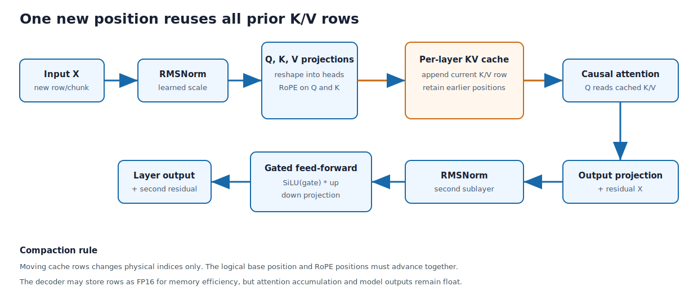

## Purpose and place in the application

The transformer implementation is separated into audio encoder, text decoder, and reusable numerical kernels. This chapter traces tensor shapes, KV-cache ownership, normalization, attention, feed-forward layers, and greedy token selection.

The streaming orchestrator calls these primitives; Metal accelerates the expensive operations while scalar C remains useful for setup and fallback.


### Tensor computation hierarchy

Kernels implement matrix operations, normalization, activations, convolution,
and attention primitives. Encoder and decoder layers compose them while owning
their distinct KV caches and dimensions. Read every allocation together with
its shape and every cache position together with its unit.

BLAS means Basic Linear Algebra Subprograms. GELU means Gaussian Error Linear
Unit. SiLU means Sigmoid Linear Unit. RoPE means Rotary Position Embedding.
RMSNorm means Root Mean Square Layer Normalization.

Shape errors compile successfully in C and usually become memory corruption or
plausible but incorrect logits rather than a useful type error.

{#fig-transformer-cache-flow width=96%}


## How to read this chapter

Combined source SHA-256: `4f83a63c5764f591ca710ccf87506e5a356e05953de0ecf0b34bb39ca8a4d158`.

For each file, first read its hand-written role, ownership, invariants, and failure model. Source blocks retain original line numbers and syntax highlighting. Boundaries follow declarations where practical; a very large declaration is split only for pagination and is labeled as a continuation. The generator reconstructs every file from emitted blocks and compares every byte with the repository source. No prose claim is generated by counting calls or assignments with regular expressions.

## Transformer equations mapped to the code

For input matrix \(X \in \mathbb{R}^{T \times d}\), RMS normalization is:

```text
rms(x) = sqrt(mean(x_i^2) + epsilon)
RMSNorm(x) = weight * x / rms(x)
```

Attention projects normalized input:

```text
Q = X Wq
K = X Wk
V = X Wv
Attention(Q,K,V) = softmax(Q K^T / sqrt(head_dim) + mask) V
```

The implementation reshapes projections into heads, applies RoPE to Q/K,
appends K/V rows to caches, computes attention, merges heads, applies output
projection, and adds the residual.

The feed-forward network uses a gated activation:

```text
hidden = SiLU(X W_gate) * (X W_up)
output = hidden W_down
```

Encoder layers may use GELU depending on the component architecture. Exact
weight names and dimensions come from the checkpoint, not from generic
transformer convention.

## Rotary positions

RoPE rotates pairs of vector coordinates by position-dependent angles. It adds
relative-position structure without an additive embedding:

```text
(x_even, x_odd) -> rotation(theta(position, dimension))
```

Absolute positions must survive cache compaction. Reusing position zero after
moving cache bytes would make old and new tokens geometrically inconsistent.

## KV-cache economics

Without a cache, each generated token recomputes K and V for every previous
token. With a cache, one new row per layer is appended and attention reads
prior rows. Memory is approximately proportional to:

```text
layers * max_positions * kv_heads * head_dimension * 2(K,V) * bytes_per_value
```

FP16 cache storage halves bytes relative to FP32. The code includes capacity
growth, compaction, and fallback paths; every path must preserve row ordering.

## Numerical kernels

The scalar kernels are reference semantics and fallback. BLAS/Accelerate and
Metal provide throughput. Fused kernels reduce intermediate memory traffic, but
fusion must remain mathematically equivalent to the unfused residual,
normalization, projection, or activation sequence.


## `Sources/CVoxtralEngine/Engine/voxtral_encoder.c`

**Role.** This file is reproduced completely below. Read declarations in source order because later helpers rely on ownership and invariants established earlier.

The audio encoder loads convolution and transformer weights, applies the
strided convolutional stem, then runs self-attention and feed-forward layers.
The incremental path maintains encoder KV caches and compacts them while
preserving absolute position meaning.

Tensor comments and loop bounds are part of the contract. Track shapes as
`[sequence, model_dimension]`, per-head dimensions, and cache capacity. The
Metal path accelerates matrix-heavy operations; scalar code remains responsible
for allocation, shape validation, and fallback.

Length: 674 lines. SHA-256: `1079cd6842572e6b0c94ed96010a1078afbdd78d181a0188a1972a5c376fb07f`.

### Declaration map {.unnumbered .unlisted}

This map gives the reading spine of the file. Line numbers refer to the original source and to the numbered listings below.

| Line | Declaration or entry point |
| ---: | --- |
| 32 | `static float *load_f32(safetensors_file_t *sf, const char *name) {` |
| 41 | `static uint16_t *load_bf16_direct(safetensors_file_t *sf, const char *name) {` |
| 50 | `int vox_encoder_load(vox_encoder_t *enc, safetensors_file_t *sf) {` |
| 124 | `static void gelu_inplace(float *x, int n) {` |
| 128 | `static int causal_conv1d_out_len(int length, int kernel_size, int stride) {` |
| 135 | `float *vox_encoder_forward(vox_ctx_t *ctx, const float *mel,` |
| 320 | `static float *enc_kv_cache_k_at(vox_ctx_t *ctx, int layer, int pos) {` |
| 324 | `static float *enc_kv_cache_v_at(vox_ctx_t *ctx, int layer, int pos) {` |
| 328 | `int vox_encoder_kv_cache_preallocate(vox_ctx_t *ctx, int max_pos) {` |
| 350 | `static int enc_kv_cache_grow(vox_ctx_t *ctx, int required) {` |
| 388 | `static void enc_kv_cache_compact(vox_ctx_t *ctx) {` |
| 408 | `static int enc_realloc_float(float **ptr, size_t elems) {` |
| 415 | `static int enc_realloc_int(int **ptr, size_t elems) {` |
| 423 | `static int enc_inc_ensure_buffers(vox_ctx_t *ctx, int new_len) {` |
| 452 | `float *vox_encoder_forward_incremental(vox_ctx_t *ctx, const float *x_new,` |
| 642 | `float *vox_adapter_forward(vox_ctx_t *ctx, const float *enc_out,` |

### Translation-unit preamble {.unnumbered .unlisted}

This translation-unit preamble selects dependencies, compile-time features, and file-local constants used by the definitions that follow.

```{.c .numberLines startFrom="1"}
/*
 * voxtral_encoder.c - Audio encoder (causal transformer)
 *
 * Architecture:
 *   Conv stem: conv1d(128->1280, k=3, s=1, p=1) -> GELU
 *              conv1d(1280->1280, k=3, s=2, p=1) -> GELU
 *   32 transformer layers (causal, sliding window=750):
 *     - RMSNorm -> Attention (MHA, 32 heads, head_dim=64, with biases)
 *     - RMSNorm -> SwiGLU FFN (dim=1280, hidden=5120, w2 has bias)
 *   Final RMSNorm
 *   Downsample 4x: reshape [seq, 1280] -> [seq/4, 5120]
 *   Adapter: Linear(5120->3072) -> GELU -> Linear(3072->3072)
 */

#include "voxtral.h"
#include "voxtral_kernels.h"
#include "voxtral_safetensors.h"
#ifdef USE_METAL
#include "voxtral_metal.h"
#endif
#include <stdio.h>
#include <stdlib.h>
#include <string.h>
#include <math.h>

/* ========================================================================
 * Weight Loading
 * ======================================================================== */

#define ENC_PREFIX "mm_streams_embeddings.embedding_module.whisper_encoder"

```

### `static float *load_f32(safetensors_file_t *sf, const char *name)`

Materializes a named encoder tensor as owned float storage when computation
cannot use the mapped BF16 bytes directly.

```{.c .numberLines startFrom="32"}
static float *load_f32(safetensors_file_t *sf, const char *name) {
    const safetensor_t *t = safetensors_find(sf, name);
    if (!t) {
        fprintf(stderr, "encoder: weight not found: %s\n", name);
        return NULL;
    }
    return safetensors_get_f32(sf, t);
}

```

### `static uint16_t *load_bf16_direct(safetensors_file_t *sf, const char *name)`

Returns a borrowed mapped BF16 weight pointer, avoiding a multi-gigabyte
conversion and tying encoder lifetime to the open safetensors file.

```{.c .numberLines startFrom="41"}
static uint16_t *load_bf16_direct(safetensors_file_t *sf, const char *name) {
    const safetensor_t *t = safetensors_find(sf, name);
    if (!t) {
        fprintf(stderr, "encoder: weight not found: %s\n", name);
        return NULL;
    }
    return safetensors_get_bf16_direct(sf, t);
}

```

### `int vox_encoder_load(vox_encoder_t *enc, safetensors_file_t *sf)`

Loads the 32-layer audio encoder: the conv stem and all per-layer biases/norms
are f32, while the attention and FFN matmul weights are mmap'd bf16. Mirrors the
model's asymmetric biasing - wq/wv/wo and FFN w2 carry biases but wk does not -
so wk's bias is never requested.

```{.c .numberLines startFrom="50"}
int vox_encoder_load(vox_encoder_t *enc, safetensors_file_t *sf) {
    char name[512];

    /* Conv stem (small, always f32) */
    snprintf(name, sizeof(name), "%s.conv_layers.0.conv.weight", ENC_PREFIX);
    enc->conv0_weight = load_f32(sf, name);
    snprintf(name, sizeof(name), "%s.conv_layers.0.conv.bias", ENC_PREFIX);
    enc->conv0_bias = load_f32(sf, name);
    snprintf(name, sizeof(name), "%s.conv_layers.1.conv.weight", ENC_PREFIX);
    enc->conv1_weight = load_f32(sf, name);
    snprintf(name, sizeof(name), "%s.conv_layers.1.conv.bias", ENC_PREFIX);
    enc->conv1_bias = load_f32(sf, name);

    if (!enc->conv0_weight || !enc->conv1_weight) return -1;

    /* Transformer layers */
    for (int i = 0; i < VOX_ENC_LAYERS; i++) {
        vox_enc_layer_t *l = &enc->layers[i];
        const char *lp = ENC_PREFIX ".transformer.layers";

        /* Large matmul weights: bf16 mmap direct */
        snprintf(name, sizeof(name), "%s.%d.attention.wq.weight", lp, i);
        l->wq_weight_bf16 = load_bf16_direct(sf, name);
        snprintf(name, sizeof(name), "%s.%d.attention.wk.weight", lp, i);
        l->wk_weight_bf16 = load_bf16_direct(sf, name);
        snprintf(name, sizeof(name), "%s.%d.attention.wv.weight", lp, i);
        l->wv_weight_bf16 = load_bf16_direct(sf, name);
        snprintf(name, sizeof(name), "%s.%d.attention.wo.weight", lp, i);
        l->wo_weight_bf16 = load_bf16_direct(sf, name);
        snprintf(name, sizeof(name), "%s.%d.feed_forward.w1.weight", lp, i);
        l->w1_weight_bf16 = load_bf16_direct(sf, name);
        snprintf(name, sizeof(name), "%s.%d.feed_forward.w2.weight", lp, i);
        l->w2_weight_bf16 = load_bf16_direct(sf, name);
        snprintf(name, sizeof(name), "%s.%d.feed_forward.w3.weight", lp, i);
        l->w3_weight_bf16 = load_bf16_direct(sf, name);

        /* Small weights: biases and norms (always f32) */
        snprintf(name, sizeof(name), "%s.%d.attention.wq.bias", lp, i);
        l->wq_bias = load_f32(sf, name);
        /* wk has NO bias */
        snprintf(name, sizeof(name), "%s.%d.attention.wv.bias", lp, i);
        l->wv_bias = load_f32(sf, name);
        snprintf(name, sizeof(name), "%s.%d.attention.wo.bias", lp, i);
        l->wo_bias = load_f32(sf, name);
        snprintf(name, sizeof(name), "%s.%d.attention_norm.weight", lp, i);
        l->attention_norm = load_f32(sf, name);
        snprintf(name, sizeof(name), "%s.%d.feed_forward.w2.bias", lp, i);
        l->w2_bias = load_f32(sf, name);
        snprintf(name, sizeof(name), "%s.%d.ffn_norm.weight", lp, i);
        l->ffn_norm = load_f32(sf, name);

        if (!l->wq_weight_bf16 || !l->wk_weight_bf16 ||
            !l->wv_weight_bf16 || !l->wo_weight_bf16) {
            fprintf(stderr, "encoder: failed to load layer %d weights\n", i);
            return -1;
        }

        if (vox_verbose >= 2)
            fprintf(stderr, "  Encoder layer %d/%d loaded\n", i + 1, VOX_ENC_LAYERS);
    }

    /* Final norm */
    snprintf(name, sizeof(name), "%s.transformer.norm.weight", ENC_PREFIX);
    enc->norm = load_f32(sf, name);

    if (!enc->norm) return -1;
    return 0;
}

/* ========================================================================
 * Forward Pass
 * ======================================================================== */

/* GELU activation */
```

### `static void gelu_inplace(float *x, int n)`

Applies the encoder's GELU activation over a contiguous float vector.

```{.c .numberLines startFrom="124"}
static void gelu_inplace(float *x, int n) {
    vox_gelu(x, n);
}

```

### `static int causal_conv1d_out_len(int length, int kernel_size, int stride)`

Computes the number of stable strided causal-convolution outputs available for a
given input length, kernel, and stride.

```{.c .numberLines startFrom="128"}
static int causal_conv1d_out_len(int length, int kernel_size, int stride) {
    int padding_total = kernel_size - stride;
    float n_frames = ((float)length - kernel_size + padding_total) / (float)stride + 1.0f;
    int out_len = (int)ceilf(n_frames);
    return out_len < 0 ? 0 : out_len;
}

```

### `float *vox_encoder_forward(…)`

Full audio-encoder pass: transposes mel[frames,128] to channel-major, runs the
two causal conv1d+GELU stem layers (the second strided by 2), then 32
sliding-window causal MHA + SwiGLU transformer layers, and a final RMSNorm. RoPE
positions start at 0; encoder attention biases Q and V but not K (wk has no
bias), and uses VOX_ENC_WINDOW. Returns the [seq_len,1280] hidden state.

```{.c .numberLines startFrom="135"}
float *vox_encoder_forward(vox_ctx_t *ctx, const float *mel,
                           int mel_frames, int *out_seq_len) {
    vox_encoder_t *enc = &ctx->encoder;
    int dim = VOX_ENC_DIM;        /* 1280 */
    int n_heads = VOX_ENC_HEADS;  /* 32 */
    int head_dim = VOX_ENC_HEAD_DIM; /* 64 */
    int hidden = VOX_ENC_HIDDEN;  /* 5120 */
    int qkv_dim = n_heads * head_dim; /* 2048 */

    if (vox_verbose >= 2)
        fprintf(stderr, "Encoder: %d mel frames\n", mel_frames);

    /* ---- Conv stem ---- */
    /* mel: [mel_frames, 128] -> transpose to [128, mel_frames] for conv1d */
    float *conv_in = (float *)malloc(VOX_MEL_BINS * mel_frames * sizeof(float));
    for (int f = 0; f < mel_frames; f++) {
        for (int m = 0; m < VOX_MEL_BINS; m++) {
            conv_in[m * mel_frames + f] = mel[f * VOX_MEL_BINS + m];
        }
    }

    /* Conv0: [128, mel_frames] -> [1280, mel_frames] (stride=1, causal) */
    int conv0_out_len = causal_conv1d_out_len(mel_frames, 3, 1);
    float *conv0_out = (float *)malloc(dim * conv0_out_len * sizeof(float));
    vox_causal_conv1d(conv0_out, conv_in, enc->conv0_weight, enc->conv0_bias,
                      VOX_MEL_BINS, dim, mel_frames, 3, 1);
    gelu_inplace(conv0_out, dim * conv0_out_len);
    free(conv_in);

    /* Conv1: [1280, mel_frames] -> [1280, ceil(mel_frames/2)] (stride=2, causal) */
    int conv1_out_len = causal_conv1d_out_len(conv0_out_len, 3, 2);
    float *conv1_out = (float *)malloc(dim * conv1_out_len * sizeof(float));
    vox_causal_conv1d(conv1_out, conv0_out, enc->conv1_weight, enc->conv1_bias,
                      dim, dim, conv0_out_len, 3, 2);
    gelu_inplace(conv1_out, dim * conv1_out_len);
    free(conv0_out);

    int seq_len = conv1_out_len;

    /* Transpose: [1280, seq_len] -> [seq_len, 1280] */
    float *x = (float *)malloc(seq_len * dim * sizeof(float));
    for (int s = 0; s < seq_len; s++) {
        for (int d = 0; d < dim; d++) {
            x[s * dim + d] = conv1_out[d * seq_len + s];
        }
    }
    free(conv1_out);

    if (vox_verbose >= 2)
        fprintf(stderr, "  Conv stem: %d frames -> %d\n", mel_frames, seq_len);

    /* ---- Transformer layers ---- */
    float *x_norm = (float *)malloc(seq_len * dim * sizeof(float));
    float *q = (float *)malloc(seq_len * qkv_dim * sizeof(float));
    float *k = (float *)malloc(seq_len * qkv_dim * sizeof(float));
    float *v = (float *)malloc(seq_len * qkv_dim * sizeof(float));
    float *attn_out = (float *)malloc(seq_len * qkv_dim * sizeof(float));
    float *proj_out = (float *)malloc(seq_len * dim * sizeof(float));
    float *gate = (float *)malloc(seq_len * hidden * sizeof(float));
    float *up = (float *)malloc(seq_len * hidden * sizeof(float));
    float *ffn_out = (float *)malloc(seq_len * dim * sizeof(float));

    /* RoPE frequencies */
    int *positions = (int *)malloc(seq_len * sizeof(int));
    for (int i = 0; i < seq_len; i++) positions[i] = i;
    float *rope_freqs = (float *)malloc(seq_len * (head_dim / 2) * 2 * sizeof(float));
    vox_compute_rope_freqs(rope_freqs, positions, seq_len, head_dim, VOX_ROPE_THETA);

    for (int layer = 0; layer < VOX_ENC_LAYERS; layer++) {
        vox_enc_layer_t *l = &enc->layers[layer];

        /* ---- Self-attention ---- */
        vox_rms_norm(x_norm, x, l->attention_norm, seq_len, dim, VOX_ENC_NORM_EPS);

        /* Q, K, V projections (bf16 weights, f32 biases) */
#ifdef USE_METAL
        if (vox_metal_available()) {
            vox_metal_fused_qkv_bf16(seq_len, dim, x_norm,
                                      l->wq_weight_bf16, qkv_dim,
                                      l->wk_weight_bf16, qkv_dim,
                                      l->wv_weight_bf16, qkv_dim,
                                      q, k, v);
            /* Add biases on CPU (wq has bias, wk has NO bias, wv has bias) */
            for (int s = 0; s < seq_len; s++) {
                for (int j = 0; j < qkv_dim; j++) {
                    q[s * qkv_dim + j] += l->wq_bias[j];
                    v[s * qkv_dim + j] += l->wv_bias[j];
                }
            }
        } else {
#endif
            vox_linear_bf16(q, x_norm, l->wq_weight_bf16, l->wq_bias, seq_len, dim, qkv_dim);
            vox_linear_nobias_bf16(k, x_norm, l->wk_weight_bf16, seq_len, dim, qkv_dim);
            vox_linear_bf16(v, x_norm, l->wv_weight_bf16, l->wv_bias, seq_len, dim, qkv_dim);
#ifdef USE_METAL
        }
#endif

        /* Apply RoPE to Q and K */
        vox_apply_rope(q, rope_freqs, seq_len, n_heads, head_dim);
        vox_apply_rope(k, rope_freqs, seq_len, n_heads, head_dim);

        /* Causal attention with sliding window */
        float scale = 1.0f / sqrtf((float)head_dim);
#ifdef USE_METAL
        if (vox_metal_available()) {
            vox_metal_encoder_attention(attn_out, q, k, v,
                                         seq_len, seq_len, n_heads, VOX_ENC_KV_HEADS,
                                         head_dim, scale, VOX_ENC_WINDOW, 0);
        } else {
#endif
            vox_causal_attention(attn_out, q, k, v,
                                 seq_len, seq_len, n_heads, VOX_ENC_KV_HEADS,
                                 head_dim, scale, VOX_ENC_WINDOW, 0);
#ifdef USE_METAL
        }
#endif

```

### Continuation of `float *vox_encoder_forward(…)` {.unnumbered .unlisted}

```{.c .numberLines startFrom="253"}
        /* Output projection + residual */
#ifdef USE_METAL
        if (vox_metal_available()) {
            vox_metal_sgemm_bf16(seq_len, dim, qkv_dim, attn_out,
                                   l->wo_weight_bf16, proj_out);
            /* Add wo bias on CPU */
            for (int s = 0; s < seq_len; s++)
                for (int j = 0; j < dim; j++)
                    proj_out[s * dim + j] += l->wo_bias[j];
        } else {
#endif
            vox_linear_bf16(proj_out, attn_out, l->wo_weight_bf16, l->wo_bias, seq_len, qkv_dim, dim);
#ifdef USE_METAL
        }
#endif
        vox_add_inplace(x, proj_out, seq_len * dim);

        /* ---- FFN ---- */
        vox_rms_norm(x_norm, x, l->ffn_norm, seq_len, dim, VOX_ENC_NORM_EPS);

        /* SwiGLU: gate = silu(w1(x)), up = w3(x), ffn = w2(gate * up) + bias */
#ifdef USE_METAL
        if (vox_metal_available()) {
            vox_metal_fused_ffn_bf16(seq_len, dim, hidden, x_norm,
                                      l->w1_weight_bf16, l->w3_weight_bf16,
                                      l->w2_weight_bf16, ffn_out);
            /* Add w2 bias on CPU */
            for (int s = 0; s < seq_len; s++)
                for (int j = 0; j < dim; j++)
                    ffn_out[s * dim + j] += l->w2_bias[j];
        } else {
#endif
            vox_linear_nobias_bf16(gate, x_norm, l->w1_weight_bf16, seq_len, dim, hidden);
            vox_silu(gate, seq_len * hidden);
            vox_linear_nobias_bf16(up, x_norm, l->w3_weight_bf16, seq_len, dim, hidden);
            vox_mul_inplace(gate, up, seq_len * hidden);
            vox_linear_bf16(ffn_out, gate, l->w2_weight_bf16, l->w2_bias, seq_len, hidden, dim);
#ifdef USE_METAL
        }
#endif

        /* Residual */
        vox_add_inplace(x, ffn_out, seq_len * dim);

        if (vox_verbose >= 2 && ((layer + 1) % 8 == 0 || layer == VOX_ENC_LAYERS - 1))
            fprintf(stderr, "  Encoder layer %d/%d\n", layer + 1, VOX_ENC_LAYERS);
    }

    /* Final norm */
    vox_rms_norm(x, x, enc->norm, seq_len, dim, VOX_ENC_NORM_EPS);

    /* Clean up working buffers */
    free(x_norm); free(q); free(k); free(v);
    free(attn_out); free(proj_out);
    free(gate); free(up); free(ffn_out);
    free(positions); free(rope_freqs);

    *out_seq_len = seq_len;
    return x;
}

/* ========================================================================
 * Incremental Encoder KV Cache
 * ======================================================================== */

#define ENC_KV_DIM (VOX_ENC_KV_HEADS * VOX_ENC_HEAD_DIM)  /* 32 * 64 = 2048 */

```

### `static float *enc_kv_cache_k_at(vox_ctx_t *ctx, int layer, int pos)`

Addresses one encoder key-cache row from layer and local cache position.

```{.c .numberLines startFrom="320"}
static float *enc_kv_cache_k_at(vox_ctx_t *ctx, int layer, int pos) {
    return ctx->enc_kv_cache_k + ((size_t)layer * ctx->enc_kv_cache_max + pos) * ENC_KV_DIM;
}

```

### `static float *enc_kv_cache_v_at(vox_ctx_t *ctx, int layer, int pos)`

Addresses the matching value-cache row.

```{.c .numberLines startFrom="324"}
static float *enc_kv_cache_v_at(vox_ctx_t *ctx, int layer, int pos) {
    return ctx->enc_kv_cache_v + ((size_t)layer * ctx->enc_kv_cache_max + pos) * ENC_KV_DIM;
}

```

### `int vox_encoder_kv_cache_preallocate(vox_ctx_t *ctx, int max_pos)`

Allocates encoder caches to a known maximum before live audio, moving allocation
latency out of the first classroom utterance.

```{.c .numberLines startFrom="328"}
int vox_encoder_kv_cache_preallocate(vox_ctx_t *ctx, int max_pos) {
    if (ctx->enc_kv_cache_k) return 0; /* already allocated */

    size_t total = (size_t)VOX_ENC_LAYERS * max_pos * ENC_KV_DIM * sizeof(float);

#ifdef USE_METAL
    if (vox_metal_available()) {
        ctx->enc_kv_cache_k = (float *)vox_metal_shared_alloc(total);
        ctx->enc_kv_cache_v = (float *)vox_metal_shared_alloc(total);
        ctx->enc_kv_cache_is_shared = 1;
    } else
#endif
    {
        ctx->enc_kv_cache_k = (float *)calloc(1, total);
        ctx->enc_kv_cache_v = (float *)calloc(1, total);
    }

    if (!ctx->enc_kv_cache_k || !ctx->enc_kv_cache_v) return -1;
    ctx->enc_kv_cache_max = max_pos;
    return 0;
}

```

### `static int enc_kv_cache_grow(vox_ctx_t *ctx, int required)`

Grows the encoder's incremental K/V cache by doubling enc_kv_cache_max and
re-packing existing rows across the new per-layer stride. Refuses to grow
Metal-shared buffers (which cannot be resized), so shared mode relies on
preallocation being large enough.

```{.c .numberLines startFrom="350"}
static int enc_kv_cache_grow(vox_ctx_t *ctx, int required) {
    if (ctx->enc_kv_cache_max >= required) return 0;

    /* Shared GPU memory cannot be grown; should not happen with proper pre-allocation */
    if (ctx->enc_kv_cache_is_shared) {
        fprintf(stderr, "encoder: KV cache too small (%d < %d), cannot grow shared buffer\n",
                ctx->enc_kv_cache_max, required);
        return -1;
    }

    int new_max = ctx->enc_kv_cache_max ? ctx->enc_kv_cache_max : 256;
    while (new_max < required) new_max *= 2;

    size_t new_stride = (size_t)new_max * ENC_KV_DIM;
    size_t total = (size_t)VOX_ENC_LAYERS * new_stride * sizeof(float);

    float *new_k = (float *)calloc(1, total);
    float *new_v = (float *)calloc(1, total);
    if (!new_k || !new_v) { free(new_k); free(new_v); return -1; }

    /* Copy existing data */
    if (ctx->enc_kv_cache_len > 0 && ctx->enc_kv_cache_k) {
        size_t old_stride = (size_t)ctx->enc_kv_cache_max * ENC_KV_DIM;
        size_t copy = (size_t)ctx->enc_kv_cache_len * ENC_KV_DIM * sizeof(float);
        for (int l = 0; l < VOX_ENC_LAYERS; l++) {
            memcpy(new_k + l * new_stride, ctx->enc_kv_cache_k + l * old_stride, copy);
            memcpy(new_v + l * new_stride, ctx->enc_kv_cache_v + l * old_stride, copy);
        }
    }

    free(ctx->enc_kv_cache_k);
    free(ctx->enc_kv_cache_v);
    ctx->enc_kv_cache_k = new_k;
    ctx->enc_kv_cache_v = new_v;
    ctx->enc_kv_cache_max = new_max;
    return 0;
}

```

### `static void enc_kv_cache_compact(vox_ctx_t *ctx)`

Sliding-window eviction for the encoder cache: keeps the last VOX_ENC_WINDOW rows
per layer via memmove to position 0 and bumps enc_kv_pos_offset by the discarded
count, leaving baked-in RoPE valid. Mirrors the decoder's kv_cache_compact but
always operates on f32 rows.

```{.c .numberLines startFrom="388"}
static void enc_kv_cache_compact(vox_ctx_t *ctx) {
    int keep = VOX_ENC_WINDOW;
    if (ctx->enc_kv_cache_len <= keep) return;

    int discard = ctx->enc_kv_cache_len - keep;
    size_t keep_bytes = (size_t)keep * ENC_KV_DIM * sizeof(float);

    for (int l = 0; l < VOX_ENC_LAYERS; l++) {
        float *k_base = enc_kv_cache_k_at(ctx, l, 0);
        float *k_src  = enc_kv_cache_k_at(ctx, l, discard);
        float *v_base = enc_kv_cache_v_at(ctx, l, 0);
        float *v_src  = enc_kv_cache_v_at(ctx, l, discard);
        memmove(k_base, k_src, keep_bytes);
        memmove(v_base, v_src, keep_bytes);
    }

    ctx->enc_kv_pos_offset += discard;
    ctx->enc_kv_cache_len = keep;
}

```

### `static int enc_realloc_float(float **ptr, size_t elems)`

Overflow-aware helper for growing float scratch arrays while preserving existing
contents.

```{.c .numberLines startFrom="408"}
static int enc_realloc_float(float **ptr, size_t elems) {
    float *tmp = (float *)realloc(*ptr, elems * sizeof(float));
    if (!tmp) return -1;
    *ptr = tmp;
    return 0;
}

```

### `static int enc_realloc_int(int **ptr, size_t elems)`

Equivalent growth helper for absolute-position arrays.

```{.c .numberLines startFrom="415"}
static int enc_realloc_int(int **ptr, size_t elems) {
    int *tmp = (int *)realloc(*ptr, elems * sizeof(int));
    if (!tmp) return -1;
    *ptr = tmp;
    return 0;
}

/* Grow persistent incremental-encoder scratch buffers for new_len positions. */
```

### `static int enc_inc_ensure_buffers(vox_ctx_t *ctx, int new_len)`

Ensures every incremental encoder scratch/output/position buffer can hold the
next chunk as one transaction; failure prevents partial inference.

```{.c .numberLines startFrom="423"}
static int enc_inc_ensure_buffers(vox_ctx_t *ctx, int new_len) {
    if (new_len <= ctx->enc_inc_cap) return 0;

    int dim = VOX_ENC_DIM;
    int head_dim = VOX_ENC_HEAD_DIM;
    int qkv_dim = VOX_ENC_HEADS * VOX_ENC_HEAD_DIM;
    int hidden = VOX_ENC_HIDDEN;
    size_t rope_elems = (size_t)new_len * (head_dim / 2) * 2;

    if (enc_realloc_float(&ctx->enc_inc_x_norm, (size_t)new_len * dim) != 0) return -1;
    if (enc_realloc_float(&ctx->enc_inc_q, (size_t)new_len * qkv_dim) != 0) return -1;
    if (enc_realloc_float(&ctx->enc_inc_k, (size_t)new_len * qkv_dim) != 0) return -1;
    if (enc_realloc_float(&ctx->enc_inc_v, (size_t)new_len * qkv_dim) != 0) return -1;
    if (enc_realloc_float(&ctx->enc_inc_attn_out, (size_t)new_len * qkv_dim) != 0) return -1;
    if (enc_realloc_float(&ctx->enc_inc_proj_out, (size_t)new_len * dim) != 0) return -1;
    if (enc_realloc_float(&ctx->enc_inc_gate, (size_t)new_len * hidden) != 0) return -1;
    if (enc_realloc_float(&ctx->enc_inc_up, (size_t)new_len * hidden) != 0) return -1;
    if (enc_realloc_float(&ctx->enc_inc_ffn_out, (size_t)new_len * dim) != 0) return -1;
    if (enc_realloc_int(&ctx->enc_inc_positions, (size_t)new_len) != 0) return -1;
    if (enc_realloc_float(&ctx->enc_inc_rope_freqs, rope_elems) != 0) return -1;

    ctx->enc_inc_cap = new_len;
    return 0;
}

/* ========================================================================
 * Incremental Encoder Forward Pass
 * ======================================================================== */

```

### `float *vox_encoder_forward_incremental(…)`

Streaming encoder step: compacts/grows the KV cache for new_len incoming frames,
runs RoPE at logical positions enc_kv_pos_offset+cache_len, projects Q/K/V only
for the new positions, appends K/V to the cache, and attends each new query over
the full window. After 32 layers and the final norm it returns the new positions'
[new_len,1280] output; the GPU path runs all layers in one command buffer when
the cache is shared.

```{.c .numberLines startFrom="452"}
float *vox_encoder_forward_incremental(vox_ctx_t *ctx, const float *x_new,
                                        int new_len, int *out_len) {
    vox_encoder_t *enc = &ctx->encoder;
    int dim = VOX_ENC_DIM;        /* 1280 */
    int n_heads = VOX_ENC_HEADS;  /* 32 */
    int head_dim = VOX_ENC_HEAD_DIM; /* 64 */
    int hidden = VOX_ENC_HIDDEN;  /* 5120 */
    int qkv_dim = n_heads * head_dim; /* 2048 */

    if (new_len <= 0) { *out_len = 0; return NULL; }

    /* Compact if needed before adding new positions */
    if (ctx->enc_kv_cache_len + new_len > VOX_ENC_WINDOW) {
        enc_kv_cache_compact(ctx);
    }

    /* Grow cache if needed */
    if (enc_kv_cache_grow(ctx, ctx->enc_kv_cache_len + new_len) != 0) {
        *out_len = 0;
        return NULL;
    }

    int cache_len = ctx->enc_kv_cache_len;

    if (vox_verbose >= 2)
        fprintf(stderr, "  Encoder incremental: %d new positions (cache: %d, offset: %d)\n",
                new_len, cache_len, ctx->enc_kv_pos_offset);

    /* Output/working state for new positions */
    float *x = (float *)malloc((size_t)new_len * dim * sizeof(float));
    if (!x) { *out_len = 0; return NULL; }
    memcpy(x, x_new, (size_t)new_len * dim * sizeof(float));

    if (enc_inc_ensure_buffers(ctx, new_len) != 0) {
        free(x);
        *out_len = 0;
        return NULL;
    }
    float *x_norm = ctx->enc_inc_x_norm;
    float *q = ctx->enc_inc_q;
    float *k = ctx->enc_inc_k;
    float *v = ctx->enc_inc_v;
    float *attn_out = ctx->enc_inc_attn_out;
    float *proj_out = ctx->enc_inc_proj_out;
    float *gate = ctx->enc_inc_gate;
    float *up = ctx->enc_inc_up;
    float *ffn_out = ctx->enc_inc_ffn_out;

    /* RoPE frequencies for logical positions */
    int logical_start = ctx->enc_kv_pos_offset + cache_len;
    int *positions = ctx->enc_inc_positions;
    for (int i = 0; i < new_len; i++) positions[i] = logical_start + i;
    float *rope_freqs = ctx->enc_inc_rope_freqs;
    vox_compute_rope_freqs(rope_freqs, positions, new_len, head_dim, VOX_ROPE_THETA);

    /* GPU monolithic path: all 32 layers in one command buffer */
#ifdef USE_METAL
    if (vox_metal_available() && ctx->enc_kv_cache_is_shared) {
        if (vox_metal_encoder_full_step(ctx, x, new_len, rope_freqs, cache_len) == 0) {
            ctx->enc_kv_cache_len = cache_len + new_len;
            *out_len = new_len;
            return x;
        }
        /* Fall through to CPU path on failure */
    }
#endif

    for (int layer = 0; layer < VOX_ENC_LAYERS; layer++) {
        vox_enc_layer_t *l = &enc->layers[layer];

        /* ---- Self-attention ---- */
        vox_rms_norm(x_norm, x, l->attention_norm, new_len, dim, VOX_ENC_NORM_EPS);

        /* Q, K, V projections on new positions only */
#ifdef USE_METAL
        if (vox_metal_available()) {
            vox_metal_fused_qkv_bf16(new_len, dim, x_norm,
                                      l->wq_weight_bf16, qkv_dim,
                                      l->wk_weight_bf16, qkv_dim,
                                      l->wv_weight_bf16, qkv_dim,
                                      q, k, v);
            /* Add biases (wq has bias, wk has NO bias, wv has bias) */
            for (int s = 0; s < new_len; s++) {
                for (int j = 0; j < qkv_dim; j++) {
                    q[s * qkv_dim + j] += l->wq_bias[j];
                    v[s * qkv_dim + j] += l->wv_bias[j];
                }
            }
        } else {
#endif
            vox_linear_bf16(q, x_norm, l->wq_weight_bf16, l->wq_bias, new_len, dim, qkv_dim);
            vox_linear_nobias_bf16(k, x_norm, l->wk_weight_bf16, new_len, dim, qkv_dim);
            vox_linear_bf16(v, x_norm, l->wv_weight_bf16, l->wv_bias, new_len, dim, qkv_dim);
#ifdef USE_METAL
        }
#endif

        /* Apply RoPE to Q and K */
        vox_apply_rope(q, rope_freqs, new_len, n_heads, head_dim);
        vox_apply_rope(k, rope_freqs, new_len, n_heads, head_dim);

        /* Copy new K, V into cache */
        for (int s = 0; s < new_len; s++) {
            memcpy(enc_kv_cache_k_at(ctx, layer, cache_len + s),
                   k + (size_t)s * qkv_dim, qkv_dim * sizeof(float));
            memcpy(enc_kv_cache_v_at(ctx, layer, cache_len + s),
                   v + (size_t)s * qkv_dim, qkv_dim * sizeof(float));
        }

        /* Attention: q=[new_len], kv=[cache_len + new_len] */
        int total_kv = cache_len + new_len;
        float *full_k = enc_kv_cache_k_at(ctx, layer, 0);
        float *full_v = enc_kv_cache_v_at(ctx, layer, 0);
        float scale = 1.0f / sqrtf((float)head_dim);

#ifdef USE_METAL
        if (vox_metal_available()) {
            vox_metal_encoder_attention(attn_out, q, full_k, full_v,
                                         new_len, total_kv, n_heads, VOX_ENC_KV_HEADS,
                                         head_dim, scale, VOX_ENC_WINDOW, cache_len);
        } else {
#endif
            vox_causal_attention(attn_out, q, full_k, full_v,
                                 new_len, total_kv, n_heads, VOX_ENC_KV_HEADS,
                                 head_dim, scale, VOX_ENC_WINDOW, cache_len);
#ifdef USE_METAL
        }
#endif

```

### Continuation of `float *vox_encoder_forward_incremental(…)` {.unnumbered .unlisted}

```{.c .numberLines startFrom="581"}
        /* Output projection + residual */
#ifdef USE_METAL
        if (vox_metal_available()) {
            vox_metal_sgemm_bf16(new_len, dim, qkv_dim, attn_out,
                                   l->wo_weight_bf16, proj_out);
            /* Add wo bias on CPU */
            for (int s = 0; s < new_len; s++)
                for (int j = 0; j < dim; j++)
                    proj_out[s * dim + j] += l->wo_bias[j];
        } else {
#endif
            vox_linear_bf16(proj_out, attn_out, l->wo_weight_bf16, l->wo_bias, new_len, qkv_dim, dim);
#ifdef USE_METAL
        }
#endif
        vox_add_inplace(x, proj_out, new_len * dim);

        /* ---- FFN ---- */
        vox_rms_norm(x_norm, x, l->ffn_norm, new_len, dim, VOX_ENC_NORM_EPS);

#ifdef USE_METAL
        if (vox_metal_available()) {
            vox_metal_fused_ffn_bf16(new_len, dim, hidden, x_norm,
                                      l->w1_weight_bf16, l->w3_weight_bf16,
                                      l->w2_weight_bf16, ffn_out);
            /* Add w2 bias on CPU */
            for (int s = 0; s < new_len; s++)
                for (int j = 0; j < dim; j++)
                    ffn_out[s * dim + j] += l->w2_bias[j];
        } else {
#endif
            vox_linear_nobias_bf16(gate, x_norm, l->w1_weight_bf16, new_len, dim, hidden);
            vox_silu(gate, new_len * hidden);
            vox_linear_nobias_bf16(up, x_norm, l->w3_weight_bf16, new_len, dim, hidden);
            vox_mul_inplace(gate, up, new_len * hidden);
            vox_linear_bf16(ffn_out, gate, l->w2_weight_bf16, l->w2_bias, new_len, hidden, dim);
#ifdef USE_METAL
        }
#endif

        /* Residual */
        vox_add_inplace(x, ffn_out, new_len * dim);

        if (vox_verbose >= 2 && ((layer + 1) % 8 == 0 || layer == VOX_ENC_LAYERS - 1))
            fprintf(stderr, "  Encoder inc layer %d/%d\n", layer + 1, VOX_ENC_LAYERS);
    }

    /* Final norm */
    vox_rms_norm(x, x, enc->norm, new_len, dim, VOX_ENC_NORM_EPS);

    /* Update cache length */
    ctx->enc_kv_cache_len = cache_len + new_len;

    *out_len = new_len;
    return x;
}

/* ========================================================================
 * Adapter Forward Pass
 * ======================================================================== */

```

### `float *vox_adapter_forward(…)`

Bridges encoder to decoder: downsamples 4x by concatenating every group of 4
encoder frames into one 5120-d vector, then applies Linear(5120->3072) -> GELU ->
Linear(3072->3072) with bf16 weights to produce decoder-dimension embeddings.
Returns the [ds_len,3072] result.

```{.c .numberLines startFrom="642"}
float *vox_adapter_forward(vox_ctx_t *ctx, const float *enc_out,
                           int enc_seq_len, int *out_seq_len) {
    /* Downsample 4x: [enc_seq_len, 1280] -> [enc_seq_len/4, 5120] */
    int ds_len = enc_seq_len / VOX_DOWNSAMPLE;
    int ds_dim = VOX_ENC_DIM * VOX_DOWNSAMPLE; /* 5120 */

    float *ds = (float *)malloc(ds_len * ds_dim * sizeof(float));
    for (int i = 0; i < ds_len; i++) {
        for (int j = 0; j < VOX_DOWNSAMPLE; j++) {
            memcpy(ds + i * ds_dim + j * VOX_ENC_DIM,
                   enc_out + (i * VOX_DOWNSAMPLE + j) * VOX_ENC_DIM,
                   VOX_ENC_DIM * sizeof(float));
        }
    }

    if (vox_verbose >= 2)
        fprintf(stderr, "  Adapter: %d -> %d (downsample %dx)\n",
                enc_seq_len, ds_len, VOX_DOWNSAMPLE);

    /* Linear(5120 -> 3072) -> GELU -> Linear(3072 -> 3072) */
    float *mid = (float *)malloc(ds_len * VOX_DEC_DIM * sizeof(float));
    vox_linear_nobias_bf16(mid, ds, ctx->adapter.linear0_weight_bf16, ds_len, ds_dim, VOX_DEC_DIM);
    vox_gelu(mid, ds_len * VOX_DEC_DIM);

    float *out = (float *)malloc(ds_len * VOX_DEC_DIM * sizeof(float));
    vox_linear_nobias_bf16(out, mid, ctx->adapter.linear1_weight_bf16, ds_len, VOX_DEC_DIM, VOX_DEC_DIM);

    free(ds);
    free(mid);

    *out_seq_len = ds_len;
    return out;
}
```

## `Sources/CVoxtralEngine/Engine/voxtral_decoder.c`

**Role.** This file is reproduced completely below. Read declarations in source order because later helpers rely on ownership and invariants established earlier.

The decoder owns autoregressive text state. Prefill consumes the
audio-conditioned prompt in batches; forward consumes one new embedding and
produces logits for the next token. Per-layer KV caches avoid recomputing all
previous positions and may use FP16 storage before switching to FP32 fallback.

Cache growth, compaction, and position counters must agree. A copied cache row
represents a specific absolute token position; moving bytes without updating
the corresponding logical base would silently corrupt attention.

Length: 706 lines. SHA-256: `d1a66eec98966a7dacfe20574fefb7575a2d814a76580af0f9d781596e13ae1a`.

### Declaration map {.unnumbered .unlisted}

This map gives the reading spine of the file. Line numbers refer to the original source and to the numbered listings below.

| Line | Declaration or entry point |
| ---: | --- |
| 31 | `static float *load_f32(safetensors_file_t *sf, const char *name) {` |
| 40 | `static uint16_t *load_bf16_direct(safetensors_file_t *sf, const char *name) {` |
| 49 | `int vox_decoder_load(vox_decoder_t *dec, safetensors_file_t *sf) {` |
| 114 | `static inline float f16_to_f32(uint16_t h) {` |
| 143 | `static int kv_cache_is_allocated(const vox_ctx_t *ctx) {` |
| 151 | `static float *kv_cache_k_at(vox_ctx_t *ctx, int layer, int pos) {` |
| 156 | `static float *kv_cache_v_at(vox_ctx_t *ctx, int layer, int pos) {` |
| 161 | `static uint16_t *kv_cache_k_f16_at(vox_ctx_t *ctx, int layer, int pos) {` |
| 166 | `static uint16_t *kv_cache_v_f16_at(vox_ctx_t *ctx, int layer, int pos) {` |
| 171 | `static int kv_cache_init(vox_ctx_t *ctx, int max_seq) {` |
| 208 | `int vox_decoder_kv_cache_preallocate(vox_ctx_t *ctx, int max_seq) {` |
| 214 | `static int kv_cache_grow(vox_ctx_t *ctx, int required) {` |
| 317 | `static void kv_cache_compact(vox_ctx_t *ctx) {` |
| 350 | `static int kv_cache_switch_to_fp32(vox_ctx_t *ctx) {` |
| 410 | `void vox_decoder_prefill(vox_ctx_t *ctx, const float *input_embeds, int seq_len) {` |
| 565 | `static void ensure_dec_buffers(vox_ctx_t *ctx) {` |
| 586 | `int vox_decoder_forward(vox_ctx_t *ctx, const float *input_embeds, float *logits) {` |

### Translation-unit preamble {.unnumbered .unlisted}

This translation-unit preamble selects dependencies, compile-time features, and file-local constants used by the definitions that follow.

```{.c .numberLines startFrom="1"}
/*
 * voxtral_decoder.c - LLM decoder (26 layers, GQA)
 *
 * Architecture (per layer):
 *   RMSNorm -> Attention (GQA: 32 heads, 8 KV heads)
 *   RMSNorm -> (optional) ada_rms_norm_t_cond -> SwiGLU FFN (dim=3072, hidden=9216)
 *
 * ada_rms_norm_t_cond (vLLM MistralDecoderLayer):
 *   hidden_states = hidden_states * (1 + ada_mlp(t_cond))
 * where:
 *   ada_mlp = Linear(3072->32, bias=False) -> GELU -> Linear(32->3072, bias=False)
 *
 * Per-layer `ctx->ada_scale[layer, :]` is precomputed once in voxtral.c at load time.
 */

#include "voxtral.h"
#include "voxtral_kernels.h"
#include "voxtral_safetensors.h"
#ifdef USE_METAL
#include "voxtral_metal.h"
#endif
#include <stdio.h>
#include <stdlib.h>
#include <string.h>
#include <math.h>

/* ========================================================================
 * Weight Loading
 * ======================================================================== */

```

### `static float *load_f32(safetensors_file_t *sf, const char *name)`

Finds a named tensor and materializes an owned FP32 copy for decoder fields that
require float storage. Missing or incompatible weights fail model load.

```{.c .numberLines startFrom="31"}
static float *load_f32(safetensors_file_t *sf, const char *name) {
    const safetensor_t *t = safetensors_find(sf, name);
    if (!t) {
        fprintf(stderr, "decoder: weight not found: %s\n", name);
        return NULL;
    }
    return safetensors_get_f32(sf, t);
}

```

### `static uint16_t *load_bf16_direct(safetensors_file_t *sf, const char *name)`

Finds a named BF16 tensor and stores a zero-copy pointer into the safetensors
mapping. Mapping lifetime therefore dominates decoder lifetime.

```{.c .numberLines startFrom="40"}
static uint16_t *load_bf16_direct(safetensors_file_t *sf, const char *name) {
    const safetensor_t *t = safetensors_find(sf, name);
    if (!t) {
        fprintf(stderr, "decoder: weight not found: %s\n", name);
        return NULL;
    }
    return safetensors_get_bf16_direct(sf, t);
}

```

### `int vox_decoder_load(vox_decoder_t *dec, safetensors_file_t *sf)`

Loads all 26 decoder layers from the safetensors file: large matmul weights
(wq/wk/wv/wo, FFN w1/w2/w3, and the tied token embeddings) are kept as mmap'd
bf16 read directly, while the small norms and the ada_rms_norm MLP weights are
converted to f32. Returns -1 if any required attention weight or the final norm
is missing.

```{.c .numberLines startFrom="49"}
int vox_decoder_load(vox_decoder_t *dec, safetensors_file_t *sf) {
    char name[512];

    /* Token embeddings (large, bf16 mmap direct) */
    dec->tok_embeddings_bf16 = load_bf16_direct(sf,
        "mm_streams_embeddings.embedding_module.tok_embeddings.weight");
    if (!dec->tok_embeddings_bf16) return -1;

    /* Transformer layers */
    for (int i = 0; i < VOX_DEC_LAYERS; i++) {
        vox_dec_layer_t *l = &dec->layers[i];

        /* Ada RMS norm MLP (small, always f32) */
        snprintf(name, sizeof(name), "layers.%d.ada_rms_norm_t_cond.0.weight", i);
        l->ada_norm_down = load_f32(sf, name);
        snprintf(name, sizeof(name), "layers.%d.ada_rms_norm_t_cond.2.weight", i);
        l->ada_norm_up = load_f32(sf, name);

        /* Attention (large matmul weights: bf16 mmap direct) */
        snprintf(name, sizeof(name), "layers.%d.attention.wq.weight", i);
        l->wq_weight_bf16 = load_bf16_direct(sf, name);
        snprintf(name, sizeof(name), "layers.%d.attention.wk.weight", i);
        l->wk_weight_bf16 = load_bf16_direct(sf, name);
        snprintf(name, sizeof(name), "layers.%d.attention.wv.weight", i);
        l->wv_weight_bf16 = load_bf16_direct(sf, name);
        snprintf(name, sizeof(name), "layers.%d.attention.wo.weight", i);
        l->wo_weight_bf16 = load_bf16_direct(sf, name);

        /* Norms (small, always f32) */
        snprintf(name, sizeof(name), "layers.%d.attention_norm.weight", i);
        l->attention_norm = load_f32(sf, name);

        /* FFN (large matmul weights: bf16 mmap direct) */
        snprintf(name, sizeof(name), "layers.%d.feed_forward.w1.weight", i);
        l->w1_weight_bf16 = load_bf16_direct(sf, name);
        snprintf(name, sizeof(name), "layers.%d.feed_forward.w2.weight", i);
        l->w2_weight_bf16 = load_bf16_direct(sf, name);
        snprintf(name, sizeof(name), "layers.%d.feed_forward.w3.weight", i);
        l->w3_weight_bf16 = load_bf16_direct(sf, name);

        /* Norms (small, always f32) */
        snprintf(name, sizeof(name), "layers.%d.ffn_norm.weight", i);
        l->ffn_norm = load_f32(sf, name);

        if (!l->wq_weight_bf16 || !l->wk_weight_bf16 ||
            !l->wv_weight_bf16 || !l->wo_weight_bf16) {
            fprintf(stderr, "decoder: failed to load layer %d\n", i);
            return -1;
        }

        if (vox_verbose >= 2)
            fprintf(stderr, "  Decoder layer %d/%d loaded\n", i + 1, VOX_DEC_LAYERS);
    }

    /* Final norm */
    dec->norm = load_f32(sf, "norm.weight");
    if (!dec->norm) return -1;

    return 0;
}

/* ========================================================================
 * KV Cache Management
 * ======================================================================== */

```

### `static inline float f16_to_f32(uint16_t h)`

Scalar IEEE half-to-single widening used when materializing an fp16 KV cache into
fp32, handling subnormals, inf/NaN (exp==0x1F), and the 127-15 exponent rebias.
This is true fp16, distinct from the bf16 widening (shift-left-16) used for
weights elsewhere.

```{.c .numberLines startFrom="114"}
static inline float f16_to_f32(uint16_t h) {
    uint32_t sign = ((uint32_t)h & 0x8000u) << 16;
    uint32_t exp = ((uint32_t)h >> 10) & 0x1Fu;
    uint32_t mant = (uint32_t)h & 0x03FFu;
    uint32_t out_bits;

    if (exp == 0) {
        if (mant == 0) {
            out_bits = sign;
        } else {
            exp = 1;
            while ((mant & 0x0400u) == 0) {
                mant <<= 1;
                exp--;
            }
            mant &= 0x03FFu;
            out_bits = sign | ((exp + (127 - 15)) << 23) | (mant << 13);
        }
    } else if (exp == 0x1Fu) {
        out_bits = sign | 0x7F800000u | (mant << 13);
    } else {
        out_bits = sign | ((exp + (127 - 15)) << 23) | (mant << 13);
    }

    float f;
    memcpy(&f, &out_bits, sizeof(f));
    return f;
}

```

### `static int kv_cache_is_allocated(const vox_ctx_t *ctx)`

Checks that the decoder's selected cache representation and required layer
pointers exist before generation begins.

```{.c .numberLines startFrom="143"}
static int kv_cache_is_allocated(const vox_ctx_t *ctx) {
    if (ctx->kv_cache_fp16) {
        return ctx->kv_cache_k_f16 && ctx->kv_cache_v_f16;
    }
    return ctx->kv_cache_k && ctx->kv_cache_v;
}

/* Get cache pointers for layer at position */
```

### `static float *kv_cache_k_at(vox_ctx_t *ctx, int layer, int pos)`

Computes the FP32 key-cache row address for one layer and logical position.

```{.c .numberLines startFrom="151"}
static float *kv_cache_k_at(vox_ctx_t *ctx, int layer, int pos) {
    int kv_dim = VOX_DEC_KV_HEADS * VOX_DEC_HEAD_DIM;
    return ctx->kv_cache_k + ((size_t)layer * ctx->kv_cache_max + pos) * kv_dim;
}

```

### `static float *kv_cache_v_at(vox_ctx_t *ctx, int layer, int pos)`

Computes the FP32 value-cache row address using the same capacity/stride layout.

```{.c .numberLines startFrom="156"}
static float *kv_cache_v_at(vox_ctx_t *ctx, int layer, int pos) {
    int kv_dim = VOX_DEC_KV_HEADS * VOX_DEC_HEAD_DIM;
    return ctx->kv_cache_v + ((size_t)layer * ctx->kv_cache_max + pos) * kv_dim;
}

```

### `static uint16_t *kv_cache_k_f16_at(vox_ctx_t *ctx, int layer, int pos)`

Returns the FP16 key row when compact cache storage is active.

```{.c .numberLines startFrom="161"}
static uint16_t *kv_cache_k_f16_at(vox_ctx_t *ctx, int layer, int pos) {
    int kv_dim = VOX_DEC_KV_HEADS * VOX_DEC_HEAD_DIM;
    return ctx->kv_cache_k_f16 + ((size_t)layer * ctx->kv_cache_max + pos) * kv_dim;
}

```

### `static uint16_t *kv_cache_v_f16_at(vox_ctx_t *ctx, int layer, int pos)`

Returns the corresponding FP16 value row.

```{.c .numberLines startFrom="166"}
static uint16_t *kv_cache_v_f16_at(vox_ctx_t *ctx, int layer, int pos) {
    int kv_dim = VOX_DEC_KV_HEADS * VOX_DEC_HEAD_DIM;
    return ctx->kv_cache_v_f16 + ((size_t)layer * ctx->kv_cache_max + pos) * kv_dim;
}

```

### `static int kv_cache_init(vox_ctx_t *ctx, int max_seq)`

Allocates the per-layer K and V caches sized VOX_DEC_LAYERS * max_seq * (8*128)
elements, choosing fp16 vs fp32 storage and Metal-shared vs calloc memory based
on ctx->kv_cache_fp16 and Metal availability; CPU-only builds force fp32. Sets
kv_cache_len to 0 but leaves kv_pos_offset for the caller to manage.

```{.c .numberLines startFrom="171"}
static int kv_cache_init(vox_ctx_t *ctx, int max_seq) {
    int kv_dim = VOX_DEC_KV_HEADS * VOX_DEC_HEAD_DIM; /* 8 * 128 = 1024 */
    size_t elems = (size_t)VOX_DEC_LAYERS * max_seq * kv_dim;
    size_t cache_size_f32 = elems * sizeof(float);
    size_t cache_size_f16 = elems * sizeof(uint16_t);

    ctx->kv_cache_k = NULL;
    ctx->kv_cache_v = NULL;
    ctx->kv_cache_k_f16 = NULL;
    ctx->kv_cache_v_f16 = NULL;

#ifdef USE_METAL
    if (vox_metal_available() && ctx->kv_cache_fp16) {
        ctx->kv_cache_k_f16 = (uint16_t *)vox_metal_shared_alloc(cache_size_f16);
        ctx->kv_cache_v_f16 = (uint16_t *)vox_metal_shared_alloc(cache_size_f16);
    } else if (vox_metal_available()) {
        ctx->kv_cache_k = (float *)vox_metal_shared_alloc(cache_size_f32);
        ctx->kv_cache_v = (float *)vox_metal_shared_alloc(cache_size_f32);
    } else {
        ctx->kv_cache_fp16 = 0;
        ctx->kv_cache_k = (float *)calloc(1, cache_size_f32);
        ctx->kv_cache_v = (float *)calloc(1, cache_size_f32);
    }
#else
    ctx->kv_cache_fp16 = 0;
    ctx->kv_cache_k = (float *)calloc(1, cache_size_f32);
    ctx->kv_cache_v = (float *)calloc(1, cache_size_f32);
#endif

    ctx->kv_cache_len = 0;
    ctx->kv_cache_max = max_seq;
    /* kv_pos_offset is NOT reset here — caller manages it */

    if (!kv_cache_is_allocated(ctx)) return -1;
    return 0;
}

```

### `int vox_decoder_kv_cache_preallocate(vox_ctx_t *ctx, int max_seq)`

Idempotent wrapper that allocates the KV cache at max_seq only if not already
present, so the caller can reserve capacity up front and avoid mid-stream grow
copies. Returns 0 when the cache already exists.

```{.c .numberLines startFrom="208"}
int vox_decoder_kv_cache_preallocate(vox_ctx_t *ctx, int max_seq) {
    if (kv_cache_is_allocated(ctx)) return 0; /* already allocated */
    return kv_cache_init(ctx, max_seq);
}

/* Grow KV cache to fit at least `required` positions */
```

### `static int kv_cache_grow(vox_ctx_t *ctx, int required)`

Doubles kv_cache_max until it covers the requirement, allocates fresh K/V buffers
(fp16 or fp32, shared or heap to match the current mode), and copies the first
kv_cache_len valid rows of every layer across the changed per-layer stride. The
per-layer stride is max*kv_dim, so growth is a strided re-pack rather than a flat
realloc; old buffers are freed through the matching allocator.

```{.c .numberLines startFrom="214"}
static int kv_cache_grow(vox_ctx_t *ctx, int required) {
    if (required <= ctx->kv_cache_max) return 0;

    int kv_dim = VOX_DEC_KV_HEADS * VOX_DEC_HEAD_DIM;
    int new_max = ctx->kv_cache_max;
    while (new_max < required) new_max *= 2;

    size_t new_stride = (size_t)new_max * kv_dim;
    size_t old_stride = (size_t)ctx->kv_cache_max * kv_dim;
    size_t elems = (size_t)VOX_DEC_LAYERS * new_stride;

    int use_fp16 = ctx->kv_cache_fp16;
#ifdef USE_METAL
    int use_shared = vox_metal_available();
#endif

    if (use_fp16) {
        size_t total = elems * sizeof(uint16_t);
        uint16_t *new_k = NULL, *new_v = NULL;
#ifdef USE_METAL
        if (use_shared) {
            new_k = (uint16_t *)vox_metal_shared_alloc(total);
            new_v = (uint16_t *)vox_metal_shared_alloc(total);
        } else
#endif
        {
            new_k = (uint16_t *)calloc(1, total);
            new_v = (uint16_t *)calloc(1, total);
        }
        if (!new_k || !new_v) {
#ifdef USE_METAL
            vox_metal_shared_free(new_k);
            vox_metal_shared_free(new_v);
#else
            free(new_k); free(new_v);
#endif
            return -1;
        }

        size_t copy = (size_t)ctx->kv_cache_len * kv_dim * sizeof(uint16_t);
        for (int l = 0; l < VOX_DEC_LAYERS; l++) {
            memcpy(new_k + l * new_stride, ctx->kv_cache_k_f16 + l * old_stride, copy);
            memcpy(new_v + l * new_stride, ctx->kv_cache_v_f16 + l * old_stride, copy);
        }

#ifdef USE_METAL
        vox_metal_shared_free(ctx->kv_cache_k_f16);
        vox_metal_shared_free(ctx->kv_cache_v_f16);
#else
        free(ctx->kv_cache_k_f16);
        free(ctx->kv_cache_v_f16);
#endif
        ctx->kv_cache_k_f16 = new_k;
        ctx->kv_cache_v_f16 = new_v;
        ctx->kv_cache_max = new_max;
        return 0;
    }

    size_t total = elems * sizeof(float);
    float *new_k, *new_v;
#ifdef USE_METAL
    if (use_shared) {
        new_k = (float *)vox_metal_shared_alloc(total);
        new_v = (float *)vox_metal_shared_alloc(total);
    } else
#endif
    {
        new_k = (float *)calloc(1, total);
        new_v = (float *)calloc(1, total);
    }
    if (!new_k || !new_v) {
#ifdef USE_METAL
        vox_metal_shared_free(new_k);
        vox_metal_shared_free(new_v);
#else
        free(new_k); free(new_v);
#endif
        return -1;
    }

    size_t copy = (size_t)ctx->kv_cache_len * kv_dim * sizeof(float);
    for (int l = 0; l < VOX_DEC_LAYERS; l++) {
        memcpy(new_k + l * new_stride, ctx->kv_cache_k + l * old_stride, copy);
        memcpy(new_v + l * new_stride, ctx->kv_cache_v + l * old_stride, copy);
    }

#ifdef USE_METAL
    vox_metal_shared_free(ctx->kv_cache_k);
    vox_metal_shared_free(ctx->kv_cache_v);
#else
    free(ctx->kv_cache_k);
    free(ctx->kv_cache_v);
#endif
    ctx->kv_cache_k = new_k;
    ctx->kv_cache_v = new_v;
    ctx->kv_cache_max = new_max;
    return 0;
}

/* Compact KV cache: discard entries older than the sliding window.
 * Keeps the last VOX_DEC_WINDOW entries, moves them to position 0,
 * and updates kv_pos_offset so RoPE positions remain correct.
 * RoPE is already baked into cached K vectors, so no re-encoding needed. */
```

### `static void kv_cache_compact(vox_ctx_t *ctx)`

Sliding-window eviction: when length exceeds VOX_DEC_WINDOW it memmoves the last
VOX_DEC_WINDOW K/V rows of each layer down to position 0 and advances
kv_pos_offset by the number discarded. Because RoPE is already baked into the
cached K vectors, the kept rows stay valid and only the logical-position offset
needs updating, with no re-encoding.

```{.c .numberLines startFrom="317"}
static void kv_cache_compact(vox_ctx_t *ctx) {
    int keep = VOX_DEC_WINDOW;
    if (ctx->kv_cache_len <= keep) return;

    int discard = ctx->kv_cache_len - keep;
    int kv_dim = VOX_DEC_KV_HEADS * VOX_DEC_HEAD_DIM;
    if (ctx->kv_cache_fp16) {
        size_t keep_bytes = (size_t)keep * kv_dim * sizeof(uint16_t);
        for (int l = 0; l < VOX_DEC_LAYERS; l++) {
            uint16_t *k_base = kv_cache_k_f16_at(ctx, l, 0);
            uint16_t *k_src  = kv_cache_k_f16_at(ctx, l, discard);
            uint16_t *v_base = kv_cache_v_f16_at(ctx, l, 0);
            uint16_t *v_src  = kv_cache_v_f16_at(ctx, l, discard);
            memmove(k_base, k_src, keep_bytes);
            memmove(v_base, v_src, keep_bytes);
        }
    } else {
        size_t keep_bytes = (size_t)keep * kv_dim * sizeof(float);
        for (int l = 0; l < VOX_DEC_LAYERS; l++) {
            float *k_base = kv_cache_k_at(ctx, l, 0);
            float *k_src  = kv_cache_k_at(ctx, l, discard);
            float *v_base = kv_cache_v_at(ctx, l, 0);
            float *v_src  = kv_cache_v_at(ctx, l, discard);
            memmove(k_base, k_src, keep_bytes);
            memmove(v_base, v_src, keep_bytes);
        }
    }

    ctx->kv_pos_offset += discard;
    ctx->kv_cache_len = keep;
}

/* Materialize fp32 cache from fp16 cache and switch runtime to fp32 mode. */
```

### `static int kv_cache_switch_to_fp32(vox_ctx_t *ctx)`

One-way conversion from an fp16 KV cache to fp32: allocates new f32 K/V buffers,
widens the first kv_cache_len rows of every layer via f16_to_f32, frees the fp16
buffers and clears kv_cache_fp16. The CPU forward/prefill paths call this because
they read the cache as float; the GPU path keeps fp16.

```{.c .numberLines startFrom="350"}
static int kv_cache_switch_to_fp32(vox_ctx_t *ctx) {
    if (!ctx->kv_cache_fp16) return 0;
    if (!ctx->kv_cache_k_f16 || !ctx->kv_cache_v_f16) return -1;

    int kv_dim = VOX_DEC_KV_HEADS * VOX_DEC_HEAD_DIM;
    size_t stride = (size_t)ctx->kv_cache_max * kv_dim;
    size_t total = (size_t)VOX_DEC_LAYERS * stride * sizeof(float);
    size_t copy = (size_t)ctx->kv_cache_len * kv_dim;

    float *new_k = NULL, *new_v = NULL;
#ifdef USE_METAL
    if (vox_metal_available()) {
        new_k = (float *)vox_metal_shared_alloc(total);
        new_v = (float *)vox_metal_shared_alloc(total);
    } else
#endif
    {
        new_k = (float *)calloc(1, total);
        new_v = (float *)calloc(1, total);
    }
    if (!new_k || !new_v) {
#ifdef USE_METAL
        vox_metal_shared_free(new_k);
        vox_metal_shared_free(new_v);
#else
        free(new_k); free(new_v);
#endif
        return -1;
    }

    for (int l = 0; l < VOX_DEC_LAYERS; l++) {
        const uint16_t *src_k = ctx->kv_cache_k_f16 + (size_t)l * stride;
        const uint16_t *src_v = ctx->kv_cache_v_f16 + (size_t)l * stride;
        float *dst_k = new_k + (size_t)l * stride;
        float *dst_v = new_v + (size_t)l * stride;
        for (size_t i = 0; i < copy; i++) {
            dst_k[i] = f16_to_f32(src_k[i]);
            dst_v[i] = f16_to_f32(src_v[i]);
        }
    }

#ifdef USE_METAL
    vox_metal_shared_free(ctx->kv_cache_k_f16);
    vox_metal_shared_free(ctx->kv_cache_v_f16);
#else
    free(ctx->kv_cache_k_f16);
    free(ctx->kv_cache_v_f16);
#endif
    ctx->kv_cache_k_f16 = NULL;
    ctx->kv_cache_v_f16 = NULL;
    ctx->kv_cache_k = new_k;
    ctx->kv_cache_v = new_v;
    ctx->kv_cache_fp16 = 0;
    return 0;
}

/* ========================================================================
 * Decoder Forward Pass (Prefill)
 * ======================================================================== */

```

### `void vox_decoder_prefill(vox_ctx_t *ctx, const float *input_embeds, int seq_len)`

Prefill processes multiple prompt positions and writes their per-layer KV
entries. It amortizes setup compared with token-by-token forward execution.
Position and cache capacity checks must precede GPU dispatch.

```{.c .numberLines startFrom="410"}
void vox_decoder_prefill(vox_ctx_t *ctx, const float *input_embeds, int seq_len) {
    vox_decoder_t *dec = &ctx->decoder;
    int dim = VOX_DEC_DIM;
    int n_heads = VOX_DEC_HEADS;
    int n_kv_heads = VOX_DEC_KV_HEADS;
    int head_dim = VOX_DEC_HEAD_DIM;
    int hidden = VOX_DEC_HIDDEN;
    int q_dim = n_heads * head_dim;     /* 4096 */
    int kv_dim = n_kv_heads * head_dim; /* 1024 */

    /* Ensure KV cache is allocated and large enough */
    if (!kv_cache_is_allocated(ctx)) {
        if (kv_cache_init(ctx, VOX_DEC_WINDOW + seq_len + 1024) != 0) return;
    } else if (ctx->kv_cache_len + seq_len > ctx->kv_cache_max) {
        if (kv_cache_grow(ctx, ctx->kv_cache_len + seq_len + 1024) != 0) return;
    }

    /* Working buffers */
    float *x = (float *)malloc(seq_len * dim * sizeof(float));
    memcpy(x, input_embeds, seq_len * dim * sizeof(float));

    float *x_norm = (float *)malloc(seq_len * dim * sizeof(float));
    float *q = (float *)malloc(seq_len * q_dim * sizeof(float));
    float *k = (float *)malloc(seq_len * kv_dim * sizeof(float));
    float *v = (float *)malloc(seq_len * kv_dim * sizeof(float));
    float *attn_out = (float *)malloc(seq_len * q_dim * sizeof(float));
    float *proj_out = (float *)malloc(seq_len * dim * sizeof(float));
    float *ffn_out = (float *)malloc(seq_len * dim * sizeof(float));

    /* RoPE frequencies (logical positions include offset from compactions) */
    int start_pos = ctx->kv_cache_len;
    int logical_start = ctx->kv_pos_offset + start_pos;
    int *positions = (int *)malloc(seq_len * sizeof(int));
    for (int i = 0; i < seq_len; i++) positions[i] = logical_start + i;
    float *rope_freqs = (float *)malloc(seq_len * (head_dim / 2) * 2 * sizeof(float));
    vox_compute_rope_freqs(rope_freqs, positions, seq_len, head_dim, VOX_ROPE_THETA);

    /* GPU monolithic prefill: all 26 layers in one command buffer */
#ifdef USE_METAL
    if (vox_metal_available()) {
        vox_metal_decoder_prefill_step(ctx, x, seq_len, rope_freqs);
        free(x); free(x_norm); free(q); free(k); free(v);
        free(attn_out); free(proj_out); free(ffn_out);
        free(positions); free(rope_freqs);
        return;
    }
#endif

    /* CPU prefill path requires fp32 KV cache. */
    if (ctx->kv_cache_fp16 && kv_cache_switch_to_fp32(ctx) != 0) {
        free(x); free(x_norm); free(q); free(k); free(v);
        free(attn_out); free(proj_out); free(ffn_out);
        free(positions); free(rope_freqs);
        return;
    }

    for (int layer = 0; layer < VOX_DEC_LAYERS; layer++) {
        vox_dec_layer_t *l = &dec->layers[layer];

        /* ---- Self-attention ---- */
        vox_rms_norm(x_norm, x, l->attention_norm, seq_len, dim, VOX_DEC_NORM_EPS);

        /* Q, K, V projections (no bias in decoder, bf16 weights) */
#ifdef USE_METAL
        if (vox_metal_available()) {
            vox_metal_fused_qkv_bf16(seq_len, dim, x_norm,
                                      l->wq_weight_bf16, q_dim,
                                      l->wk_weight_bf16, kv_dim,
                                      l->wv_weight_bf16, kv_dim,
                                      q, k, v);
        } else
#endif
        {
            vox_linear_nobias_bf16(q, x_norm, l->wq_weight_bf16, seq_len, dim, q_dim);
            vox_linear_nobias_bf16(k, x_norm, l->wk_weight_bf16, seq_len, dim, kv_dim);
            vox_linear_nobias_bf16(v, x_norm, l->wv_weight_bf16, seq_len, dim, kv_dim);
        }

        /* Apply RoPE */
        vox_apply_rope(q, rope_freqs, seq_len, n_heads, head_dim);
        vox_apply_rope(k, rope_freqs, seq_len, n_kv_heads, head_dim);

        /* Store K, V in cache */
        for (int s = 0; s < seq_len; s++) {
            memcpy(kv_cache_k_at(ctx, layer, start_pos + s),
                   k + s * kv_dim, kv_dim * sizeof(float));
            memcpy(kv_cache_v_at(ctx, layer, start_pos + s),
                   v + s * kv_dim, kv_dim * sizeof(float));
        }

        /* Causal attention over full cached sequence */
        int total_seq = start_pos + seq_len;
        float *full_k = kv_cache_k_at(ctx, layer, 0);
        float *full_v = kv_cache_v_at(ctx, layer, 0);

        float scale = 1.0f / sqrtf((float)head_dim);
        vox_causal_attention(attn_out, q, full_k, full_v,
                             seq_len, total_seq, n_heads, n_kv_heads,
                             head_dim, scale, VOX_DEC_WINDOW, start_pos);

        /* Output projection + residual */
        vox_linear_nobias_bf16(proj_out, attn_out, l->wo_weight_bf16, seq_len, q_dim, dim);
        vox_add_inplace(x, proj_out, seq_len * dim);

        /* ---- FFN ---- */
        vox_rms_norm(x_norm, x, l->ffn_norm, seq_len, dim, VOX_DEC_NORM_EPS);

        /* Time conditioning (ada_rms_norm_t_cond): h_norm *= (1 + ada_scale[layer]) */
        if (ctx->ada_scale) {
            const float *ada = ctx->ada_scale + (size_t)layer * dim;
            for (int s = 0; s < seq_len; s++) {
                float *row = x_norm + (size_t)s * dim;
                for (int i = 0; i < dim; i++) row[i] *= (1.0f + ada[i]);
            }
        }

        /* SwiGLU */
#ifdef USE_METAL
        if (vox_metal_available()) {
            vox_metal_fused_ffn_bf16(seq_len, dim, hidden, x_norm,
                                      l->w1_weight_bf16, l->w3_weight_bf16,
                                      l->w2_weight_bf16, ffn_out);
        } else
#endif
        {
            /* CPU path needs separate gate/up buffers */
            float *gate = (float *)malloc(seq_len * hidden * sizeof(float));
            float *up = (float *)malloc(seq_len * hidden * sizeof(float));
            vox_linear_nobias_bf16(gate, x_norm, l->w1_weight_bf16, seq_len, dim, hidden);
            vox_silu(gate, seq_len * hidden);
            vox_linear_nobias_bf16(up, x_norm, l->w3_weight_bf16, seq_len, dim, hidden);
            vox_mul_inplace(gate, up, seq_len * hidden);
            vox_linear_nobias_bf16(ffn_out, gate, l->w2_weight_bf16, seq_len, hidden, dim);
            free(gate); free(up);
        }

        /* Residual */
        vox_add_inplace(x, ffn_out, seq_len * dim);

        if (vox_verbose >= 2 && ((layer + 1) % 8 == 0 || layer == VOX_DEC_LAYERS - 1))
            fprintf(stderr, "  Decoder prefill layer %d/%d\n", layer + 1, VOX_DEC_LAYERS);
    }

    ctx->kv_cache_len = start_pos + seq_len;

    free(x); free(x_norm); free(q); free(k); free(v);
    free(attn_out); free(proj_out); free(ffn_out);
    free(positions); free(rope_freqs);
}

/* ========================================================================
 * Decoder Forward Pass (Single Token Generation)
 * ======================================================================== */

/* Lazy-init persistent single-token decoder buffers */
```

### `static void ensure_dec_buffers(vox_ctx_t *ctx)`

Lazily allocates the persistent single-token scratch (x, x_norm, q/k/v, attn_out,
proj_out, gate/up, ffn_out, rope_freqs) sized for one position and caches them on
ctx, so per-token generation reuses them instead of malloc/free each step.

```{.c .numberLines startFrom="565"}
static void ensure_dec_buffers(vox_ctx_t *ctx) {
    if (ctx->dec_x) return; /* already allocated */
    int dim = VOX_DEC_DIM;
    int q_dim = VOX_DEC_HEADS * VOX_DEC_HEAD_DIM;
    int kv_dim = VOX_DEC_KV_HEADS * VOX_DEC_HEAD_DIM;
    int hidden = VOX_DEC_HIDDEN;
    int head_dim = VOX_DEC_HEAD_DIM;

    ctx->dec_x        = (float *)malloc(dim * sizeof(float));
    ctx->dec_x_norm   = (float *)malloc(dim * sizeof(float));
    ctx->dec_q        = (float *)malloc(q_dim * sizeof(float));
    ctx->dec_k        = (float *)malloc(kv_dim * sizeof(float));
    ctx->dec_v        = (float *)malloc(kv_dim * sizeof(float));
    ctx->dec_attn_out = (float *)malloc(q_dim * sizeof(float));
    ctx->dec_proj_out = (float *)malloc(dim * sizeof(float));
    ctx->dec_gate     = (float *)malloc(hidden * sizeof(float));
    ctx->dec_up       = (float *)malloc(hidden * sizeof(float));
    ctx->dec_ffn_out  = (float *)malloc(dim * sizeof(float));
    ctx->dec_rope_freqs = (float *)malloc((head_dim / 2) * 2 * sizeof(float));
}

```

### `int vox_decoder_forward(vox_ctx_t *ctx, const float *input_embeds, float *logits)`

Forward computes one autoregressive step from the new embedding and existing
cache, writes the new K/V rows, performs the greedy argmax internally, and
returns the selected token id while leaving the full logits buffer available for
diagnostics.

```{.c .numberLines startFrom="586"}
int vox_decoder_forward(vox_ctx_t *ctx, const float *input_embeds, float *logits) {
    vox_decoder_t *dec = &ctx->decoder;
    int dim = VOX_DEC_DIM;
    int n_heads = VOX_DEC_HEADS;
    int n_kv_heads = VOX_DEC_KV_HEADS;
    int head_dim = VOX_DEC_HEAD_DIM;
    int hidden = VOX_DEC_HIDDEN;
    int q_dim = n_heads * head_dim;
    int kv_dim = n_kv_heads * head_dim;

    /* Persistent working buffers (allocated once, reused across tokens) */
    ensure_dec_buffers(ctx);
    float *x = ctx->dec_x;
    float *x_norm = ctx->dec_x_norm;
    float *q = ctx->dec_q;
    float *k = ctx->dec_k;
    float *v = ctx->dec_v;
    float *attn_out = ctx->dec_attn_out;
    float *proj_out = ctx->dec_proj_out;
    float *gate_buf = ctx->dec_gate;
    float *up_buf = ctx->dec_up;
    float *ffn_out = ctx->dec_ffn_out;
    float *rope_freqs = ctx->dec_rope_freqs;

    memcpy(x, input_embeds, dim * sizeof(float));

    int pos = ctx->kv_cache_len;

    /* Rolling KV cache: compact instead of growing when possible */
    if (pos >= ctx->kv_cache_max) {
        if (ctx->kv_cache_len > VOX_DEC_WINDOW) {
            kv_cache_compact(ctx);
            pos = ctx->kv_cache_len;
        }
        if (pos >= ctx->kv_cache_max) {
            if (kv_cache_grow(ctx, pos + 1024) != 0) return 2; /* EOS on OOM */
        }
    }

    /* RoPE uses logical position (physical + offset from compactions) */
    int logical_pos = ctx->kv_pos_offset + pos;
    int positions[1] = { logical_pos };
    vox_compute_rope_freqs(rope_freqs, positions, 1, head_dim, VOX_ROPE_THETA);

    float scale = 1.0f / sqrtf((float)head_dim);

#ifdef USE_METAL
    if (vox_metal_available()) {
        /* Try monolithic GPU path: all 26 layers + logits in ONE command buffer.
         * RoPE, KV cache writes, and attention all run on GPU.
         * Requires shared KV cache (allocated via vox_metal_shared_alloc). */
        vox_metal_decoder_start(x, dim);
        int token = vox_metal_decoder_full_step(ctx, rope_freqs, logits);
        vox_metal_decoder_end();
        if (token >= 0) return token;

        /* full_step returned -1 (shared KV cache not available).
         * Fall through to CPU path. */
    }
#endif

    /* CPU path requires fp32 KV cache. */
    if (ctx->kv_cache_fp16 && kv_cache_switch_to_fp32(ctx) != 0) {
        return 2;
    }

    /* CPU fallback path */
    for (int layer = 0; layer < VOX_DEC_LAYERS; layer++) {
        vox_dec_layer_t *l = &dec->layers[layer];

        vox_rms_norm(x_norm, x, l->attention_norm, 1, dim, VOX_DEC_NORM_EPS);
        vox_linear_nobias_bf16(q, x_norm, l->wq_weight_bf16, 1, dim, q_dim);
        vox_linear_nobias_bf16(k, x_norm, l->wk_weight_bf16, 1, dim, kv_dim);
        vox_linear_nobias_bf16(v, x_norm, l->wv_weight_bf16, 1, dim, kv_dim);

        vox_apply_rope(q, rope_freqs, 1, n_heads, head_dim);
        vox_apply_rope(k, rope_freqs, 1, n_kv_heads, head_dim);

        memcpy(kv_cache_k_at(ctx, layer, pos), k, kv_dim * sizeof(float));
        memcpy(kv_cache_v_at(ctx, layer, pos), v, kv_dim * sizeof(float));

        int total_seq = pos + 1;
        float *full_k = kv_cache_k_at(ctx, layer, 0);
        float *full_v = kv_cache_v_at(ctx, layer, 0);

        vox_causal_attention(attn_out, q, full_k, full_v,
                             1, total_seq, n_heads, n_kv_heads,
                             head_dim, scale, VOX_DEC_WINDOW, pos);

        vox_linear_nobias_bf16(proj_out, attn_out, l->wo_weight_bf16, 1, q_dim, dim);
        vox_add_inplace(x, proj_out, dim);

        vox_rms_norm(x_norm, x, l->ffn_norm, 1, dim, VOX_DEC_NORM_EPS);
        if (ctx->ada_scale) {
            const float *ada_s = ctx->ada_scale + (size_t)layer * dim;
            for (int i = 0; i < dim; i++) x_norm[i] *= (1.0f + ada_s[i]);
        }

        vox_linear_nobias_bf16(gate_buf, x_norm, l->w1_weight_bf16, 1, dim, hidden);
        vox_silu(gate_buf, hidden);
        vox_linear_nobias_bf16(up_buf, x_norm, l->w3_weight_bf16, 1, dim, hidden);
        vox_mul_inplace(gate_buf, up_buf, hidden);
        vox_linear_nobias_bf16(ffn_out, gate_buf, l->w2_weight_bf16, 1, hidden, dim);
        vox_add_inplace(x, ffn_out, dim);
    }

    ctx->kv_cache_len = pos + 1;

    vox_rms_norm(x, x, dec->norm, 1, dim, VOX_DEC_NORM_EPS);
    vox_matmul_t_bf16(logits, x, dec->tok_embeddings_bf16, 1, dim, VOX_VOCAB_SIZE);

    int best = 0;
    float best_val = logits[0];
    for (int i = 1; i < VOX_VOCAB_SIZE; i++) {
        if (logits[i] > best_val) {
            best_val = logits[i];
            best = i;
        }
    }
    return best;
}
```

## `Sources/CVoxtralEngine/Engine/voxtral_kernels.h`

**Role.** This file is reproduced completely below. Read declarations in source order because later helpers rely on ownership and invariants established earlier.

Read this file as one ownership unit. The source is divided at declaration boundaries for navigation; commentary does not infer behavior from identifier spelling.

Length: 165 lines. SHA-256: `342cfec4a28d68e28e62206900aa781ea69df6f9cd04c6644ef83106a16004bc`.

### Declaration map {.unnumbered .unlisted}

This map gives the reading spine of the file. Line numbers refer to the original source and to the numbered listings below.

| Line | Declaration or entry point |
| ---: | --- |
| 8 | `#ifndef VOXTRAL_KERNELS_H` |
| 9 | `#define VOXTRAL_KERNELS_H` |
| 18 | `void vox_add_inplace(float *a, const float *b, int n);` |
| 19 | `void vox_mul_inplace(float *a, const float *b, int n);` |
| 20 | `void vox_axpy(float *a, float scale, const float *b, int n);` |
| 21 | `void vox_scale(float *x, float s, int n);` |
| 22 | `void vox_copy(float *dst, const float *src, int n);` |
| 32 | `void vox_matmul(float *C, const float *A, const float *B, int M, int K, int N);` |
| 38 | `void vox_matmul_t(float *C, const float *A, const float *B, int M, int K, int N);` |
| 44 | `void vox_linear(float *y, const float *x, const float *W, const float *b,` |
| 47 | `void vox_linear_nobias(float *y, const float *x, const float *W,` |
| 54 | `void vox_linear_nobias_bf16(float *y, const float *x, const uint16_t *W_bf16,` |
| 61 | `void vox_linear_bf16(float *y, const float *x, const uint16_t *W_bf16,` |
| 68 | `void vox_matmul_t_bf16(float *C, const float *A, const uint16_t *B_bf16,` |
| 82 | `void vox_conv1d(float *out, const float *in, const float *weight, const float *bias,` |
| 91 | `void vox_causal_conv1d(float *out, const float *in, const float *weight, const float *bias,` |
| 103 | `void vox_rms_norm(float *out, const float *x, const float *weight,` |
| 111 | `void vox_silu(float *x, int n);` |
| 114 | `void vox_gelu(float *x, int n);` |
| 117 | `void vox_softmax(float *x, int rows, int cols);` |
| 138 | `void vox_causal_attention(float *out, const float *Q, const float *K, const float *V,` |
| 152 | `void vox_compute_rope_freqs(float *freqs, const int *pos, int seq, int dim, float theta);` |
| 159 | `void vox_apply_rope(float *x, const float *freqs, int seq, int heads, int head_dim);` |
| 162 | `extern int vox_verbose;` |
| 163 | `extern int vox_monitor;` |
| 165 | `#endif /* VOXTRAL_KERNELS_H */` |

### Header preamble {.unnumbered .unlisted}

This preamble contains comments and preprocessing setup that apply to the complete public header. It introduces no runtime state.

```{.c .numberLines startFrom="1"}
/*
 * voxtral_kernels.h - Math kernels for Voxtral inference
 *
 * Low-level math operations. All operate on float32 tensors in row-major order.
 * Adapted from flux-2-4b project.
 */

```

### `#ifndef VOXTRAL_KERNELS_H`

```{.c .numberLines startFrom="8"}
#ifndef VOXTRAL_KERNELS_H
```

### `#define VOXTRAL_KERNELS_H`

```{.c .numberLines startFrom="9"}
#define VOXTRAL_KERNELS_H

#include <stddef.h>
#include <stdint.h>

/* ========================================================================
 * Basic Operations
 * ======================================================================== */

```

### `void vox_add_inplace(float *a, const float *b, int n);`

Elementwise residual primitive `a[i] += b[i]`, modifying only `a`. Equal length
and non-overlapping storage are caller obligations.

```{.c .numberLines startFrom="18"}
void vox_add_inplace(float *a, const float *b, int n);
```

### `void vox_mul_inplace(float *a, const float *b, int n);`

Elementwise gate/product primitive `a[i] *= b[i]`.

```{.c .numberLines startFrom="19"}
void vox_mul_inplace(float *a, const float *b, int n);
```

### `void vox_axpy(float *a, float scale, const float *b, int n);`

BLAS-style operation `a += scale * b`, used for scaled residual accumulation.

```{.c .numberLines startFrom="20"}
void vox_axpy(float *a, float scale, const float *b, int n);
```

### `void vox_scale(float *x, float s, int n);`

Multiplies one vector in place by a scalar.

```{.c .numberLines startFrom="21"}
void vox_scale(float *x, float s, int n);
```

### `void vox_copy(float *dst, const float *src, int n);`

Copies `n` float elements from source to destination with the implementation's
defined overlap assumptions.

```{.c .numberLines startFrom="22"}
void vox_copy(float *dst, const float *src, int n);

/* ========================================================================
 * Matrix Operations
 * ======================================================================== */

/*
 * General matrix multiplication: C = A @ B
 * A: [M, K], B: [K, N], C: [M, N]
 */
```

### `void vox_matmul(float *C, const float *A, const float *B, int M, int K, int N);`

Computes row-major `C[M,N] = A[M,K] * B[K,N]`.

```{.c .numberLines startFrom="32"}
void vox_matmul(float *C, const float *A, const float *B, int M, int K, int N);

/*
 * Matrix multiplication with transposed B: C = A @ B^T
 * A: [M, K], B: [N, K], C: [M, N]
 */
```

### `void vox_matmul_t(float *C, const float *A, const float *B, int M, int K, int N);`

Computes with the stored right matrix interpreted as transposed, matching the
row-major checkpoint weight layout without materializing a transpose.

```{.c .numberLines startFrom="38"}
void vox_matmul_t(float *C, const float *A, const float *B, int M, int K, int N);

/*
 * Linear layer: y = x @ W^T + b (if b != NULL)
 * x: [seq_len, in_dim], W: [out_dim, in_dim], b: [out_dim], y: [seq_len, out_dim]
 */
```

### `void vox_linear(…)`

Applies a dense projection and optional bias over one or more input rows.

```{.c .numberLines startFrom="44"}
void vox_linear(float *y, const float *x, const float *W, const float *b,
                int seq_len, int in_dim, int out_dim);

```

### `void vox_linear_nobias(…)`

Dense projection variant for architecture layers whose checkpoint has no bias.

```{.c .numberLines startFrom="47"}
void vox_linear_nobias(float *y, const float *x, const float *W,
                       int seq_len, int in_dim, int out_dim);

/*
 * Linear layer with bf16 weights (no bias)
 * x: [seq_len, in_dim] (f32), W: [out_dim, in_dim] (bf16), y: [seq_len, out_dim] (f32)
 */
```

### `void vox_linear_nobias_bf16(…)`

Projects with BF16 stored weights while accumulating/outputting float.

```{.c .numberLines startFrom="54"}
void vox_linear_nobias_bf16(float *y, const float *x, const uint16_t *W_bf16,
                            int seq_len, int in_dim, int out_dim);

/*
 * Linear layer with bf16 weights and f32 bias
 * x: [seq_len, in_dim] (f32), W: [out_dim, in_dim] (bf16), b: [out_dim] (f32)
 */
```

### `void vox_linear_bf16(…)`

BF16-weight projection plus float bias.

```{.c .numberLines startFrom="61"}
void vox_linear_bf16(float *y, const float *x, const uint16_t *W_bf16,
                     const float *b, int seq_len, int in_dim, int out_dim);

/*
 * Matrix multiplication with transposed bf16 B: C = A @ B^T
 * A: [M, K] (f32), B: [N, K] (bf16), C: [M, N] (f32)
 */
```

### `void vox_matmul_t_bf16(…)`

Batched matrix product against transposed BF16 weights with float accumulation.

```{.c .numberLines startFrom="68"}
void vox_matmul_t_bf16(float *C, const float *A, const uint16_t *B_bf16,
                       int M, int K, int N);

/* ========================================================================
 * 1D Convolution (for audio encoder conv stem)
 * ======================================================================== */

/*
 * 1D Convolution: out = conv1d(in, weight, bias)
 * in: [channels_in, length]
 * weight: [channels_out, channels_in, kernel_size]
 * bias: [channels_out] (can be NULL)
 * out: [channels_out, out_length]
 */
```

### `void vox_conv1d(…)`

General one-dimensional convolution over sequence/channel tensors.

```{.c .numberLines startFrom="82"}
void vox_conv1d(float *out, const float *in, const float *weight, const float *bias,
                int channels_in, int channels_out, int length,
                int kernel_size, int stride, int padding);

/*
 * Causal conv1d used by WhisperCausalEncoder (matches vLLM WhisperCausalConv1d):
 * - left padding = kernel_size - stride
 * - right padding = extra padding to reach the target length implied by ceil(n_frames)
 */
```

### `void vox_causal_conv1d(…)`

Causal convolution whose output position never reads future input positions.

```{.c .numberLines startFrom="91"}
void vox_causal_conv1d(float *out, const float *in, const float *weight, const float *bias,
                       int channels_in, int channels_out, int length,
                       int kernel_size, int stride);

/* ========================================================================
 * Normalization
 * ======================================================================== */

/*
 * RMS Normalization
 * x: [seq_len, hidden], weight: [hidden]
 */
```

### `void vox_rms_norm(…)`

RMS normalization with learned weight and epsilon, without mean subtraction.

```{.c .numberLines startFrom="103"}
void vox_rms_norm(float *out, const float *x, const float *weight,
                  int seq_len, int hidden, float eps);

/* ========================================================================
 * Activation Functions
 * ======================================================================== */

/* SiLU / Swish activation: x * sigmoid(x) */
```

### `void vox_silu(float *x, int n);`

In-place Sigmoid Linear Unit activation.

```{.c .numberLines startFrom="111"}
void vox_silu(float *x, int n);

/* GELU activation */
```

### `void vox_gelu(float *x, int n);`

In-place Gaussian Error Linear Unit approximation used by encoder layers.

```{.c .numberLines startFrom="114"}
void vox_gelu(float *x, int n);

/* Softmax over last dimension */
```

### `void vox_softmax(float *x, int rows, int cols);`

Normalizes each row with a max-subtracted exponential for numerical stability.

```{.c .numberLines startFrom="117"}
void vox_softmax(float *x, int rows, int cols);

/* ========================================================================
 * Attention Operations
 * ======================================================================== */

/*
 * Causal attention with optional sliding window.
 * Q: [seq_q, n_heads * head_dim]
 * K: [seq_k, n_kv_heads * head_dim]
 * V: [seq_k, n_kv_heads * head_dim]
 * out: [seq_q, n_heads * head_dim]
 *
 * Supports GQA: n_heads can be a multiple of n_kv_heads.
 * window_size <= 0 means no sliding window (full causal).
 */
/*
 * q_offset: global position of the first query token. Used for causal mask:
 *   query at local position i can attend to K positions 0..(q_offset+i).
 *   For prefill from scratch, q_offset=0. For generation, q_offset=cache_len.
 */
```

### `void vox_causal_attention(…)`

Reference causal attention over Q/K/V with head geometry and position limits
supplied explicitly by the caller.

```{.c .numberLines startFrom="138"}
void vox_causal_attention(float *out, const float *Q, const float *K, const float *V,
                          int seq_q, int seq_k, int n_heads, int n_kv_heads,
                          int head_dim, float scale, int window_size,
                          int q_offset);

/* ========================================================================
 * Rotary Position Embeddings
 * ======================================================================== */

/*
 * Compute RoPE frequencies for 1D positions
 * pos: position indices [seq]
 * freqs: output [seq, dim/2, 2] (cos, sin pairs)
 */
```

### `void vox_compute_rope_freqs(float *freqs, const int *pos, int seq, int dim, float theta);`

Builds sine/cosine rotary frequencies from absolute positions and theta.

```{.c .numberLines startFrom="152"}
void vox_compute_rope_freqs(float *freqs, const int *pos, int seq, int dim, float theta);

/*
 * Apply RoPE to Q/K tensors
 * x: [seq, heads * head_dim] (in-place)
 * freqs: [seq, head_dim/2, 2]
 */
```

### `void vox_apply_rope(float *x, const float *freqs, int seq, int heads, int head_dim);`

Applies interleaved GPT-J-style rotary pairs to every head in place.

```{.c .numberLines startFrom="159"}
void vox_apply_rope(float *x, const float *freqs, int seq, int heads, int head_dim);

/* Global verbose flag */
```

### `extern int vox_verbose;`

```{.c .numberLines startFrom="162"}
extern int vox_verbose;
```

### `extern int vox_monitor;`

```{.c .numberLines startFrom="163"}
extern int vox_monitor;

```

### `#endif /* VOXTRAL_KERNELS_H */`

```{.c .numberLines startFrom="165"}
#endif /* VOXTRAL_KERNELS_H */
```

## `Sources/CVoxtralEngine/Engine/voxtral_kernels.c`

**Role.** This file is reproduced completely below. Read declarations in source order because later helpers rely on ownership and invariants established earlier.

These are numerical building blocks: vector operations, matrix multiplication,
normalization, activations, softmax, rotary position embeddings, convolution,
and attention helpers. Accelerate/BLAS or Metal handles expensive paths where
available; scalar loops define the reference semantics.

For each kernel, identify input/output shape, aliasing permission, numeric
format, and whether the operation is in-place. BF16 conversion preserves the
upper 16 bits of IEEE-754 float representation; it is not IEEE half precision.

Length: 526 lines. SHA-256: `d8d4d2925fc2ee7206cc44d12802328478b47425670255d2d56e4ac689701132`.

### Declaration map {.unnumbered .unlisted}

This map gives the reading spine of the file. Line numbers refer to the original source and to the numbered listings below.

| Line | Declaration or entry point |
| ---: | --- |
| 30 | `void vox_add_inplace(float *a, const float *b, int n) {` |
| 34 | `void vox_mul_inplace(float *a, const float *b, int n) {` |
| 38 | `void vox_axpy(float *a, float scale, const float *b, int n) {` |
| 42 | `void vox_scale(float *x, float s, int n) {` |
| 46 | `void vox_copy(float *dst, const float *src, int n) {` |
| 54 | `void vox_matmul(float *C, const float *A, const float *B, int M, int K, int N) {` |
| 71 | `void vox_matmul_t(float *C, const float *A, const float *B, int M, int K, int N) {` |
| 88 | `void vox_linear(float *y, const float *x, const float *W, const float *b,` |
| 118 | `void vox_linear_nobias(float *y, const float *x, const float *W,` |
| 124 | `static void bf16_to_f32_buf(float *dst, const uint16_t *src, size_t n) {` |
| 134 | `static float *bf16_get_scratch(size_t n) {` |
| 154 | `static void bf16_matvec_fused(float *y, const float *x, const uint16_t *W_bf16,` |
| 197 | `void vox_linear_nobias_bf16(float *y, const float *x, const uint16_t *W_bf16,` |
| 216 | `void vox_linear_bf16(float *y, const float *x, const uint16_t *W_bf16,` |
| 242 | `void vox_matmul_t_bf16(float *C, const float *A, const uint16_t *B_bf16,` |
| 270 | `void vox_conv1d(float *out, const float *in, const float *weight, const float *bias,` |
| 293 | `void vox_causal_conv1d(float *out, const float *in, const float *weight, const float *bias,` |
| 346 | `void vox_rms_norm(float *out, const float *x, const float *weight,` |
| 369 | `void vox_silu(float *x, int n) {` |
| 376 | `void vox_gelu(float *x, int n) {` |
| 386 | `void vox_softmax(float *x, int rows, int cols) {` |
| 412 | `void vox_causal_attention(float *out, const float *Q, const float *K, const float *V,` |
| 488 | `void vox_compute_rope_freqs(float *freqs, const int *pos, int seq, int dim, float theta) {` |
| 502 | `void vox_apply_rope(float *x, const float *freqs, int seq, int heads, int head_dim) {` |

### Translation-unit preamble {.unnumbered .unlisted}

This translation-unit preamble selects dependencies, compile-time features, and file-local constants used by the definitions that follow.

```{.c .numberLines startFrom="1"}
/*
 * voxtral_kernels.c - Math kernels for Voxtral inference
 * Adapted from flux-2-4b project.
 */

#include "voxtral_kernels.h"
#include <math.h>
#include <string.h>
#include <stdlib.h>

#ifdef USE_METAL
#include "voxtral_metal.h"
#endif

#ifdef USE_BLAS
#ifdef __APPLE__
#include <Accelerate/Accelerate.h>
#else
#include <cblas.h>
#endif
#endif

/* Minimum matrix size to use GPU */
#define MIN_GPU_ELEMENTS (512 * 512)

/* ========================================================================
 * Basic Element-wise Operations
 * ======================================================================== */

```

### `void vox_add_inplace(float *a, const float *b, int n)`

Scalar elementwise residual addition; Accelerate may vectorize larger composite
paths, but this loop defines exact aliasing and arithmetic semantics.

```{.c .numberLines startFrom="30"}
void vox_add_inplace(float *a, const float *b, int n) {
    for (int i = 0; i < n; i++) a[i] += b[i];
}

```

### `void vox_mul_inplace(float *a, const float *b, int n)`

Scalar elementwise multiplication used by gated feed-forward activations.

```{.c .numberLines startFrom="34"}
void vox_mul_inplace(float *a, const float *b, int n) {
    for (int i = 0; i < n; i++) a[i] *= b[i];
}

```

### `void vox_axpy(float *a, float scale, const float *b, int n)`

Adds a scaled vector into another, matching the classic AXPY operation.

```{.c .numberLines startFrom="38"}
void vox_axpy(float *a, float scale, const float *b, int n) {
    for (int i = 0; i < n; i++) a[i] += scale * b[i];
}

```

### `void vox_scale(float *x, float s, int n)`

Scales one float vector in place.

```{.c .numberLines startFrom="42"}
void vox_scale(float *x, float s, int n) {
    for (int i = 0; i < n; i++) x[i] *= s;
}

```

### `void vox_copy(float *dst, const float *src, int n)`

Copies one float vector into distinct destination storage.

```{.c .numberLines startFrom="46"}
void vox_copy(float *dst, const float *src, int n) {
    memcpy(dst, src, n * sizeof(float));
}

/* ========================================================================
 * Matrix Operations
 * ======================================================================== */

```

### `void vox_matmul(float *C, const float *A, const float *B, int M, int K, int N)`

Dense row-major C[M,N] = A[M,K] @ B[K,N], dispatching to cblas_sgemm when
USE_BLAS is set and otherwise running the naive triple loop. B is laid out [K,N]
(not transposed), so the inner k-loop strides A contiguously but B by N. This is
the textbook GEMM that all the bf16 paths fall back to after weight conversion.

```{.c .numberLines startFrom="54"}
void vox_matmul(float *C, const float *A, const float *B, int M, int K, int N) {
#ifdef USE_BLAS
    cblas_sgemm(CblasRowMajor, CblasNoTrans, CblasNoTrans,
                M, N, K, 1.0f, A, K, B, N, 0.0f, C, N);
#else
    for (int m = 0; m < M; m++) {
        for (int n = 0; n < N; n++) {
            float sum = 0.0f;
            for (int k = 0; k < K; k++) {
                sum += A[m * K + k] * B[k * N + n];
            }
            C[m * N + n] = sum;
        }
    }
#endif
}

```

### `void vox_matmul_t(float *C, const float *A, const float *B, int M, int K, int N)`

Computes C[M,N] = A[M,K] @ B[N,K]^T, i.e. B is stored row-major with each output
column as a contiguous K-length row, which matches PyTorch nn.Linear weight
layout. Both A and B rows are streamed contiguously in the inner loop, so this is
the cache-friendly variant used for logit and projection matmuls.

```{.c .numberLines startFrom="71"}
void vox_matmul_t(float *C, const float *A, const float *B, int M, int K, int N) {
#ifdef USE_BLAS
    cblas_sgemm(CblasRowMajor, CblasNoTrans, CblasTrans,
                M, N, K, 1.0f, A, K, B, K, 0.0f, C, N);
#else
    for (int m = 0; m < M; m++) {
        for (int n = 0; n < N; n++) {
            float sum = 0.0f;
            for (int k = 0; k < K; k++) {
                sum += A[m * K + k] * B[n * K + k];
            }
            C[m * N + n] = sum;
        }
    }
#endif
}

```

### `void vox_linear(…)`

Affine projection y[seq,out] = x[seq,in] @ W^T + b, where W is [out,in] row-major
(PyTorch convention) and bias is optional. BLAS path uses CblasTrans on W then
adds bias per row; the scalar path dots each x row against each weight row. This
is the f32 reference; bf16 weights go through the _bf16 wrappers instead.

```{.c .numberLines startFrom="88"}
void vox_linear(float *y, const float *x, const float *W, const float *b,
                int seq_len, int in_dim, int out_dim) {
#ifdef USE_BLAS
    cblas_sgemm(CblasRowMajor, CblasNoTrans, CblasTrans,
                seq_len, out_dim, in_dim,
                1.0f, x, in_dim, W, in_dim,
                0.0f, y, out_dim);
    if (b != NULL) {
        for (int s = 0; s < seq_len; s++) {
            for (int o = 0; o < out_dim; o++) {
                y[s * out_dim + o] += b[o];
            }
        }
    }
#else
    for (int s = 0; s < seq_len; s++) {
        const float *x_row = x + s * in_dim;
        float *y_row = y + s * out_dim;
        for (int o = 0; o < out_dim; o++) {
            const float *w_row = W + o * in_dim;
            float sum = (b != NULL) ? b[o] : 0.0f;
            for (int i = 0; i < in_dim; i++) {
                sum += x_row[i] * w_row[i];
            }
            y_row[o] = sum;
        }
    }
#endif
}

```

### `void vox_linear_nobias(…)`

Dispatches a no-bias dense layer through the float matrix multiplication path.

```{.c .numberLines startFrom="118"}
void vox_linear_nobias(float *y, const float *x, const float *W,
                       int seq_len, int in_dim, int out_dim) {
    vox_linear(y, x, W, NULL, seq_len, in_dim, out_dim);
}

/* Convert bf16 buffer to f32 buffer */
```

### `static void bf16_to_f32_buf(float *dst, const uint16_t *src, size_t n)`

Expands a BF16 array into caller-provided float storage for fallback kernels.

```{.c .numberLines startFrom="124"}
static void bf16_to_f32_buf(float *dst, const uint16_t *src, size_t n) {
    uint32_t *d = (uint32_t *)(void *)dst;
    for (size_t i = 0; i < n; i++)
        d[i] = ((uint32_t)src[i]) << 16;
}

/* Reusable scratch buffer for bf16->f32 conversion (avoids malloc/free per call) */
static float *bf16_scratch = NULL;
static size_t bf16_scratch_cap = 0;

```

### `static float *bf16_get_scratch(size_t n)`

Grows and reuses a process-global conversion scratch buffer. It reduces
allocation churn but assumes serialized kernel use by the inference runtime.

```{.c .numberLines startFrom="134"}
static float *bf16_get_scratch(size_t n) {
    if (n > bf16_scratch_cap) {
        free(bf16_scratch);
        bf16_scratch = (float *)malloc(n * sizeof(float));
        bf16_scratch_cap = bf16_scratch ? n : 0;
    }
    return bf16_scratch;
}

/*
 * Fused BF16 matvec: y[out_dim] = W_bf16[out_dim, in_dim] @ x[in_dim] + bias
 *
 * Reads BF16 weights directly and converts in-register, avoiding the
 * double-streaming penalty of "convert full matrix then BLAS".
 * This is the critical fast path for single-token decoder generation.
 */
#ifdef __ARM_NEON
#include <arm_neon.h>
#endif

```

### `static void bf16_matvec_fused(…)`

Single-row (seq=1) matvec y[out] = W_bf16[out,in] @ x[in] + bias that reads bf16
weights and widens them to f32 in-register, avoiding the double memory pass of
convert-whole-matrix-then-GEMM. The NEON loop processes 8 weights per iteration
via two fp32 accumulators (left-shifting each u16 by 16 to form the bf16->f32
mantissa) with a scalar tail. This is the hot path for per-token decoder
generation.

```{.c .numberLines startFrom="154"}
static void bf16_matvec_fused(float *y, const float *x, const uint16_t *W_bf16,
                               const float *bias, int in_dim, int out_dim) {
    for (int o = 0; o < out_dim; o++) {
        const uint16_t *w_row = W_bf16 + (size_t)o * in_dim;
        float sum = bias ? bias[o] : 0.0f;
        int k = 0;

#ifdef __ARM_NEON
        float32x4_t acc0 = vdupq_n_f32(0.0f);
        float32x4_t acc1 = vdupq_n_f32(0.0f);

        for (; k + 8 <= in_dim; k += 8) {
            /* Load 8 bf16 weights and convert to f32 in registers */
            uint16x8_t bf = vld1q_u16(w_row + k);
            uint32x4_t lo = vshll_n_u16(vget_low_u16(bf), 16);
            uint32x4_t hi = vshll_n_u16(vget_high_u16(bf), 16);
            float32x4_t w0 = vreinterpretq_f32_u32(lo);
            float32x4_t w1 = vreinterpretq_f32_u32(hi);

            /* Load 8 f32 input values */
            float32x4_t x0 = vld1q_f32(x + k);
            float32x4_t x1 = vld1q_f32(x + k + 4);

            /* Fused multiply-accumulate */
            acc0 = vfmaq_f32(acc0, w0, x0);
            acc1 = vfmaq_f32(acc1, w1, x1);
        }

        sum += vaddvq_f32(vaddq_f32(acc0, acc1));
#endif

        /* Scalar tail */
        for (; k < in_dim; k++) {
            uint32_t f32_bits = ((uint32_t)w_row[k]) << 16;
            float w_val;
            memcpy(&w_val, &f32_bits, sizeof(float));
            sum += w_val * x[k];
        }

        y[o] = sum;
    }
}

```

### `void vox_linear_nobias_bf16(…)`

Bias-free linear with bf16 weights: dispatches to Metal if available, uses the
fused bf16 matvec for seq_len==1, and otherwise expands W into the shared
bf16_scratch f32 buffer before calling the f32 vox_linear_nobias. The scratch
buffer is reused across calls so multi-token prefill avoids per-call malloc.

```{.c .numberLines startFrom="197"}
void vox_linear_nobias_bf16(float *y, const float *x, const uint16_t *W_bf16,
                            int seq_len, int in_dim, int out_dim) {
#ifdef USE_METAL
    if (vox_metal_available()) {
        vox_metal_sgemm_bf16(seq_len, out_dim, in_dim, x, W_bf16, y);
        return;
    }
#endif
    if (seq_len == 1) {
        bf16_matvec_fused(y, x, W_bf16, NULL, in_dim, out_dim);
        return;
    }
    size_t n = (size_t)out_dim * in_dim;
    float *W_f32 = bf16_get_scratch(n);
    if (!W_f32) return;
    bf16_to_f32_buf(W_f32, W_bf16, n);
    vox_linear_nobias(y, x, W_f32, seq_len, in_dim, out_dim);
}

```

### `void vox_linear_bf16(…)`

Same dispatch as the nobias variant but threads the optional bias through:
Metal/seq==1 paths add it inline, the multi-row path passes it to vox_linear
after converting W to f32. Used for the encoder's biased Q/V/out/w2 projections.

```{.c .numberLines startFrom="216"}
void vox_linear_bf16(float *y, const float *x, const uint16_t *W_bf16,
                     const float *b, int seq_len, int in_dim, int out_dim) {
#ifdef USE_METAL
    if (vox_metal_available()) {
        vox_metal_sgemm_bf16(seq_len, out_dim, in_dim, x, W_bf16, y);
        if (b != NULL) {
            for (int s = 0; s < seq_len; s++) {
                for (int o = 0; o < out_dim; o++) {
                    y[s * out_dim + o] += b[o];
                }
            }
        }
        return;
    }
#endif
    if (seq_len == 1) {
        bf16_matvec_fused(y, x, W_bf16, b, in_dim, out_dim);
        return;
    }
    size_t n = (size_t)out_dim * in_dim;
    float *W_f32 = bf16_get_scratch(n);
    if (!W_f32) return;
    bf16_to_f32_buf(W_f32, W_bf16, n);
    vox_linear(y, x, W_f32, b, seq_len, in_dim, out_dim);
}

```

### `void vox_matmul_t_bf16(…)`

bf16-weight version of vox_matmul_t computing C[M,N] = A[M,K] @ B_bf16[N,K]^T.
For M==1 it uses the fused matvec directly; for M>1 it widens B into the shared
scratch and calls vox_matmul_t. This is how decoder logits are produced from the
tied bf16 token-embedding matrix.

```{.c .numberLines startFrom="242"}
void vox_matmul_t_bf16(float *C, const float *A, const uint16_t *B_bf16,
                       int M, int K, int N) {
    /*
     * C[M,N] = A[M,K] @ B[N,K]^T
     * For M=1: use fused BF16 matvec (no intermediate buffer needed).
     * For M>1: convert full matrix and use BLAS.
     */
#ifdef USE_METAL
    if (vox_metal_available()) {
        vox_metal_sgemm_bf16(M, N, K, A, B_bf16, C);
        return;
    }
#endif
    if (M == 1) {
        bf16_matvec_fused(C, A, B_bf16, NULL, K, N);
    } else {
        size_t n = (size_t)N * K;
        float *B_f32 = bf16_get_scratch(n);
        if (!B_f32) return;
        bf16_to_f32_buf(B_f32, B_bf16, n);
        vox_matmul_t(C, A, B_f32, M, K, N);
    }
}

/* ========================================================================
 * 1D Convolution
 * ======================================================================== */

```

### `void vox_conv1d(…)`

Direct 1D convolution with explicit symmetric padding: out length is
(length + 2*padding - kernel_size)/stride + 1, weights are [out_ch, in_ch, k] and
both in and out are channel-major [C, L]. Out-of-range taps are skipped rather
than read, so no input padding buffer is materialized.

```{.c .numberLines startFrom="270"}
void vox_conv1d(float *out, const float *in, const float *weight, const float *bias,
                int channels_in, int channels_out, int length,
                int kernel_size, int stride, int padding) {
    int out_length = (length + 2 * padding - kernel_size) / stride + 1;

    for (int oc = 0; oc < channels_out; oc++) {
        float b = (bias != NULL) ? bias[oc] : 0.0f;
        for (int ol = 0; ol < out_length; ol++) {
            float sum = b;
            for (int ic = 0; ic < channels_in; ic++) {
                for (int k = 0; k < kernel_size; k++) {
                    int il = ol * stride - padding + k;
                    if (il >= 0 && il < length) {
                        int w_idx = oc * channels_in * kernel_size + ic * kernel_size + k;
                        sum += in[ic * length + il] * weight[w_idx];
                    }
                }
            }
            out[oc * out_length + ol] = sum;
        }
    }
}

```

### `void vox_causal_conv1d(…)`

Causal (left-padded) conv1d matching vLLM's WhisperCausalConv1d, with
padding_total = kernel_size - stride applied entirely on the left. It builds an
im2col matrix then runs a single cblas_sgemm against the [out_ch, in_ch*k]
weights, adding bias afterward. This is the conv front end of the audio encoder
stem.

```{.c .numberLines startFrom="293"}
void vox_causal_conv1d(float *out, const float *in, const float *weight, const float *bias,
                       int channels_in, int channels_out, int length,
                       int kernel_size, int stride) {
    /* Matches vLLM WhisperCausalConv1d padding scheme.
     * Uses im2col + BLAS sgemm for fast computation. */
    int padding_total = kernel_size - stride;
    float n_frames = ((float)length - kernel_size + padding_total) / (float)stride + 1.0f;
    int out_length = (int)ceilf(n_frames);
    if (out_length <= 0) return;

    int left_pad = padding_total;
    int K = channels_in * kernel_size;

    /* Build im2col matrix: [K, out_length] row-major.
     * im2col[ic*kernel_size + k, ol] = in[ic, ol*stride - left_pad + k] (0 if OOB) */
    float *im2col = (float *)calloc((size_t)K * out_length, sizeof(float));
    for (int ol = 0; ol < out_length; ol++) {
        for (int ic = 0; ic < channels_in; ic++) {
            for (int k = 0; k < kernel_size; k++) {
                int il = ol * stride - left_pad + k;
                if (il >= 0 && il < length) {
                    im2col[(size_t)(ic * kernel_size + k) * out_length + ol] =
                        in[(size_t)ic * length + il];
                }
            }
        }
    }

    /* out = weight × im2col: [channels_out, K] × [K, out_length] → [channels_out, out_length] */
    cblas_sgemm(CblasRowMajor, CblasNoTrans, CblasNoTrans,
                channels_out, out_length, K,
                1.0f,
                weight, K,
                im2col, out_length,
                0.0f,
                out, out_length);
    free(im2col);

    /* Add bias */
    if (bias) {
        for (int oc = 0; oc < channels_out; oc++) {
            float b = bias[oc];
            float *row = out + (size_t)oc * out_length;
            for (int ol = 0; ol < out_length; ol++)
                row[ol] += b;
        }
    }
}

/* ========================================================================
 * Normalization
 * ======================================================================== */

```

### `void vox_rms_norm(…)`

Per-row RMSNorm over [seq,hidden]: divides each row by sqrt(mean(x^2)+eps) then
scales elementwise by the learned weight vector. eps is added inside the sqrt (to
the mean-square), not to the rms, and there is no mean-subtraction or bias since
this is RMS rather than LayerNorm.

```{.c .numberLines startFrom="346"}
void vox_rms_norm(float *out, const float *x, const float *weight,
                  int seq_len, int hidden, float eps) {
    for (int s = 0; s < seq_len; s++) {
        const float *x_row = x + s * hidden;
        float *out_row = out + s * hidden;

        float sum_sq = 0.0f;
        for (int i = 0; i < hidden; i++) {
            sum_sq += x_row[i] * x_row[i];
        }
        float rms = sqrtf(sum_sq / hidden + eps);
        float rms_inv = 1.0f / rms;

        for (int i = 0; i < hidden; i++) {
            out_row[i] = x_row[i] * rms_inv * weight[i];
        }
    }
}

/* ========================================================================
 * Activation Functions
 * ======================================================================== */

```

### `void vox_silu(float *x, int n)`

In-place SiLU/swish activation x = x * sigmoid(x) over n elements, computed as
x/(1+exp(-x)). Used as the gate nonlinearity in the SwiGLU FFNs of both encoder
and decoder.

```{.c .numberLines startFrom="369"}
void vox_silu(float *x, int n) {
    for (int i = 0; i < n; i++) {
        float val = x[i];
        x[i] = val / (1.0f + expf(-val));
    }
}

```

### `void vox_gelu(float *x, int n)`

In-place tanh-approximation GELU: 0.5*x*(1+tanh(sqrt(2/pi)*(x+0.044715*x^3))),
with the sqrt(2/pi) constant hardcoded. This is the activation for the conv-stem
GELUs and the projection adapter, not the FFNs (which use SiLU).

```{.c .numberLines startFrom="376"}
void vox_gelu(float *x, int n) {
    for (int i = 0; i < n; i++) {
        float val = x[i];
        /* GELU approximation: 0.5 * x * (1 + tanh(sqrt(2/pi) * (x + 0.044715 * x^3))) */
        float x3 = val * val * val;
        float inner = 0.7978845608028654f * (val + 0.044715f * x3);
        x[i] = 0.5f * val * (1.0f + tanhf(inner));
    }
}

```

### `void vox_softmax(float *x, int rows, int cols)`

Numerically-stable row-wise softmax over an [rows,cols] matrix, done in place:
subtract the per-row max before exp, then divide by the row sum. The standalone
attention kernel instead fuses softmax online, so this is used where full score
rows are materialized.

```{.c .numberLines startFrom="386"}
void vox_softmax(float *x, int rows, int cols) {
    for (int r = 0; r < rows; r++) {
        float *row = x + r * cols;

        float max_val = row[0];
        for (int c = 1; c < cols; c++) {
            if (row[c] > max_val) max_val = row[c];
        }

        float sum = 0.0f;
        for (int c = 0; c < cols; c++) {
            row[c] = expf(row[c] - max_val);
            sum += row[c];
        }

        float inv_sum = 1.0f / sum;
        for (int c = 0; c < cols; c++) {
            row[c] *= inv_sum;
        }
    }
}

/* ========================================================================
 * Attention Operations
 * ======================================================================== */

```

### `void vox_causal_attention(…)`

Single-pass GQA attention producing out[seq_q, n_heads*head_dim] from Q and the
cached K/V laid out [seq_k, n_kv_heads*head_dim]. Each query head h maps to KV
head h/(n_heads/n_kv_heads); attendance runs from k_start (sliding-window lower
bound) to global_pos+1, where global_pos = q_offset+i gives the causal cutoff. It
uses online softmax with a running max and correction factor so V is accumulated
in one pass without storing the score row.

```{.c .numberLines startFrom="412"}
void vox_causal_attention(float *out, const float *Q, const float *K, const float *V,
                          int seq_q, int seq_k, int n_heads, int n_kv_heads,
                          int head_dim, float scale, int window_size,
                          int q_offset) {
    int heads_per_kv = n_heads / n_kv_heads;
    int q_hidden = n_heads * head_dim;
    int kv_hidden = n_kv_heads * head_dim;

    /* Process each query head */
    for (int h = 0; h < n_heads; h++) {
        int kv_h = h / heads_per_kv;  /* GQA: map query head to KV head */

        for (int i = 0; i < seq_q; i++) {
            const float *q_row = Q + i * q_hidden + h * head_dim;
            float *o_row = out + i * q_hidden + h * head_dim;

            /* Global position of this query */
            int global_pos = q_offset + i;

            /* Causal mask: can attend to K positions 0..global_pos
             * Sliding window: can attend to positions >= global_pos - window_size + 1 */
            int k_start = 0;
            if (window_size > 0 && global_pos - window_size + 1 > 0) {
                k_start = global_pos - window_size + 1;
            }
            int k_end = global_pos + 1;  /* Causal: up to and including current position */
            if (k_end > seq_k) k_end = seq_k;

            /* Online softmax for memory efficiency */
            float max_score = -1e30f;
            float sum_exp = 0.0f;
            for (int d = 0; d < head_dim; d++) o_row[d] = 0.0f;

            for (int j = k_start; j < k_end; j++) {
                const float *k_row = K + j * kv_hidden + kv_h * head_dim;
                const float *v_row = V + j * kv_hidden + kv_h * head_dim;

                /* Compute attention score */
                float score = 0.0f;
                for (int d = 0; d < head_dim; d++) {
                    score += q_row[d] * k_row[d];
                }
                score *= scale;

                /* Online softmax update */
                if (score > max_score) {
                    float correction = expf(max_score - score);
                    sum_exp = sum_exp * correction + 1.0f;
                    for (int d = 0; d < head_dim; d++) {
                        o_row[d] = o_row[d] * correction + v_row[d];
                    }
                    max_score = score;
                } else {
                    float weight = expf(score - max_score);
                    sum_exp += weight;
                    for (int d = 0; d < head_dim; d++) {
                        o_row[d] += weight * v_row[d];
                    }
                }
            }

            /* Normalize */
            if (sum_exp > 0.0f) {
                float inv_sum = 1.0f / sum_exp;
                for (int d = 0; d < head_dim; d++) {
                    o_row[d] *= inv_sum;
                }
            }
        }
    }
}

/* ========================================================================
 * Rotary Position Embeddings
 * ======================================================================== */

```

### `void vox_compute_rope_freqs(float *freqs, const int *pos, int seq, int dim, float theta)`

Precomputes interleaved cos/sin RoPE coefficients into freqs[seq, head_dim/2, 2]
for the given integer positions, with per-dimension frequency 1/theta^(2d/dim).
Storing both cos and sin once per position lets vox_apply_rope stay branch-free.

```{.c .numberLines startFrom="488"}
void vox_compute_rope_freqs(float *freqs, const int *pos, int seq, int dim, float theta) {
    int half_dim = dim / 2;

    for (int s = 0; s < seq; s++) {
        float p = (float)pos[s];
        for (int d = 0; d < half_dim; d++) {
            float freq = 1.0f / powf(theta, (float)(2 * d) / (float)dim);
            float angle = p * freq;
            freqs[s * half_dim * 2 + d * 2] = cosf(angle);
            freqs[s * half_dim * 2 + d * 2 + 1] = sinf(angle);
        }
    }
}

```

### `void vox_apply_rope(float *x, const float *freqs, int seq, int heads, int head_dim)`

Applies rotary embedding in place to x[seq, heads*head_dim] using the cos/sin
pairs from vox_compute_rope_freqs. It rotates adjacent element pairs
(x0,x1) -> (x0*cos - x1*sin, x0*sin + x1*cos), the interleaved (GPT-J-style)
pairing of adjacent dimensions (not the rotate-half GPT-NeoX convention).
Called on Q and K before they enter attention and before K is written to cache.

```{.c .numberLines startFrom="502"}
void vox_apply_rope(float *x, const float *freqs, int seq, int heads, int head_dim) {
    /* x: [seq, heads * head_dim]
     * freqs: [seq, head_dim/2, 2] (cos, sin pairs)
     * Apply rotary embedding to consecutive pairs */

    int half_dim = head_dim / 2;
    int hidden = heads * head_dim;

    for (int s = 0; s < seq; s++) {
        for (int h = 0; h < heads; h++) {
            float *vec = x + s * hidden + h * head_dim;

            for (int d = 0; d < half_dim; d++) {
                float cos_val = freqs[s * half_dim * 2 + d * 2];
                float sin_val = freqs[s * half_dim * 2 + d * 2 + 1];

                float x0 = vec[d * 2];
                float x1 = vec[d * 2 + 1];

                vec[d * 2]     = x0 * cos_val - x1 * sin_val;
                vec[d * 2 + 1] = x0 * sin_val + x1 * cos_val;
            }
        }
    }
}
```
