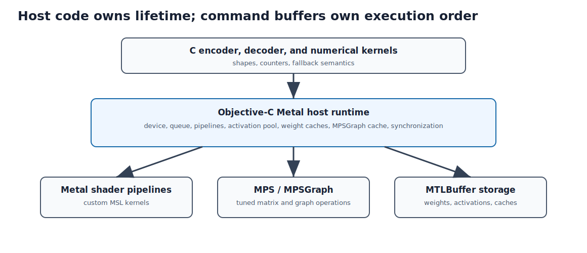

## Purpose and place in the application

This chapter contains the Objective-C Metal host layer, its public C API, and the complete embedded shader source. It explains how buffers, command queues, pipelines, MPS matrix-multiplication operations, and synchronization connect CPU orchestration to Apple GPU execution.

All higher Voxtral layers depend on this implementation for throughput. Nothing in Swift calls it directly; the C runtime owns the GPU boundary.


### CPU/GPU division

The CPU validates dimensions, chooses a cached pipeline, fills small parameter
structures, encodes work, and decides when completion is required. Metal
buffers contain large tensors; command buffers order GPU operations; pipeline
state objects are compiled entry points into shaders (the small programs that
run on the GPU). Metal Performance Shaders (MPS)
provide a tuned dense matrix multiply (`MPSMatrixMultiplication`) where a custom
kernel is unnecessary.

{#fig-metal-runtime-stack width=93%}

Metal Shading Language (MSL) defines GPU kernels. Metal Performance Shaders
(MPS) provide Apple-tuned primitives; this runtime uses `MPSMatrixMultiplication`
for dense matrix products and its own MSL kernels for everything else. (It does
not use the higher-level MPSGraph framework.)
`MTLBuffer` is a GPU-visible byte allocation; `MTLCommandBuffer` orders encoded
work. Objective-C Automatic Reference Counting manages Objective-C objects,
while raw C allocations still require explicit ownership.

::: {.callout-note title="Objective-C for a C programmer: messages, objects, and ARC"}
An Objective-C expression such as `[device newCommandQueue]` sends the
`newCommandQueue` message to `device`. The receiver is written inside brackets;
arguments are named by selector fragments. Object pointers use types such as
`id<MTLDevice>`: `id` is a dynamic object reference and the angle-bracket part
requires conformance to the `MTLDevice` protocol.

Objective-C ARC manages strong object references, but it does not own memory
obtained through `malloc`, mapped file regions, or C structs. This file crosses
that boundary repeatedly, so each resource must be classified as an ARC object,
a borrowed pointer, or explicitly allocated C storage.
:::


## How to read this chapter

Combined source SHA-256: `18ee850a3ed01e87d4f0a24c4318a99f71e8385e7b7e586a2bb7a7a97e6c0bc4`.

For each file, first read its hand-written role, ownership, invariants, and failure model. Source blocks retain original line numbers and syntax highlighting. Boundaries follow declarations where practical; a very large declaration is split only for pagination and is labeled as a continuation. The generator reconstructs every file from emitted blocks and compares every byte with the repository source. No prose claim is generated by counting calls or assignments with regular expressions.

## Metal object lifetime

The runtime initializes one `MTLDevice`, one command queue, one compiled shader
library, and a set of pipeline-state objects. Pipeline creation is expensive;
the code caches it by operation and shape-sensitive parameters.

A command buffer is a submission unit. Encoders append ordered operations.
`commit` makes work eligible for GPU execution. CPU code waits only when it
needs completed data or must safely reuse/free storage. Waiting after every
kernel would serialize CPU and GPU unnecessarily.

## Buffer ownership and storage modes

Weights are long-lived and frequently reused. Activations are short-lived and
benefit from pooling. Shared storage is visible to CPU and GPU on Apple silicon,
but visibility does not imply completion: command ordering still determines
when produced bytes are valid to read.

Caches in this file include:

- BF16-to-FP16 converted weights;
- merged/fused weight layouts;
- reusable activation buffers;
- cached `MPSMatrixMultiplication` objects;
- compiled custom shader pipelines.

Each cache needs a complete key and a shutdown path. A cache keyed only by a
pointer can become invalid if storage is freed and the address reused.

## Metal dispatch, concretely

If you have never written GPU code, the model is simpler than it looks. You write
one function — a **kernel** — that computes *one output element*, then ask the GPU
to run it across a **grid** of thousands of threads at once. Each thread is told
its own coordinate (`thread_position_in_grid`) and uses it to pick which element
it owns. Threads are organized into **threadgroups** that share a small, fast
scratch memory and can synchronize at a **barrier**; that is how cooperative
reductions (sums, maxes) are done.

Two kernels from this file make it concrete:

- **`silu` (elementwise).** Grid = one thread per array element. Thread `gid`
  computes `x[gid] = x[gid] / (1 + exp(-x[gid]))`, guarded by
  `if (gid >= n) return;` so an over-sized grid is harmless. A pure map.
- **`rms_norm` (one row per threadgroup).** Grid = one threadgroup per sequence
  position, 256 threads each. The 256 threads each sum part of the row's squares
  into shared memory; a tree reduction combines them; then each thread rescales
  its slice. The barrier is what lets the 256 threads agree on the row's norm
  before dividing.

Host and kernel must agree exactly on the layout — which buffer index holds which
tensor, the element type, the dimensions packed in the params struct, and the grid
size — because the GPU has no type checker across that boundary. That shared
contract is why the embedded shader source is documented as part of the ABI.

## Dispatch geometry

A Metal kernel receives a grid of threads grouped into threadgroups. Host code
and MSL must agree on:

- buffer index and element type;
- constant parameter layout/alignment;
- logical tensor dimensions;
- grid dimensions;
- bounds behavior for partial final groups.

The embedded shader header is therefore part of the C ABI between host and GPU,
even though both are compiled into one application.

## MPS and custom kernels

Metal Performance Shaders (`MPSMatrixMultiplication`) is appropriate for tuned
dense matrix products. Custom MSL is appropriate for project-specific fusion,
cache copies, rotary transforms, reductions, and layouts. The runtime chooses
between them based on operation shape and available optimized path. (It does not
use the higher-level MPSGraph framework.)

Objective-C is used because Metal's primary host API is Objective-C. Exported C
functions prevent Objective-C types from leaking into the rest of the C model
runtime.

## Why decode speed is memory bandwidth

A useful mental model for the whole file: generating one token requires
streaming essentially **every decoder weight** through the GPU's memory system
once. Per layer, the merged QKV projection reads about 38 MB of f16, the output
projection 25 MB, the merged gate/up FFN weights 113 MB, and the down projection
57 MB — roughly 233 MB per layer, about 6.1 GB across 26 layers, plus ~0.8 GB
for the final logits matmul against the tied token-embedding table. Call it
**~7 GB of weight reads per token**.

The arithmetic per token is tiny by GPU standards (one position, matvecs —
matrix-vector products), so
the GPU's compute units are mostly waiting on memory. Tokens per second is
therefore approximately *memory bandwidth ÷ bytes per token*: at the ~12.5
tokens/s the realtime checkpoint targets, the runtime sustains on the order of
85 GB/s of weight traffic — comfortable for a Max-class Apple chip, tight for a
base one. This single fact explains most of the file's engineering: fusing a
whole token into one command buffer (no idle gaps between layers), keeping the
hidden state resident on the GPU, halving the KV cache with fp16, and merging
weight matrices so each is read in one contiguous pass. It also explains why
further speedups would come from weight quantization (fewer bytes per token),
not from faster arithmetic.

## How to read this chapter: one decode token on the GPU

The host counterpart of the decoder step in Chapter 9 is
`vox_metal_decoder_full_step`. It runs all 26 layers plus the final logits in a
**single command buffer** over a persistent on-GPU hidden-state buffer
(`g_dec_x`), so the 3072-vector never makes a CPU round trip between layers. Per
layer it encodes: the previous layer's output projection + FFN (fused), then
RMSNorm + a merged QKV matmul (`MPSMatrixMultiplication`), then one compute pass
doing RoPE on Q/K, the KV-cache write, and single-token attention
(`decoder_attention`, one threadgroup of 32 threads per head).
`memoryBarrierWithScope` orders those dependent passes. After the loop it appends
the final norm, the logits matmul, and `argmax_f32`, commits once, waits, and
returns the token id.

Read this against the CPU reference in Chapter 9: identical math, fused into far
fewer GPU submissions. The many `vox_metal_*` functions are specializations of
this one pattern — fused vs. separate, fp16 vs fp32 cache, encoder vs decoder.


## `Sources/CVoxtralEngine/Engine/voxtral_metal.h`

**Role.** This file is reproduced completely below. Read declarations in source order because later helpers rely on ownership and invariants established earlier.

Read this file as one ownership unit. The source is divided at declaration boundaries for navigation; commentary does not infer behavior from identifier spelling.

Length: 264 lines. SHA-256: `bd5f423fae75ab00035ad1c9c544be1eac4116df6597b3c09cf1c273c53f0494`.

### Declaration map {.unnumbered .unlisted}

This map gives the reading spine of the file. Line numbers refer to the original source and to the numbered listings below.

::: {.declaration-map}
- **Line 9:** `#ifndef VOXTRAL_METAL_H #define VOXTRAL_METAL_H #include <stddef.h> #include <stdint.h> #ifdef __cplusplus extern "C" {`
- **Line 10:** `#define VOXTRAL_METAL_H #include <stddef.h> #include <stdint.h> #ifdef __cplusplus extern "C" {`
- **Line 15:** `#ifdef __cplusplus extern "C" {`
- **Line 17:** `#endif /* Initialize Metal acceleration. Returns 1 on success, 0 if unavailable. */ int vox_metal_init(void);`
- **Line 20:** `int vox_metal_init(void);`
- **Line 23:** `int vox_metal_available(void);`
- **Line 26:** `void vox_metal_shutdown(void);`
- **Line 38:** `void vox_metal_sgemm_bf16(int M, int N, int K, const float *A, const uint16_t *B_bf16, float *C);`
- **Line 47:** `void vox_metal_sgemm(int M, int N, int K, const float *A, const float *B, float *C);`
- **Line 59:** `void vox_metal_fused_qkv_bf16(int M, int K, const float *input, const uint16_t *wq_bf16, int Nq, const uint16_t *wk_bf16, int Nk, const uint16_t *wv_bf16, int Nv, float *q, float *k, float *v);`
- **Line 70:** `void vox_metal_fused_norm_qkv_bf16(int M, int K, const float *x, const float *norm_weight, float eps, const uint16_t *wq_bf16, int Nq, const uint16_t *wk_bf16, int Nk, const uint16_t *wv_bf16, int Nv, float *q, float *k, float *v);`
- **Line 86:** `void vox_metal_fused_ffn_bf16(int M, int dim, int hidden, const float *input, const uint16_t *w1_bf16, const uint16_t *w3_bf16, const uint16_t *w2_bf16, float *output);`
- **Line 104:** `void vox_metal_fused_wo_ffn_bf16(int M, int dim, int q_dim, int hidden, float *x, const float *attn_out, const uint16_t *wo_bf16, const float *ffn_norm, float eps, const float *ada_scale, const uint16_t *w1_bf16, const uint16_t *w3_bf16, const uint16_t *w2_bf16);`
- **Line 124:** `void vox_metal_batched_attention(float *out, const float *Q, const float *K, const float *V, int seq_q, int seq_k, int n_heads, int n_kv_heads, int head_dim, float scale, int window_size, int q_offset);`
- **Line 136:** `void vox_metal_encoder_attention(float *out, const float *Q, const float *K, const float *V, int seq_q, int seq_k, int n_heads, int n_kv_heads, int head_dim, float scale, int window_size, int q_offset);`
- **Line 148:** `int vox_metal_fused_logits_bf16(int dim, int vocab_size, const float *x, const float *norm_weight, float eps, const uint16_t *tok_emb_bf16, float *logits_out);`
- **Line 161:** `void vox_metal_decoder_start(const float *x, int dim);`
- **Line 164:** `void vox_metal_decoder_end(void);`
- **Line 167:** `void vox_metal_decoder_norm_qkv(int K, const float *norm_weight, float eps, const uint16_t *wq_bf16, int Nq, const uint16_t *wk_bf16, int Nk, const uint16_t *wv_bf16, int Nv, float *q, float *k, float *v);`
- **Line 176:** `void vox_metal_decoder_wo_ffn_next_qkv(int dim, int q_dim, int hidden, const float *attn_out, const uint16_t *wo_bf16, const float *ffn_norm, float eps, const float *ada_scale, const uint16_t *w1_bf16, const uint16_t *w3_bf16, const uint16_t *w2_bf16, const float *next_attn_norm, const uint16_t *next_wq_bf16, int next_Nq, const uint16_t *next_wk_bf16, int next_Nk, const uint16_t *next_wv_bf16, int next_Nv, float *q, float *k, float *v);`
- **Line 192:** `int vox_metal_decoder_wo_ffn_logits(int dim, int q_dim, int hidden, int vocab_size, const float *attn_out, const uint16_t *wo_bf16, const float *ffn_norm, float eps, const float *ada_scale, const uint16_t *w1_bf16, const uint16_t *w3_bf16, const uint16_t *w2_bf16, const float *final_norm, const uint16_t *tok_emb_bf16, float *logits_out);`
- **Line 209:** `void *vox_metal_shared_alloc(size_t size);`
- **Line 210:** `void vox_metal_shared_free(void *ptr);`
- **Line 219:** `int vox_metal_decoder_full_step(void *ctx, const float *rope_freqs, float *logits);`
- **Line 225:** `void vox_metal_warmup_bf16(const uint16_t *bf16_weights, size_t num_elements);`
- **Line 228:** `void vox_metal_warmup_decoder_ops(void *ctx);`
- **Line 231:** `void vox_metal_warmup_merged_2(const uint16_t *a, size_t a_n, const uint16_t *b, size_t b_n);`
- **Line 233:** `void vox_metal_warmup_merged_3(const uint16_t *a, size_t a_n, const uint16_t *b, size_t b_n, const uint16_t *c, size_t c_n);`
- **Line 245:** `int vox_metal_encoder_full_step(void *ctx, float *x, int new_len, const float *rope_freqs, int cache_len);`
- **Line 254:** `void vox_metal_decoder_prefill_step(void *ctx, float *x, int seq_len, const float *rope_freqs);`
- **Line 258:** `size_t vox_metal_memory_used(void);`
- **Line 260:** `#ifdef __cplusplus } #endif #endif /* VOXTRAL_METAL_H */`
- **Line 262:** `#endif #endif /* VOXTRAL_METAL_H */`
- **Line 264:** `#endif /* VOXTRAL_METAL_H */`
:::

### Header preamble {.unnumbered .unlisted}

This preamble contains comments and preprocessing setup that apply to the complete public header. It introduces no runtime state.

The opening comment is the file's one-paragraph contract: MPS-accelerated
matrix multiplication with BF16-to-FP16 weight caching, plus compute shaders
for element-wise work, ported from the author's earlier flux-2-4b project.

```{.c .numberLines startFrom="1"}
/*
 * voxtral_metal.h - Metal GPU acceleration for Voxtral inference
 *
 * Provides MPS-accelerated matrix multiplication with bf16->f16 weight caching,
 * plus GPU compute shaders for element-wise operations.
 * Ported from flux-2-4b (same author, same license).
 */

```

### `#ifndef VOXTRAL_METAL_H`

Standard include guard: together with the `#define` on the next line, the
header's declarations are compiled at most once per translation unit no matter
how many files include it.

```{.c .numberLines startFrom="9"}
#ifndef VOXTRAL_METAL_H
```

### `#define VOXTRAL_METAL_H`

Defines the guard macro and pulls in the header's only two dependencies:
`stddef.h` for `size_t` and `stdint.h` for the `uint16_t` in which raw BF16
weight words are passed across this API.

```{.c .numberLines startFrom="10"}
#define VOXTRAL_METAL_H

#include <stddef.h>
#include <stdint.h>

```

### `#ifdef __cplusplus`

If a C++ (or Objective-C++) file ever includes this header, `extern "C"`
disables C++ name mangling so the declarations keep the plain C symbol names
that `voxtral_metal.m` exports; under plain C the preprocessor drops the
wrapper entirely.

```{.c .numberLines startFrom="15"}
#ifdef __cplusplus
extern "C" {
```

### `#endif`

Ends the conditional section that opened the `extern "C"` block. From here to
the bottom of the file, every declaration is preceded by a comment stating its
contract — return values, ownership, required call order — and those comments
are the documentation the C engine code is written against.

```{.c .numberLines startFrom="17"}
#endif

/* Initialize Metal acceleration. Returns 1 on success, 0 if unavailable. */
```

### `int vox_metal_init(void);`

Creates the global device, command queue, shader library, pipelines, and caches.
Zero means callers must retain a CPU/fallback path.

```{.c .numberLines startFrom="20"}
int vox_metal_init(void);

/* Check if Metal is initialized and available. */
```

### `int vox_metal_available(void);`

Reports whether initialization completed; it performs no allocation or dispatch.

```{.c .numberLines startFrom="23"}
int vox_metal_available(void);

/* Cleanup all Metal resources. */
```

### `void vox_metal_shutdown(void);`

Releases pipelines, MPS operation caches, converted/merged weights, activation
pool, persistent decoder storage, queue, and device.

```{.c .numberLines startFrom="26"}
void vox_metal_shutdown(void);

/*
 * GPU-accelerated matrix multiplication with bf16 weights.
 * C[M,N] = alpha * A[M,K] @ B^T[N,K] + beta * C[M,N]
 *
 * A is f32 (activations), B is bf16 (weights, converted to f16 for MPS),
 * C is f32 (output). B is always transposed (row-major weight layout).
 *
 * Weight buffers are cached on GPU after first use (bf16->f16 conversion
 * happens once per unique weight pointer).
 */
```

### `void vox_metal_sgemm_bf16(…)`

Multiplies float activations by transposed BF16 checkpoint weights. Weights are
converted and cached as FP16 GPU buffers; output remains float.

```{.c .numberLines startFrom="38"}
void vox_metal_sgemm_bf16(int M, int N, int K,
                           const float *A,
                           const uint16_t *B_bf16,
                           float *C);

/*
 * GPU-accelerated f32 matrix multiplication.
 * C[M,N] = A[M,K] @ B^T[N,K]
 */
```

### `void vox_metal_sgemm(…)`

The all-float32 sibling of `vox_metal_sgemm_bf16`: C[M,N] = A[M,K] @ B[N,K]^T
with no precision conversion. B is uploaded once into the float weight cache
and reused on every later call, so only the activations A travel to the GPU
each time; the product itself runs through the same cached
`MPSMatrixMultiplication` path.

```{.c .numberLines startFrom="47"}
void vox_metal_sgemm(int M, int N, int K,
                     const float *A,
                     const float *B,
                     float *C);

/*
 * Fused QKV: three matmuls in one command buffer with shared input.
 * q[M,Nq] = input[M,K] @ wq[Nq,K]^T
 * k[M,Nk] = input[M,K] @ wk[Nk,K]^T
 * v[M,Nv] = input[M,K] @ wv[Nv,K]^T
 * Saves 2 command buffer round-trips vs 3 separate calls.
 */
```

### `void vox_metal_fused_qkv_bf16(…)`

Computes the three attention projections Q, K, and V from one shared input by
recording all three matmuls into a single command buffer (the unit of work the
CPU submits to the GPU). The input is uploaded once and the CPU blocks once
instead of three times — the comment above prices this at two saved
round-trips per call.

```{.c .numberLines startFrom="59"}
void vox_metal_fused_qkv_bf16(int M, int K,
                                const float *input,
                                const uint16_t *wq_bf16, int Nq,
                                const uint16_t *wk_bf16, int Nk,
                                const uint16_t *wv_bf16, int Nv,
                                float *q, float *k, float *v);

/*
 * Fused RMSNorm + QKV: norm + three matmuls in one command buffer.
 * x_norm = rms_norm(x, norm_weight, eps), then QKV projections.
 */
```

### `void vox_metal_fused_norm_qkv_bf16(…)`

Extends the fused QKV call by running RMS normalization first, inside the same
command buffer: the rms_norm kernel writes the normalized vector into a GPU
scratch buffer and the three projection matmuls read it from there. The
intermediate never returns to the CPU, so norm plus projections cost one
submission and one wait.

```{.c .numberLines startFrom="70"}
void vox_metal_fused_norm_qkv_bf16(int M, int K,
                                     const float *x,
                                     const float *norm_weight, float eps,
                                     const uint16_t *wq_bf16, int Nq,
                                     const uint16_t *wk_bf16, int Nk,
                                     const uint16_t *wv_bf16, int Nv,
                                     float *q, float *k, float *v);

/*
 * Fused SwiGLU FFN: w1+w3+silu+mul+w2 in one command buffer.
 * gate = silu(input @ w1^T)
 * up = input @ w3^T
 * output = (gate * up) @ w2^T
 * All intermediate data stays on GPU. Saves 2 round-trips + eliminates
 * intermediate CPU memcpy for silu/mul.
 */
```

### `void vox_metal_fused_ffn_bf16(…)`

Runs gate/up projections, SiLU product, and down projection without CPU
round-trips for hidden activations.

```{.c .numberLines startFrom="86"}
void vox_metal_fused_ffn_bf16(int M, int dim, int hidden,
                               const float *input,
                               const uint16_t *w1_bf16,
                               const uint16_t *w3_bf16,
                               const uint16_t *w2_bf16,
                               float *output);

/*
 * Fused wo projection + residual + RMSNorm + ada_scale + SwiGLU FFN + residual.
 * All in one command buffer. Saves 1 round-trip per layer vs separate wo + FFN.
 *
 * attn_out[M, q_dim]: attention output (input for wo)
 * wo_bf16[dim, q_dim]: output projection weights
 * x[M, dim]: current residual (modified in-place: += wo_out, then += ffn_out)
 * ffn_norm[dim]: RMS norm weights for FFN
 * ada_scale[dim]: adaptive conditioning (NULL to skip)
 * w1,w3,w2: FFN weights
 */
```

### `void vox_metal_fused_wo_ffn_bf16(…)`

One call covers the whole second half of a transformer layer: project the
attention result through wo, add it into the residual `x`, re-normalize,
optionally scale by the adaptive conditioning vector (1 + ada_scale), run the
SwiGLU feed-forward, and add its output into `x` again. `x` is updated in
place, and because every step is encoded into one command buffer the layer
tail costs a single CPU/GPU synchronization.

```{.c .numberLines startFrom="104"}
void vox_metal_fused_wo_ffn_bf16(int M, int dim, int q_dim, int hidden,
                                   float *x,
                                   const float *attn_out,
                                   const uint16_t *wo_bf16,
                                   const float *ffn_norm, float eps,
                                   const float *ada_scale,
                                   const uint16_t *w1_bf16,
                                   const uint16_t *w3_bf16,
                                   const uint16_t *w2_bf16);

/*
 * GPU batched attention (all heads in one command buffer).
 * Performs QK^T matmul, causal+window masked softmax, scores*V matmul
 * entirely on GPU. Uses strided MPS matrix views (no per-head copies).
 *
 * Q:   [seq_q, n_heads * head_dim]   f32
 * K:   [seq_k, n_kv_heads * head_dim] f32
 * V:   [seq_k, n_kv_heads * head_dim] f32
 * out: [seq_q, n_heads * head_dim]   f32
 */
```

### `void vox_metal_batched_attention(…)`

Full attention — QK^T, causal/window-masked softmax, scores @ V — for every
head in one command buffer. Instead of copying each head's columns out of the
packed [seq, heads*head_dim] arrays, it builds strided matrix views (MPS
matrix descriptors whose row stride is the full packed row, so a head's slice
is addressed in place). When there are fewer K/V heads than query heads
(grouped-query attention), several query heads read the same K/V slice.

```{.c .numberLines startFrom="124"}
void vox_metal_batched_attention(float *out,
                                  const float *Q, const float *K, const float *V,
                                  int seq_q, int seq_k,
                                  int n_heads, int n_kv_heads,
                                  int head_dim, float scale,
                                  int window_size, int q_offset);

/*
 * Fused encoder attention: single compute dispatch for all heads.
 * Replaces per-head MPS matmul encodes with a single kernel.
 * Same interface as vox_metal_batched_attention.
 */
```

### `void vox_metal_encoder_attention(…)`

Same arguments and tensor layout as `vox_metal_batched_attention`, but the
whole computation is a single custom-kernel dispatch instead of dozens of
per-head MPS matmul encodes. For the encoder's 32 heads that removes most of
the CPU-side encoding cost; the masking and grouped-query rules are identical.

```{.c .numberLines startFrom="136"}
void vox_metal_encoder_attention(float *out,
                                   const float *Q, const float *K, const float *V,
                                   int seq_q, int seq_k,
                                   int n_heads, int n_kv_heads,
                                   int head_dim, float scale,
                                   int window_size, int q_offset);

/*
 * Fused final RMSNorm + logits matmul + argmax.
 * Computes: x_norm = rms_norm(x, norm, eps), logits = x_norm @ tok_emb^T, argmax.
 * Returns best token ID. logits_out may be NULL if not needed.
 */
```

### `int vox_metal_fused_logits_bf16(…)`

The decoding head in one submission: final RMS norm, the logits matmul against
the token-embedding matrix, and an argmax kernel that leaves the winning token
id in a four-byte buffer. The function returns that id; `logits_out` may be
NULL, in which case the vocabulary-sized logits array is never copied back —
greedy decoding only needs the four bytes.

```{.c .numberLines startFrom="148"}
int vox_metal_fused_logits_bf16(int dim, int vocab_size,
                                  const float *x,
                                  const float *norm_weight, float eps,
                                  const uint16_t *tok_emb_bf16,
                                  float *logits_out);

/*
 * Persistent-x decoder step API.
 * Keeps x on GPU across all 26 layers to fuse wo_ffn[i] + norm_qkv[i+1]
 * in one command buffer. Halves command buffer count: 53 → 27 per token.
 */

/* Upload x to persistent GPU buffer (call before decoder loop). */
```

### `void vox_metal_decoder_start(const float *x, int dim);`

Uploads one residual vector into persistent GPU storage before the layer loop.

```{.c .numberLines startFrom="161"}
void vox_metal_decoder_start(const float *x, int dim);

/* Release persistent GPU x (call after decoder loop). */
```

### `void vox_metal_decoder_end(void);`

Ends persistent-x mode after one token step.

```{.c .numberLines startFrom="164"}
void vox_metal_decoder_end(void);

/* First layer: rms_norm + QKV from persistent GPU x. (1 cmd buf) */
```

### `void vox_metal_decoder_norm_qkv(…)`

Runs first-layer normalization and Q/K/V projection from persistent x.

```{.c .numberLines startFrom="167"}
void vox_metal_decoder_norm_qkv(int K,
                                  const float *norm_weight, float eps,
                                  const uint16_t *wq_bf16, int Nq,
                                  const uint16_t *wk_bf16, int Nk,
                                  const uint16_t *wv_bf16, int Nv,
                                  float *q, float *k, float *v);

/* Cross-layer: wo+FFN (updates GPU x) + norm+QKV for next layer. (1 cmd buf)
 * Fuses 10 wo+FFN steps + 4 norm+QKV steps into a single command buffer. */
```

### `void vox_metal_decoder_wo_ffn_next_qkv(…)`

Fuses one layer's output/feed-forward updates with the next layer's norm and
Q/K/V, removing an inter-layer command-buffer boundary.

```{.c .numberLines startFrom="176"}
void vox_metal_decoder_wo_ffn_next_qkv(int dim, int q_dim, int hidden,
                                         const float *attn_out,
                                         const uint16_t *wo_bf16,
                                         const float *ffn_norm, float eps,
                                         const float *ada_scale,
                                         const uint16_t *w1_bf16,
                                         const uint16_t *w3_bf16,
                                         const uint16_t *w2_bf16,
                                         const float *next_attn_norm,
                                         const uint16_t *next_wq_bf16, int next_Nq,
                                         const uint16_t *next_wk_bf16, int next_Nk,
                                         const uint16_t *next_wv_bf16, int next_Nv,
                                         float *q, float *k, float *v);

/* Final layer: wo+FFN (updates GPU x) + logits + argmax. (1 cmd buf)
 * Returns token ID. logits_out may be NULL. */
```

### `int vox_metal_decoder_wo_ffn_logits(…)`

Closes a persistent-x token step: encodes the last layer's wo+FFN update of
the GPU-resident `x`, then the final norm, the vocabulary matmul, and the GPU
argmax, all in one command buffer. Returns the chosen token id; as with
`vox_metal_fused_logits_bf16`, passing NULL for `logits_out` skips the large
logits download.

```{.c .numberLines startFrom="192"}
int vox_metal_decoder_wo_ffn_logits(int dim, int q_dim, int hidden, int vocab_size,
                                      const float *attn_out,
                                      const uint16_t *wo_bf16,
                                      const float *ffn_norm, float eps,
                                      const float *ada_scale,
                                      const uint16_t *w1_bf16,
                                      const uint16_t *w3_bf16,
                                      const uint16_t *w2_bf16,
                                      const float *final_norm,
                                      const uint16_t *tok_emb_bf16,
                                      float *logits_out);

/*
 * GPU-shared memory allocation (zero-copy between CPU and GPU).
 * Returns a CPU pointer backed by a Metal shared buffer.
 * Falls back to calloc if Metal is not available.
 */
```

### `void *vox_metal_shared_alloc(size_t size);`

Allocates CPU/GPU-visible cache storage, falling back to zeroed heap memory when
Metal is unavailable.

```{.c .numberLines startFrom="209"}
void *vox_metal_shared_alloc(size_t size);
```

### `void vox_metal_shared_free(void *ptr);`

Allocates CPU/GPU-visible cache storage, falling back to zeroed heap memory when
Metal is unavailable.

```{.c .numberLines startFrom="210"}
void vox_metal_shared_free(void *ptr);

/*
 * Monolithic decoder step: all 26 layers + logits in ONE command buffer.
 * Requires KV cache allocated with vox_metal_shared_alloc().
 * GPU kernels for RoPE, KV cache write, and attention eliminate all
 * CPU round-trips between layers. ctx is cast to vox_ctx_t* internally.
 * Returns token ID. logits_out may be NULL.
 */
```

### `int vox_metal_decoder_full_step(void *ctx, const float *rope_freqs, float *logits);`

Encodes all decoder layers, RoPE, cache writes, attention, logits, and argmax in
one command buffer.

```{.c .numberLines startFrom="219"}
int vox_metal_decoder_full_step(void *ctx, const float *rope_freqs, float *logits);

/*
 * Pre-warm the bf16->f16 cache for a weight tensor.
 * Call during model loading to avoid first-use latency.
 */
```

### `void vox_metal_warmup_bf16(const uint16_t *bf16_weights, size_t num_elements);`

Preconverts one BF16 weight to eliminate first-use latency.

```{.c .numberLines startFrom="225"}
void vox_metal_warmup_bf16(const uint16_t *bf16_weights, size_t num_elements);

/* Pre-warm MPS matmul ops and f32 weight caches for decoder. */
```

### `void vox_metal_warmup_decoder_ops(void *ctx);`

Preconstructs shape-specific MPS operations and decoder weight caches.

```{.c .numberLines startFrom="228"}
void vox_metal_warmup_decoder_ops(void *ctx);

/* Pre-warm merged weight buffers (used by monolithic decoder step). */
```

### `void vox_metal_warmup_merged_2(…)`

Caches a two-matrix merged BF16 layout used by fused kernels.

```{.c .numberLines startFrom="231"}
void vox_metal_warmup_merged_2(const uint16_t *a, size_t a_n,
                                const uint16_t *b, size_t b_n);
```

### `void vox_metal_warmup_merged_3(…)`

Caches a three-matrix merged BF16 layout.

```{.c .numberLines startFrom="233"}
void vox_metal_warmup_merged_3(const uint16_t *a, size_t a_n,
                                const uint16_t *b, size_t b_n,
                                const uint16_t *c, size_t c_n);

/*
 * Monolithic encoder step: all 32 layers + final norm in ONE command buffer.
 * Requires encoder KV cache allocated with vox_metal_shared_alloc().
 * x is [new_len, VOX_ENC_DIM] float, modified in-place with the output.
 * rope_freqs: [new_len, head_dim/2, 2] precomputed frequencies.
 * cache_len: current number of positions in the KV cache.
 * Returns 0 on success, -1 on failure.
 */
```

### `int vox_metal_encoder_full_step(…)`

Runs every encoder transformer layer plus final norm for one new chunk while
updating shared rolling caches.

```{.c .numberLines startFrom="245"}
int vox_metal_encoder_full_step(void *ctx, float *x, int new_len,
                                 const float *rope_freqs, int cache_len);

/*
 * Monolithic decoder prefill: all 26 layers in ONE command buffer (M>1).
 * x is [seq_len, VOX_DEC_DIM] float, modified in-place.
 * rope_freqs: [seq_len, head_dim/2, 2] precomputed frequencies.
 * Updates ctx->kv_cache_len internally.
 */
```

### `void vox_metal_decoder_prefill_step(…)`

Processes a multi-position prompt/audio prefix through all decoder layers and
updates cache length.

```{.c .numberLines startFrom="254"}
void vox_metal_decoder_prefill_step(void *ctx, float *x, int seq_len,
                                      const float *rope_freqs);

/* GPU memory usage (for debugging). */
```

### `size_t vox_metal_memory_used(void);`

Returns memory tracked by Metal caches/allocations for diagnostics, not total
process resident memory.

```{.c .numberLines startFrom="258"}
size_t vox_metal_memory_used(void);

```

### `#ifdef __cplusplus`

The closing brace of the `extern "C" {` region opened near the top of the
header, again emitted only when a C++ compiler is reading the file.

```{.c .numberLines startFrom="260"}
#ifdef __cplusplus
}
```

### `#endif`

Ends the C++-only conditional around that closing brace.

```{.c .numberLines startFrom="262"}
#endif

```

### `#endif /* VOXTRAL_METAL_H */`

Terminates the include guard opened on line 9.

```{.c .numberLines startFrom="264"}
#endif /* VOXTRAL_METAL_H */
```

## `Sources/CVoxtralEngine/Engine/voxtral_metal.m`

**Role.** The host layer caches Metal objects and pipeline state, allocates shared buffers, dispatches kernels, and waits only where CPU code needs completed results. Objective-C ownership and C-visible handles coexist in this file.

This Objective-C translation unit is the host runtime for Apple Metal. Global
state owns the device, command queue, shader library, pipeline states, reusable
activation buffers, converted-weight caches, merged-weight caches, and cached
`MPSMatrixMultiplication` objects. Initialization and shutdown must be paired.

CPU code validates dimensions and encodes commands; GPU kernels operate on
buffers. Shared-storage buffers permit CPU/GPU visibility but do not remove the
need for command-buffer ordering and completion waits. Cache keys must include
every shape/dtype property that changes compiled behavior.

Objective-C automatic reference counting manages Objective-C objects, while
the exported C API still has explicit ownership for raw allocations and opaque
context pointers.

Length: 3879 lines. SHA-256: `ee1ba4a23c8c8578cb9eb688c0860fc98473ecd845a9dcf04fd648dabf0e35ed`.

### Declaration map {.unnumbered .unlisted}

This map gives the reading spine of the file. Line numbers refer to the original source and to the numbered listings below.

::: {.declaration-map}
- **Line 79:** `static inline uint16_t bf16_to_f16(uint16_t bf16) {`
- **Line 104:** `static void convert_bf16_to_f16(uint16_t *dst, const uint16_t *src, size_t n) {`
- **Line 140:** `typedef struct {`
- **Line 150:** `static id<MTLBuffer> get_cached_bf16_as_f16_buffer(const uint16_t *weights, size_t num_elements) {`
- **Line 182:** `static void clear_f16_cache(void) {`
- **Line 198:** `typedef struct {`
- **Line 209:** `static id<MTLBuffer> get_merged_f16_2(const uint16_t *bf16_a, size_t a_elems, const uint16_t *bf16_b, size_t b_elems) {`
- **Line 239:** `static id<MTLBuffer> get_merged_f16_3(const uint16_t *bf16_a, size_t a_elems, const uint16_t *bf16_b, size_t b_elems, const uint16_t *bf16_c, size_t c_elems) {`
- **Line 268:** `static void clear_merged_cache(void) {`
- **Line 284:** `typedef struct {`
- **Line 294:** `static id<MTLBuffer> get_cached_weight_buffer(const float *weights, size_t size) {`
- **Line 326:** `static void clear_weight_cache(void) {`
- **Line 342:** `typedef struct {`
- **Line 352:** `static id<MTLBuffer> pool_get_buffer(size_t size) {`
- **Line 388:** `static void pool_release_buffer(id<MTLBuffer> buffer) {`
- **Line 400:** `static void clear_activation_pool(void) {`
- **Line 419:** `static MPSMatrixMultiplication *get_cached_matmul_op(BOOL transposeLeft, BOOL transposeRight, int resultRows, int resultColumns, int interiorColumns, double alpha, double beta) {`
- **Line 448:** `static void clear_matmul_op_cache(void) {`
- **Line 458:** `static int init_shaders(void) {`
- **Line 595:** `int vox_metal_init(void) {`
- **Line 626:** `int vox_metal_available(void) {`
- **Line 630:** `void vox_metal_shutdown(void) {`
- **Line 694:** `void vox_metal_sgemm_bf16(int M, int N, int K, const float *A, const uint16_t *B_bf16, float *C) {`
- **Line 773:** `void vox_metal_sgemm(int M, int N, int K, const float *A, const float *B, float *C) {`
- **Line 843:** `void vox_metal_fused_norm_qkv_bf16(int M, int K, const float *x, const float *norm_weight, float eps, const uint16_t *wq_bf16, int Nq, const uint16_t *wk_bf16, int Nk, const uint16_t *wv_bf16, int Nv, float *q_out, float *k_out, float *v_out) {`
- **Line 987:** `void vox_metal_fused_qkv_bf16(int M, int K, const float *input, const uint16_t *wq_bf16, int Nq, const uint16_t *wk_bf16, int Nk, const uint16_t *wv_bf16, int Nv, float *q_out, float *k_out, float *v_out) {`
- **Line 1129:** `void vox_metal_fused_ffn_bf16(int M, int dim, int hidden, const float *input, const uint16_t *w1_bf16, const uint16_t *w3_bf16, const uint16_t *w2_bf16, float *output) {`
- **Line 1287:** `int vox_metal_fused_logits_bf16(int dim, int vocab_size, const float *x, const float *norm_weight, float eps, const uint16_t *tok_emb_bf16, float *logits_out) {`
- **Line 1397:** `void vox_metal_fused_wo_ffn_bf16(int M, int dim, int q_dim, int hidden, float *x, const float *attn_out, const uint16_t *wo_bf16, const float *ffn_norm, float eps, const float *ada_scale, const uint16_t *w1_bf16, const uint16_t *w3_bf16, const uint16_t *w2_bf16) {`
- **Line 1651:** `void vox_metal_decoder_start(const float *x, int dim) {`
- **Line 1661:** `void vox_metal_decoder_end(void) {`
- **Line 1669:** `static void encode_wo_ffn_steps(id<MTLCommandBuffer> cmdBuffer, id<MTLBuffer> bufAttn, id<MTLBuffer> bufProj, id<MTLBuffer> bufXnorm, id<MTLBuffer> bufGate, /* must hold hidden*2 floats */ id<MTLBuffer> bufFfnOut, int dim, int q_dim, int hidden, const uint16_t *wo_bf16, const float *ffn_norm, float eps, const float *ada_scale, const uint16_t *w1_bf16, const uint16_t *w3_bf16, const uint16_t *w2_bf16) {`
- **Line 1892:** `static void encode_norm_qkv_steps(id<MTLCommandBuffer> cmdBuffer, id<MTLBuffer> bufXnorm, id<MTLBuffer> bufQKV, /* merged output: Q,K,V contiguous */ int K, const float *norm_weight, float eps, const uint16_t *wq_bf16, int Nq, const uint16_t *wk_bf16, int Nk, const uint16_t *wv_bf16, int Nv) {`
- **Line 1949:** `void vox_metal_decoder_norm_qkv(int K, const float *norm_weight, float eps, const uint16_t *wq_bf16, int Nq, const uint16_t *wk_bf16, int Nk, const uint16_t *wv_bf16, int Nv, float *q_out, float *k_out, float *v_out) {`
- **Line 1988:** `void vox_metal_decoder_wo_ffn_next_qkv(int dim, int q_dim, int hidden, const float *attn_out, const uint16_t *wo_bf16, const float *ffn_norm, float eps, const float *ada_scale, const uint16_t *w1_bf16, const uint16_t *w3_bf16, const uint16_t *w2_bf16, const float *next_attn_norm, const uint16_t *next_wq_bf16, int next_Nq, const uint16_t *next_wk_bf16, int next_Nk, const uint16_t *next_wv_bf16, int next_Nv, float *q_out, float *k_out, float *v_out) {`
- **Line 2062:** `int vox_metal_decoder_wo_ffn_logits(int dim, int q_dim, int hidden, int vocab_size, const float *attn_out, const uint16_t *wo_bf16, const float *ffn_norm, float eps, const float *ada_scale, const uint16_t *w1_bf16, const uint16_t *w3_bf16, const uint16_t *w2_bf16, const float *final_norm, const uint16_t *tok_emb_bf16, float *logits_out) {`
- **Line 2201:** `void vox_metal_batched_attention(float *out, const float *Q, const float *K, const float *V, int seq_q, int seq_k, int n_heads, int n_kv_heads, int head_dim, float scale, int window_size, int q_offset) {`
- **Line 2368:** `void vox_metal_encoder_attention(float *out, const float *Q, const float *K, const float *V, int seq_q, int seq_k, int n_heads, int n_kv_heads, int head_dim, float scale, int window_size, int q_offset) {`
- **Line 2438:** `void *vox_metal_shared_alloc(size_t size) {`
- **Line 2451:** `void vox_metal_shared_free(void *ptr) {`
- **Line 2463:** `static id<MTLBuffer> find_shared_buffer(void *ptr) {`
- **Line 2476:** `int vox_metal_decoder_full_step(void *ctx_ptr, const float *rope_freqs, float *logits_out) {`
- **Line 2750:** `int vox_metal_encoder_full_step(void *ctx_ptr, float *x, int new_len, const float *rope_freqs, int cache_len) {`
- **Line 3237:** `void vox_metal_decoder_prefill_step(void *ctx_ptr, float *x, int seq_len, const float *rope_freqs) {`
- **Line 3651:** `void vox_metal_warmup_bf16(const uint16_t *bf16_weights, size_t num_elements) {`
- **Line 3656:** `void vox_metal_warmup_merged_2(const uint16_t *a, size_t a_n, const uint16_t *b, size_t b_n) {`
- **Line 3662:** `void vox_metal_warmup_merged_3(const uint16_t *a, size_t a_n, const uint16_t *b, size_t b_n, const uint16_t *c, size_t c_n) {`
- **Line 3669:** `void vox_metal_warmup_decoder_ops(void *ctx_ptr) {`
- **Line 3865:** `size_t vox_metal_memory_used(void) {`
:::

### Translation-unit preamble {.unnumbered .unlisted}

This translation-unit preamble selects dependencies, compile-time features, and file-local constants used by the definitions that follow.

The imports bring in the three Apple frameworks (Foundation, Metal, and Metal
Performance Shaders), this runtime's own headers — including the embedded
shader source array — and `pthread.h`/`mach_time.h` for cache mutexes and
timing. The rest of the preamble holds the first slice of the file's global state:
the device and command queue, one pipeline-state global per compiled kernel,
the persistent decoder hidden-state buffer `g_dec_x`, and the eight-slot table
that maps shared allocations' CPU pointers back to their `MTLBuffer`s (the
weight and activation caches add more globals further down the file).

```{.objective-c .numberLines startFrom="1"}
/*
 * voxtral_metal.m - Metal GPU acceleration for Voxtral inference
 *
 * MPS-accelerated matrix multiplication with bf16->f16 weight caching
 * and activation buffer pooling. Ported from flux-2-4b.
 */

#import <Foundation/Foundation.h>
#import <Metal/Metal.h>
#import <MetalPerformanceShaders/MetalPerformanceShaders.h>
#include "voxtral_metal.h"
#include "voxtral_shaders_source.h"
#include <stdio.h>
#include <stdlib.h>
#include <string.h>
#include <pthread.h>
#include <mach/mach_time.h>

extern int vox_verbose;

/* ========================================================================
 * Global Metal State
 * ======================================================================== */

static id<MTLDevice> g_device = nil;
static id<MTLCommandQueue> g_queue = nil;
static int g_initialized = 0;

/* Compute shader pipelines */
static id<MTLLibrary> g_shader_library = nil;
static id<MTLComputePipelineState> g_rms_norm_pipeline = nil;
static id<MTLComputePipelineState> g_silu_pipeline = nil;
static id<MTLComputePipelineState> g_gelu_pipeline = nil;
static id<MTLComputePipelineState> g_add_inplace_pipeline = nil;
static id<MTLComputePipelineState> g_mul_inplace_pipeline = nil;
static id<MTLComputePipelineState> g_causal_softmax_pipeline = nil;
static id<MTLComputePipelineState> g_ada_scale_mul_pipeline = nil;
static id<MTLComputePipelineState> g_argmax_pipeline = nil;
static int g_shaders_initialized = 0;

/* Persistent GPU x buffer for cross-layer decoder fusion */
static id<MTLBuffer> g_dec_x = nil;

/* New kernels for monolithic decoder step */
static id<MTLComputePipelineState> g_rope_apply_pipeline = nil;
static id<MTLComputePipelineState> g_kv_cache_copy_pipeline = nil;
static id<MTLComputePipelineState> g_kv_cache_copy_f16_pipeline = nil;
static id<MTLComputePipelineState> g_decoder_attention_pipeline = nil;
static id<MTLComputePipelineState> g_decoder_attention_f16_pipeline = nil;
static id<MTLComputePipelineState> g_encoder_attention_pipeline = nil;
static id<MTLComputePipelineState> g_encoder_attention_kv_f16_pipeline = nil;
static id<MTLComputePipelineState> g_bias_add_pipeline = nil;
static id<MTLComputePipelineState> g_bias_add_strided_pipeline = nil;
static id<MTLComputePipelineState> g_batched_rope_apply_pipeline = nil;
static id<MTLComputePipelineState> g_batched_rope_apply_strided_pipeline = nil;
static id<MTLComputePipelineState> g_batched_kv_cache_copy_pipeline = nil;
static id<MTLComputePipelineState> g_batched_kv_cache_copy_f16_pipeline = nil;
static id<MTLComputePipelineState> g_batched_kv_cache_copy_strided_pipeline = nil;
static id<MTLComputePipelineState> g_batched_kv_cache_copy_strided_f16_pipeline = nil;
static id<MTLComputePipelineState> g_encoder_attention_qstrided_pipeline = nil;
static id<MTLComputePipelineState> g_encoder_attention_kv_f16_qstrided_pipeline = nil;
static id<MTLComputePipelineState> g_deinterleave_pipeline = nil;
static id<MTLComputePipelineState> g_silu_mul_merged_pipeline = nil;
static id<MTLComputePipelineState> g_decoder_ffn_gate_pipeline = nil;
static id<MTLComputePipelineState> g_decoder_w2_residual_pipeline = nil;
static id<MTLComputePipelineState> g_decoder_wo_residual_pipeline = nil;

/* GPU-shared memory tracking (zero-copy between CPU and GPU) */
#define SHARED_ALLOC_MAX 8
static struct { void *ptr; id<MTLBuffer> buf; } g_shared_allocs[SHARED_ALLOC_MAX];
static int g_shared_count = 0;

/* ========================================================================
 * BF16 -> F16 Conversion
 * MPS only supports mixed f32/f16 matmul, not f32/bf16.
 * We convert bf16 weights to f16 once and cache the result.
 * ======================================================================== */

```

### `static inline uint16_t bf16_to_f16(uint16_t bf16)`

Converts one bfloat16 weight to IEEE half precision by rebiasing the exponent
from bias 127 to bias 15 and shifting the 7-bit mantissa left by 3 to fill f16's
10-bit field. Zero/subnormal bf16 exponents collapse to signed zero, 0xFF maps to
inf or a quiet NaN. It runs on the CPU during weight conversion because
MPSMatrixMultiplication accepts f32/f16, not bf16.

```{.objective-c .numberLines startFrom="79"}
static inline uint16_t bf16_to_f16(uint16_t bf16) {
    uint32_t sign = (bf16 >> 15) & 0x1;
    int32_t exp = (bf16 >> 7) & 0xFF;
    uint32_t mant = bf16 & 0x7F;

    if (exp == 0) return (uint16_t)(sign << 15);
    if (exp == 0xFF) return (uint16_t)((sign << 15) | 0x7C00 | (mant ? 0x200 : 0));

    int32_t new_exp = exp - 127 + 15;
    if (new_exp <= 0) return (uint16_t)(sign << 15);
    if (new_exp >= 31) return (uint16_t)((sign << 15) | 0x7C00);

    uint32_t new_mant = mant << 3;
    return (uint16_t)((sign << 15) | (new_exp << 10) | new_mant);
}

/* Convert a bf16 array to f16. On arm64 the conversion goes through f32 with
 * NEON (8 elements per iteration) and rounds to nearest, which is slightly
 * more accurate than the truncating scalar fallback; large tensors are split
 * across cores because this conversion dominates model-load time. */
#if defined(__aarch64__)
#include <arm_neon.h>
#endif
#define BF16_CONVERT_PAR_CHUNK ((size_t)1 << 20)

```

### `static void convert_bf16_to_f16(uint16_t *dst, const uint16_t *src, size_t n)`

Bulk BF16-to-FP16 conversion behind every weight cache. The arm64 path
exploits the formats' kinship — a bfloat16 word is exactly the top half of a
float32 — so the loop widens eight values per iteration — two `vshll_n_u16` calls of
four lanes each shift them 16 bits left into f32 lanes, and `vcvt_f16_f32` rounds them to f16 in hardware
(round-to-nearest, slightly more accurate than the truncating scalar
`bf16_to_f16`). Because this conversion dominates model-load time, tensors of
two million elements or more are split into one-million-element chunks across
cores with `dispatch_apply`, Grand Central Dispatch's parallel for-loop; the
`^(size_t c){ ... }` argument is a C block (a function value that captures the
surrounding variables), and each chunk re-enters this function below the
threshold. Leftover elements and non-ARM builds use the scalar helper.

```{.objective-c .numberLines startFrom="104"}
static void convert_bf16_to_f16(uint16_t *dst, const uint16_t *src, size_t n) {
#if defined(__aarch64__)
    if (n >= 2 * BF16_CONVERT_PAR_CHUNK) {
        size_t chunks = (n + BF16_CONVERT_PAR_CHUNK - 1) / BF16_CONVERT_PAR_CHUNK;
        dispatch_apply(chunks,
                       dispatch_get_global_queue(QOS_CLASS_USER_INITIATED, 0),
                       ^(size_t c) {
            size_t start = c * BF16_CONVERT_PAR_CHUNK;
            size_t count = n - start < BF16_CONVERT_PAR_CHUNK
                ? n - start : BF16_CONVERT_PAR_CHUNK;
            convert_bf16_to_f16(dst + start, src + start, count);
        });
        return;
    }
    size_t i = 0;
    for (; i + 8 <= n; i += 8) {
        uint16x8_t b = vld1q_u16(src + i);
        uint32x4_t lo = vshll_n_u16(vget_low_u16(b), 16);
        uint32x4_t hi = vshll_n_u16(vget_high_u16(b), 16);
        float16x4_t flo = vcvt_f16_f32(vreinterpretq_f32_u32(lo));
        float16x4_t fhi = vcvt_f16_f32(vreinterpretq_f32_u32(hi));
        vst1_u16(dst + i, vreinterpret_u16_f16(flo));
        vst1_u16(dst + i + 4, vreinterpret_u16_f16(fhi));
    }
    for (; i < n; i++) dst[i] = bf16_to_f16(src[i]);
#else
    for (size_t i = 0; i < n; i++) dst[i] = bf16_to_f16(src[i]);
#endif
}

/* ========================================================================
 * F16 Weight Cache (bf16 converted to f16, cached by CPU pointer)
 * ======================================================================== */

#define F16_WEIGHT_CACHE_SIZE 512

```

### `typedef struct f16_cache_entry_t`

One BF16-to-FP16 cache record keyed by the source CPU pointer and retaining the
converted `MTLBuffer`. Element count documents the cached extent.

```{.objective-c .numberLines startFrom="140"}
typedef struct {
    const void *cpu_ptr;
    id<MTLBuffer> gpu_buffer;
    size_t num_elements;
} f16_cache_entry_t;

static f16_cache_entry_t g_f16_cache[F16_WEIGHT_CACHE_SIZE];
static int g_f16_cache_count = 0;
static pthread_mutex_t g_f16_cache_mutex = PTHREAD_MUTEX_INITIALIZER;

```

### `static id<MTLBuffer> get_cached_bf16_as_f16_buffer(const uint16_t *weights, size_t num_elements)`

Returns a shared-storage MTLBuffer of f16 weights for a given bf16 CPU pointer,
converting once and caching the result keyed by the source pointer under a
pthread mutex. The conversion runs through convert_bf16_to_f16 (NEON, eight
elements per iteration, parallelized across cores for large tensors) directly
into the shared buffer, with no intermediate malloc. The cache holds up to 512
entries; cleared by clear_f16_cache at shutdown.

```{.objective-c .numberLines startFrom="150"}
static id<MTLBuffer> get_cached_bf16_as_f16_buffer(const uint16_t *weights, size_t num_elements) {
    pthread_mutex_lock(&g_f16_cache_mutex);

    for (int i = 0; i < g_f16_cache_count; i++) {
        if (g_f16_cache[i].cpu_ptr == weights) {
            id<MTLBuffer> buf = g_f16_cache[i].gpu_buffer;
            pthread_mutex_unlock(&g_f16_cache_mutex);
            return buf;
        }
    }

    /* Convert bf16 -> f16 directly into the shared buffer */
    size_t size = num_elements * sizeof(uint16_t);
    id<MTLBuffer> buf = [g_device newBufferWithLength:size
                                              options:MTLResourceStorageModeShared];
    if (!buf) {
        pthread_mutex_unlock(&g_f16_cache_mutex);
        return nil;
    }
    convert_bf16_to_f16((uint16_t *)[buf contents], weights, num_elements);

    if (buf && g_f16_cache_count < F16_WEIGHT_CACHE_SIZE) {
        g_f16_cache[g_f16_cache_count].cpu_ptr = weights;
        g_f16_cache[g_f16_cache_count].gpu_buffer = buf;
        g_f16_cache[g_f16_cache_count].num_elements = num_elements;
        g_f16_cache_count++;
    }

    pthread_mutex_unlock(&g_f16_cache_mutex);
    return buf;
}

```

### `static void clear_f16_cache(void)`

Under the cache mutex, releases every converted weight buffer, clears keys, and
resets the count during global shutdown.

```{.objective-c .numberLines startFrom="182"}
static void clear_f16_cache(void) {
    pthread_mutex_lock(&g_f16_cache_mutex);
    for (int i = 0; i < g_f16_cache_count; i++) {
        g_f16_cache[i].gpu_buffer = nil;
        g_f16_cache[i].cpu_ptr = NULL;
    }
    g_f16_cache_count = 0;
    pthread_mutex_unlock(&g_f16_cache_mutex);
}

/* ========================================================================
 * Merged F16 Weight Cache (concatenate two weight matrices for fused matmul)
 * ======================================================================== */

#define MERGED_CACHE_SIZE 256

```

### `typedef struct merged_cache_entry_t`

Caches one concatenated FP16 weight buffer by its source pointer tuple for fused
matrix operations.

```{.objective-c .numberLines startFrom="198"}
typedef struct {
    const void *key1, *key2, *key3; /* key3 NULL for two-way merges */
    id<MTLBuffer> buffer;
} merged_cache_entry_t;

static merged_cache_entry_t g_merged_cache[MERGED_CACHE_SIZE];
static int g_merged_count = 0;

/* Concatenate two bf16 weight matrices into a single f16 GPU buffer.
 * Result is [a_rows + b_rows, cols] where a is [a_rows, cols] and b is [b_rows, cols].
 * Cached by the pair of source CPU pointers. */
```

### `static id<MTLBuffer> get_merged_f16_2(…)`

Concatenates two bf16 weight matrices into one contiguous f16 buffer so a fused
matmul can produce both outputs in a single MPS call. Each component is converted
directly into its slice of the merged buffer — deliberately not through the f16
cache, which would permanently keep an individual copy of every component that
the default paths never read again (about 5.3 GB of duplicated weights across the
encoder and decoder stacks).

```{.objective-c .numberLines startFrom="209"}
static id<MTLBuffer> get_merged_f16_2(const uint16_t *bf16_a, size_t a_elems,
                                        const uint16_t *bf16_b, size_t b_elems) {
    for (int i = 0; i < g_merged_count; i++) {
        if (g_merged_cache[i].key1 == bf16_a && g_merged_cache[i].key2 == bf16_b &&
            g_merged_cache[i].key3 == NULL)
            return g_merged_cache[i].buffer;
    }

    /* Convert each component directly into its slice of the merged buffer.
     * Routing through get_cached_bf16_as_f16_buffer would also permanently
     * cache an individual copy of every component that the default paths
     * never read again (~5.3 GB of duplicated weights across both stacks). */
    size_t total = (a_elems + b_elems) * sizeof(uint16_t);
    id<MTLBuffer> merged = [g_device newBufferWithLength:total
                                                 options:MTLResourceStorageModeShared];
    if (!merged) return nil;
    uint16_t *out = (uint16_t *)[merged contents];
    convert_bf16_to_f16(out, bf16_a, a_elems);
    convert_bf16_to_f16(out + a_elems, bf16_b, b_elems);

    if (g_merged_count < MERGED_CACHE_SIZE) {
        g_merged_cache[g_merged_count].key1 = bf16_a;
        g_merged_cache[g_merged_count].key2 = bf16_b;
        g_merged_cache[g_merged_count].key3 = NULL;
        g_merged_cache[g_merged_count].buffer = merged;
        g_merged_count++;
    }
    return merged;
}

```

### `static id<MTLBuffer> get_merged_f16_3(…)`

Like get_merged_f16_2 but concatenates three bf16 matrices (Wq, Wk, Wv) into one
f16 buffer for a single merged QKV matmul, converting each component directly
into its slice. The cache entry records all three source pointers, so distinct
triples can never alias.

```{.objective-c .numberLines startFrom="239"}
static id<MTLBuffer> get_merged_f16_3(const uint16_t *bf16_a, size_t a_elems,
                                        const uint16_t *bf16_b, size_t b_elems,
                                        const uint16_t *bf16_c, size_t c_elems) {
    for (int i = 0; i < g_merged_count; i++) {
        if (g_merged_cache[i].key1 == bf16_a && g_merged_cache[i].key2 == bf16_b &&
            g_merged_cache[i].key3 == bf16_c)
            return g_merged_cache[i].buffer;
    }

    /* See get_merged_f16_2: convert directly, never cache the components. */
    size_t total = (a_elems + b_elems + c_elems) * sizeof(uint16_t);
    id<MTLBuffer> merged = [g_device newBufferWithLength:total
                                                 options:MTLResourceStorageModeShared];
    if (!merged) return nil;
    uint16_t *out = (uint16_t *)[merged contents];
    convert_bf16_to_f16(out, bf16_a, a_elems);
    convert_bf16_to_f16(out + a_elems, bf16_b, b_elems);
    convert_bf16_to_f16(out + a_elems + b_elems, bf16_c, c_elems);

    if (g_merged_count < MERGED_CACHE_SIZE) {
        g_merged_cache[g_merged_count].key1 = bf16_a;
        g_merged_cache[g_merged_count].key2 = bf16_b;
        g_merged_cache[g_merged_count].key3 = bf16_c;
        g_merged_cache[g_merged_count].buffer = merged;
        g_merged_count++;
    }
    return merged;
}

```

### `static void clear_merged_cache(void)`

Drops all merged buffers and keys. Access is serialized by the runtime's
inference ownership around initialization/shutdown.

```{.objective-c .numberLines startFrom="268"}
static void clear_merged_cache(void) {
    for (int i = 0; i < g_merged_count; i++) {
        g_merged_cache[i].buffer = nil;
        g_merged_cache[i].key1 = NULL;
        g_merged_cache[i].key2 = NULL;
        g_merged_cache[i].key3 = NULL;
    }
    g_merged_count = 0;
}

/* ========================================================================
 * F32 Weight Cache (for bias and norm weight buffers)
 * ======================================================================== */

#define WEIGHT_CACHE_SIZE 512

```

### `typedef struct weight_cache_entry_t`

Cache record for immutable FP32 norms/biases copied into shared Metal buffers;
size joins pointer identity in the key.

```{.objective-c .numberLines startFrom="284"}
typedef struct {
    const void *cpu_ptr;
    id<MTLBuffer> gpu_buffer;
    size_t size;
} weight_cache_entry_t;

static weight_cache_entry_t g_weight_cache[WEIGHT_CACHE_SIZE];
static int g_weight_cache_count = 0;
static pthread_mutex_t g_cache_mutex = PTHREAD_MUTEX_INITIALIZER;

```

### `static id<MTLBuffer> get_cached_weight_buffer(const float *weights, size_t size)`

Caches f32 buffers (norm weights, biases, ada_scale) keyed by CPU pointer and
byte size, uploaded once in StorageModeShared. Cache hits require both pointer and
size to match. If the 512-entry table is full it allocates an uncached buffer and
returns it (leaked from the cache's perspective). clear_weight_cache nils all
entries at shutdown.

```{.objective-c .numberLines startFrom="294"}
static id<MTLBuffer> get_cached_weight_buffer(const float *weights, size_t size) {
    pthread_mutex_lock(&g_cache_mutex);

    for (int i = 0; i < g_weight_cache_count; i++) {
        if (g_weight_cache[i].cpu_ptr == weights && g_weight_cache[i].size == size) {
            id<MTLBuffer> buf = g_weight_cache[i].gpu_buffer;
            pthread_mutex_unlock(&g_cache_mutex);
            return buf;
        }
    }

    if (g_weight_cache_count >= WEIGHT_CACHE_SIZE) {
        pthread_mutex_unlock(&g_cache_mutex);
        return [g_device newBufferWithBytes:weights
                                     length:size
                                    options:MTLResourceStorageModeShared];
    }

    id<MTLBuffer> buf = [g_device newBufferWithBytes:weights
                                              length:size
                                             options:MTLResourceStorageModeShared];
    if (buf) {
        g_weight_cache[g_weight_cache_count].cpu_ptr = weights;
        g_weight_cache[g_weight_cache_count].gpu_buffer = buf;
        g_weight_cache[g_weight_cache_count].size = size;
        g_weight_cache_count++;
    }

    pthread_mutex_unlock(&g_cache_mutex);
    return buf;
}

```

### `static void clear_weight_cache(void)`

Mutex-protected release of cached FP32 GPU buffers.

```{.objective-c .numberLines startFrom="326"}
static void clear_weight_cache(void) {
    pthread_mutex_lock(&g_cache_mutex);
    for (int i = 0; i < g_weight_cache_count; i++) {
        g_weight_cache[i].gpu_buffer = nil;
        g_weight_cache[i].cpu_ptr = NULL;
    }
    g_weight_cache_count = 0;
    pthread_mutex_unlock(&g_cache_mutex);
}

/* ========================================================================
 * Activation Buffer Pool
 * ======================================================================== */

#define ACTIVATION_POOL_SIZE 64

```

### `typedef struct pool_buffer_t`

One reusable activation allocation with capacity and checkout flag. Buffers are
rounded up to reduce repeated allocation for nearby tensor sizes.

```{.objective-c .numberLines startFrom="342"}
typedef struct {
    id<MTLBuffer> buffer;
    size_t size;
    int in_use;
} pool_buffer_t;

static pool_buffer_t g_activation_pool[ACTIVATION_POOL_SIZE];
static int g_pool_count = 0;
static pthread_mutex_t g_pool_mutex = PTHREAD_MUTEX_INITIALIZER;

```

### `static id<MTLBuffer> pool_get_buffer(size_t size)`

Hands out a reusable shared activation buffer of at least the requested size,
scanning for a free pool slot whose capacity fits before allocating. New
allocations are rounded up to 64 KiB or 1 MiB granularity to maximize reuse,
marked in_use, and recorded in the 64-slot pool. If the pool is full it falls
back to a one-off buffer. Mutex-guarded.

```{.objective-c .numberLines startFrom="352"}
static id<MTLBuffer> pool_get_buffer(size_t size) {
    pthread_mutex_lock(&g_pool_mutex);

    for (int i = 0; i < g_pool_count; i++) {
        if (!g_activation_pool[i].in_use && g_activation_pool[i].size >= size) {
            g_activation_pool[i].in_use = 1;
            id<MTLBuffer> buf = g_activation_pool[i].buffer;
            pthread_mutex_unlock(&g_pool_mutex);
            return buf;
        }
    }

    if (g_pool_count < ACTIVATION_POOL_SIZE) {
        size_t alloc_size = size;
        if (alloc_size < 1024 * 1024) {
            alloc_size = ((alloc_size + 65535) / 65536) * 65536;
        } else {
            alloc_size = ((alloc_size + 1048575) / 1048576) * 1048576;
        }

        id<MTLBuffer> buf = [g_device newBufferWithLength:alloc_size
                                                  options:MTLResourceStorageModeShared];
        if (buf) {
            g_activation_pool[g_pool_count].buffer = buf;
            g_activation_pool[g_pool_count].size = alloc_size;
            g_activation_pool[g_pool_count].in_use = 1;
            g_pool_count++;
            pthread_mutex_unlock(&g_pool_mutex);
            return buf;
        }
    }

    pthread_mutex_unlock(&g_pool_mutex);
    return [g_device newBufferWithLength:size options:MTLResourceStorageModeShared];
}

```

### `static void pool_release_buffer(id<MTLBuffer> buffer)`

Marks a pooled activation buffer free again by finding it by identity and
clearing its in_use flag; the buffer stays allocated for later reuse. This is a
fixed-slot free-list: release does not deallocate, it just returns the slab to
the pool. clear_activation_pool nils every slot at shutdown.

```{.objective-c .numberLines startFrom="388"}
static void pool_release_buffer(id<MTLBuffer> buffer) {
    if (!buffer) return;
    pthread_mutex_lock(&g_pool_mutex);
    for (int i = 0; i < g_pool_count; i++) {
        if (g_activation_pool[i].buffer == buffer) {
            g_activation_pool[i].in_use = 0;
            break;
        }
    }
    pthread_mutex_unlock(&g_pool_mutex);
}

```

### `static void clear_activation_pool(void)`

Releases pooled activations and resets capacity/use metadata at shutdown.

```{.objective-c .numberLines startFrom="400"}
static void clear_activation_pool(void) {
    pthread_mutex_lock(&g_pool_mutex);
    for (int i = 0; i < g_pool_count; i++) {
        g_activation_pool[i].buffer = nil;
        g_activation_pool[i].in_use = 0;
        g_activation_pool[i].size = 0;
    }
    g_pool_count = 0;
    pthread_mutex_unlock(&g_pool_mutex);
}

/* ========================================================================
 * MPS Matmul Operator Cache
 * Reuse MPSMatrixMultiplication objects across calls with same shape/config.
 * ======================================================================== */

static NSMutableDictionary *g_matmul_op_cache = nil;
static pthread_mutex_t g_matmul_op_mutex = PTHREAD_MUTEX_INITIALIZER;

```

### `static MPSMatrixMultiplication *get_cached_matmul_op(…)`

Returns a cached MPSMatrixMultiplication keyed by a string of (transposeLeft,
transposeRight, resultRows, resultColumns, interiorColumns, alpha, beta), creating
one on miss. Reusing the operator across tokens avoids repeated kernel setup for
identically shaped matmuls. This runtime uses MPSMatrixMultiplication, not
MPSGraph.

```{.objective-c .numberLines startFrom="419"}
static MPSMatrixMultiplication *get_cached_matmul_op(BOOL transposeLeft, BOOL transposeRight,
                                                      int resultRows, int resultColumns,
                                                      int interiorColumns,
                                                      double alpha, double beta) {
    pthread_mutex_lock(&g_matmul_op_mutex);
    if (!g_matmul_op_cache) g_matmul_op_cache = [NSMutableDictionary new];

    NSString *key = [NSString stringWithFormat:@"%d:%d:%d:%d:%d:%.9g:%.9g",
                                               (int)transposeLeft, (int)transposeRight,
                                               resultRows, resultColumns, interiorColumns,
                                               alpha, beta];
    MPSMatrixMultiplication *mm = [g_matmul_op_cache objectForKey:key];
    if (!mm) {
        mm = [[MPSMatrixMultiplication alloc]
            initWithDevice:g_device
               transposeLeft:transposeLeft
              transposeRight:transposeRight
                  resultRows:resultRows
               resultColumns:resultColumns
             interiorColumns:interiorColumns
                       alpha:alpha
                        beta:beta];
        if (mm) [g_matmul_op_cache setObject:mm forKey:key];
    }

    pthread_mutex_unlock(&g_matmul_op_mutex);
    return mm;
}

```

### `static void clear_matmul_op_cache(void)`

Drops the dictionary of shape/configuration-specific
`MPSMatrixMultiplication` objects under its mutex.

```{.objective-c .numberLines startFrom="448"}
static void clear_matmul_op_cache(void) {
    pthread_mutex_lock(&g_matmul_op_mutex);
    g_matmul_op_cache = nil;
    pthread_mutex_unlock(&g_matmul_op_mutex);
}

/* ========================================================================
 * Shader Compilation
 * ======================================================================== */

```

### `static int init_shaders(void)`

Compiles the embedded Metal source (decoded from the voxtral_shaders_metal byte
array via an NSUTF8 string) into one MTLLibrary with fast math enabled, then
builds a compute pipeline state for every kernel by name. Each pipeline is
optional: a missing function leaves its global nil and callers fall back.

```{.objective-c .numberLines startFrom="458"}
static int init_shaders(void) {
    if (g_shaders_initialized) return 1;
    if (!g_initialized) return 0;

    @autoreleasepool {
        NSError *error = nil;

        NSString *shaderSource = [[NSString alloc]
            initWithBytes:voxtral_shaders_metal
                   length:voxtral_shaders_metal_len
                 encoding:NSUTF8StringEncoding];

        MTLCompileOptions *options = [[MTLCompileOptions alloc] init];
        options.mathMode = MTLMathModeFast;

        g_shader_library = [g_device newLibraryWithSource:shaderSource
                                                  options:options
                                                    error:&error];
        if (!g_shader_library) {
            fprintf(stderr, "Metal shaders: compilation failed: %s\n",
                    [[error localizedDescription] UTF8String]);
            return 0;
        }

        /* Create pipelines for each kernel */
        id<MTLFunction> func;

        func = [g_shader_library newFunctionWithName:@"rms_norm"];
        if (func) g_rms_norm_pipeline = [g_device newComputePipelineStateWithFunction:func error:&error];

        func = [g_shader_library newFunctionWithName:@"silu"];
        if (func) g_silu_pipeline = [g_device newComputePipelineStateWithFunction:func error:&error];

        func = [g_shader_library newFunctionWithName:@"gelu"];
        if (func) g_gelu_pipeline = [g_device newComputePipelineStateWithFunction:func error:&error];

        func = [g_shader_library newFunctionWithName:@"add_inplace"];
        if (func) g_add_inplace_pipeline = [g_device newComputePipelineStateWithFunction:func error:&error];

        func = [g_shader_library newFunctionWithName:@"mul_inplace"];
        if (func) g_mul_inplace_pipeline = [g_device newComputePipelineStateWithFunction:func error:&error];

        func = [g_shader_library newFunctionWithName:@"causal_softmax"];
        if (func) g_causal_softmax_pipeline = [g_device newComputePipelineStateWithFunction:func error:&error];

        func = [g_shader_library newFunctionWithName:@"ada_scale_mul"];
        if (func) g_ada_scale_mul_pipeline = [g_device newComputePipelineStateWithFunction:func error:&error];

        func = [g_shader_library newFunctionWithName:@"argmax_f32"];
        if (func) g_argmax_pipeline = [g_device newComputePipelineStateWithFunction:func error:&error];

        func = [g_shader_library newFunctionWithName:@"rope_apply"];
        if (func) g_rope_apply_pipeline = [g_device newComputePipelineStateWithFunction:func error:&error];

        func = [g_shader_library newFunctionWithName:@"kv_cache_copy"];
        if (func) g_kv_cache_copy_pipeline = [g_device newComputePipelineStateWithFunction:func error:&error];

        func = [g_shader_library newFunctionWithName:@"kv_cache_copy_f16"];
        if (func) g_kv_cache_copy_f16_pipeline = [g_device newComputePipelineStateWithFunction:func error:&error];

        func = [g_shader_library newFunctionWithName:@"decoder_attention"];
        if (func) g_decoder_attention_pipeline = [g_device newComputePipelineStateWithFunction:func error:&error];

        func = [g_shader_library newFunctionWithName:@"decoder_attention_f16"];
        if (func) g_decoder_attention_f16_pipeline = [g_device newComputePipelineStateWithFunction:func error:&error];

        func = [g_shader_library newFunctionWithName:@"encoder_attention"];
        if (func) g_encoder_attention_pipeline = [g_device newComputePipelineStateWithFunction:func error:&error];

        func = [g_shader_library newFunctionWithName:@"encoder_attention_kv_f16"];
        if (func) g_encoder_attention_kv_f16_pipeline = [g_device newComputePipelineStateWithFunction:func error:&error];

        func = [g_shader_library newFunctionWithName:@"bias_add"];
        if (func) g_bias_add_pipeline = [g_device newComputePipelineStateWithFunction:func error:&error];

        func = [g_shader_library newFunctionWithName:@"bias_add_strided"];
        if (func) g_bias_add_strided_pipeline = [g_device newComputePipelineStateWithFunction:func error:&error];

        func = [g_shader_library newFunctionWithName:@"batched_rope_apply"];
        if (func) g_batched_rope_apply_pipeline = [g_device newComputePipelineStateWithFunction:func error:&error];

        func = [g_shader_library newFunctionWithName:@"batched_rope_apply_strided"];
        if (func) g_batched_rope_apply_strided_pipeline = [g_device newComputePipelineStateWithFunction:func error:&error];

        func = [g_shader_library newFunctionWithName:@"batched_kv_cache_copy"];
        if (func) g_batched_kv_cache_copy_pipeline = [g_device newComputePipelineStateWithFunction:func error:&error];

        func = [g_shader_library newFunctionWithName:@"batched_kv_cache_copy_f16"];
        if (func) g_batched_kv_cache_copy_f16_pipeline = [g_device newComputePipelineStateWithFunction:func error:&error];

        func = [g_shader_library newFunctionWithName:@"batched_kv_cache_copy_strided"];
        if (func) g_batched_kv_cache_copy_strided_pipeline = [g_device newComputePipelineStateWithFunction:func error:&error];

        func = [g_shader_library newFunctionWithName:@"batched_kv_cache_copy_strided_f16"];
        if (func) g_batched_kv_cache_copy_strided_f16_pipeline = [g_device newComputePipelineStateWithFunction:func error:&error];

        func = [g_shader_library newFunctionWithName:@"encoder_attention_qstrided"];
        if (func) g_encoder_attention_qstrided_pipeline = [g_device newComputePipelineStateWithFunction:func error:&error];

        func = [g_shader_library newFunctionWithName:@"encoder_attention_kv_f16_qstrided"];
        if (func) g_encoder_attention_kv_f16_qstrided_pipeline = [g_device newComputePipelineStateWithFunction:func error:&error];

        func = [g_shader_library newFunctionWithName:@"deinterleave"];
        if (func) g_deinterleave_pipeline = [g_device newComputePipelineStateWithFunction:func error:&error];

        func = [g_shader_library newFunctionWithName:@"silu_mul_merged"];
        if (func) g_silu_mul_merged_pipeline = [g_device newComputePipelineStateWithFunction:func error:&error];

        func = [g_shader_library newFunctionWithName:@"decoder_ffn_gate"];
        if (func) g_decoder_ffn_gate_pipeline = [g_device newComputePipelineStateWithFunction:func error:&error];

        func = [g_shader_library newFunctionWithName:@"decoder_w2_residual"];
        if (func) g_decoder_w2_residual_pipeline = [g_device newComputePipelineStateWithFunction:func error:&error];

        func = [g_shader_library newFunctionWithName:@"decoder_wo_residual"];
        if (func) g_decoder_wo_residual_pipeline = [g_device newComputePipelineStateWithFunction:func error:&error];

        g_shaders_initialized = 1;

        if (vox_verbose >= 2) {
            fprintf(stderr, "Metal: compute shaders compiled (%s%s%s%s%s%s)\n",
                    g_rms_norm_pipeline ? "rms_norm " : "",
                    g_silu_pipeline ? "silu " : "",
                    g_gelu_pipeline ? "gelu " : "",
                    g_add_inplace_pipeline ? "add " : "",
                    g_mul_inplace_pipeline ? "mul " : "",
                    g_causal_softmax_pipeline ? "causal_softmax " : "");
        }
    }

    return 1;
}

/* ========================================================================
 * Metal Initialization
 * ======================================================================== */

```

### `int vox_metal_init(void)`

Creates the system default MTLDevice and command queue, requiring at least Apple
GPU family 6 (rejecting older GPUs), then calls init_shaders. Sets g_initialized
only on success so vox_metal_available and every kernel entry can early-out when
Metal is unavailable. Idempotent.

```{.objective-c .numberLines startFrom="595"}
int vox_metal_init(void) {
    if (g_initialized) return 1;

    @autoreleasepool {
        g_device = MTLCreateSystemDefaultDevice();
        if (!g_device) return 0;

        if (![g_device supportsFamily:MTLGPUFamilyApple7]) {
            if (![g_device supportsFamily:MTLGPUFamilyApple6]) {
                g_device = nil;
                return 0;
            }
        }

        g_queue = [g_device newCommandQueue];
        if (!g_queue) {
            g_device = nil;
            return 0;
        }

        g_initialized = 1;
        if (vox_verbose >= 2)
            fprintf(stderr, "Metal: GPU acceleration enabled (%s)\n",
                    [[g_device name] UTF8String]);

        init_shaders();
    }

    return 1;
}

```

### `int vox_metal_available(void)`

Returns the global initialization flag used by C fallback selection.

```{.objective-c .numberLines startFrom="626"}
int vox_metal_available(void) {
    return g_initialized;
}

```

### `void vox_metal_shutdown(void)`

Tears down all GPU state: clears the f16, merged, f32-weight, activation-pool, and
matmul-op caches, nils every pipeline and the persistent decoder x buffer,
releases tracked shared allocations, then drops the library, queue, and device.
After this g_initialized is 0 so the engine can be re-initialized.

```{.objective-c .numberLines startFrom="630"}
void vox_metal_shutdown(void) {
    if (!g_initialized) return;

    @autoreleasepool {
        clear_f16_cache();
        clear_merged_cache();
        clear_weight_cache();
        clear_activation_pool();
        clear_matmul_op_cache();

        g_dec_x = nil;

        g_rms_norm_pipeline = nil;
        g_silu_pipeline = nil;
        g_gelu_pipeline = nil;
        g_add_inplace_pipeline = nil;
        g_mul_inplace_pipeline = nil;
        g_causal_softmax_pipeline = nil;
        g_ada_scale_mul_pipeline = nil;
        g_argmax_pipeline = nil;
        g_rope_apply_pipeline = nil;
        g_kv_cache_copy_pipeline = nil;
        g_kv_cache_copy_f16_pipeline = nil;
        g_decoder_attention_pipeline = nil;
        g_decoder_attention_f16_pipeline = nil;
        g_encoder_attention_pipeline = nil;
        g_encoder_attention_kv_f16_pipeline = nil;
        g_bias_add_pipeline = nil;
        g_bias_add_strided_pipeline = nil;
        g_batched_rope_apply_pipeline = nil;
        g_batched_rope_apply_strided_pipeline = nil;
        g_batched_kv_cache_copy_pipeline = nil;
        g_batched_kv_cache_copy_f16_pipeline = nil;
        g_batched_kv_cache_copy_strided_pipeline = nil;
        g_batched_kv_cache_copy_strided_f16_pipeline = nil;
        g_encoder_attention_qstrided_pipeline = nil;
        g_encoder_attention_kv_f16_qstrided_pipeline = nil;
        g_deinterleave_pipeline = nil;
        g_silu_mul_merged_pipeline = nil;
        g_decoder_ffn_gate_pipeline = nil;
        g_decoder_w2_residual_pipeline = nil;
        g_decoder_wo_residual_pipeline = nil;

        /* Release shared allocs */
        for (int i = 0; i < g_shared_count; i++)
            g_shared_allocs[i].buf = nil;
        g_shared_count = 0;

        g_shader_library = nil;
        g_shaders_initialized = 0;

        g_queue = nil;
        g_device = nil;
        g_initialized = 0;
    }
}

/* ========================================================================
 * MPS Matrix Multiplication (bf16 weights)
 *
 * C[M,N] = A[M,K] @ B_bf16[N,K]^T
 * A is f32, B_bf16 is bf16 (converted to f16 and cached), C is f32.
 * ======================================================================== */

```

### `void vox_metal_sgemm_bf16(…)`

Computes C[M,N] = A[M,K] @ B[N,K]^T with f32 A and bf16 B by fetching B's cached
f16 buffer, copying A into a pooled buffer, and running one cached
MPSMatrixMultiplication (transposeRight=YES). Encodes to a single command buffer,
commits, and waits for completion before copying C back from the shared result
buffer. Activation buffers are returned to the pool; weights stay cached.

```{.objective-c .numberLines startFrom="694"}
void vox_metal_sgemm_bf16(int M, int N, int K,
                           const float *A,
                           const uint16_t *B_bf16,
                           float *C) {
    if (!g_initialized) return;

    @autoreleasepool {
        size_t sizeA = (size_t)M * K * sizeof(float);
        size_t numB = (size_t)N * K;
        size_t sizeC = (size_t)M * N * sizeof(float);

        /* Get cached f16 weight buffer */
        id<MTLBuffer> bufferB = get_cached_bf16_as_f16_buffer(B_bf16, numB);

        /* Activation buffers from pool */
        id<MTLBuffer> bufferA = pool_get_buffer(sizeA);
        if (bufferA) memcpy([bufferA contents], A, sizeA);

        id<MTLBuffer> bufferC = pool_get_buffer(sizeC);

        if (!bufferA || !bufferB || !bufferC) {
            if (bufferA) pool_release_buffer(bufferA);
            if (bufferC) pool_release_buffer(bufferC);
            return;
        }

        /* Matrix descriptors:
         * A: [M, K] f32, row-major
         * B: [N, K] f16, row-major (MPS transposes it)
         * C: [M, N] f32, row-major */
        MPSMatrixDescriptor *descA = [MPSMatrixDescriptor
            matrixDescriptorWithRows:M columns:K
                            rowBytes:K * sizeof(float)
                            dataType:MPSDataTypeFloat32];

        MPSMatrixDescriptor *descB = [MPSMatrixDescriptor
            matrixDescriptorWithRows:N columns:K
                            rowBytes:K * sizeof(uint16_t)
                            dataType:MPSDataTypeFloat16];

        MPSMatrixDescriptor *descC = [MPSMatrixDescriptor
            matrixDescriptorWithRows:M columns:N
                            rowBytes:N * sizeof(float)
                            dataType:MPSDataTypeFloat32];

        MPSMatrix *matrixA = [[MPSMatrix alloc] initWithBuffer:bufferA descriptor:descA];
        MPSMatrix *matrixB = [[MPSMatrix alloc] initWithBuffer:bufferB descriptor:descB];
        MPSMatrix *matrixC = [[MPSMatrix alloc] initWithBuffer:bufferC descriptor:descC];

        /* C = A @ B^T */
        MPSMatrixMultiplication *matmul =
            get_cached_matmul_op(NO, YES, M, N, K, 1.0, 0.0);
        if (!matmul) {
            pool_release_buffer(bufferA);
            pool_release_buffer(bufferC);
            return;
        }

        id<MTLCommandBuffer> cmdBuffer = [g_queue commandBuffer];
        [matmul encodeToCommandBuffer:cmdBuffer
                           leftMatrix:matrixA
                          rightMatrix:matrixB
                         resultMatrix:matrixC];
        [cmdBuffer commit];
        [cmdBuffer waitUntilCompleted];

        memcpy(C, [bufferC contents], sizeC);

        pool_release_buffer(bufferA);
        pool_release_buffer(bufferC);
    }
}

/* ========================================================================
 * MPS Matrix Multiplication (f32 weights)
 *
 * C[M,N] = A[M,K] @ B[N,K]^T
 * ======================================================================== */

```

### `void vox_metal_sgemm(…)`

Copies float activation input into pooled shared storage, reuses a cached float
weight buffer and shape-specific MPS operation, waits for completion, then
copies float output back and releases activations.

```{.objective-c .numberLines startFrom="773"}
void vox_metal_sgemm(int M, int N, int K,
                     const float *A,
                     const float *B,
                     float *C) {
    if (!g_initialized) return;

    @autoreleasepool {
        size_t sizeA = (size_t)M * K * sizeof(float);
        size_t sizeB = (size_t)N * K * sizeof(float);
        size_t sizeC = (size_t)M * N * sizeof(float);

        id<MTLBuffer> bufferB = get_cached_weight_buffer(B, sizeB);

        id<MTLBuffer> bufferA = pool_get_buffer(sizeA);
        if (bufferA) memcpy([bufferA contents], A, sizeA);

        id<MTLBuffer> bufferC = pool_get_buffer(sizeC);

        if (!bufferA || !bufferB || !bufferC) {
            if (bufferA) pool_release_buffer(bufferA);
            if (bufferC) pool_release_buffer(bufferC);
            return;
        }

        MPSMatrixDescriptor *descA = [MPSMatrixDescriptor
            matrixDescriptorWithRows:M columns:K
                            rowBytes:K * sizeof(float)
                            dataType:MPSDataTypeFloat32];

        MPSMatrixDescriptor *descB = [MPSMatrixDescriptor
            matrixDescriptorWithRows:N columns:K
                            rowBytes:K * sizeof(float)
                            dataType:MPSDataTypeFloat32];

        MPSMatrixDescriptor *descC = [MPSMatrixDescriptor
            matrixDescriptorWithRows:M columns:N
                            rowBytes:N * sizeof(float)
                            dataType:MPSDataTypeFloat32];

        MPSMatrix *matrixA = [[MPSMatrix alloc] initWithBuffer:bufferA descriptor:descA];
        MPSMatrix *matrixB = [[MPSMatrix alloc] initWithBuffer:bufferB descriptor:descB];
        MPSMatrix *matrixC = [[MPSMatrix alloc] initWithBuffer:bufferC descriptor:descC];

        MPSMatrixMultiplication *matmul =
            get_cached_matmul_op(NO, YES, M, N, K, 1.0, 0.0);
        if (!matmul) {
            pool_release_buffer(bufferA);
            pool_release_buffer(bufferC);
            return;
        }

        id<MTLCommandBuffer> cmdBuffer = [g_queue commandBuffer];
        [matmul encodeToCommandBuffer:cmdBuffer
                           leftMatrix:matrixA
                          rightMatrix:matrixB
                         resultMatrix:matrixC];
        [cmdBuffer commit];
        [cmdBuffer waitUntilCompleted];

        memcpy(C, [bufferC contents], sizeC);

        pool_release_buffer(bufferA);
        pool_release_buffer(bufferC);
    }
}

/* ========================================================================
 * Fused RMSNorm + QKV: norm + 3 matmuls in one command buffer
 * ======================================================================== */

```

### `void vox_metal_fused_norm_qkv_bf16(…)`

Fuses RMSNorm and the three QKV projections into one command buffer: a rms_norm
compute dispatch (one threadgroup per row, 256 threads) writes x_norm, then three
cached MPSMatrixMultiplication encodes produce Q, K, V from the shared normalized
input against cached f16 weights. One commit/wait, then copies all three outputs
back. Only one CPU/GPU sync per layer.

```{.objective-c .numberLines startFrom="843"}
void vox_metal_fused_norm_qkv_bf16(int M, int K,
                                     const float *x,
                                     const float *norm_weight, float eps,
                                     const uint16_t *wq_bf16, int Nq,
                                     const uint16_t *wk_bf16, int Nk,
                                     const uint16_t *wv_bf16, int Nv,
                                     float *q_out, float *k_out, float *v_out) {
    if (!g_initialized || !g_shaders_initialized) return;

    @autoreleasepool {
        size_t sizeX = (size_t)M * K * sizeof(float);
        size_t sizeQ = (size_t)M * Nq * sizeof(float);
        size_t sizeK = (size_t)M * Nk * sizeof(float);
        size_t sizeV = (size_t)M * Nv * sizeof(float);

        /* Cached f16 weight buffers */
        id<MTLBuffer> bufWq = get_cached_bf16_as_f16_buffer(wq_bf16, (size_t)Nq * K);
        id<MTLBuffer> bufWk = get_cached_bf16_as_f16_buffer(wk_bf16, (size_t)Nk * K);
        id<MTLBuffer> bufWv = get_cached_bf16_as_f16_buffer(wv_bf16, (size_t)Nv * K);

        /* Upload x, allocate x_norm on GPU */
        id<MTLBuffer> bufX = pool_get_buffer(sizeX);
        if (bufX) memcpy([bufX contents], x, sizeX);
        id<MTLBuffer> bufXnorm = pool_get_buffer(sizeX);

        /* Norm weight on GPU */
        id<MTLBuffer> bufNorm = get_cached_weight_buffer(norm_weight, K * sizeof(float));

        /* Output buffers */
        id<MTLBuffer> bufQ = pool_get_buffer(sizeQ);
        id<MTLBuffer> bufK = pool_get_buffer(sizeK);
        id<MTLBuffer> bufV = pool_get_buffer(sizeV);

        if (!bufX || !bufXnorm || !bufNorm || !bufWq || !bufWk || !bufWv ||
            !bufQ || !bufK || !bufV) {
            pool_release_buffer(bufX);
            pool_release_buffer(bufXnorm);
            pool_release_buffer(bufQ);
            pool_release_buffer(bufK);
            pool_release_buffer(bufV);
            return;
        }

        id<MTLCommandBuffer> cmdBuffer = [g_queue commandBuffer];

        /* Step 1: x_norm = rms_norm(x, norm_weight) */
        {
            id<MTLComputeCommandEncoder> enc = [cmdBuffer computeCommandEncoder];
            [enc setComputePipelineState:g_rms_norm_pipeline];
            [enc setBuffer:bufX offset:0 atIndex:0];
            [enc setBuffer:bufNorm offset:0 atIndex:1];
            [enc setBuffer:bufXnorm offset:0 atIndex:2];
            int hidden = K;
            [enc setBytes:&hidden length:sizeof(int) atIndex:3];
            [enc setBytes:&eps length:sizeof(float) atIndex:4];
            [enc dispatchThreadgroups:MTLSizeMake((NSUInteger)M, 1, 1)
                threadsPerThreadgroup:MTLSizeMake(256, 1, 1)];
            [enc endEncoding];
        }

        /* x_norm descriptor for QKV matmuls */
        MPSMatrixDescriptor *descInput = [MPSMatrixDescriptor
            matrixDescriptorWithRows:M columns:K
                            rowBytes:K * sizeof(float)
                            dataType:MPSDataTypeFloat32];
        MPSMatrix *matInput = [[MPSMatrix alloc] initWithBuffer:bufXnorm descriptor:descInput];

        /* Q = x_norm @ Wq^T */
        {
            MPSMatrixDescriptor *descW = [MPSMatrixDescriptor
                matrixDescriptorWithRows:Nq columns:K
                                rowBytes:K * sizeof(uint16_t)
                                dataType:MPSDataTypeFloat16];
            MPSMatrixDescriptor *descOut = [MPSMatrixDescriptor
                matrixDescriptorWithRows:M columns:Nq
                                rowBytes:Nq * sizeof(float)
                                dataType:MPSDataTypeFloat32];
            MPSMatrix *matW = [[MPSMatrix alloc] initWithBuffer:bufWq descriptor:descW];
            MPSMatrix *matOut = [[MPSMatrix alloc] initWithBuffer:bufQ descriptor:descOut];
            MPSMatrixMultiplication *mm =
                get_cached_matmul_op(NO, YES, M, Nq, K, 1.0, 0.0);
            if (mm)
                [mm encodeToCommandBuffer:cmdBuffer leftMatrix:matInput rightMatrix:matW resultMatrix:matOut];
        }

        /* K = x_norm @ Wk^T */
        {
            MPSMatrixDescriptor *descW = [MPSMatrixDescriptor
                matrixDescriptorWithRows:Nk columns:K
                                rowBytes:K * sizeof(uint16_t)
                                dataType:MPSDataTypeFloat16];
            MPSMatrixDescriptor *descOut = [MPSMatrixDescriptor
                matrixDescriptorWithRows:M columns:Nk
                                rowBytes:Nk * sizeof(float)
                                dataType:MPSDataTypeFloat32];
            MPSMatrix *matW = [[MPSMatrix alloc] initWithBuffer:bufWk descriptor:descW];
            MPSMatrix *matOut = [[MPSMatrix alloc] initWithBuffer:bufK descriptor:descOut];
            MPSMatrixMultiplication *mm =
                get_cached_matmul_op(NO, YES, M, Nk, K, 1.0, 0.0);
            if (mm)
                [mm encodeToCommandBuffer:cmdBuffer leftMatrix:matInput rightMatrix:matW resultMatrix:matOut];
        }

        /* V = x_norm @ Wv^T */
        {
            MPSMatrixDescriptor *descW = [MPSMatrixDescriptor
                matrixDescriptorWithRows:Nv columns:K
                                rowBytes:K * sizeof(uint16_t)
                                dataType:MPSDataTypeFloat16];
            MPSMatrixDescriptor *descOut = [MPSMatrixDescriptor
                matrixDescriptorWithRows:M columns:Nv
                                rowBytes:Nv * sizeof(float)
                                dataType:MPSDataTypeFloat32];
            MPSMatrix *matW = [[MPSMatrix alloc] initWithBuffer:bufWv descriptor:descW];
            MPSMatrix *matOut = [[MPSMatrix alloc] initWithBuffer:bufV descriptor:descOut];
            MPSMatrixMultiplication *mm =
                get_cached_matmul_op(NO, YES, M, Nv, K, 1.0, 0.0);
            if (mm)
                [mm encodeToCommandBuffer:cmdBuffer leftMatrix:matInput rightMatrix:matW resultMatrix:matOut];
        }

        [cmdBuffer commit];
        [cmdBuffer waitUntilCompleted];

        memcpy(q_out, [bufQ contents], sizeQ);
        memcpy(k_out, [bufK contents], sizeK);
        memcpy(v_out, [bufV contents], sizeV);

        pool_release_buffer(bufX);
        pool_release_buffer(bufXnorm);
        pool_release_buffer(bufQ);
        pool_release_buffer(bufK);
        pool_release_buffer(bufV);
    }
}

/* ========================================================================
 * Fused QKV: 3 matmuls in one command buffer, shared input
 *
 * q[M,Nq] = input[M,K] @ wq[Nq,K]^T
 * k[M,Nk] = input[M,K] @ wk[Nk,K]^T
 * v[M,Nv] = input[M,K] @ wv[Nv,K]^T
 * ======================================================================== */

```

### `void vox_metal_fused_qkv_bf16(…)`

Reuses three converted weight buffers and one uploaded input, encodes three MPS
products into one command buffer, then downloads Q/K/V and returns all scratch
buffers to the pool.

```{.objective-c .numberLines startFrom="987"}
void vox_metal_fused_qkv_bf16(int M, int K,
                                const float *input,
                                const uint16_t *wq_bf16, int Nq,
                                const uint16_t *wk_bf16, int Nk,
                                const uint16_t *wv_bf16, int Nv,
                                float *q_out, float *k_out, float *v_out) {
    if (!g_initialized) return;

    @autoreleasepool {
        size_t sizeInput = (size_t)M * K * sizeof(float);
        size_t sizeQ = (size_t)M * Nq * sizeof(float);
        size_t sizeK = (size_t)M * Nk * sizeof(float);
        size_t sizeV = (size_t)M * Nv * sizeof(float);

        /* Cached f16 weight buffers */
        id<MTLBuffer> bufWq = get_cached_bf16_as_f16_buffer(wq_bf16, (size_t)Nq * K);
        id<MTLBuffer> bufWk = get_cached_bf16_as_f16_buffer(wk_bf16, (size_t)Nk * K);
        id<MTLBuffer> bufWv = get_cached_bf16_as_f16_buffer(wv_bf16, (size_t)Nv * K);

        /* One input copy */
        id<MTLBuffer> bufInput = pool_get_buffer(sizeInput);
        if (bufInput) memcpy([bufInput contents], input, sizeInput);

        /* Output buffers */
        id<MTLBuffer> bufQ = pool_get_buffer(sizeQ);
        id<MTLBuffer> bufK = pool_get_buffer(sizeK);
        id<MTLBuffer> bufV = pool_get_buffer(sizeV);

        if (!bufInput || !bufWq || !bufWk || !bufWv || !bufQ || !bufK || !bufV) {
            pool_release_buffer(bufInput);
            pool_release_buffer(bufQ);
            pool_release_buffer(bufK);
            pool_release_buffer(bufV);
            return;
        }

        /* Shared input descriptor */
        MPSMatrixDescriptor *descInput = [MPSMatrixDescriptor
            matrixDescriptorWithRows:M columns:K
                            rowBytes:K * sizeof(float)
                            dataType:MPSDataTypeFloat32];
        MPSMatrix *matInput = [[MPSMatrix alloc] initWithBuffer:bufInput descriptor:descInput];

        id<MTLCommandBuffer> cmdBuffer = [g_queue commandBuffer];

        /* Q = Input @ Wq^T */
        {
            MPSMatrixDescriptor *descW = [MPSMatrixDescriptor
                matrixDescriptorWithRows:Nq columns:K
                                rowBytes:K * sizeof(uint16_t)
                                dataType:MPSDataTypeFloat16];
            MPSMatrixDescriptor *descOut = [MPSMatrixDescriptor
                matrixDescriptorWithRows:M columns:Nq
                                rowBytes:Nq * sizeof(float)
                                dataType:MPSDataTypeFloat32];
            MPSMatrix *matW = [[MPSMatrix alloc] initWithBuffer:bufWq descriptor:descW];
            MPSMatrix *matOut = [[MPSMatrix alloc] initWithBuffer:bufQ descriptor:descOut];
            MPSMatrixMultiplication *mm =
                get_cached_matmul_op(NO, YES, M, Nq, K, 1.0, 0.0);
            if (!mm) {
                pool_release_buffer(bufInput);
                pool_release_buffer(bufQ);
                pool_release_buffer(bufK);
                pool_release_buffer(bufV);
                return;
            }
            [mm encodeToCommandBuffer:cmdBuffer leftMatrix:matInput rightMatrix:matW resultMatrix:matOut];
        }

        /* K = Input @ Wk^T */
        {
            MPSMatrixDescriptor *descW = [MPSMatrixDescriptor
                matrixDescriptorWithRows:Nk columns:K
                                rowBytes:K * sizeof(uint16_t)
                                dataType:MPSDataTypeFloat16];
            MPSMatrixDescriptor *descOut = [MPSMatrixDescriptor
                matrixDescriptorWithRows:M columns:Nk
                                rowBytes:Nk * sizeof(float)
                                dataType:MPSDataTypeFloat32];
            MPSMatrix *matW = [[MPSMatrix alloc] initWithBuffer:bufWk descriptor:descW];
            MPSMatrix *matOut = [[MPSMatrix alloc] initWithBuffer:bufK descriptor:descOut];
            MPSMatrixMultiplication *mm =
                get_cached_matmul_op(NO, YES, M, Nk, K, 1.0, 0.0);
            if (!mm) {
                pool_release_buffer(bufInput);
                pool_release_buffer(bufQ);
                pool_release_buffer(bufK);
                pool_release_buffer(bufV);
                return;
            }
            [mm encodeToCommandBuffer:cmdBuffer leftMatrix:matInput rightMatrix:matW resultMatrix:matOut];
        }

        /* V = Input @ Wv^T */
        {
            MPSMatrixDescriptor *descW = [MPSMatrixDescriptor
                matrixDescriptorWithRows:Nv columns:K
                                rowBytes:K * sizeof(uint16_t)
                                dataType:MPSDataTypeFloat16];
            MPSMatrixDescriptor *descOut = [MPSMatrixDescriptor
                matrixDescriptorWithRows:M columns:Nv
                                rowBytes:Nv * sizeof(float)
                                dataType:MPSDataTypeFloat32];
            MPSMatrix *matW = [[MPSMatrix alloc] initWithBuffer:bufWv descriptor:descW];
            MPSMatrix *matOut = [[MPSMatrix alloc] initWithBuffer:bufV descriptor:descOut];
            MPSMatrixMultiplication *mm =
                get_cached_matmul_op(NO, YES, M, Nv, K, 1.0, 0.0);
            if (!mm) {
                pool_release_buffer(bufInput);
                pool_release_buffer(bufQ);
                pool_release_buffer(bufK);
                pool_release_buffer(bufV);
                return;
            }
            [mm encodeToCommandBuffer:cmdBuffer leftMatrix:matInput rightMatrix:matW resultMatrix:matOut];
        }

        [cmdBuffer commit];
        [cmdBuffer waitUntilCompleted];

        memcpy(q_out, [bufQ contents], sizeQ);
        memcpy(k_out, [bufK contents], sizeK);
        memcpy(v_out, [bufV contents], sizeV);

        pool_release_buffer(bufInput);
        pool_release_buffer(bufQ);
        pool_release_buffer(bufK);
        pool_release_buffer(bufV);
    }
}

/* ========================================================================
 * Fused SwiGLU FFN: w1+w3+silu+mul+w2 in one command buffer
 *
 * gate = silu(input @ w1^T)
 * up = input @ w3^T
 * output = (gate * up) @ w2^T
 *
 * All intermediate buffers stay on GPU. Only input is copied in,
 * only output is copied out.
 * ======================================================================== */

```

### `void vox_metal_fused_ffn_bf16(…)`

Runs the full SwiGLU FFN in one command buffer: gate = input @ w1^T and up =
input @ w3^T (two MPS matmuls), then silu(gate) and gate *= up as compute
dispatches, then output = gate @ w2^T. Intermediates stay in pooled GPU buffers;
only input is uploaded and only output read back after the single commit/wait.

```{.objective-c .numberLines startFrom="1129"}
void vox_metal_fused_ffn_bf16(int M, int dim, int hidden,
                               const float *input,
                               const uint16_t *w1_bf16,
                               const uint16_t *w3_bf16,
                               const uint16_t *w2_bf16,
                               float *output) {
    if (!g_initialized || !g_shaders_initialized) return;

    @autoreleasepool {
        size_t sizeInput = (size_t)M * dim * sizeof(float);
        size_t sizeHidden = (size_t)M * hidden * sizeof(float);
        size_t sizeOutput = (size_t)M * dim * sizeof(float);

        /* Cached f16 weight buffers */
        id<MTLBuffer> bufW1 = get_cached_bf16_as_f16_buffer(w1_bf16, (size_t)hidden * dim);
        id<MTLBuffer> bufW3 = get_cached_bf16_as_f16_buffer(w3_bf16, (size_t)hidden * dim);
        id<MTLBuffer> bufW2 = get_cached_bf16_as_f16_buffer(w2_bf16, (size_t)dim * hidden);

        /* Activation buffers */
        id<MTLBuffer> bufInput = pool_get_buffer(sizeInput);
        if (bufInput) memcpy([bufInput contents], input, sizeInput);

        id<MTLBuffer> bufGate = pool_get_buffer(sizeHidden);
        id<MTLBuffer> bufUp = pool_get_buffer(sizeHidden);
        id<MTLBuffer> bufOutput = pool_get_buffer(sizeOutput);

        if (!bufInput || !bufW1 || !bufW3 || !bufW2 ||
            !bufGate || !bufUp || !bufOutput) {
            pool_release_buffer(bufInput);
            pool_release_buffer(bufGate);
            pool_release_buffer(bufUp);
            pool_release_buffer(bufOutput);
            return;
        }

        /* Shared input matrix descriptor (for w1 and w3) */
        MPSMatrixDescriptor *descInput = [MPSMatrixDescriptor
            matrixDescriptorWithRows:M columns:dim
                            rowBytes:dim * sizeof(float)
                            dataType:MPSDataTypeFloat32];
        MPSMatrix *matInput = [[MPSMatrix alloc] initWithBuffer:bufInput descriptor:descInput];

        /* Hidden output descriptor (shared shape for gate and up) */
        MPSMatrixDescriptor *descHidden = [MPSMatrixDescriptor
            matrixDescriptorWithRows:M columns:hidden
                            rowBytes:hidden * sizeof(float)
                            dataType:MPSDataTypeFloat32];

        id<MTLCommandBuffer> cmdBuffer = [g_queue commandBuffer];

        /* Step 1: gate = input @ w1^T */
        {
            MPSMatrixDescriptor *descW = [MPSMatrixDescriptor
                matrixDescriptorWithRows:hidden columns:dim
                                rowBytes:dim * sizeof(uint16_t)
                                dataType:MPSDataTypeFloat16];
            MPSMatrix *matW = [[MPSMatrix alloc] initWithBuffer:bufW1 descriptor:descW];
            MPSMatrix *matGate = [[MPSMatrix alloc] initWithBuffer:bufGate descriptor:descHidden];
            MPSMatrixMultiplication *mm =
                get_cached_matmul_op(NO, YES, M, hidden, dim, 1.0, 0.0);
            if (!mm) {
                pool_release_buffer(bufInput);
                pool_release_buffer(bufGate);
                pool_release_buffer(bufUp);
                pool_release_buffer(bufOutput);
                return;
            }
            [mm encodeToCommandBuffer:cmdBuffer leftMatrix:matInput rightMatrix:matW resultMatrix:matGate];
        }

        /* Step 2: up = input @ w3^T */
        {
            MPSMatrixDescriptor *descW = [MPSMatrixDescriptor
                matrixDescriptorWithRows:hidden columns:dim
                                rowBytes:dim * sizeof(uint16_t)
                                dataType:MPSDataTypeFloat16];
            MPSMatrix *matW = [[MPSMatrix alloc] initWithBuffer:bufW3 descriptor:descW];
            MPSMatrix *matUp = [[MPSMatrix alloc] initWithBuffer:bufUp descriptor:descHidden];
            MPSMatrixMultiplication *mm =
                get_cached_matmul_op(NO, YES, M, hidden, dim, 1.0, 0.0);
            if (!mm) {
                pool_release_buffer(bufInput);
                pool_release_buffer(bufGate);
                pool_release_buffer(bufUp);
                pool_release_buffer(bufOutput);
                return;
            }
            [mm encodeToCommandBuffer:cmdBuffer leftMatrix:matInput rightMatrix:matW resultMatrix:matUp];
        }

        /* Step 3: silu(gate) - GPU compute shader */
        {
            int n = M * hidden;
            id<MTLComputeCommandEncoder> enc = [cmdBuffer computeCommandEncoder];
            [enc setComputePipelineState:g_silu_pipeline];
            [enc setBuffer:bufGate offset:0 atIndex:0];
            [enc setBytes:&n length:sizeof(int) atIndex:1];
            NSUInteger tgSize = MIN((NSUInteger)n, g_silu_pipeline.maxTotalThreadsPerThreadgroup);
            [enc dispatchThreads:MTLSizeMake((NSUInteger)n, 1, 1)
           threadsPerThreadgroup:MTLSizeMake(tgSize, 1, 1)];
            [enc endEncoding];
        }

        /* Step 4: gate *= up - GPU compute shader */
        {
            int n = M * hidden;
            id<MTLComputeCommandEncoder> enc = [cmdBuffer computeCommandEncoder];
            [enc setComputePipelineState:g_mul_inplace_pipeline];
            [enc setBuffer:bufGate offset:0 atIndex:0];
            [enc setBuffer:bufUp offset:0 atIndex:1];
            [enc setBytes:&n length:sizeof(int) atIndex:2];
            NSUInteger tgSize = MIN((NSUInteger)n, g_mul_inplace_pipeline.maxTotalThreadsPerThreadgroup);
            [enc dispatchThreads:MTLSizeMake((NSUInteger)n, 1, 1)
           threadsPerThreadgroup:MTLSizeMake(tgSize, 1, 1)];
            [enc endEncoding];
        }

        /* Step 5: output = gate @ w2^T */
        {
            MPSMatrixDescriptor *descW = [MPSMatrixDescriptor
                matrixDescriptorWithRows:dim columns:hidden
                                rowBytes:hidden * sizeof(uint16_t)
                                dataType:MPSDataTypeFloat16];
            MPSMatrixDescriptor *descOut = [MPSMatrixDescriptor
                matrixDescriptorWithRows:M columns:dim
                                rowBytes:dim * sizeof(float)
                                dataType:MPSDataTypeFloat32];
            MPSMatrix *matGate = [[MPSMatrix alloc] initWithBuffer:bufGate descriptor:descHidden];
            MPSMatrix *matW = [[MPSMatrix alloc] initWithBuffer:bufW2 descriptor:descW];
            MPSMatrix *matOut = [[MPSMatrix alloc] initWithBuffer:bufOutput descriptor:descOut];
            MPSMatrixMultiplication *mm =
                get_cached_matmul_op(NO, YES, M, dim, hidden, 1.0, 0.0);
            if (!mm) {
                pool_release_buffer(bufInput);
                pool_release_buffer(bufGate);
                pool_release_buffer(bufUp);
                pool_release_buffer(bufOutput);
                return;
            }
            [mm encodeToCommandBuffer:cmdBuffer leftMatrix:matGate rightMatrix:matW resultMatrix:matOut];
        }

        [cmdBuffer commit];
        [cmdBuffer waitUntilCompleted];

        memcpy(output, [bufOutput contents], sizeOutput);

        pool_release_buffer(bufInput);
        pool_release_buffer(bufGate);
        pool_release_buffer(bufUp);
        pool_release_buffer(bufOutput);
    }
}

/* ========================================================================
 * Fused final RMSNorm + logits matmul + argmax
 * ======================================================================== */

```

### `int vox_metal_fused_logits_bf16(…)`

Final-token head in one command buffer: rms_norm(x), then logits = x_norm @
tok_emb^T (vocab x dim f16 weights), then the argmax_f32 kernel writes the best
token id into a 4-byte buffer. Returns the argmax after commit/wait and only
copies the full logits array back if logits_out is non-NULL, avoiding a
vocab-sized transfer when only the token is needed.

```{.objective-c .numberLines startFrom="1287"}
int vox_metal_fused_logits_bf16(int dim, int vocab_size,
                                  const float *x,
                                  const float *norm_weight, float eps,
                                  const uint16_t *tok_emb_bf16,
                                  float *logits_out) {
    if (!g_initialized || !g_shaders_initialized) return 0;

    int result = 0;

    @autoreleasepool {
        size_t sizeDim = (size_t)dim * sizeof(float);
        size_t sizeLogits = (size_t)vocab_size * sizeof(float);

        /* Cached f16 weight buffer for tok_embeddings */
        id<MTLBuffer> bufEmb = get_cached_bf16_as_f16_buffer(tok_emb_bf16,
                                                               (size_t)vocab_size * dim);
        id<MTLBuffer> bufNorm = get_cached_weight_buffer(norm_weight, sizeDim);

        /* Activation buffers */
        id<MTLBuffer> bufX = pool_get_buffer(sizeDim);
        if (bufX) memcpy([bufX contents], x, sizeDim);
        id<MTLBuffer> bufXnorm = pool_get_buffer(sizeDim);
        id<MTLBuffer> bufLogits = pool_get_buffer(sizeLogits);
        id<MTLBuffer> bufArgmax = pool_get_buffer(sizeof(int));

        if (!bufX || !bufXnorm || !bufLogits || !bufArgmax || !bufEmb || !bufNorm) {
            pool_release_buffer(bufX);
            pool_release_buffer(bufXnorm);
            pool_release_buffer(bufLogits);
            pool_release_buffer(bufArgmax);
            return 0;
        }

        id<MTLCommandBuffer> cmdBuffer = [g_queue commandBuffer];

        /* Step 1: x_norm = rms_norm(x, norm_weight) */
        {
            id<MTLComputeCommandEncoder> enc = [cmdBuffer computeCommandEncoder];
            [enc setComputePipelineState:g_rms_norm_pipeline];
            [enc setBuffer:bufX offset:0 atIndex:0];
            [enc setBuffer:bufNorm offset:0 atIndex:1];
            [enc setBuffer:bufXnorm offset:0 atIndex:2];
            [enc setBytes:&dim length:sizeof(int) atIndex:3];
            [enc setBytes:&eps length:sizeof(float) atIndex:4];
            [enc dispatchThreadgroups:MTLSizeMake(1, 1, 1)
                threadsPerThreadgroup:MTLSizeMake(256, 1, 1)];
            [enc endEncoding];
        }

        /* Step 2: logits = x_norm @ tok_emb^T */
        {
            MPSMatrixDescriptor *descIn = [MPSMatrixDescriptor
                matrixDescriptorWithRows:1 columns:dim
                                rowBytes:dim * sizeof(float)
                                dataType:MPSDataTypeFloat32];
            MPSMatrixDescriptor *descW = [MPSMatrixDescriptor
                matrixDescriptorWithRows:vocab_size columns:dim
                                rowBytes:dim * sizeof(uint16_t)
                                dataType:MPSDataTypeFloat16];
            MPSMatrixDescriptor *descOut = [MPSMatrixDescriptor
                matrixDescriptorWithRows:1 columns:vocab_size
                                rowBytes:vocab_size * sizeof(float)
                                dataType:MPSDataTypeFloat32];
            MPSMatrix *matIn = [[MPSMatrix alloc] initWithBuffer:bufXnorm descriptor:descIn];
            MPSMatrix *matW = [[MPSMatrix alloc] initWithBuffer:bufEmb descriptor:descW];
            MPSMatrix *matOut = [[MPSMatrix alloc] initWithBuffer:bufLogits descriptor:descOut];
            MPSMatrixMultiplication *mm =
                get_cached_matmul_op(NO, YES, 1, vocab_size, dim, 1.0, 0.0);
            if (mm)
                [mm encodeToCommandBuffer:cmdBuffer leftMatrix:matIn rightMatrix:matW resultMatrix:matOut];
        }

        /* Step 3: argmax on GPU */
        {
            id<MTLComputeCommandEncoder> enc = [cmdBuffer computeCommandEncoder];
            [enc setComputePipelineState:g_argmax_pipeline];
            [enc setBuffer:bufLogits offset:0 atIndex:0];
            [enc setBuffer:bufArgmax offset:0 atIndex:1];
            [enc setBytes:&vocab_size length:sizeof(int) atIndex:2];
            [enc dispatchThreadgroups:MTLSizeMake(1, 1, 1)
                threadsPerThreadgroup:MTLSizeMake(256, 1, 1)];
            [enc endEncoding];
        }

        [cmdBuffer commit];
        [cmdBuffer waitUntilCompleted];

        /* Read argmax result (just 4 bytes) */
        result = ((int *)[bufArgmax contents])[0];

        /* Copy logits to CPU only if caller wants them */
        if (logits_out)
            memcpy(logits_out, [bufLogits contents], sizeLogits);

        pool_release_buffer(bufX);
        pool_release_buffer(bufXnorm);
        pool_release_buffer(bufLogits);
        pool_release_buffer(bufArgmax);
    }

    return result;
}

/* ========================================================================
 * Fused wo + residual + RMSNorm + ada_scale + FFN + residual
 *
 * One command buffer for: proj_out = attn_out @ wo^T, x += proj_out,
 * x_norm = rms_norm(x), x_norm *= (1+ada_scale), FFN(x_norm), x += ffn_out
 * ======================================================================== */

```

### `void vox_metal_fused_wo_ffn_bf16(…)`

The standalone (non-persistent-x) form of a layer's second half: ten encoded
steps in one command buffer. This page allocates the scratch set and encodes
steps 1-4: proj = attn_out @ wo^T (an MPS matmul), x += proj (the residual
add), x_norm = rms_norm(x, ffn_norm), and, when conditioning is present,
x_norm *= (1 + ada_scale). Both `x` and `attn_out` are uploaded on entry; the
continuation page carries the SwiGLU FFN, the second residual, the single
commit/wait, and the copy of the updated `x` back to the caller.

```{.objective-c .numberLines startFrom="1397"}
void vox_metal_fused_wo_ffn_bf16(int M, int dim, int q_dim, int hidden,
                                   float *x,
                                   const float *attn_out,
                                   const uint16_t *wo_bf16,
                                   const float *ffn_norm, float eps,
                                   const float *ada_scale,
                                   const uint16_t *w1_bf16,
                                   const uint16_t *w3_bf16,
                                   const uint16_t *w2_bf16) {
    if (!g_initialized || !g_shaders_initialized) return;

    @autoreleasepool {
        size_t sizeAttn = (size_t)M * q_dim * sizeof(float);
        size_t sizeDim = (size_t)M * dim * sizeof(float);
        size_t sizeHidden = (size_t)M * hidden * sizeof(float);

        /* Cached f16 weight buffers */
        id<MTLBuffer> bufWo = get_cached_bf16_as_f16_buffer(wo_bf16, (size_t)dim * q_dim);
        id<MTLBuffer> bufW1 = get_cached_bf16_as_f16_buffer(w1_bf16, (size_t)hidden * dim);
        id<MTLBuffer> bufW3 = get_cached_bf16_as_f16_buffer(w3_bf16, (size_t)hidden * dim);
        id<MTLBuffer> bufW2 = get_cached_bf16_as_f16_buffer(w2_bf16, (size_t)dim * hidden);

        /* Activation buffers */
        id<MTLBuffer> bufAttn = pool_get_buffer(sizeAttn);
        if (bufAttn) memcpy([bufAttn contents], attn_out, sizeAttn);

        id<MTLBuffer> bufX = pool_get_buffer(sizeDim);
        if (bufX) memcpy([bufX contents], x, sizeDim);

        id<MTLBuffer> bufProj = pool_get_buffer(sizeDim);  /* wo output */
        id<MTLBuffer> bufXnorm = pool_get_buffer(sizeDim);  /* rms_norm output */
        id<MTLBuffer> bufGate = pool_get_buffer(sizeHidden);
        id<MTLBuffer> bufUp = pool_get_buffer(sizeHidden);
        id<MTLBuffer> bufFfnOut = pool_get_buffer(sizeDim);

        /* Norm weight + ada_scale on GPU */
        id<MTLBuffer> bufNorm = get_cached_weight_buffer(ffn_norm, dim * sizeof(float));
        id<MTLBuffer> bufAda = ada_scale ?
            get_cached_weight_buffer(ada_scale, dim * sizeof(float)) : nil;

        if (!bufAttn || !bufX || !bufProj || !bufXnorm ||
            !bufGate || !bufUp || !bufFfnOut || !bufWo || !bufNorm) {
            pool_release_buffer(bufAttn);
            pool_release_buffer(bufX);
            pool_release_buffer(bufProj);
            pool_release_buffer(bufXnorm);
            pool_release_buffer(bufGate);
            pool_release_buffer(bufUp);
            pool_release_buffer(bufFfnOut);
            return;
        }

        id<MTLCommandBuffer> cmdBuffer = [g_queue commandBuffer];

        /* Step 1: proj_out = attn_out @ wo^T */
        {
            MPSMatrixDescriptor *descA = [MPSMatrixDescriptor
                matrixDescriptorWithRows:M columns:q_dim
                                rowBytes:q_dim * sizeof(float)
                                dataType:MPSDataTypeFloat32];
            MPSMatrixDescriptor *descW = [MPSMatrixDescriptor
                matrixDescriptorWithRows:dim columns:q_dim
                                rowBytes:q_dim * sizeof(uint16_t)
                                dataType:MPSDataTypeFloat16];
            MPSMatrixDescriptor *descOut = [MPSMatrixDescriptor
                matrixDescriptorWithRows:M columns:dim
                                rowBytes:dim * sizeof(float)
                                dataType:MPSDataTypeFloat32];
            MPSMatrix *matA = [[MPSMatrix alloc] initWithBuffer:bufAttn descriptor:descA];
            MPSMatrix *matW = [[MPSMatrix alloc] initWithBuffer:bufWo descriptor:descW];
            MPSMatrix *matOut = [[MPSMatrix alloc] initWithBuffer:bufProj descriptor:descOut];
            MPSMatrixMultiplication *mm =
                get_cached_matmul_op(NO, YES, M, dim, q_dim, 1.0, 0.0);
            if (mm)
                [mm encodeToCommandBuffer:cmdBuffer leftMatrix:matA rightMatrix:matW resultMatrix:matOut];
        }

        /* Step 2: x += proj_out */
        {
            int n = M * dim;
            id<MTLComputeCommandEncoder> enc = [cmdBuffer computeCommandEncoder];
            [enc setComputePipelineState:g_add_inplace_pipeline];
            [enc setBuffer:bufX offset:0 atIndex:0];
            [enc setBuffer:bufProj offset:0 atIndex:1];
            [enc setBytes:&n length:sizeof(int) atIndex:2];
            NSUInteger tgSize = MIN((NSUInteger)n, g_add_inplace_pipeline.maxTotalThreadsPerThreadgroup);
            [enc dispatchThreads:MTLSizeMake((NSUInteger)n, 1, 1)
           threadsPerThreadgroup:MTLSizeMake(tgSize, 1, 1)];
            [enc endEncoding];
        }

        /* Step 3: x_norm = rms_norm(x, ffn_norm) */
        {
            id<MTLComputeCommandEncoder> enc = [cmdBuffer computeCommandEncoder];
            [enc setComputePipelineState:g_rms_norm_pipeline];
            [enc setBuffer:bufX offset:0 atIndex:0];
            [enc setBuffer:bufNorm offset:0 atIndex:1];
            [enc setBuffer:bufXnorm offset:0 atIndex:2];
            [enc setBytes:&dim length:sizeof(int) atIndex:3];
            [enc setBytes:&eps length:sizeof(float) atIndex:4];
            [enc dispatchThreadgroups:MTLSizeMake((NSUInteger)M, 1, 1)
                threadsPerThreadgroup:MTLSizeMake(256, 1, 1)];
            [enc endEncoding];
        }

        /* Step 4: x_norm *= (1 + ada_scale) */
        if (bufAda) {
            int n = M * dim;
            id<MTLComputeCommandEncoder> enc = [cmdBuffer computeCommandEncoder];
            [enc setComputePipelineState:g_ada_scale_mul_pipeline];
            [enc setBuffer:bufXnorm offset:0 atIndex:0];
            [enc setBuffer:bufAda offset:0 atIndex:1];
            [enc setBytes:&n length:sizeof(int) atIndex:2];
            [enc setBytes:&dim length:sizeof(int) atIndex:3];
            NSUInteger tgSize = MIN((NSUInteger)n, g_ada_scale_mul_pipeline.maxTotalThreadsPerThreadgroup);
            [enc dispatchThreads:MTLSizeMake((NSUInteger)n, 1, 1)
           threadsPerThreadgroup:MTLSizeMake(tgSize, 1, 1)];
            [enc endEncoding];
        }

```

### Continuation of `void vox_metal_fused_wo_ffn_bf16(…)` {.unnumbered .unlisted}

Steps 5-10, the SwiGLU feed-forward on the normalized vector: two MPS matmuls
compute gate = x_norm @ w1^T and up = x_norm @ w3^T, two element-wise
dispatches apply silu(gate) and gate *= up, a third matmul produces
ffn_out = gate @ w2^T, and add_inplace folds it into x as the layer's second
residual. One commit/wait then copies the updated x back to the caller and
returns every scratch buffer to the pool.

```{.objective-c .numberLines startFrom="1517"}
        /* Step 5: gate = x_norm @ w1^T */
        {
            MPSMatrixDescriptor *descIn = [MPSMatrixDescriptor
                matrixDescriptorWithRows:M columns:dim
                                rowBytes:dim * sizeof(float)
                                dataType:MPSDataTypeFloat32];
            MPSMatrixDescriptor *descW = [MPSMatrixDescriptor
                matrixDescriptorWithRows:hidden columns:dim
                                rowBytes:dim * sizeof(uint16_t)
                                dataType:MPSDataTypeFloat16];
            MPSMatrixDescriptor *descH = [MPSMatrixDescriptor
                matrixDescriptorWithRows:M columns:hidden
                                rowBytes:hidden * sizeof(float)
                                dataType:MPSDataTypeFloat32];
            MPSMatrix *matIn = [[MPSMatrix alloc] initWithBuffer:bufXnorm descriptor:descIn];
            MPSMatrix *matW = [[MPSMatrix alloc] initWithBuffer:bufW1 descriptor:descW];
            MPSMatrix *matGate = [[MPSMatrix alloc] initWithBuffer:bufGate descriptor:descH];
            MPSMatrixMultiplication *mm =
                get_cached_matmul_op(NO, YES, M, hidden, dim, 1.0, 0.0);
            if (mm)
                [mm encodeToCommandBuffer:cmdBuffer leftMatrix:matIn rightMatrix:matW resultMatrix:matGate];
        }

        /* Step 6: up = x_norm @ w3^T */
        {
            MPSMatrixDescriptor *descIn = [MPSMatrixDescriptor
                matrixDescriptorWithRows:M columns:dim
                                rowBytes:dim * sizeof(float)
                                dataType:MPSDataTypeFloat32];
            MPSMatrixDescriptor *descW = [MPSMatrixDescriptor
                matrixDescriptorWithRows:hidden columns:dim
                                rowBytes:dim * sizeof(uint16_t)
                                dataType:MPSDataTypeFloat16];
            MPSMatrixDescriptor *descH = [MPSMatrixDescriptor
                matrixDescriptorWithRows:M columns:hidden
                                rowBytes:hidden * sizeof(float)
                                dataType:MPSDataTypeFloat32];
            MPSMatrix *matIn = [[MPSMatrix alloc] initWithBuffer:bufXnorm descriptor:descIn];
            MPSMatrix *matW = [[MPSMatrix alloc] initWithBuffer:bufW3 descriptor:descW];
            MPSMatrix *matUp = [[MPSMatrix alloc] initWithBuffer:bufUp descriptor:descH];
            MPSMatrixMultiplication *mm =
                get_cached_matmul_op(NO, YES, M, hidden, dim, 1.0, 0.0);
            if (mm)
                [mm encodeToCommandBuffer:cmdBuffer leftMatrix:matIn rightMatrix:matW resultMatrix:matUp];
        }

        /* Step 7: silu(gate) */
        {
            int n = M * hidden;
            id<MTLComputeCommandEncoder> enc = [cmdBuffer computeCommandEncoder];
            [enc setComputePipelineState:g_silu_pipeline];
            [enc setBuffer:bufGate offset:0 atIndex:0];
            [enc setBytes:&n length:sizeof(int) atIndex:1];
            NSUInteger tgSize = MIN((NSUInteger)n, g_silu_pipeline.maxTotalThreadsPerThreadgroup);
            [enc dispatchThreads:MTLSizeMake((NSUInteger)n, 1, 1)
           threadsPerThreadgroup:MTLSizeMake(tgSize, 1, 1)];
            [enc endEncoding];
        }

        /* Step 8: gate *= up */
        {
            int n = M * hidden;
            id<MTLComputeCommandEncoder> enc = [cmdBuffer computeCommandEncoder];
            [enc setComputePipelineState:g_mul_inplace_pipeline];
            [enc setBuffer:bufGate offset:0 atIndex:0];
            [enc setBuffer:bufUp offset:0 atIndex:1];
            [enc setBytes:&n length:sizeof(int) atIndex:2];
            NSUInteger tgSize = MIN((NSUInteger)n, g_mul_inplace_pipeline.maxTotalThreadsPerThreadgroup);
            [enc dispatchThreads:MTLSizeMake((NSUInteger)n, 1, 1)
           threadsPerThreadgroup:MTLSizeMake(tgSize, 1, 1)];
            [enc endEncoding];
        }

        /* Step 9: ffn_out = gate @ w2^T */
        {
            MPSMatrixDescriptor *descH = [MPSMatrixDescriptor
                matrixDescriptorWithRows:M columns:hidden
                                rowBytes:hidden * sizeof(float)
                                dataType:MPSDataTypeFloat32];
            MPSMatrixDescriptor *descW = [MPSMatrixDescriptor
                matrixDescriptorWithRows:dim columns:hidden
                                rowBytes:hidden * sizeof(uint16_t)
                                dataType:MPSDataTypeFloat16];
            MPSMatrixDescriptor *descOut = [MPSMatrixDescriptor
                matrixDescriptorWithRows:M columns:dim
                                rowBytes:dim * sizeof(float)
                                dataType:MPSDataTypeFloat32];
            MPSMatrix *matGate = [[MPSMatrix alloc] initWithBuffer:bufGate descriptor:descH];
            MPSMatrix *matW = [[MPSMatrix alloc] initWithBuffer:bufW2 descriptor:descW];
            MPSMatrix *matOut = [[MPSMatrix alloc] initWithBuffer:bufFfnOut descriptor:descOut];
            MPSMatrixMultiplication *mm =
                get_cached_matmul_op(NO, YES, M, dim, hidden, 1.0, 0.0);
            if (mm)
                [mm encodeToCommandBuffer:cmdBuffer leftMatrix:matGate rightMatrix:matW resultMatrix:matOut];
        }

        /* Step 10: x += ffn_out */
        {
            int n = M * dim;
            id<MTLComputeCommandEncoder> enc = [cmdBuffer computeCommandEncoder];
            [enc setComputePipelineState:g_add_inplace_pipeline];
            [enc setBuffer:bufX offset:0 atIndex:0];
            [enc setBuffer:bufFfnOut offset:0 atIndex:1];
            [enc setBytes:&n length:sizeof(int) atIndex:2];
            NSUInteger tgSize = MIN((NSUInteger)n, g_add_inplace_pipeline.maxTotalThreadsPerThreadgroup);
            [enc dispatchThreads:MTLSizeMake((NSUInteger)n, 1, 1)
           threadsPerThreadgroup:MTLSizeMake(tgSize, 1, 1)];
            [enc endEncoding];
        }

        [cmdBuffer commit];
        [cmdBuffer waitUntilCompleted];

        /* Copy x back to CPU */
        memcpy(x, [bufX contents], sizeDim);

        pool_release_buffer(bufAttn);
        pool_release_buffer(bufX);
        pool_release_buffer(bufProj);
        pool_release_buffer(bufXnorm);
        pool_release_buffer(bufGate);
        pool_release_buffer(bufUp);
        pool_release_buffer(bufFfnOut);
    }
}

/* ========================================================================
 * Persistent-x Decoder Step API
 *
 * Keeps x on GPU across all 26 decoder layers. Fuses wo_ffn[i] +
 * norm_qkv[i+1] into a single command buffer per layer transition.
 * Reduces command buffers from 53 to 27 per token.
 * ======================================================================== */

```

### `void vox_metal_decoder_start(const float *x, int dim)`

Uploads the initial decoder hidden state x into the persistent g_dec_x shared
buffer, reallocating it only if too small so it survives across tokens. This
buffer is the heart of the persistent-x decoder path: subsequent per-layer
kernels read and update it in place on the GPU, avoiding per-layer CPU copies.

```{.objective-c .numberLines startFrom="1651"}
void vox_metal_decoder_start(const float *x, int dim) {
    if (!g_initialized) return;
    size_t size = (size_t)dim * sizeof(float);
    if (!g_dec_x || [g_dec_x length] < size) {
        g_dec_x = [g_device newBufferWithLength:size
                                        options:MTLResourceStorageModeShared];
    }
    memcpy([g_dec_x contents], x, size);
}

```

### `void vox_metal_decoder_end(void)`

Intentionally keeps persistent `g_dec_x` allocated for reuse across tokens; end
closes the logical step, while shutdown owns actual release.

```{.objective-c .numberLines startFrom="1661"}
void vox_metal_decoder_end(void) {
    /* Keep g_dec_x allocated for reuse across tokens */
}

/* Helper: encode wo+FFN steps into a command buffer (steps 1-10).
 * Reads attn_out from bufAttn, updates g_dec_x in-place.
 * Returns bufXnorm (output of FFN rms_norm, needed for next step).
 * Caller must pool_release all returned buffers after commit. */
```

### `static void encode_wo_ffn_steps(…)`

Helper that appends the wo+FFN block for one layer onto an already-open
command buffer, reading attn_out and updating the GPU-resident g_dec_x in
place. It prefers the fused custom kernels when their pipelines compiled —
decoder_wo_residual, decoder_ffn_gate, and decoder_w2_residual each perform a
matrix-vector product and its surrounding residual/activation work in a single
pass — and otherwise falls back to MPS matmuls with separate silu/mul/add
dispatches. Dependent dispatches inside one compute encoder are ordered with
`memoryBarrierWithScope`, a fence guaranteeing that earlier dispatches' buffer
writes are visible to later ones.

```{.objective-c .numberLines startFrom="1669"}
static void encode_wo_ffn_steps(id<MTLCommandBuffer> cmdBuffer,
                                  id<MTLBuffer> bufAttn,
                                  id<MTLBuffer> bufProj,
                                  id<MTLBuffer> bufXnorm,
                                  id<MTLBuffer> bufGate, /* must hold hidden*2 floats */
                                  id<MTLBuffer> bufFfnOut,
                                  int dim, int q_dim, int hidden,
                                  const uint16_t *wo_bf16,
                                  const float *ffn_norm, float eps,
                                  const float *ada_scale,
                                  const uint16_t *w1_bf16,
                                  const uint16_t *w3_bf16,
                                  const uint16_t *w2_bf16) {
    int M = 1;

    id<MTLBuffer> bufWo = get_cached_bf16_as_f16_buffer(wo_bf16, (size_t)dim * q_dim);
    id<MTLBuffer> bufW1W3 = get_merged_f16_2(w1_bf16, (size_t)hidden * dim,
                                               w3_bf16, (size_t)hidden * dim);
    id<MTLBuffer> bufW2 = get_cached_bf16_as_f16_buffer(w2_bf16, (size_t)dim * hidden);
    id<MTLBuffer> bufNorm = get_cached_weight_buffer(ffn_norm, dim * sizeof(float));
    id<MTLBuffer> bufAda = ada_scale ?
        get_cached_weight_buffer(ada_scale, dim * sizeof(float)) : nil;
    int fused_wo_residual = 0;

    /* Step 1: proj = attn_out @ wo^T (or fused x += attn_out @ wo^T) */
    if (g_decoder_wo_residual_pipeline) {
        id<MTLComputeCommandEncoder> enc = [cmdBuffer computeCommandEncoder];
        [enc setComputePipelineState:g_decoder_wo_residual_pipeline];
        [enc setBuffer:g_dec_x offset:0 atIndex:0];
        [enc setBuffer:bufAttn offset:0 atIndex:1];
        [enc setBuffer:bufWo offset:0 atIndex:2];
        [enc setBytes:&q_dim length:sizeof(int) atIndex:3];
        [enc setBytes:&dim length:sizeof(int) atIndex:4];
        [enc dispatchThreadgroups:MTLSizeMake((NSUInteger)dim, 1, 1)
           threadsPerThreadgroup:MTLSizeMake(256, 1, 1)];
        [enc endEncoding];
        fused_wo_residual = 1;
    } else {
        MPSMatrixDescriptor *descA = [MPSMatrixDescriptor
            matrixDescriptorWithRows:M columns:q_dim
                            rowBytes:q_dim * sizeof(float)
                            dataType:MPSDataTypeFloat32];
        MPSMatrixDescriptor *descW = [MPSMatrixDescriptor
            matrixDescriptorWithRows:dim columns:q_dim
                            rowBytes:q_dim * sizeof(uint16_t)
                            dataType:MPSDataTypeFloat16];
        MPSMatrixDescriptor *descOut = [MPSMatrixDescriptor
            matrixDescriptorWithRows:M columns:dim
                            rowBytes:dim * sizeof(float)
                            dataType:MPSDataTypeFloat32];
        MPSMatrix *matA = [[MPSMatrix alloc] initWithBuffer:bufAttn descriptor:descA];
        MPSMatrix *matW = [[MPSMatrix alloc] initWithBuffer:bufWo descriptor:descW];
        MPSMatrix *matOut = [[MPSMatrix alloc] initWithBuffer:bufProj descriptor:descOut];
        MPSMatrixMultiplication *mm =
            get_cached_matmul_op(NO, YES, M, dim, q_dim, 1.0, 0.0);
        if (mm)
            [mm encodeToCommandBuffer:cmdBuffer leftMatrix:matA rightMatrix:matW resultMatrix:matOut];
    }

    /* Steps 2+3+4: [x += proj], x_norm = rms_norm(x), x_norm *= (1+ada_scale) */
    {
        int n = M * dim;
        id<MTLComputeCommandEncoder> enc = [cmdBuffer computeCommandEncoder];

        if (!fused_wo_residual) {
            /* x += proj */
            [enc setComputePipelineState:g_add_inplace_pipeline];
            [enc setBuffer:g_dec_x offset:0 atIndex:0];
            [enc setBuffer:bufProj offset:0 atIndex:1];
            [enc setBytes:&n length:sizeof(int) atIndex:2];
            NSUInteger tgSize = MIN((NSUInteger)n, g_add_inplace_pipeline.maxTotalThreadsPerThreadgroup);
            [enc dispatchThreads:MTLSizeMake((NSUInteger)n, 1, 1)
           threadsPerThreadgroup:MTLSizeMake(tgSize, 1, 1)];
            [enc memoryBarrierWithScope:MTLBarrierScopeBuffers];
        }

        /* x_norm = rms_norm(x, ffn_norm) */
        [enc setComputePipelineState:g_rms_norm_pipeline];
        [enc setBuffer:g_dec_x offset:0 atIndex:0];
        [enc setBuffer:bufNorm offset:0 atIndex:1];
        [enc setBuffer:bufXnorm offset:0 atIndex:2];
        [enc setBytes:&dim length:sizeof(int) atIndex:3];
        [enc setBytes:&eps length:sizeof(float) atIndex:4];
        [enc dispatchThreadgroups:MTLSizeMake((NSUInteger)M, 1, 1)
            threadsPerThreadgroup:MTLSizeMake(256, 1, 1)];

        /* x_norm *= (1 + ada_scale) */
        if (bufAda) {
            [enc memoryBarrierWithScope:MTLBarrierScopeBuffers];
            [enc setComputePipelineState:g_ada_scale_mul_pipeline];
            [enc setBuffer:bufXnorm offset:0 atIndex:0];
            [enc setBuffer:bufAda offset:0 atIndex:1];
            [enc setBytes:&n length:sizeof(int) atIndex:2];
            [enc setBytes:&dim length:sizeof(int) atIndex:3];
            NSUInteger tgSize;
            tgSize = MIN((NSUInteger)n, g_ada_scale_mul_pipeline.maxTotalThreadsPerThreadgroup);
            [enc dispatchThreads:MTLSizeMake((NSUInteger)n, 1, 1)
           threadsPerThreadgroup:MTLSizeMake(tgSize, 1, 1)];
        }

        [enc endEncoding];
    }

```

### Continuation of `static void encode_wo_ffn_steps(…)` {.unnumbered .unlisted}

The FFN half, with a fast and a fallback path at each end. If the fused
decoder_ffn_gate pipeline exists, one dispatch reads the merged [w1;w3]
weights and writes silu(x_norm @ w1^T) * (x_norm @ w3^T) straight into
bufGate; otherwise a single merged matmul fills [gate; up] and separate
silu/mul dispatches combine the buffer's two halves through byte offsets. The
down projection mirrors this: decoder_w2_residual folds gate @ w2^T into
g_dec_x in one pass, or an MPS matmul plus add_inplace does it in two.

```{.objective-c .numberLines startFrom="1772"}
    /* Step 5+6+7+8: FFN gate in one kernel (fallback to old path if unavailable). */
    if (g_decoder_ffn_gate_pipeline) {
        id<MTLComputeCommandEncoder> enc = [cmdBuffer computeCommandEncoder];
        [enc setComputePipelineState:g_decoder_ffn_gate_pipeline];
        [enc setBuffer:bufXnorm offset:0 atIndex:0];
        [enc setBuffer:bufW1W3 offset:0 atIndex:1];
        [enc setBuffer:bufGate offset:0 atIndex:2];
        [enc setBytes:&dim length:sizeof(int) atIndex:3];
        [enc setBytes:&hidden length:sizeof(int) atIndex:4];
        [enc dispatchThreadgroups:MTLSizeMake((NSUInteger)hidden, 1, 1)
           threadsPerThreadgroup:MTLSizeMake(256, 1, 1)];
        [enc endEncoding];
    } else {
        /* Step 5+6: [gate; up] = x_norm @ [w1; w3]^T (merged matmul) */
        {
            int hidden2 = hidden * 2;
            MPSMatrixDescriptor *descIn = [MPSMatrixDescriptor
                matrixDescriptorWithRows:M columns:dim
                                rowBytes:dim * sizeof(float)
                                dataType:MPSDataTypeFloat32];
            MPSMatrixDescriptor *descW = [MPSMatrixDescriptor
                matrixDescriptorWithRows:hidden2 columns:dim
                                rowBytes:dim * sizeof(uint16_t)
                                dataType:MPSDataTypeFloat16];
            MPSMatrixDescriptor *descH = [MPSMatrixDescriptor
                matrixDescriptorWithRows:M columns:hidden2
                                rowBytes:hidden2 * sizeof(float)
                                dataType:MPSDataTypeFloat32];
            MPSMatrix *matIn = [[MPSMatrix alloc] initWithBuffer:bufXnorm descriptor:descIn];
            MPSMatrix *matW = [[MPSMatrix alloc] initWithBuffer:bufW1W3 descriptor:descW];
            MPSMatrix *matGateUp = [[MPSMatrix alloc] initWithBuffer:bufGate descriptor:descH];
            MPSMatrixMultiplication *mm =
                get_cached_matmul_op(NO, YES, M, hidden2, dim, 1.0, 0.0);
            if (mm)
                [mm encodeToCommandBuffer:cmdBuffer leftMatrix:matIn rightMatrix:matW resultMatrix:matGateUp];
        }

        /* Steps 7+8: silu(gate), gate *= up — both in bufGate at different offsets */
        {
            int n = M * hidden;
            size_t up_offset = (size_t)hidden * sizeof(float);
            id<MTLComputeCommandEncoder> enc = [cmdBuffer computeCommandEncoder];

            /* silu on gate portion [0:hidden] */
            [enc setComputePipelineState:g_silu_pipeline];
            [enc setBuffer:bufGate offset:0 atIndex:0];
            [enc setBytes:&n length:sizeof(int) atIndex:1];
            NSUInteger tgSize = MIN((NSUInteger)n, g_silu_pipeline.maxTotalThreadsPerThreadgroup);
            [enc dispatchThreads:MTLSizeMake((NSUInteger)n, 1, 1)
           threadsPerThreadgroup:MTLSizeMake(tgSize, 1, 1)];

            [enc memoryBarrierWithScope:MTLBarrierScopeBuffers];

            /* gate[0:hidden] *= up[hidden:hidden*2] */
            [enc setComputePipelineState:g_mul_inplace_pipeline];
            [enc setBuffer:bufGate offset:0 atIndex:0];
            [enc setBuffer:bufGate offset:up_offset atIndex:1];
            [enc setBytes:&n length:sizeof(int) atIndex:2];
            tgSize = MIN((NSUInteger)n, g_mul_inplace_pipeline.maxTotalThreadsPerThreadgroup);
            [enc dispatchThreads:MTLSizeMake((NSUInteger)n, 1, 1)
           threadsPerThreadgroup:MTLSizeMake(tgSize, 1, 1)];

            [enc endEncoding];
        }
    }

    /* Step 9+10: W2 matmul + residual add (fallback to old path if unavailable). */
    if (g_decoder_w2_residual_pipeline) {
        id<MTLComputeCommandEncoder> enc = [cmdBuffer computeCommandEncoder];
        [enc setComputePipelineState:g_decoder_w2_residual_pipeline];
        [enc setBuffer:g_dec_x offset:0 atIndex:0];
        [enc setBuffer:bufGate offset:0 atIndex:1];
        [enc setBuffer:bufW2 offset:0 atIndex:2];
        [enc setBytes:&hidden length:sizeof(int) atIndex:3];
        [enc setBytes:&dim length:sizeof(int) atIndex:4];
        [enc dispatchThreadgroups:MTLSizeMake((NSUInteger)dim, 1, 1)
           threadsPerThreadgroup:MTLSizeMake(256, 1, 1)];
        [enc endEncoding];
    } else {
        /* Step 9: ffn_out = gate @ w2^T */
        {
            MPSMatrixDescriptor *descH = [MPSMatrixDescriptor
                matrixDescriptorWithRows:M columns:hidden
                                rowBytes:hidden * sizeof(float)
                                dataType:MPSDataTypeFloat32];
            MPSMatrixDescriptor *descW = [MPSMatrixDescriptor
                matrixDescriptorWithRows:dim columns:hidden
                                rowBytes:hidden * sizeof(uint16_t)
                                dataType:MPSDataTypeFloat16];
            MPSMatrixDescriptor *descOut = [MPSMatrixDescriptor
                matrixDescriptorWithRows:M columns:dim
                                rowBytes:dim * sizeof(float)
                                dataType:MPSDataTypeFloat32];
            MPSMatrix *matGate = [[MPSMatrix alloc] initWithBuffer:bufGate descriptor:descH];
            MPSMatrix *matW = [[MPSMatrix alloc] initWithBuffer:bufW2 descriptor:descW];
            MPSMatrix *matOut = [[MPSMatrix alloc] initWithBuffer:bufFfnOut descriptor:descOut];
            MPSMatrixMultiplication *mm =
                get_cached_matmul_op(NO, YES, M, dim, hidden, 1.0, 0.0);
            if (mm)
                [mm encodeToCommandBuffer:cmdBuffer leftMatrix:matGate rightMatrix:matW resultMatrix:matOut];
        }

        /* Step 10: x += ffn_out */
        {
            int n = M * dim;
            id<MTLComputeCommandEncoder> enc = [cmdBuffer computeCommandEncoder];
            [enc setComputePipelineState:g_add_inplace_pipeline];
            [enc setBuffer:g_dec_x offset:0 atIndex:0];
            [enc setBuffer:bufFfnOut offset:0 atIndex:1];
            [enc setBytes:&n length:sizeof(int) atIndex:2];
            NSUInteger tgSize = MIN((NSUInteger)n, g_add_inplace_pipeline.maxTotalThreadsPerThreadgroup);
            [enc dispatchThreads:MTLSizeMake((NSUInteger)n, 1, 1)
           threadsPerThreadgroup:MTLSizeMake(tgSize, 1, 1)];
            [enc endEncoding];
        }
    }
}

/* Helper: encode rms_norm + QKV matmuls from g_dec_x into a command buffer.
 * Appends to an already-open command buffer. */
```

### `static void encode_norm_qkv_steps(…)`

Helper that appends rms_norm(g_dec_x) followed by a single merged QKV matmul onto
an open command buffer. The three weight matrices are concatenated via
get_merged_f16_3 so one MPSMatrixMultiplication yields Q, K, V contiguously; the
caller slices them with byte offsets. M is fixed at 1 (single decode token).

```{.objective-c .numberLines startFrom="1892"}
static void encode_norm_qkv_steps(id<MTLCommandBuffer> cmdBuffer,
                                    id<MTLBuffer> bufXnorm,
                                    id<MTLBuffer> bufQKV, /* merged output: Q,K,V contiguous */
                                    int K,
                                    const float *norm_weight, float eps,
                                    const uint16_t *wq_bf16, int Nq,
                                    const uint16_t *wk_bf16, int Nk,
                                    const uint16_t *wv_bf16, int Nv) {
    int M = 1;
    int Nqkv = Nq + Nk + Nv;

    id<MTLBuffer> bufWqkv = get_merged_f16_3(wq_bf16, (size_t)Nq * K,
                                               wk_bf16, (size_t)Nk * K,
                                               wv_bf16, (size_t)Nv * K);
    id<MTLBuffer> bufNorm = get_cached_weight_buffer(norm_weight, K * sizeof(float));

    /* rms_norm(g_dec_x, norm_weight) → bufXnorm */
    {
        id<MTLComputeCommandEncoder> enc = [cmdBuffer computeCommandEncoder];
        [enc setComputePipelineState:g_rms_norm_pipeline];
        [enc setBuffer:g_dec_x offset:0 atIndex:0];
        [enc setBuffer:bufNorm offset:0 atIndex:1];
        [enc setBuffer:bufXnorm offset:0 atIndex:2];
        int hidden = K;
        [enc setBytes:&hidden length:sizeof(int) atIndex:3];
        [enc setBytes:&eps length:sizeof(float) atIndex:4];
        [enc dispatchThreadgroups:MTLSizeMake((NSUInteger)M, 1, 1)
            threadsPerThreadgroup:MTLSizeMake(256, 1, 1)];
        [enc endEncoding];
    }

    /* QKV = x_norm @ [Wq; Wk; Wv]^T — single merged matmul */
    {
        MPSMatrixDescriptor *descInput = [MPSMatrixDescriptor
            matrixDescriptorWithRows:M columns:K
                            rowBytes:K * sizeof(float)
                            dataType:MPSDataTypeFloat32];
        MPSMatrixDescriptor *descW = [MPSMatrixDescriptor
            matrixDescriptorWithRows:Nqkv columns:K
                            rowBytes:K * sizeof(uint16_t)
                            dataType:MPSDataTypeFloat16];
        MPSMatrixDescriptor *descOut = [MPSMatrixDescriptor
            matrixDescriptorWithRows:M columns:Nqkv
                            rowBytes:Nqkv * sizeof(float)
                            dataType:MPSDataTypeFloat32];
        MPSMatrix *matInput = [[MPSMatrix alloc] initWithBuffer:bufXnorm descriptor:descInput];
        MPSMatrix *matW = [[MPSMatrix alloc] initWithBuffer:bufWqkv descriptor:descW];
        MPSMatrix *matOut = [[MPSMatrix alloc] initWithBuffer:bufQKV descriptor:descOut];
        MPSMatrixMultiplication *mm =
            get_cached_matmul_op(NO, YES, M, Nqkv, K, 1.0, 0.0);
        if (mm)
            [mm encodeToCommandBuffer:cmdBuffer leftMatrix:matInput rightMatrix:matW resultMatrix:matOut];
    }
    /* Output layout: bufQKV = [Q (Nq), K (Nk), V (Nv)] contiguous.
     * Caller uses buffer offsets for K at Nq*sizeof(float) and V at (Nq+Nk)*sizeof(float). */
}

```

### `void vox_metal_decoder_norm_qkv(…)`

Allocates normalized/QKV scratch, encodes the shared helper from persistent x,
waits once, splits the contiguous QKV result into caller arrays, then returns
scratch to the pool.

```{.objective-c .numberLines startFrom="1949"}
void vox_metal_decoder_norm_qkv(int K,
                                  const float *norm_weight, float eps,
                                  const uint16_t *wq_bf16, int Nq,
                                  const uint16_t *wk_bf16, int Nk,
                                  const uint16_t *wv_bf16, int Nv,
                                  float *q_out, float *k_out, float *v_out) {
    if (!g_initialized || !g_shaders_initialized || !g_dec_x) return;

    @autoreleasepool {
        size_t sizeDim = (size_t)K * sizeof(float);
        size_t sizeQKV = (size_t)(Nq + Nk + Nv) * sizeof(float);

        id<MTLBuffer> bufXnorm = pool_get_buffer(sizeDim);
        id<MTLBuffer> bufQKV = pool_get_buffer(sizeQKV);

        if (!bufXnorm || !bufQKV) {
            pool_release_buffer(bufXnorm);
            pool_release_buffer(bufQKV);
            return;
        }

        id<MTLCommandBuffer> cmdBuffer = [g_queue commandBuffer];
        encode_norm_qkv_steps(cmdBuffer, bufXnorm, bufQKV,
                              K, norm_weight, eps,
                              wq_bf16, Nq, wk_bf16, Nk, wv_bf16, Nv);

        [cmdBuffer commit];
        [cmdBuffer waitUntilCompleted];

        const char *qkv = (const char *)[bufQKV contents];
        memcpy(q_out, qkv, (size_t)Nq * sizeof(float));
        memcpy(k_out, qkv + (size_t)Nq * sizeof(float), (size_t)Nk * sizeof(float));
        memcpy(v_out, qkv + (size_t)(Nq + Nk) * sizeof(float), (size_t)Nv * sizeof(float));

        pool_release_buffer(bufXnorm);
        pool_release_buffer(bufQKV);
    }
}

```

### `void vox_metal_decoder_wo_ffn_next_qkv(…)`

Fuses one layer's wo+FFN with the next layer's norm+QKV into a single command
buffer, the key cross-layer fusion that halves command buffers per token. It calls
encode_wo_ffn_steps (updating g_dec_x) then encode_norm_qkv_steps for the next
layer, commits once, and copies the next layer's Q/K/V back.

```{.objective-c .numberLines startFrom="1988"}
void vox_metal_decoder_wo_ffn_next_qkv(int dim, int q_dim, int hidden,
                                         const float *attn_out,
                                         const uint16_t *wo_bf16,
                                         const float *ffn_norm, float eps,
                                         const float *ada_scale,
                                         const uint16_t *w1_bf16,
                                         const uint16_t *w3_bf16,
                                         const uint16_t *w2_bf16,
                                         const float *next_attn_norm,
                                         const uint16_t *next_wq_bf16, int next_Nq,
                                         const uint16_t *next_wk_bf16, int next_Nk,
                                         const uint16_t *next_wv_bf16, int next_Nv,
                                         float *q_out, float *k_out, float *v_out) {
    if (!g_initialized || !g_shaders_initialized || !g_dec_x) return;

    @autoreleasepool {
        size_t sizeAttn = (size_t)q_dim * sizeof(float);
        size_t sizeDim = (size_t)dim * sizeof(float);
        size_t sizeHidden = (size_t)hidden * sizeof(float);
        size_t sizeQKV = (size_t)(next_Nq + next_Nk + next_Nv) * sizeof(float);

        /* Scratch buffers */
        id<MTLBuffer> bufAttn = pool_get_buffer(sizeAttn);
        if (bufAttn) memcpy([bufAttn contents], attn_out, sizeAttn);
        id<MTLBuffer> bufProj = pool_get_buffer(sizeDim);
        id<MTLBuffer> bufXnorm = pool_get_buffer(sizeDim);
        id<MTLBuffer> bufGate = pool_get_buffer(sizeHidden * 2);
        id<MTLBuffer> bufFfnOut = pool_get_buffer(sizeDim);
        id<MTLBuffer> bufQKV = pool_get_buffer(sizeQKV);

        if (!bufAttn || !bufProj || !bufXnorm || !bufGate ||
            !bufFfnOut || !bufQKV) {
            pool_release_buffer(bufAttn);
            pool_release_buffer(bufProj);
            pool_release_buffer(bufXnorm);
            pool_release_buffer(bufGate);
            pool_release_buffer(bufFfnOut);
            pool_release_buffer(bufQKV);
            return;
        }

        id<MTLCommandBuffer> cmdBuffer = [g_queue commandBuffer];

        /* Steps 1-10: wo + FFN (updates g_dec_x) */
        encode_wo_ffn_steps(cmdBuffer, bufAttn, bufProj, bufXnorm,
                            bufGate, bufFfnOut,
                            dim, q_dim, hidden,
                            wo_bf16, ffn_norm, eps, ada_scale,
                            w1_bf16, w3_bf16, w2_bf16);

        /* Steps 11-14: norm + QKV for next layer (merged matmul) */
        encode_norm_qkv_steps(cmdBuffer, bufXnorm, bufQKV,
                              dim, next_attn_norm, eps,
                              next_wq_bf16, next_Nq,
                              next_wk_bf16, next_Nk,
                              next_wv_bf16, next_Nv);

        [cmdBuffer commit];
        [cmdBuffer waitUntilCompleted];

        const char *qkv = (const char *)[bufQKV contents];
        memcpy(q_out, qkv, (size_t)next_Nq * sizeof(float));
        memcpy(k_out, qkv + (size_t)next_Nq * sizeof(float), (size_t)next_Nk * sizeof(float));
        memcpy(v_out, qkv + (size_t)(next_Nq + next_Nk) * sizeof(float), (size_t)next_Nv * sizeof(float));

        pool_release_buffer(bufAttn);
        pool_release_buffer(bufProj);
        pool_release_buffer(bufXnorm);
        pool_release_buffer(bufGate);
        pool_release_buffer(bufFfnOut);
        pool_release_buffer(bufQKV);
    }
}

```

### `int vox_metal_decoder_wo_ffn_logits(…)`

Encodes the final persistent-x layer transition, final normalization,
vocabulary projection, and argmax; downloads four-byte token identity and
optionally the full logits.

```{.objective-c .numberLines startFrom="2062"}
int vox_metal_decoder_wo_ffn_logits(int dim, int q_dim, int hidden, int vocab_size,
                                      const float *attn_out,
                                      const uint16_t *wo_bf16,
                                      const float *ffn_norm, float eps,
                                      const float *ada_scale,
                                      const uint16_t *w1_bf16,
                                      const uint16_t *w3_bf16,
                                      const uint16_t *w2_bf16,
                                      const float *final_norm,
                                      const uint16_t *tok_emb_bf16,
                                      float *logits_out) {
    if (!g_initialized || !g_shaders_initialized || !g_dec_x) return 0;

    int result = 0;

    @autoreleasepool {
        size_t sizeAttn = (size_t)q_dim * sizeof(float);
        size_t sizeDim = (size_t)dim * sizeof(float);
        size_t sizeHidden = (size_t)hidden * sizeof(float);
        size_t sizeLogits = (size_t)vocab_size * sizeof(float);

        id<MTLBuffer> bufEmb = get_cached_bf16_as_f16_buffer(tok_emb_bf16,
                                                               (size_t)vocab_size * dim);
        id<MTLBuffer> bufFinalNorm = get_cached_weight_buffer(final_norm, sizeDim);

        /* Scratch buffers */
        id<MTLBuffer> bufAttn = pool_get_buffer(sizeAttn);
        if (bufAttn) memcpy([bufAttn contents], attn_out, sizeAttn);
        id<MTLBuffer> bufProj = pool_get_buffer(sizeDim);
        id<MTLBuffer> bufXnorm = pool_get_buffer(sizeDim);
        id<MTLBuffer> bufGate = pool_get_buffer(sizeHidden * 2);
        id<MTLBuffer> bufFfnOut = pool_get_buffer(sizeDim);
        id<MTLBuffer> bufLogits = pool_get_buffer(sizeLogits);
        id<MTLBuffer> bufArgmax = pool_get_buffer(sizeof(int));

        if (!bufAttn || !bufProj || !bufXnorm || !bufGate ||
            !bufFfnOut || !bufLogits || !bufArgmax || !bufEmb || !bufFinalNorm) {
            pool_release_buffer(bufAttn);
            pool_release_buffer(bufProj);
            pool_release_buffer(bufXnorm);
            pool_release_buffer(bufGate);
            pool_release_buffer(bufFfnOut);
            pool_release_buffer(bufLogits);
            pool_release_buffer(bufArgmax);
            return 0;
        }

        id<MTLCommandBuffer> cmdBuffer = [g_queue commandBuffer];

        /* Steps 1-10: wo + FFN (updates g_dec_x) */
        encode_wo_ffn_steps(cmdBuffer, bufAttn, bufProj, bufXnorm,
                            bufGate, bufFfnOut,
                            dim, q_dim, hidden,
                            wo_bf16, ffn_norm, eps, ada_scale,
                            w1_bf16, w3_bf16, w2_bf16);

        /* Step 11: final rms_norm(g_dec_x, final_norm) → bufXnorm */
        {
            id<MTLComputeCommandEncoder> enc = [cmdBuffer computeCommandEncoder];
            [enc setComputePipelineState:g_rms_norm_pipeline];
            [enc setBuffer:g_dec_x offset:0 atIndex:0];
            [enc setBuffer:bufFinalNorm offset:0 atIndex:1];
            [enc setBuffer:bufXnorm offset:0 atIndex:2];
            [enc setBytes:&dim length:sizeof(int) atIndex:3];
            [enc setBytes:&eps length:sizeof(float) atIndex:4];
            [enc dispatchThreadgroups:MTLSizeMake(1, 1, 1)
                threadsPerThreadgroup:MTLSizeMake(256, 1, 1)];
            [enc endEncoding];
        }

        /* Step 12: logits = x_norm @ tok_emb^T */
        {
            MPSMatrixDescriptor *descIn = [MPSMatrixDescriptor
                matrixDescriptorWithRows:1 columns:dim
                                rowBytes:dim * sizeof(float)
                                dataType:MPSDataTypeFloat32];
            MPSMatrixDescriptor *descW = [MPSMatrixDescriptor
                matrixDescriptorWithRows:vocab_size columns:dim
                                rowBytes:dim * sizeof(uint16_t)
                                dataType:MPSDataTypeFloat16];
            MPSMatrixDescriptor *descOut = [MPSMatrixDescriptor
                matrixDescriptorWithRows:1 columns:vocab_size
                                rowBytes:vocab_size * sizeof(float)
                                dataType:MPSDataTypeFloat32];
            MPSMatrix *matIn = [[MPSMatrix alloc] initWithBuffer:bufXnorm descriptor:descIn];
            MPSMatrix *matW = [[MPSMatrix alloc] initWithBuffer:bufEmb descriptor:descW];
            MPSMatrix *matOut = [[MPSMatrix alloc] initWithBuffer:bufLogits descriptor:descOut];
            MPSMatrixMultiplication *mm =
                get_cached_matmul_op(NO, YES, 1, vocab_size, dim, 1.0, 0.0);
            if (mm)
                [mm encodeToCommandBuffer:cmdBuffer leftMatrix:matIn rightMatrix:matW resultMatrix:matOut];
        }

        /* Step 13: argmax on GPU */
        {
            id<MTLComputeCommandEncoder> enc = [cmdBuffer computeCommandEncoder];
            [enc setComputePipelineState:g_argmax_pipeline];
            [enc setBuffer:bufLogits offset:0 atIndex:0];
            [enc setBuffer:bufArgmax offset:0 atIndex:1];
            [enc setBytes:&vocab_size length:sizeof(int) atIndex:2];
            [enc dispatchThreadgroups:MTLSizeMake(1, 1, 1)
                threadsPerThreadgroup:MTLSizeMake(256, 1, 1)];
            [enc endEncoding];
        }

        [cmdBuffer commit];
        [cmdBuffer waitUntilCompleted];

        result = ((int *)[bufArgmax contents])[0];

        if (logits_out)
            memcpy(logits_out, [bufLogits contents], sizeLogits);

        pool_release_buffer(bufAttn);
        pool_release_buffer(bufProj);
        pool_release_buffer(bufXnorm);
        pool_release_buffer(bufGate);
        pool_release_buffer(bufFfnOut);
        pool_release_buffer(bufLogits);
        pool_release_buffer(bufArgmax);
    }

    return result;
}

/* ========================================================================
 * GPU Batched Attention
 *
 * All heads processed in one command buffer:
 *   1. QK^T matmul per head (strided views, alpha=scale)
 *   2. Causal masked softmax (compute shader)
 *   3. scores * V matmul per head (strided views)
 *
 * Q:   [seq_q, n_heads * head_dim]
 * K:   [seq_k, n_kv_heads * head_dim]
 * V:   [seq_k, n_kv_heads * head_dim]
 * out: [seq_q, n_heads * head_dim]
 * ======================================================================== */

```

### `void vox_metal_batched_attention(…)`

Classic three-stage attention in one command buffer using MPS matmuls: a
per-head strided QK^T fills a scores buffer, one causal_softmax compute
dispatch normalizes all (head, query) rows, then per-head scores @ V produces
the output. Q/K/V/out are never deinterleaved: each head is addressed through
a strided MPSMatrix view (a descriptor whose row stride is the full packed
row, plus a per-head byte offset). Grouped-query attention — more query heads
than K/V heads — is handled by pointing head h at K/V head h / gqa_ratio.

```{.objective-c .numberLines startFrom="2201"}
void vox_metal_batched_attention(float *out,
                                  const float *Q, const float *K, const float *V,
                                  int seq_q, int seq_k,
                                  int n_heads, int n_kv_heads,
                                  int head_dim, float scale,
                                  int window_size, int q_offset) {
    if (!g_initialized || !g_causal_softmax_pipeline) return;

    @autoreleasepool {
        int gqa_ratio = n_heads / n_kv_heads;
        size_t q_total = (size_t)seq_q * n_heads * head_dim;
        size_t k_total = (size_t)seq_k * n_kv_heads * head_dim;
        size_t scores_total = (size_t)n_heads * seq_q * seq_k;
        size_t out_total = q_total;

        /* Copy Q, K, V to GPU */
        id<MTLBuffer> bufQ = pool_get_buffer(q_total * sizeof(float));
        id<MTLBuffer> bufK = pool_get_buffer(k_total * sizeof(float));
        id<MTLBuffer> bufV = pool_get_buffer(k_total * sizeof(float));
        id<MTLBuffer> bufScores = pool_get_buffer(scores_total * sizeof(float));
        id<MTLBuffer> bufOut = pool_get_buffer(out_total * sizeof(float));

        if (!bufQ || !bufK || !bufV || !bufScores || !bufOut) {
            pool_release_buffer(bufQ);
            pool_release_buffer(bufK);
            pool_release_buffer(bufV);
            pool_release_buffer(bufScores);
            pool_release_buffer(bufOut);
            return;
        }

        memcpy([bufQ contents], Q, q_total * sizeof(float));
        memcpy([bufK contents], K, k_total * sizeof(float));
        memcpy([bufV contents], V, k_total * sizeof(float));

        /* Row strides for packed [seq, heads * head_dim] layout */
        size_t q_row_bytes = (size_t)n_heads * head_dim * sizeof(float);
        size_t kv_row_bytes = (size_t)n_kv_heads * head_dim * sizeof(float);
        size_t scores_row_bytes = (size_t)seq_k * sizeof(float);
        size_t out_row_bytes = q_row_bytes;

        id<MTLCommandBuffer> cmdBuffer = [g_queue commandBuffer];
        MPSMatrixMultiplication *mm_qk =
            get_cached_matmul_op(NO, YES, seq_q, seq_k, head_dim, (double)scale, 0.0);
        MPSMatrixMultiplication *mm_sv =
            get_cached_matmul_op(NO, NO, seq_q, head_dim, seq_k, 1.0, 0.0);
        if (!mm_qk || !mm_sv) {
            pool_release_buffer(bufQ);
            pool_release_buffer(bufK);
            pool_release_buffer(bufV);
            pool_release_buffer(bufScores);
            pool_release_buffer(bufOut);
            return;
        }

        /* --- Step 1: QK^T per head --- */
        for (int h = 0; h < n_heads; h++) {
            int kv_h = h / gqa_ratio;

            /* Q_h: strided view into packed Q */
            MPSMatrixDescriptor *descQh = [MPSMatrixDescriptor
                matrixDescriptorWithRows:seq_q columns:head_dim
                                rowBytes:q_row_bytes
                                dataType:MPSDataTypeFloat32];
            MPSMatrix *matQh = [[MPSMatrix alloc]
                initWithBuffer:bufQ
                        offset:(size_t)h * head_dim * sizeof(float)
                    descriptor:descQh];

            /* K_h: strided view into packed K */
            MPSMatrixDescriptor *descKh = [MPSMatrixDescriptor
                matrixDescriptorWithRows:seq_k columns:head_dim
                                rowBytes:kv_row_bytes
                                dataType:MPSDataTypeFloat32];
            MPSMatrix *matKh = [[MPSMatrix alloc]
                initWithBuffer:bufK
                        offset:(size_t)kv_h * head_dim * sizeof(float)
                    descriptor:descKh];

            /* scores_h: contiguous [seq_q, seq_k] */
            MPSMatrixDescriptor *descSh = [MPSMatrixDescriptor
                matrixDescriptorWithRows:seq_q columns:seq_k
                                rowBytes:scores_row_bytes
                                dataType:MPSDataTypeFloat32];
            MPSMatrix *matSh = [[MPSMatrix alloc]
                initWithBuffer:bufScores
                        offset:(size_t)h * seq_q * seq_k * sizeof(float)
                    descriptor:descSh];

            /* scores_h = scale * Q_h @ K_h^T */
            [mm_qk encodeToCommandBuffer:cmdBuffer
                           leftMatrix:matQh rightMatrix:matKh resultMatrix:matSh];
        }

        /* --- Step 2: Causal masked softmax --- */
        {
            id<MTLComputeCommandEncoder> enc = [cmdBuffer computeCommandEncoder];
            [enc setComputePipelineState:g_causal_softmax_pipeline];
            [enc setBuffer:bufScores offset:0 atIndex:0];
            [enc setBytes:&seq_q length:sizeof(int) atIndex:1];
            [enc setBytes:&seq_k length:sizeof(int) atIndex:2];
            [enc setBytes:&window_size length:sizeof(int) atIndex:3];
            [enc setBytes:&q_offset length:sizeof(int) atIndex:4];
            /* 1D grid: one threadgroup per (head * seq_q + qi) */
            NSUInteger total_groups = (NSUInteger)n_heads * (NSUInteger)seq_q;
            [enc dispatchThreadgroups:MTLSizeMake(total_groups, 1, 1)
                threadsPerThreadgroup:MTLSizeMake(256, 1, 1)];
            [enc endEncoding];
        }

        /* --- Step 3: scores * V per head --- */
        for (int h = 0; h < n_heads; h++) {
            int kv_h = h / gqa_ratio;

            /* scores_h: contiguous [seq_q, seq_k] */
            MPSMatrixDescriptor *descSh = [MPSMatrixDescriptor
                matrixDescriptorWithRows:seq_q columns:seq_k
                                rowBytes:scores_row_bytes
                                dataType:MPSDataTypeFloat32];
            MPSMatrix *matSh = [[MPSMatrix alloc]
                initWithBuffer:bufScores
                        offset:(size_t)h * seq_q * seq_k * sizeof(float)
                    descriptor:descSh];

            /* V_h: strided view into packed V */
            MPSMatrixDescriptor *descVh = [MPSMatrixDescriptor
                matrixDescriptorWithRows:seq_k columns:head_dim
                                rowBytes:kv_row_bytes
                                dataType:MPSDataTypeFloat32];
            MPSMatrix *matVh = [[MPSMatrix alloc]
                initWithBuffer:bufV
                        offset:(size_t)kv_h * head_dim * sizeof(float)
                    descriptor:descVh];

            /* out_h: strided view into packed output */
            MPSMatrixDescriptor *descOh = [MPSMatrixDescriptor
                matrixDescriptorWithRows:seq_q columns:head_dim
                                rowBytes:out_row_bytes
                                dataType:MPSDataTypeFloat32];
            MPSMatrix *matOh = [[MPSMatrix alloc]
                initWithBuffer:bufOut
                        offset:(size_t)h * head_dim * sizeof(float)
                    descriptor:descOh];

            /* out_h = scores_h @ V_h */
            [mm_sv encodeToCommandBuffer:cmdBuffer
                           leftMatrix:matSh rightMatrix:matVh resultMatrix:matOh];
        }

        [cmdBuffer commit];
        [cmdBuffer waitUntilCompleted];

        memcpy(out, [bufOut contents], out_total * sizeof(float));

        pool_release_buffer(bufQ);
        pool_release_buffer(bufK);
        pool_release_buffer(bufV);
        pool_release_buffer(bufScores);
        pool_release_buffer(bufOut);
    }
}

/* ========================================================================
 * Fused Encoder Attention (single compute dispatch, all heads)
 * Replaces 64 per-head MPS matmul encodes with 1 compute kernel.
 * ======================================================================== */

```

### `void vox_metal_encoder_attention(…)`

Uploads Q/K/V and runs the entire attention as one compute dispatch instead of
the per-head MPS encodes of `vox_metal_batched_attention` — the section
comment prices the old path at 64 matmul encodes for the encoder's heads. The
grid is one 64-thread threadgroup per (head, block of 8 query rows), matching
the shader's ATTN_BQ tiling; after a single commit/wait the output is copied
back and the scratch buffers return to the pool.

```{.objective-c .numberLines startFrom="2368"}
void vox_metal_encoder_attention(float *out,
                                   const float *Q, const float *K, const float *V,
                                   int seq_q, int seq_k,
                                   int n_heads, int n_kv_heads,
                                   int head_dim, float scale,
                                   int window_size, int q_offset) {
    if (!g_initialized || !g_encoder_attention_pipeline) return;

    @autoreleasepool {
        size_t q_total = (size_t)seq_q * n_heads * head_dim;
        size_t k_total = (size_t)seq_k * n_kv_heads * head_dim;
        size_t out_total = q_total;

        id<MTLBuffer> bufQ = pool_get_buffer(q_total * sizeof(float));
        id<MTLBuffer> bufK = pool_get_buffer(k_total * sizeof(float));
        id<MTLBuffer> bufV = pool_get_buffer(k_total * sizeof(float));
        id<MTLBuffer> bufOut = pool_get_buffer(out_total * sizeof(float));

        if (!bufQ || !bufK || !bufV || !bufOut) {
            pool_release_buffer(bufQ);
            pool_release_buffer(bufK);
            pool_release_buffer(bufV);
            pool_release_buffer(bufOut);
            return;
        }

        memcpy([bufQ contents], Q, q_total * sizeof(float));
        memcpy([bufK contents], K, k_total * sizeof(float));
        memcpy([bufV contents], V, k_total * sizeof(float));

        id<MTLCommandBuffer> cmdBuffer = [g_queue commandBuffer];
        id<MTLComputeCommandEncoder> enc = [cmdBuffer computeCommandEncoder];
        [enc setComputePipelineState:g_encoder_attention_pipeline];
        [enc setBuffer:bufQ offset:0 atIndex:0];
        [enc setBuffer:bufK offset:0 atIndex:1];
        [enc setBuffer:bufV offset:0 atIndex:2];
        [enc setBuffer:bufOut offset:0 atIndex:3];
        [enc setBytes:&n_heads length:sizeof(int) atIndex:4];
        [enc setBytes:&n_kv_heads length:sizeof(int) atIndex:5];
        [enc setBytes:&head_dim length:sizeof(int) atIndex:6];
        [enc setBytes:&seq_q length:sizeof(int) atIndex:7];
        [enc setBytes:&seq_k length:sizeof(int) atIndex:8];
        [enc setBytes:&scale length:sizeof(float) atIndex:9];
        [enc setBytes:&window_size length:sizeof(int) atIndex:10];
        [enc setBytes:&q_offset length:sizeof(int) atIndex:11];

        /* 1D grid: n_heads * ceil(seq_q/BQ) threadgroups, Q-tiled attention */
        int bq = 8; /* must match ATTN_BQ in shader */
        int n_q_blocks = (seq_q + bq - 1) / bq;
        NSUInteger total_groups = (NSUInteger)n_heads * (NSUInteger)n_q_blocks;
        [enc dispatchThreadgroups:MTLSizeMake(total_groups, 1, 1)
            threadsPerThreadgroup:MTLSizeMake(64, 1, 1)];
        [enc endEncoding];

        [cmdBuffer commit];
        [cmdBuffer waitUntilCompleted];

        memcpy(out, [bufOut contents], out_total * sizeof(float));

        pool_release_buffer(bufQ);
        pool_release_buffer(bufK);
        pool_release_buffer(bufV);
        pool_release_buffer(bufOut);
    }
}

/* ========================================================================
 * GPU-Shared Memory Allocation
 * ======================================================================== */

```

### `void *vox_metal_shared_alloc(size_t size)`

Allocates zeroed memory backed by a shared-storage MTLBuffer and records the
(ptr, buffer) pair so GPU kernels can later look up the buffer by its CPU pointer
via find_shared_buffer; this is how the KV cache becomes addressable from both
sides with zero copies. Falls back to plain calloc when Metal is down or the
8-slot tracking table is full.

```{.objective-c .numberLines startFrom="2438"}
void *vox_metal_shared_alloc(size_t size) {
    if (!g_initialized || g_shared_count >= SHARED_ALLOC_MAX) return calloc(1, size);
    id<MTLBuffer> buf = [g_device newBufferWithLength:size
                                              options:MTLResourceStorageModeShared];
    if (!buf) return calloc(1, size);
    void *ptr = [buf contents];
    memset(ptr, 0, size);
    g_shared_allocs[g_shared_count].ptr = ptr;
    g_shared_allocs[g_shared_count].buf = buf;
    g_shared_count++;
    return ptr;
}

```

### `void vox_metal_shared_free(void *ptr)`

Finds a tracked shared pointer, releases its Metal buffer, and fills the removed
slot from the final table entry; unknown pointers use ordinary `free` because
they came from fallback allocation.

```{.objective-c .numberLines startFrom="2451"}
void vox_metal_shared_free(void *ptr) {
    if (!ptr) return;
    for (int i = 0; i < g_shared_count; i++) {
        if (g_shared_allocs[i].ptr == ptr) {
            g_shared_allocs[i].buf = nil;
            g_shared_allocs[i] = g_shared_allocs[--g_shared_count];
            return;
        }
    }
    free(ptr); /* fallback: not a shared allocation */
}

```

### `static id<MTLBuffer> find_shared_buffer(void *ptr)`

Linear-scans the shared-allocation table to recover the MTLBuffer that backs a
given CPU pointer, returning nil if untracked. Used by the monolithic
decoder/encoder steps to bind the KV cache (allocated via vox_metal_shared_alloc)
directly as a GPU buffer without re-uploading.

```{.objective-c .numberLines startFrom="2463"}
static id<MTLBuffer> find_shared_buffer(void *ptr) {
    for (int i = 0; i < g_shared_count; i++) {
        if (g_shared_allocs[i].ptr == ptr) return g_shared_allocs[i].buf;
    }
    return nil;
}

/* ========================================================================
 * Monolithic Decoder Step: all 26 layers + logits in ONE command buffer
 * ======================================================================== */

#include "voxtral.h"

```

### `int vox_metal_decoder_full_step(void *ctx_ptr, const float *rope_freqs, float *logits_out)`

Runs an entire decode token, all 26 layers plus the logits head, in ONE command
buffer over the persistent g_dec_x buffer. Per layer it appends the previous
layer's wo+FFN (skipped on layer 0), the merged norm+QKV, then a single compute
encoder doing RoPE on Q and K, K/V writes into the shared KV cache at the
per-layer/per-position offset, and single-token decoder_attention (one threadgroup
of 32 threads per head); memoryBarrierWithScope separates RoPE, cache write, and
attention. After the loop it appends the last layer's wo+FFN, final rms_norm,
logits matmul, and argmax, commits once, and advances ctx->kv_cache_len.

```{.objective-c .numberLines startFrom="2476"}
int vox_metal_decoder_full_step(void *ctx_ptr, const float *rope_freqs, float *logits_out) {
    if (!g_initialized || !g_shaders_initialized || !g_dec_x) return -1;

    vox_ctx_t *ctx = (vox_ctx_t *)ctx_ptr;
    vox_decoder_t *dec = &ctx->decoder;

    int dim = VOX_DEC_DIM;
    int n_heads = VOX_DEC_HEADS;
    int n_kv_heads = VOX_DEC_KV_HEADS;
    int head_dim = VOX_DEC_HEAD_DIM;
    int hidden = VOX_DEC_HIDDEN;
    int q_dim = n_heads * head_dim;
    int kv_dim = n_kv_heads * head_dim;
    int pos = ctx->kv_cache_len;
    int total_seq = pos + 1;
    float scale = 1.0f / sqrtf((float)head_dim);
    int kv_fp16 = ctx->kv_cache_fp16;
    size_t kv_elem_size = kv_fp16 ? sizeof(uint16_t) : sizeof(float);

    /* Find GPU buffer handles for KV cache (allocated with shared_alloc) */
    void *kv_k_ptr = kv_fp16 ? (void *)ctx->kv_cache_k_f16 : (void *)ctx->kv_cache_k;
    void *kv_v_ptr = kv_fp16 ? (void *)ctx->kv_cache_v_f16 : (void *)ctx->kv_cache_v;
    id<MTLBuffer> gpu_kv_k = find_shared_buffer(kv_k_ptr);
    id<MTLBuffer> gpu_kv_v = find_shared_buffer(kv_v_ptr);
    if (!gpu_kv_k || !gpu_kv_v) return -1;
    if (kv_fp16 && (!g_kv_cache_copy_f16_pipeline || !g_decoder_attention_f16_pipeline))
        return -1;

    int result = 0;

    @autoreleasepool {
        /* Scratch buffers — reused across all 26 layers within this cmd buf */
        id<MTLBuffer> bufXnorm = pool_get_buffer(dim * sizeof(float));
        id<MTLBuffer> bufQKV = pool_get_buffer((q_dim + kv_dim + kv_dim) * sizeof(float));
        id<MTLBuffer> bufAttn = pool_get_buffer(q_dim * sizeof(float));
        id<MTLBuffer> bufProj = pool_get_buffer(dim * sizeof(float));
        id<MTLBuffer> bufGate = pool_get_buffer(hidden * 2 * sizeof(float));
        id<MTLBuffer> bufFfnOut = pool_get_buffer(dim * sizeof(float));
        id<MTLBuffer> bufLogits = pool_get_buffer((size_t)VOX_VOCAB_SIZE * sizeof(float));
        id<MTLBuffer> bufArgmax = pool_get_buffer(sizeof(int));

        /* Upload RoPE frequencies (small: 128 floats = 512 bytes) */
        id<MTLBuffer> bufRope = pool_get_buffer(head_dim * sizeof(float));
        if (bufRope) memcpy([bufRope contents], rope_freqs, head_dim * sizeof(float));

        if (!bufXnorm || !bufQKV || !bufAttn ||
            !bufProj || !bufGate || !bufFfnOut ||
            !bufLogits || !bufArgmax || !bufRope) {
            pool_release_buffer(bufXnorm);
            pool_release_buffer(bufQKV);
            pool_release_buffer(bufAttn);
            pool_release_buffer(bufProj);
            pool_release_buffer(bufGate);
            pool_release_buffer(bufFfnOut);
            pool_release_buffer(bufLogits);
            pool_release_buffer(bufArgmax);
            pool_release_buffer(bufRope);
            return -1;
        }

        id<MTLCommandBuffer> cmdBuffer = [g_queue commandBuffer];

        /* ---- 26 decoder layers ---- */
        for (int layer = 0; layer < VOX_DEC_LAYERS; layer++) {
            vox_dec_layer_t *l = &dec->layers[layer];

            /* If not first layer, encode wo+FFN for previous layer first */
            if (layer > 0) {
                vox_dec_layer_t *prev = &dec->layers[layer - 1];
                const float *ada_s = ctx->ada_scale ?
                    ctx->ada_scale + (size_t)(layer - 1) * dim : NULL;

                encode_wo_ffn_steps(cmdBuffer, bufAttn, bufProj, bufXnorm,
                                    bufGate, bufFfnOut,
                                    dim, q_dim, hidden,
                                    prev->wo_weight_bf16,
                                    prev->ffn_norm, VOX_DEC_NORM_EPS, ada_s,
                                    prev->w1_weight_bf16, prev->w3_weight_bf16,
                                    prev->w2_weight_bf16);
            }

            /* RMSNorm + QKV projections (merged into single matmul) */
            encode_norm_qkv_steps(cmdBuffer, bufXnorm, bufQKV,
                                  dim, l->attention_norm, VOX_DEC_NORM_EPS,
                                  l->wq_weight_bf16, q_dim,
                                  l->wk_weight_bf16, kv_dim,
                                  l->wv_weight_bf16, kv_dim);

            /* RoPE + KV cache write + attention in single compute encoder.
             * bufQKV layout: [Q (q_dim), K (kv_dim), V (kv_dim)] */
            {
                int kv_offset = (int)((size_t)layer * ctx->kv_cache_max + pos) * kv_dim;
                size_t layer_kv_offset = (size_t)layer * ctx->kv_cache_max * kv_dim * kv_elem_size;
                int window = VOX_DEC_WINDOW;
                int q_pos_val = ctx->kv_pos_offset + pos;
                size_t off_k = (size_t)q_dim * sizeof(float);
                size_t off_v = (size_t)(q_dim + kv_dim) * sizeof(float);

                id<MTLComputeCommandEncoder> enc = [cmdBuffer computeCommandEncoder];

                /* RoPE on Q (at offset 0 in bufQKV) */
                int n_threads_q = n_heads * (head_dim / 2);
                [enc setComputePipelineState:g_rope_apply_pipeline];
                [enc setBuffer:bufQKV offset:0 atIndex:0];
                [enc setBuffer:bufRope offset:0 atIndex:1];
                [enc setBytes:&n_heads length:sizeof(int) atIndex:2];
                [enc setBytes:&head_dim length:sizeof(int) atIndex:3];
                {
                    NSUInteger tg = MIN((NSUInteger)n_threads_q,
                                        g_rope_apply_pipeline.maxTotalThreadsPerThreadgroup);
                    [enc dispatchThreads:MTLSizeMake((NSUInteger)n_threads_q, 1, 1)
                   threadsPerThreadgroup:MTLSizeMake(tg, 1, 1)];
                }

                /* RoPE on K (at offset off_k in bufQKV) */
                int n_threads_k = n_kv_heads * (head_dim / 2);
                [enc setBuffer:bufQKV offset:off_k atIndex:0];
                [enc setBytes:&n_kv_heads length:sizeof(int) atIndex:2];
                {
                    NSUInteger tg = MIN((NSUInteger)n_threads_k,
                                        g_rope_apply_pipeline.maxTotalThreadsPerThreadgroup);
                    [enc dispatchThreads:MTLSizeMake((NSUInteger)n_threads_k, 1, 1)
                   threadsPerThreadgroup:MTLSizeMake(tg, 1, 1)];
                }

                /* Barrier: RoPE must finish before KV cache write reads K */
                [enc memoryBarrierWithScope:MTLBarrierScopeBuffers];

```

### Continuation of `int vox_metal_decoder_full_step(void *ctx_ptr, const float *rope_freqs, float *logits_out)` {.unnumbered .unlisted}

Still inside each layer's compute encoder: the rotated K and V rows are copied
into the shared KV cache at this layer's slot for the current position (using
the f16 copy kernel when the half-precision cache is active), a second barrier
publishes those writes, and decoder_attention computes the whole single-token
attention with one 32-thread threadgroup per head reading the cache in place.
After the 26-layer loop the code appends the last layer's wo+FFN, the final
rms_norm of g_dec_x, the logits matmul against the cached f16 token-embedding
matrix, and argmax_f32, then commits once and waits; the CPU reads back the
4-byte token id (plus full logits only on request) and records the new cache
length pos + 1.

```{.objective-c .numberLines startFrom="2604"}
                /* Write K to KV cache (from bufQKV at off_k) */
                id<MTLComputePipelineState> kv_copy_ps = kv_fp16 ?
                    g_kv_cache_copy_f16_pipeline : g_kv_cache_copy_pipeline;
                [enc setComputePipelineState:kv_copy_ps];
                [enc setBuffer:gpu_kv_k offset:0 atIndex:0];
                [enc setBuffer:bufQKV offset:off_k atIndex:1];
                [enc setBytes:&kv_offset length:sizeof(int) atIndex:2];
                [enc setBytes:&kv_dim length:sizeof(int) atIndex:3];
                {
                    NSUInteger tg = MIN((NSUInteger)kv_dim,
                                        kv_copy_ps.maxTotalThreadsPerThreadgroup);
                    [enc dispatchThreads:MTLSizeMake((NSUInteger)kv_dim, 1, 1)
                   threadsPerThreadgroup:MTLSizeMake(tg, 1, 1)];
                }

                /* Write V to KV cache (from bufQKV at off_v) */
                [enc setBuffer:gpu_kv_v offset:0 atIndex:0];
                [enc setBuffer:bufQKV offset:off_v atIndex:1];
                [enc dispatchThreads:MTLSizeMake((NSUInteger)kv_dim, 1, 1)
               threadsPerThreadgroup:MTLSizeMake(
                    MIN((NSUInteger)kv_dim,
                        kv_copy_ps.maxTotalThreadsPerThreadgroup), 1, 1)];

                /* Barrier: KV cache must be written before attention reads it */
                [enc memoryBarrierWithScope:MTLBarrierScopeBuffers];

                /* Single-token attention (Q from bufQKV at offset 0) */
                [enc setComputePipelineState:kv_fp16 ?
                    g_decoder_attention_f16_pipeline : g_decoder_attention_pipeline];
                [enc setBuffer:bufQKV offset:0 atIndex:0];
                [enc setBuffer:gpu_kv_k offset:layer_kv_offset atIndex:1];
                [enc setBuffer:gpu_kv_v offset:layer_kv_offset atIndex:2];
                [enc setBuffer:bufAttn offset:0 atIndex:3];
                [enc setBytes:&n_heads length:sizeof(int) atIndex:4];
                [enc setBytes:&n_kv_heads length:sizeof(int) atIndex:5];
                [enc setBytes:&head_dim length:sizeof(int) atIndex:6];
                [enc setBytes:&kv_dim length:sizeof(int) atIndex:7];
                [enc setBytes:&total_seq length:sizeof(int) atIndex:8];
                [enc setBytes:&scale length:sizeof(float) atIndex:9];
                [enc setBytes:&window length:sizeof(int) atIndex:10];
                [enc setBytes:&q_pos_val length:sizeof(int) atIndex:11];
                [enc dispatchThreadgroups:MTLSizeMake((NSUInteger)n_heads, 1, 1)
                   threadsPerThreadgroup:MTLSizeMake(32, 1, 1)];

                [enc endEncoding];
            }
        }

        /* ---- Final: wo+FFN for last layer + logits + argmax ---- */
        {
            vox_dec_layer_t *last = &dec->layers[VOX_DEC_LAYERS - 1];
            const float *ada_s = ctx->ada_scale ?
                ctx->ada_scale + (size_t)(VOX_DEC_LAYERS - 1) * dim : NULL;

            encode_wo_ffn_steps(cmdBuffer, bufAttn, bufProj, bufXnorm,
                                bufGate, bufFfnOut,
                                dim, q_dim, hidden,
                                last->wo_weight_bf16,
                                last->ffn_norm, VOX_DEC_NORM_EPS, ada_s,
                                last->w1_weight_bf16, last->w3_weight_bf16,
                                last->w2_weight_bf16);

            /* Final RMSNorm */
            id<MTLBuffer> bufFinalNorm = get_cached_weight_buffer(dec->norm,
                                                                    dim * sizeof(float));
            {
                float eps = VOX_DEC_NORM_EPS;
                id<MTLComputeCommandEncoder> enc = [cmdBuffer computeCommandEncoder];
                [enc setComputePipelineState:g_rms_norm_pipeline];
                [enc setBuffer:g_dec_x offset:0 atIndex:0];
                [enc setBuffer:bufFinalNorm offset:0 atIndex:1];
                [enc setBuffer:bufXnorm offset:0 atIndex:2];
                [enc setBytes:&dim length:sizeof(int) atIndex:3];
                [enc setBytes:&eps length:sizeof(float) atIndex:4];
                [enc dispatchThreadgroups:MTLSizeMake(1, 1, 1)
                    threadsPerThreadgroup:MTLSizeMake(256, 1, 1)];
                [enc endEncoding];
            }

            /* Logits = x_norm @ tok_emb^T */
            id<MTLBuffer> bufEmb = get_cached_bf16_as_f16_buffer(
                dec->tok_embeddings_bf16, (size_t)VOX_VOCAB_SIZE * dim);
            {
                int vocab = VOX_VOCAB_SIZE;
                MPSMatrixDescriptor *descIn = [MPSMatrixDescriptor
                    matrixDescriptorWithRows:1 columns:dim
                                    rowBytes:dim * sizeof(float)
                                    dataType:MPSDataTypeFloat32];
                MPSMatrixDescriptor *descW = [MPSMatrixDescriptor
                    matrixDescriptorWithRows:vocab columns:dim
                                    rowBytes:dim * sizeof(uint16_t)
                                    dataType:MPSDataTypeFloat16];
                MPSMatrixDescriptor *descOut = [MPSMatrixDescriptor
                    matrixDescriptorWithRows:1 columns:vocab
                                    rowBytes:vocab * sizeof(float)
                                    dataType:MPSDataTypeFloat32];
                MPSMatrix *matIn = [[MPSMatrix alloc] initWithBuffer:bufXnorm descriptor:descIn];
                MPSMatrix *matW = [[MPSMatrix alloc] initWithBuffer:bufEmb descriptor:descW];
                MPSMatrix *matOut = [[MPSMatrix alloc] initWithBuffer:bufLogits descriptor:descOut];
                MPSMatrixMultiplication *mm =
                    get_cached_matmul_op(NO, YES, 1, vocab, dim, 1.0, 0.0);
                if (mm)
                    [mm encodeToCommandBuffer:cmdBuffer leftMatrix:matIn
                                  rightMatrix:matW resultMatrix:matOut];
            }

            /* Argmax on GPU */
            {
                int vocab = VOX_VOCAB_SIZE;
                id<MTLComputeCommandEncoder> enc = [cmdBuffer computeCommandEncoder];
                [enc setComputePipelineState:g_argmax_pipeline];
                [enc setBuffer:bufLogits offset:0 atIndex:0];
                [enc setBuffer:bufArgmax offset:0 atIndex:1];
                [enc setBytes:&vocab length:sizeof(int) atIndex:2];
                [enc dispatchThreadgroups:MTLSizeMake(1, 1, 1)
                    threadsPerThreadgroup:MTLSizeMake(256, 1, 1)];
                [enc endEncoding];
            }
        }

        [cmdBuffer commit];
        [cmdBuffer waitUntilCompleted];

        result = ((int *)[bufArgmax contents])[0];
        if (logits_out)
            memcpy(logits_out, [bufLogits contents], (size_t)VOX_VOCAB_SIZE * sizeof(float));

        pool_release_buffer(bufXnorm);
        pool_release_buffer(bufQKV);
        pool_release_buffer(bufAttn);
        pool_release_buffer(bufProj);
        pool_release_buffer(bufGate);
        pool_release_buffer(bufFfnOut);
        pool_release_buffer(bufLogits);
        pool_release_buffer(bufArgmax);
        pool_release_buffer(bufRope);
    }

    ctx->kv_cache_len = pos + 1;
    return result;
}

/* ========================================================================
 * Monolithic Encoder Step: all 32 layers + final norm in ONE command buffer
 * ======================================================================== */

```

### `int vox_metal_encoder_full_step(…)`

Processes new_len positions through all 32 encoder layers in one command buffer,
operating on a pooled bufX uploaded once. Per layer: rms_norm, one merged QKV
matmul, then a compute encoder doing strided bias-add, batched strided RoPE,
strided KV-cache writes, and Q-tiled encoder_attention_qstrided over all heads;
then wo matmul, residual+ffn-norm, and the merged FFN. A final rms_norm writes
the result into bufXnorm, which is copied back.

```{.objective-c .numberLines startFrom="2750"}
int vox_metal_encoder_full_step(void *ctx_ptr, float *x, int new_len,
                                 const float *rope_freqs, int cache_len) {
    if (!g_initialized || !g_shaders_initialized) return -1;

    vox_ctx_t *ctx = (vox_ctx_t *)ctx_ptr;
    vox_encoder_t *enc = &ctx->encoder;

    int dim = VOX_ENC_DIM;          /* 1280 */
    int n_heads = VOX_ENC_HEADS;    /* 32 */
    int n_kv_heads = VOX_ENC_KV_HEADS; /* 32 */
    int head_dim = VOX_ENC_HEAD_DIM;/* 64 */
    int hidden = VOX_ENC_HIDDEN;    /* 5120 */
    int qkv_dim = n_heads * head_dim; /* 2048 */
    int kv_dim = n_kv_heads * head_dim; /* 2048 */
    int M = new_len;
    int total_kv = cache_len + new_len;
    float attn_scale = 1.0f / sqrtf((float)head_dim);
    int window = VOX_ENC_WINDOW;

    /* Find GPU buffer handles for encoder KV cache (allocated with shared_alloc) */
    id<MTLBuffer> gpu_kv_k = find_shared_buffer(ctx->enc_kv_cache_k);
    id<MTLBuffer> gpu_kv_v = find_shared_buffer(ctx->enc_kv_cache_v);
    if (!gpu_kv_k || !gpu_kv_v) return -1;
    if (!g_bias_add_strided_pipeline ||
        !g_batched_rope_apply_strided_pipeline ||
        !g_batched_kv_cache_copy_strided_pipeline ||
        !g_encoder_attention_qstrided_pipeline)
        return -1;

    @autoreleasepool {
        /* Scratch buffers — reused across all 32 layers */
        int qkv_merged = qkv_dim + kv_dim + kv_dim; /* 6144 for merged QKV output */
        int ffn_merged = hidden * 2;                  /* 10240 for merged w1+w3 output */
        id<MTLBuffer> bufX = pool_get_buffer((size_t)M * dim * sizeof(float));
        id<MTLBuffer> bufXnorm = pool_get_buffer((size_t)M * dim * sizeof(float));
        id<MTLBuffer> bufQKV = pool_get_buffer((size_t)M * qkv_merged * sizeof(float));
        id<MTLBuffer> bufAttn = pool_get_buffer((size_t)M * qkv_dim * sizeof(float));
        id<MTLBuffer> bufProj = pool_get_buffer((size_t)M * dim * sizeof(float));
        id<MTLBuffer> bufGate = pool_get_buffer((size_t)M * ffn_merged * sizeof(float));
        id<MTLBuffer> bufFfnOut = pool_get_buffer((size_t)M * dim * sizeof(float));

        /* Upload x and RoPE frequencies */
        if (bufX) memcpy([bufX contents], x, (size_t)M * dim * sizeof(float));
        size_t rope_size = (size_t)M * (head_dim / 2) * 2 * sizeof(float);
        id<MTLBuffer> bufRope = pool_get_buffer(rope_size);
        if (bufRope) memcpy([bufRope contents], rope_freqs, rope_size);

        if (!bufX || !bufXnorm || !bufQKV ||
            !bufAttn || !bufProj || !bufGate || !bufFfnOut || !bufRope) {
            pool_release_buffer(bufX);
            pool_release_buffer(bufXnorm);
            pool_release_buffer(bufQKV);
            pool_release_buffer(bufAttn);
            pool_release_buffer(bufProj);
            pool_release_buffer(bufGate);
            pool_release_buffer(bufFfnOut);
            pool_release_buffer(bufRope);
            return -1;
        }

        id<MTLCommandBuffer> cmdBuffer = [g_queue commandBuffer];

        uint64_t enc_t0 = mach_absolute_time();

        /* ---- 32 encoder layers ---- */
        for (int layer = 0; layer < VOX_ENC_LAYERS; layer++) {
            vox_enc_layer_t *l = &enc->layers[layer];

            /* Step 1: rms_norm(x, attention_norm) → x_norm */
            {
                id<MTLBuffer> bufNorm = get_cached_weight_buffer(l->attention_norm,
                                                                   dim * sizeof(float));
                float eps = VOX_ENC_NORM_EPS;
                id<MTLComputeCommandEncoder> enc_cmd = [cmdBuffer computeCommandEncoder];
                [enc_cmd setComputePipelineState:g_rms_norm_pipeline];
                [enc_cmd setBuffer:bufX offset:0 atIndex:0];
                [enc_cmd setBuffer:bufNorm offset:0 atIndex:1];
                [enc_cmd setBuffer:bufXnorm offset:0 atIndex:2];
                [enc_cmd setBytes:&dim length:sizeof(int) atIndex:3];
                [enc_cmd setBytes:&eps length:sizeof(float) atIndex:4];
                [enc_cmd dispatchThreadgroups:MTLSizeMake((NSUInteger)M, 1, 1)
                    threadsPerThreadgroup:MTLSizeMake(256, 1, 1)];
                [enc_cmd endEncoding];
            }

            /* Step 2: Merged QKV projection (packed layout in bufQKV) */
            {
                id<MTLBuffer> bufWqkv = get_merged_f16_3(
                    l->wq_weight_bf16, (size_t)qkv_dim * dim,
                    l->wk_weight_bf16, (size_t)kv_dim * dim,
                    l->wv_weight_bf16, (size_t)kv_dim * dim);

                MPSMatrixDescriptor *descIn = [MPSMatrixDescriptor
                    matrixDescriptorWithRows:M columns:dim
                                    rowBytes:dim * sizeof(float)
                                    dataType:MPSDataTypeFloat32];
                MPSMatrixDescriptor *descW = [MPSMatrixDescriptor
                    matrixDescriptorWithRows:qkv_merged columns:dim
                                    rowBytes:dim * sizeof(uint16_t)
                                    dataType:MPSDataTypeFloat16];
                MPSMatrixDescriptor *descOut = [MPSMatrixDescriptor
                    matrixDescriptorWithRows:M columns:qkv_merged
                                    rowBytes:qkv_merged * sizeof(float)
                                    dataType:MPSDataTypeFloat32];
                MPSMatrix *matIn = [[MPSMatrix alloc] initWithBuffer:bufXnorm descriptor:descIn];
                MPSMatrix *matW = [[MPSMatrix alloc] initWithBuffer:bufWqkv descriptor:descW];
                MPSMatrix *matOut = [[MPSMatrix alloc] initWithBuffer:bufQKV descriptor:descOut];
                MPSMatrixMultiplication *mm =
                    get_cached_matmul_op(NO, YES, M, qkv_merged, dim, 1.0, 0.0);
                if (mm)
                    [mm encodeToCommandBuffer:cmdBuffer leftMatrix:matIn
                                  rightMatrix:matW resultMatrix:matOut];
            }

            /* Step 3: Bias add (Q += wq_bias, V += wv_bias) + RoPE + KV cache write */
            {
                id<MTLBuffer> bufQBias = get_cached_weight_buffer(l->wq_bias,
                                              qkv_dim * sizeof(float));
                id<MTLBuffer> bufVBias = get_cached_weight_buffer(l->wv_bias,
                                              kv_dim * sizeof(float));

                id<MTLComputeCommandEncoder> enc_cmd = [cmdBuffer computeCommandEncoder];
                int q_stride = qkv_merged;
                int q_col_off = 0;
                int k_col_off = qkv_dim;
                int v_col_off = qkv_dim + kv_dim;

```

### Continuation of `int vox_metal_encoder_full_step(…)` {.unnumbered .unlisted}

The interior of each encoder layer's combined Q/K/V pass — one compute encoder
with barriers between phases: strided bias adds put wq_bias on the Q columns
and wv_bias on the V columns of the packed QKV rows (the encoder, unlike the
decoder, carries bias vectors), batched RoPE rotates the Q then K slices with
one thread per (position, head, dimension-pair), strided copy kernels append
the M new K and V rows to this layer's region of the shared cache, and
encoder_attention_qstrided runs all heads with one 64-thread group per
(head, 8-query block). q_offset is the physical cache index, because window
masking must use the same coordinates the cache rows are stored under.

```{.objective-c .numberLines startFrom="2877"}
                /* Q slice += wq_bias */
                int total_q = M * qkv_dim;
                [enc_cmd setComputePipelineState:g_bias_add_strided_pipeline];
                [enc_cmd setBuffer:bufQKV offset:0 atIndex:0];
                [enc_cmd setBuffer:bufQBias offset:0 atIndex:1];
                [enc_cmd setBytes:&q_stride length:sizeof(int) atIndex:2];
                [enc_cmd setBytes:&qkv_dim length:sizeof(int) atIndex:3];
                [enc_cmd setBytes:&q_col_off length:sizeof(int) atIndex:4];
                [enc_cmd setBytes:&total_q length:sizeof(int) atIndex:5];
                {
                    NSUInteger tg = MIN((NSUInteger)total_q,
                                        g_bias_add_strided_pipeline.maxTotalThreadsPerThreadgroup);
                    [enc_cmd dispatchThreads:MTLSizeMake((NSUInteger)total_q, 1, 1)
                       threadsPerThreadgroup:MTLSizeMake(tg, 1, 1)];
                }

                /* V slice += wv_bias */
                int total_v = M * kv_dim;
                [enc_cmd setBuffer:bufVBias offset:0 atIndex:1];
                [enc_cmd setBytes:&kv_dim length:sizeof(int) atIndex:3];
                [enc_cmd setBytes:&v_col_off length:sizeof(int) atIndex:4];
                [enc_cmd setBytes:&total_v length:sizeof(int) atIndex:5];
                {
                    NSUInteger tg = MIN((NSUInteger)total_v,
                                        g_bias_add_strided_pipeline.maxTotalThreadsPerThreadgroup);
                    [enc_cmd dispatchThreads:MTLSizeMake((NSUInteger)total_v, 1, 1)
                       threadsPerThreadgroup:MTLSizeMake(tg, 1, 1)];
                }

                [enc_cmd memoryBarrierWithScope:MTLBarrierScopeBuffers];

                /* Batched RoPE on packed Q slice */
                [enc_cmd setComputePipelineState:g_batched_rope_apply_strided_pipeline];
                [enc_cmd setBuffer:bufRope offset:0 atIndex:1];
                [enc_cmd setBytes:&n_heads length:sizeof(int) atIndex:2];
                [enc_cmd setBytes:&head_dim length:sizeof(int) atIndex:3];
                [enc_cmd setBytes:&M length:sizeof(int) atIndex:4];
                [enc_cmd setBytes:&q_stride length:sizeof(int) atIndex:5];
                [enc_cmd setBytes:&q_col_off length:sizeof(int) atIndex:6];
                {
                    int n_threads = M * n_heads * (head_dim / 2);
                    NSUInteger tg = MIN((NSUInteger)n_threads,
                                        g_batched_rope_apply_strided_pipeline.maxTotalThreadsPerThreadgroup);
                    [enc_cmd dispatchThreads:MTLSizeMake((NSUInteger)n_threads, 1, 1)
                       threadsPerThreadgroup:MTLSizeMake(tg, 1, 1)];
                }

                /* Batched RoPE on packed K slice */
                [enc_cmd setBytes:&n_kv_heads length:sizeof(int) atIndex:2];
                [enc_cmd setBytes:&k_col_off length:sizeof(int) atIndex:6];
                {
                    int n_threads = M * n_kv_heads * (head_dim / 2);
                    NSUInteger tg = MIN((NSUInteger)n_threads,
                                        g_batched_rope_apply_strided_pipeline.maxTotalThreadsPerThreadgroup);
                    [enc_cmd dispatchThreads:MTLSizeMake((NSUInteger)n_threads, 1, 1)
                       threadsPerThreadgroup:MTLSizeMake(tg, 1, 1)];
                }

                [enc_cmd memoryBarrierWithScope:MTLBarrierScopeBuffers];

                /* Copy K to KV cache */
                int kv_k_offset = (int)((size_t)layer * ctx->enc_kv_cache_max + cache_len) * kv_dim;
                int kv_total = M * kv_dim;
                [enc_cmd setComputePipelineState:g_batched_kv_cache_copy_strided_pipeline];
                [enc_cmd setBuffer:gpu_kv_k offset:0 atIndex:0];
                [enc_cmd setBuffer:bufQKV offset:0 atIndex:1];
                [enc_cmd setBytes:&kv_k_offset length:sizeof(int) atIndex:2];
                [enc_cmd setBytes:&q_stride length:sizeof(int) atIndex:3];
                [enc_cmd setBytes:&k_col_off length:sizeof(int) atIndex:4];
                [enc_cmd setBytes:&kv_dim length:sizeof(int) atIndex:5];
                [enc_cmd setBytes:&kv_total length:sizeof(int) atIndex:6];
                {
                    NSUInteger tg = MIN((NSUInteger)kv_total,
                                        g_batched_kv_cache_copy_strided_pipeline.maxTotalThreadsPerThreadgroup);
                    [enc_cmd dispatchThreads:MTLSizeMake((NSUInteger)kv_total, 1, 1)
                       threadsPerThreadgroup:MTLSizeMake(tg, 1, 1)];
                }

                /* Copy V to KV cache */
                [enc_cmd setBuffer:gpu_kv_v offset:0 atIndex:0];
                [enc_cmd setBytes:&v_col_off length:sizeof(int) atIndex:4];
                [enc_cmd dispatchThreads:MTLSizeMake((NSUInteger)kv_total, 1, 1)
                   threadsPerThreadgroup:MTLSizeMake(
                        MIN((NSUInteger)kv_total,
                            g_batched_kv_cache_copy_strided_pipeline.maxTotalThreadsPerThreadgroup), 1, 1)];

                [enc_cmd memoryBarrierWithScope:MTLBarrierScopeBuffers];

                /* Encoder attention: all heads in one dispatch.
                 * q_offset = cache_len (physical, not logical — KV cache uses
                 * physical indices, so window masking must too). */
                int q_offset_val = cache_len;
                size_t layer_kv_offset = (size_t)layer * ctx->enc_kv_cache_max * kv_dim * sizeof(float);
                [enc_cmd setComputePipelineState:g_encoder_attention_qstrided_pipeline];
                [enc_cmd setBuffer:bufQKV offset:0 atIndex:0];
                [enc_cmd setBuffer:gpu_kv_k offset:layer_kv_offset atIndex:1];
                [enc_cmd setBuffer:gpu_kv_v offset:layer_kv_offset atIndex:2];
                [enc_cmd setBuffer:bufAttn offset:0 atIndex:3];
                [enc_cmd setBytes:&n_heads length:sizeof(int) atIndex:4];
                [enc_cmd setBytes:&n_kv_heads length:sizeof(int) atIndex:5];
                [enc_cmd setBytes:&head_dim length:sizeof(int) atIndex:6];
                [enc_cmd setBytes:&M length:sizeof(int) atIndex:7];
                [enc_cmd setBytes:&total_kv length:sizeof(int) atIndex:8];
                [enc_cmd setBytes:&attn_scale length:sizeof(float) atIndex:9];
                [enc_cmd setBytes:&window length:sizeof(int) atIndex:10];
                [enc_cmd setBytes:&q_offset_val length:sizeof(int) atIndex:11];
                [enc_cmd setBytes:&q_stride length:sizeof(int) atIndex:12];
                [enc_cmd setBytes:&q_col_off length:sizeof(int) atIndex:13];
                {
                    int bq = 8; /* must match ATTN_BQ in shader */
                    int n_q_blocks = (M + bq - 1) / bq;
                    int n_groups = n_heads * n_q_blocks;
                    [enc_cmd dispatchThreadgroups:MTLSizeMake((NSUInteger)n_groups, 1, 1)
                       threadsPerThreadgroup:MTLSizeMake(64, 1, 1)];
                }

                [enc_cmd endEncoding];
            }

```

### Continuation of `int vox_metal_encoder_full_step(…)` {.unnumbered .unlisted}

Per-layer steps 4 and 5, plus the start of the FFN: an MPS matmul applies the
output projection wo, then one encoder adds wo_bias, folds the projection into
the residual x, and re-normalizes into bufXnorm, with barriers because each
dispatch reads its predecessor's output. Step 6 opens with a single matmul
against the merged [w1;w3] buffer — each output row holds gate and up side by
side, hidden*2 wide — and silu_mul_merged collapses every pair to
silu(gate) * up in place.

```{.objective-c .numberLines startFrom="2996"}
            /* Step 4: wo projection */
            {
                id<MTLBuffer> bufWo = get_cached_bf16_as_f16_buffer(l->wo_weight_bf16,
                                            (size_t)dim * qkv_dim);
                MPSMatrixDescriptor *descA = [MPSMatrixDescriptor
                    matrixDescriptorWithRows:M columns:qkv_dim
                                    rowBytes:qkv_dim * sizeof(float)
                                    dataType:MPSDataTypeFloat32];
                MPSMatrixDescriptor *descW = [MPSMatrixDescriptor
                    matrixDescriptorWithRows:dim columns:qkv_dim
                                    rowBytes:qkv_dim * sizeof(uint16_t)
                                    dataType:MPSDataTypeFloat16];
                MPSMatrixDescriptor *descOut = [MPSMatrixDescriptor
                    matrixDescriptorWithRows:M columns:dim
                                    rowBytes:dim * sizeof(float)
                                    dataType:MPSDataTypeFloat32];
                MPSMatrix *matA = [[MPSMatrix alloc] initWithBuffer:bufAttn descriptor:descA];
                MPSMatrix *matW = [[MPSMatrix alloc] initWithBuffer:bufWo descriptor:descW];
                MPSMatrix *matOut = [[MPSMatrix alloc] initWithBuffer:bufProj descriptor:descOut];
                MPSMatrixMultiplication *mm =
                    get_cached_matmul_op(NO, YES, M, dim, qkv_dim, 1.0, 0.0);
                if (mm)
                    [mm encodeToCommandBuffer:cmdBuffer leftMatrix:matA
                                  rightMatrix:matW resultMatrix:matOut];
            }

            /* Step 5: wo bias + residual + FFN norm */
            {
                id<MTLBuffer> bufWoBias = get_cached_weight_buffer(l->wo_bias,
                                                dim * sizeof(float));
                id<MTLBuffer> bufFfnNorm = get_cached_weight_buffer(l->ffn_norm,
                                                dim * sizeof(float));
                int n = M * dim;
                float eps = VOX_ENC_NORM_EPS;

                id<MTLComputeCommandEncoder> enc_cmd = [cmdBuffer computeCommandEncoder];

                /* proj_out += wo_bias */
                [enc_cmd setComputePipelineState:g_bias_add_pipeline];
                [enc_cmd setBuffer:bufProj offset:0 atIndex:0];
                [enc_cmd setBuffer:bufWoBias offset:0 atIndex:1];
                [enc_cmd setBytes:&dim length:sizeof(int) atIndex:2];
                [enc_cmd setBytes:&n length:sizeof(int) atIndex:3];
                {
                    NSUInteger tg = MIN((NSUInteger)n,
                                        g_bias_add_pipeline.maxTotalThreadsPerThreadgroup);
                    [enc_cmd dispatchThreads:MTLSizeMake((NSUInteger)n, 1, 1)
                       threadsPerThreadgroup:MTLSizeMake(tg, 1, 1)];
                }

                [enc_cmd memoryBarrierWithScope:MTLBarrierScopeBuffers];

                /* x += proj_out */
                [enc_cmd setComputePipelineState:g_add_inplace_pipeline];
                [enc_cmd setBuffer:bufX offset:0 atIndex:0];
                [enc_cmd setBuffer:bufProj offset:0 atIndex:1];
                [enc_cmd setBytes:&n length:sizeof(int) atIndex:2];
                {
                    NSUInteger tg = MIN((NSUInteger)n,
                                        g_add_inplace_pipeline.maxTotalThreadsPerThreadgroup);
                    [enc_cmd dispatchThreads:MTLSizeMake((NSUInteger)n, 1, 1)
                       threadsPerThreadgroup:MTLSizeMake(tg, 1, 1)];
                }

                [enc_cmd memoryBarrierWithScope:MTLBarrierScopeBuffers];

                /* x_norm = rms_norm(x, ffn_norm) */
                [enc_cmd setComputePipelineState:g_rms_norm_pipeline];
                [enc_cmd setBuffer:bufX offset:0 atIndex:0];
                [enc_cmd setBuffer:bufFfnNorm offset:0 atIndex:1];
                [enc_cmd setBuffer:bufXnorm offset:0 atIndex:2];
                [enc_cmd setBytes:&dim length:sizeof(int) atIndex:3];
                [enc_cmd setBytes:&eps length:sizeof(float) atIndex:4];
                [enc_cmd dispatchThreadgroups:MTLSizeMake((NSUInteger)M, 1, 1)
                    threadsPerThreadgroup:MTLSizeMake(256, 1, 1)];

                [enc_cmd endEncoding];
            }

            /* Step 6: Merged FFN (1 matmul for w1+w3, fused silu*mul, strided w2) */
            {
                id<MTLBuffer> bufW1W3 = get_merged_f16_2(
                    l->w1_weight_bf16, (size_t)hidden * dim,
                    l->w3_weight_bf16, (size_t)hidden * dim);
                id<MTLBuffer> bufW2 = get_cached_bf16_as_f16_buffer(l->w2_weight_bf16,
                                            (size_t)dim * hidden);
                id<MTLBuffer> bufW2Bias = get_cached_weight_buffer(l->w2_bias,
                                            dim * sizeof(float));

                /* [gate; up] = x_norm @ [w1; w3]^T → bufGate [M, hidden*2] */
                {
                    MPSMatrixDescriptor *descIn = [MPSMatrixDescriptor
                        matrixDescriptorWithRows:M columns:dim
                                        rowBytes:dim * sizeof(float)
                                        dataType:MPSDataTypeFloat32];
                    MPSMatrixDescriptor *descW = [MPSMatrixDescriptor
                        matrixDescriptorWithRows:ffn_merged columns:dim
                                        rowBytes:dim * sizeof(uint16_t)
                                        dataType:MPSDataTypeFloat16];
                    MPSMatrixDescriptor *descOut = [MPSMatrixDescriptor
                        matrixDescriptorWithRows:M columns:ffn_merged
                                        rowBytes:ffn_merged * sizeof(float)
                                        dataType:MPSDataTypeFloat32];
                    MPSMatrix *matIn = [[MPSMatrix alloc] initWithBuffer:bufXnorm descriptor:descIn];
                    MPSMatrix *matW = [[MPSMatrix alloc] initWithBuffer:bufW1W3 descriptor:descW];
                    MPSMatrix *matOut = [[MPSMatrix alloc] initWithBuffer:bufGate descriptor:descOut];
                    MPSMatrixMultiplication *mm =
                        get_cached_matmul_op(NO, YES, M, ffn_merged, dim, 1.0, 0.0);
                    if (mm)
                        [mm encodeToCommandBuffer:cmdBuffer leftMatrix:matIn
                                      rightMatrix:matW resultMatrix:matOut];
                }

                /* Fused silu + mul on interleaved [M, hidden*2] layout */
                {
                    int n_gate = M * hidden;
                    id<MTLComputeCommandEncoder> enc_cmd = [cmdBuffer computeCommandEncoder];
                    [enc_cmd setComputePipelineState:g_silu_mul_merged_pipeline];
                    [enc_cmd setBuffer:bufGate offset:0 atIndex:0];
                    [enc_cmd setBytes:&hidden length:sizeof(int) atIndex:1];
                    [enc_cmd setBytes:&n_gate length:sizeof(int) atIndex:2];
                    NSUInteger tg = MIN((NSUInteger)n_gate,
                                        g_silu_mul_merged_pipeline.maxTotalThreadsPerThreadgroup);
                    [enc_cmd dispatchThreads:MTLSizeMake((NSUInteger)n_gate, 1, 1)
                       threadsPerThreadgroup:MTLSizeMake(tg, 1, 1)];
                    [enc_cmd endEncoding];
                }

```

### Continuation of `int vox_metal_encoder_full_step(…)` {.unnumbered .unlisted}

The down projection reads bufGate through a strided matrix descriptor —
rowBytes is hidden*2 floats, so the matmul consumes only each row's combined
gate half without compacting the buffer first — and a final encoder adds
w2_bias plus the second residual into x. After the 32-layer loop one more
rms_norm writes the result into bufXnorm, and the single commit/wait runs,
timed with mach_absolute_time and reported at verbose level 2 as encode versus
commit+wait milliseconds. The output is copied back from bufXnorm because that
is where the final norm wrote.

```{.objective-c .numberLines startFrom="3124"}
                /* ffn_out = gate @ w2^T (strided read: rowBytes = hidden*2) */
                {
                    MPSMatrixDescriptor *descG = [MPSMatrixDescriptor
                        matrixDescriptorWithRows:M columns:hidden
                                        rowBytes:ffn_merged * sizeof(float)
                                        dataType:MPSDataTypeFloat32];
                    MPSMatrixDescriptor *descW2 = [MPSMatrixDescriptor
                        matrixDescriptorWithRows:dim columns:hidden
                                        rowBytes:hidden * sizeof(uint16_t)
                                        dataType:MPSDataTypeFloat16];
                    MPSMatrixDescriptor *descOut = [MPSMatrixDescriptor
                        matrixDescriptorWithRows:M columns:dim
                                        rowBytes:dim * sizeof(float)
                                        dataType:MPSDataTypeFloat32];
                    MPSMatrix *matG = [[MPSMatrix alloc] initWithBuffer:bufGate descriptor:descG];
                    MPSMatrix *matW = [[MPSMatrix alloc] initWithBuffer:bufW2 descriptor:descW2];
                    MPSMatrix *matOut = [[MPSMatrix alloc] initWithBuffer:bufFfnOut descriptor:descOut];
                    MPSMatrixMultiplication *mm =
                        get_cached_matmul_op(NO, YES, M, dim, hidden, 1.0, 0.0);
                    if (mm)
                        [mm encodeToCommandBuffer:cmdBuffer leftMatrix:matG
                                      rightMatrix:matW resultMatrix:matOut];
                }

                /* ffn_out += w2_bias, x += ffn_out */
                {
                    int n = M * dim;
                    id<MTLComputeCommandEncoder> enc_cmd = [cmdBuffer computeCommandEncoder];

                    /* ffn_out += w2_bias */
                    [enc_cmd setComputePipelineState:g_bias_add_pipeline];
                    [enc_cmd setBuffer:bufFfnOut offset:0 atIndex:0];
                    [enc_cmd setBuffer:bufW2Bias offset:0 atIndex:1];
                    [enc_cmd setBytes:&dim length:sizeof(int) atIndex:2];
                    [enc_cmd setBytes:&n length:sizeof(int) atIndex:3];
                    {
                        NSUInteger tg = MIN((NSUInteger)n,
                                            g_bias_add_pipeline.maxTotalThreadsPerThreadgroup);
                        [enc_cmd dispatchThreads:MTLSizeMake((NSUInteger)n, 1, 1)
                           threadsPerThreadgroup:MTLSizeMake(tg, 1, 1)];
                    }

                    [enc_cmd memoryBarrierWithScope:MTLBarrierScopeBuffers];

                    /* x += ffn_out */
                    [enc_cmd setComputePipelineState:g_add_inplace_pipeline];
                    [enc_cmd setBuffer:bufX offset:0 atIndex:0];
                    [enc_cmd setBuffer:bufFfnOut offset:0 atIndex:1];
                    [enc_cmd setBytes:&n length:sizeof(int) atIndex:2];
                    {
                        NSUInteger tg = MIN((NSUInteger)n,
                                            g_add_inplace_pipeline.maxTotalThreadsPerThreadgroup);
                        [enc_cmd dispatchThreads:MTLSizeMake((NSUInteger)n, 1, 1)
                           threadsPerThreadgroup:MTLSizeMake(tg, 1, 1)];
                    }

                    [enc_cmd endEncoding];
                }
            }
        } /* end 32 layers */

        /* Final norm: rms_norm(x, norm) — write back to bufX */
        {
            id<MTLBuffer> bufNorm = get_cached_weight_buffer(enc->norm,
                                                               dim * sizeof(float));
            float eps = VOX_ENC_NORM_EPS;
            /* rms_norm needs separate input/output, use bufXnorm as scratch */
            id<MTLComputeCommandEncoder> enc_cmd = [cmdBuffer computeCommandEncoder];
            [enc_cmd setComputePipelineState:g_rms_norm_pipeline];
            [enc_cmd setBuffer:bufX offset:0 atIndex:0];
            [enc_cmd setBuffer:bufNorm offset:0 atIndex:1];
            [enc_cmd setBuffer:bufXnorm offset:0 atIndex:2];
            [enc_cmd setBytes:&dim length:sizeof(int) atIndex:3];
            [enc_cmd setBytes:&eps length:sizeof(float) atIndex:4];
            [enc_cmd dispatchThreadgroups:MTLSizeMake((NSUInteger)M, 1, 1)
                threadsPerThreadgroup:MTLSizeMake(256, 1, 1)];
            [enc_cmd endEncoding];
        }

        uint64_t enc_t1 = mach_absolute_time();
        [cmdBuffer commit];
        [cmdBuffer waitUntilCompleted];
        uint64_t enc_t2 = mach_absolute_time();

        if (vox_verbose >= 2) {
            mach_timebase_info_data_t info;
            mach_timebase_info(&info);
            double encode_ms = (double)(enc_t1 - enc_t0) * info.numer / info.denom / 1e6;
            double commit_ms = (double)(enc_t2 - enc_t1) * info.numer / info.denom / 1e6;
            fprintf(stderr, "[encoder] MPS encoding: %.1f ms, commit+wait: %.1f ms\n",
                    encode_ms, commit_ms);
        }

        /* Download result (from bufXnorm since final norm wrote there) */
        memcpy(x, [bufXnorm contents], (size_t)M * dim * sizeof(float));

        pool_release_buffer(bufX);
        pool_release_buffer(bufXnorm);
        pool_release_buffer(bufQKV);
        pool_release_buffer(bufAttn);
        pool_release_buffer(bufProj);
        pool_release_buffer(bufGate);
        pool_release_buffer(bufFfnOut);
        pool_release_buffer(bufRope);
    }

    return 0;
}

/* ========================================================================
 * Monolithic Decoder Prefill: all 26 layers in ONE command buffer (M>1)
 * ======================================================================== */

```

### `void vox_metal_decoder_prefill_step(…)`

Prefill path for M>1 decode tokens: like the encoder full step but with decoder
dims (head_dim=128, GQA 32/8) and 26 layers, reusing the
encoder_attention_qstrided kernel (or its kv-f16 variant) for batched causal
attention. Single commit/wait, copies x back, and advances kv_cache_len by
seq_len. Returns early if the required strided/f16 pipelines are missing.

```{.objective-c .numberLines startFrom="3237"}
void vox_metal_decoder_prefill_step(void *ctx_ptr, float *x, int seq_len,
                                      const float *rope_freqs) {
    if (!g_initialized || !g_shaders_initialized) return;

    vox_ctx_t *ctx = (vox_ctx_t *)ctx_ptr;
    vox_decoder_t *dec = &ctx->decoder;

    int dim = VOX_DEC_DIM;          /* 3072 */
    int n_heads = VOX_DEC_HEADS;    /* 32 */
    int n_kv_heads = VOX_DEC_KV_HEADS; /* 8 */
    int head_dim = VOX_DEC_HEAD_DIM;/* 128 */
    int hidden = VOX_DEC_HIDDEN;    /* 9216 */
    int q_dim = n_heads * head_dim; /* 4096 */
    int kv_dim = n_kv_heads * head_dim; /* 1024 */
    int M = seq_len;
    int start_pos = ctx->kv_cache_len;
    int total_kv = start_pos + seq_len;
    float attn_scale = 1.0f / sqrtf((float)head_dim);
    int window = VOX_DEC_WINDOW;
    int kv_fp16 = ctx->kv_cache_fp16;
    size_t kv_elem_size = kv_fp16 ? sizeof(uint16_t) : sizeof(float);

    /* Find GPU buffer handles for decoder KV cache */
    void *kv_k_ptr = kv_fp16 ? (void *)ctx->kv_cache_k_f16 : (void *)ctx->kv_cache_k;
    void *kv_v_ptr = kv_fp16 ? (void *)ctx->kv_cache_v_f16 : (void *)ctx->kv_cache_v;
    id<MTLBuffer> gpu_kv_k = find_shared_buffer(kv_k_ptr);
    id<MTLBuffer> gpu_kv_v = find_shared_buffer(kv_v_ptr);
    if (!gpu_kv_k || !gpu_kv_v) return;
    if (!g_batched_rope_apply_strided_pipeline ||
        !g_batched_kv_cache_copy_strided_pipeline ||
        !g_encoder_attention_qstrided_pipeline)
        return;
    if (kv_fp16 && (!g_batched_kv_cache_copy_strided_f16_pipeline ||
                    !g_encoder_attention_kv_f16_qstrided_pipeline))
        return;

    @autoreleasepool {
        /* Scratch buffers */
        int qkv_merged = q_dim + kv_dim + kv_dim;  /* 6144 */
        int ffn_merged = hidden * 2;                 /* 18432 */
        id<MTLBuffer> bufX = pool_get_buffer((size_t)M * dim * sizeof(float));
        id<MTLBuffer> bufXnorm = pool_get_buffer((size_t)M * dim * sizeof(float));
        id<MTLBuffer> bufQKV = pool_get_buffer((size_t)M * qkv_merged * sizeof(float));
        id<MTLBuffer> bufAttn = pool_get_buffer((size_t)M * q_dim * sizeof(float));
        id<MTLBuffer> bufProj = pool_get_buffer((size_t)M * dim * sizeof(float));
        id<MTLBuffer> bufGate = pool_get_buffer((size_t)M * ffn_merged * sizeof(float));
        id<MTLBuffer> bufFfnOut = pool_get_buffer((size_t)M * dim * sizeof(float));

        /* Upload x and RoPE frequencies */
        if (bufX) memcpy([bufX contents], x, (size_t)M * dim * sizeof(float));
        size_t rope_size = (size_t)M * (head_dim / 2) * 2 * sizeof(float);
        id<MTLBuffer> bufRope = pool_get_buffer(rope_size);
        if (bufRope) memcpy([bufRope contents], rope_freqs, rope_size);

        if (!bufX || !bufXnorm || !bufQKV ||
            !bufAttn || !bufProj || !bufGate || !bufFfnOut || !bufRope) {
            pool_release_buffer(bufX);
            pool_release_buffer(bufXnorm);
            pool_release_buffer(bufQKV);
            pool_release_buffer(bufAttn);
            pool_release_buffer(bufProj);
            pool_release_buffer(bufGate);
            pool_release_buffer(bufFfnOut);
            pool_release_buffer(bufRope);
            return;
        }

        id<MTLCommandBuffer> cmdBuffer = [g_queue commandBuffer];

        /* ---- 26 decoder layers ---- */
        for (int layer = 0; layer < VOX_DEC_LAYERS; layer++) {
            vox_dec_layer_t *l = &dec->layers[layer];

            /* Step 1: rms_norm(x, attention_norm) → x_norm */
            {
                id<MTLBuffer> bufNorm = get_cached_weight_buffer(l->attention_norm,
                                                                   dim * sizeof(float));
                float eps = VOX_DEC_NORM_EPS;
                id<MTLComputeCommandEncoder> enc_cmd = [cmdBuffer computeCommandEncoder];
                [enc_cmd setComputePipelineState:g_rms_norm_pipeline];
                [enc_cmd setBuffer:bufX offset:0 atIndex:0];
                [enc_cmd setBuffer:bufNorm offset:0 atIndex:1];
                [enc_cmd setBuffer:bufXnorm offset:0 atIndex:2];
                [enc_cmd setBytes:&dim length:sizeof(int) atIndex:3];
                [enc_cmd setBytes:&eps length:sizeof(float) atIndex:4];
                [enc_cmd dispatchThreadgroups:MTLSizeMake((NSUInteger)M, 1, 1)
                    threadsPerThreadgroup:MTLSizeMake(256, 1, 1)];
                [enc_cmd endEncoding];
            }

            /* Step 2: Merged QKV projection (packed layout in bufQKV) */
            {
                id<MTLBuffer> bufWqkv = get_merged_f16_3(
                    l->wq_weight_bf16, (size_t)q_dim * dim,
                    l->wk_weight_bf16, (size_t)kv_dim * dim,
                    l->wv_weight_bf16, (size_t)kv_dim * dim);

                MPSMatrixDescriptor *descIn = [MPSMatrixDescriptor
                    matrixDescriptorWithRows:M columns:dim
                                    rowBytes:dim * sizeof(float)
                                    dataType:MPSDataTypeFloat32];
                MPSMatrixDescriptor *descW = [MPSMatrixDescriptor
                    matrixDescriptorWithRows:qkv_merged columns:dim
                                    rowBytes:dim * sizeof(uint16_t)
                                    dataType:MPSDataTypeFloat16];
                MPSMatrixDescriptor *descOut = [MPSMatrixDescriptor
                    matrixDescriptorWithRows:M columns:qkv_merged
                                    rowBytes:qkv_merged * sizeof(float)
                                    dataType:MPSDataTypeFloat32];
                MPSMatrix *matIn = [[MPSMatrix alloc] initWithBuffer:bufXnorm descriptor:descIn];
                MPSMatrix *matW = [[MPSMatrix alloc] initWithBuffer:bufWqkv descriptor:descW];
                MPSMatrix *matOut = [[MPSMatrix alloc] initWithBuffer:bufQKV descriptor:descOut];
                MPSMatrixMultiplication *mm =
                    get_cached_matmul_op(NO, YES, M, qkv_merged, dim, 1.0, 0.0);
                if (mm)
                    [mm encodeToCommandBuffer:cmdBuffer leftMatrix:matIn
                                  rightMatrix:matW resultMatrix:matOut];
            }

            /* Step 3: RoPE + KV cache write + attention */
            {
                id<MTLComputeCommandEncoder> enc_cmd = [cmdBuffer computeCommandEncoder];
                int q_stride = qkv_merged;
                int q_col_off = 0;
                int k_col_off = q_dim;
                int v_col_off = q_dim + kv_dim;

```

### Continuation of `void vox_metal_decoder_prefill_step(…)` {.unnumbered .unlisted}

Inside each layer's RoPE/cache/attention encoder: batched RoPE rotates the Q
and K slices of the packed QKV rows in place, a barrier publishes the
rotation, strided copy kernels append the M new K and V rows to this layer's
region of the decoder cache (f16 variants when the half-precision cache is
enabled), and after another barrier the attention dispatch reuses the
encoder's q-strided kernel with one 128-thread group per (head, 8-query
block). q_offset is kv_pos_offset + start_pos, so causal and sliding-window
masks see absolute token positions rather than buffer indices. The page ends
with the wo projection matmul and the opening of the residual/norm encoder.

```{.objective-c .numberLines startFrom="3364"}
                /* Batched RoPE on packed Q slice */
                [enc_cmd setComputePipelineState:g_batched_rope_apply_strided_pipeline];
                [enc_cmd setBuffer:bufQKV offset:0 atIndex:0];
                [enc_cmd setBuffer:bufRope offset:0 atIndex:1];
                [enc_cmd setBytes:&n_heads length:sizeof(int) atIndex:2];
                [enc_cmd setBytes:&head_dim length:sizeof(int) atIndex:3];
                [enc_cmd setBytes:&M length:sizeof(int) atIndex:4];
                [enc_cmd setBytes:&q_stride length:sizeof(int) atIndex:5];
                [enc_cmd setBytes:&q_col_off length:sizeof(int) atIndex:6];
                {
                    int n_threads = M * n_heads * (head_dim / 2);
                    NSUInteger tg = MIN((NSUInteger)n_threads,
                                        g_batched_rope_apply_strided_pipeline.maxTotalThreadsPerThreadgroup);
                    [enc_cmd dispatchThreads:MTLSizeMake((NSUInteger)n_threads, 1, 1)
                       threadsPerThreadgroup:MTLSizeMake(tg, 1, 1)];
                }

                /* Batched RoPE on packed K slice */
                [enc_cmd setBytes:&n_kv_heads length:sizeof(int) atIndex:2];
                [enc_cmd setBytes:&k_col_off length:sizeof(int) atIndex:6];
                {
                    int n_threads = M * n_kv_heads * (head_dim / 2);
                    NSUInteger tg = MIN((NSUInteger)n_threads,
                                        g_batched_rope_apply_strided_pipeline.maxTotalThreadsPerThreadgroup);
                    [enc_cmd dispatchThreads:MTLSizeMake((NSUInteger)n_threads, 1, 1)
                       threadsPerThreadgroup:MTLSizeMake(tg, 1, 1)];
                }

                [enc_cmd memoryBarrierWithScope:MTLBarrierScopeBuffers];

                /* Copy K to KV cache */
                int kv_offset = (int)((size_t)layer * ctx->kv_cache_max + start_pos) * kv_dim;
                int kv_total = M * kv_dim;
                id<MTLComputePipelineState> kv_copy_ps = kv_fp16 ?
                    g_batched_kv_cache_copy_strided_f16_pipeline :
                    g_batched_kv_cache_copy_strided_pipeline;
                [enc_cmd setComputePipelineState:kv_copy_ps];
                [enc_cmd setBuffer:gpu_kv_k offset:0 atIndex:0];
                [enc_cmd setBuffer:bufQKV offset:0 atIndex:1];
                [enc_cmd setBytes:&kv_offset length:sizeof(int) atIndex:2];
                [enc_cmd setBytes:&q_stride length:sizeof(int) atIndex:3];
                [enc_cmd setBytes:&k_col_off length:sizeof(int) atIndex:4];
                [enc_cmd setBytes:&kv_dim length:sizeof(int) atIndex:5];
                [enc_cmd setBytes:&kv_total length:sizeof(int) atIndex:6];
                {
                    NSUInteger tg = MIN((NSUInteger)kv_total,
                                        kv_copy_ps.maxTotalThreadsPerThreadgroup);
                    [enc_cmd dispatchThreads:MTLSizeMake((NSUInteger)kv_total, 1, 1)
                       threadsPerThreadgroup:MTLSizeMake(tg, 1, 1)];
                }

                /* Copy V to KV cache */
                [enc_cmd setBuffer:gpu_kv_v offset:0 atIndex:0];
                [enc_cmd setBytes:&v_col_off length:sizeof(int) atIndex:4];
                [enc_cmd dispatchThreads:MTLSizeMake((NSUInteger)kv_total, 1, 1)
                   threadsPerThreadgroup:MTLSizeMake(
                        MIN((NSUInteger)kv_total,
                            kv_copy_ps.maxTotalThreadsPerThreadgroup), 1, 1)];

                [enc_cmd memoryBarrierWithScope:MTLBarrierScopeBuffers];

                /* Batched attention (using encoder_attention kernel with head_dim=128) */
                int q_offset_val = ctx->kv_pos_offset + start_pos;
                size_t layer_kv_offset = (size_t)layer * ctx->kv_cache_max * kv_dim * kv_elem_size;
                [enc_cmd setComputePipelineState:kv_fp16 ?
                    g_encoder_attention_kv_f16_qstrided_pipeline :
                    g_encoder_attention_qstrided_pipeline];
                [enc_cmd setBuffer:bufQKV offset:0 atIndex:0];
                [enc_cmd setBuffer:gpu_kv_k offset:layer_kv_offset atIndex:1];
                [enc_cmd setBuffer:gpu_kv_v offset:layer_kv_offset atIndex:2];
                [enc_cmd setBuffer:bufAttn offset:0 atIndex:3];
                [enc_cmd setBytes:&n_heads length:sizeof(int) atIndex:4];
                [enc_cmd setBytes:&n_kv_heads length:sizeof(int) atIndex:5];
                [enc_cmd setBytes:&head_dim length:sizeof(int) atIndex:6];
                [enc_cmd setBytes:&M length:sizeof(int) atIndex:7];
                [enc_cmd setBytes:&total_kv length:sizeof(int) atIndex:8];
                [enc_cmd setBytes:&attn_scale length:sizeof(float) atIndex:9];
                [enc_cmd setBytes:&window length:sizeof(int) atIndex:10];
                [enc_cmd setBytes:&q_offset_val length:sizeof(int) atIndex:11];
                [enc_cmd setBytes:&q_stride length:sizeof(int) atIndex:12];
                [enc_cmd setBytes:&q_col_off length:sizeof(int) atIndex:13];
                {
                    int bq = 8; /* must match ATTN_BQ in shader */
                    int n_q_blocks = (M + bq - 1) / bq;
                    int n_groups = n_heads * n_q_blocks;
                    [enc_cmd dispatchThreadgroups:MTLSizeMake((NSUInteger)n_groups, 1, 1)
                       threadsPerThreadgroup:MTLSizeMake((NSUInteger)head_dim, 1, 1)];
                }

                [enc_cmd endEncoding];
            }

            /* Step 4: wo projection */
            {
                id<MTLBuffer> bufWo = get_cached_bf16_as_f16_buffer(l->wo_weight_bf16,
                                            (size_t)dim * q_dim);
                MPSMatrixDescriptor *descA = [MPSMatrixDescriptor
                    matrixDescriptorWithRows:M columns:q_dim
                                    rowBytes:q_dim * sizeof(float)
                                    dataType:MPSDataTypeFloat32];
                MPSMatrixDescriptor *descW = [MPSMatrixDescriptor
                    matrixDescriptorWithRows:dim columns:q_dim
                                    rowBytes:q_dim * sizeof(uint16_t)
                                    dataType:MPSDataTypeFloat16];
                MPSMatrixDescriptor *descOut = [MPSMatrixDescriptor
                    matrixDescriptorWithRows:M columns:dim
                                    rowBytes:dim * sizeof(float)
                                    dataType:MPSDataTypeFloat32];
                MPSMatrix *matA = [[MPSMatrix alloc] initWithBuffer:bufAttn descriptor:descA];
                MPSMatrix *matW = [[MPSMatrix alloc] initWithBuffer:bufWo descriptor:descW];
                MPSMatrix *matOut = [[MPSMatrix alloc] initWithBuffer:bufProj descriptor:descOut];
                MPSMatrixMultiplication *mm =
                    get_cached_matmul_op(NO, YES, M, dim, q_dim, 1.0, 0.0);
                if (mm)
                    [mm encodeToCommandBuffer:cmdBuffer leftMatrix:matA
                                  rightMatrix:matW resultMatrix:matOut];
            }

            /* Step 5: residual + FFN norm + ada_scale */
            {
                id<MTLBuffer> bufFfnNorm = get_cached_weight_buffer(l->ffn_norm,
                                                dim * sizeof(float));
                id<MTLBuffer> bufAda = ctx->ada_scale ?
                    get_cached_weight_buffer(ctx->ada_scale + (size_t)layer * dim,
                                               dim * sizeof(float)) : nil;
                int n = M * dim;
                float eps = VOX_DEC_NORM_EPS;

                id<MTLComputeCommandEncoder> enc_cmd = [cmdBuffer computeCommandEncoder];

```

### Continuation of `void vox_metal_decoder_prefill_step(…)` {.unnumbered .unlisted}

The layer's tail: add_inplace folds the wo projection into the residual x,
rms_norm re-normalizes into bufXnorm, and when the model carries an ada_scale
conditioning table the normalized rows are multiplied by
(1 + ada_scale[layer]) — the same conditioned-norm sequence the single-token
path uses. The FFN then repeats the merged pattern ([gate;up] matmul,
silu_mul_merged, strided w2 read, residual add), the 26-layer loop closes, and
after the one commit/wait the updated hidden states are copied back and
ctx->kv_cache_len advances by seq_len, so the next decode step appends behind
the prefilled positions.

```{.objective-c .numberLines startFrom="3494"}
                /* x += proj_out */
                [enc_cmd setComputePipelineState:g_add_inplace_pipeline];
                [enc_cmd setBuffer:bufX offset:0 atIndex:0];
                [enc_cmd setBuffer:bufProj offset:0 atIndex:1];
                [enc_cmd setBytes:&n length:sizeof(int) atIndex:2];
                {
                    NSUInteger tg = MIN((NSUInteger)n,
                                        g_add_inplace_pipeline.maxTotalThreadsPerThreadgroup);
                    [enc_cmd dispatchThreads:MTLSizeMake((NSUInteger)n, 1, 1)
                       threadsPerThreadgroup:MTLSizeMake(tg, 1, 1)];
                }

                [enc_cmd memoryBarrierWithScope:MTLBarrierScopeBuffers];

                /* x_norm = rms_norm(x, ffn_norm) */
                [enc_cmd setComputePipelineState:g_rms_norm_pipeline];
                [enc_cmd setBuffer:bufX offset:0 atIndex:0];
                [enc_cmd setBuffer:bufFfnNorm offset:0 atIndex:1];
                [enc_cmd setBuffer:bufXnorm offset:0 atIndex:2];
                [enc_cmd setBytes:&dim length:sizeof(int) atIndex:3];
                [enc_cmd setBytes:&eps length:sizeof(float) atIndex:4];
                [enc_cmd dispatchThreadgroups:MTLSizeMake((NSUInteger)M, 1, 1)
                    threadsPerThreadgroup:MTLSizeMake(256, 1, 1)];

                /* x_norm *= (1 + ada_scale) if present */
                if (bufAda) {
                    [enc_cmd memoryBarrierWithScope:MTLBarrierScopeBuffers];
                    [enc_cmd setComputePipelineState:g_ada_scale_mul_pipeline];
                    [enc_cmd setBuffer:bufXnorm offset:0 atIndex:0];
                    [enc_cmd setBuffer:bufAda offset:0 atIndex:1];
                    [enc_cmd setBytes:&n length:sizeof(int) atIndex:2];
                    [enc_cmd setBytes:&dim length:sizeof(int) atIndex:3];
                    {
                        NSUInteger tg = MIN((NSUInteger)n,
                                            g_ada_scale_mul_pipeline.maxTotalThreadsPerThreadgroup);
                        [enc_cmd dispatchThreads:MTLSizeMake((NSUInteger)n, 1, 1)
                           threadsPerThreadgroup:MTLSizeMake(tg, 1, 1)];
                    }
                }

                [enc_cmd endEncoding];
            }

            /* Step 6: Merged FFN (1 matmul for w1+w3, fused silu*mul, strided w2) */
            {
                id<MTLBuffer> bufW1W3 = get_merged_f16_2(
                    l->w1_weight_bf16, (size_t)hidden * dim,
                    l->w3_weight_bf16, (size_t)hidden * dim);
                id<MTLBuffer> bufW2 = get_cached_bf16_as_f16_buffer(l->w2_weight_bf16,
                                            (size_t)dim * hidden);

                /* [gate; up] = x_norm @ [w1; w3]^T → bufGate [M, hidden*2] */
                {
                    MPSMatrixDescriptor *descIn = [MPSMatrixDescriptor
                        matrixDescriptorWithRows:M columns:dim
                                        rowBytes:dim * sizeof(float)
                                        dataType:MPSDataTypeFloat32];
                    MPSMatrixDescriptor *descW = [MPSMatrixDescriptor
                        matrixDescriptorWithRows:ffn_merged columns:dim
                                        rowBytes:dim * sizeof(uint16_t)
                                        dataType:MPSDataTypeFloat16];
                    MPSMatrixDescriptor *descOut = [MPSMatrixDescriptor
                        matrixDescriptorWithRows:M columns:ffn_merged
                                        rowBytes:ffn_merged * sizeof(float)
                                        dataType:MPSDataTypeFloat32];
                    MPSMatrix *matIn = [[MPSMatrix alloc] initWithBuffer:bufXnorm descriptor:descIn];
                    MPSMatrix *matW = [[MPSMatrix alloc] initWithBuffer:bufW1W3 descriptor:descW];
                    MPSMatrix *matOut = [[MPSMatrix alloc] initWithBuffer:bufGate descriptor:descOut];
                    MPSMatrixMultiplication *mm =
                        get_cached_matmul_op(NO, YES, M, ffn_merged, dim, 1.0, 0.0);
                    if (mm)
                        [mm encodeToCommandBuffer:cmdBuffer leftMatrix:matIn
                                      rightMatrix:matW resultMatrix:matOut];
                }

                /* Fused silu + mul on interleaved [M, hidden*2] layout */
                {
                    int n_gate = M * hidden;
                    id<MTLComputeCommandEncoder> enc_cmd = [cmdBuffer computeCommandEncoder];
                    [enc_cmd setComputePipelineState:g_silu_mul_merged_pipeline];
                    [enc_cmd setBuffer:bufGate offset:0 atIndex:0];
                    [enc_cmd setBytes:&hidden length:sizeof(int) atIndex:1];
                    [enc_cmd setBytes:&n_gate length:sizeof(int) atIndex:2];
                    NSUInteger tg = MIN((NSUInteger)n_gate,
                                        g_silu_mul_merged_pipeline.maxTotalThreadsPerThreadgroup);
                    [enc_cmd dispatchThreads:MTLSizeMake((NSUInteger)n_gate, 1, 1)
                       threadsPerThreadgroup:MTLSizeMake(tg, 1, 1)];
                    [enc_cmd endEncoding];
                }

                /* ffn_out = gate @ w2^T (strided read: rowBytes = hidden*2) */
                {
                    MPSMatrixDescriptor *descG = [MPSMatrixDescriptor
                        matrixDescriptorWithRows:M columns:hidden
                                        rowBytes:ffn_merged * sizeof(float)
                                        dataType:MPSDataTypeFloat32];
                    MPSMatrixDescriptor *descW2 = [MPSMatrixDescriptor
                        matrixDescriptorWithRows:dim columns:hidden
                                        rowBytes:hidden * sizeof(uint16_t)
                                        dataType:MPSDataTypeFloat16];
                    MPSMatrixDescriptor *descOut = [MPSMatrixDescriptor
                        matrixDescriptorWithRows:M columns:dim
                                        rowBytes:dim * sizeof(float)
                                        dataType:MPSDataTypeFloat32];
                    MPSMatrix *matG = [[MPSMatrix alloc] initWithBuffer:bufGate descriptor:descG];
                    MPSMatrix *matW = [[MPSMatrix alloc] initWithBuffer:bufW2 descriptor:descW2];
                    MPSMatrix *matOut = [[MPSMatrix alloc] initWithBuffer:bufFfnOut descriptor:descOut];
                    MPSMatrixMultiplication *mm =
                        get_cached_matmul_op(NO, YES, M, dim, hidden, 1.0, 0.0);
                    if (mm)
                        [mm encodeToCommandBuffer:cmdBuffer leftMatrix:matG
                                      rightMatrix:matW resultMatrix:matOut];
                }

                /* x += ffn_out */
                {
                    int n = M * dim;
                    id<MTLComputeCommandEncoder> enc_cmd = [cmdBuffer computeCommandEncoder];
                    [enc_cmd setComputePipelineState:g_add_inplace_pipeline];
                    [enc_cmd setBuffer:bufX offset:0 atIndex:0];
                    [enc_cmd setBuffer:bufFfnOut offset:0 atIndex:1];
                    [enc_cmd setBytes:&n length:sizeof(int) atIndex:2];
                    {
                        NSUInteger tg = MIN((NSUInteger)n,
                                            g_add_inplace_pipeline.maxTotalThreadsPerThreadgroup);
                        [enc_cmd dispatchThreads:MTLSizeMake((NSUInteger)n, 1, 1)
                           threadsPerThreadgroup:MTLSizeMake(tg, 1, 1)];
                    }
                    [enc_cmd endEncoding];
                }
            }
        } /* end 26 layers */

        [cmdBuffer commit];
        [cmdBuffer waitUntilCompleted];

        /* Download result */
        memcpy(x, [bufX contents], (size_t)M * dim * sizeof(float));

        pool_release_buffer(bufX);
        pool_release_buffer(bufXnorm);
        pool_release_buffer(bufQKV);
        pool_release_buffer(bufAttn);
        pool_release_buffer(bufProj);
        pool_release_buffer(bufGate);
        pool_release_buffer(bufFfnOut);
        pool_release_buffer(bufRope);
    }

    /* Update KV cache length */
    ctx->kv_cache_len = start_pos + seq_len;
}

/* ========================================================================
 * Utility
 * ======================================================================== */

```

### `void vox_metal_warmup_bf16(const uint16_t *bf16_weights, size_t num_elements)`

Forces one conversion-cache lookup during model preparation, turning live
first-use work into startup work.

```{.objective-c .numberLines startFrom="3651"}
void vox_metal_warmup_bf16(const uint16_t *bf16_weights, size_t num_elements) {
    if (!g_initialized || !bf16_weights || num_elements == 0) return;
    (void)get_cached_bf16_as_f16_buffer(bf16_weights, num_elements);
}

```

### `void vox_metal_warmup_merged_2(…)`

Materializes one two-source merged FP16 buffer before decoding begins.

```{.objective-c .numberLines startFrom="3656"}
void vox_metal_warmup_merged_2(const uint16_t *a, size_t a_n,
                                const uint16_t *b, size_t b_n) {
    if (!g_initialized) return;
    (void)get_merged_f16_2(a, a_n, b, b_n);
}

```

### `void vox_metal_warmup_merged_3(…)`

Materializes one three-source merged FP16 buffer before live use.

```{.objective-c .numberLines startFrom="3662"}
void vox_metal_warmup_merged_3(const uint16_t *a, size_t a_n,
                                const uint16_t *b, size_t b_n,
                                const uint16_t *c, size_t c_n) {
    if (!g_initialized) return;
    (void)get_merged_f16_3(a, a_n, b, b_n, c, c_n);
}

```

### `void vox_metal_warmup_decoder_ops(void *ctx_ptr)`

Comprehensive load-time warmup: pre-creates the cached MPSMatrixMultiplication
operators for the decode, encoder, and prefill shapes, pre-uploads all f32
norm/bias/ada_scale buffers, and pre-merges layer-0 weights. It then encodes and
waits on dummy matmuls so the GPU compiles each pipeline variant before real audio
arrives, eliminating first-token stalls.

```{.objective-c .numberLines startFrom="3669"}
void vox_metal_warmup_decoder_ops(void *ctx_ptr) {
    if (!g_initialized || !g_shaders_initialized) return;
    vox_ctx_t *ctx = (vox_ctx_t *)ctx_ptr;
    vox_decoder_t *dec = &ctx->decoder;
    int dim = VOX_DEC_DIM;
    int q_dim = VOX_DEC_HEADS * VOX_DEC_HEAD_DIM;
    int kv_dim = VOX_DEC_KV_HEADS * VOX_DEC_HEAD_DIM;
    int hidden = VOX_DEC_HIDDEN;

    /* Pre-warm MPS matmul ops (compiled on first creation) */
    (void)get_cached_matmul_op(NO, YES, 1, q_dim + kv_dim + kv_dim, dim, 1.0, 0.0);
    (void)get_cached_matmul_op(NO, YES, 1, dim, q_dim, 1.0, 0.0);
    (void)get_cached_matmul_op(NO, YES, 1, hidden * 2, dim, 1.0, 0.0);
    (void)get_cached_matmul_op(NO, YES, 1, dim, hidden, 1.0, 0.0);
    (void)get_cached_matmul_op(NO, YES, 1, VOX_VOCAB_SIZE, dim, 1.0, 0.0);

    /* Pre-warm f32 weight buffers (norms, ada_scale) */
    for (int i = 0; i < VOX_DEC_LAYERS; i++) {
        vox_dec_layer_t *l = &dec->layers[i];
        (void)get_cached_weight_buffer(l->attention_norm, dim * sizeof(float));
        (void)get_cached_weight_buffer(l->ffn_norm, dim * sizeof(float));
        if (ctx->ada_scale)
            (void)get_cached_weight_buffer(
                ctx->ada_scale + (size_t)i * dim, dim * sizeof(float));
    }
    (void)get_cached_weight_buffer(dec->norm, dim * sizeof(float));

    /* Pre-warm encoder MPS matmul ops for typical M values.
     * Encoder M varies per chunk (50-200). We pre-warm for common ranges
     * plus prefill M=38 to trigger GPU kernel compilation at load time. */
    {
        int edim = VOX_ENC_DIM;
        int eqkv = (VOX_ENC_HEADS + VOX_ENC_KV_HEADS + VOX_ENC_KV_HEADS) * VOX_ENC_HEAD_DIM;
        int ewo_k = VOX_ENC_HEADS * VOX_ENC_HEAD_DIM;
        int ehidden = VOX_ENC_HIDDEN;
        int effn = ehidden * 2;
        /* Encoder M values: 64, 128, 200 cover typical chunk sizes */
        int enc_ms[] = {64, 128, 200};
        for (int i = 0; i < 3; i++) {
            int m = enc_ms[i];
            (void)get_cached_matmul_op(NO, YES, m, eqkv, edim, 1.0, 0.0);
            (void)get_cached_matmul_op(NO, YES, m, edim, ewo_k, 1.0, 0.0);
            (void)get_cached_matmul_op(NO, YES, m, effn, edim, 1.0, 0.0);
            (void)get_cached_matmul_op(NO, YES, m, edim, ehidden, 1.0, 0.0);
        }
        /* Prefill M=38 with decoder dimensions */
        int pM = 38;
        (void)get_cached_matmul_op(NO, YES, pM, q_dim + kv_dim + kv_dim, dim, 1.0, 0.0);
        (void)get_cached_matmul_op(NO, YES, pM, dim, q_dim, 1.0, 0.0);
        (void)get_cached_matmul_op(NO, YES, pM, hidden * 2, dim, 1.0, 0.0);
        (void)get_cached_matmul_op(NO, YES, pM, dim, hidden, 1.0, 0.0);
    }

    /* Encode dummy matmuls to trigger GPU pipeline compilation.
     * Uses layer 0 weights (already cached as f16). */
    @autoreleasepool {
        vox_enc_layer_t *el = &ctx->encoder.layers[0];
        int edim = VOX_ENC_DIM;
        int eqkv_n = (VOX_ENC_HEADS + VOX_ENC_KV_HEADS + VOX_ENC_KV_HEADS) * VOX_ENC_HEAD_DIM;
        int ewo_k = VOX_ENC_HEADS * VOX_ENC_HEAD_DIM;
        int ehidden = VOX_ENC_HIDDEN;
        int effn_n = ehidden * 2;
        int M = 128;

        /* Get encoder weight buffers */
        id<MTLBuffer> wQKV = get_merged_f16_3(
            el->wq_weight_bf16, (size_t)ewo_k * edim,
            el->wk_weight_bf16, (size_t)ewo_k * edim,
            el->wv_weight_bf16, (size_t)ewo_k * edim);
        id<MTLBuffer> wWo = get_cached_bf16_as_f16_buffer(
            el->wo_weight_bf16, (size_t)edim * ewo_k);
        id<MTLBuffer> wFFN = get_merged_f16_2(
            el->w1_weight_bf16, (size_t)ehidden * edim,
            el->w3_weight_bf16, (size_t)ehidden * edim);
        id<MTLBuffer> wW2 = get_cached_bf16_as_f16_buffer(
            el->w2_weight_bf16, (size_t)edim * ehidden);

        if (wQKV && wWo && wFFN && wW2) {
            /* Each matmul has different K (input cols): edim, ewo_k, edim, ehidden.
             * Use max K for shared input buffer, per-op output buffers. */
            int max_k = ehidden > ewo_k ? ehidden : ewo_k; /* 5120 */
            int max_n = effn_n > eqkv_n ? effn_n : eqkv_n; /* 10240 */
            id<MTLBuffer> bufIn  = pool_get_buffer((size_t)M * max_k * sizeof(float));
            id<MTLBuffer> bufOut = pool_get_buffer((size_t)M * max_n * sizeof(float));

            if (bufIn && bufOut) {
                id<MTLCommandBuffer> cmd = [g_queue commandBuffer];

                struct { id<MTLBuffer> w; int N, K; } ops[] = {
                    {wQKV, eqkv_n, edim},
                    {wWo,  edim, ewo_k},
                    {wFFN, effn_n, edim},
                    {wW2,  edim, ehidden},
                };
                for (int i = 0; i < 4; i++) {
                    MPSMatrixDescriptor *dA = [MPSMatrixDescriptor
                        matrixDescriptorWithRows:M columns:ops[i].K
                                        rowBytes:ops[i].K * sizeof(float)
                                        dataType:MPSDataTypeFloat32];
                    MPSMatrixDescriptor *dW = [MPSMatrixDescriptor
                        matrixDescriptorWithRows:ops[i].N columns:ops[i].K
                                        rowBytes:ops[i].K * sizeof(uint16_t)
                                        dataType:MPSDataTypeFloat16];
                    MPSMatrixDescriptor *dC = [MPSMatrixDescriptor
                        matrixDescriptorWithRows:M columns:ops[i].N
                                        rowBytes:ops[i].N * sizeof(float)
                                        dataType:MPSDataTypeFloat32];
                    MPSMatrix *mA = [[MPSMatrix alloc] initWithBuffer:bufIn descriptor:dA];
                    MPSMatrix *mW = [[MPSMatrix alloc] initWithBuffer:ops[i].w descriptor:dW];
                    MPSMatrix *mC = [[MPSMatrix alloc] initWithBuffer:bufOut descriptor:dC];
                    MPSMatrixMultiplication *mm = get_cached_matmul_op(NO, YES, M,
                        ops[i].N, ops[i].K, 1.0, 0.0);
                    if (mm) [mm encodeToCommandBuffer:cmd leftMatrix:mA
                                          rightMatrix:mW resultMatrix:mC];
                }
                [cmd commit];
                [cmd waitUntilCompleted];
            }

            pool_release_buffer(bufIn);
            pool_release_buffer(bufOut);
        }

        /* Also pre-warm with prefill M=38 for decoder dimensions */
        {
            vox_dec_layer_t *dl = &dec->layers[0];
            int pM = 38;
            int pqkv_n = q_dim + kv_dim + kv_dim;
            int pffn_n = hidden * 2;

```

### Continuation of `void vox_metal_warmup_decoder_ops(void *ctx_ptr)` {.unnumbered .unlisted}

The decoder half of the dummy-matmul warmup: it materializes layer 0's merged
QKV, wo, merged [w1;w3], and w2 weight buffers, then encodes one matmul of
each shape at the prefill width M=38 and waits — actually executing a shape is
what triggers Metal's GPU pipeline compilation, so the cost lands here instead
of in the first real prefill. The closing loop pre-uploads every encoder
layer's attention and FFN norm vectors, plus the final encoder norm, into the
f32 weight cache.

```{.objective-c .numberLines startFrom="3799"}
            id<MTLBuffer> dwQKV = get_merged_f16_3(
                dl->wq_weight_bf16, (size_t)q_dim * dim,
                dl->wk_weight_bf16, (size_t)kv_dim * dim,
                dl->wv_weight_bf16, (size_t)kv_dim * dim);
            id<MTLBuffer> dwWo = get_cached_bf16_as_f16_buffer(
                dl->wo_weight_bf16, (size_t)dim * q_dim);
            id<MTLBuffer> dwFFN = get_merged_f16_2(
                dl->w1_weight_bf16, (size_t)hidden * dim,
                dl->w3_weight_bf16, (size_t)hidden * dim);
            id<MTLBuffer> dwW2 = get_cached_bf16_as_f16_buffer(
                dl->w2_weight_bf16, (size_t)dim * hidden);

            if (dwQKV && dwWo && dwFFN && dwW2) {
                int pmax_k = hidden > q_dim ? hidden : q_dim; /* 9216 */
                int pmax_n = pffn_n > pqkv_n ? pffn_n : pqkv_n; /* 18432 */
                id<MTLBuffer> pIn  = pool_get_buffer((size_t)pM * pmax_k * sizeof(float));
                id<MTLBuffer> pOut = pool_get_buffer((size_t)pM * pmax_n * sizeof(float));

                if (pIn && pOut) {
                    id<MTLCommandBuffer> cmd = [g_queue commandBuffer];
                    struct { id<MTLBuffer> w; int N, K; } pops[] = {
                        {dwQKV, pqkv_n, dim},
                        {dwWo,  dim, q_dim},
                        {dwFFN, pffn_n, dim},
                        {dwW2,  dim, hidden},
                    };
                    for (int i = 0; i < 4; i++) {
                        MPSMatrixDescriptor *dA = [MPSMatrixDescriptor
                            matrixDescriptorWithRows:pM columns:pops[i].K
                                            rowBytes:pops[i].K * sizeof(float)
                                            dataType:MPSDataTypeFloat32];
                        MPSMatrixDescriptor *dW = [MPSMatrixDescriptor
                            matrixDescriptorWithRows:pops[i].N columns:pops[i].K
                                            rowBytes:pops[i].K * sizeof(uint16_t)
                                            dataType:MPSDataTypeFloat16];
                        MPSMatrixDescriptor *dC = [MPSMatrixDescriptor
                            matrixDescriptorWithRows:pM columns:pops[i].N
                                            rowBytes:pops[i].N * sizeof(float)
                                            dataType:MPSDataTypeFloat32];
                        MPSMatrix *mA = [[MPSMatrix alloc] initWithBuffer:pIn descriptor:dA];
                        MPSMatrix *mW = [[MPSMatrix alloc] initWithBuffer:pops[i].w descriptor:dW];
                        MPSMatrix *mC = [[MPSMatrix alloc] initWithBuffer:pOut descriptor:dC];
                        MPSMatrixMultiplication *mm = get_cached_matmul_op(NO, YES, pM,
                            pops[i].N, pops[i].K, 1.0, 0.0);
                        if (mm) [mm encodeToCommandBuffer:cmd leftMatrix:mA
                                              rightMatrix:mW resultMatrix:mC];
                    }
                    [cmd commit];
                    [cmd waitUntilCompleted];
                }

                pool_release_buffer(pIn);
                pool_release_buffer(pOut);
            }
        }
    }

    /* Pre-warm encoder f32 weight buffers (norms, biases) */
    for (int i = 0; i < VOX_ENC_LAYERS; i++) {
        vox_enc_layer_t *l = &ctx->encoder.layers[i];
        (void)get_cached_weight_buffer(l->attention_norm, VOX_ENC_DIM * sizeof(float));
        (void)get_cached_weight_buffer(l->ffn_norm, VOX_ENC_DIM * sizeof(float));
    }
    (void)get_cached_weight_buffer(ctx->encoder.norm, VOX_ENC_DIM * sizeof(float));
}

```

### `size_t vox_metal_memory_used(void)`

Reports the total bytes held by the GPU weight caches by summing the f16 cache,
the f32 weight cache, and the merged-buffer cache. It deliberately ignores the
transient activation pool, so it reflects persistent weight residency rather
than peak usage.

```{.objective-c .numberLines startFrom="3865"}
size_t vox_metal_memory_used(void) {
    if (!g_initialized) return 0;
    size_t total = 0;
    pthread_mutex_lock(&g_f16_cache_mutex);
    for (int i = 0; i < g_f16_cache_count; i++)
        total += g_f16_cache[i].num_elements * sizeof(uint16_t);
    pthread_mutex_unlock(&g_f16_cache_mutex);
    pthread_mutex_lock(&g_cache_mutex);
    for (int i = 0; i < g_weight_cache_count; i++)
        total += g_weight_cache[i].size;
    pthread_mutex_unlock(&g_cache_mutex);
    for (int i = 0; i < g_merged_count; i++)
        total += [g_merged_cache[i].buffer length];
    return total;
}
```

## `Sources/CVoxtralEngine/Engine/voxtral_shaders_source.h`

**Role.** This header embeds the GPU shader library as a C byte array (`voxtral_shaders_metal[]`) compiled directly into the runtime, so no separate `.metallib` ships with the application.

This generated header embeds complete Metal Shading Language source in the C
binary. Each kernel's thread/grid mapping is part of its API: host dispatch
dimensions, buffer element type, parameter struct, and bounds checks must agree
exactly. The source includes normalization, activation, cache-copy, attention,
rotary embedding, fused feed-forward, residual, and reduction kernels.

Length: 3680 lines of byte array. Header SHA-256: `f6a2d65afb570048d29fc01355d6f746db3ffd18c48848b3dc00c5e926970055`.

### How this file is stored, and what is shown below

The repository checks the shader library in as the array `voxtral_shaders_metal[]` (44122 bytes). Those bytes are valid UTF-8 Metal Shading Language. Printing the hexadecimal array would be unreadable, so this chapter decodes it back to the exact source the compiler embedded and lists it in full below, split per kernel. The decoded text is byte-for-byte identical to the embedded array (decoded SHA-256: `88a69ba84f36e8180cf5f30c114877829f45db8c4a7578ac5f30960c3f90f43d`); the generator reconstructs the array from the listed blocks and checks every byte.

### Kernel and function map {.unnumbered .unlisted}

Line numbers refer to the decoded Metal source listed below.

::: {.declaration-map}
- **Line 16:** `kernel void rms_norm( device const float *x [[buffer(0)]], device const float *weight [[buffer(1)]], device float *out [[buffer(2)]], constant int &hidden [[buffer(3)]], constant float &eps [[buffer(4)]], uint row [[threadgroup_position_in_grid]], uint tid [[thread_position_in_threadgroup]], uint threads [[threads_per_threadgroup]] ) {`
- **Line 57:** `kernel void silu( device float *x [[buffer(0)]], constant int &n [[buffer(1)]], uint gid [[thread_position_in_grid]] ) {`
- **Line 72:** `kernel void gelu( device float *x [[buffer(0)]], constant int &n [[buffer(1)]], uint gid [[thread_position_in_grid]] ) {`
- **Line 89:** `kernel void add_inplace( device float *a [[buffer(0)]], device const float *b [[buffer(1)]], constant int &n [[buffer(2)]], uint gid [[thread_position_in_grid]] ) {`
- **Line 98:** `kernel void mul_inplace( device float *a [[buffer(0)]], device const float *b [[buffer(1)]], constant int &n [[buffer(2)]], uint gid [[thread_position_in_grid]] ) {`
- **Line 108:** `kernel void ada_scale_mul( device float *x [[buffer(0)]], device const float *scale [[buffer(1)]], constant int &n [[buffer(2)]], constant int &stride [[buffer(3)]], uint gid [[thread_position_in_grid]] ) {`
- **Line 123:** `kernel void argmax_f32( device const float *data [[buffer(0)]], device int *out [[buffer(1)]], constant int &n [[buffer(2)]], uint tid [[thread_position_in_threadgroup]], uint threads [[threads_per_threadgroup]] ) {`
- **Line 167:** `kernel void causal_softmax( device float *scores [[buffer(0)]], constant int &seq_q [[buffer(1)]], constant int &seq_k [[buffer(2)]], constant int &window_size [[buffer(3)]], constant int &q_offset [[buffer(4)]], uint group_id [[threadgroup_position_in_grid]], uint tid [[thread_position_in_threadgroup]], uint tg_size [[threads_per_threadgroup]] ) {`
- **Line 230:** `kernel void rope_apply( device float *data [[buffer(0)]], device const float *freqs [[buffer(1)]], constant int &n_heads [[buffer(2)]], constant int &head_dim [[buffer(3)]], uint gid [[thread_position_in_grid]] ) {`
- **Line 260:** `kernel void kv_cache_copy( device float *cache [[buffer(0)]], device const float *data [[buffer(1)]], constant int &float_offset [[buffer(2)]], constant int &kv_dim [[buffer(3)]], uint gid [[thread_position_in_grid]] ) {`
- **Line 272:** `kernel void kv_cache_copy_f16( device half *cache [[buffer(0)]], device const float *data [[buffer(1)]], constant int &elem_offset [[buffer(2)]], constant int &kv_dim [[buffer(3)]], uint gid [[thread_position_in_grid]] ) {`
- **Line 292:** `kernel void decoder_attention( device const float *Q [[buffer(0)]], device const float *K_cache [[buffer(1)]], device const float *V_cache [[buffer(2)]], device float *out [[buffer(3)]], constant int &n_heads [[buffer(4)]], constant int &n_kv_heads [[buffer(5)]], constant int &head_dim [[buffer(6)]], constant int &kv_dim [[buffer(7)]], constant int &seq_k [[buffer(8)]], constant float &scale [[buffer(9)]], constant int &window_size [[buffer(10)]], constant int &q_pos [[buffer(11)]], uint head_idx [[threadgroup_position_in_grid]], uint tid [[thread_position_in_threadgroup]] ) {`
- **Line 372:** `kernel void decoder_attention_f16( device const float *Q [[buffer(0)]], device const half *K_cache [[buffer(1)]], device const half *V_cache [[buffer(2)]], device float *out [[buffer(3)]], constant int &n_heads [[buffer(4)]], constant int &n_kv_heads [[buffer(5)]], constant int &head_dim [[buffer(6)]], constant int &kv_dim [[buffer(7)]], constant int &seq_k [[buffer(8)]], constant float &scale [[buffer(9)]], constant int &window_size [[buffer(10)]], constant int &q_pos [[buffer(11)]], uint head_idx [[threadgroup_position_in_grid]], uint tid [[thread_position_in_threadgroup]] ) {`
- **Line 460:** `kernel void encoder_attention( device const float *Q [[buffer(0)]], device const float *K [[buffer(1)]], device const float *V [[buffer(2)]], device float *out [[buffer(3)]], constant int &n_heads [[buffer(4)]], constant int &n_kv_heads [[buffer(5)]], constant int &head_dim [[buffer(6)]], constant int &seq_q [[buffer(7)]], constant int &seq_k [[buffer(8)]], constant float &scale [[buffer(9)]], constant int &window_size [[buffer(10)]], constant int &q_offset [[buffer(11)]], uint group_idx [[threadgroup_position_in_grid]], uint tid [[thread_position_in_threadgroup]], uint simd_gid [[simdgroup_index_in_threadgroup]], uint simd_lid [[thread_index_in_simdgroup]], uint tg_size [[threads_per_threadgroup]] ) {`
- **Line 571:** `kernel void encoder_attention_kv_f16( device const float *Q [[buffer(0)]], device const half *K [[buffer(1)]], device const half *V [[buffer(2)]], device float *out [[buffer(3)]], constant int &n_heads [[buffer(4)]], constant int &n_kv_heads [[buffer(5)]], constant int &head_dim [[buffer(6)]], constant int &seq_q [[buffer(7)]], constant int &seq_k [[buffer(8)]], constant float &scale [[buffer(9)]], constant int &window_size [[buffer(10)]], constant int &q_offset [[buffer(11)]], uint group_idx [[threadgroup_position_in_grid]], uint tid [[thread_position_in_threadgroup]], uint simd_gid [[simdgroup_index_in_threadgroup]], uint simd_lid [[thread_index_in_simdgroup]], uint tg_size [[threads_per_threadgroup]] ) {`
- **Line 673:** `kernel void encoder_attention_qstrided( device const float *Q [[buffer(0)]], device const float *K [[buffer(1)]], device const float *V [[buffer(2)]], device float *out [[buffer(3)]], constant int &n_heads [[buffer(4)]], constant int &n_kv_heads [[buffer(5)]], constant int &head_dim [[buffer(6)]], constant int &seq_q [[buffer(7)]], constant int &seq_k [[buffer(8)]], constant float &scale [[buffer(9)]], constant int &window_size [[buffer(10)]], constant int &q_offset [[buffer(11)]], constant int &q_stride [[buffer(12)]], constant int &q_col_offset [[buffer(13)]], uint group_idx [[threadgroup_position_in_grid]], uint tid [[thread_position_in_threadgroup]], uint simd_gid [[simdgroup_index_in_threadgroup]], uint simd_lid [[thread_index_in_simdgroup]], uint tg_size [[threads_per_threadgroup]] ) {`
- **Line 777:** `kernel void encoder_attention_kv_f16_qstrided( device const float *Q [[buffer(0)]], device const half *K [[buffer(1)]], device const half *V [[buffer(2)]], device float *out [[buffer(3)]], constant int &n_heads [[buffer(4)]], constant int &n_kv_heads [[buffer(5)]], constant int &head_dim [[buffer(6)]], constant int &seq_q [[buffer(7)]], constant int &seq_k [[buffer(8)]], constant float &scale [[buffer(9)]], constant int &window_size [[buffer(10)]], constant int &q_offset [[buffer(11)]], constant int &q_stride [[buffer(12)]], constant int &q_col_offset [[buffer(13)]], uint group_idx [[threadgroup_position_in_grid]], uint tid [[thread_position_in_threadgroup]], uint simd_gid [[simdgroup_index_in_threadgroup]], uint simd_lid [[thread_index_in_simdgroup]], uint tg_size [[threads_per_threadgroup]] ) {`
- **Line 886:** `kernel void bias_add( device float *data [[buffer(0)]], device const float *bias [[buffer(1)]], constant int &dim [[buffer(2)]], constant int &total [[buffer(3)]], uint gid [[thread_position_in_grid]] ) {`
- **Line 898:** `kernel void bias_add_strided( device float *data [[buffer(0)]], device const float *bias [[buffer(1)]], constant int &row_stride [[buffer(2)]], constant int &chunk_cols [[buffer(3)]], constant int &col_offset [[buffer(4)]], constant int &total [[buffer(5)]], uint gid [[thread_position_in_grid]] ) {`
- **Line 919:** `kernel void batched_rope_apply( device float *data [[buffer(0)]], device const float *freqs [[buffer(1)]], constant int &n_heads [[buffer(2)]], constant int &head_dim [[buffer(3)]], constant int &seq_len [[buffer(4)]], uint gid [[thread_position_in_grid]] ) {`
- **Line 948:** `kernel void batched_rope_apply_strided( device float *data [[buffer(0)]], device const float *freqs [[buffer(1)]], constant int &n_heads [[buffer(2)]], constant int &head_dim [[buffer(3)]], constant int &seq_len [[buffer(4)]], constant int &row_stride [[buffer(5)]], constant int &col_offset [[buffer(6)]], uint gid [[thread_position_in_grid]] ) {`
- **Line 984:** `kernel void batched_kv_cache_copy( device float *cache [[buffer(0)]], device const float *data [[buffer(1)]], constant int &cache_offset [[buffer(2)]], constant int &total [[buffer(3)]], uint gid [[thread_position_in_grid]] ) {`
- **Line 996:** `kernel void batched_kv_cache_copy_f16( device half *cache [[buffer(0)]], device const float *data [[buffer(1)]], constant int &cache_offset [[buffer(2)]], constant int &total [[buffer(3)]], uint gid [[thread_position_in_grid]] ) {`
- **Line 1008:** `kernel void batched_kv_cache_copy_strided( device float *cache [[buffer(0)]], device const float *data [[buffer(1)]], constant int &cache_offset [[buffer(2)]], constant int &src_stride [[buffer(3)]], constant int &src_col_offset [[buffer(4)]], constant int &chunk_cols [[buffer(5)]], constant int &total [[buffer(6)]], uint gid [[thread_position_in_grid]] ) {`
- **Line 1024:** `kernel void batched_kv_cache_copy_strided_f16( device half *cache [[buffer(0)]], device const float *data [[buffer(1)]], constant int &cache_offset [[buffer(2)]], constant int &src_stride [[buffer(3)]], constant int &src_col_offset [[buffer(4)]], constant int &chunk_cols [[buffer(5)]], constant int &total [[buffer(6)]], uint gid [[thread_position_in_grid]] ) {`
- **Line 1047:** `kernel void deinterleave( device const float *src [[buffer(0)]], device float *dst [[buffer(1)]], constant int &src_stride [[buffer(2)]], /* total cols per src row */ constant int &chunk_cols [[buffer(3)]], /* cols to copy per row */ constant int &col_offset [[buffer(4)]], /* start column in src row */ constant int &total [[buffer(5)]], /* M * chunk_cols */ uint gid [[thread_position_in_grid]] ) {`
- **Line 1069:** `kernel void silu_mul_merged( device float *data [[buffer(0)]], constant int &hidden [[buffer(1)]], /* 5120 */ constant int &total [[buffer(2)]], /* M * hidden */ uint gid [[thread_position_in_grid]] ) {`
- **Line 1091:** `kernel void decoder_ffn_gate( device const float *x [[buffer(0)]], device const half *w_merged [[buffer(1)]], device float *out [[buffer(2)]], constant int &dim [[buffer(3)]], constant int &hidden [[buffer(4)]], uint row [[threadgroup_position_in_grid]], uint tid [[thread_position_in_threadgroup]], uint simd_gid [[simdgroup_index_in_threadgroup]], uint simd_lid [[thread_index_in_simdgroup]], uint tg_size [[threads_per_threadgroup]] ) {`
- **Line 1154:** `kernel void decoder_w2_residual( device float *x [[buffer(0)]], device const float *gate [[buffer(1)]], device const half *w2 [[buffer(2)]], constant int &hidden [[buffer(3)]], constant int &dim [[buffer(4)]], uint row [[threadgroup_position_in_grid]], uint tid [[thread_position_in_threadgroup]], uint simd_gid [[simdgroup_index_in_threadgroup]], uint simd_lid [[thread_index_in_simdgroup]], uint tg_size [[threads_per_threadgroup]] ) {`
- **Line 1201:** `kernel void decoder_wo_residual( device float *x [[buffer(0)]], device const float *attn [[buffer(1)]], device const half *wo [[buffer(2)]], constant int &q_dim [[buffer(3)]], constant int &dim [[buffer(4)]], uint row [[threadgroup_position_in_grid]], uint tid [[thread_position_in_threadgroup]], uint simd_gid [[simdgroup_index_in_threadgroup]], uint simd_lid [[thread_index_in_simdgroup]], uint tg_size [[threads_per_threadgroup]] ) {`
:::

### Translation-unit preamble {.unnumbered .unlisted}

This translation-unit preamble selects dependencies, compile-time features, and file-local constants used by the definitions that follow.

The header comment states the file's job: small GPU kernels for the element-wise
work between MPS matrix multiplications, so intermediate tensors never detour
through the CPU. `#include <metal_stdlib>` pulls in Metal's standard library
(math functions, the 16-bit `half` type, the SIMD reduction intrinsics), and
`using namespace metal` makes those names usable without a `metal::` prefix —
the only setup the whole shader file needs.

```{.cpp .numberLines startFrom="1"}
/*
 * voxtral_shaders.metal - Metal compute shaders for Voxtral inference
 *
 * GPU kernels for element-wise ops that avoid CPU round-trips when used
 * between MPS matmul calls. All operate on f32 tensors.
 */

#include <metal_stdlib>
using namespace metal;

/* ========================================================================
 * RMSNorm: out[i] = x[i] * rsqrt(mean(x^2) + eps) * weight[i]
 * One threadgroup per row. x: [seq, hidden], weight: [hidden]
 * ======================================================================== */

```

### `kernel void rms_norm(…)`

Computes RMSNorm — out = x * rsqrt(mean(x²)+eps) * weight — with one threadgroup
(a block of threads sharing a small fast on-chip memory and able to synchronize)
per sequence row; `row` is `threadgroup_position_in_grid` (which group this is),
`tid` the thread's index inside the group, and the `[[buffer(n)]]` attributes
number the argument slots the host binds each tensor to. Each of the 256 threads
strides over the row accumulating a private sum of squares into the `shared_sum`
scratch array; the halving loop is a tree reduction — after each
`threadgroup_barrier` (a checkpoint no thread passes until all arrive, which
makes the scratch writes visible) the live half of the threads fold their
neighbor's slot into their own until slot 0 holds the whole row's sum. Every
thread then reads that total, forms the inverse root-mean-square, and rescales
its strided slice by it and the learned per-channel weight. The two barriers
bracket the reduction, and the strided loops mean the group width need not
divide `hidden`.

```{.cpp .numberLines startFrom="16"}
kernel void rms_norm(
    device const float *x [[buffer(0)]],
    device const float *weight [[buffer(1)]],
    device float *out [[buffer(2)]],
    constant int &hidden [[buffer(3)]],
    constant float &eps [[buffer(4)]],
    uint row [[threadgroup_position_in_grid]],
    uint tid [[thread_position_in_threadgroup]],
    uint threads [[threads_per_threadgroup]]
) {
    threadgroup float shared_sum[256];

    device const float *x_row = x + row * hidden;
    device float *out_row = out + row * hidden;

    float local_sum = 0.0f;
    for (int i = tid; i < hidden; i += threads) {
        float val = x_row[i];
        local_sum += val * val;
    }
    shared_sum[tid] = local_sum;
    threadgroup_barrier(mem_flags::mem_threadgroup);

    for (uint stride = threads / 2; stride > 0; stride >>= 1) {
        if (tid < stride) {
            shared_sum[tid] += shared_sum[tid + stride];
        }
        threadgroup_barrier(mem_flags::mem_threadgroup);
    }

    float rms_inv = rsqrt(shared_sum[0] / float(hidden) + eps);

    for (int i = tid; i < hidden; i += threads) {
        out_row[i] = x_row[i] * rms_inv * weight[i];
    }
}

/* ========================================================================
 * SiLU: x = x / (1 + exp(-x))
 * ======================================================================== */

```

### `kernel void silu(…)`

In-place SiLU activation x = x/(1+exp(-x)), the feed-forward gate nonlinearity.
The grid is one thread per array element: `gid` is `thread_position_in_grid` —
this thread's own index across the whole dispatch — and doubles as the element
index, while the `[[buffer(n)]]` numbers are the argument slots the host fills.
The `gid < n` guard is defensive: this host dispatches exactly n threads
(`dispatchThreads`, Metal's non-uniform threadgroups API), so no out-of-range
thread is ever launched; the guard only matters if a future host rounded the
grid up to whole threadgroups.

```{.cpp .numberLines startFrom="57"}
kernel void silu(
    device float *x [[buffer(0)]],
    constant int &n [[buffer(1)]],
    uint gid [[thread_position_in_grid]]
) {
    if (gid < uint(n)) {
        float val = x[gid];
        x[gid] = val / (1.0f + exp(-val));
    }
}

/* ========================================================================
 * GELU: 0.5 * x * (1 + tanh(sqrt(2/pi) * (x + 0.044715*x^3)))
 * ======================================================================== */

```

### `kernel void gelu(…)`

In-place GELU (a smooth bell-curve gating nonlinearity used in transformer
feed-forward layers, similar in role to SiLU) in its standard tanh
approximation 0.5*x*(1+tanh(sqrt(2/pi)*(x+0.044715*x³))), with the sqrt(2/pi)
constant baked in as 0.7978845608. One thread per element: `gid`
(`thread_position_in_grid`, the thread's index across the dispatch) selects the
element, and the `gid < n` guard is defensive (this kernel's pipeline is
compiled but the current host never dispatches it — GELU runs on the CPU and
inside fused kernels instead).

```{.cpp .numberLines startFrom="72"}
kernel void gelu(
    device float *x [[buffer(0)]],
    constant int &n [[buffer(1)]],
    uint gid [[thread_position_in_grid]]
) {
    if (gid < uint(n)) {
        float val = x[gid];
        float x3 = val * val * val;
        float inner = 0.7978845608028654f * (val + 0.044715f * x3);
        x[gid] = 0.5f * val * (1.0f + tanh(inner));
    }
}

/* ========================================================================
 * Element-wise ops
 * ======================================================================== */

```

### `kernel void add_inplace(…)`

Elementwise a[i] += b[i] over n elements, one thread per index (`gid`, the
thread's position in the dispatch grid) with a bounds guard. Its reason to exist
is the residual add: transformer layers compute x = x + f(x), and running this
trivial kernel between MPS matmuls folds that add on the GPU instead of copying
both tensors back to the CPU just to sum two arrays.

```{.cpp .numberLines startFrom="89"}
kernel void add_inplace(
    device float *a [[buffer(0)]],
    device const float *b [[buffer(1)]],
    constant int &n [[buffer(2)]],
    uint gid [[thread_position_in_grid]]
) {
    if (gid < uint(n)) a[gid] += b[gid];
}

```

### `kernel void mul_inplace(…)`

Elementwise a[i] *= b[i], the same one-thread-per-element shape as add_inplace.
It applies the SwiGLU product (the feed-forward design where one projection
"gates" another by elementwise multiplication): a holds the silu-activated gate
and b the up projection, so after this kernel a is ready for the down
projection — all without leaving the GPU.

```{.cpp .numberLines startFrom="98"}
kernel void mul_inplace(
    device float *a [[buffer(0)]],
    device const float *b [[buffer(1)]],
    constant int &n [[buffer(2)]],
    uint gid [[thread_position_in_grid]]
) {
    if (gid < uint(n)) a[gid] *= b[gid];
}

/* x[i] *= (1 + scale[i]) — adaptive RMS norm conditioning */
```

### `kernel void ada_scale_mul(…)`

Adaptive-RMSNorm conditioning: x[i] *= (1 + scale[i % stride]). The scale
vector is one entry per channel (length `stride`) and the modulo replays it
across every row, so a whole [rows, stride] tensor is conditioned in one
dispatch with one thread per element (`gid`, the thread's grid position, with a
bounds guard). The "1 +" makes a zero scale the identity — the model learns a
correction around "leave it unchanged" rather than an absolute gain.

```{.cpp .numberLines startFrom="108"}
kernel void ada_scale_mul(
    device float *x [[buffer(0)]],
    device const float *scale [[buffer(1)]],
    constant int &n [[buffer(2)]],
    constant int &stride [[buffer(3)]],
    uint gid [[thread_position_in_grid]]
) {
    if (gid < uint(n)) x[gid] *= (1.0f + scale[gid % stride]);
}

/* ========================================================================
 * Argmax over a float array. Returns index of max value.
 * One threadgroup, result written to out[0].
 * ======================================================================== */

```

### `kernel void argmax_f32(…)`

Finds the index of the largest float in an array — greedy token selection done
on the GPU so only the winning index, not the whole logits row, returns to the
CPU at the end of a decode step. A single threadgroup (a block of cooperating
threads with shared scratch memory) does the whole job: each thread scans a
strided slice keeping its private best (value, index) pair in the parallel
shared arrays, then a tree reduction — repeatedly halving the live thread count
with a `threadgroup_barrier` (an all-arrive checkpoint) between rounds — keeps
whichever pair holds the larger value. Thread 0 writes the surviving index to
out[0].

```{.cpp .numberLines startFrom="123"}
kernel void argmax_f32(
    device const float *data [[buffer(0)]],
    device int *out [[buffer(1)]],
    constant int &n [[buffer(2)]],
    uint tid [[thread_position_in_threadgroup]],
    uint threads [[threads_per_threadgroup]]
) {
    threadgroup float shared_val[256];
    threadgroup int shared_idx[256];

    float best_val = -INFINITY;
    int best_idx = 0;
    for (int i = tid; i < n; i += threads) {
        float v = data[i];
        if (v > best_val) { best_val = v; best_idx = i; }
    }
    shared_val[tid] = best_val;
    shared_idx[tid] = best_idx;
    threadgroup_barrier(mem_flags::mem_threadgroup);

    for (uint stride = threads / 2; stride > 0; stride >>= 1) {
        if (tid < stride) {
            if (shared_val[tid + stride] > shared_val[tid]) {
                shared_val[tid] = shared_val[tid + stride];
                shared_idx[tid] = shared_idx[tid + stride];
            }
        }
        threadgroup_barrier(mem_flags::mem_threadgroup);
    }

    if (tid == 0) out[0] = shared_idx[0];
}

/* ========================================================================
 * Causal masked softmax for attention scores.
 * scores: [n_heads, seq_q, seq_k] (contiguous per head)
 * One threadgroup per (query_position, head) pair.
 *
 * Applies:
 *   - Causal mask: query at q_offset+qi attends to keys 0..q_offset+qi
 *   - Sliding window: keys below max(0, q_pos - window + 1) are masked
 *   - Softmax normalization (numerically stable)
 * ======================================================================== */

```

### `kernel void causal_softmax(…)`

Turns rows of raw attention scores into probabilities for the path that
materializes the full score matrix (vox_metal_batched_attention). Softmax must
subtract the row maximum before exponentiating or exp() overflows, so each row
runs three phases with tree reductions in shared scratch between them: phase 1
overwrites every key outside [valid_start, valid_end] with -INFINITY — the
causal rule (a query may only attend to keys at or before its own position)
plus the optional sliding window (keys more than window_size-1 positions back
are also hidden) — while reducing the row max; phase 2 replaces each entry with
exp(x - max) while reducing the sum; phase 3 multiplies by 1/(sum+1e-10), the
epsilon protecting a fully masked row. One threadgroup (cooperating thread
block with barriers) per (query, head) pair, decoded from group_id =
head*seq_q + qi; every phase strides over seq_k so any row length works.

```{.cpp .numberLines startFrom="167"}
kernel void causal_softmax(
    device float *scores [[buffer(0)]],
    constant int &seq_q [[buffer(1)]],
    constant int &seq_k [[buffer(2)]],
    constant int &window_size [[buffer(3)]],
    constant int &q_offset [[buffer(4)]],
    uint group_id [[threadgroup_position_in_grid]],
    uint tid [[thread_position_in_threadgroup]],
    uint tg_size [[threads_per_threadgroup]]
) {
    int qi = group_id % seq_q;
    int head = group_id / seq_q;

    device float *row = scores + ((long)head * seq_q + qi) * seq_k;

    int q_pos = q_offset + qi;
    int valid_end = min(q_pos, seq_k - 1);
    int valid_start = (window_size > 0) ? max(0, q_pos - window_size + 1) : 0;

    threadgroup float shared[256];

    /* Phase 1: apply mask, find row max */
    float local_max = -INFINITY;
    for (int j = tid; j < seq_k; j += tg_size) {
        float val = (j >= valid_start && j <= valid_end) ? row[j] : -INFINITY;
        row[j] = val;
        local_max = fmax(local_max, val);
    }
    shared[tid] = local_max;
    threadgroup_barrier(mem_flags::mem_threadgroup);
    for (uint s = tg_size / 2; s > 0; s >>= 1) {
        if (tid < s) shared[tid] = fmax(shared[tid], shared[tid + s]);
        threadgroup_barrier(mem_flags::mem_threadgroup);
    }
    float row_max = shared[0];

    /* Phase 2: exp(x - max) and sum */
    float local_sum = 0.0f;
    for (int j = tid; j < seq_k; j += tg_size) {
        float val = exp(row[j] - row_max);
        row[j] = val;
        local_sum += val;
    }
    shared[tid] = local_sum;
    threadgroup_barrier(mem_flags::mem_threadgroup);
    for (uint s = tg_size / 2; s > 0; s >>= 1) {
        if (tid < s) shared[tid] += shared[tid + s];
        threadgroup_barrier(mem_flags::mem_threadgroup);
    }
    float inv_sum = 1.0f / (shared[0] + 1e-10f);

    /* Phase 3: normalize */
    for (int j = tid; j < seq_k; j += tg_size) {
        row[j] *= inv_sum;
    }
}

/* ========================================================================
 * RoPE: apply rotary position embedding in-place.
 * data: [n_heads * head_dim], freqs: [head_dim/2 * 2] = (cos,sin) pairs.
 * One thread per (head, half_dim_index) pair.
 * ======================================================================== */

```

### `kernel void rope_apply(…)`

Applies RoPE — rotary position embedding, which encodes "where in the sequence
this token sits" by rotating each adjacent pair of vector components through an
angle that grows with position — to one token's [n_heads, head_dim] block of Q
or K, in place. freqs supplies the precomputed (cos, sin) for each pair index
at this position; one thread per (head, pair) applies the standard 2-D rotation
to elements 2i and 2i+1. Threads past n_heads*head_dim/2 return immediately — a defensive guard, since
this host dispatches exactly that many threads via `dispatchThreads`.

```{.cpp .numberLines startFrom="230"}
kernel void rope_apply(
    device float *data [[buffer(0)]],
    device const float *freqs [[buffer(1)]],
    constant int &n_heads [[buffer(2)]],
    constant int &head_dim [[buffer(3)]],
    uint gid [[thread_position_in_grid]]
) {
    int half_dim = head_dim / 2;
    int total = n_heads * half_dim;
    if ((int)gid >= total) return;

    int head = (int)gid / half_dim;
    int i = (int)gid % half_dim;

    float cos_val = freqs[i * 2];
    float sin_val = freqs[i * 2 + 1];

    int base = head * head_dim;
    float x0 = data[base + i * 2];
    float x1 = data[base + i * 2 + 1];

    data[base + i * 2]     = x0 * cos_val - x1 * sin_val;
    data[base + i * 2 + 1] = x0 * sin_val + x1 * cos_val;
}

/* ========================================================================
 * KV cache copy: write kv_dim floats to a position in the cache.
 * cache: large buffer, data written at float_offset + gid.
 * ======================================================================== */

```

### `kernel void kv_cache_copy(…)`

Appends one token's freshly projected K (or V) vector to the KV cache — the
per-layer store of every earlier position's key/value vectors, which attention
re-reads on every later step. One thread per element copies data[gid] to
cache[float_offset+gid], with a defensive gid < kv_dim guard (the host dispatches exactly kv_dim
threads via `dispatchThreads`); the host computes float_offset from layer, position, and kv_dim so each token lands
in its own slot. Doing the copy as a kernel keeps the cache write inside the
same GPU command stream as the matmul that produced the data.

```{.cpp .numberLines startFrom="260"}
kernel void kv_cache_copy(
    device float *cache [[buffer(0)]],
    device const float *data [[buffer(1)]],
    constant int &float_offset [[buffer(2)]],
    constant int &kv_dim [[buffer(3)]],
    uint gid [[thread_position_in_grid]]
) {
    if ((int)gid < kv_dim) {
        cache[float_offset + gid] = data[gid];
    }
}

```

### `kernel void kv_cache_copy_f16(…)`

The same single-token cache append, but the destination is `device half *` —
half is 16-bit floating point, two bytes instead of float's four — and
half(data[gid]) rounds each value on store. This halves both the cache's
footprint and the bytes attention must stream back per step; the precision loss
is confined to the cached K/V, since arithmetic elsewhere stays f32.

```{.cpp .numberLines startFrom="272"}
kernel void kv_cache_copy_f16(
    device half *cache [[buffer(0)]],
    device const float *data [[buffer(1)]],
    constant int &elem_offset [[buffer(2)]],
    constant int &kv_dim [[buffer(3)]],
    uint gid [[thread_position_in_grid]]
) {
    if ((int)gid < kv_dim) {
        cache[elem_offset + gid] = half(data[gid]);
    }
}

/* ========================================================================
 * Single-token decoder attention (seq_q=1).
 * One threadgroup per query head, 32 threads (one SIMD group).
 * Each lane handles 4 dims (head_dim=128), avoiding cross-SIMD barriers.
 * K/V read from the KV cache buffer at a per-layer offset.
 * Uses online softmax (single pass) with SIMD reductions.
 * ======================================================================== */

```

### `kernel void decoder_attention(…)`

The hot kernel of decoding: attention for one new token (seq_q=1) against the
whole KV cache (the stored key/value vectors of every earlier position). Each
query head gets one threadgroup of exactly 32 threads — a single SIMD group,
the bundle the hardware runs in lockstep, whose lanes can combine values with
simd_sum without barriers or shared memory; that is why this kernel needs no
threadgroup_barrier at all. head_dim is 128, so lane `tid` owns dimensions tid,
tid+32, tid+64, tid+96 and preloads its four Q components; kv_head maps the
query head to its cache head, because grouped-query attention (GQA) lets
gqa_ratio query heads share one cached K/V head to shrink the cache.

The loop is a single pass over the valid keys — causal (j ≤ q_pos) plus the
optional sliding window. Per key j: each lane multiplies its four Q components
with the matching K components and simd_sum folds the 32 partials into the full
128-term dot product, scaled by the host-supplied scale (1/sqrt(head_dim)).
Softmax needs the row maximum before any exp, which a streaming pass cannot
know in advance, so the kernel keeps an *online softmax*: a running max, a
running sum of exp(score-max), and four output accumulators. Whenever a new
score raises the max, correction = exp(old_max-new_max) shrinks the sum and
accumulators so earlier work stays measured against the new reference; then
weight = exp(score-max) joins the sum and weight*V[j] joins the accumulators.
After the loop the accumulators hold exactly the weighted V sum, so dividing by
running_sum (+1e-10 against an all-masked row) yields the softmax average, and
each lane writes its four output dimensions.

```{.cpp .numberLines startFrom="292"}
kernel void decoder_attention(
    device const float *Q [[buffer(0)]],
    device const float *K_cache [[buffer(1)]],
    device const float *V_cache [[buffer(2)]],
    device float *out [[buffer(3)]],
    constant int &n_heads [[buffer(4)]],
    constant int &n_kv_heads [[buffer(5)]],
    constant int &head_dim [[buffer(6)]],
    constant int &kv_dim [[buffer(7)]],
    constant int &seq_k [[buffer(8)]],
    constant float &scale [[buffer(9)]],
    constant int &window_size [[buffer(10)]],
    constant int &q_pos [[buffer(11)]],
    uint head_idx [[threadgroup_position_in_grid]],
    uint tid [[thread_position_in_threadgroup]]
) {
    if ((int)head_idx >= n_heads) return;

    int gqa_ratio = n_heads / n_kv_heads;
    int kv_head = (int)head_idx / gqa_ratio;

    device const float *q_h = Q + head_idx * head_dim;
    device float *out_h = out + head_idx * head_dim;

    int valid_end = min(q_pos, seq_k - 1);
    int valid_start = (window_size > 0) ? max(0, q_pos - window_size + 1) : 0;

    /* Decoder uses head_dim=128. One lane computes 4 dimensions. */
    int d0 = (int)tid;
    int d1 = d0 + 32;
    int d2 = d1 + 32;
    int d3 = d2 + 32;

    float q0 = (d0 < head_dim) ? q_h[d0] : 0.0f;
    float q1 = (d1 < head_dim) ? q_h[d1] : 0.0f;
    float q2 = (d2 < head_dim) ? q_h[d2] : 0.0f;
    float q3 = (d3 < head_dim) ? q_h[d3] : 0.0f;

    /* Online softmax: single pass over keys */
    float running_max = -INFINITY;
    float running_sum = 0.0f;
    float acc0 = 0.0f;
    float acc1 = 0.0f;
    float acc2 = 0.0f;
    float acc3 = 0.0f;

    for (int j = valid_start; j <= valid_end; j++) {
        device const float *k_j = K_cache + j * kv_dim + kv_head * head_dim;

        /* One SIMD-group dot product (32 lanes x 4 dims/lane). */
        float partial = q0 * k_j[d0] + q1 * k_j[d1] + q2 * k_j[d2] + q3 * k_j[d3];
        float score = simd_sum(partial) * scale;

        /* Online softmax update */
        float old_max = running_max;
        running_max = fmax(running_max, score);
        float correction = exp(old_max - running_max);
        float weight = exp(score - running_max);
        running_sum = running_sum * correction + weight;
        acc0 *= correction;
        acc1 *= correction;
        acc2 *= correction;
        acc3 *= correction;

        /* Accumulate weighted V */
        device const float *v_j = V_cache + j * kv_dim + kv_head * head_dim;
        acc0 += weight * v_j[d0];
        acc1 += weight * v_j[d1];
        acc2 += weight * v_j[d2];
        acc3 += weight * v_j[d3];
    }

    /* Normalize and write output */
    float inv = 1.0f / (running_sum + 1e-10f);
    out_h[d0] = acc0 * inv;
    out_h[d1] = acc1 * inv;
    out_h[d2] = acc2 * inv;
    out_h[d3] = acc3 * inv;
}

```

### `kernel void decoder_attention_f16(…)`

The identical algorithm to decoder_attention — one 32-thread SIMD group (the
hardware's lockstep bundle) per query head, four dimensions per lane, one
online-softmax pass (running max and sum, with exp(old_max-new_max) rescaling)
over the causally valid keys — except K_cache and V_cache are typed
`device const half *` (16-bit floats) and every load is widened with float()
before the dot product and the V accumulation, so all arithmetic still runs in
f32. Q and the output stay f32 throughout. The host dispatches this variant
when ctx->kv_cache_fp16 selected the half-precision KV cache; the benefit is
purely bandwidth — half the cache bytes streamed per generated token.

```{.cpp .numberLines startFrom="372"}
kernel void decoder_attention_f16(
    device const float *Q [[buffer(0)]],
    device const half *K_cache [[buffer(1)]],
    device const half *V_cache [[buffer(2)]],
    device float *out [[buffer(3)]],
    constant int &n_heads [[buffer(4)]],
    constant int &n_kv_heads [[buffer(5)]],
    constant int &head_dim [[buffer(6)]],
    constant int &kv_dim [[buffer(7)]],
    constant int &seq_k [[buffer(8)]],
    constant float &scale [[buffer(9)]],
    constant int &window_size [[buffer(10)]],
    constant int &q_pos [[buffer(11)]],
    uint head_idx [[threadgroup_position_in_grid]],
    uint tid [[thread_position_in_threadgroup]]
) {
    if ((int)head_idx >= n_heads) return;

    int gqa_ratio = n_heads / n_kv_heads;
    int kv_head = (int)head_idx / gqa_ratio;

    device const float *q_h = Q + head_idx * head_dim;
    device float *out_h = out + head_idx * head_dim;

    int valid_end = min(q_pos, seq_k - 1);
    int valid_start = (window_size > 0) ? max(0, q_pos - window_size + 1) : 0;

    int d0 = (int)tid;
    int d1 = d0 + 32;
    int d2 = d1 + 32;
    int d3 = d2 + 32;

    float q0 = (d0 < head_dim) ? q_h[d0] : 0.0f;
    float q1 = (d1 < head_dim) ? q_h[d1] : 0.0f;
    float q2 = (d2 < head_dim) ? q_h[d2] : 0.0f;
    float q3 = (d3 < head_dim) ? q_h[d3] : 0.0f;

    float running_max = -INFINITY;
    float running_sum = 0.0f;
    float acc0 = 0.0f;
    float acc1 = 0.0f;
    float acc2 = 0.0f;
    float acc3 = 0.0f;

    for (int j = valid_start; j <= valid_end; j++) {
        device const half *k_j = K_cache + j * kv_dim + kv_head * head_dim;
        float partial = q0 * float(k_j[d0]) + q1 * float(k_j[d1]) +
                        q2 * float(k_j[d2]) + q3 * float(k_j[d3]);
        float score = simd_sum(partial) * scale;

        float old_max = running_max;
        running_max = fmax(running_max, score);
        float correction = exp(old_max - running_max);
        float weight = exp(score - running_max);
        running_sum = running_sum * correction + weight;
        acc0 *= correction;
        acc1 *= correction;
        acc2 *= correction;
        acc3 *= correction;

        device const half *v_j = V_cache + j * kv_dim + kv_head * head_dim;
        acc0 += weight * float(v_j[d0]);
        acc1 += weight * float(v_j[d1]);
        acc2 += weight * float(v_j[d2]);
        acc3 += weight * float(v_j[d3]);
    }

    float inv = 1.0f / (running_sum + 1e-10f);
    out_h[d0] = acc0 * inv;
    out_h[d1] = acc1 * inv;
    out_h[d2] = acc2 * inv;
    out_h[d3] = acc3 * inv;
}

/* ========================================================================
 * Q-tiled batched attention: one threadgroup per (head, query_block).
 * Processes ATTN_BQ queries per threadgroup, amortizing K/V memory reads.
 * Supports head_dim=64 (64 threads, 2 SIMD groups) and head_dim=128
 * (128 threads, 4 SIMD groups). Used for both encoder and decoder prefill.
 * Q/K/V layout: [seq, n_heads * head_dim] packed (head-interleaved).
 * Uses online softmax, cooperative SIMD dot products.
 *
 * Grid: n_heads * ceil(seq_q / ATTN_BQ) threadgroups.
 * group_idx = h * n_q_blocks + qb.
 * ======================================================================== */

#define ATTN_BQ 8

```

### `kernel void encoder_attention(…)`

Batched attention for whole sequences (encoder layers and decoder prefill),
tiled so memory traffic is shared: one threadgroup (a thread block with common
scratch memory and barriers) per (head, block of ATTN_BQ=8 consecutive
queries), so every K and V vector fetched serves eight queries instead of one.
The group has one thread per head_dim element — 64 threads (2 SIMD groups) or
128 (4), a SIMD group being a 32-thread lockstep bundle with its own register
level reduction, simd_sum. Each thread preloads its single component of all
eight query vectors (q_vals) and keeps eight independent online-softmax states:
running max rmax, running sum rsum, and one output-component accumulator acc
per query. The loop bounds are the union of the eight queries' causal/window
key ranges.

Per key j, three sub-steps. Dot products: every thread multiplies its K
component by each of its eight Q components; simd_sum folds each product across
a SIMD group's 32 lanes, and lane 0 parks the per-group partial in the tg_simd
scratch array. After a threadgroup_barrier (the all-arrive checkpoint that
makes scratch writes visible), the first eight threads each finish one score by
summing across SIMD groups and applying scale (1/sqrt(head_dim)) into
tg_scores; a second barrier publishes them. Masking and accumulation: each
thread loads its V component once, then for each query — skipping keys outside
that query's own causal/window range — runs the online-softmax update: if the
score raises rmax, corr = exp(old_max-new_max) rescales rsum and acc so earlier
contributions stay consistent, then exp(score-max) joins the sum and, times the
V component, the accumulator. Finally each thread writes its component of all
eight output rows, dividing by rsum + 1e-10.

```{.cpp .numberLines startFrom="460"}
kernel void encoder_attention(
    device const float *Q [[buffer(0)]],
    device const float *K [[buffer(1)]],
    device const float *V [[buffer(2)]],
    device float *out [[buffer(3)]],
    constant int &n_heads [[buffer(4)]],
    constant int &n_kv_heads [[buffer(5)]],
    constant int &head_dim [[buffer(6)]],
    constant int &seq_q [[buffer(7)]],
    constant int &seq_k [[buffer(8)]],
    constant float &scale [[buffer(9)]],
    constant int &window_size [[buffer(10)]],
    constant int &q_offset [[buffer(11)]],
    uint group_idx [[threadgroup_position_in_grid]],
    uint tid [[thread_position_in_threadgroup]],
    uint simd_gid [[simdgroup_index_in_threadgroup]],
    uint simd_lid [[thread_index_in_simdgroup]],
    uint tg_size [[threads_per_threadgroup]]
) {
    int n_q_blocks = (seq_q + ATTN_BQ - 1) / ATTN_BQ;
    int h = (int)group_idx / n_q_blocks;
    int qb = (int)group_idx % n_q_blocks;
    int qi_start = qb * ATTN_BQ;
    if (h >= n_heads) return;

    int gqa_ratio = n_heads / n_kv_heads;
    int kv_h = h / gqa_ratio;
    int stride_q = n_heads * head_dim;
    int stride_kv = n_kv_heads * head_dim;
    int n_simd_groups = (int)tg_size / 32;

    /* Load BQ query values (one head_dim element per thread, BQ queries) */
    float q_vals[ATTN_BQ];
    for (int b = 0; b < ATTN_BQ; b++) {
        int qi = qi_start + b;
        q_vals[b] = (qi < seq_q && (int)tid < head_dim)
            ? Q[(long)qi * stride_q + h * head_dim + tid] : 0.0f;
    }

    /* Per-query online softmax state */
    float rmax[ATTN_BQ], rsum[ATTN_BQ], acc[ATTN_BQ];
    for (int b = 0; b < ATTN_BQ; b++) {
        rmax[b] = -INFINITY;
        rsum[b] = 0.0f;
        acc[b] = 0.0f;
    }

    /* Shared memory for cross-SIMD dot product reduction */
    threadgroup float tg_simd[4 * ATTN_BQ];
    threadgroup float tg_scores[ATTN_BQ];

    /* Compute loop range: union of all BQ queries' valid key ranges */
    int last_qi = min(qi_start + ATTN_BQ - 1, seq_q - 1);
    int first_pos = q_offset + qi_start;
    int last_pos = q_offset + last_qi;
    int loop_start = (window_size > 0) ? max(0, first_pos - window_size + 1) : 0;
    int loop_end = min(last_pos, seq_k - 1);

    for (int j = loop_start; j <= loop_end; j++) {
        device const float *k_j = K + (long)j * stride_kv + kv_h * head_dim;
        float k_val = (int)tid < head_dim ? k_j[tid] : 0.0f;

        /* BQ dot products via simd_sum + cross-SIMD store */
        for (int b = 0; b < ATTN_BQ; b++) {
            float simd_dot = simd_sum(q_vals[b] * k_val);
            if (simd_lid == 0) tg_simd[simd_gid * ATTN_BQ + b] = simd_dot;
        }
        threadgroup_barrier(mem_flags::mem_threadgroup);

        /* Cross-SIMD reduction: first BQ threads each reduce one score */
        if ((int)tid < ATTN_BQ) {
            float sum = 0;
            for (int g = 0; g < n_simd_groups; g++)
                sum += tg_simd[g * ATTN_BQ + (int)tid];
            tg_scores[(int)tid] = sum * scale;
        }
        threadgroup_barrier(mem_flags::mem_threadgroup);

        /* Load V once for this key position */
        device const float *v_j = V + (long)j * stride_kv + kv_h * head_dim;
        float v_val = (int)tid < head_dim ? v_j[tid] : 0.0f;

        /* Update BQ online softmax + accumulate weighted V */
        for (int b = 0; b < ATTN_BQ; b++) {
            int qi = qi_start + b;
            if (qi >= seq_q) continue;
            int q_pos = q_offset + qi;
            int vs = (window_size > 0) ? max(0, q_pos - window_size + 1) : 0;
            if (j < vs || j > q_pos) continue;

            float score = tg_scores[b];
            float old_max = rmax[b];
            rmax[b] = fmax(rmax[b], score);
            float corr = exp(old_max - rmax[b]);
            rsum[b] = rsum[b] * corr + exp(score - rmax[b]);
            acc[b] = acc[b] * corr + exp(score - rmax[b]) * v_val;
        }
    }

    /* Write BQ outputs */
    if ((int)tid < head_dim) {
        for (int b = 0; b < ATTN_BQ; b++) {
            int qi = qi_start + b;
            if (qi < seq_q) {
                device float *out_row = out + (long)qi * stride_q + h * head_dim;
                out_row[tid] = acc[b] / (rsum[b] + 1e-10f);
            }
        }
    }
}

```

### `kernel void encoder_attention_kv_f16(…)`

The same Q-tiled batched attention as encoder_attention — eight queries per
threadgroup, two-barrier cooperative score reduction, per-query online softmax
(running max/sum with exp-rescaling) — but K and V are `device const half *`
(16-bit floats), widened with float() as each component is loaded, so the
arithmetic and the output remain f32. Q stays f32 too. This serves the
half-precision KV-cache encoder/prefill path, where halving the cached bytes
halves the memory traffic the loop spends streaming K and V.

```{.cpp .numberLines startFrom="571"}
kernel void encoder_attention_kv_f16(
    device const float *Q [[buffer(0)]],
    device const half *K [[buffer(1)]],
    device const half *V [[buffer(2)]],
    device float *out [[buffer(3)]],
    constant int &n_heads [[buffer(4)]],
    constant int &n_kv_heads [[buffer(5)]],
    constant int &head_dim [[buffer(6)]],
    constant int &seq_q [[buffer(7)]],
    constant int &seq_k [[buffer(8)]],
    constant float &scale [[buffer(9)]],
    constant int &window_size [[buffer(10)]],
    constant int &q_offset [[buffer(11)]],
    uint group_idx [[threadgroup_position_in_grid]],
    uint tid [[thread_position_in_threadgroup]],
    uint simd_gid [[simdgroup_index_in_threadgroup]],
    uint simd_lid [[thread_index_in_simdgroup]],
    uint tg_size [[threads_per_threadgroup]]
) {
    int n_q_blocks = (seq_q + ATTN_BQ - 1) / ATTN_BQ;
    int h = (int)group_idx / n_q_blocks;
    int qb = (int)group_idx % n_q_blocks;
    int qi_start = qb * ATTN_BQ;
    if (h >= n_heads) return;

    int gqa_ratio = n_heads / n_kv_heads;
    int kv_h = h / gqa_ratio;
    int stride_q = n_heads * head_dim;
    int stride_kv = n_kv_heads * head_dim;
    int n_simd_groups = (int)tg_size / 32;

    float q_vals[ATTN_BQ];
    for (int b = 0; b < ATTN_BQ; b++) {
        int qi = qi_start + b;
        q_vals[b] = (qi < seq_q && (int)tid < head_dim)
            ? Q[(long)qi * stride_q + h * head_dim + tid] : 0.0f;
    }

    float rmax[ATTN_BQ], rsum[ATTN_BQ], acc[ATTN_BQ];
    for (int b = 0; b < ATTN_BQ; b++) {
        rmax[b] = -INFINITY;
        rsum[b] = 0.0f;
        acc[b] = 0.0f;
    }

    threadgroup float tg_simd[4 * ATTN_BQ];
    threadgroup float tg_scores[ATTN_BQ];

    int last_qi = min(qi_start + ATTN_BQ - 1, seq_q - 1);
    int first_pos = q_offset + qi_start;
    int last_pos = q_offset + last_qi;
    int loop_start = (window_size > 0) ? max(0, first_pos - window_size + 1) : 0;
    int loop_end = min(last_pos, seq_k - 1);

    for (int j = loop_start; j <= loop_end; j++) {
        device const half *k_j = K + (long)j * stride_kv + kv_h * head_dim;
        float k_val = (int)tid < head_dim ? float(k_j[tid]) : 0.0f;

        for (int b = 0; b < ATTN_BQ; b++) {
            float simd_dot = simd_sum(q_vals[b] * k_val);
            if (simd_lid == 0) tg_simd[simd_gid * ATTN_BQ + b] = simd_dot;
        }
        threadgroup_barrier(mem_flags::mem_threadgroup);

        if ((int)tid < ATTN_BQ) {
            float sum = 0;
            for (int g = 0; g < n_simd_groups; g++)
                sum += tg_simd[g * ATTN_BQ + (int)tid];
            tg_scores[(int)tid] = sum * scale;
        }
        threadgroup_barrier(mem_flags::mem_threadgroup);

        device const half *v_j = V + (long)j * stride_kv + kv_h * head_dim;
        float v_val = (int)tid < head_dim ? float(v_j[tid]) : 0.0f;

        for (int b = 0; b < ATTN_BQ; b++) {
            int qi = qi_start + b;
            if (qi >= seq_q) continue;
            int q_pos = q_offset + qi;
            int vs = (window_size > 0) ? max(0, q_pos - window_size + 1) : 0;
            if (j < vs || j > q_pos) continue;

            float score = tg_scores[b];
            float old_max = rmax[b];
            rmax[b] = fmax(rmax[b], score);
            float corr = exp(old_max - rmax[b]);
            rsum[b] = rsum[b] * corr + exp(score - rmax[b]);
            acc[b] = acc[b] * corr + exp(score - rmax[b]) * v_val;
        }
    }

    if ((int)tid < head_dim) {
        for (int b = 0; b < ATTN_BQ; b++) {
            int qi = qi_start + b;
            if (qi < seq_q) {
                device float *out_row = out + (long)qi * stride_q + h * head_dim;
                out_row[tid] = acc[b] / (rsum[b] + 1e-10f);
            }
        }
    }
}

```

### `kernel void encoder_attention_qstrided(…)`

The same Q-tiled attention as encoder_attention with two extra constants,
q_stride and q_col_offset, that change only where Q is read: query row qi
starts at qi*q_stride + q_col_offset instead of qi*(n_heads*head_dim). That
lets Q stay in place as a column slice of the merged QKV matmul output (one
wide row holding Q, K, and V side by side), so the monolithic encoder/prefill
steps skip the deinterleave copy that would otherwise extract Q into its own
tensor first. The output is still written contiguously, and the masking, GQA
head sharing, and online-softmax phases are unchanged.

```{.cpp .numberLines startFrom="673"}
kernel void encoder_attention_qstrided(
    device const float *Q [[buffer(0)]],
    device const float *K [[buffer(1)]],
    device const float *V [[buffer(2)]],
    device float *out [[buffer(3)]],
    constant int &n_heads [[buffer(4)]],
    constant int &n_kv_heads [[buffer(5)]],
    constant int &head_dim [[buffer(6)]],
    constant int &seq_q [[buffer(7)]],
    constant int &seq_k [[buffer(8)]],
    constant float &scale [[buffer(9)]],
    constant int &window_size [[buffer(10)]],
    constant int &q_offset [[buffer(11)]],
    constant int &q_stride [[buffer(12)]],
    constant int &q_col_offset [[buffer(13)]],
    uint group_idx [[threadgroup_position_in_grid]],
    uint tid [[thread_position_in_threadgroup]],
    uint simd_gid [[simdgroup_index_in_threadgroup]],
    uint simd_lid [[thread_index_in_simdgroup]],
    uint tg_size [[threads_per_threadgroup]]
) {
    int n_q_blocks = (seq_q + ATTN_BQ - 1) / ATTN_BQ;
    int h = (int)group_idx / n_q_blocks;
    int qb = (int)group_idx % n_q_blocks;
    int qi_start = qb * ATTN_BQ;
    if (h >= n_heads) return;

    int gqa_ratio = n_heads / n_kv_heads;
    int kv_h = h / gqa_ratio;
    int stride_q_out = n_heads * head_dim;
    int stride_kv = n_kv_heads * head_dim;
    int n_simd_groups = (int)tg_size / 32;

    float q_vals[ATTN_BQ];
    for (int b = 0; b < ATTN_BQ; b++) {
        int qi = qi_start + b;
        q_vals[b] = (qi < seq_q && (int)tid < head_dim)
            ? Q[(long)qi * q_stride + q_col_offset + h * head_dim + tid] : 0.0f;
    }

    float rmax[ATTN_BQ], rsum[ATTN_BQ], acc[ATTN_BQ];
    for (int b = 0; b < ATTN_BQ; b++) {
        rmax[b] = -INFINITY;
        rsum[b] = 0.0f;
        acc[b] = 0.0f;
    }

    threadgroup float tg_simd[4 * ATTN_BQ];
    threadgroup float tg_scores[ATTN_BQ];

    int last_qi = min(qi_start + ATTN_BQ - 1, seq_q - 1);
    int first_pos = q_offset + qi_start;
    int last_pos = q_offset + last_qi;
    int loop_start = (window_size > 0) ? max(0, first_pos - window_size + 1) : 0;
    int loop_end = min(last_pos, seq_k - 1);

    for (int j = loop_start; j <= loop_end; j++) {
        device const float *k_j = K + (long)j * stride_kv + kv_h * head_dim;
        float k_val = (int)tid < head_dim ? k_j[tid] : 0.0f;

        for (int b = 0; b < ATTN_BQ; b++) {
            float simd_dot = simd_sum(q_vals[b] * k_val);
            if (simd_lid == 0) tg_simd[simd_gid * ATTN_BQ + b] = simd_dot;
        }
        threadgroup_barrier(mem_flags::mem_threadgroup);

        if ((int)tid < ATTN_BQ) {
            float sum = 0;
            for (int g = 0; g < n_simd_groups; g++)
                sum += tg_simd[g * ATTN_BQ + (int)tid];
            tg_scores[(int)tid] = sum * scale;
        }
        threadgroup_barrier(mem_flags::mem_threadgroup);

        device const float *v_j = V + (long)j * stride_kv + kv_h * head_dim;
        float v_val = (int)tid < head_dim ? v_j[tid] : 0.0f;

        for (int b = 0; b < ATTN_BQ; b++) {
            int qi = qi_start + b;
            if (qi >= seq_q) continue;
            int q_pos = q_offset + qi;
            int vs = (window_size > 0) ? max(0, q_pos - window_size + 1) : 0;
            if (j < vs || j > q_pos) continue;

            float score = tg_scores[b];
            float old_max = rmax[b];
            rmax[b] = fmax(rmax[b], score);
            float corr = exp(old_max - rmax[b]);
            rsum[b] = rsum[b] * corr + exp(score - rmax[b]);
            acc[b] = acc[b] * corr + exp(score - rmax[b]) * v_val;
        }
    }

    if ((int)tid < head_dim) {
        for (int b = 0; b < ATTN_BQ; b++) {
            int qi = qi_start + b;
            if (qi < seq_q) {
                device float *out_row = out + (long)qi * stride_q_out + h * head_dim;
                out_row[tid] = acc[b] / (rsum[b] + 1e-10f);
            }
        }
    }
}

```

### `kernel void encoder_attention_kv_f16_qstrided(…)`

The fourth member of the encoder_attention family combines both variations: Q
is read through q_stride/q_col_offset directly out of the packed QKV buffer (no
deinterleave copy), and K/V are half (16-bit floats) widened with float() on
load, with all arithmetic and the output still f32. The eight-query tiling, the
two-barrier cooperative score reduction, and the per-query online-softmax
updates are byte-for-byte the same as encoder_attention; only the Q addressing
and the K/V element type differ. The host selects it when the KV cache is kept
in f16.

```{.cpp .numberLines startFrom="777"}
kernel void encoder_attention_kv_f16_qstrided(
    device const float *Q [[buffer(0)]],
    device const half *K [[buffer(1)]],
    device const half *V [[buffer(2)]],
    device float *out [[buffer(3)]],
    constant int &n_heads [[buffer(4)]],
    constant int &n_kv_heads [[buffer(5)]],
    constant int &head_dim [[buffer(6)]],
    constant int &seq_q [[buffer(7)]],
    constant int &seq_k [[buffer(8)]],
    constant float &scale [[buffer(9)]],
    constant int &window_size [[buffer(10)]],
    constant int &q_offset [[buffer(11)]],
    constant int &q_stride [[buffer(12)]],
    constant int &q_col_offset [[buffer(13)]],
    uint group_idx [[threadgroup_position_in_grid]],
    uint tid [[thread_position_in_threadgroup]],
    uint simd_gid [[simdgroup_index_in_threadgroup]],
    uint simd_lid [[thread_index_in_simdgroup]],
    uint tg_size [[threads_per_threadgroup]]
) {
    int n_q_blocks = (seq_q + ATTN_BQ - 1) / ATTN_BQ;
    int h = (int)group_idx / n_q_blocks;
    int qb = (int)group_idx % n_q_blocks;
    int qi_start = qb * ATTN_BQ;
    if (h >= n_heads) return;

    int gqa_ratio = n_heads / n_kv_heads;
    int kv_h = h / gqa_ratio;
    int stride_q_out = n_heads * head_dim;
    int stride_kv = n_kv_heads * head_dim;
    int n_simd_groups = (int)tg_size / 32;

    float q_vals[ATTN_BQ];
    for (int b = 0; b < ATTN_BQ; b++) {
        int qi = qi_start + b;
        q_vals[b] = (qi < seq_q && (int)tid < head_dim)
            ? Q[(long)qi * q_stride + q_col_offset + h * head_dim + tid] : 0.0f;
    }

    float rmax[ATTN_BQ], rsum[ATTN_BQ], acc[ATTN_BQ];
    for (int b = 0; b < ATTN_BQ; b++) {
        rmax[b] = -INFINITY;
        rsum[b] = 0.0f;
        acc[b] = 0.0f;
    }

    threadgroup float tg_simd[4 * ATTN_BQ];
    threadgroup float tg_scores[ATTN_BQ];

    int last_qi = min(qi_start + ATTN_BQ - 1, seq_q - 1);
    int first_pos = q_offset + qi_start;
    int last_pos = q_offset + last_qi;
    int loop_start = (window_size > 0) ? max(0, first_pos - window_size + 1) : 0;
    int loop_end = min(last_pos, seq_k - 1);

    for (int j = loop_start; j <= loop_end; j++) {
        device const half *k_j = K + (long)j * stride_kv + kv_h * head_dim;
        float k_val = (int)tid < head_dim ? float(k_j[tid]) : 0.0f;

        for (int b = 0; b < ATTN_BQ; b++) {
            float simd_dot = simd_sum(q_vals[b] * k_val);
            if (simd_lid == 0) tg_simd[simd_gid * ATTN_BQ + b] = simd_dot;
        }
        threadgroup_barrier(mem_flags::mem_threadgroup);

        if ((int)tid < ATTN_BQ) {
            float sum = 0;
            for (int g = 0; g < n_simd_groups; g++)
                sum += tg_simd[g * ATTN_BQ + (int)tid];
            tg_scores[(int)tid] = sum * scale;
        }
        threadgroup_barrier(mem_flags::mem_threadgroup);

        device const half *v_j = V + (long)j * stride_kv + kv_h * head_dim;
        float v_val = (int)tid < head_dim ? float(v_j[tid]) : 0.0f;

        for (int b = 0; b < ATTN_BQ; b++) {
            int qi = qi_start + b;
            if (qi >= seq_q) continue;
            int q_pos = q_offset + qi;
            int vs = (window_size > 0) ? max(0, q_pos - window_size + 1) : 0;
            if (j < vs || j > q_pos) continue;

            float score = tg_scores[b];
            float old_max = rmax[b];
            rmax[b] = fmax(rmax[b], score);
            float corr = exp(old_max - rmax[b]);
            rsum[b] = rsum[b] * corr + exp(score - rmax[b]);
            acc[b] = acc[b] * corr + exp(score - rmax[b]) * v_val;
        }
    }

    if ((int)tid < head_dim) {
        for (int b = 0; b < ATTN_BQ; b++) {
            int qi = qi_start + b;
            if (qi < seq_q) {
                device float *out_row = out + (long)qi * stride_q_out + h * head_dim;
                out_row[tid] = acc[b] / (rsum[b] + 1e-10f);
            }
        }
    }
}

/* ========================================================================
 * Bias add: data[s * dim + j] += bias[j] for each row s.
 * data: [seq_len, dim], bias: [dim].
 * ======================================================================== */

```

### `kernel void bias_add(…)`

Adds a learned per-channel bias to every row of a [seq_len, dim] tensor: thread
gid (its index in the dispatch grid) owns one element and adds bias[gid % dim],
the modulo replaying the dim-length bias vector across all rows; the total
guard covers the rounded-up grid. The host uses it to finish a linear layer's
+b term right after the MPS matmul that computed x*W, keeping the whole layer
on the GPU.

```{.cpp .numberLines startFrom="886"}
kernel void bias_add(
    device float *data [[buffer(0)]],
    device const float *bias [[buffer(1)]],
    constant int &dim [[buffer(2)]],
    constant int &total [[buffer(3)]],
    uint gid [[thread_position_in_grid]]
) {
    if ((int)gid < total) {
        data[gid] += bias[gid % dim];
    }
}

```

### `kernel void bias_add_strided(…)`

The slice-aware bias add for the packed QKV layout: gid maps to (row, col)
within a chunk_cols-wide window, and the write lands at
row*row_stride + col_offset + col. Because the merged QKV matmul leaves Q, K,
and V side by side in one wide row, the host points col_offset at just the Q or
V columns and adds wq's or wv's bias there without disturbing the neighboring
slices.

```{.cpp .numberLines startFrom="898"}
kernel void bias_add_strided(
    device float *data [[buffer(0)]],
    device const float *bias [[buffer(1)]],
    constant int &row_stride [[buffer(2)]],
    constant int &chunk_cols [[buffer(3)]],
    constant int &col_offset [[buffer(4)]],
    constant int &total [[buffer(5)]],
    uint gid [[thread_position_in_grid]]
) {
    if ((int)gid >= total) return;
    int row = (int)gid / chunk_cols;
    int col = (int)gid % chunk_cols;
    data[row * row_stride + col_offset + col] += bias[col];
}

/* ========================================================================
 * Batched RoPE: apply rotary embeddings to [seq_len, n_heads, head_dim].
 * freqs: [seq_len, head_dim/2, 2] = per-position (cos, sin) pairs.
 * One thread per (position, head, half_dim_index) triple.
 * ======================================================================== */

```

### `kernel void batched_rope_apply(…)`

The whole-sequence version of rope_apply, for when many positions are processed
at once (encoder and prefill): one thread per (position, head, component-pair)
triple, all decoded by division and modulo from the flat grid index gid. Unlike
the single-token kernel, freqs holds a (cos, sin) pair per position per pair
index, so each row is rotated by its own position's angles — RoPE encodes
position by rotating adjacent component pairs through position-dependent
angles. Threads past the total return early.

```{.cpp .numberLines startFrom="919"}
kernel void batched_rope_apply(
    device float *data [[buffer(0)]],
    device const float *freqs [[buffer(1)]],
    constant int &n_heads [[buffer(2)]],
    constant int &head_dim [[buffer(3)]],
    constant int &seq_len [[buffer(4)]],
    uint gid [[thread_position_in_grid]]
) {
    int half_dim = head_dim / 2;
    int per_pos = n_heads * half_dim;
    int total = seq_len * per_pos;
    if ((int)gid >= total) return;

    int pos = (int)gid / per_pos;
    int rem = (int)gid % per_pos;
    int head = rem / half_dim;
    int i = rem % half_dim;

    float cos_val = freqs[(pos * half_dim + i) * 2];
    float sin_val = freqs[(pos * half_dim + i) * 2 + 1];

    int base = (pos * n_heads + head) * head_dim;
    float x0 = data[base + i * 2];
    float x1 = data[base + i * 2 + 1];

    data[base + i * 2]     = x0 * cos_val - x1 * sin_val;
    data[base + i * 2 + 1] = x0 * sin_val + x1 * cos_val;
}

```

### `kernel void batched_rope_apply_strided(…)`

Batched RoPE re-addressed for the packed QKV buffer: the element base becomes
pos*row_stride + col_offset + head*head_dim, so the Q (or K) columns can be
rotated in place inside the wide merged row — Q, K, and V sitting side by side
after one matmul — instead of being copied out first. The frequency lookup and
the pairwise rotation are exactly batched_rope_apply's.

```{.cpp .numberLines startFrom="948"}
kernel void batched_rope_apply_strided(
    device float *data [[buffer(0)]],
    device const float *freqs [[buffer(1)]],
    constant int &n_heads [[buffer(2)]],
    constant int &head_dim [[buffer(3)]],
    constant int &seq_len [[buffer(4)]],
    constant int &row_stride [[buffer(5)]],
    constant int &col_offset [[buffer(6)]],
    uint gid [[thread_position_in_grid]]
) {
    int half_dim = head_dim / 2;
    int per_pos = n_heads * half_dim;
    int total = seq_len * per_pos;
    if ((int)gid >= total) return;

    int pos = (int)gid / per_pos;
    int rem = (int)gid % per_pos;
    int head = rem / half_dim;
    int i = rem % half_dim;

    float cos_val = freqs[(pos * half_dim + i) * 2];
    float sin_val = freqs[(pos * half_dim + i) * 2 + 1];

    int base = pos * row_stride + col_offset + head * head_dim;
    float x0 = data[base + i * 2];
    float x1 = data[base + i * 2 + 1];

    data[base + i * 2]     = x0 * cos_val - x1 * sin_val;
    data[base + i * 2 + 1] = x0 * sin_val + x1 * cos_val;
}

/* ========================================================================
 * Batched KV cache copy: write [seq_len, kv_dim] to cache at offset.
 * cache: large buffer, data copied to cache[cache_offset + gid].
 * ======================================================================== */

```

### `kernel void batched_kv_cache_copy(…)`

Bulk version of kv_cache_copy: appends a whole [seq_len, kv_dim] block of new K
or V rows to the KV cache (the store of every earlier position's key/value
vectors that attention re-reads) in one dispatch, one thread per element with a
guard over total. The host computes cache_offset from layer and starting
position; prefill and the encoder use it whenever many positions arrive at
once.

```{.cpp .numberLines startFrom="984"}
kernel void batched_kv_cache_copy(
    device float *cache [[buffer(0)]],
    device const float *data [[buffer(1)]],
    constant int &cache_offset [[buffer(2)]],
    constant int &total [[buffer(3)]],
    uint gid [[thread_position_in_grid]]
) {
    if ((int)gid < total) {
        cache[cache_offset + gid] = data[gid];
    }
}

```

### `kernel void batched_kv_cache_copy_f16(…)`

The same bulk cache append with the destination typed half (16-bit floating
point, two bytes per value instead of four): half(data[gid]) rounds each f32 on
store. One thread per scalar; the rounding halves the cache's memory and the
bandwidth every later attention step spends streaming it back.

```{.cpp .numberLines startFrom="996"}
kernel void batched_kv_cache_copy_f16(
    device half *cache [[buffer(0)]],
    device const float *data [[buffer(1)]],
    constant int &cache_offset [[buffer(2)]],
    constant int &total [[buffer(3)]],
    uint gid [[thread_position_in_grid]]
) {
    if ((int)gid < total) {
        cache[cache_offset + gid] = half(data[gid]);
    }
}

```

### `kernel void batched_kv_cache_copy_strided(…)`

Bulk cache append that gathers its source from a column slice: gid maps to
(row, col) inside a chunk_cols window, reads
data[row*src_stride + src_col_offset + col], and writes the cache contiguously
at cache_offset+gid. This lets the monolithic steps copy the K and V slices
straight out of the merged QKV matmul output — where Q, K, and V share one wide
row — into the cache, the strided read doing the deinterleave for free during
the copy.

```{.cpp .numberLines startFrom="1008"}
kernel void batched_kv_cache_copy_strided(
    device float *cache [[buffer(0)]],
    device const float *data [[buffer(1)]],
    constant int &cache_offset [[buffer(2)]],
    constant int &src_stride [[buffer(3)]],
    constant int &src_col_offset [[buffer(4)]],
    constant int &chunk_cols [[buffer(5)]],
    constant int &total [[buffer(6)]],
    uint gid [[thread_position_in_grid]]
) {
    if ((int)gid >= total) return;
    int row = (int)gid / chunk_cols;
    int col = (int)gid % chunk_cols;
    cache[cache_offset + gid] = data[row * src_stride + src_col_offset + col];
}

```

### `kernel void batched_kv_cache_copy_strided_f16(…)`

Combines the slice gather and the precision narrowing in one kernel: each
thread reads its K or V element out of the wide merged QKV row
(row*src_stride + src_col_offset + col) and stores it rounded to half (16-bit
float) in the contiguous cache. The f16-cache path thus needs neither a
separate deinterleave pass nor a separate conversion pass — one dispatch does
both on the way into the cache.

```{.cpp .numberLines startFrom="1024"}
kernel void batched_kv_cache_copy_strided_f16(
    device half *cache [[buffer(0)]],
    device const float *data [[buffer(1)]],
    constant int &cache_offset [[buffer(2)]],
    constant int &src_stride [[buffer(3)]],
    constant int &src_col_offset [[buffer(4)]],
    constant int &chunk_cols [[buffer(5)]],
    constant int &total [[buffer(6)]],
    uint gid [[thread_position_in_grid]]
) {
    if ((int)gid >= total) return;
    int row = (int)gid / chunk_cols;
    int col = (int)gid % chunk_cols;
    cache[cache_offset + gid] = half(data[row * src_stride + src_col_offset + col]);
}

/* ========================================================================
 * Deinterleave: copy one column slice from [M, total_cols] to [M, chunk_cols].
 * src layout: row i -> [col_0..col_{total_cols-1}]
 * dst layout: row i -> [col_offset..col_offset+chunk_cols-1] extracted contiguously.
 * total threads = M * chunk_cols.
 * ======================================================================== */

```

### `kernel void deinterleave(…)`

The general strided-to-contiguous gather that the _strided cache kernels
specialize: copies the chunk_cols-wide column slice starting at col_offset out
of an [M, src_stride] matrix into a packed [M, chunk_cols] destination, one
thread per output element with (row, col) decoded from the flat gid. The host
uses it to split a merged projection result — several matrices computed as one
wide matmul for efficiency — back into its component tensors when a consumer
needs them contiguous.

```{.cpp .numberLines startFrom="1047"}
kernel void deinterleave(
    device const float *src [[buffer(0)]],
    device float *dst [[buffer(1)]],
    constant int &src_stride [[buffer(2)]],    /* total cols per src row */
    constant int &chunk_cols [[buffer(3)]],    /* cols to copy per row */
    constant int &col_offset [[buffer(4)]],    /* start column in src row */
    constant int &total [[buffer(5)]],         /* M * chunk_cols */
    uint gid [[thread_position_in_grid]]
) {
    if ((int)gid >= total) return;
    int row = (int)gid / chunk_cols;
    int col = (int)gid % chunk_cols;
    dst[gid] = src[row * src_stride + col_offset + col];
}

/* ========================================================================
 * Fused SiLU + multiply for merged w1+w3 output.
 * Data layout: [M, hidden*2] where each row is [gate(hidden), up(hidden)].
 * gate = silu(gate), gate *= up.  In-place.
 * total threads = M * hidden.
 * ======================================================================== */

```

### `kernel void silu_mul_merged(…)`

Fused SwiGLU activation (the feed-forward design where silu(gate) multiplies an
"up" projection elementwise) for the merged-weights layout: one matmul produced
rows of width hidden*2 holding [gate | up] side by side. Each thread owns one
gate element, applies silu, multiplies by the up element sitting hidden columns
to its right, and writes the product back into the gate half in place — one
dispatch instead of separate silu and mul_inplace passes, with no copy to
separate the halves first.

```{.cpp .numberLines startFrom="1069"}
kernel void silu_mul_merged(
    device float *data [[buffer(0)]],
    constant int &hidden [[buffer(1)]],     /* 5120 */
    constant int &total [[buffer(2)]],      /* M * hidden */
    uint gid [[thread_position_in_grid]]
) {
    if ((int)gid >= total) return;
    int row = (int)gid / hidden;
    int col = (int)gid % hidden;
    int idx_gate = row * hidden * 2 + col;
    int idx_up = idx_gate + hidden;
    float g = data[idx_gate];
    g = g / (1.0f + exp(-g));  /* silu */
    data[idx_gate] = g * data[idx_up];
}

/* ========================================================================
 * Decoder FFN gate kernel (M=1):
 * out[h] = silu(dot(x, w1[h])) * dot(x, w3[h])
 * w1 and w3 are stored merged in rows [0:hidden) and [hidden:2*hidden).
 * ======================================================================== */

```

### `kernel void decoder_ffn_gate(…)`

The single-token (M=1) feed-forward front half as one matrix-vector kernel:
threadgroup `row` (one cooperating thread block per output channel) produces
out[row] = silu(x·w1[row]) * (x·w3[row]), reading both weight rows from the
merged buffer where w3's rows sit hidden rows below w1's. The threads stride
the dim-long dot products in vectorized float4/half4 chunks — half is the
16-bit float the weights are stored in, widened to f32 inside the dot — then
simd_sum folds each thread's partial across its 32-thread SIMD group (the
hardware's lockstep bundle, which can reduce in registers), per-group results
land in threadgroup scratch, and after a barrier (the all-arrive checkpoint)
thread 0 sums the groups, applies silu to the w1 dot, multiplies by the w3 dot,
and writes the single output. For one token this replaces an MPS matmul plus
separate silu and mul dispatches.

```{.cpp .numberLines startFrom="1091"}
kernel void decoder_ffn_gate(
    device const float *x [[buffer(0)]],
    device const half *w_merged [[buffer(1)]],
    device float *out [[buffer(2)]],
    constant int &dim [[buffer(3)]],
    constant int &hidden [[buffer(4)]],
    uint row [[threadgroup_position_in_grid]],
    uint tid [[thread_position_in_threadgroup]],
    uint simd_gid [[simdgroup_index_in_threadgroup]],
    uint simd_lid [[thread_index_in_simdgroup]],
    uint tg_size [[threads_per_threadgroup]]
) {
    if ((int)row >= hidden) return;

    device const half *w1 = w_merged + (long)row * dim;
    device const half *w3 = w_merged + (long)(row + hidden) * dim;

    float sum1 = 0.0f;
    float sum3 = 0.0f;
    int i = (int)tid * 4;
    for (; i + 3 < dim; i += (int)tg_size * 4) {
        float4 xv = float4(x[i], x[i + 1], x[i + 2], x[i + 3]);
        half4 w1v = *((device const half4 *)(w1 + i));
        half4 w3v = *((device const half4 *)(w3 + i));
        sum1 += dot(xv, float4(w1v));
        sum3 += dot(xv, float4(w3v));
    }
    for (; i < dim; i += (int)tg_size) {
        float xv = x[i];
        sum1 += xv * float(w1[i]);
        sum3 += xv * float(w3[i]);
    }

    float s1 = simd_sum(sum1);
    float s3 = simd_sum(sum3);

    const int max_simd_groups = 8; /* 256 threads / 32 lanes */
    threadgroup float tg_s1[max_simd_groups];
    threadgroup float tg_s3[max_simd_groups];
    if (simd_lid == 0) {
        tg_s1[simd_gid] = s1;
        tg_s3[simd_gid] = s3;
    }
    threadgroup_barrier(mem_flags::mem_threadgroup);

    if (tid == 0) {
        int n_groups = ((int)tg_size + 31) / 32;
        float d1 = 0.0f;
        float d3 = 0.0f;
        for (int g = 0; g < n_groups; g++) {
            d1 += tg_s1[g];
            d3 += tg_s3[g];
        }
        float gate = d1 / (1.0f + exp(-d1));
        out[row] = gate * d3;
    }
}

/* ========================================================================
 * Decoder FFN W2 + residual add kernel (M=1):
 * x[d] += dot(gate[0:hidden], w2[d, 0:hidden])
 * ======================================================================== */

```

### `kernel void decoder_w2_residual(…)`

The matching single-token back half: threadgroup `row` computes the
down-projection dot(gate[0:hidden], w2[row]) with the same cooperative pattern
— strided float4/half4 loads (half being the 16-bit weight storage, widened in
the dot), simd_sum across each 32-thread SIMD group, per-group partials parked
in threadgroup scratch, one barrier, thread 0 summing the groups — but it
finishes with x[row] += dot: the residual add (transformers update the hidden
state as x = x + f(x)) is folded into the same dispatch. x is the persistent
on-GPU hidden state g_dec_x, so the FFN completes without the vector ever
visiting the CPU.

```{.cpp .numberLines startFrom="1154"}
kernel void decoder_w2_residual(
    device float *x [[buffer(0)]],
    device const float *gate [[buffer(1)]],
    device const half *w2 [[buffer(2)]],
    constant int &hidden [[buffer(3)]],
    constant int &dim [[buffer(4)]],
    uint row [[threadgroup_position_in_grid]],
    uint tid [[thread_position_in_threadgroup]],
    uint simd_gid [[simdgroup_index_in_threadgroup]],
    uint simd_lid [[thread_index_in_simdgroup]],
    uint tg_size [[threads_per_threadgroup]]
) {
    if ((int)row >= dim) return;

    device const half *w = w2 + (long)row * hidden;

    float sum = 0.0f;
    int i = (int)tid * 4;
    for (; i + 3 < hidden; i += (int)tg_size * 4) {
        float4 gv = float4(gate[i], gate[i + 1], gate[i + 2], gate[i + 3]);
        half4 wv = *((device const half4 *)(w + i));
        sum += dot(gv, float4(wv));
    }
    for (; i < hidden; i += (int)tg_size) {
        sum += gate[i] * float(w[i]);
    }

    float s = simd_sum(sum);

    const int max_simd_groups = 8; /* 256 threads / 32 lanes */
    threadgroup float tg_s[max_simd_groups];
    if (simd_lid == 0) tg_s[simd_gid] = s;
    threadgroup_barrier(mem_flags::mem_threadgroup);

    if (tid == 0) {
        int n_groups = ((int)tg_size + 31) / 32;
        float dot = 0.0f;
        for (int g = 0; g < n_groups; g++) dot += tg_s[g];
        x[row] += dot;
    }
}

/* ========================================================================
 * Decoder WO + residual add kernel (M=1):
 * x[d] += dot(attn[0:q_dim], wo[d, 0:q_dim])
 * ======================================================================== */

```

### `kernel void decoder_wo_residual(…)`

The same fused matvec-plus-residual shape applied to attention output:
threadgroup `row` computes dot(attn[0:q_dim], wo[row]) — projecting the
concatenated per-head attention results back to the model dimension — via
cooperative float4/half4 loads, simd_sum within each 32-thread SIMD group (the
lockstep bundle that reduces in registers), threadgroup scratch plus one
barrier, and a final sum by thread 0 that performs x[row] += dot. It is the
first kernel of the persistent-x decoder block: attention's contribution joins
the resident hidden state in a single dispatch, with no separate matmul and
add_inplace.

```{.cpp .numberLines startFrom="1201"}
kernel void decoder_wo_residual(
    device float *x [[buffer(0)]],
    device const float *attn [[buffer(1)]],
    device const half *wo [[buffer(2)]],
    constant int &q_dim [[buffer(3)]],
    constant int &dim [[buffer(4)]],
    uint row [[threadgroup_position_in_grid]],
    uint tid [[thread_position_in_threadgroup]],
    uint simd_gid [[simdgroup_index_in_threadgroup]],
    uint simd_lid [[thread_index_in_simdgroup]],
    uint tg_size [[threads_per_threadgroup]]
) {
    if ((int)row >= dim) return;

    device const half *w = wo + (long)row * q_dim;

    float sum = 0.0f;
    int i = (int)tid * 4;
    for (; i + 3 < q_dim; i += (int)tg_size * 4) {
        float4 av = float4(attn[i], attn[i + 1], attn[i + 2], attn[i + 3]);
        half4 wv = *((device const half4 *)(w + i));
        sum += dot(av, float4(wv));
    }
    for (; i < q_dim; i += (int)tg_size) {
        sum += attn[i] * float(w[i]);
    }

    float s = simd_sum(sum);

    const int max_simd_groups = 8; /* 256 threads / 32 lanes */
    threadgroup float tg_s[max_simd_groups];
    if (simd_lid == 0) tg_s[simd_gid] = s;
    threadgroup_barrier(mem_flags::mem_threadgroup);

    if (tid == 0) {
        int n_groups = ((int)tg_size + 31) / 32;
        float dot = 0.0f;
        for (int g = 0; g < n_groups; g++) dot += tg_s[g];
        x[row] += dot;
    }
}
```
