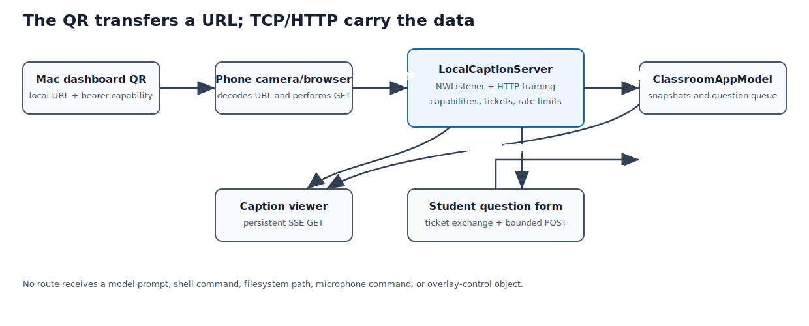

## Purpose and place in the application

The Mac acts as a local TCP server through Network.framework. It implements the deliberately small HTTP subset needed by two generated browser clients: a read-only SSE caption viewer and an anonymous question form.

The server receives immutable snapshots from the app model. It cannot control the microphone, models, overlay, or filesystem. The dashboard turns its capability URLs into QR images.


### Source reading order

The file starts with wire-visible value types and security constants. It then
defines queue-owned server state, listener lifecycle, incremental request
framing, routing, student tickets, rate limiting, SSE, HTTP response
construction, interface discovery, and finally the two complete browser pages.
The embedded HTML, CSS, and JavaScript are part of the protocol and are
therefore included, not summarized.

{#fig-network-request-flow width=96%}

TCP means Transmission Control Protocol. HTTP means Hypertext Transfer
Protocol. SSE means Server-Sent Events. URL means Uniform Resource Locator. QR
means Quick Response. `NWListener` and `NWConnection` are Network.framework
state machines; TCP itself does not preserve HTTP message boundaries.

::: {.callout-note title="Swift for a C programmer: Network.framework callbacks and value captures"}
Network.framework is asynchronous and callback-driven. `NWListener` accepts
connections; each `NWConnection` then reports state and delivers arbitrary byte
chunks. A receive callback is not guaranteed to contain one complete HTTP
request, so the server appends `Data` into per-connection buffers and parses
only after finding a complete header and the declared body length.

Closures capture surrounding values. Capturing a class reference strongly
increments its ARC ownership; `[weak self]` instead captures an
`Optional<Self>` that becomes `nil` after destruction. The common pattern
`guard let self else { return }` unwraps that weak reference and keeps a strong
local reference only for the duration of the callback.

The server's private serial `DispatchQueue` is its synchronization domain.
Network callbacks are explicitly delivered on that queue, so dictionaries,
rate-limit windows, tickets, and SSE clients need no separate lock. This is a
design invariant, not a property automatically supplied by `Dictionary`.
:::


## How to read this chapter

Combined source SHA-256: `44eca8709d029a7922e3529695b19fec378137f6b7c76ed1653277e8f91a812a`.

For each file, first read its hand-written role, ownership, invariants, and failure model. Source blocks retain original line numbers and syntax highlighting. Boundaries follow declarations where practical; a very large declaration is split only for pagination and is labeled as a continuation. The generator reconstructs every file from emitted blocks and compares every byte with the repository source. No prose claim is generated by counting calls or assignments with regular expressions.

## From Apple networking to the application protocol

This subsystem spans six layers. Keeping them distinct prevents ambiguous
statements such as “the QR connects to the app”:

| Layer | Concrete mechanism | What it contributes |
| --- | --- | --- |
| Link/network | Wi-Fi and IPv4 | packets between classroom devices |
| Transport | TCP | ordered reliable byte stream |
| Apple API | Network.framework | listener and connection state machines |
| Application framing | minimal HTTP/1.1 | requests, routes, headers, bodies |
| Streaming protocol | Server-Sent Events | long-lived Mac-to-browser updates |
| Pairing presentation | URL encoded as QR | transfers a bearer capability |

The QR does not open a special Apple channel. The Camera app decodes text,
recognizes an `http://` URL, and asks the browser to perform an ordinary HTTP
request to the Mac's private IPv4 address.

## Network.framework in detail

### `NWParameters`

`NWParameters.tcp` asks Network.framework for a reliable byte-stream transport.
The framework chooses and configures BSD sockets internally, monitors path
changes, and reports asynchronous state transitions.

`requiredInterfaceType = .wifi` rejects paths that are not classified as Wi-Fi.
`includePeerToPeer = true` permits Apple peer-to-peer-capable paths when the
system and entitlement context allow them. It does not guarantee Bluetooth
transport and it is not a replacement for both devices sharing a reachable
network. `allowLocalEndpointReuse` permits rebinding after a quick restart
instead of waiting for old TCP state to expire.

### `NWListener`

Creating `NWListener(using:on:)` binds the local port but does not synchronously
wait for readiness. `start(queue:)` schedules all listener callbacks on the
chosen serial queue. Relevant states are `setup`, optionally `waiting`, then
`ready`; terminal outcomes are `failed` or `cancelled`. These are asynchronous
listener states, not HTTP request states.

At `.ready`, the kernel is accepting connections. The application then chooses
an address to advertise. A listener may be ready even when no useful Wi-Fi IPv4
address exists; binding and address presentation are separate problems.

`newConnectionHandler` receives one `NWConnection` per accepted TCP connection.
The server caps these objects before starting them to bound memory and file
descriptors.

### `NWConnection`

An accepted connection has its own state machine. `start(queue:)` schedules
callbacks, `receive(minimumIncompleteLength:maximumLength:)` supplies arbitrary
byte chunks, and `send` queues bytes for transport.

TCP preserves byte order but not application message boundaries. One receive
may contain half a header, several headers, or a header plus part of a body.
That is why `receiveRequest` appends bytes and searches for HTTP delimiters
rather than assuming one callback equals one request.

The completion arguments matter:

- `content` contains bytes delivered in this callback;
- `isComplete` means the peer ended its sending side;
- `error` means transport failure;
- a nil/empty callback without completion is not a complete HTTP request.

## Address selection and Bonjour

The listener advertises `_classcaptions._tcp` through DNS (Domain Name System)
Service Discovery.
Bonjour combines multicast DNS name discovery (name lookup by local broadcast
rather than a central server) with service records. The current
browser flow does not resolve that service; it embeds a numeric IPv4 address in
the QR. Advertisement remains useful for diagnostics and a future native app.

`getifaddrs` returns a linked list of interfaces. The code accepts only entries
that are up, non-loopback, and `AF_INET`, asks `getnameinfo` for numeric text,
prefers `en0`, and retains a fallback. This is pragmatic rather than perfect:
modern Macs, VPNs (virtual private networks), USB adapters, and hotspot configurations can assign other
names. Network.framework knows the selected path, but converting that path into
the exact browser-reachable local address still requires care.

Private IPv4 addressing does not imply reachability. Classroom Wi-Fi may enable
client isolation (an access-point setting that blocks wireless devices from
reaching each other), firewalls may reject inbound traffic, or VPN routing may
divert packets. A personal hotspot is often more predictable.

## The implemented HTTP subset

This is not a general HTTP server. It accepts one request per ordinary
connection and supports only known generated clients.

### Framing algorithm

The receiver appends at most 2,048 bytes per callback into an accumulated
buffer. It rejects more than 8 KiB total. Once it finds the four bytes
`CR LF CR LF`, it knows the header terminator. It parses `Content-Length`,
rejects bodies above 2 KiB, and waits until:

```text
received byte count >= header end + Content-Length
```

Only then does routing begin. Ordinary responses contain `Connection: close`,
so keep-alive request pipelining and chunked transfer encoding are intentionally
outside the grammar.

### Request parsing and routing

The first line is split into method, request target, and HTTP version.
`URLComponents` parses path and query. Header names become lowercase because
HTTP field names are case-insensitive.

Authentication is performed before revealing protected route behavior. Wrong
credentials receive the same 404 used for unknown routes. The viewer capability
authorizes only `/` and `/events`. The student capability authorizes the form
and ticket endpoint, while a ticket authorizes one source's question POSTs.

## Server-Sent Events as a byte protocol

SSE is UTF-8 text over one HTTP response that remains open:

```http
HTTP/1.1 200 OK
Content-Type: text/event-stream; charset=utf-8
Connection: keep-alive

retry: 1000

event: captions
data: {"finalized":["..."],"provisional":"...","revision":42}

: heartbeat

```

Each event ends with an empty line. Multiple `data:` lines would be joined by
the browser with newline characters. A line beginning with `:` is a comment;
the JavaScript receives no application event, but traffic keeps intermediate
state active. `retry: 1000` asks `EventSource` (the browser's built-in SSE
client object) to reconnect after one second.

The server sends the latest snapshot immediately after stream establishment.
Otherwise a newly opened page would remain blank until the next spoken token.
The monotonic revision lets clients reason about freshness even though the
current page simply renders each received snapshot.

## Capabilities, tickets, and threat boundaries

Viewer and student URLs contain independent 256-bit random bearer tokens.
Possession is authorization; there is no account identity. Equal-length token
comparison XORs all bytes to avoid a first-difference timing signal.

A student page exchanges its long-lived page capability for an in-memory
ticket bound to the observed remote endpoint. Tickets expire and carry their
own submission history. Per-ticket, per-source, global, and absolute limits
address different abuse cases:

- one browser submitting too quickly;
- many tickets from one source;
- many sources flooding one class;
- unbounded dictionaries or professor queue growth.

These controls are availability defenses, not strong identity. NAT (Network
Address Translation, which lets many devices share one apparent address) can
merge students into one source, while address changes can invalidate a
legitimate ticket.

### Operational limits at a glance

Every hard limit lives in one auditable place (`CaptionSharingSecurity` and the
app model). Knowing them ahead of class avoids surprises mid-lecture:

| Limit | Value | What happens at the limit |
| --- | --- | --- |
| Concurrent TCP connections | 64 | further connections are cancelled at accept |
| Time to complete a request | 10 s | the connection is cancelled (a guard against "slowloris" attacks, which hold connections open by sending bytes very slowly) |
| Live caption streams | 1 | a newer authenticated viewer pre-empts the old stream |
| Live student tickets | 256 total, 4 per source, 4-hour lifetime | `503 classroom_full` / `429 ticket_limit` |
| Question gap per ticket | 10 s | `429` |
| Questions per source | 8 per 5 min | `429` |
| Questions globally | 30 per min | `429` |
| Accepted questions | 100 per sliding hour | `429` until the window clears |
| Pending questions held by the app | 500 | memory bound only; unreachable below a multi-hour unmoderated backlog |
| Request size / body size | 8 KiB / 2 KiB | `431` / `413` |

Three of these are deliberate recoveries rather than caps. A connection that
never completes a request cannot hold one of the 64 slots beyond the timeout,
because authentication only happens after a full request is parsed. The single
caption stream goes to the most recent holder of the viewer token, so the
professor reclaims a stuck or hijacked stream by simply reopening the page.
And the accepted-question limit is a sliding window, so an active class
recovers automatically instead of losing questions for the rest of the
session.

Plain HTTP provides no confidentiality or integrity against a hostile network.
The intended deployment is trusted classroom Wi-Fi or a personal hotspot.

## How a QR symbol is built

The application delegates encoding to Core Image:

```swift
let filter = CIFilter.qrCodeGenerator()
filter.message = Data(url.absoluteString.utf8)
filter.correctionLevel = "M"
```

Understanding the result still requires following the QR encoder.

### 1. Payload bytes and mode

The message is the UTF-8 byte sequence of the capability URL. Because lowercase
letters and URL punctuation do not fit QR alphanumeric mode efficiently, an
encoder normally selects byte mode. The bitstream begins with the four-bit byte
mode indicator `0100`, followed by a character-count field whose width depends
on QR version, then eight bits per payload byte.

### 2. Version and capacity

QR versions run from 1 to 40; a *module* is one black or white cell of the
printed grid. Version `v` has:

```text
module width = 21 + 4 * (v - 1)
```

The encoder selects the smallest version whose data-codeword capacity (a
codeword is one 8-bit unit of the symbol's payload) can hold
mode, count, payload, terminator, and byte alignment at error-correction level
M. A longer IP address, route, or token can therefore increase module density.

### 3. Terminator, alignment, and pad codewords

Up to four zero bits terminate the logical message. Zero bits then align to the
next byte boundary. Remaining data capacity is filled by alternating codewords
`0xEC` and `0x11`. These bytes are specified padding, not part of the URL.

### 4. Reed-Solomon correction over `GF(256)`

Data codewords are divided into blocks according to version and correction
level. Each byte is treated as an element of the finite field `GF(2^8)`.
Addition is XOR. Multiplication uses polynomial arithmetic modulo the QR
primitive polynomial:

```text
x^8 + x^4 + x^3 + x^2 + 1
```

For a block requiring `r` parity codewords, the data polynomial is multiplied
by `x^r` and divided by a degree-`r` generator polynomial. The remainder is the
parity sequence. A scanner uses the resulting syndromes (check values computed
from the received codewords) to locate and correct
codeword errors.

“Level M corrects about 15%” is only a rule of thumb. Correctability depends on
which codewords are damaged and on interleaving, not simply on the percentage
of black/white modules obscured.

### 5. Interleaving

QR interleaves the first codeword from each data block, then the second from
each, and so on; parity blocks are interleaved similarly. Spatial damage then
affects several blocks moderately instead of destroying one contiguous block.

### 6. Reserved patterns

Before payload placement, the grid reserves:

- three 7x7 finder patterns plus white separators;
- horizontal and vertical alternating timing patterns;
- alignment patterns for versions above 1;
- format-information areas;
- version-information areas for versions 7 and above;
- one fixed dark module.

These patterns let a camera locate, rotate, scale, sample, and characterize the
symbol before decoding data.

### 7. Zigzag data placement

Interleaved bits are placed from the lower-right in vertical pairs of columns.
The direction alternates upward and downward. Placement skips every reserved
module and skips the vertical timing column. Remaining unused capacity receives
specified remainder bits.

### 8. Mask selection

Large uniform regions and finder-like accidental patterns are difficult for
cameras. QR defines eight masks. A mask condition flips only data/error
correction modules; fixed patterns remain unchanged.

Each candidate receives penalties for:

1. long runs of equal color;
2. 2x2 same-color blocks;
3. finder-like `1:1:3:1:1` patterns with surrounding light modules;
4. dark-module proportion far from 50%.

The lowest-penalty mask is retained.

### 9. Format and version information

Format bits encode the correction level and mask number, protected by a BCH
(Bose–Chaudhuri–Hocquenghem) error-correcting code and XOR mask. They are written twice near finder patterns. Versions 7 and
above also write BCH-protected version bits in two locations.

### 10. Rasterization and quiet zone

Core Image returns a logical one-pixel-per-module image. The app applies an
integer scale and disables interpolation so every module remains a sharp
rectangle. A clear light quiet zone of four modules around the symbol is
essential for finder detection.

The QR is only a visual transport for the URL. It does not encrypt that URL,
authenticate the scanner, or remain valid after the server rotates its token.

## End-to-end pairing sequence

@fig-network-request-flow shows the complete transport sequence. The
camera transfers URL text. The browser then creates ordinary TCP/HTTP
connections; `EventSource` owns the persistent caption stream, while the
student route exchanges its page capability for a source-bound ticket before
submitting questions.

The complete server source below implements every step after QR decoding. The
QR rendering helper itself appears in the dashboard chapter because it belongs
to presentation, but its exact code is quoted above and included in full there.


## `Sources/ClassroomCaptions/LocalCaptionServer.swift`

**Role.** One serial queue owns listener, connections, credentials, tickets, rate windows, snapshot, and heartbeat. Public methods enqueue work; every Network.framework callback is delivered back onto the same queue.

One serial queue owns listener, accepted connections, capability tokens,
student tickets, rate windows, current snapshot, and heartbeat scheduling.
Network.framework callbacks are delivered onto that queue, making the mutable
server state single-owner despite the class's `@unchecked Sendable` boundary.

TCP is a byte stream, so request framing accumulates arbitrary receive chunks
until the HTTP header terminator and declared body length are present. The
server implements only its generated clients' HTTP subset. Viewer and student
capabilities are independent; student POSTs additionally require short-lived,
source-bound tickets and pass several bounded rate limits.

SSE connections remain open and receive an immediate snapshot plus later
revisioned updates and heartbeat comments. Browser input never reaches Gemma or
application control APIs.

Length: 1114 lines. SHA-256: `44eca8709d029a7922e3529695b19fec378137f6b7c76ed1653277e8f91a812a`.

### Declaration map {.unnumbered .unlisted}

This map gives the reading spine of the file. Line numbers refer to the original source and to the numbered listings below.

::: {.declaration-map}
- **Line 6:** `struct RemoteCaptionSnapshot: Codable, Equatable, Sendable {`
- **Line 13:** `struct SubmittedClassroomQuestion: Equatable, Sendable {`
- **Line 19:** `enum LocalCaptionServerStatus: Equatable, Sendable {`
- **Line 27:** `enum StudentQuestionServerStatus: Equatable, Sendable {`
- **Line 33:** `enum CaptionSharingSecurity {`
- **Line 50:** `static func makeToken() throws -> String {`
- **Line 59:** `static func tokensMatch(_ candidate: String, _ expected: String) -> Bool {`
- **Line 70:** `static func normalizedQuestion(_ text: String) -> String? {`
- **Line 86:** `final class LocalCaptionServer: @unchecked Sendable {`
- **Line 112:** `private struct StudentTicket {`
- **Line 125:** `init( statusHandler: @escaping @Sendable (LocalCaptionServerStatus) -> Void, questionStatusHandler: @escaping @Sendable ( StudentQuestionServerStatus ) -> Void = { _ in }, questionHandler: @escaping @Sendable ( SubmittedClassroomQuestion ) -> Void = { _ in }, port: NWEndpoint.Port = defaultPort ) {`
- **Line 141:** `func start() {`
- **Line 147:** `func stop() {`
- **Line 153:** `func publish(_ snapshot: RemoteCaptionSnapshot) {`
- **Line 161:** `func setQuestionSubmissionsEnabled(_ enabled: Bool) {`
- **Line 167:** `private func startOnQueue() {`
- **Line 196:** `private func stopOnQueue(reportStatus: Bool) {`
- **Line 220:** `private func handleListenerState(_ state: NWListener.State) {`
- **Line 246:** `private func accept(_ connection: NWConnection) {`
- **Line 286:** `private func receiveRequest( on connection: NWConnection, sourceID: String, accumulated: Data ) {`
- **Line 376:** `private func handleRequest( _ data: Data, sourceID: String, on connection: NWConnection ) {`
- **Line 457:** `private func setQuestionSubmissionsEnabledOnQueue(_ enabled: Bool) {`
- **Line 487:** `private func updateStudentQuestionURL(host: String?) {`
- **Line 499:** `private func handleStudentRequest( method: String, components: URLComponents, headers: [String: String], body: Data, sourceID: String, on connection: NWConnection ) -> Bool {`
- **Line 570:** `private func issueStudentTicket( sourceID: String, on connection: NWConnection ) {`
- **Line 627:** `private func submitQuestion( body: Data, ticket: String, sourceID: String, on connection: NWConnection ) {`
- **Line 718:** `private func respondNotFound(on connection: NWConnection) {`
- **Line 727:** `private func beginEventStream(on connection: NWConnection) {`
- **Line 768:** `private func startHeartbeat() {`
- **Line 787:** `private func removeStreamConnection(_ connection: NWConnection) {`
- **Line 797:** `private func send( _ snapshot: RemoteCaptionSnapshot, to connection: NWConnection? ) {`
- **Line 817:** `private func respond( status: String, body: String, contentType: String, on connection: NWConnection ) {`
- **Line 853:** `private static func contentLength(in headerText: String) -> Int {`
- **Line 858:** `private static func headers(in headerText: String) -> [String: String] {`
- **Line 873:** `private static func queryValue( _ name: String, in components: URLComponents ) -> String? {`
- **Line 882:** `private static func sourceID(for endpoint: NWEndpoint) -> String {`
- **Line 889:** `private static func wifiIPv4Address() -> String? {`
- **Line 935:** `private static func studentQuestionPage(token: String) -> String {`
- **Line 1044:** `private static func browserPage(token: String) -> String {`
:::

### Imports and file preamble {.unnumbered .unlisted}

The file begins by importing `Darwin`, `Foundation`, `Network`, `Security`. These imports establish the APIs visible to the declarations below; they execute no application workflow by themselves.

The four imports are the file's complete dependency list: `Darwin` exposes the
C system library (later used for `getifaddrs` interface walking), `Foundation`
supplies the value types `Data`, `Date`, and `URL` plus the JSON coders,
`Network` provides the `NWListener` and `NWConnection` state machines the whole
server is built on, and `Security` contributes `SecRandomCopyBytes` for minting
random tokens.

```{.swift .numberLines startFrom="1"}
import Darwin
import Foundation
import Network
import Security

```

### `struct RemoteCaptionSnapshot: Codable, Equatable, Sendable`

The wire payload pushed to the phone over the Server-Sent Events stream (the
long-lived one-way HTTP response described in the chapter intro): the finalized
caption lines, an optional still-changing provisional line, whether a capture
session is live, and a revision number that only rises. The names after the
colon are compiler-generated abilities: `Codable` derives JSON encoding and
decoding from the field list, `Equatable` supplies `==` for value comparison (used by
the tests; the publisher itself sends every snapshot unconditionally), and `Sendable` marks the immutable value
safe to hand between threads. Encoding it with `JSONEncoder` is the entire
serialization contract — there is no separate schema.

```{.swift .numberLines startFrom="6"}
struct RemoteCaptionSnapshot: Codable, Equatable, Sendable {
    let finalized: [String]
    let provisional: String?
    let sessionActive: Bool
    let revision: UInt64
}

```

### `struct SubmittedClassroomQuestion: Equatable, Sendable`

The value handed to the app when a student question clears all validation and
rate limits: a fresh UUID, the normalized text, and the acceptance timestamp. It
carries no source identifier or ticket, so nothing that could deanonymize the
asker leaves the server boundary.

```{.swift .numberLines startFrom="13"}
struct SubmittedClassroomQuestion: Equatable, Sendable {
    let id: UUID
    let text: String
    let submittedAt: Date
}

```

### `enum LocalCaptionServerStatus: Equatable, Sendable`

The dashboard-facing lifecycle of caption sharing. A Swift enum case can carry
a payload (like a C tagged union), and here the `URL` payloads exist only on
the states reached after the listener is ready — the type itself makes "show a
pairing QR before an address exists" unrepresentable. `failed` carries
presentation text rather than a Network.framework error object, and because the
whole value is immutable and `Sendable`, it can leave the server queue without
exposing mutable listener state.

```{.swift .numberLines startFrom="19"}
enum LocalCaptionServerStatus: Equatable, Sendable {
    case stopped
    case starting
    case ready(url: URL)
    case clientConnected(url: URL)
    case failed(String)
}

```

### `enum StudentQuestionServerStatus: Equatable, Sendable`

Question intake has its own lifecycle because the professor can disable it
while the caption viewer stays live. Its ready URL embeds the independent
student capability (a capability is a secret token whose mere possession grants
access — here, access to the question form only), never the viewer token, so
the type separation mirrors the security separation: leaking one URL never
grants the other URL's powers.

```{.swift .numberLines startFrom="27"}
enum StudentQuestionServerStatus: Equatable, Sendable {
    case stopped
    case ready(url: URL)
    case failed(String)
}

```

### `enum CaptionSharingSecurity`

A Swift enum with no cases cannot be instantiated, which makes it a pure
namespace — a header of tunable security constants kept in one auditable place.
It holds the 32-byte token size, an 8 KiB request cap, a 2 KiB / 500-character
question cap, 256 concurrent tickets (at most 4 per source) with a 4-hour life,
the layered rate-limit windows (10 s between questions per ticket, 8 per source
per 5 minutes, 30 globally per minute, 100 accepted per sliding hour), and a
10 s request-completion timeout. That timeout defeats the slowloris attack, in
which a client opens connections and feeds bytes one at a time, never finishing
a request, until every one of the 64 connection slots is occupied.

```{.swift .numberLines startFrom="33"}
enum CaptionSharingSecurity {
    static let tokenByteCount = 32
    static let maximumRequestBytes = 8 * 1_024
    static let maximumQuestionBytes = 2 * 1_024
    static let maximumQuestionCharacters = 500
    static let maximumTickets = 256
    static let maximumTicketsPerSource = 4
    static let ticketLifetime: TimeInterval = 4 * 60 * 60
    static let minimumQuestionInterval: TimeInterval = 10
    static let perSourceWindow: TimeInterval = 5 * 60
    static let perSourceQuestionLimit = 8
    static let globalWindow: TimeInterval = 60
    static let globalQuestionLimit = 30
    static let acceptedQuestionWindow: TimeInterval = 60 * 60
    static let acceptedQuestionLimit = 100
    static let requestTimeout: TimeInterval = 10

```

### `static func makeToken() throws -> String`

Mints a 256-bit secret: it draws `tokenByteCount` random bytes from the system
CSPRNG (a cryptographically secure random generator whose output cannot be
predicted from earlier output) via `SecRandomCopyBytes`, then hex-encodes them
with `%02x` formatting. The attack this defeats is guessing: an attacker on the
classroom Wi-Fi who knows the URL shape still faces 2^256 equally likely
tokens, so brute-forcing the viewer, student, or ticket credential is hopeless.
If the random draw fails the function throws (raises a Swift error) instead of
falling back to a weaker source, so a caller can never proceed with a
predictable token.

```{.swift .numberLines startFrom="50"}
    static func makeToken() throws -> String {
        var bytes = [UInt8](repeating: 0, count: tokenByteCount)
        guard SecRandomCopyBytes(kSecRandomDefault, bytes.count, &bytes)
                == errSecSuccess else {
            throw CocoaError(.fileWriteUnknown)
        }
        return bytes.map { String(format: "%02x", $0) }.joined()
    }

```

### `static func tokensMatch(_ candidate: String, _ expected: String) -> Bool`

Compares a presented token with the expected one without leaking timing
information. A naive `strcmp`-style comparison returns at the first differing
byte, so an attacker timing responses could learn how many leading characters
were correct and recover the token one byte at a time, like feeling a lock's
pins. This version UTF-8-encodes both strings, rejects immediately on a length
mismatch (lengths are public anyway), then XORs every byte pair and ORs the
results into one accumulator that is zero only when all bytes match — the loop
always runs to the end, so every wrong guess takes the same time.

```{.swift .numberLines startFrom="59"}
    static func tokensMatch(_ candidate: String, _ expected: String) -> Bool {
        let left = Array(candidate.utf8)
        let right = Array(expected.utf8)
        guard left.count == right.count else { return false }
        var difference: UInt8 = 0
        for index in left.indices {
            difference |= left[index] ^ right[index]
        }
        return difference == 0
    }

```

### `static func normalizedQuestion(_ text: String) -> String?`

Sanitizes untrusted student text before anyone sees it: split on whitespace and
newlines, drop the empty pieces, and rejoin with single spaces, then reject the
result if it is empty, longer than `maximumQuestionCharacters`, or contains any
Unicode control character (invisible codes such as escape or backspace that can
corrupt terminal output or spoof what a reader sees). Returning `nil` tells the
caller to answer `422 Unprocessable Content` — HTTP's numeric verdict for
"well-formed request, unacceptable content" — so control bytes and oversized
input never reach the professor's moderation queue or the model.

```{.swift .numberLines startFrom="70"}
    static func normalizedQuestion(_ text: String) -> String? {
        let collapsed = text
            .components(separatedBy: .whitespacesAndNewlines)
            .filter { !$0.isEmpty }
            .joined(separator: " ")
        guard !collapsed.isEmpty,
              collapsed.count <= maximumQuestionCharacters,
              !collapsed.unicodeScalars.contains(where: {
                  CharacterSet.controlCharacters.contains($0)
              }) else {
            return nil
        }
        return collapsed
    }
}

```

### `final class LocalCaptionServer: @unchecked Sendable`

Owns the complete local-server state machine. `@unchecked Sendable` is a promise
the compiler cannot verify; safety comes from confining every mutable field and
Network.framework callback to the private serial queue. Public methods transfer
commands or immutable values onto that queue instead of touching state directly.

```{.swift .numberLines startFrom="86"}
final class LocalCaptionServer: @unchecked Sendable {
    private static let defaultPort: NWEndpoint.Port = 8_765
    private static let serviceType = "_classcaptions._tcp"

    private let queue = DispatchQueue(
        label: "ClassroomCaptions.local-caption-server",
        qos: .userInitiated
    )
    private let statusHandler: @Sendable (LocalCaptionServerStatus) -> Void
    private let questionStatusHandler:
        @Sendable (StudentQuestionServerStatus) -> Void
    private let questionHandler:
        @Sendable (SubmittedClassroomQuestion) -> Void
    private let port: NWEndpoint.Port
    private var listener: NWListener?
    private var streamConnection: NWConnection?
    private var heartbeatTimer: DispatchSourceTimer?
    private var activeConnectionIDs: Set<ObjectIdentifier> = []
    private var connectionsAwaitingRequest: Set<ObjectIdentifier> = []
    private var token = ""
    private var studentToken = ""
    private var pairingURL: URL?
    private var studentURL: URL?
    private var lastSnapshot: RemoteCaptionSnapshot?
    private var questionsEnabled = false

```

### `private struct StudentTicket`

The queue-confined record behind one issued ticket: the source the Mac observed
when issuing it, an absolute expiry, and that ticket's own accepted-submission
times. Tickets are never persisted or forwarded to the application model, so
nothing here can deanonymize a student after class. The same block declares the
ledgers the `CaptionSharingSecurity` limits are enforced against — per-ticket
dates live inside each ticket, while per-source, global, and accepted-question
dates are separate queue-owned tables — plus one `JSONEncoder` reused across
snapshot publishes.

```{.swift .numberLines startFrom="112"}
    private struct StudentTicket {
        let sourceID: String
        let expiresAt: Date
        var submissionDates: [Date]
    }

    /// Reused across publishes; only touched on the server queue.
    private let snapshotEncoder = JSONEncoder()
    private var studentTickets: [String: StudentTicket] = [:]
    private var sourceSubmissionDates: [String: [Date]] = [:]
    private var globalSubmissionDates: [Date] = []
    private var acceptedQuestionDates: [Date] = []

```

### `init(…)`

Injects three escaping `@Sendable` callbacks and the listening port. `@escaping`
means the server retains each closure after initialization; `@Sendable` makes
its captures part of Swift's concurrency checking. Default no-op question
callbacks keep caption-only construction free of optional closure branches.

```{.swift .numberLines startFrom="125"}
    init(
        statusHandler: @escaping @Sendable (LocalCaptionServerStatus) -> Void,
        questionStatusHandler: @escaping @Sendable (
            StudentQuestionServerStatus
        ) -> Void = { _ in },
        questionHandler: @escaping @Sendable (
            SubmittedClassroomQuestion
        ) -> Void = { _ in },
        port: NWEndpoint.Port = defaultPort
    ) {
        self.statusHandler = statusHandler
        self.questionStatusHandler = questionStatusHandler
        self.questionHandler = questionHandler
        self.port = port
    }

```

### `func start()`

The public entry point only hops onto the server's serial queue: `queue.async`
submits a closure (a function value capturing `self` weakly, so a destroyed
server is silently skipped) to run later on that queue, where `startOnQueue`
does the real work — generating a fresh viewer capability (the student capability is minted separately when questions are enabled), creating
Wi-Fi-constrained TCP parameters, installing listener callbacks on the server
queue, and publishing URLs only after listener readiness and local-address
selection. The hop is what makes the no-locks design sound: mutable state is
touched only from the queue.

```{.swift .numberLines startFrom="141"}
    func start() {
        queue.async { [weak self] in
            self?.startOnQueue()
        }
    }

```

### `func stop()`

Schedules teardown on the owner queue. The call returns before cancellation
necessarily completes, but ordering with prior publishes and later starts is
deterministic because every operation enters the same serial queue.

```{.swift .numberLines startFrom="147"}
    func stop() {
        queue.async { [weak self] in
            self?.stopOnQueue(reportStatus: true)
        }
    }

```

### `func publish(_ snapshot: RemoteCaptionSnapshot)`

Called by the app model for every new caption snapshot. On the server queue it
first records the value in `lastSnapshot` — the stored copy `beginEventStream`
replays so a phone that connects late is not blank — and then sends it to the
single live SSE stream, if one exists. SSE framing JSON-encodes the immutable
snapshot, prefixes the protocol's `event:` and `data:` fields, and ends the
event with a blank line; slow or failed connections are removed by the queue
owner rather than blocking the app model.

```{.swift .numberLines startFrom="153"}
    func publish(_ snapshot: RemoteCaptionSnapshot) {
        queue.async { [weak self] in
            guard let self else { return }
            self.lastSnapshot = snapshot
            self.send(snapshot, to: self.streamConnection)
        }
    }

```

### `func setQuestionSubmissionsEnabled(_ enabled: Bool)`

Transfers one Boolean command from whatever thread the app model calls on
(typically the main UI thread) to the queue-owned implementation. Because the
flag flip, credential rotation, and ticket clearing all execute on the serial
queue, they cannot race an incoming question request being handled on that same
queue.

```{.swift .numberLines startFrom="161"}
    func setQuestionSubmissionsEnabled(_ enabled: Bool) {
        queue.async { [weak self] in
            self?.setQuestionSubmissionsEnabledOnQueue(enabled)
        }
    }

```

### `private func startOnQueue()`

Performs restart as one queue transaction: discard old state, report starting,
mint a viewer capability, configure Wi-Fi TCP and Bonjour, install callbacks,
and start the listener. It does not publish a URL yet because neither listener
readiness nor an advertisable local address has been established.

```{.swift .numberLines startFrom="167"}
    private func startOnQueue() {
        stopOnQueue(reportStatus: false)
        statusHandler(.starting)

        do {
            token = try CaptionSharingSecurity.makeToken()
            let parameters = NWParameters.tcp
            parameters.requiredInterfaceType = .wifi
            parameters.includePeerToPeer = true
            parameters.allowLocalEndpointReuse = true

            let listener = try NWListener(using: parameters, on: port)
            listener.service = NWListener.Service(
                name: "Classroom Captions",
                type: Self.serviceType
            )
            listener.newConnectionHandler = { [weak self] connection in
                self?.accept(connection)
            }
            listener.stateUpdateHandler = { [weak self] state in
                self?.handleListenerState(state)
            }
            self.listener = listener
            listener.start(queue: queue)
        } catch {
            statusHandler(.failed(error.localizedDescription))
        }
    }

```

### `private func stopOnQueue(reportStatus: Bool)`

Cancels heartbeat, stream, ordinary connections, and listener before clearing
their state. Both capabilities and every ticket/rate window are destroyed, so a
QR photographed before stop cannot authorize the next server run.

```{.swift .numberLines startFrom="196"}
    private func stopOnQueue(reportStatus: Bool) {
        heartbeatTimer?.cancel()
        heartbeatTimer = nil
        streamConnection?.cancel()
        streamConnection = nil
        activeConnectionIDs.removeAll()
        connectionsAwaitingRequest.removeAll()
        listener?.cancel()
        listener = nil
        pairingURL = nil
        studentURL = nil
        token = ""
        studentToken = ""
        questionsEnabled = false
        studentTickets.removeAll()
        sourceSubmissionDates.removeAll()
        globalSubmissionDates.removeAll()
        acceptedQuestionDates.removeAll()
        questionStatusHandler(.stopped)
        if reportStatus {
            statusHandler(.stopped)
        }
    }

```

### `private func handleListenerState(_ state: NWListener.State)`

Turns Network.framework states into application states. On `.ready` it chooses
a Wi-Fi IPv4 address and constructs the capability URL; on `.failed` it reports
the error and tears down. Binding success and finding a browser-reachable
address are deliberately treated as separate conditions.

```{.swift .numberLines startFrom="220"}
    private func handleListenerState(_ state: NWListener.State) {
        switch state {
        case .ready:
            guard let host = Self.wifiIPv4Address(),
                  let url = URL(
                      string: "http://\(host):\(port)/?token=\(token)"
                  ) else {
                statusHandler(.failed(
                    "No active Wi-Fi IPv4 address was found. Connect the Mac to Wi-Fi or an iPhone hotspot."
                ))
                stopOnQueue(reportStatus: false)
                return
            }
            pairingURL = url
            statusHandler(.ready(url: url))
            updateStudentQuestionURL(host: host)
        case .failed(let error):
            statusHandler(.failed(error.localizedDescription))
            stopOnQueue(reportStatus: false)
        case .cancelled:
            break
        default:
            break
        }
    }

```

### `private func accept(_ connection: NWConnection)`

Admits a new TCP connection, enforcing a hard ceiling of 64 concurrent
connections by cancelling anything beyond it to blunt connection-flood abuse. It
records the connection, derives a stable source ID from the peer endpoint for
per-source rate limiting, wires a state handler that prunes tracking on
failure/cancel, and starts the incremental request read.

```{.swift .numberLines startFrom="246"}
    private func accept(_ connection: NWConnection) {
        guard activeConnectionIDs.count < 64 else {
            connection.cancel()
            return
        }
        let identifier = ObjectIdentifier(connection)
        activeConnectionIDs.insert(identifier)
        connectionsAwaitingRequest.insert(identifier)
        let sourceID = Self.sourceID(for: connection.endpoint)
        connection.stateUpdateHandler = { [weak self, weak connection] state in
            guard let self, let connection else { return }
            if case .failed = state {
                self.activeConnectionIDs.remove(ObjectIdentifier(connection))
                self.connectionsAwaitingRequest.remove(ObjectIdentifier(connection))
                self.removeStreamConnection(connection)
            } else if case .cancelled = state {
                self.activeConnectionIDs.remove(ObjectIdentifier(connection))
                self.connectionsAwaitingRequest.remove(ObjectIdentifier(connection))
                self.removeStreamConnection(connection)
            }
        }
        connection.start(queue: queue)
        // Authentication happens only after a complete request is parsed, so a
        // connection that never completes one must not hold a slot: cancel it
        // if no full request has arrived within the timeout (slowloris guard).
        queue.asyncAfter(
            deadline: .now() + CaptionSharingSecurity.requestTimeout
        ) { [weak self, weak connection] in
            guard let self, let connection else { return }
            if self.connectionsAwaitingRequest.contains(ObjectIdentifier(connection)) {
                connection.cancel()
            }
        }
        receiveRequest(
            on: connection,
            sourceID: sourceID,
            accumulated: Data()
        )
    }

```

### `private func receiveRequest(…)`

The framing loop that turns TCP's raw byte stream into one whole HTTP request.
TCP guarantees byte order but knows nothing about message boundaries, so a
single receive callback may deliver half a header, a header plus part of a
body, or several lines at once; the function therefore appends each chunk (at
most 2,048 bytes per callback) to the `accumulated` buffer and re-arms itself
until enough has arrived. "Enough" means the four-byte header terminator
`CR LF CR LF` has appeared and the buffer holds at least the header plus the
body length declared by `Content-Length`. Every exit is bounded — more than
8 KiB total earns `431`, a declared body over 2 KiB earns `413`, a peer that
closes early earns `400` — so a hostile client cannot grow the buffer without
limit, and only a complete request ever reaches the router.

```{.swift .numberLines startFrom="286"}
    private func receiveRequest(
        on connection: NWConnection,
        sourceID: String,
        accumulated: Data
    ) {
        connection.receive(
            minimumIncompleteLength: 1,
            maximumLength: 2_048
        ) { [weak self, weak connection] data, _, isComplete, error in
            guard let self, let connection else { return }
            if error != nil {
                connection.cancel()
                return
            }

            var request = accumulated
            if let data {
                request.append(data)
            }
            guard request.count <= CaptionSharingSecurity.maximumRequestBytes else {
                self.respond(
                    status: "431 Request Header Fields Too Large",
                    body: "Request too large.",
                    contentType: "text/plain; charset=utf-8",
                    on: connection
                )
                return
            }

            if let headerRange = request.range(of: Data("\r\n\r\n".utf8)) {
                guard let headerText = String(
                    data: request[..<headerRange.lowerBound],
                    encoding: .utf8
                ) else {
                    self.respond(
                        status: "400 Bad Request",
                        body: "Invalid request.",
                        contentType: "text/plain; charset=utf-8",
                        on: connection
                    )
                    return
                }
                let contentLength = Self.contentLength(in: headerText)
                guard contentLength <= CaptionSharingSecurity.maximumQuestionBytes else {
                    self.respond(
                        status: "413 Content Too Large",
                        body: "Question is too large.",
                        contentType: "text/plain; charset=utf-8",
                        on: connection
                    )
                    return
                }
                let expectedCount = headerRange.upperBound + contentLength
                if request.count >= expectedCount {
                    self.handleRequest(
                        Data(request.prefix(expectedCount)),
                        sourceID: sourceID,
                        on: connection
                    )
                } else if isComplete {
                    self.respond(
                        status: "400 Bad Request",
                        body: "Incomplete request.",
                        contentType: "text/plain; charset=utf-8",
                        on: connection
                    )
                } else {
                    self.receiveRequest(
                        on: connection,
                        sourceID: sourceID,
                        accumulated: request
                    )
                }
            } else if isComplete {
                self.respond(
                    status: "400 Bad Request",
                    body: "Incomplete request.",
                    contentType: "text/plain; charset=utf-8",
                    on: connection
                )
            } else {
                self.receiveRequest(
                    on: connection,
                    sourceID: sourceID,
                    accumulated: request
                )
            }
        }
    }

```

### `private func handleRequest(…)`

The router. It splits the HTTP request line — the message's first line, such as
`GET /events?token=abc HTTP/1.1`, holding method, target, and protocol
version — into three parts, parses the target's path and query with
`URLComponents`, lowercases the header names, and slices off the body. Student
routes get first claim; everything else must be a `GET` whose `token` query
value passes `tokensMatch` against the viewer capability before the path is
even examined. Wrong credentials and unknown routes deliberately receive the
same `404 Not Found`, denying a probing attacker the oracle that would separate
"route exists but my token is wrong" from "no such route". The viewer token
unlocks only the caption page and `/events`; it can never submit questions,
just as student credentials can never read captions.

```{.swift .numberLines startFrom="376"}
    private func handleRequest(
        _ data: Data,
        sourceID: String,
        on connection: NWConnection
    ) {
        connectionsAwaitingRequest.remove(ObjectIdentifier(connection))
        guard let headerRange = data.range(of: Data("\r\n\r\n".utf8)),
              let headerText = String(
                  data: data[..<headerRange.lowerBound],
                  encoding: .utf8
              ),
              let firstLine = headerText.components(
                  separatedBy: "\r\n"
              ).first else {
            respond(
                status: "400 Bad Request",
                body: "Invalid request.",
                contentType: "text/plain; charset=utf-8",
                on: connection
            )
            return
        }

        let parts = firstLine.split(separator: " ", maxSplits: 2)
        guard parts.count == 3,
              let components = URLComponents(string: String(parts[1])) else {
            respond(
                status: "400 Bad Request",
                body: "Invalid request.",
                contentType: "text/plain; charset=utf-8",
                on: connection
            )
            return
        }
        let method = String(parts[0])
        let headers = Self.headers(in: headerText)
        let body = Data(data[headerRange.upperBound...])

        if handleStudentRequest(
            method: method,
            components: components,
            headers: headers,
            body: body,
            sourceID: sourceID,
            on: connection
        ) {
            return
        }

        guard method == "GET",
              let candidate = Self.queryValue("token", in: components),
              CaptionSharingSecurity.tokensMatch(candidate, token) else {
            respond(
                status: "404 Not Found",
                body: "Not found.",
                contentType: "text/plain; charset=utf-8",
                on: connection
            )
            return
        }

        switch components.path {
        case "", "/":
            respond(
                status: "200 OK",
                body: Self.browserPage(token: token),
                contentType: "text/html; charset=utf-8",
                on: connection
            )
        case "/events":
            beginEventStream(on: connection)
        default:
            respond(
                status: "404 Not Found",
                body: "Not found.",
                contentType: "text/plain; charset=utf-8",
                on: connection
            )
        }
    }

```

### `private func setQuestionSubmissionsEnabledOnQueue(_ enabled: Bool)`

Enabling questions mints a fresh student capability and clears every previous
ticket and rate window; disabling destroys the same state. The helper publishes
a URL only when the caption server has already discovered a host, so it cannot
advertise a half-constructed capability.

```{.swift .numberLines startFrom="457"}
    private func setQuestionSubmissionsEnabledOnQueue(_ enabled: Bool) {
        guard listener != nil, let pairingURL else {
            questionsEnabled = false
            questionStatusHandler(.failed(
                "Start iPhone sharing before enabling student questions."
            ))
            return
        }

        questionsEnabled = enabled
        studentTickets.removeAll()
        sourceSubmissionDates.removeAll()
        globalSubmissionDates.removeAll()
        acceptedQuestionDates.removeAll()
        guard enabled else {
            studentToken = ""
            studentURL = nil
            questionStatusHandler(.stopped)
            return
        }

        do {
            studentToken = try CaptionSharingSecurity.makeToken()
            updateStudentQuestionURL(host: pairingURL.host)
        } catch {
            questionsEnabled = false
            questionStatusHandler(.failed(error.localizedDescription))
        }
    }

```

### `private func updateStudentQuestionURL(host: String?)`

Projects queue-owned host, enablement, and token state into a dashboard status.
Keeping URL construction here prevents callers from combining a current host
with a stale student token after restart or disablement.

```{.swift .numberLines startFrom="487"}
    private func updateStudentQuestionURL(host: String?) {
        guard questionsEnabled, !studentToken.isEmpty,
              let host,
              let url = URL(
                  string: "http://\(host):\(port)/student?token=\(studentToken)"
              ) else {
            return
        }
        studentURL = url
        questionStatusHandler(.ready(url: url))
    }

```

### `private func handleStudentRequest(…)`

The student-feature router, returning true once it owns a request so the caption
path is bypassed. It claims only /student, /student-ticket, and /questions; if
the feature is disabled it 404s to hide its existence. GET /student and POST
/student-ticket each require a tokensMatch against the student token; POST
/questions additionally demands a JSON content-type and a ticket query item.

```{.swift .numberLines startFrom="499"}
    private func handleStudentRequest(
        method: String,
        components: URLComponents,
        headers: [String: String],
        body: Data,
        sourceID: String,
        on connection: NWConnection
    ) -> Bool {
        guard components.path == "/student"
                || components.path == "/student-ticket"
                || components.path == "/questions" else {
            return false
        }
        guard questionsEnabled else {
            respond(
                status: "404 Not Found",
                body: "Not found.",
                contentType: "text/plain; charset=utf-8",
                on: connection
            )
            return true
        }

        switch (method, components.path) {
        case ("GET", "/student"):
            guard let candidate = Self.queryValue("token", in: components),
                  CaptionSharingSecurity.tokensMatch(candidate, studentToken) else {
                respondNotFound(on: connection)
                return true
            }
            respond(
                status: "200 OK",
                body: Self.studentQuestionPage(token: studentToken),
                contentType: "text/html; charset=utf-8",
                on: connection
            )

        case ("POST", "/student-ticket"):
            guard let candidate = Self.queryValue("token", in: components),
                  CaptionSharingSecurity.tokensMatch(candidate, studentToken) else {
                respondNotFound(on: connection)
                return true
            }
            issueStudentTicket(sourceID: sourceID, on: connection)

        case ("POST", "/questions"):
            guard headers["content-type"]?
                .lowercased()
                .hasPrefix("application/json") == true,
                  let ticket = Self.queryValue("ticket", in: components) else {
                respond(
                    status: "415 Unsupported Media Type",
                    body: #"{"error":"invalid_request"}"#,
                    contentType: "application/json; charset=utf-8",
                    on: connection
                )
                return true
            }
            submitQuestion(
                body: body,
                ticket: ticket,
                sourceID: sourceID,
                on: connection
            )

        default:
            respondNotFound(on: connection)
        }
        return true
    }

```

### `private func issueStudentTicket(…)`

Issues one rate-limit ticket per request: it first sweeps expired tickets,
refuses with 503 once maximumTickets live tickets exist, and refuses with 429
once one source already holds maximumTicketsPerSource live tickets — so a
single device looping the route cannot exhaust the table for the class. A
fresh makeToken value keys a StudentTicket recording the source ID, a
now+ticketLifetime expiry, and an empty submission history. A failed token
draw degrades to 503 rather than issuing a weak ticket.

```{.swift .numberLines startFrom="570"}
    private func issueStudentTicket(
        sourceID: String,
        on connection: NWConnection
    ) {
        let now = Date()
        studentTickets = studentTickets.filter { $0.value.expiresAt > now }
        guard studentTickets.count < CaptionSharingSecurity.maximumTickets else {
            respond(
                status: "503 Service Unavailable",
                body: #"{"error":"classroom_full"}"#,
                contentType: "application/json; charset=utf-8",
                on: connection
            )
            return
        }
        // One device looping the ticket route must not exhaust the global
        // table for everyone else: cap live tickets per source as well.
        let ticketsFromSource = studentTickets.values.filter {
            $0.sourceID == sourceID
        }.count
        guard ticketsFromSource < CaptionSharingSecurity.maximumTicketsPerSource
        else {
            respond(
                status: "429 Too Many Requests",
                body: #"{"error":"ticket_limit"}"#,
                contentType: "application/json; charset=utf-8",
                on: connection
            )
            return
        }

        do {
            let ticket = try CaptionSharingSecurity.makeToken()
            studentTickets[ticket] = StudentTicket(
                sourceID: sourceID,
                expiresAt: now.addingTimeInterval(
                    CaptionSharingSecurity.ticketLifetime
                ),
                submissionDates: []
            )
            let body = #"{"ticket":"\#(ticket)","maxCharacters":\#(CaptionSharingSecurity.maximumQuestionCharacters)}"#
            respond(
                status: "200 OK",
                body: body,
                contentType: "application/json; charset=utf-8",
                on: connection
            )
        } catch {
            respond(
                status: "503 Service Unavailable",
                body: #"{"error":"ticket_unavailable"}"#,
                contentType: "application/json; charset=utf-8",
                on: connection
            )
        }
    }

```

### `private func submitQuestion(…)`

Validates and rate-limits one question. The ticket must exist, be unexpired, and
bind to the same sourceID that obtained it (else 401), preventing ticket sharing
across peers. The body is JSON-decoded and run through normalizedQuestion (else
422). Four sliding windows are checked: a 10 s per-ticket gap, 8 per source per
5 min, 30 globally per minute, and 100 accepted per hour — a window rather than
a lifetime cap, so an active class recovers instead of losing questions for the
rest of the session; any breach yields 429. Only on success is the question
forwarded with a 202.

```{.swift .numberLines startFrom="627"}
    private func submitQuestion(
        body: Data,
        ticket: String,
        sourceID: String,
        on connection: NWConnection
    ) {
        struct Payload: Decodable {
            let text: String
        }

        let now = Date()
        guard var studentTicket = studentTickets[ticket],
              studentTicket.expiresAt > now,
              studentTicket.sourceID == sourceID else {
            respond(
                status: "401 Unauthorized",
                body: #"{"error":"invalid_ticket"}"#,
                contentType: "application/json; charset=utf-8",
                on: connection
            )
            return
        }
        guard let payload = try? JSONDecoder().decode(Payload.self, from: body),
              let text = CaptionSharingSecurity.normalizedQuestion(
                  payload.text
              ) else {
            respond(
                status: "422 Unprocessable Content",
                body: #"{"error":"invalid_question"}"#,
                contentType: "application/json; charset=utf-8",
                on: connection
            )
            return
        }

        studentTicket.submissionDates.removeAll {
            now.timeIntervalSince($0) > CaptionSharingSecurity.perSourceWindow
        }
        var sourceDates = sourceSubmissionDates[sourceID, default: []]
        sourceDates.removeAll {
            now.timeIntervalSince($0) > CaptionSharingSecurity.perSourceWindow
        }
        globalSubmissionDates.removeAll {
            now.timeIntervalSince($0) > CaptionSharingSecurity.globalWindow
        }
        // Sliding window, not a lifetime counter: a session-long cap would
        // permanently disable questions for an active class once reached.
        acceptedQuestionDates.removeAll {
            now.timeIntervalSince($0)
                > CaptionSharingSecurity.acceptedQuestionWindow
        }

        let submittedTooRecently = studentTicket.submissionDates.last.map {
            now.timeIntervalSince($0)
                < CaptionSharingSecurity.minimumQuestionInterval
        } ?? false
        guard !submittedTooRecently,
              sourceDates.count < CaptionSharingSecurity.perSourceQuestionLimit,
              globalSubmissionDates.count
                  < CaptionSharingSecurity.globalQuestionLimit,
              acceptedQuestionDates.count
                  < CaptionSharingSecurity.acceptedQuestionLimit else {
            respond(
                status: "429 Too Many Requests",
                body: #"{"error":"rate_limited"}"#,
                contentType: "application/json; charset=utf-8",
                on: connection
            )
            return
        }

        studentTicket.submissionDates.append(now)
        sourceDates.append(now)
        globalSubmissionDates.append(now)
        studentTickets[ticket] = studentTicket
        sourceSubmissionDates[sourceID] = sourceDates
        acceptedQuestionDates.append(now)

        questionHandler(SubmittedClassroomQuestion(
            id: UUID(),
            text: text,
            submittedAt: now
        ))
        respond(
            status: "202 Accepted",
            body: #"{"accepted":true}"#,
            contentType: "application/json; charset=utf-8",
            on: connection
        )
    }

```

### `private func respondNotFound(on connection: NWConnection)`

Funnels the student router's refusals — a wrong capability token on `/student`
or `/student-ticket`, or an unsupported method — into the byte-identical
`404 Not Found` that unknown paths receive. The attack this blunts is
enumeration: if a bad token earned a distinctive `401` while a missing route
earned `404`, an attacker sweeping guessed URLs could map which routes exist
and whether questions are enabled; one shared response shape removes that
signal.

```{.swift .numberLines startFrom="718"}
    private func respondNotFound(on connection: NWConnection) {
        respond(
            status: "404 Not Found",
            body: "Not found.",
            contentType: "text/plain; charset=utf-8",
            on: connection
        )
    }

```

### `private func beginEventStream(on connection: NWConnection)`

Establishes the single SSE caption stream. A newer authenticated viewer
pre-empts an existing stream (the old connection is cancelled before the slot
is reassigned), so a stuck or hijacked stream is reclaimed by simply reopening
the page rather than restarting sharing. The new stream gets the SSE headers
(nosniff, no-referrer, a 1 s retry hint), an immediate replay of the last
snapshot so a late joiner is not blank, the heartbeat timer, and a
clientConnected status report.

```{.swift .numberLines startFrom="727"}
    private func beginEventStream(on connection: NWConnection) {
        // A newer authenticated viewer pre-empts the existing stream: the slot
        // would otherwise be unrecoverable if the old stream is stuck or was
        // opened by someone else with a captured link, locking the professor's
        // own phone out until sharing restarts.
        if let existing = streamConnection, existing !== connection {
            streamConnection = nil
            existing.cancel()
        }

        streamConnection = connection
        let headers = [
            "HTTP/1.1 200 OK",
            "Content-Type: text/event-stream; charset=utf-8",
            "Cache-Control: no-store, no-cache, must-revalidate",
            "Connection: keep-alive",
            "X-Content-Type-Options: nosniff",
            "Referrer-Policy: no-referrer",
            "",
            "retry: 1000",
            "",
            "",
        ].joined(separator: "\r\n")
        connection.send(
            content: Data(headers.utf8),
            completion: .contentProcessed { [weak connection] error in
                if error != nil {
                    connection?.cancel()
                }
            }
        )

        if let lastSnapshot {
            send(lastSnapshot, to: connection)
        }
        startHeartbeat()
        if let pairingURL {
            statusHandler(.clientConnected(url: pairingURL))
        }
    }

```

### `private func startHeartbeat()`

Creates a repeating dispatch timer on the server queue and sends SSE comment
frames during quiet periods. Comments carry no application event, but periodic
bytes keep the TCP path alive. Cancelling an existing timer first makes stream
replacement and teardown idempotent.

```{.swift .numberLines startFrom="768"}
    private func startHeartbeat() {
        heartbeatTimer?.cancel()
        let timer = DispatchSource.makeTimerSource(queue: queue)
        timer.schedule(deadline: .now() + 10, repeating: 10)
        timer.setEventHandler { [weak self] in
            guard let self, let connection = self.streamConnection else { return }
            connection.send(
                content: Data(": heartbeat\n\n".utf8),
                completion: .contentProcessed { [weak connection] error in
                    if error != nil {
                        connection?.cancel()
                    }
                }
            )
        }
        heartbeatTimer = timer
        timer.resume()
    }

```

### `private func removeStreamConnection(_ connection: NWConnection)`

Clears the registered SSE stream only if the callback belongs to that exact
`NWConnection`. This identity check prevents a delayed cancellation from an old
phone from erasing a newer connection; the heartbeat stops when no stream
remains.

```{.swift .numberLines startFrom="787"}
    private func removeStreamConnection(_ connection: NWConnection) {
        guard streamConnection === connection else { return }
        streamConnection = nil
        heartbeatTimer?.cancel()
        heartbeatTimer = nil
        if let pairingURL {
            statusHandler(.ready(url: pairingURL))
        }
    }

```

### `private func send(…)`

JSON-encodes one immutable snapshot and frames it as an SSE `event:`/`data:`
record terminated by a blank line. A missing viewer is a no-op. Transport
failure cancels the connection, whose state callback performs queue-owned
cleanup.

```{.swift .numberLines startFrom="797"}
    private func send(
        _ snapshot: RemoteCaptionSnapshot,
        to connection: NWConnection?
    ) {
        guard let connection,
              let json = try? snapshotEncoder.encode(snapshot),
              let payload = String(data: json, encoding: .utf8) else {
            return
        }
        let event = "event: captions\ndata: \(payload)\n\n"
        connection.send(
            content: Data(event.utf8),
            completion: .contentProcessed { [weak connection] error in
                if error != nil {
                    connection?.cancel()
                }
            }
        )
    }

```

### `private func respond(…)`

Writes one complete HTTP/1.1 response and closes the connection.
`Content-Length` tells the browser exactly where the body ends,
`Connection: close` declares the one-request-per-connection policy, and
`Cache-Control: no-store` keeps token-bearing pages out of caches. Every reply
also carries defensive browser instructions: the `Content-Security-Policy`
forbids the page from loading scripts, styles, or images from anywhere else, so
even if hostile text reached a page it could not pull in attacker code;
`X-Content-Type-Options: nosniff` stops the browser from reinterpreting a
response as a different type than declared; and `X-Frame-Options: DENY` (with
`frame-ancestors 'none'`) blocks embedding the page inside another site's frame
to trick taps. The send-completion callback then frees the connection's
tracking slots.

```{.swift .numberLines startFrom="817"}
    private func respond(
        status: String,
        body: String,
        contentType: String,
        on connection: NWConnection
    ) {
        let bodyData = Data(body.utf8)
        let headers = [
            "HTTP/1.1 \(status)",
            "Content-Type: \(contentType)",
            "Content-Length: \(bodyData.count)",
            "Cache-Control: no-store",
            "Connection: close",
            "Content-Security-Policy: default-src 'self'; script-src 'unsafe-inline'; style-src 'unsafe-inline'; connect-src 'self'; img-src 'none'; object-src 'none'; base-uri 'none'; frame-ancestors 'none'",
            "Referrer-Policy: no-referrer",
            "X-Content-Type-Options: nosniff",
            "X-Frame-Options: DENY",
            "",
            "",
        ].joined(separator: "\r\n")
        var response = Data(headers.utf8)
        response.append(bodyData)
        connection.send(
            content: response,
            contentContext: .finalMessage,
            isComplete: true,
            completion: .contentProcessed { [weak self, weak connection] _ in
                guard let self, let connection else { return }
                self.activeConnectionIDs.remove(ObjectIdentifier(connection))
                self.connectionsAwaitingRequest.remove(
                    ObjectIdentifier(connection)
                )
            }
        )
    }

```

### `private static func contentLength(in headerText: String) -> Int`

Parses the Content-Length header into a non-negative Int, defaulting to 0 when
absent or unparseable. receiveRequest uses it to decide when a body is fully
buffered and to reject anything over maximumQuestionBytes, so a malformed or
hostile length never causes an over-read.

```{.swift .numberLines startFrom="853"}
    private static func contentLength(in headerText: String) -> Int {
        let value = headers(in: headerText)["content-length"] ?? "0"
        return max(0, Int(value) ?? 0)
    }

```

### `private static func headers(in headerText: String) -> [String: String]`

Parses only the header grammar needed by the generated clients. Names are
trimmed and lowercased because HTTP field names are case-insensitive. Repeated
fields, folding, chunked coding, and general proxy behavior are intentionally
outside this small server's protocol.

```{.swift .numberLines startFrom="858"}
    private static func headers(in headerText: String) -> [String: String] {
        var result: [String: String] = [:]
        for line in headerText.components(separatedBy: "\r\n").dropFirst() {
            guard let separator = line.firstIndex(of: ":") else { continue }
            let name = line[..<separator]
                .trimmingCharacters(in: .whitespacesAndNewlines)
                .lowercased()
            let value = line[line.index(after: separator)...]
                .trimmingCharacters(in: .whitespacesAndNewlines)
            guard !name.isEmpty else { continue }
            result[name] = value
        }
        return result
    }

```

### `private static func queryValue(…)`

Delegates query parsing and percent-decoding to `URLComponents` instead of
splitting raw strings. The generated routes emit one value per capability or
ticket name, so returning the first matching item is a complete contract.

```{.swift .numberLines startFrom="873"}
    private static func queryValue(
        _ name: String,
        in components: URLComponents
    ) -> String? {
        components.queryItems?
            .first(where: { $0.name == name })?
            .value
    }

```

### `private static func sourceID(for endpoint: NWEndpoint) -> String`

Derives a coarse rate-limit key from the peer endpoint. It is not student
identity: NAT may merge users and address changes may split one user. The value
never leaves queue-owned abuse-control tables.

```{.swift .numberLines startFrom="882"}
    private static func sourceID(for endpoint: NWEndpoint) -> String {
        if case .hostPort(let host, _) = endpoint {
            return String(describing: host)
        }
        return String(describing: endpoint)
    }

```

### `private static func wifiIPv4Address() -> String?`

Discovers the LAN IPv4 address to advertise by walking getifaddrs, skipping
interfaces that are down, loopback, or non-IPv4. It prefers en0 (the Wi-Fi
interface) and otherwise returns the first other candidate. `defer freeifaddrs`
guarantees the C allocation is released on every exit path.

```{.swift .numberLines startFrom="889"}
    private static func wifiIPv4Address() -> String? {
        var interfaces: UnsafeMutablePointer<ifaddrs>?
        guard getifaddrs(&interfaces) == 0, let first = interfaces else {
            return nil
        }
        defer { freeifaddrs(interfaces) }

        var fallback: String?
        var cursor: UnsafeMutablePointer<ifaddrs>? = first
        while let interface = cursor {
            defer { cursor = interface.pointee.ifa_next }
            let flags = Int32(interface.pointee.ifa_flags)
            guard flags & IFF_UP != 0,
                  flags & IFF_LOOPBACK == 0,
                  let address = interface.pointee.ifa_addr,
                  address.pointee.sa_family == UInt8(AF_INET) else {
                continue
            }

            var host = [CChar](repeating: 0, count: Int(NI_MAXHOST))
            let length = socklen_t(address.pointee.sa_len)
            guard getnameinfo(
                address,
                length,
                &host,
                socklen_t(host.count),
                nil,
                0,
                NI_NUMERICHOST
            ) == 0 else {
                continue
            }
            let terminator = host.firstIndex(of: 0) ?? host.endIndex
            let value = String(
                decoding: host[..<terminator].map(UInt8.init),
                as: UTF8.self
            )
            let name = String(cString: interface.pointee.ifa_name)
            if name == "en0" {
                return value
            }
            fallback = fallback ?? value
        }
        return fallback
    }

```

### `private static func studentQuestionPage(token: String) -> String`

Returns the entire student client — HTML structure, CSS styling, and JavaScript
behavior — as one Swift multiline string, with the student capability spliced
in by `\(token)` interpolation; that is safe only because `makeToken` emits
pure hex characters, which cannot break out of the JavaScript string literal.
For a non-web reader: `fetch` is the browser function a page's script uses to
issue its own HTTP requests. On load the script POSTs to `/student-ticket`,
exchanging the page capability for a short-lived ticket, and only then enables
the submit button; submitting POSTs the question as JSON to
`/questions?ticket=...` and maps the status code to a message — `202` clears
the box, `429` asks the student to wait. No route reachable from this page
exposes captions, microphone, overlay, or model control.

```{.swift .numberLines startFrom="935"}
    private static func studentQuestionPage(token: String) -> String {
        """
        <!doctype html>
        <html lang="en">
        <head>
          <meta charset="utf-8">
          <meta name="viewport" content="width=device-width,initial-scale=1,viewport-fit=cover">
          <meta name="color-scheme" content="dark">
          <title>Ask a Question</title>
          <style>
            :root { font-family: -apple-system, BlinkMacSystemFont, sans-serif; color-scheme: dark; }
            * { box-sizing: border-box; }
            body { margin: 0; min-height: 100dvh; background: #080808; color: white; }
            main { max-width: 700px; min-height: 100dvh; margin: 0 auto; padding: max(24px, env(safe-area-inset-top)) 20px max(28px, env(safe-area-inset-bottom)); }
            h1 { margin: 0 0 8px; font-size: 30px; }
            p { color: #aaa; line-height: 1.4; }
            textarea { width: 100%; min-height: 150px; margin-top: 18px; padding: 16px; resize: vertical; border: 1px solid #444; border-radius: 14px; background: #171717; color: white; font: inherit; font-size: 20px; line-height: 1.35; }
            .row { display: flex; align-items: center; justify-content: space-between; gap: 14px; margin-top: 12px; }
            button { min-height: 48px; padding: 0 20px; border: 0; border-radius: 12px; background: #3278f6; color: white; font: inherit; font-weight: 650; }
            button:disabled { opacity: .45; }
            #count, #message { color: #999; font-size: 14px; }
            #message[data-kind="success"] { color: #62d982; }
            #message[data-kind="error"] { color: #ff7777; }
            .privacy { margin-top: 28px; font-size: 13px; color: #777; }
          </style>
        </head>
        <body>
          <main>
            <h1>Ask an anonymous question</h1>
            <p>Your question will appear in the professor's moderation queue. It is not sent directly to an AI model.</p>
            <form id="form">
              <label for="question">Question</label>
              <textarea id="question" maxlength="500" required autocomplete="off" placeholder="Write your question here…"></textarea>
              <div class="row">
                <span id="count">0 / 500</span>
                <button id="submit" type="submit" disabled>Submit question</button>
              </div>
              <p id="message" role="status" aria-live="polite"></p>
            </form>
            <p class="privacy">No name is requested. A temporary in-memory ticket is used only for abuse prevention and disappears when classroom sharing stops.</p>
          </main>
          <script>
            const sessionToken = "\(token)";
            const form = document.getElementById("form");
            const question = document.getElementById("question");
            const submit = document.getElementById("submit");
            const count = document.getElementById("count");
            const message = document.getElementById("message");
            let ticket = null;

            function showMessage(text, kind) {
              message.textContent = text;
              message.dataset.kind = kind;
            }

            async function obtainTicket() {
              const response = await fetch("/student-ticket?token=" + encodeURIComponent(sessionToken), {
                method: "POST",
                cache: "no-store",
                credentials: "omit"
              });
              if (!response.ok) throw new Error("ticket");
              const payload = await response.json();
              ticket = payload.ticket;
              submit.disabled = question.value.trim().length === 0;
            }

            question.addEventListener("input", () => {
              count.textContent = question.value.length + " / 500";
              submit.disabled = !ticket || question.value.trim().length === 0;
            });

            form.addEventListener("submit", async event => {
              event.preventDefault();
              if (!ticket) return;
              submit.disabled = true;
              showMessage("Submitting…", "");
              try {
                const response = await fetch("/questions?ticket=" + encodeURIComponent(ticket), {
                  method: "POST",
                  cache: "no-store",
                  credentials: "omit",
                  headers: { "Content-Type": "application/json" },
                  body: JSON.stringify({ text: question.value })
                });
                if (response.status === 202) {
                  question.value = "";
                  count.textContent = "0 / 500";
                  showMessage("Question submitted.", "success");
                } else if (response.status === 429) {
                  showMessage("Please wait before submitting another question.", "error");
                } else {
                  showMessage("The question could not be submitted.", "error");
                }
              } catch {
                showMessage("Connection lost. Check the classroom Wi-Fi.", "error");
              }
              submit.disabled = !ticket || question.value.trim().length === 0;
            });

            obtainTicket().catch(() => {
              showMessage("Question submissions are unavailable.", "error");
            });
          </script>
        </body>
        </html>
        """
    }

```

### `private static func browserPage(token: String) -> String`

Returns the read-only caption viewer page. Its script uses `EventSource`, the
browser object implementing the client half of Server-Sent Events: it opens one
long-lived HTTP request to `/events?token=...`, fires a callback for each
`event: captions` record the Mac pushes, and reconnects on its own (honoring
the server's one-second `retry` hint) when the connection drops. Each callback
parses the JSON snapshot and rebuilds the caption list from scratch — simpler
than diffing and harmless at caption sizes. Every line is inserted through
`textContent`, which treats the string as plain characters rather than HTML
markup, so caption text could not inject script even if it contained tags; a
final `scrollTop` assignment keeps the newest line visible. The embedded page
and the Swift routes form one protocol implementation that evolves together.

```{.swift .numberLines startFrom="1044"}
    private static func browserPage(token: String) -> String {
        """
        <!doctype html>
        <html lang="en">
        <head>
          <meta charset="utf-8">
          <meta name="viewport" content="width=device-width,initial-scale=1,viewport-fit=cover">
          <meta name="color-scheme" content="dark">
          <title>Classroom Captions</title>
          <style>
            :root { font-family: -apple-system, BlinkMacSystemFont, sans-serif; color-scheme: dark; }
            * { box-sizing: border-box; }
            body { margin: 0; min-height: 100dvh; background: #050505; color: white; }
            main { min-height: 100dvh; display: flex; flex-direction: column; padding: max(18px, env(safe-area-inset-top)) 20px max(24px, env(safe-area-inset-bottom)); }
            header { display: flex; justify-content: space-between; gap: 16px; align-items: center; color: #aaa; font-size: 14px; }
            #status[data-state="live"] { color: #62d982; }
            #captions { flex: 1; display: flex; flex-direction: column; justify-content: flex-end; gap: 14px; overflow-y: auto; padding-top: 24px; }
            .final { font-size: clamp(25px, 7vw, 44px); line-height: 1.22; font-weight: 650; }
            .provisional { font-size: clamp(23px, 6.5vw, 40px); line-height: 1.22; color: #b8b8b8; font-style: italic; }
            .empty { color: #888; font-size: 22px; }
          </style>
        </head>
        <body>
          <main>
            <header><strong>Classroom Captions</strong><span id="status">Connecting…</span></header>
            <section id="captions" aria-live="polite"><div class="empty">Waiting for captions…</div></section>
          </main>
          <script>
            const token = "\(token)";
            const status = document.getElementById("status");
            const captions = document.getElementById("captions");
            const source = new EventSource("/events?token=" + encodeURIComponent(token));
            source.addEventListener("open", () => {
              status.textContent = "Live";
              status.dataset.state = "live";
            });
            source.addEventListener("error", () => {
              status.textContent = "Reconnecting…";
              status.dataset.state = "waiting";
            });
            source.addEventListener("captions", event => {
              const snapshot = JSON.parse(event.data);
              captions.replaceChildren();
              for (const line of snapshot.finalized) {
                const element = document.createElement("div");
                element.className = "final";
                element.textContent = line;
                captions.appendChild(element);
              }
              if (snapshot.provisional) {
                const element = document.createElement("div");
                element.className = "provisional";
                element.textContent = snapshot.provisional;
                captions.appendChild(element);
              }
              if (!snapshot.finalized.length && !snapshot.provisional) {
                const element = document.createElement("div");
                element.className = "empty";
                element.textContent = snapshot.sessionActive
                  ? "Listening…"
                  : "Waiting for the session to start…";
                captions.appendChild(element);
              }
              captions.scrollTop = captions.scrollHeight;
            });
          </script>
        </body>
        </html>
        """
    }
}
```
