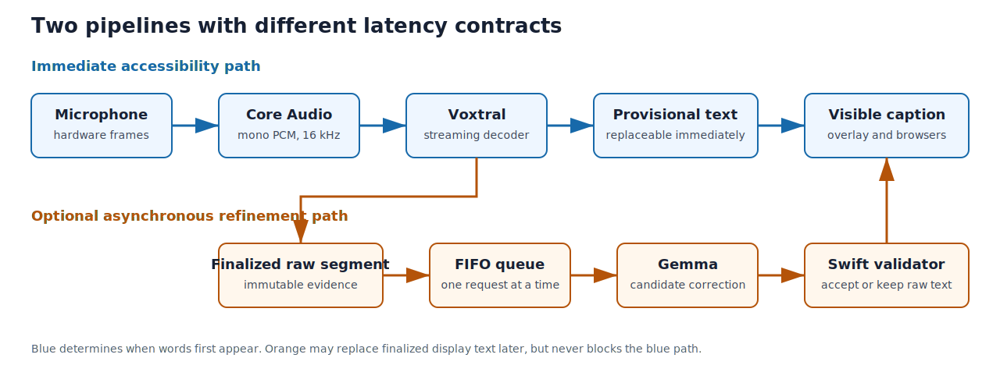
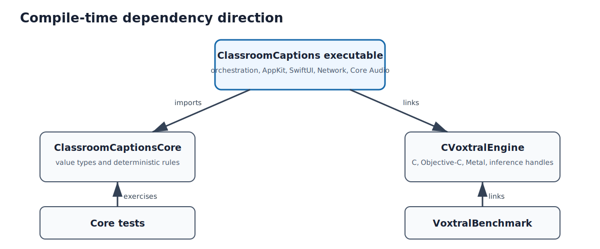
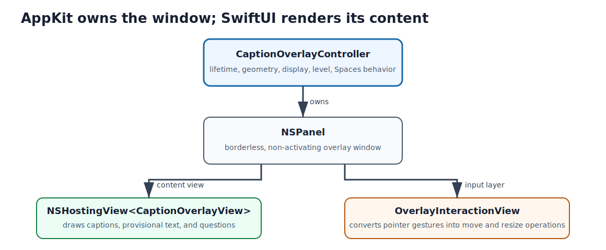

This chapter gives the map required to understand every later source listing.
It starts with what the professor does, follows one audio chunk through all
subsystems, identifies process and concurrency boundaries, and ends with the
order in which the application should be reconstructed.

## What the application does

ClassroomCaptions is a native macOS application for four related tasks:

1. capture a selected microphone and display low-latency local subtitles;
2. optionally improve finalized captions with a slower local language model;
3. present captions in a movable overlay on one selected display;
4. share captions and accept anonymous student questions over local Wi-Fi,
   the Wi-Fi Alliance brand name for IEEE 802.11 wireless networking (not an
   acronym for “Wireless Fidelity”).

The low-latency path and correction path are deliberately different
(@fig-live-caption-pipeline).

{#fig-live-caption-pipeline width=98%}

Voxtral determines when text becomes visible. Gemma never delays the live
caption and never executes instructions found in speech. It returns only a
candidate string; deterministic Swift code decides whether that string is a
plausible correction.

## The executable pieces

| Piece | Process | Responsibility |
| --- | --- | --- |
| `ClassroomCaptions` | main app process | user interface (UI), audio, orchestration, embedded Voxtral, overlay, local server |
| Metal runtime | main app process / graphics processing unit (GPU) | Voxtral tensor operations |
| `mlx_lm.server` | child or reused local process | Gemma correction endpoint on loopback |
| browser client | iPhone/Android/personal computer (PC) browser | caption Server-Sent Events (SSE) viewer or question form |
| `VoxtralBenchmark` | separate command-line interface (CLI) process | model speed and quality measurement |

The application remains useful if Gemma is stopped or Wi-Fi sharing is
disabled. It does not remain useful if microphone capture or Voxtral fails,
because those two components form the accessibility path.

## Source and package boundaries

The Swift package has the dependency directions shown in
@fig-package-boundaries. An arrow points from a client to the module it
imports or links; it is therefore a compile-time dependency, not an audio data
flow.

{#fig-package-boundaries width=94%}

`ClassroomCaptionsCore` contains value types and deterministic rules. It cannot
import AppKit or mutate a window. `CVoxtralEngine` owns C, Objective-C, Metal,
model mappings, and opaque inference handles. The executable target is the only
place where these independent concerns are coordinated.

## A typical course, step by step

### Before students arrive

The professor launches the app and chooses:

- microphone;
- laptop or projector display for the overlay;
- Voxtral model directory and latency/context settings;
- whether Gemma correction and science notation are enabled;
- whether audio/session export is enabled.

These settings are not all equally dynamic. Model backend, recording choice,
and delay are latched when a session starts. Overlay size, display, font, and
visibility can change while a session is running.

### Starting the session

The Start action calls `ClassroomAppModel.startSession()`.

1. The app latches session-sensitive settings.
2. If correction is enabled, Gemma warm-up begins independently.
3. Embedded Voxtral loads model components and creates a stream.
4. The decoder is primed with silence so startup work does not consume the
   first spoken words.
5. Only after Voxtral emits `connected` does the app request/open microphone
   capture and create the optional archive.
6. The session phase changes from `starting` to `listening`.

This ordering explains a design choice visible throughout the source: opening
the microphone first would minimize button-to-capture delay but lose speech
while the model initializes.

## One audio chunk through the system

Assume the hardware provides frames at its native sample rate and channel
layout.

### Core Audio callback

The Audio Unit Hardware Abstraction Layer (AUHAL) calls the render callback on
a real-time audio thread. The callback asks
the Audio Unit to render input, converts it to mono 16 kilohertz (kHz), computes a level,
and emits owned data. It does not await, update SwiftUI, call Gemma, or perform
network input/output (I/O).

### Capture gate

The app model owns an atomic/mutex-protected Boolean gate. During pause or stop,
the gate rejects audio before it enters both Voxtral and the Waveform Audio
File Format (WAV) archive. This
keeps “paused” semantically consistent across transcription and recording.

### Voxtral queue

`VoxtralEmbeddedService` copies/owns the Pulse-Code Modulation (PCM) bytes and
enqueues C calls on one
serial inference queue. The mutable `vox_stream_t` is therefore never entered
concurrently. C transforms only newly stable positions and retains the exact
tails and key-value (KV) attention caches needed for the next chunk.

### Event transfer

Complete token pieces are drained from C and emitted through
`AsyncStream<TranscriptionEvent>`, a Swift asynchronous sequence whose producer
yields events over time. The app model observes the stream and hops to
`@MainActor`, Swift's isolation annotation for state that must be accessed on
the application's main executor, before changing session or UI state.

### Provisional and finalized text

Provisional text is cumulative and replaceable. The timeline stores it
separately from finalized segments. A silence/boundary decision flushes the
stream and turns remaining provisional text into a new immutable raw segment.

## One finalized caption through Gemma

A finalized segment enters a bounded first-in, first-out (FIFO) queue. Only one
correction runs at a time.

1. The worker marks the segment as correcting.
2. Recent finalized captions are copied as context.
3. `GemmaServerController` ensures the loopback MLX-LM (Apple MLX language
   model) endpoint is ready.
4. `GemmaCorrectionService` sends a correction-only prompt.
5. JavaScript Object Notation (JSON) output is decoded into a candidate string
   and token counts.
6. `CaptionCorrectionValidator` checks structure and semantic-distance bounds.
7. Accepted text is attached as `correctedText`; rejected output records a
   correction failure while preserving `rawText`.

The overlay and remote browser display `correctedText` when available and
otherwise display `rawText`.

## Overlay and displays

The dashboard is a normal SwiftUI window. The caption overlay is a borderless,
non-activating `NSPanel`. @fig-overlay-composition distinguishes window
ownership from rendering and pointer handling.

{#fig-overlay-composition width=92%}

Extended desktop allows the overlay to appear only on the professor's screen.
Mirror mode duplicates one framebuffer, so macOS necessarily shows the same
overlay state on both physical displays.

Voice commands are parsed from Voxtral text before lecture text enters the
timeline. Showing, hiding, or clearing changes presentation state, not the
authoritative transcript.

## Local sharing and student questions

When sharing starts, `LocalCaptionServer` creates a Wi-Fi-constrained
`NWListener`, a random viewer capability, and a Uniform Resource Locator (URL)
containing the Mac's Internet Protocol version 4 (IPv4) address. The dashboard
encodes that URL as a Quick Response (QR) symbol.

The caption browser opens one Server-Sent Events (SSE) connection. The app
model publishes a small
snapshot after visible changes; the server JSON-encodes it and emits an SSE
event. Questions use a separate student capability, short-lived source-bound
tickets, bounded JSON Hypertext Transfer Protocol (HTTP) `POST` requests,
normalization, and rate limits.

Browser input is untrusted. It never reaches Gemma and cannot call application
control methods.

## Concurrency and ownership map

| Owner | Mutable resources | Permitted crossings |
| --- | --- | --- |
| Core Audio callback | render buffers and converter callback state | owned PCM/level values out |
| Voxtral inference queue | C model and stream handles | value events out |
| `@MainActor` | session, settings, UI-visible diagnostics, question queue | immutable requests/snapshots out |
| Gemma actor/task | HTTP request sequence | candidate result out |
| network serial queue | listener, connections, tokens, tickets, rate windows | snapshots in, status/questions out |

`Sendable` is a Swift concurrency contract stating that a value may cross an
isolation boundary. It does not make an object magically thread-safe. Each unchecked
conformance in this application is backed by a serial queue, actor, mutex, or a
combination whose responsibilities are documented in the relevant chapter.

## Stopping without losing the last words

Stop first closes the audio gate and stops microphone callbacks. The app then
flushes/drains Voxtral, converts any remaining provisional text into a final
segment, waits for queued corrections up to a deadline, finalizes the session,
writes archive metadata, and finally returns UI state to idle.

The phase permits finalization during `stopping` specifically because model
drain may produce the final spoken words after capture has ended.

## How the rest of this book is organized

Every following implementation chapter uses one structure:

1. purpose and location in the whole application;
2. state, ownership, data-flow, and failure overview;
3. complete source files in repository order;
4. commentary adjacent to each source block;
5. explicit calls, mutations, cleanup paths, and invariants.

No production source file is omitted. The build generator reconstructs every
listed file from the emitted code blocks and compares its bytes with the
repository source. The final tests chapter provides the corresponding
behavioral specifications.

Terms are defined at first use and collected again in the final glossary.
